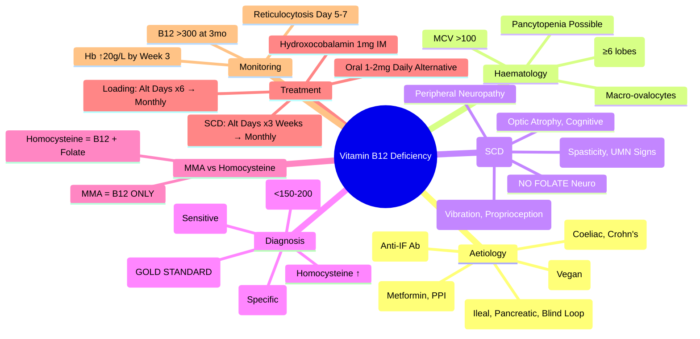

# Vitamin B12 Deficiency Anaemia

## Learning Objectives
- [ ] Diagnose B12 deficiency using B12 levels, MMA, homocysteine
- [ ] Differentiate B12 from folate deficiency and other macrocytic anaemias
- [ ] Recognise neurological complications (subacute combined degeneration)
- [ ] Apply appropriate replacement therapy (IM vs Oral)
- [ ] Identify FCPS/MRCP high-yield diagnostic and management pearls

---

## Definition & Epidemiology

| Feature | Detail |
|---------|--------|
| **Definition** | Megaloblastic anaemia due to impaired DNA synthesis from B12 deficiency |
| **Prevalence** | ~6% in >60y; Higher in vegans, elderly, pernicious anaemia |
| **Daily Requirement** | 2.4 µg/day (increases in pregnancy/lactation) |
| **Body Stores** | **2-5 mg** (3-5 years supply) |
| **Absorption** | **IF-B12 Complex** → Ileal Cubilin Receptor → Portal Blood → Transcobalamin II |

---

## Aetiology: The "3 Ms" (Malabsorption, Malnutrition, Medication)

```mermaid
flowchart TD
    A[B12 Deficiency] --> B{Maldigestion}
    A --> C{Malabsorption}
    A --> D{Increased Demand}
    A --> E{Drugs}
    B --> B1[Achlorhydria (PPI, Age)]
    B --> B2[Pancreatic Insufficiency]
    C --> C1[Pernicious Anaemia (IF Autoantibody)]
    C --> C2[Terminal Ileal Disease (Crohn's, Resection)]
    C --> C3[Blind Loop Syndrome]
    C --> C4[Drugs (Metformin, Colchicine, Neomycin)]
    D --> D1[Pregnancy/Lactation]
    D --> D2[Vegan/Strict Vegetarian]
    E --> E1[Metformin]
    E --> E2[PPI/H2 Blockers (Long-term)]
    E --> E3[Colchicine, Neomycin]
```

---

## Clinical Features

### Haematological
| Feature | Detail |
|---------|--------|
| **Anaemia** | Macrocytic (MCV >100 fL), often severe |
| **MCV** | **>100 fL** (often >110) |
| **Peripheral Smear** | Macro-ovalocytes, hypersegmented neutrophils (≥6 lobes) |
| **Thrombocytopenia** | Mild-Moderate |
| **Leukopenia** | Neutropenia |

### Neurological (Subacute Combined Degeneration - SCD)
| System | Features |
|--------|----------|
| **Posterior Columns** | **Loss of vibration/proprioception**, sensory ataxia, Romberg's +ve |
| **Corticospinal Tracts** | Upper motor neuron signs (spasticity, hyperreflexia, Babinski) |
| **Peripheral Nerves** | Peripheral neuropathy (glove & stocking) |
| **Cognitive** | Memory loss, dementia, psychosis (megaloblastic madness) |
| **Optic Nerve** | Optic atrophy (rare) |

> **FCPS/MRCP**: **Neurological signs can precede anaemia** — **SCD can occur without anaemia**. **Vitamin B12 deficiency = only megaloblastic anaemia with neurological signs**.

---

## Aetiology Deep Dive

### 1. Pernicious Anaemia (Most Common Cause)
| Feature | Detail |
|---------|--------|
| **Pathogenesis** | **Autoimmune** — Anti-IF Antibody (blocks IF-B12 binding) + Anti-Parietal Cell Antibody |
| **Demographics** | >60y, Female > Male, Autoimmune Diseases (Thyroid, Vitiligo, T1DM) |
| **Histology** | Atrophic Gastritis (Loss of Parietal Cells) |
| **Associated** | **Anti-IF Ab** (70% sensitive), **Anti-Parietal Cell Ab** (90% sensitive, less specific) |

### 2. Food-B12 Malabsorption
- Achlorhydria (Age, PPIs) → Cannot cleave B12 from food proteins
- Normal Schilling Test with Free B12, Abnormal with Food-B12

### 3. Drug-Induced
| Drug | Mechanism |
|------|-----------|
| **Metformin** | ↓ Calcium-dependent IF-B12 ileal uptake |
| **PPI/H2 Blockers** | ↓ Acid → Impaired food-B12 release |
| **Colchicine** | ↓ Ileal uptake |
| **Neomycin** | ↓ Absorption |

---

## Clinical Features Summary

| System | Key Features |
|--------|--------------|
| **General** | Fatigue, pallor, dyspnoea, glossitis, angular stomatitis |
| **Haematological** | Macrocytosis (MCV >100), Hypersegmented Neutrophils (≥6 lobes), Thrombocytopenia, Leukopenia |
| **Neurological** | **SCD**: Posterior + Lateral Column Degeneration, Peripheral Neuropathy, Optic Atrophy, Cognitive/Psychiatric |
| **GI** | Glossitis, Angular Stomatitis, Diarrhoea, Anorexia |
| **Cardiac** | High-output Failure (Severe), Flow Murmur |

> **FCPS/MRCP**: **High-index MCV >115 with normal Hb = B12/Folate Deficiency**; **Neurological signs may PRECEDE anaemia**.

---

## Diagnostic Algorithm

```mermaid
flowchart TD
    A[Macrocytic Anaemia (MCV >100)] --> B[Check B12 & Folate]
    B --> C{B12 Low?}
    C -->|Yes| D[Check MMA & Homocysteine]
    D --> E{B12 Low + MMA↑ + Homocysteine↑}
    E -->|Yes| F[Confirm B12 Deficiency]
    E -->|No| G[Consider Folate Deficiency / Other]
    C -->|Borderline| H[Check MMA/Homocysteine]
    H --> I{MMA↑?}
    I -->|Yes| J[Functional B12 Deficiency]
    I -->|No| K[Other Causes of Macrocytosis]
```

---

## Investigations

### First-Line
| Test | Expected in B12 Deficiency |
|------|---------------------------|
| **Serum B12** | **Low (<150-200 pg/mL)** |
| **MMA (Methylmalonic Acid)** | **Elevated** (Most Sensitive & Specific) |
| **Homocysteine** | **Elevated** (Also Elevated in Folate Deficiency) |
| **Hb/MCV** | Macrocytic (MCV >100, often >110) |
| **Peripheral Smear** | Macro-ovalocytes, Hypersegmented Neutrophils (≥6 lobes) |

### Confirmatory / Aetiology
| Test | Indication |
|-------|------------|
| **Anti-IF Antibody** | **Pernicious Anaemia** (Specific 95%) |
| **Anti-Parietal Cell Antibody** | Sensitive (90%) but Low Specificity |
| **Gastrin** | ↑ in Pernicious Anaemia (Achlorhydria) |
| **sGastric Intrinsic Factor** | Low in Pernicious Anaemia |

> **FCPS/MRCP**: **MMA is the GOLD STANDARD** — **Elevated in B12 Deficiency ONLY** (Normal in Folate Deficiency). **Homocysteine Elevated in BOTH B12 & Folate Deficiency**.

---

## B12 vs Folate Deficiency

| Feature | **B12 Deficiency** | **Folate Deficiency** |
|---------|-------------------|----------------------|
| **MCV** | >100 (often >110) | >100 |
| **Neurological Signs** | **YES (SCD)** | **NO** |
| **Serum B12** | **Low** | Normal |
| **Serum Folate** | Normal | **Low** |
| **RBC Folate** | Normal | **Low** |
| **MMA** | **Elevated** | Normal |
| **Homocysteine** | **Elevated** | **Elevated** |
| **Neurological Signs** | **SCD (Posterior + Lateral Columns)** | **Absent** |
| **Pregnancy** | Not specific | **Common** (Increased demand) |

> **FCPS/MRCP**: **MMA = ONLY elevated in B12 deficiency**; **Homocysteine = Elevated in BOTH**. **Neurological signs = B12 ONLY**.

---

## Treatment

### Parenteral B12 (Standard)
| Preparation | Dose | Regimen |
|-------------|------|---------|
| **Hydroxocobalamin** (Preferred) | **1mg IM** | **Alternate Days × 6 Doses** (Loading) → **1mg IM Monthly** (Maintenance) |
| **Cyanocobalamin** | 1mg IM | Loading: Weekly × 4-6; Monthly Maintenance |

### Oral B12 (Alternative)
| Indication | Dose |
|-----------|------|
| Mild Deficiency / Patient Preference | **1-2 mg Daily Oral** (High-dose passive absorption ~1%) |
| Maintenance (Post Parenteral Loading) | 1-2 mg Daily |

> **Oral B12 is effective** — ~1% absorbed passively; **1-2mg daily = 10-20µg absorbed** (daily requirement 2.4µg).

### Neurological Involvement (SCD)
| Regimen | Duration |
|---------|---------|
| **Hydroxocobalamin 1mg IM** | **Alternate Days × 3 Weeks** → Then Monthly |
| **Monitor** | Neurological Improvement (Months to Years; May Be Incomplete) |

---

## Monitoring Response

| Parameter | Timeline | Target |
|-----------|---------|--------|
| **Reticulocytosis** | **Days 3-5** | Peak Day 7-10 |
| **Hb Rise** | **≥20 g/L by Week 3** | Hb Normalisation by 6-8 Weeks |
| **MCV Normalisation** | 8-12 Weeks | MCV <100 fL |
| **Neurological Improvement** | Months-Years | May Be Incomplete (SCD) |
| **B12 Level** | 3 Months | >300 pg/mL |

---

## FCPS/MRCP High-Yield Summary

| Concept | Key Points |
|---------|------------|
| **Commonest Cause** | **Pernicious Anaemia** (Autoimmune Anti-IF) |
| **Key Haematological** | **MCV >100**, **Hypersegmented Neutrophils (≥6 lobes)**, Macro-ovalocytes |
| **Neurological** | **SCD = Posterior + Lateral Columns** (ONLY in B12, NOT Folate) |
| **Diagnostic Triad** | **Low B12 + Elevated MMA + Elevated Homocysteine** |
| **Gold Standard Test** | **MMA (Methylmalonic Acid) — Elevated in B12 Def ONLY** |
| **Pernicious Anaemia** | Anti-IF Ab (Specific), Anti-Parietal Cell Ab (Sensitive) |
| **Treatment** | **Hydroxocobalamin 1mg IM** — Loading ×6 Days → Monthly |
| **Neurological SCD** | **Posterior + Lateral Columns**; **Only B12 NOT Folate** |
| **MMA vs Homocysteine** | MMA ↑ = B12 Only; Homocysteine ↑ = B12 + Folate |
| **Oral B12** | **1-2mg Daily Effective** (1% passive absorption) |

---

## Viva Questions

1. **How do you differentiate B12 from Folate Deficiency?**
2. **Why does B12 cause neurological signs but Folate does not?**
3. **What is the role of MMA and Homocysteine in diagnosis?**
3. **What is Pernicious Anaemia? Autoantibodies?**
4. **How do you treat B12 Deficiency? IM vs Oral?**
4. **What is Subacute Combined Degeneration? Which columns affected?**
5. **Why does Folate Deficiency not cause neurological signs?**
5. **How do you diagnose B12 Deficiency with borderline B12 levels?**
6. **What is the role of MMA vs Homocysteine?**
6. **Can Oral B12 replace Parenteral?**
7. **Why does Metformin cause B12 Deficiency?**
7. **How do you monitor response to B12 therapy?**
8. **What is the Schilling Test? (Historical)**

---

## Confusions & Mnemonics

| Confusion | Clarification |
|-----------|---------------|
| **B12 vs Folate Neurology** | **B12 = SCD (Posterior + Lateral Columns)**; **Folate = NO Neuro** |
| **MMA vs Homocysteine** | **MMA ↑ = B12 ONLY**; **Homocysteine ↑ = B12 + Folate** |
| **Pernicious Anaemia Mechanism** | **Anti-IF Antibody → Block IF-B12 Binding** |
| **B12 Absorption** | **Stomach: Acid + Pepsin → B12 Release → IF Binding → Ileal Cubilin Receptor** |
| **Metformin B12 Def** | **Ca²⁺-dependent IF-B12 Uptake Inhibited** → Calcium Supplementation Helps |
| **Oral B12 Efficacy** | **1-2mg Daily = Effective** (Passive Diffusion 1% of 1000µg = 10µg Absorbed) |
| **Neurological Recovery** | **May Be Incomplete** — Early Treatment Critical; SCD Recovery Months-Years |
| **Folate in B12 Def** | **Dangerous** — May Correct Anaemia But **Worsen Neurology** |

---

## Mind Map



---

## One-Page Revision Card

| **B12 Deficiency** | **Key Features** |
|---------------------|------------------|
| **MCV** | **>100 fL** (Often >110) |
| **Blood Film** | Macro-ovalocytes, Hypersegmented Neutrophils (≥6 lobes) |
| **Neurology** | **SCD: Posterior + Lateral Columns** (Only B12) |
| **Serum B12** | **<150-200 pg/mL** |
| **MMA** | **↑ (Gold Standard - B12 Only)** |
| **Homocysteine** | **↑** (Both B12 & Folate) |
| **Anti-IF Ab** | Specific for Pernicious Anaemia |
| **Treatment** | **Hydroxocobalamin 1mg IM** (Alt Days x6 → Monthly) |
| **Oral Option** | 1-2mg Daily (Effective via Passive Diffusion) |

| **B12 vs Folate** | **B12** | **Folate** |
|-------------------|---------|------------|
| **Neurology** | **SCD (Yes)** | **No** |
| **MMA** | **↑** | Normal |
| **Homocysteine** | **↑** | **↑** |
| **Neurological Signs** | **Posterior + Lateral Columns** | **Absent** |

| **Treatment** | **Regimen** |
|---------------|-------------|
| **IM Hydroxocobalamin** | 1mg Alt Days ×6 → Monthly |
| **Oral** | 1-2mg Daily (Effective) |
| **SCD** | 1mg Alt Days ×3 Weeks → Monthly |

---

## Spaced Repetition Tracker

| Day | 1 | 3 | 7 | 15 | 30 |
|-----|---|---|---|---|---|
| B12 vs Folate Differentiation | ☐ | ☐ | ☐ | ☐ | ☐ |
| MMA vs Homocysteine | ☐ | ☐ | ☐ | ☐ | ☐ |
| SCD Columns Affected | ☐ | ☐ | ☐ | ☐ | ☐ |
| Pernicious Anaemia Antibodies | ☐ | ☐ | ☐ | ☐ | ☐ |
| Treatment Regimens | ☐ | ☐ | ☐ | ☐ | ☐ |

---

## Self-Test Scorecard

| Question | My Answer | Correct? |
|----------|-----------|----------|
| B12 vs Folate Neurology |  |  |
| MMA vs Homocysteine |  |  |
| SCD Columns |  |  |
| Pernicious Anaemia Antibodies |  |  |
| Treatment Regimen |  |  |

---

## Local Navigation

- [[Anaemia and Red Cell Disorders/Macrocytic Anaemia|Macrocytic Anaemia Overview]]
- [[Anaemia and Red Cell Disorders/Folate Deficiency|Folate Deficiency]]
- [[Anaemia and Red Cell Disorders/Megaloblastic Anaemia|Megaloblastic Anaemia Overview]]
- [[Neurology/Subacute Combined Degeneration|SCD Detail]]
- [[Inherited and Metabolic Liver Disease/Pernicious Anaemia|Pernicious Anaemia Pathophysiology]]
---

> Auto-generated study sections for "Hematology" — Ch 24: Haematology & Transfusion Medicine.

## Flashcards (47 generated)

- Q: What is the definition of Hematology?
  A: Megaloblastic anaemia due to impaired DNA synthesis from B12 deficiency
- Q: What is the epidemiology of Hematology?
  A: ~6% in >60y; Higher in vegans, elderly, pernicious anaemia
- Q: What is Daily Requirement of Hematology?
  A: 2.4 µg/day (increases in pregnancy/lactation)
- Q: What is Body Stores of Hematology?
  A: 2-5 mg (3-5 years supply)
- Q: What is Absorption of Hematology?
  A: IF-B12 Complex → Ileal Cubilin Receptor → Portal Blood → Transcobalamin II
- Q: What is the pathogenesis of Hematology?
  A: Autoimmune — Anti-IF Antibody (blocks IF-B12 binding) + Anti-Parietal Cell Antibody
- Q: What is Demographics of Hematology?
  A: >60y, Female > Male, Autoimmune Diseases (Thyroid, Vitiligo, T1DM)
- Q: What is Histology of Hematology?
  A: Atrophic Gastritis (Loss of Parietal Cells)
- Q: What is Associated of Hematology?
  A: Anti-IF Ab (70% sensitive), Anti-Parietal Cell Ab (90% sensitive, less specific)
- Q: What is Serum B12 of Hematology?
  A: Low (<150-200 pg/mL)
- Q: What is MMA (Methylmalonic Acid) of Hematology?
  A: Elevated (Most Sensitive & Specific)
- Q: What is Homocysteine of Hematology?
  A: Elevated (Also Elevated in Folate Deficiency)
- Q: What is Hb/MCV of Hematology?
  A: Macrocytic (MCV >100, often >110)
- Q: What is Peripheral Smear of Hematology?
  A: Macro-ovalocytes, Hypersegmented Neutrophils (≥6 lobes)
- Q: What is Anti-IF Antibody of Hematology?
  A: Pernicious Anaemia (Specific 95%)
- Q: What is Anti-Parietal Cell Antibody of Hematology?
  A: Sensitive (90%) but Low Specificity
- Q: What is Gastrin of Hematology?
  A: ↑ in Pernicious Anaemia (Achlorhydria)
- Q: What is sGastric Intrinsic Factor of Hematology?
  A: Low in Pernicious Anaemia
- Q: What is Mild Deficiency / Patient Preference of Hematology?
  A: 1-2 mg Daily Oral (High-dose passive absorption ~1%)
- Q: What is Maintenance (Post Parenteral Loading) of Hematology?
  A: 1-2 mg Daily
- Q: What is Hydroxocobalamin 1mg IM of Hematology?
  A: Alternate Days × 3 Weeks → Then Monthly
- Q: How is Hematology monitored?
  A: Neurological Improvement (Months to Years; May Be Incomplete)
- Q: What is the pathogenesis of Hematology?
  A: Autoimmune — Anti-IF Antibody (blocks IF-B12 binding) + Anti-Parietal Cell Antibody
- Q: What is Demographics of Hematology?
  A: >60y, Female > Male, Autoimmune Diseases (Thyroid, Vitiligo, T1DM)
- Q: What is Histology of Hematology?
  A: Atrophic Gastritis (Loss of Parietal Cells)
- Q: What is Serum B12 of Hematology?
  A: Low (<150-200 pg/mL)
- Q: What is MMA (Methylmalonic Acid) of Hematology?
  A: Elevated (Most Sensitive & Specific)
- Q: What is Homocysteine of Hematology?
  A: Elevated (Also Elevated in Folate Deficiency)
- Q: What is Hb/MCV of Hematology?
  A: Macrocytic (MCV >100, often >110)
- Q: What is Anti-IF Antibody of Hematology?
  A: Pernicious Anaemia (Specific 95%)
- Q: What is Anti-Parietal Cell Antibody of Hematology?
  A: Sensitive (90%) but Low Specificity
- Q: What is Gastrin of Hematology?
  A: ↑ in Pernicious Anaemia (Achlorhydria)
- Q: What is sGastric Intrinsic Factor of Hematology?
  A: Low in Pernicious Anaemia
- Q: What is Mild Deficiency / Patient Preference of Hematology?
  A: 1-2 mg Daily Oral (High-dose passive absorption ~1%)
- Q: What is Maintenance (Post Parenteral Loading) of Hematology?
  A: 1-2 mg Daily
- Q: What is Hydroxocobalamin 1mg IM of Hematology?
  A: Alternate Days × 3 Weeks → Then Monthly
- Q: How is Hematology monitored?
  A: Neurological Improvement (Months to Years; May Be Incomplete)
- Q: What causes Hematology?
  A: Pernicious Anaemia (Autoimmune Anti-IF)
- Q: What is Key Haematological of Hematology?
  A: MCV >100, Hypersegmented Neutrophils (≥6 lobes), Macro-ovalocytes
- Q: What is Neurological of Hematology?
  A: SCD = Posterior + Lateral Columns (ONLY in B12, NOT Folate)
- Q: What is Diagnostic Triad of Hematology?
  A: Low B12 + Elevated MMA + Elevated Homocysteine
- Q: What is the investigation of choice for Hematology?
  A: MMA (Methylmalonic Acid) — Elevated in B12 Def ONLY
- Q: What is Pernicious Anaemia of Hematology?
  A: Anti-IF Ab (Specific), Anti-Parietal Cell Ab (Sensitive)
- Q: How is Hematology managed?
  A: Hydroxocobalamin 1mg IM — Loading ×6 Days → Monthly
- Q: What is Neurological SCD of Hematology?
  A: Posterior + Lateral Columns; Only B12 NOT Folate
- Q: What is MMA vs Homocysteine of Hematology?
  A: MMA ↑ = B12 Only; Homocysteine ↑ = B12 + Folate
- Q: What is Oral B12 of Hematology?
  A: 1-2mg Daily Effective (1% passive absorption)

## MCQs (1 generated)

1. **Which of the following best describes Hematology?**
   A. **## Aetiology: The "3 Ms" (Malabsorption, Malnutrition, Medication)**
   B. An unrelated condition not matching the clinical picture of Hematology
   C. A complication seen late in the disease course of Hematology
   D. A condition that mimics Hematology but has a different underlying cause

## SBA Questions (1 generated)

1. A patient with suspected Hematology presents with: Definition — Megaloblastic anaemia due to impaired DNA synthesis from B12 deficiency; Prevalence — ~6% in >60y; Higher in vegans, elderly, pernicious anaemia; Daily Requirement — 2.4 µg/day (increases in pregnancy/lactation). What is the most likely diagnosis?
   A. **Hematology**
   B. A condition that mimics Hematology but is not the same entity
   C. A complication of Hematology rather than the primary diagnosis
   D. An unrelated condition in the same clinical category as Hematology

## PasTest Scenario SBAs (Clinical Vignettes)

> **Auto-generated PasTest/Mediscope-style scenario SBAs** grounded in the authored source. Each scenario tests a real clinical fact (triad, specific sign, contraindication, trial, first-line Rx) extracted from the topic. *Source: Ch 24: Haematology — Vitamin B12 Deficiency Anaemia*

**Q1.** Which of the following features is most specific or characteristic of Vitamin B12 Deficiency Anaemia?

  - **A.** MMA
  - **B.** A feature common to many acute inflammatory conditions
  - **C.** A non-specific sign that does not localise the diagnosis
  - **D.** An investigation finding rather than a clinical feature

  > **Answer: A** — MMA
  >
  > *Source:* ---
### First-Line
| Test | Expected in B12 Deficiency |
|------|---------------------------|
| **Serum B12** | **Low (<150-200 pg/mL)** |
| **MMA (Methylmalonic Acid)** | **Elevated** (Most Sensitive

