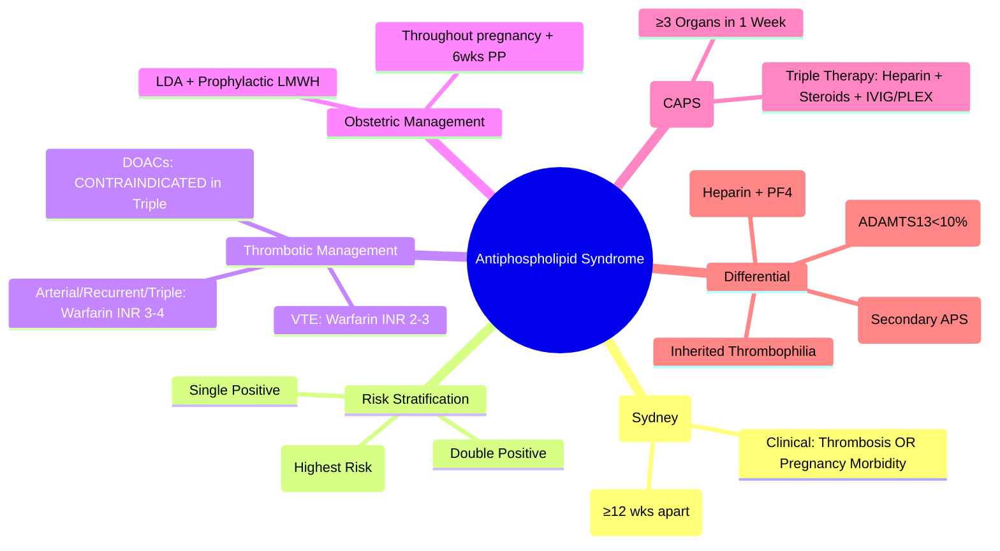

# Antiphospholipid Syndrome (APS)

> [!info] **Davidson Ch 25 Alignment**: Bleeding and Thrombotic Disorders → Thrombophilia → Antiphospholipid Syndrome
> **FCPS/MRCP Focus**: Clinical + Laboratory criteria (Sydney 2006), triple positivity, warfarin INR 3-4, catastrophic APS (CAPS), pregnancy criteria, DOACs contraindicated in high-risk

---

## 🎯 Learning Objectives

- [ ] Define APS: **Thrombosis (venous/arterial) or Pregnancy morbidity** + **Persistent antiphospholipid antibodies** (aPL)
- [ ] Apply **Sydney Classification Criteria (2006)**: 1 Clinical + 1 Laboratory criterion (confirmed ≥12 weeks apart)
- [ ] Interpret **aPL panel**: **Lupus Anticoagulant (LA)**, **Anti-cardiolipin (aCL) IgG/IgM**, **Anti-β2-Glycoprotein I (anti-β2GPI) IgG/IgM**
- [ ] Understand **Triple Positivity** = Highest thrombosis risk
- [ ] Manage **Thrombotic APS**: **Warfarin INR 3-4** (arterial/thrombosis recurrence); **DOACs contraindicated in triple positive**
- [ ] Manage **Obstetric APS**: **LDA + Prophylactic LMWH** throughout pregnancy ± postpartum
- [ ] Recognise **Catastrophic APS (CAPS)**: Multi-organ thrombosis, high mortality – **Triple therapy (Anticoagulation + Steroids + IVIG/Plasma Exchange)**
- [ ] Differentiate from **SLE, HIT, TTP, DIC, inherited thrombophilia**

---

## 📖 Definition & Classification Criteria (Sydney 2006)

### Clinical Criteria (1 required)

| Criterion | Details |
|-----------|---------|
| **Vascular Thrombosis** | **≥1 episode** of arterial, venous, or small vessel thrombosis (objective imaging/histology) |
| **Pregnancy Morbidity** | **≥1** unexplained fetal death ≥10 weeks; **≥1** premature birth <34w (eclampsia/severe PE/placental insufficiency); **≥3** consecutive unexplained miscarriages <10 weeks |

### Laboratory Criteria (1 required, confirmed ≥12 weeks apart)

| Test | Positive Threshold |
|------|-------------------|
| **Lupus Anticoagulant (LA)** | **Positive** per ISTH guidelines (dRVVT/PTT based) |
| **Anti-cardiolipin (aCL) IgG/IgM** | **>40 GPL/MPL** (or >99th percentile) |
| **Anti-β2-Glycoprotein I (anti-β2GPI) IgG/IgM** | **>40 SGU/SMU** (or >99th percentile) |

> [!tip] **FCPS/MRCP**: **APS = Clinical (Thrombosis OR Pregnancy morbidity) + Lab (LA / aCL / anti-β2GPI) Persistent ≥12 weeks**. **Triple positivity (LA + aCL + anti-β2GPI) = Highest risk**. **Warfarin INR 3-4 for arterial/recurrent**. **DOACs contraindicated in triple positive**.

---

## ⚙️ Pathophysiology

```mermaid
flowchart TD
    A[Antiphospholipid Antibodies (aPL)] --> B[Target: β2-Glycoprotein I (β2GPI) on Phospholipid Surfaces]
    B --> C1[Endothelial Activation → TF Expression, Adhesion Molecules]
    B --> C2[Platelet Activation → Aggregation, Microparticles]
    B --> C3[Complement Activation (C5a) → Inflammation]
    B --> C4[Inhibition of Anticoagulant Pathways: Protein C/S, TFPI, Annexin A5 Shield]
    C1 & C2 & C3 & C4 --> D[**Prothrombotic State**: Thrombosis (Venous/Arterial) + Pregnancy Loss]
    D --> E[**Clinical APS**]
```

---

## 🔬 Diagnostic Workup

```mermaid
flowchart TD
    A[Thrombosis (Unusual Site/Recurrent) OR Recurrent Pregnancy Loss] --> B[**aPL Panel**]
    B --> C1[**Lupus Anticoagulant (LA)** - dRVVT, aPTT-based]
    B --> C2[**Anti-cardiolipin (aCL) IgG/IgM** - ELISA]
    B --> C3[**Anti-β2-GPI IgG/IgM** - ELISA]
    C1 & C2 & C3 --> D{**Positive ≥12 Weeks Apart?**}
    D -->|Yes| E[**APS Diagnosed**]
    D -->|No| F[Not APS (transient aPL common in infections, drugs)]
    E --> G[**Risk Stratification: Single vs Double vs Triple Positivity**]
    G --> H[**Associated Workup: SLE screen (ANA, dsDNA), Renal, Liver, Lipids**]
```

### Key Points on Testing

| Test | Principle | Notes |
|------|-----------|-------|
| **Lupus Anticoagulant (LA)** | **Phospholipid-dependent clotting prolongation** (dRVVT, aPTT) | **Most specific**; Not affected by anticoagulation if interpreted correctly |
| **aCL IgG/IgM** | ELISA against cardiolipin/β2GPI complex | **Standardised (GPL/MPL units)** |
| **Anti-β2GPI IgG/IgM** | ELISA against β2GPI | **More specific than aCL** |
| **Timing** | **Confirm ≥12 weeks apart** | Transient aPL in infections, drugs, postpartum |

---

## 🩺 Clinical Manifestations

### Thrombotic APS
| Site | Examples |
|------|----------|
| **Venous** | DVT, PE, **Cerebral venous sinus**, Portal/hepatic vein (Budd-Chiari), Renal vein, Adrenal vein |
| **Arterial** | **Stroke/TIA** (young), MI, Peripheral arterial, Retinal artery occlusion |
| **Microvascular** | Livedo reticularis/racemosa, Skin ulcers, Nephropathy (thrombotic microangiopathy), Cardiac valvulopathy (Libman-Sacks) |

### Obstetric APS
- **Early loss** (<10 weeks): ≥3 consecutive
- **Late loss** (≥10 weeks): ≥1 unexplained fetal death
- **Preterm** (<34w): ≥1 due to severe PE, eclampsia, placental insufficiency

### "Non-criteria" Manifestations
- **Thrombocytopenia** (mild-moderate)
- **Livedo reticularis/racemosa**
- **Cardiac valvular disease** (Libman-Sacks endocarditis)
- **Nephropathy** (APS nephropathy)
- **Cognitive dysfunction**
- **Autoimmune haemolytic anaemia** (Evans syndrome)

---

## 💊 Management

### Thrombotic APS (VTE / Arterial Thrombosis)

| Scenario | Anticoagulation | Target |
|----------|-----------------|--------|
| **First Venous Thrombosis** | **Warfarin** | **INR 2-3** (standard) |
| **Arterial Thrombosis** (Stroke, MI) | **Warfarin** | **INR 3-4** (higher intensity) |
| **Recurrent VTE on INR 2-3** | **Warfarin** | **INR 3-4** (or add LDA 75-100mg) |
| **Triple Positive / High Risk** | **Warfarin** | **INR 3-4** (avoid DOACs) |

> [!warning] **DOACs (Rivaroxaban, Apixaban) CONTRAINDICATED in Triple Positive APS** (TRAPS, ASTRO-APS, RAPS trials: ↑ arterial thrombosis). **Warfarin preferred**.

### Obstetric APS

| Regimen | Details |
|---------|---------|
| **Prophylactic** | **LDA 75-100 mg daily** (start pre-conception/early pregnancy) + **Prophylactic LMWH** (Enoxaparin 40mg daily) throughout pregnancy + **6 weeks postpartum** |
| **Prior Thrombosis** | **Therapeutic LMWH** (Enoxaparin 1mg/kg BD) + **LDA** throughout pregnancy + **6-12 weeks postpartum** |
| **Monitoring** | Monthly CBC, renal function, anti-Xa (if therapeutic LMWH), uterine artery Doppler |

### Catastrophic APS (CAPS) – **Medical Emergency**

| Definition | ≥3 Organ systems thrombosed within 1 week + aPL + Histology (small vessel thrombosis) |
|------------|---------------------------------------------------------------------------------------|
| **Mortality** | **~50%** |
| **Triple Therapy** | 1. **Full Anticoagulation** (Heparin/LMWH) 2. **High-dose Steroids** (Methylprednisolone 1g IV × 3-5d) 3. **IVIG 0.4g/kg/day × 5d** OR **Plasma Exchange** (5-7 exchanges) |
| **Adjuncts** | **Rituximab**, **Eculizumab** (complement inhibition), **Cyclophosphamide** |

---

## 🔄 Differential Diagnosis

| Condition | Distinguishing Features |
|-----------|------------------------|
| **SLE** | APS may be **primary** or **secondary (SLE-associated)**; SLE has additional criteria (ANA, dsDNA, renal, etc.) |
| **HIT** | **Heparin exposure 5-14d**, PF4/heparin Ab+, thrombosis; **APS = no heparin requirement** |
| **TTP** | **ADAMTS13<10%, Schistocytes, MAHA**; **APS = no MAHA, normal ADAMTS13** |
| **DIC** | **PT↑, Fibrinogen↓, D-dimer↑↑**, consumptive; **APS = normal PT/Fibrinogen** |
| **Inherited Thrombophilia** | **Factor V Leiden, Prothrombin G20210A, Protein C/S/AT deficiency**; **APS = acquired aPL** |
| **Malignancy** | Cancer-associated thrombosis; **APS = aPL positive** |

---

## 💡 FCPS/MRCP High-Yield Summary

| Topic | Key Point |
|-------|-----------|
| **Diagnosis** | **1 Clinical (Thrombosis/Pregnancy loss) + 1 Lab (LA/aCL/anti-β2GPI) ≥12 weeks apart** |
| **Triple Positivity** | **LA + aCL + anti-β2GPI** = **Highest thrombosis risk** |
| **Warfarin Target** | **VTE: INR 2-3**; **Arterial/Recurrent: INR 3-4**; **Triple positive: INR 3-4** |
| **DOACs** | **CONTRAINDICATED in Triple Positive APS** (↑ arterial events) |
| **Obstetric APS** | **LDA + Prophylactic LMWH** throughout pregnancy + 6wks postpartum |
| **CAPS** | **≥3 organs in 1 week**; **Triple therapy: Heparin + Steroids + IVIG/PLEX** |
| **Livedo Reticularis** | Common cutaneous sign; **Livedo racemosa = more specific** |
| **Libman-Sacks Endocarditis** | Non-bacterial verrucous valvular lesions (mitral > aortic) |
| **Thrombocytopenia** | Mild-moderate common in APS |

---

## ❓ Viva Questions

1. **What are the Sydney classification criteria for APS?**
   - **1 Clinical** (Thrombosis OR Pregnancy morbidity) + **1 Lab** (LA, aCL IgG/IgM, anti-β2GPI IgG/IgM) **confirmed ≥12 weeks apart**

2. **What constitutes triple positivity in APS and its significance?**
   - **Positive LA + aCL IgG/IgM + anti-β2GPI IgG/IgM** = **Highest thrombosis risk, requires higher INR, DOACs contraindicated**

3. **What is the target INR for warfarin in APS?**
   - **VTE: INR 2-3**; **Arterial thrombosis / Recurrent VTE / Triple positive: INR 3-4**

4. **Why are DOACs contraindicated in triple positive APS?**
   - **TRAPS, ASTRO-APS, RAPS trials** showed **↑ arterial thrombosis** (stroke, MI) with rivaroxaban/apixaban vs warfarin

5. **How is obstetric APS managed?**
   - **LDA 75-100mg daily + Prophylactic LMWH** (enoxaparin 40mg daily) pre-conception through pregnancy + 6 weeks postpartum

6. **What is Catastrophic APS (CAPS) and its treatment?**
   - **≥3 organs thrombosed within 1 week + aPL + small vessel thrombosis on histology**; **Triple therapy: Heparin + High-dose Steroids + IVIG/PLEX**

5. **What is the difference between Primary and Secondary APS?**
   - **Primary APS**: No associated autoimmune disease; **Secondary APS**: Associated with SLE (most common), other connective tissue diseases

6. **Can a transient aPL be diagnostic of APS?**
   - **No** – must be **persistent ≥12 weeks apart** (transient aPL occur in infections, drugs, postpartum)

7. **What is the significance of Lupus Anticoagulant vs aCL vs anti-β2GPI?**
   - **LA = Most specific for thrombosis**; **anti-β2GPI = More specific than aCL**; **Triple = Highest risk**

8. **How does APS differ from HIT?**
   - **HIT: Heparin exposure 5-14d, PF4/heparin Ab+**; **APS: No heparin requirement, aPL+ (LA/aCL/anti-β2GPI)**

9. **What is the role of thrombocytopenia in APS?**
   - **Mild-moderate thrombocytopenia common** (immune-mediated); **Severe thrombocytopenia suggests TTP/HIT/DIC**

10. **Can APS occur without thrombosis or pregnancy loss?**
    - **No** – clinical criterion (thrombosis OR pregnancy morbidity) is mandatory for diagnosis

---

## 🧠 Confusions & Mnemonics

| Confusion | Clarification |
|-----------|---------------|
| **APS vs SLE** | **APS = aPL + Clinical**; **SLE = ACR/EULAR criteria** (APS can be secondary to SLE) |
| **APS vs HIT** | **HIT: Heparin exposure, PF4 Ab**; **APS: No heparin, LA/aCL/anti-β2GPI** |
| **APS vs TTP** | **TTP: ADAMTS13<10%, MAHA, Schistocytes**; **APS: No MAHA, Normal ADAMTS13** |
| **DOACs in APS** | **Contraindicated in TRIPLE POSITIVE**; may consider in single/low-risk (off-label) |
| **INR Target** | **VTE = 2-3**; **Arterial/Recurrent/Triple = 3-4** |

| Mnemonic | Meaning |
|----------|---------|
| **"APS = Clinical + Lab × 2 (12 weeks apart)"** | Diagnosis |
| **"Triple = LA + aCL + anti-β2GPI = High Risk"** | Risk stratification |
| **"Warfarin: VTE=2-3, Arterial/Triple=3-4"** | INR targets |
| **"DOAC = NO in Triple Positive"** | Contraindication |
| **"Obstetric = LDA + LMWH"** | Pregnancy management |
| **"CAPS = 3 Organs + 1 Week + Heparin/Steroids/IVIG-PLEX"** | Catastrophic APS |

---

## 🗺️ Mind Map



---

## 📋 One-Page Revision Card

| **ANTIPHOSPHOLIPID SYNDROME – FCPS/MRCP REVISION CARD** |
|----------------------------------------------------------|
| **Diagnosis**: **1 Clinical (Thrombosis/Pregnancy Loss) + 1 Lab (LA/aCL/anti-β2GPI) ≥12 weeks apart** |
| **Triple Positivity**: **LA + aCL + anti-β2GPI** = **Highest Risk** |
| **Warfarin INR**: **VTE 2-3**; **Arterial/Recurrent/Triple 3-4** |
| **DOACs**: **CONTRAINDICATED in Triple Positive** (↑ arterial events) |
| **Obstetric APS**: **LDA 75-100mg + Prophylactic LMWH** (pre-conception → 6wks PP) |
| **CAPS**: **≥3 Organs in 1 Week** → **Heparin + Steroids + IVIG/PLEX** |
| **Livedo Racemosa**: Specific cutaneous sign |
| **Libman-Sacks**: Non-bacterial verrucous valvulopathy |
| **Thrombocytopenia**: Common (immune-mediated) |

---

## 📅 Spaced Repetition Tracker

| Review | Date | Score (1-5) | Next Review |
|--------|------|-------------|-------------|
| Day 1 | 2025-06-16 | | 2025-06-17 |
| Day 3 | | | |
| Day 7 | | | |
| Day 15 | | | |
| Day 30 | | | |

---

## 🎯 Must Know / Should Know / Nice to Know

| Level | Content |
|-------|---------|
| **Must Know** | Sydney criteria, triple positivity, INR targets (2-3 vs 3-4), DOAC contraindication in triple positive, obstetric management (LDA+LMWH), CAPS definition & triple therapy, LA vs aCL vs anti-β2GPI, differentiate from HIT/TTP/SLE |
| **Should Know** | CAPS registry data, non-criteria manifestations (nephropathy, cognitive, cardiac), aPL testing methodology (dRVVT, mixing studies), warfarin management in pregnancy (teratogenic - switch to LMWH), primary vs secondary APS, aPL in infections/drugs (transient), thrombocytopenia in APS |
| **Nice to Know** | Annexin A5 shield mechanism, complement role in APS (C5a), eculizumab in CAPS, rituximab in refractory APS, hydroxychloroquine as adjuvant, aPL in IVF failure, genetic predisposition (HLA-DR4/DR7), paediatric APS, APS nephropathy biopsy findings |

---

## ✅ Self-Test Scorecard

| Section | Score (0-10) | Notes |
|---------|--------------|-------|
| Sydney Criteria & Diagnosis | | |
| Risk Stratification (Triple Positivity) | | |
| Thrombotic Management (INR Targets) | | |
| Obstetric Management | | |
| Catastrophic APS (CAPS) | | |
| DOAC Contraindications | | |
| Viva Questions | | |

---

## 🔗 Local Navigation

- **Previous**: [[HIT]]
- **Next**: [[Factor V Leiden & Thrombophilia]]
- **Section Hub**: [[Bleeding and Thrombotic Disorders]]
- **MOC**: [[Hematology MOC]]
- **Template**: [[../Templates/Hematology Topic Template]]

---

*Generated for FCPS/MRCP exam preparation. Based on Davidson Medicine 24th Ed Chapter 25.*
---

> Auto-generated study sections for "Hematology" — Ch 24: Haematology & Transfusion Medicine.

## Flashcards (23 generated)

- Q: What is the definition of Hematology?
  A: [!info] Davidson Ch 25 Alignment: Bleeding and Thrombotic Disorders → Thrombophilia → Antiphospholipid Syndrome
- Q: What is Vascular Thrombosis of Hematology?
  A: ≥1 episode of arterial, venous, or small vessel thrombosis (objective imaging/histology)
- Q: What is Pregnancy Morbidity of Hematology?
  A: ≥1 unexplained fetal death ≥10 weeks; ≥1 premature birth <34w (eclampsia/severe PE/placental insufficiency); ≥3 consecutive unexplained miscarriages <10 weeks
- Q: What is Lupus Anticoagulant (LA) of Hematology?
  A: Positive per ISTH guidelines (dRVVT/PTT based)
- Q: What is Anti-cardiolipin (aCL) IgG/IgM of Hematology?
  A: >40 GPL/MPL (or >99th percentile)
- Q: What is Anti-β2-Glycoprotein I (anti-β2GPI) IgG/IgM of Hematology?
  A: >40 SGU/SMU (or >99th percentile)
- Q: What is Prophylactic of Hematology?
  A: LDA 75-100 mg daily (start pre-conception/early pregnancy) + Prophylactic LMWH (Enoxaparin 40mg daily) throughout pregnancy + 6 weeks postpartum
- Q: What is Prior Thrombosis of Hematology?
  A: Therapeutic LMWH (Enoxaparin 1mg/kg BD) + LDA throughout pregnancy + 6-12 weeks postpartum
- Q: How is Hematology monitored?
  A: Monthly CBC, renal function, anti-Xa (if therapeutic LMWH), uterine artery Doppler
- Q: What is Lupus Anticoagulant (LA) of Hematology?
  A: Positive per ISTH guidelines (dRVVT/PTT based)
- Q: What is Anti-cardiolipin (aCL) IgG/IgM of Hematology?
  A: >40 GPL/MPL (or >99th percentile)
- Q: What is Anti-β2-Glycoprotein I (anti-β2GPI) IgG/IgM of Hematology?
  A: >40 SGU/SMU (or >99th percentile)
- Q: What is Prophylactic of Hematology?
  A: LDA 75-100 mg daily (start pre-conception/early pregnancy) + Prophylactic LMWH (Enoxaparin 40mg daily) throughout pregnancy + 6 weeks postpartum
- Q: What is Prior Thrombosis of Hematology?
  A: Therapeutic LMWH (Enoxaparin 1mg/kg BD) + LDA throughout pregnancy + 6-12 weeks postpartum
- Q: What is the investigation of choice for Hematology?
  A: 1 Clinical (Thrombosis/Pregnancy loss) + 1 Lab (LA/aCL/anti-β2GPI) ≥12 weeks apart
- Q: What is Triple Positivity of Hematology?
  A: LA + aCL + anti-β2GPI = Highest thrombosis risk
- Q: What is Warfarin Target of Hematology?
  A: VTE: INR 2-3; Arterial/Recurrent: INR 3-4; Triple positive: INR 3-4
- Q: What is DOACs of Hematology?
  A: CONTRAINDICATED in Triple Positive APS (↑ arterial events)
- Q: What is Obstetric APS of Hematology?
  A: LDA + Prophylactic LMWH throughout pregnancy + 6wks postpartum
- Q: What is CAPS of Hematology?
  A: ≥3 organs in 1 week; Triple therapy: Heparin + Steroids + IVIG/PLEX
- Q: What is Livedo Reticularis of Hematology?
  A: Common cutaneous sign; Livedo racemosa = more specific
- Q: What is Libman-Sacks Endocarditis of Hematology?
  A: Non-bacterial verrucous valvular lesions (mitral > aortic)
- Q: What is Thrombocytopenia of Hematology?
  A: Mild-moderate common in APS

## MCQs (1 generated)

1. **Which of the following best describes Hematology?**
   A. **[!info] Davidson Ch 25 Alignment: Bleeding and Thrombotic Disorders → Thrombophilia → Antiphospholipid Syndrome**
   B. An unrelated condition not matching the clinical picture of Hematology
   C. A complication seen late in the disease course of Hematology
   D. A condition that mimics Hematology but has a different underlying cause

## SBA Questions (1 generated)

1. A patient with suspected Hematology presents with: Vascular Thrombosis — ≥1 episode of arterial, venous, or small vessel thrombosis (objective imaging/histology); Pregnancy Morbidity — ≥1 unexplained fetal death ≥10 weeks; ≥1 premature birth <34w (eclampsia/severe PE/placental insufficiency); ≥3 consecutive unexplained miscarriages <10 weeks; Test — Positive Threshold. What is the most likely diagnosis?
   A. **Hematology**
   B. A condition that mimics Hematology but is not the same entity
   C. A complication of Hematology rather than the primary diagnosis
   D. An unrelated condition in the same clinical category as Hematology

## PasTest Scenario SBAs (Clinical Vignettes)

> **Auto-generated PasTest/Mediscope-style scenario SBAs** grounded in the authored source. Each scenario tests a real clinical fact (triad, specific sign, contraindication, trial, first-line Rx) extracted from the topic. *Source: Ch 24: Haematology — Antiphospholipid Syndrome*

**Q1.** Which landmark clinical trial provided evidence relevant to the management of Antiphospholipid Syndrome (specifically: **↑ arterial thrombosis** (stroke, MI) with rivaroxaban/apixaban vs warfarin

5)?

  - **A.** RAPS trial
  - **B.** A different but related trial in the same area
  - **C.** A guideline (not a trial) addressing the same question
  - **D.** An observational/cohort study addressing similar outcomes

  > **Answer: A** — RAPS trial
  >
  > *Source:* **Why are DOACs contraindicated in triple positive APS?**
   - **TRAPS, ASTRO-APS, RAPS trials** showed **↑ arterial thrombosis** (stroke, MI) with rivaroxaban/apixaban vs warfarin

5

**Q2.** What is the most appropriate first-line therapy for Antiphospholipid Syndrome?

  - **A.** First Venous Thrombosis + Warfarin + INR
  - **B.** An advanced/surgical therapy reserved for refractory disease
  - **C.** Symptomatic treatment only, no disease-modifying therapy
  - **D.** Empiric broad-spectrum therapy without specific indication

  > **Answer: A** — First Venous Thrombosis + Warfarin + INR
  >
  > *Source:* **First Venous Thrombosis**   **Warfarin**   **INR 2-3** (standard)

