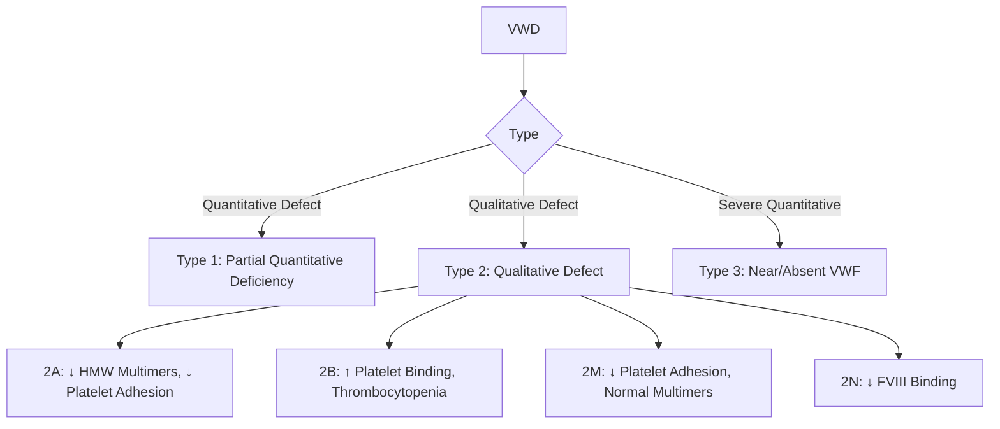
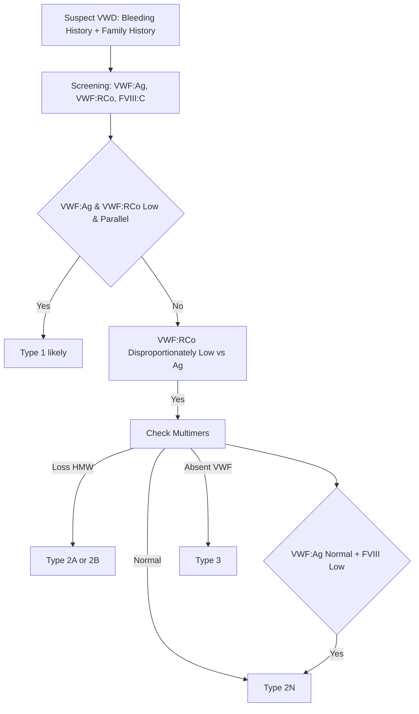
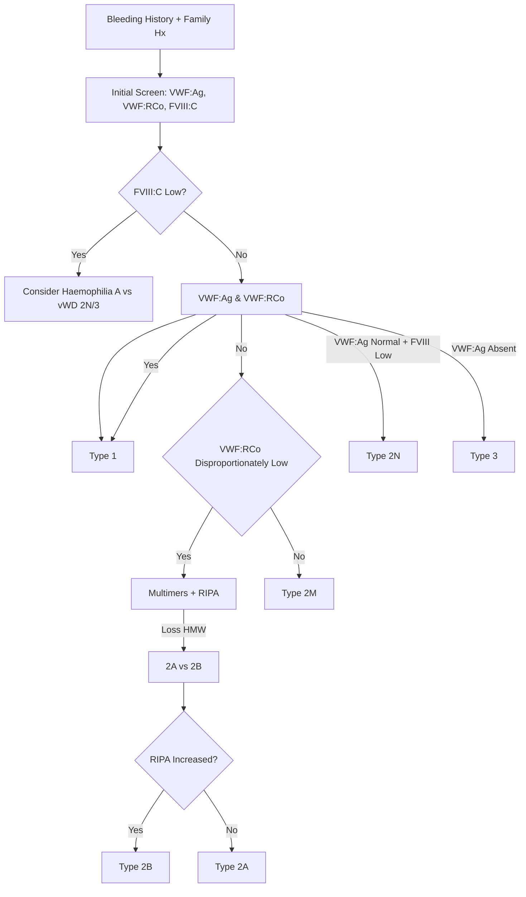
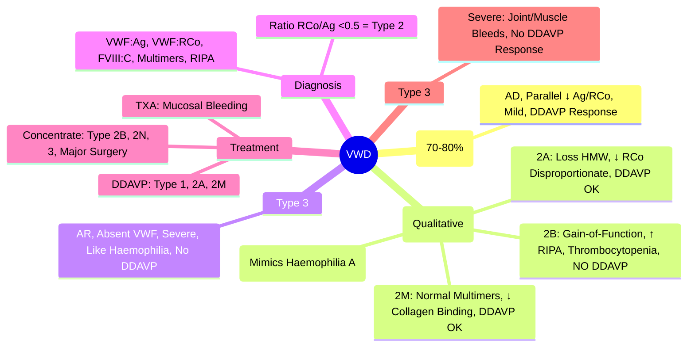

# Von Willebrand Disease (VWD)

## Learning Objectives
- [ ] Classify VWD types (1, 2A/2B/2M/2N, 3) using VWF antigen, activity, and multimer analysis
- [ ] Differentiate VWD from haemophilia and platelet disorders
- [ ] Apply treatment algorithms (DDAVP, VWF concentrate, Tranexamic acid)
- [ ] Manage special situations: surgery, pregnancy, bleeding
- [ ] Identify FCPS/MRCP high-yield diagnostic and management pearls

---

## Definition & Epidemiology

| Feature | Detail |
|---------|--------|
| **Definition** | **Most Common Inherited Bleeding Disorder** — Defect in VWF quantity (Type 1/3) or quality (Type 2) |
| **Prevalence** | **~1% population** (Symptomatic ~0.1%) |
| **Inheritance** | **Type 1 & 2: Autosomal Dominant**; **Type 3: Autosomal Recessive** |
| **Gender** | Equal (though women present more due to menorrhagia) |
| **Key Role of VWF** | **Carrier for FVIII**; **Platelet adhesion to subendothelium (via GPIb)** |

> **FCPS/MRCP**: **VWD = Most Common Inherited Bleeding Disorder** — But often underdiagnosed due to mild symptoms.

---

## Classification (Molecular Basis)

| Type | Inheritance | VWF:Ag | VWF:RCo | FVIII:C | Multimers | Bleeding Severity |
|------|-------------|--------|---------|---------|-----------|-------------------|
| **Type 1** | AD | **Low** (~30-50%) | **Low (Parallel)** | Low/Normal | Normal | **Mild** |
| **Type 2A** | AD | Low/Normal | **Disproportionately Low** | Low | **Loss of HMW** | Moderate |
| **Type 2B** | AD | Low/Normal | **Disproportionately Low** | Low/Normal | **Loss of HMW** | Moderate-Severe (+ Thrombocytopenia) |
| **Type 2M** | AD | Low/Normal | **Low (Disproportionate)** | Low/Normal | Normal | Moderate |
| **Type 2N** | AR | Normal | Normal | **Low** | Normal | Moderate (FVIII Low) |
| **Type 3** | AR | **Absent** | **Absent** | **Very Low (<5%)** | **Absent** | **Severe** (Like Severe Haemophilia) |

---

## Diagnostic Algorithm

---

## Laboratory Interpretation

| Type | VWF:Ag | VWF:RCo | FVIII:C | VWF:RCo/VWF:Ag Ratio | Multimers | RIPA (Low Dose Ristocetin) |
|------|--------|---------|---------|----------------------|-----------|----------------------------|
| **Type 1** | ↓ (30-50%) | ↓ (Parallel) | ↓/Normal | **0.5-1.0** | Normal | Normal/Absent |
| **2A** | ↓/N | **↓↓ (Disproportionate)** | ↓ | **<0.5** | **Loss HMW** | Absent |
| **2B** | ↓/N | **↓↓ (Disproportionate)** | ↓/N | **<0.5** | **Loss HMW** | **↑ Increased** |
| **2M** | ↓/N | **↓ (Disproportionate)** | ↓/N | **<0.5** | Normal | Absent |
| **2N** | Normal | Normal | **Low** | Normal | Normal | Absent |
| **Type 3** | **Absent** | **Absent** | **<5%** | — | **Absent** | Absent |

> **Key Diagnostic Ratio**: **VWF:RCo / VWF:Ag <0.5 = Type 2** (Qualitative Defect)
> **Type 2B**: **RIPA Positive at Low Dose** (0.5-0.8 mg/mL) — Due to Gain-of-Function Mutation

---

## Clinical Features by Type

| Type | Typical Presentation |
|------|---------------------|
| **Type 1** | **Mild Mucocutaneous Bleeding** (Epistaxis, Menorrhagia, Easy Bruising) |
| **Type 2A** | Moderate Mucocutaneous Bleeding |
| **2B** | **Thrombocytopenia** (Platelet Binding → Clearance) + Bleeding |
| **2M** | Moderate Bleeding (Similar to 2A) |
| **2N** | **Low FVIII** (Mimics Mild Haemophilia A) |
| **Type 3** | **Severe** (Joint/Muscle Bleeds, Like Haemophilia) |

---

## Diagnostic Algorithm

---

## Management

### Desmopressin (DDAVP) — First-Line for Type 1, 2A, 2M
| Indication | Dose | Response |
|-----------|------|----------|
| **Minor Bleeding / Minor Surgery** | **0.3 µg/kg IV/SC** (or Intranasal 150-300 µg) | **2-5x ↑ VWF:Ag & FVIII:C** (Peak 30-60 min, lasts 6-12h) |
| **Major Surgery** | 0.3 µg/kg q12-24h × 2-3 Days | Monitor VWF:RCo, FVIII:C |

> **Contraindicated in Type 2B** (↑ Thrombocytopenia Risk) and **Type 3** (No Response).
> **Type 2N**: DDAVP ↑ VWF but Not FVIII (Use FVIII Concentrate).

### VWF/FVIII Concentrate — Type 2B, 2M, 2N, Type 3, Major Surgery
| Product | Dose Calculation |
|--------|------------------|
| **VWF/FVIII Concentrate** (e.g., Wilate®, Haemate P®) | **VWF:RCo IU/kg** = Target Rise × Weight (kg) / Recovery (2 IU/kg per % Rise) |
| **Target** | VWF:RCo >50% (Bleeding), >100% (Major Surgery) |
| **FVIII Target** | >50% (Bleeding), >100% (Major Surgery) |

> **Type 3**: Lifelong Prophylaxis Sometimes Needed (Like Severe Haemophilia).

### Tranexamic Acid (Adjunct)
| Use | Dose |
|------|------|
| **Mucosal Bleeding** (Epistaxis, Menorrhagia, Dental Extraction) | **1g PO/IV QID** (Adults); **15-25 mg/kg QID** (Paeds) |
| **Synergy with DDAVP** | Adjunctive Antifibrinolysis |

---

## Special Situations

### Surgery
| Surgery Type | Management |
|------------|-------------|
| **Minor (Dental, Biopsy)** | DDAVP ± Tranexamic Acid |
| **Major** | VWF/FVIII Concentrate (Target VWF:RCo >100%, FVIII >100%) |

### Pregnancy
| Physiology | VWF & FVIII **Rise Physiologically** (Peak 3rd Trimester) |
|--------|----------------------------------------------------------|
| **Type 1** | Often Normalise → May Not Need Prophylaxis |
| **Type 3** | **Require VWF/FVIII Concentrate** Throughout Pregnancy & Delivery |
| **Delivery** | Aim VWF:RCo >50% (Vaginal), >100% (C-Section) |
| **Postpartum** | Monitor for Delayed Bleeding (VWF Falls Postpartum) |

---

## FCPS/MRCP High-Yield Summary

| Concept | Key Points |
|---------|------------|
| **Most Common** | **Type 1 (70-80%)** |
| **Inheritance** | Type 1, 2A, 2B, 2M = **AD**; Type 2N, 3 = **AR** |
| **Type 1** | Mild; **Parallel ↓ VWF:Ag/RCo**; **DDAVP Response** |
| **Type 2A** | **Loss HMW Multimers**; DDAVP Response |
| **Type 2B** | **Gain-of-Function** → Platelet Binding → Thrombocytopenia; **DDAVP Contraindicated** |
| **Type 2N** | **Normal VWF, Low FVIII** → Mimics Haemophilia A |
| **Type 3** | **Severe** — Like Haemophilia; **No DDAVP Response** |
| **DDAVP** | **Type 1, 2A, 2M** — **Contraindicated in 2B, 3** |
| **Type 2B + DDAVP** | **Worsens Thrombocytopenia** |

---

## Viva Questions

1. **What is the most common type of VWD?**
2. **How do you distinguish Type 2A from 2B?**
3. **Why is DDAVP contraindicated in Type 2B?**
3. **What is the diagnostic ratio for VWD type classification?**
4. **How do you manage a Type 3 VWD patient for major surgery?**
4. **What is the inheritance pattern of Type 3 VWD?**
4. **How does pregnancy affect VWD levels?**
5. **What is the VWF:RCo/VWF:Ag ratio in Type 2?**
6. **How do you diagnose Type 2N VWD?**
6. **What is the role of RIPA in VWD diagnosis?**
7. **What is the VWF:RCo/VWF:Ag ratio cut-off for qualitative defects?**

---

## Confusions & Mnemonics

| Confusion | Clarification |
|-----------|---------------|
| Type 1 vs 2A | **Type 1: Parallel Reduction**; **Type 2A: VWF:RCo Disproportionately Low** |
| Type 2A vs 2B | **Both Lose HMW Multimers**; **Type 2B: RIPA Increased + Thrombocytopenia** |
| Type 2N vs Haemophilia A | **VWF:Ag & RCo Normal**; **FVIII Low** → 2N; **VWF Low** → Haemophilia A |
| Type 2B + DDAVP | **Worsens Thrombocytopenia** — Contraindicated |
| Type 2B vs 2M | **Both Reduced RIPA (Normal)**? No — **2B: RIPA Increased**; **2M: Normal/Absent** |
| Type 3 | **Severe = No VWF, Low FVIII** — Treat like Severe Haemophilia A |
| DDAVP Response | **Peak at 30-60 min; Duration 6-12h** |
| Type 2B Thrombocytopenia | **Gain-of-Function VWF** → Spontaneous Platelet Binding → Clearance |

---

## Mind Map

---

## One-Page Revision Card

| **Type** | **Inheritance** | **VWF:Ag** | **VWF:RCo** | **FVIII:C** | **Multimers** | **DDAVP** |
|----------|-----------------|------------|-------------|-------------|---------------|-----------|
| **1** | AD | ↓ | ↓ (Parallel) | N/↓ | Normal | **Yes** |
| **2A** | AD | ↓/N | ↓↓ (Disproportionate) | ↓ | **Loss HMW** | **Yes** |
| **2B** | AD | ↓/N | ↓↓ (Disprop) | ↓/N | **Loss HMW** | **NO** (↑ Plt Binding) |
| **2M** | AD | ↓/N | ↓ (Disprop) | ↓/N | Normal | **Yes** |
| **2N** | AR | Normal | Normal | **Low** | Normal | No (Use FVIII) |
| **3** | AR | **Absent** | **Absent** | **<5%** | **Absent** | **No** |

| **Key Ratios** | **Value** |
|----------------|-----------|
| **VWF:RCo/VWF:Ag <0.5** | **Type 2 (Qualitative Defect)** |
| **VWF:RCo/VWF:Ag 0.5-1.0** | **Type 1 (Quantitative)** |

| **DDAVP** | **Indicated** | **Contraindicated** |
|-----------|---------------|---------------------|
| Type 1 | ✅ | |
| Type 2A | ✅ | |
| Type 2B | | ❌ (↑ Thrombocytopenia) |
| Type 2M | ✅ | |
| Type 2N | ❌ (No FVIII Rise) | |
| Type 3 | | ❌ (No Response) |

---

## Spaced Repetition Tracker

| Day | 1 | 3 | 7 | 15 | 30 |
|-----|---|---|---|----|----|
| Type 1-3 Classification | ☐ | ☐ | ☐ | ☐ | ☐ |
| Diagnostic Ratios | ☐ | ☐ | ☐ | ☐ | ☐ |
| 2A vs 2B Differentiation | ☐ | ☐ | ☐ | ☐ | ☐ |
| DDAVP Indications/Contraindications | ☐ | ☐ | ☐ | ☐ | ☐ |
| Type 3 Management | ☐ | ☐ | ☐ | ☐ | ☐ |

---

## Self-Test Scorecard

| Question | My Answer | Correct? |
|----------|-----------|----------|
| Most Common Type |  |  |
| 2A vs 2B Differentiation |  |  |
| DDAVP Contraindication |  |  |
| Type 3 Management |  |  |
| VWF:RCo/Ag Ratio |  |  |

---

## Local Navigation

- [[Bleeding and Thrombotic Disorders/Haemophilia A & B|Haemophilia A & B]]
- [[Bleeding and Thrombotic Disorders/Platelet Disorders|Platelet Disorders]]
- [[Transfusion Medicine/Platelet Transfusion|Platelet Transfusion]]
- [[Transfusion Medicine/FFP/Cryoprecipitate|FFP/Cryoprecipitate]]
- [[Obstetrics/Obstetric Haematology|Pregnancy in VWD]]
---

> Auto-generated study sections for "Hematology" — Ch 24: Haematology & Transfusion Medicine.

## Flashcards (5 generated)

- Q: What is the definition of Hematology?
  A: Most Common Inherited Bleeding Disorder — Defect in VWF quantity (Type 1/3) or quality (Type 2)
- Q: What is the epidemiology of Hematology?
  A: ~1% population (Symptomatic ~0.1%)
- Q: What is Inheritance of Hematology?
  A: Type 1 & 2: Autosomal Dominant; Type 3: Autosomal Recessive
- Q: What is Gender of Hematology?
  A: Equal (though women present more due to menorrhagia)
- Q: What is Key Role of VWF of Hematology?
  A: Carrier for FVIII; Platelet adhesion to subendothelium (via GPIb)

## MCQs (1 generated)

1. **Which of the following best describes Hematology?**
   A. **B -->|Quantitative Defect| T1[Type 1: Partial Quantitative Deficiency]**
   B. An unrelated condition not matching the clinical picture of Hematology
   C. A complication seen late in the disease course of Hematology
   D. A condition that mimics Hematology but has a different underlying cause

## SBA Questions (1 generated)

1. A patient with suspected Hematology presents with: Definition — Most Common Inherited Bleeding Disorder — Defect in VWF quantity (Type 1/3) or quality (Type 2); Prevalence — ~1% population (Symptomatic ~0.1%); Inheritance — Type 1 & 2: Autosomal Dominant; Type 3: Autosomal Recessive. What is the most likely diagnosis?
   A. **Hematology**
   B. A condition that mimics Hematology but is not the same entity
   C. A complication of Hematology rather than the primary diagnosis
   D. An unrelated condition in the same clinical category as Hematology

## PasTest Scenario SBAs (Clinical Vignettes)

> **Auto-generated PasTest/Mediscope-style scenario SBAs** grounded in the authored source. Each scenario tests a real clinical fact (triad, specific sign, contraindication, trial, first-line Rx) extracted from the topic. *Source: Ch 24: Haematology — Von Willebrand Disease*

**Q1.** What is the most appropriate first-line therapy for Von Willebrand Disease?

  - **A.** Major Surgery + Contraindicated in Type + Type
  - **B.** An advanced/surgical therapy reserved for refractory disease
  - **C.** Symptomatic treatment only, no disease-modifying therapy
  - **D.** Empiric broad-spectrum therapy without specific indication

  > **Answer: A** — Major Surgery + Contraindicated in Type + Type
  >
  > *Source:* **Major Surgery**   0.3 µg/kg q12-24h × 2-3 Days   Monitor VWF:RCo, FVIII:C  

> **Contraindicated in Type 2B** (↑ Thrombocytopenia Risk) and **Type 3** (No Response).
> **Type 2N**: DDAVP ↑ VWF but N

