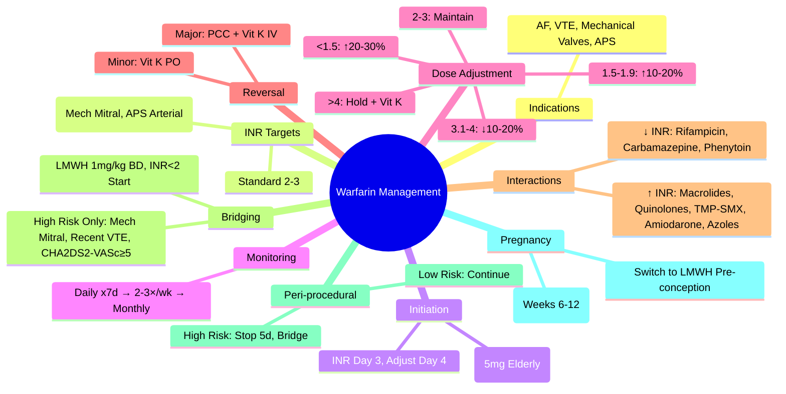

# Warfarin Management

> [!info] **Davidson Ch 25 Alignment**: Bleeding and Thrombotic Disorders → Anticoagulation → Warfarin
> **FCPS/MRCP Focus**: Indications, Dosing, INR Targets, Monitoring, Reversal, Interactions, Bridging, Peri-procedural, Pregnancy

---

## 🎯 Learning Objectives

- [ ] Define **Indications** for Warfarin: AF, VTE, Mechanical Valves, Antiphospholipid Syndrome, etc.
- [ ] Apply **INR Targets**: Standard (2-3), High (2.5-3.5), Mechanical Valves (2.5-3.5), APS (3-4)
- [ ] Apply **Dosing Algorithm**: Loading, Maintenance, INR-guided Adjustment
- [ ] Apply **Monitoring**: Frequency, INR Interpretation, Dose Adjustment
- [ ] Manage **Reversal**: Vitamin K, PCC, FFP (Based on INR/Bleeding)
- [ ] Manage **Interactions**: Drug-Drug, Drug-Food, Drug-Disease
- [ ] Manage **Bridging**: Indications, LMWH Protocol, Timing
- [ ] Manage **Peri-procedural**: Hold/Restart, Bridging Decisions
- [ ] Manage **Pregnancy**: Contraindicated, LMWH Alternative

---

## 📖 Indications & INR Targets

| Indication | INR Target | Duration |
|------------|------------|----------|
| **Atrial Fibrillation** (CHA₂DS₂-VASc ≥2) | **2.0-3.0** | Lifelong |
| **VTE (DVT/PE) - Provoked** | **2.0-3.0** | **3 months** |
| **VTE - Unprovoked** | **2.0-3.0** | **Indefinite** (if bleed risk low) |
| **Mechanical Aortic Valve** (No Risk Factors) | **2.0-3.0** | Lifelong |
| **Mechanical Mitral Valve / Aortic + Risk Factors** | **2.5-3.5** | Lifelong |
| **Antiphospholipid Syndrome** (Arterial/Recurrent VTE) | **3.0-4.0** | Lifelong |
| **APS (Venous, First Event)** | **2.0-3.0** | Indefinite |

> [!tip] **INR Target: Standard 2-3**; **High Risk (Mechanical Mitral, APS Arterial) = 2.5-3.5 to 3-4**. **DOACs Preferred** over Warfarin for VTE/AF (Except Mechanical Valves/APS).

---

## 💊 Dosing & Initiation

### Standard Initiation Protocol

| Day | Dose | INR Target |
|-----|------|------------|
| **Day 1** | **10 mg** (or 5 mg if >75y, Low body weight, Interacting drugs, Liver disease) | — |
| **Day 2** | **10 mg** (or 5 mg if Day 1 was 5mg) | — |
| **Day 3** | **Check INR** → Adjust Day 4 Dose | — |
| **Day 4-5** | **Adjust per INR** (Nomogram/Algorithm) | — |
| **Day 6-7** | **Check INR** → Stabilise Dose | — |

| Day 1 INR | Day 4 Dose Adjustment |
|-----------|----------------------|
| **<1.5** | Increase 20-30% |
| **1.5-1.9** | Increase 10-20% |
| **2.0-3.0** | **Maintain** |
| **3.1-4.0** | Decrease 10-20% |
| **>4.0** | **Hold 1-2 days**, Decrease 20-30% |

> [!warning] **Elderly/Frail/Interacting Drugs**: Start **5 mg Day 1**, then **3-5 mg daily**. **Genetic Testing** (CYP2C9, VKORC1) can guide dosing but **Not Routine**.

---

## 📊 Monitoring & Dose Adjustment

### Monitoring Frequency

| Phase | Frequency |
|-------|-----------|
| **Initiation (Days 1-7)** | **Daily** until INR therapeutic 2 consecutive days |
| **Stabilisation (Weeks 1-4)** | **2-3 times/week** |
| **Maintenance (Stable >4 weeks)** | **Weekly → Fortnightly → Monthly** (Max 12 weeks if stable) |
| **Dose Change / Interacting Drug / Illness** | **Weekly** until Re-stabilised |

### Dose Adjustment Algorithm (INR 2-3 Target)

| INR | Action |
|-----|--------|
| **<1.5** | **Increase Weekly Dose 20-30%** |
| **1.5-1.9** | **Increase Weekly Dose 10-20%** |
| **2.0-3.0** | **No Change** |
| **3.1-4.0** | **Decrease Weekly Dose 10-20%** |
| **4.1-5.0** | **Omit 1-2 Doses**, **Decrease Weekly Dose 10-20%** |
| **>5.0** | **Omit 2-3 Doses**, **Decrease 20-30%**, Check for Bleeding |

> [!warning] **INR >8.0 or Major Bleeding**: **STOP Warfarin + Vitamin K (see Reversal)**. **INR 5-8, No Bleeding**: **Omit 1-2 Doses + Vitamin K 1-2mg PO**.

---

## 🚨 Warfarin Reversal

| Scenario | Management |
|----------|------------|
| **INR 4.5-10, No Bleeding** | **Omit 1-2 Doses**, **Vitamin K 1-2 mg PO** |
| **INR >10, No Bleeding** | **Vitamin K 3-5 mg PO** (or 1-2 mg IV) |
| **Minor Bleeding, INR >2** | **Vitamin K 1-2 mg IV/PO**, **Hold Warfarin** |
| **Major Bleeding / Emergency Surgery** | **STOP Warfarin**, **PCC 25-50 IU/kg** + **Vitamin K 5-10 mg IV** (Slow), **FFP if PCC Unavailable** |
| **Life-threatening Bleeding** | **PCC 50 IU/kg + Vitamin K 10 mg IV** + **FFP** if PCC Unavailable |

| Agent | Dose | Onset | Use |
|-------|------|-------|-----|
| **Vitamin K (Phytomenadione)** | **1-10 mg** | **PO: 6-24h**, **IV: 6-12h** | Non-urgent / INR Correction |
| **PCC (4-Factor)** | **25-50 IU/kg** | **Immediate** | **Major Bleeding / Urgent Surgery** |
| **FFP** | **15-20 mL/kg** | **30-60 min** | **If PCC Unavailable** |

> [!warning] **Vitamin K IV**: **Anaphylaxis Risk** → **Slow IV over 30 min**, Monitor. **PCC = First-line for Urgent Reversal** (Low Volume, Rapid, No Thawing).

---

## 🔗 Drug Interactions (High-Yield)

| Interaction | Effect on INR | Mechanism |
|-------------|---------------|-----------|
| **Antibiotics (Macrolides, Quinolones, TMP-SMX, Metronidazole)** | **↑ INR** | CYP2C9 Inhibition / Gut Flora ↓ Vit K |
| **Amiodarone** | **↑↑ INR** (Strong) | CYP2C9 Inhibition + Vit K Epoxide Reductase Inhibition |
| **Amiodarone** | **↑↑ INR** (Strong) | CYP2C9 Inhibition + Vit K Epoxide Reductase Inhibition |
| **Allopurinol** | **↑ INR** | CYP2C9 Inhibition |
| **Azole Antifungals (Fluconazole, Itraconazole)** | **↑↑ INR** | CYP2C9/CYP3A4 Inhibition |
| **Rifampicin** | **↓↓ INR** (Strong) | CYP2C9/3A4 Induction |
| **Carbamazepine / Phenytoin** | **↓ INR** | CYP2C9 Induction |
| **Cholestyramine** | **↓ INR** | Bile Acid Sequestration → ↓ Vit K Absorption |
| **NSAIDs / Aspirin** | **Bleeding Risk** (No INR Change) | Antiplatelet + Gastric Mucosa |
| **SSRIs** | **Bleeding Risk** | Platelet Serotonin Depletion |
| **Alcohol (Acute)** | **↑ INR** | CYP2C9 Inhibition |
| **Alcohol (Chronic)** | **↓ INR** | CYP2C9 Induction |
| **Vitamin K Foods (Kale, Spinach, Broccoli)** | **↓ INR** (If Sudden Increase) | Dietary Vit K Intake |

> [!tip] **Consistent Diet** > Restriction. **Avoid Sudden Changes** in Vit K Intake. **Monitor INR 3-5 Days** after Starting/Stopping Interacting Drug.

---

## 🌉 Bridging Therapy

### Indications for Bridging (High Thrombotic Risk)

| Indication | Bridging Required? |
|------------|-------------------|
| **Mechanical Mitral Valve** | **YES** |
| **Mechanical Aortic Valve + Risk Factors** (AF, Prior Thromboembolism, LV Dysfunction) | **YES** |
| **Recent VTE (≤3 months)** | **YES** |
| **Atrial Fibrillation (CHA₂DS₂-VASc ≥5)** | **Consider** (Individualise) |
| **VTE >3 months ago / CHA₂DS₂-VASc <5** | **NO** (Usually) |

### Bridging Protocol

| Phase | Heparin | Warfarin | Duration |
|-------|---------|----------|----------|
| **Pre-procedure** | **Stop Warfarin 5 days pre-op** | Hold | — |
| **Bridging Start** | **LMWH 1mg/kg BD** (Therapeutic) | — | When INR <2.0 |
| **Day of Procedure** | **Last Dose 24h Pre-op** (Therapeutic) / **12h Pre-op** (Prophylactic) | — | — |
| **Post-procedure** | **Restart 24h Post-op** (if Haemostasis Secure) | **Restart Warfarin** (Same Dose) | **Overlap 5 days + INR Therapeutic** |
| **Stop Bridging** | When **INR Therapeutic ≥2.0 x 2 Days** | — | — |

> [!warning] **NO Bridging for Low Risk**: AF (CHA₂DS₂-VASc <5), VTE >3mo, Mechanical Aortic Valve (No Risk Factors). **Bridging Increases Bleeding** without Thrombosis Reduction in Low Risk.

---

## 🏥 Peri-procedural Management

| Procedure Bleeding Risk | Warfarin | Bridging |
|------------------------|----------|----------|
| **Low** (Dental, Cataract, Skin Biopsy, Endoscopy w/o Biopsy) | **Continue** (INR Therapeutic) | **NO** |
| **Moderate** (Endoscopy with Biopsy, Colonoscopy, Minor Surgery) | **Hold 2-3 Days** (INR <1.5) | **Usually NO** |
| **High** (Major Surgery, Neurosurgery, Cardiac, Spinal) | **Stop 5 Days Pre-op** | **YES** (If High Thrombotic Risk) |

| INR Target for Procedure | Procedure Type |
|--------------------------|----------------|
| **<1.5** | High Bleeding Risk Surgery |
| **<2.0** | Moderate Bleeding Risk |
| **Therapeutic (2-3)** | Low Bleeding Risk |

---

## 🤰 Warfarin in Pregnancy

| Trimester | Recommendation |
|-----------|----------------|
| **Pre-conception** | **Switch to LMWH** (Therapeutic Dose) |
| **1st Trimester (Weeks 6-12)** | **CONTRAINDICATED** (Teratogenic: Nasal Hypoplasia, Stippled Epiphyses) |
| **2nd/3rd Trimester** | **LMWH Continued**; **Warfarin CONTRAINDICATED** |
| **Delivery** | **Hold LMWH 12-24h Pre-delivery**; **Restart 6-12h Post-vaginal / 24h Post-CS** |
| **Breastfeeding** | **Warfarin SAFE** (Minimal Excretion); **LMWH SAFE** |

> [!warning] **Warfarin = Teratogenic (Category X)**. **Weeks 6-12 = Critical Period**. **Switch to LMWH BEFORE Conception**.

---

## 💡 FCPS/MRCP High-Yield Summary

| Topic | Key Point |
|-------|-----------|
| **INR Targets** | **AF/VTE = 2-3**; **Mechanical Mitral/APS = 2.5-3.5 to 3-4** |
| **Initiation** | **10mg Day 1-2**, Check INR Day 3, Adjust Day 4; **Elderly: 5mg Start** |
| **Monitoring** | **Daily x7d → 2-3×/wk → Weekly → Monthly** (Max 12 weeks stable) |
| **Dose Adjustment** | **INR <1.5: ↑20-30%**; **1.5-1.9: ↑10-20%**; **3.1-4.0: ↓10-20%**; **>4: Hold + Vit K** |
| **Reversal** | **Minor: Vit K 1-2mg PO**; **Major: PCC 25-50 IU/kg + Vit K 10mg IV** |
| **Interactions** | **↑ INR: Macrolides, Quinolones, TMP-SMX, Amiodarone, Azoles, Allopurinol**; **↓ INR: Rifampicin, Carbamazepine, Phenytoin, Barbiturates, Chronic Alcohol** |
| **Bridging** | **LMWH 1mg/kg BD**; **High Risk Only (Mech Mitral, Recent VTE, CHA₂DS₂-VASc≥5)**; **Start INR<2, Stop 24h Pre-op** |
| **Peri-procedural** | **Low Risk: Continue**; **High Risk: Stop 5d, Bridge if High Risk** |
| **Pregnancy** | **Contraindicated** → **Switch to LMWH Pre-conception** |

---

## ❓ Viva Questions

1. **What is the target INR for a patient with a mechanical mitral valve?**
   - **2.5-3.5**

2. **How do you initiate warfarin in a 70-year-old patient?**
   - **Start 5 mg daily** (Elderly/Frail), Check INR Day 3, Adjust Day 4

3. **What is the management of INR 6.5 in an asymptomatic patient?**
   - **Omit 1-2 Doses**, **Vitamin K 1-2 mg PO**, **Restart Lower Dose when INR <5**

4. **How do you reverse warfarin for emergency surgery?**
   - **PCC 25-50 IU/kg + Vitamin K 5-10 mg IV** (FFP if PCC unavailable)

5. **Which antibiotics significantly increase INR?**
   - **Macrolides, Quinolones, TMP-SMX, Metronidazole, Azoles**

6. **When is bridging required for a patient with atrial fibrillation?**
   - **CHA₂DS₂-VASc ≥5** or **Recent VTE (≤3mo)** or **Mechanical Mitral Valve**

7. **How do you manage warfarin for a patient undergoing dental extraction?**
   - **Continue Warfarin** (INR Therapeutic), **Local Haemostatic Measures** (Tranexamic Acid Mouthwash)

7. **What is the management of warfarin in pregnancy?**
   - **Contraindicated** → **Switch to LMWH Pre-conception**; **LMWH Throughout Pregnancy**

8. **Which drug causes the most potent increase in INR with warfarin?**
   - **Amiodarone** (CYP2C9 + VKORC1 Inhibition)

9. **How do you manage a patient with INR >10 and no bleeding?**
   - **Vitamin K 3-5 mg PO** (or 1-2 mg IV), **Omit Warfarin Until INR <5**

10. **What is the Kleihauer test and when is it used in warfarin management?**
    - **Measures Feto-maternal Haemorrhage**; **If >4mL FMH → Additional Anti-D Dose**; **Not Routine in Warfarin Management** (Used in HDFN)

---

## 🧠 Confusions & Mnemonics

| Confusion | Clarification |
|-----------|---------------|
| **Bridging vs No Bridging** | **High Risk = Bridge**; **Low Risk = No Bridge** (BRIDGE Trial) |
| **PCC vs FFP** | **PCC = 1st Line (Low Volume, Fast, Concentrated)**; **FFP = 2nd Line** |
| **Vit K PO vs IV** | **PO = 24h Onset, Safer**; **IV = 6-12h, Anaphylaxis Risk** |
| **Bridging Start** | **When INR <2.0** (Not Immediately After Stopping Warfarin) |
| **Peri-procedural INR** | **<1.5 High Risk Surgery**; **<2.0 Moderate**; **Therapeutic = Low Risk** |
| **Warfarin in Pregnancy** | **Teratogenic Weeks 6-12** → **Switch to LMWH Pre-conception** |

| Mnemonic | Meaning |
|----------|---------|
| **"Warfarin Target 2-3, High Risk 2.5-3.5"** | INR Targets |
| **"Start 10, Check Day 3, Adjust Day 4"** | Initiation |
| **"INR 2-3 = Green, <1.5 = Up, >4 = Stop + Vit K"** | Adjustment |
| **"PCC First, FFP Second"** | Reversal |
| **"Amiodarone = INR Up Up"** | Interaction |
| **"Bridging = LMWH 1mg/kg BD, INR<2 Start"** | Bridging Protocol |
| **"Pregnancy = LMWH Only"** | Warfarin Contraindicated |

---

## 🗺️ Mind Map

---

## 📋 One-Page Revision Card

| **WARFARIN MANAGEMENT – FCPS/MRCP REVISION CARD** |
|----------------------------------------------------|
| **Indications**: AF, VTE, Mechanical Valves, APS |
| **INR Target**: AF/VTE=2-3; Mech Mitral/APS Arterial=2.5-3.5 |
| **Initiation**: 10mg Day1-2 (5mg Elderly), INR Day3, Adjust Day4 |
| **Monitoring**: Daily x7d → 2-3×/wk → Monthly (Max 12wk Stable) |
| **Dose Adjust**: <1.5 ↑20-30%; 1.5-1.9 ↑10-20%; 3.1-4 ↓10-20%; >4 Hold+VitK |
| **Reversal**: Minor=VitK PO; Major=PCC 25-50IU/kg + VitK 10mg IV |
| **Interactions**: ↑INR=Macrolides/Quinolones/TMP-SMX/Amiodarone/Azoles; ↓INR=Rifampicin/Carbamazepine |
| **Bridging**: High Risk Only (Mech Mitral, Recent VTE, CHA2DS2-VASc≥5); LMWH 1mg/kg BD, Start INR<2 |
| **Peri-procedural**: Low Risk=Continue; High Risk=Stop 5d + Bridge |
| **Pregnancy**: **Contraindicated** (Weeks 6-12 Teratogenic) → **LMWH** |

---

## 📅 Spaced Repetition Tracker

| Review | Date | Score (1-5) | Next Review |
|--------|------|-------------|-------------|
| Day 1 | 2025-06-17 | | 2025-06-18 |
| Day 3 | | | |
| Day 7 | | | |
| Day 15 | | | |
| Day 30 | | | |

---

## 🎯 Must Know / Should Know / Nice to Know

| Level | Content |
|-------|---------|
| **Must Know** | INR targets, Initiation protocol, Monitoring schedule, Dose adjustment algorithm, Reversal (PCC/Vit K), Key interactions (↑INR, ↓INR), Bridging indications/protocol, Peri-procedural management, Pregnancy contraindication |
| **Should Know** | CYP2C9/VKORC1 pharmacogenetics, Warfarin skin necrosis (Prot C/S/AT def), Heparin-induced warfarin resistance, Warfarin in renal/hepatic impairment, Cost-effectiveness of PCC vs FFP, bridging trials (BRIDGE, PERIOP-2), Patient self-testing/management, Warfarin in special populations (elderly, cancer, obese) |
| **Nice to Know** | Warfarin resistance mechanisms, Vitamin K cycle biochemistry, Novel anticoagulants comparison, Warfarin pharmacokinetics (S/R enantiomers), Warfarin resistance genes, Warfarin-induced calciphylaxis, Novel reversal agents (Andexanet Alfa for DOACs), Warfarin in antiphospholipid syndrome (INR unreliable), Genetic testing cost-effectiveness, Warfarin in paediatrics |

---

## ✅ Self-Test Scorecard

| Section | Score (0-10) | Notes |
|---------|--------------|-------|
| Indications & INR Targets | | |
| Initiation & Monitoring | | |
| Dose Adjustment Algorithm | | |
| Reversal Protocols | | |
| Drug Interactions | | |
| Bridging Therapy | | |
| Peri-procedural Management | | |
| Pregnancy Management | | |
| Viva Questions | | |

---

## 🔗 Local Navigation

- **Previous**: [[Coagulation Assays]]
- **Next**: [[DOAC Management]]
- **Section Hub**: [[Bleeding and Thrombotic Disorders]] / [[Anticoagulation]]
- **MOC**: [[Hematology MOC]]
- **Template**: [[../Templates/Hematology Topic Template]]

---

*Generated for FCPS/MRCP exam preparation. Based on Davidson Medicine 24th Ed Chapter 25.*
---

> Auto-generated study sections for "Hematology" — Ch 24: Haematology & Transfusion Medicine.

## Flashcards (10 generated)

- Q: What is the definition of Hematology?
  A: [!info] Davidson Ch 25 Alignment: Bleeding and Thrombotic Disorders → Anticoagulation → Warfarin
- Q: What is INR Targets of Hematology?
  A: AF/VTE = 2-3; Mechanical Mitral/APS = 2.5-3.5 to 3-4
- Q: What is Initiation of Hematology?
  A: 10mg Day 1-2, Check INR Day 3, Adjust Day 4; Elderly: 5mg Start
- Q: How is Hematology monitored?
  A: Daily x7d → 2-3×/wk → Weekly → Monthly (Max 12 weeks stable)
- Q: What is the dose of Hematology?
  A: INR <1.5: ↑20-30%; 1.5-1.9: ↑10-20%; 3.1-4.0: ↓10-20%; >4: Hold + Vit K
- Q: What is Reversal of Hematology?
  A: Minor: Vit K 1-2mg PO; Major: PCC 25-50 IU/kg + Vit K 10mg IV
- Q: What is Interactions of Hematology?
  A: ↑ INR: Macrolides, Quinolones, TMP-SMX, Amiodarone, Azoles, Allopurinol; ↓ INR: Rifampicin, Carbamazepine, Phenytoin, Barbiturates, Chronic Alcohol
- Q: What is Bridging of Hematology?
  A: LMWH 1mg/kg BD; High Risk Only (Mech Mitral, Recent VTE, CHA₂DS₂-VASc≥5); Start INR<2, Stop 24h Pre-op
- Q: What is Peri-procedural of Hematology?
  A: Low Risk: Continue; High Risk: Stop 5d, Bridge if High Risk
- Q: What is Pregnancy of Hematology?
  A: Contraindicated → Switch to LMWH Pre-conception

## MCQs (1 generated)

1. **Which of the following best describes Hematology?**
   A. **[!info] Davidson Ch 25 Alignment: Bleeding and Thrombotic Disorders → Anticoagulation → Warfarin**
   B. An unrelated condition not matching the clinical picture of Hematology
   C. A complication seen late in the disease course of Hematology
   D. A condition that mimics Hematology but has a different underlying cause

## PasTest Scenario SBAs (Clinical Vignettes)

> **Auto-generated PasTest/Mediscope-style scenario SBAs** grounded in the authored source. Each scenario tests a real clinical fact (triad, specific sign, contraindication, trial, first-line Rx) extracted from the topic. *Source: Ch 24: Haematology — Warfarin Management*

**Q1.** What is the most appropriate first-line therapy for Warfarin Management?

  - **A.** Stop Bridging + INR Therapeutic ≥2.0 x + NO Bridging for Low Risk
  - **B.** An advanced/surgical therapy reserved for refractory disease
  - **C.** Symptomatic treatment only, no disease-modifying therapy
  - **D.** Empiric broad-spectrum therapy without specific indication

  > **Answer: A** — Stop Bridging + INR Therapeutic ≥2.0 x + NO Bridging for Low Risk
  >
  > *Source:* **Stop Bridging**   When **INR Therapeutic ≥2.0 x 2 Days**   —   —  

> [!warning] **NO Bridging for Low Risk**: AF (CHA₂DS₂-VASc <5), VTE >3mo, Mechanical Aortic Valve (No Risk Factors).

