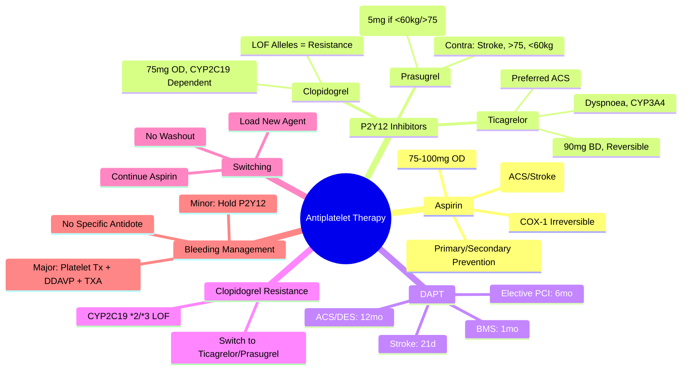

# Antiplatelet Therapy

> [!info] **Davidson Ch 25 Alignment**: Bleeding and Thrombotic Disorders → Antiplatelet Therapy
> **FCPS/MRCP Focus**: Aspirin, P2Y12 Inhibitors (Clopidogrel, Ticagrelor, Prasugrel), DAPT, Indications, Dosing, Resistance, Switching, Bleeding Risk

---

## 🎯 Learning Objectives

- [ ] Apply **Aspirin**: Mechanism, Dosing, Indications (Primary/Secondary Prevention), Contraindications
- [ ] Apply **P2Y12 Inhibitors**: Clopidogrel, Ticagrelor, Prasugrel - Mechanism, Dosing, Indications, Contraindications
- [ ] Apply **Dual Antiplatelet Therapy (DAPT)**: Indications, Duration (ACS, PCI, Stroke), De-escalation
- [ ] Recognise **Clopidogrel Resistance**: CYP2C19 Genotyping, Platelet Function Testing
- [ ] Manage **Switching**: Between P2Y12 Inhibitors, DAPT to SAPT
- [ ] Manage **Bleeding**: Reversal (No Specific Antidote), Platelet Transfusion, DDAVP
- [ ] Manage **Special Populations**: Elderly, CKD, Low Weight, Diabetes, Diabetes

---

## 📖 Antiplatelet Agents

### Aspirin (Acetylsalicylic Acid)

| Aspect | Details |
|--------|---------|
| **Mechanism** | **Irreversible COX-1 Inhibition** → ↓ Thromboxane A2 → ↓ Platelet Aggregation |
| **Dose** | **75-100 mg OD** (Standard); **300-325 mg** (Acute ACS/Stroke Loading) |
| **Onset** | **Immediate** (Irreversible) |
| **Duration** | **7-10 Days** (Platelet Lifespan) |
| **Bioavailability** | ~80-100% (Rapid Absorption) |

| Indication | Dose | Duration |
|------------|------|----------|
| **Primary Prevention** (High CV Risk) | **75-100 mg OD** | Individualised (Guideline-Dependent) |
| **Secondary Prevention** (Post-MI, Stroke, PAD) | **75-100 mg OD** | **Lifelong** |
| **ACS** | **300 mg Loading** → **75-100 mg OD** + P2Y12 Inhibitor | **DAPT 12mo** (Then Aspirin Alone) |
| **Stroke/TIA** | **300 mg Loading** → **75-100 mg OD** + Clopidogrel 21d | **21 Days DAPT** → Aspirin Alone |
| **Post-PCI (Stent)** | **300 mg Loading** → **75-100 mg OD** + P2Y12 Inhibitor | **DAPT 6-12mo** (DES/BMS) |

> [!warning] **Aspirin + PPI**: **PPI (Omeprazole/Esomeprazole)** Recommended if **High GI Bleed Risk** (Age >60, H. pylori, Prior Ulcer, Anticoagulant, Steroid, NSAID).

### P2Y12 Inhibitors (ADP Receptor Antagonists)

| Agent | **Clopidogrel** | **Ticagrelor** | **Prasugrel** |
|-------|-----------------|----------------|---------------|
| **Generation** | **2nd (Thienopyridine)** | **Reversible (Cyclopentyltriazolopyrimidine)** | **3rd (Thienopyridine)** |
| **Mechanism** | **Irreversible** P2Y12 Blockade | **Reversible** P2Y12 Blockade | **Irreversible** P2Y12 Blockade |
| **Prodrug** | **Yes** (Requires CYP2C19 Activation) | **No** (Active) | **Yes** (Requires CYP3A4/2B6 Activation) |
| **Loading Dose** | **300-600 mg** | **180 mg** | **60 mg** |
| **Maintenance** | **75 mg OD** | **90 mg BD** | **10 mg OD** (5 mg if Weight <60kg / Age ≥75) |
| **Onset** | **2-6h** (Post-Loading) | **30-60 min** | **30 min** |
| **Offset** | **5-7 Days** (New Platelets) | **3-5 Days** (Reversible) | **7-10 Days** |
| **Food Effect** | No | No | No |
| **Renal Impairment** | No Adjustment | No Adjustment | Caution (↑ Exposure) |
| **CYP2C19 Metabolism** | **Critical (Loss-of-Function → Resistance)** | **Minor (CYP3A4)** | **Partial (CYP3A4/2B6)** |
| **Reversibility** | **Irreversible** | **Reversible** | **Irreversible** |
| **Bleeding Risk** | Standard | **Higher (Intracranial, GI)** | **Higher (Fatal Bleeding, CABG)** |
| **Dyspnoea** | Rare | **Common (10-20%)** | Rare |

> [!tip] **Ticagrelor = Reversible, Faster Onset/Offset, Dyspnoea, CYP3A4 Substrate**; **Prasugrel = Faster/Stronger, No CYP2C19 Issue, Contraindicated in Stroke/TIA, Age>75, Weight<60kg**.

---

## 💊 Dual Antiplatelet Therapy (DAPT)

### Indications & Duration

| Clinical Scenario | DAPT Components | Minimum Duration | Preferred P2Y12 Inhibitor |
|-------------------|-----------------|------------------|---------------------------|
| **ACS (NSTE-ACS / STEMI)** | Aspirin + P2Y12 Inhibitor | **12 Months** (DES) / **1 Month** (BMS) | **Ticagrelor / Prasugrel > Clopidogrel** |
| **STEMI (Primary PCI)** | Aspirin + P2Y12 Inhibitor | **12 Months** | **Prasugrel / Ticagrelor** |
| **NSTE-ACS (Medically Managed)** | Aspirin + Clopidogrel | **12 Months** | Clopidogrel |
| **Elective PCI (Stable CAD)** | Aspirin + P2Y12 Inhibitor | **6 Months (DES)** / **1 Month** (BMS) | Clopidogrel / Ticagrelor |
| **Acute Ischaemic Stroke / TIA** | Aspirin + Clopidogrel | **21 Days** | Clopidogrel (CHANCE/POINT Trials) |
| **Carotid Stenting** | Aspirin + Clopidogrel | **1 Month** | Clopidogrel |

### DAPT Duration Decision

| Factor | Shorten DAPT (<6mo) | Extend DAPT (>12mo) |
|--------|---------------------|---------------------|
| **Bleeding Risk** | **High (HAS-BLED ≥3, Prior Bleed, Age>75, CKD, Anaemia)** | **Low** |
| **Ischaemic Risk** | **Low (BMS, No Diabetes, Short Lesion)** | **High (DES, Diabetes, Complex Lesion, Prior MI, ACS)** |
| **Guideline** | **DISCO, ITALIC, MASTER DAPT Trials** | **DAPT Score ≥2** |

> [!warning] **Premature DAPT Discontinuation** = **Stent Thrombosis** (High Mortality). **Switch to SAPT Only if Bleeding** or **Guideline-Indicated Duration Complete**.

---

## 🔬 Clopidogrel Resistance & CYP2C19 Genotyping

### CYP2C19 Pharmacogenetics

| Phenotype | Genotype | Frequency (Caucasian/Asian) | Clopidogrel Response | Recommendation |
|-----------|----------|-----------------------------|----------------------|----------------|
| **Normal Metaboliser (NM)** | *1/*1 | ~40% / ~50% | **Normal** | Standard Clopidogrel |
| **Intermediate Metaboliser (IM)** | *1/*2, *1/*3 | ~30% / ~40% | **Reduced** | **Alternative (Ticagrelor/Prasugrel)** |
| **Poor Metaboliser (PM)** | *2/*2, *2/*3, *3/*3 | ~2% / ~15% | **Markedly Reduced** | **Alternative (Ticagrelor/Prasugrel)** |
| **Ultra-rapid Metaboliser (UM)** | *1/*17 | ~5% / ~5% | **Enhanced** | Standard Clopidogrel |

> [!warning] **CYP2C19 Loss-of-Function (LOF) Alleles**: *2, *3 (PM/IM) → **Clopidogrel Resistance** → **Use Ticagrelor/Prasugrel** in ACS/PCI. **CYP2C19*17 (UM)** → Enhanced Activation.

### Platelet Function Testing

| Test | Principle | Use |
|------|-----------|-----|
| **VerifyNow P2Y12** | **Cartridge-based, ADP-induced Aggregation** | **PRU >208 = High On-treatment Platelet Reactivity (HPR)** |
| **Multiplate (ADPtest)** | **Whole Blood Impedance Aggregometry** | **AUC <46 U = HPR** |
| **VASP-P (VASP Phosphorylation)** | **Flow Cytometry, cAMP/VASP Ratio** | **Platelet Reactivity Index (PRI) >50% = HPR** |

> [!tip] **Routine Testing Not Recommended**; **Consider if Recurrent Events on Clopidogrel** or **High-risk PCI**.

---

## 🔄 Switching P2Y12 Inhibitors

| Switch | Protocol |
|--------|----------|
| **Clopidogrel → Ticagrelor** | **Give Ticagrelor 180mg Loading** → **Next Dose 90mg BD** (No Washout) |
| **Clopidogrel → Prasugrel** | **Give Prasugrel 60mg Loading** → **Next Dose 10mg OD** (Next Day) |
| **Ticagrelor → Clopidogrel** | **Give Clopidogrel 600mg Loading** → **Next Dose 75mg OD** (Next Day) |
| **Prasugrel → Ticagrelor** | **Give Ticagrelor 180mg Loading** → **Next Dose 90mg BD** |
| **Ticagrelor → Prasugrel** | **Give Prasugrel 60mg Loading** → **Next Dose 10mg OD** (Next Day) |

> [!warning] **No Washout Needed** Between P2Y12 Inhibitors (Mechanisms Differ). **Aspirin Continued Throughout**.

---

## 🔬 Bleeding Management on Antiplatelets

| Severity | Management |
|----------|------------|
| **Minor** (Epistaxis, Bruising) | **Hold P2Y12 Inhibitor** (Continue Aspirin), **Local Measures** |
| **Moderate** (GI Bleed, Haematuria) | **Hold P2Y12 Inhibitor**, **IV Fluids**, **Transfuse if Hb <70**, **PPI**, **Consider DDAVP** |
| **Major/Life-threatening** (ICH, Massive GI, Haemodynamic Instability) | **STOP BOTH Antiplatelets**, **Platelet Transfusion** (1 Apheresis Unit / 10kg), **DDAVP 0.3µg/kg IV**, **Tranexamic Acid 1g IV**, **Neurosurgery/IR Referral** |

| Reversal Agent | Indication |
|----------------|------------|
| **Platelet Transfusion** | **Major Bleeding / Emergency Surgery** on DAPT |
| **DDAVP (0.3µg/kg IV)** | **Platelet Dysfunction** (Uraemia, Aspirin, GPIIb/IIIa Inhibitors) |
| **Tranexamic Acid** | **Adjunct** (GI Bleed, Surgical Bleeding) |

> [!warning] **No Specific Antidote for P2Y12 Inhibitors**. **Platelet Transfusion = Only Effective Reversal** (Provides Functional Platelets).

---

## 💡 FCPS/MRCP High-Yield Summary

| Topic | Key Point |
|-------|-----------|
| **Aspirin** | **75-100mg OD**, Irreversible COX-1, **Primary/Secondary Prevention**, Loading 300mg ACS/Stroke |
| **Clopidogrel** | **75mg OD**, **Irreversible**, CYP2C19 Dependent, **Resistance if LOF Alleles** |
| **Ticagrelor** | **90mg BD**, Reversible, **Faster Onset/Offset**, Dyspnoea, **CYP3A4**, **Preferred in ACS** |
| **Prasugrel** | **10mg OD (5mg if <60kg/>75)**, **Contra: Stroke/TIA, Age>75, Wt<60kg**, **Stronger/Faster** |
| **DAPT Duration** | **ACS/DES: 12mo**; **BMS: 1mo**; **Stroke: 21d**; **Elective PCI: 6mo DES** |
| **Clopidogrel Resistance** | **CYP2C19 LOF Alleles (*2,*3)** → **Use Ticagrelor/Prasugrel** |
| **Switching** | **Loading Dose of New Agent**, No Washout, Continue Aspirin |
| **Bleeding** | **Platelet Transfusion = Only Effective Reversal**; DDAVP for Dysfunction |
| **Contraindications** | **Prasugrel: Stroke/TIA, Age>75, Wt<60kg**; **Ticagrelor: Severe Hepatic, Active Bleed** |

---

## ❓ Viva Questions

1. **What is the mechanism of aspirin and its standard dose for secondary prevention?**
   - **Irreversible COX-1 inhibition → ↓ TXA2 → ↓ Platelet Aggregation**; **75-100mg OD**

2. **What are the key differences between clopidogrel, ticagrelor, and prasugrel?**
   - **Clopidogrel**: Irreversible, CYP2C19-dependent, 75mg OD; **Ticagrelor**: Reversible, 90mg BD, Dyspnoea, CYP3A4; **Prasugrel**: 10mg OD, Contraindicated in Stroke/TIA/Age>75/Wt<60kg

3. **What is the recommended DAPT duration after DES implantation for ACS?**
   - **12 Months** (Can shorten to 6mo if High Bleed Risk / Extend >12mo if High Ischaemic Risk)

4. **What is clopidogrel resistance and how is it managed?**
   - **CYP2C19 LOF Alleles (*2, *3)** → Reduced Active Metabolite → **Switch to Ticagrelor or Prasugrel**

5. **When would you use ticagrelor over clopidogrel in ACS?**
   - **Preferred in ACS** (PLATO Trial: ↓ CV Death/MI/Stroke); **Faster Onset/Offset, No CYP2C19 Issue**

5. **What are the contraindications for prasugrel?**
   - **Prior Stroke/TIA**, **Age >75**, **Weight <60kg**, **Active Bleeding**, **Severe Hepatic Impairment**

6. **How do you switch from clopidogrel to ticagrelor?**
   - **Load Ticagrelor 180mg**, Then **90mg BD**; **No Washout**, Continue Aspirin

6. **How do you manage major bleeding on DAPT?**
   - **STOP P2Y12 Inhibitor**, **Platelet Transfusion (1 Apheresis Unit/10kg)**, **DDAVP 0.3µg/kg IV**, **Tranexamic Acid**, **Surgical/IR Intervention**

7. **What is the role of DDAVP in antiplatelet-related bleeding?**
   - **Platelet Dysfunction** (Uraemia, Aspirin, GPIIb/IIIa Inhibitors) → **↑ vWF Release** → Improved Platelet Adhesion

8. **What is the minimum DAPT duration after bare metal stent (BMS)?**
   - **1 Month** (Guideline: 1 Month BMS, 6-12 Months DES)

9. **Can you use ticagrelor in a patient with prior intracranial haemorrhage?**
   - **Contraindicated** (PLATO: ↑ Intracranial Haemorrhage vs Clopidogrel)

10. **What is the role of CYP2C19 genotyping in clopidogrel therapy?**
    - **Identifies Poor/Intermediate Metabolisers** → **Predicts Resistance** → **Guides Alternative (Ticagrelor/Prasugrel)**

---

## 🧠 Confusions & Mnemonics

| Confusion | Clarification |
|-----------|---------------|
| **Clopidogrel vs Ticagrelor vs Prasugrel** | **Clopidogrel = CYP2C19 Dependent**; **Ticagrelor = Reversible, BD, Dyspnoea**; **Prasugrel = Stronger, Contra Stroke/TIA** |
| **DAPT Duration** | **ACS/DES = 12mo**; **BMS = 1mo**; **Stroke = 21d**; **Elective PCI DES = 6mo** |
| **Clopidogrel Resistance** | **CYP2C19 *2/*3 LOF** → **Switch to Ticagrelor/Prasugrel** |
| **Ticagrelor vs Clopidogrel** | **Ticagrelor = Reversible, BD, Faster, Dyspnoea, No CYP2C19 Issue** |
| **Prasugrel Contraindications** | **Stroke/TIA, Age>75, Wt<60kg, Active Bleed** |
| **Ticagrelor Dyspnoea** | **Common (10-20%), Self-limiting, ARIA Receptor (Adenosine)** |

| Mnemonic | Meaning |
|----------|---------|
| **"Aspirin = 75mg = COX-1 = Forever"** | Aspirin |
| **"Clopidogrel = CYP2C19 = Resistance if LOF"** | Clopidogrel |
| **"Ticagrelor = BD = Reversible = Dyspnoea"** | Ticagrelor |
| **"Prasugrel = 10mg = Strong = No Stroke/TIA"** | Prasugrel |
| **"DAPT = 12mo (ACS/DES), 1mo (BMS), 21d (Stroke)"** | DAPT Duration |
| **"Switch = Load New, No Washout, Aspirin Continues"** | Switching |

---

## 🗺️ Mind Map

---

## 📋 One-Page Revision Card

| **ANTIPLATELET THERAPY – FCPS/MRCP REVISION CARD** |
|-----------------------------------------------------|
| **Aspirin**: **75-100mg OD**, Irreversible COX-1, 300mg Load (ACS/Stroke) |
| **Clopidogrel**: **75mg OD**, CYP2C19 Dependent, **LOF = Resistance** |
| **Ticagrelor**: **90mg BD**, Reversible, **Dyspnoea**, CYP3A4, **Preferred ACS** |
| **Prasugrel**: **10mg OD** (5mg if <60kg/>75), **Contra: Stroke/TIA, >75, <60kg** |
| **DAPT Duration**: **ACS/DES 12mo**, **BMS 1mo**, **Stroke 21d**, **Elective PCI DES 6mo** |
| **Clopidogrel Resistance**: **CYP2C19 *2/*3 LOF** → **Ticagrelor/Prasugrel** |
| **Switching**: **Load New Agent, No Washout, Continue Aspirin** |
| **Bleeding**: Minor=Hold P2Y12; Major=**Platelet Tx + DDAVP + TXA**, **No Antidote** |
| **Contraindications**: Prasugrel=Stroke/TIA/>75/<60kg; Ticagrelor=Severe Hepatic/Active Bleed/ICH |
| **Clopidogrel Resistance**: CYP2C19 *2/*3 → Ticagrelor/Prasugrel |

---

## 📅 Spaced Repetition Tracker

| Review | Date | Score (1-5) | Next Review |
|--------|------|-------------|-------------|
| Day 1 | 2025-06-17 | | 2025-06-18 |
| Day 3 | | | |
| Day 7 | | | |
| Day 15 | | | |
| Day 30 | | | |

---

## 🎯 Must Know / Should Know / Nice to Know

| Level | Content |
|-------|---------|
| **Must Know** | Aspirin/Clopidogrel/Ticagrelor/Prasugrel mechanisms/dosing, DAPT durations (ACS/DES/BMS/Stroke), Clopidogrel resistance (CYP2C19), Switching protocols, Bleeding management (Platelet Tx, DDAVP), Contraindications (Prasugrel: Stroke/TIA/Age>75/Wt<60kg; Ticagrelor: ICH/Severe Hepatic) |
| **Should Know** | PLATO/TRITON-TIMI 38/CURE/CHANCE/POINT trial data, Platelet function testing (VerifyNow, Multiplate), Aspirin resistance, GPIIb/IIIa inhibitors (Abciximab, Eptifibatide, Tirofiban), Cangrelor IV, Vorapaxar, Ticagrelor dyspnoea mechanism (Adenosine), Prasugrel in elderly/renally impaired, Switching algorithms, Aspirin dose in primary prevention controversy |
| **Nice to Know** | Platelet biology (GPIIb/IIIa, P2Y1, P2Y12), Aspirin resistance mechanisms, Pharmacogenomics beyond CYP2C19 (ABCB1, CYP2B6, PON1), Platelet proteomics, Novel P2Y12 inhibitors (Cangrelor, Selatogrel, Ticagrelor analogues), Aspirin in cancer prevention, Antiplatelet therapy in cancer patients, Mechanical circulatory support (ECMO, VAD) anticoagulation/antiplatelet, Perioperative management in non-cardiac surgery, Antiplatelet therapy in pregnancy |

---

## ✅ Self-Test Scorecard

| Section | Score (0-10) | Notes |
|---------|--------------|-------|
| Aspirin | | |
| Clopidogrel | | |
| Ticagrelor | | |
| Prasugrel | | |
| DAPT Duration | | |
| Clopidogrel Resistance | | |
| Switching | | |
| Bleeding Management | | |
| Viva Questions | | |

---

## 🔗 Local Navigation

- **Previous**: [[Heparin Management]]
- **Next**: [[Coagulation Factor Assays]]
- **Section Hub**: [[Bleeding and Thrombotic Disorders]] / [[Anticoagulation/Antiplatelet]]
- **MOC**: [[Hematology MOC]]
- **Template**: [[../Templates/Hematology Topic Template]]

---

*Generated for FCPS/MRCP exam preparation. Based on Davidson Medicine 24th Ed Chapter 25.*
---

> Auto-generated study sections for "Hematology" — Ch 24: Haematology & Transfusion Medicine.

## Flashcards (10 generated)

- Q: What is the definition of Hematology?
  A: [!info] Davidson Ch 25 Alignment: Bleeding and Thrombotic Disorders → Antiplatelet Therapy
- Q: What is Aspirin of Hematology?
  A: 75-100mg OD, Irreversible COX-1, Primary/Secondary Prevention, Loading 300mg ACS/Stroke
- Q: What is Clopidogrel of Hematology?
  A: 75mg OD, Irreversible, CYP2C19 Dependent, Resistance if LOF Alleles
- Q: What is Ticagrelor of Hematology?
  A: 90mg BD, Reversible, Faster Onset/Offset, Dyspnoea, CYP3A4, Preferred in ACS
- Q: What is Prasugrel of Hematology?
  A: 10mg OD (5mg if <60kg/>75), Contra: Stroke/TIA, Age>75, Wt<60kg, Stronger/Faster
- Q: What is DAPT Duration of Hematology?
  A: ACS/DES: 12mo; BMS: 1mo; Stroke: 21d; Elective PCI: 6mo DES
- Q: What is Clopidogrel Resistance of Hematology?
  A: CYP2C19 LOF Alleles (2,3) → Use Ticagrelor/Prasugrel
- Q: What is Switching of Hematology?
  A: Loading Dose of New Agent, No Washout, Continue Aspirin
- Q: What is Bleeding of Hematology?
  A: Platelet Transfusion = Only Effective Reversal; DDAVP for Dysfunction
- Q: What is Hematology indicated for?
  A: Prasugrel: Stroke/TIA, Age>75, Wt<60kg; Ticagrelor: Severe Hepatic, Active Bleed

## MCQs (1 generated)

1. **Which of the following best describes Hematology?**
   A. **[!info] Davidson Ch 25 Alignment: Bleeding and Thrombotic Disorders → Antiplatelet Therapy**
   B. An unrelated condition not matching the clinical picture of Hematology
   C. A complication seen late in the disease course of Hematology
   D. A condition that mimics Hematology but has a different underlying cause

