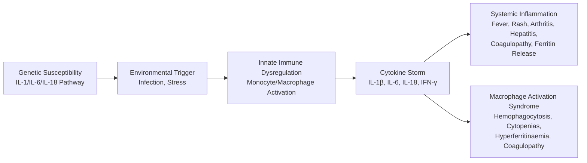
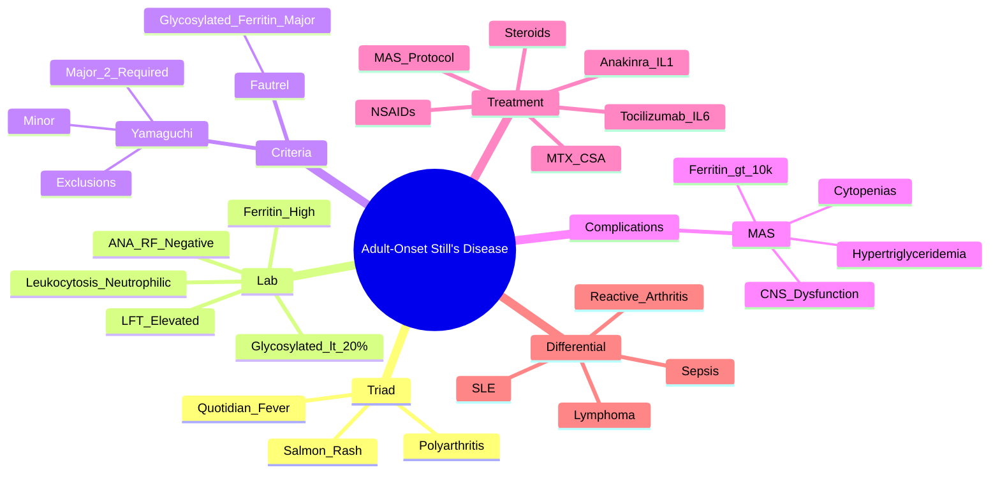

# Adult-Onset Still's Disease (AOSD)

> [!tip] **FCPS/MRCP Priority: HIGH**
> AOSD = **systemic autoinflammatory disease**: **quotidian fever + salmon-pink rash + arthritis**. **Yamaguchi criteria** for diagnosis. **Ferritin >>1000 + glycosylated fraction <20% = highly specific**. **MAS (Macrophage Activation Syndrome) = life-threatening complication** (ferritin >10,000). **IL-1 (anakinra) / IL-6 (tocilizumab) blockade = breakthrough therapy**.

---

## Learning Objectives
By the end of this note you should be able to:
- [ ] Apply **Yamaguchi criteria** (≥5 criteria with ≥2 major, with exclusions)
- [ ] Recognise the **classic triad**: **quotidian fever + salmon-pink evanescent rash + arthritis**
- [ ] Interpret **ferritin >>1000 + glycosylated fraction <20%** (highly specific)
- [ ] Recognise and manage **Macrophage Activation Syndrome (MAS)** — **ferritin >10,000, cytopenias, coagulopathy, high triglycerides**
- [ ] Select treatment ladder: NSAIDs → steroids → **IL-1 blockade (anakinra) / IL-6 blockade (tocilizumab)** → MTX/cyclosporine
- [ ] Differentiate from sepsis, lymphoma, SLE, reactive arthritis, viral infections

---

## 1. Definition & Epidemiology

| Feature | Detail |
|---------|--------|
| **Definition** | **Rare systemic autoinflammatory disease** of unknown aetiology — **dysregulated innate immunity** (IL-1, IL-6, IL-18 overexpression) |
| **Incidence** | **0.16-0.4/100,000/year** (rare) |
| **Peak Onset** | **16-35 years** (bimodal: 15-25, 35-45) |
| **Sex Ratio** | **F = M** (slight female predominance in some series) |
| **Genetics** | No strong HLA; **IL-1, IL-6, IL-18 pathway** polymorphisms |
| **Triggers** | Infections (viral/bacterial), stress, pregnancy (post-partum) |

---

## 2. Aetiology & Pathophysiology



### Key Pathogenic Features
| Cytokine | Role | Therapeutic Target |
|----------|------|-------------------|
| **IL-1β** | **Central driver** — fever, rash, arthritis, hepatocyte stimulation | **Anakinra (IL-1Ra)** |
| **IL-6** | Acute phase response (ferritin, CRP, fibrinogen), Th17 differentiation | **Tocilizumab (IL-6R)** |
| **IL-18** | IFN-γ induction, macrophage activation, **ferritin glycosylation inhibition** | Emerging target |
| **IFN-γ** | Macrophage activation → MAS | — |

---

## 3. Clinical Features — **Classic Triad**

| Feature | Description |
|---------|-------------|
| **1. Quotidian Fever** | **Spiking once or twice daily** (>39°C, often >40°C), **afebrile between spikes**, **no rigors** |
| **2. Salmon-Pink Rash** | **Evanescent**, **salmon-pink maculopapular**, **trunk/proximal limbs**, **heat-induced** (worsens with fever/warmth), **non-pruritic**, **Kobner phenomenon** |
| **3. Arthritis** | **Polyarticular** (wrists, knees, ankles, shoulders), **can be destructive** (carpal destruction), **may precede fever** |

### Other Key Features
| Feature | Frequency | Detail |
|---------|-----------|--------|
| **Sore Throat** | 70-90% | **Often initial symptom**, pharyngitis, tonsillitis |
| **Lymphadenopathy** | 60-70% | Generalised, tender |
| **Hepatosplenomegaly** | 40-60% | Hepatitis common (ALT/AST ↑) |
| **Serositis** | 30-40% | Pleuritis, pericarditis, pericardial effusion |
| **Myalgia** | 70-80% | Diffuse, migratory |
| **Myocarditis** | Rare | Conduction defects, heart failure |

---

## 4. Laboratory Features — **High-Yield**

| Test | Typical Finding | FCPS/MRCP Pearl |
|------|-----------------|-----------------|
| **Ferritin** | **Markedly elevated (>1000, often 2000-20,000)** | **Glycosylated fraction <20% = highly specific for AOSD** (vs other causes of hyperferritinaemia) |
| **Glycosylated Ferritin** | **<20% (normal >50%)** | **Most specific lab test** for AOSD |
| **WBC** | **Neutrophilic leukocytosis** (15,000-40,000) | **≥10,000 with ≥80% neutrophils** = Yamaguchi major |
| **ESR/CRP** | **Markedly elevated** | CRP often >100 mg/L |
| **LFT** | **ALT/AST elevated** (hepatitis pattern), **ALP ↑**, **LDH ↑** | |
| **ANA / RF** | **Negative** (essential for diagnosis) | **Excludes SLE, RA** |
| **Aldolase** | Elevated | Muscle involvement |
| **Triglycerides** | Elevated (especially MAS) | |
| **Fibrinogen** | High (acute phase) | Coagulopathy in MAS |

> [!critical] **Glycosylated Ferritin <20%**
> - **Most specific lab test for AOSD** (specificity >90%)
> - **Ferritin >>1000 + glycosylated fraction <20% = AOSD until proven otherwise**
> - **In MAS: ferritin >10,000, glycosylated fraction even lower (<10%)**

---

## 5. Classification Criteria — **Yamaguchi (1992)**

**Exclusion Criteria (Must all be absent):**
- Infections (sepsis, TB, viral, endocarditis)
- Malignancies (lymphoma, leukaemia)
- Other rheumatic diseases (SLE, RA, vasculitis, etc.)

**Major Criteria (2 required):**
1. **Fever ≥39°C lasting ≥1 week** (quotidian pattern)
2. **Arthralgia/Arthritis lasting ≥2 weeks**
3. **Typical salmon-pink rash** (evanescent, heat-induced)
4. **Leukocytosis ≥10,000 with ≥80% neutrophils**

**Minor Criteria:**
1. Sore throat
2. Lymphadenopathy and/or splenomegaly
3. Hepatomegaly or abnormal LFTs
4. **Negative ANA and RF**

**Diagnosis: ≥5 criteria total (including ≥2 major) + Exclusions met**

> [!important] **Alternative Criteria: Fautrel (2002)**
> - Incorporates **glycosylated ferritin <20%** as major criterion
> - Higher specificity (98% vs 92%)

---

## 6. Complications — **Macrophage Activation Syndrome (MAS)**

> [!critical] **MAS = Life-Threatening HLH-like Complication**
> - **Occurs in 10-15% of AOSD**
> - **Mortality 20-30% if not recognised**

```mermaid
flowchart TD
    A[AOSD Flare] --> B{Cytokine Storm\nIL-1, IL-6, IL-18,\nIFN-γ Uncontrolled}
    B --> C[Macrophage Activation\nHemophagocytosis in\nBone Marrow/Spleen/Liver]
    C --> D[MAS Features:\nFerritin >10,000\nCytopenias (2+ lineages)\nHypertriglyceridaemia\nCoagulopathy\nHigh LDH\nCNS Dysfunction]
    D --> E[Emergency Treatment:\nHigh-dose Steroids +\nAnakinra/IVIG/Etoposide\nICU Support]
```

### MAS Diagnostic Criteria (HLH-2004 Adapted for AOSD)
| Criterion | Threshold |
|-----------|-----------|
| **Ferritin** | **>10,000 µg/L** (often >50,000) |
| **Cytopenias** | **≥2 lineages** (Hb <90, WBC <4, Platelets <100) |
| **Triglycerides** | **>265 mg/dL (3 mmol/L)** or Fibrinogen **<1.5 g/L** |
| **Liver** | **AST >ULN**, Bilirubin elevated |
| **CNS** | Altered mental status, seizures |
| **Hemophagocytosis** | Bone marrow/ spleen/ lymph node (not mandatory) |

> [!critical] **MAS = Medical Emergency**
> - **High-dose IV methylprednisolone (1g ×3-5 days)**
> - **Anakinra 100-200mg/day SC/IV** (IL-1 blockade — rapid effect)
> - **IVIG, Etoposide (if refractory)**
> - **ICU support** (coagulopathy, liver failure, respiratory)

---

## 6. Treatment Ladder

```mermaid
flowchart TD
    A[AOSD Diagnosis] --> B{Mild\n(Arthralgia, Low-grade Fever,\nNo Organ Threat)}
    B -->|Yes| C[**NSAIDs**\n(Indomethacin/Naproxen)\nTrial 1-2 weeks]
    B -->|No| D[**Glucocorticoids**\nPred 0.5-1mg/kg (30-60mg)\nRapid taper if response]
    D --> E{Steroid-Dependent /\nRefractory / MAS}
    E -->|MAS| F[**IV MP 1g ×3-5d**\n+ **Anakinra 100-200mg/day** IV/SC\n+ IVIG 0.4g/kg ×5d\n+ Ciclosporin/Etoposide if refractory]
    E -->|Steroid-Dependent / Refractory| G[**Biologic IL-1/IL-6 Blockade**]
    G --> G1[**Anakinra (IL-1Ra)**\n100mg SC daily\n(Rapid response, daily injection)]
    G1 --> G2[**Tocilizumab (IL-6R)**\n8mg/kg IV q4wk / 162mg SC q1-2wk]
    G2 --> G3[Canakinumab (IL-1β)\n150mg SC q4wk]
    G3 --> H[**Steroid-Sparing**\nMTX 15-25mg/wk\nCyclosporine 3-5mg/kg\nAzathioprine 2mg/kg]
```

### Treatment by Severity
| Severity | 1st Line | 2nd Line (Refractory) | MAS |
|----------|----------|----------------------|-----|
| **Mild** (arthralgia, low fever) | **NSAIDs** (indomethacin 50mg TDS) | — | — |
| **Moderate** (high fever, arthritis, hepatosplenomegaly) | **Pred 0.5-1mg/kg** (30-60mg) → taper | **MTX 15-25mg/wk** or **Cyclosporine 3-5mg/kg** | — |
| **Severe / Steroid-Dependent** | **Steroids + Biologic** | **Anakinra** (100mg SC daily) **→ Tocilizumab** | **IV MP 1g ×3-5d + Anakinra 100-200mg/day IV/SC** |
| **MAS** | **IV MP 1g ×3-5d + Anakinra IV 100-200mg/day** | **IVIG 0.4g/kg ×5d + Ciclosporin 3-5mg/kg + Etoposide** | ICU |

> [!critical] **Biologics in AOSD**
> - **Anakinra (IL-1Ra)**: **1st line biologic** — rapid response (hours-days), daily SC injection
> - **Tocilizumab (IL-6R)**: Excellent for **hepatitis, high CRP, MAS**; IV/SC
> - **Canakinumab (Anti-IL-1β)**: Monthly dosing, expensive
> - **Response predictivity**: **IL-1 blockade often more rapid** for fever/rash; **IL-6 for hepatic/serositis**

---

## 7. Differential Diagnosis

| Mimic | Distinguishing Features |
|-------|------------------------|
| **Sepsis** | Blood cultures +ve, hypotension, no rash/arthritis pattern, procalcitonin ↑ |
| **Lymphoma** | Lymphadenopathy, B symptoms, **ferritin elevated but glycosylated fraction normal**, biopsy |
| **SLE** | **ANA/RF +**, renal/skin/CNS, anti-dsDNA/Sm + |
| **Reactive Arthritis** | Post-infectious, HLA-B27+, oligoarthritis, enthesitis, no fever/rash |
| **Viral (Parvovirus, EBV)** | Self-limiting, **IgM serology**, transient ANA |
| **Adult-Onset Still's vs SJIA** | **Same disease spectrum** — SJIA = childhood onset (<16y), AOSD = adult |

---

## 7. FCPS/MRCP High-Yield Summary

| Topic | Key Points |
|-------|------------|
| **Triad** | **Quotidian fever** (spiking >39°C daily) + **Salmon-pink evanescent rash** (heat-induced) + **Polyarthritis** |
| **Ferritin** | **>>1000** (often 2000-20,000); **Glycosylated fraction <20% = highly specific** |
| **Yamaguchi Criteria** | **≥5 criteria (≥2 major) + exclusions**; Major: fever ≥1w, arthralgia ≥2w, rash, leukocytosis ≥10k/80% neutrophils |
| **Fautrel Criteria** | Includes **glycosylated ferritin <20%** as major — higher specificity |
| **MAS** | **Ferritin >10,000**, cytopenias (≥2), **hypertriglyceridaemia**, coagulopathy, **CNS dysfunction** — **Emergency!** |
| **Treatment Ladder** | NSAIDs → **Steroids (0.5-1mg/kg)** → **Anakinra (IL-1Ra) 1st biologic** → Tocilizumab (IL-6R) → MTX/Cyclosporine |
| **MAS Treatment** | **IV MP 1g ×3-5d + Anakinra IV 100-200mg/day** + IVIG + Ciclosporin ± Etoposide; **ICU** |
| **Exclusions** | **Infections, Malignancies (lymphoma), Other rheumatic diseases** (must exclude) |
| **ANA/RF** | **Negative** (essential for diagnosis) |

---

## 8. Viva Questions (MRCP PACES / FCPS)

| Question | Expected Answer |
|----------|----------------|
| "A 25yo woman presents with 2 weeks of quotidian fever >39°C, salmon-pink rash on trunk appearing with fever, polyarthritis of wrists/knees. Ferritin 8000, glycosylated fraction 15%. WBC 25,000/85% neutrophils. ANA/RF negative. Diagnosis?" | **Adult-Onset Still's Disease** (Yamaguchi: fever ≥1w, arthralgia ≥2w, rash, leukocytosis = 4 major; exclusions met). |
| "What are the Yamaguchi criteria for AOSD?" | **≥5 criteria (≥2 major) + exclusions**. Major: fever ≥39°C ≥1w, arthralgia ≥2w, typical rash, leukocytosis ≥10k/80% neutrophils. Minor: sore throat, lymphadenopathy/splenomegaly, hepatomegaly/abnormal LFT, negative ANA/RF. |
| "What is the significance of glycosylated ferritin in AOSD?" | **<20% = highly specific for AOSD** (vs other causes of hyperferritinaemia). Normal >50%. In MAS <10%. |
| "A patient with AOSD develops ferritin 50,000, platelets 40, Hb 80, WBC 2.5, triglycerides 500, fibrinogen 1.0. Diagnosis and management?" | **Macrophage Activation Syndrome (MAS)** — **ferritin >10,000, cytopenias ≥2, hypertriglyceridaemia, hypofibrinogenaemia**. **IV MP 1g ×3-5d + Anakinra 100-200mg/day IV/SC + IVIG + Ciclosporin ± Etoposide. ICU.** |
| "What is the 1st line biologic for AOSD and why?" | **Anakinra (IL-1 receptor antagonist)** — **rapid response (hours-days)**, daily SC injection, targets central IL-1β pathway. |
| "How does AOSD differ from SLE?" | AOSD: **ANA/RF negative**, quotidian fever, salmon rash, high ferritin <20% glycosylated, neutrophilic leukocytosis. SLE: **ANA/RF +**, anti-dsDNA/Sm, renal/skin/CNS. |
| "What is the role of anakinra in MAS?" | **IL-1 receptor antagonist** — rapid cytokine blockade; **100-200mg/day IV/SC**; life-saving in MAS; preferred over steroids alone. |
| "What is Fautrel criteria and how does it differ from Yamaguchi?" | Fautrel uses **glycosylated ferritin <20% as major criterion** (weighted); higher specificity (98% vs 92%). |
| "What infections must be excluded before diagnosing AOSD?" | **Sepsis, TB, endocarditis, viral (EBV, CMV, parvovirus), brucellosis** — blood cultures, serology, imaging. |
| "A 30yo man on steroids for AOSD develops fever, pancytopenia, triglycerides 800, ferritin 60,000. What is the 1st line emergency treatment?" | **IV Methylprednisolone 1g ×3-5 days + Anakinra 100-200mg/day IV/SC + IVIG 0.4g/kg ×5d + Ciclosporin**. |

---

## 9. Confusions & Mnemonics

| Confusion | Clarification |
|-----------|---------------|
| **AOSD vs SJIA** | **Same disease spectrum** — SJIA = onset <16y, AOSD = ≥16y. Same pathophysiology, treatment, MAS risk. |
| **Ferritin in AOSD vs Other** | **Ferritin >>1000 + glycosylated <20% = AOSD**. In inflammation/infection/gout, ferritin elevated but **glycosylated fraction normal (>50%)**. |
| **MAS vs Sepsis** | MAS = **ferritin >>10,000, cytopenias, hypertriglyceridaemia, coagulopathy, normal/low procalcitonin**; Sepsis = **procalcitonin ↑, hypotension, culture +ve**. |
| **Anakinra vs Tocilizumab** | **Anakinra (IL-1Ra)**: rapid fever/rash control, daily SC; **Tocilizumab (IL-6R)**: better for hepatitis, MAS, weekly/biweekly. |
| **AOSD vs Lymphoma** | Lymphoma: **lymphadenopathy, B symptoms, ferritin elevated but glycosylated fraction normal**, biopsy diagnostic. |
| **Yamaguchi vs Fautrel** | Yamaguchi = clinical (1992); Fautrel = **adds glycosylated ferritin <20%** (2002) — higher specificity. |

**Mnemonic: Triad = "F-R-A"**
- **F**ever (quotidian, >39°C)
- **R**ash (salmon-pink, evanescent, heat-induced)
- **A**rthritis (polyarticular)

**Mnemonic: Yamaguchi Major = "F-L-A-R"**
- **F**ever ≥39°C ≥1w
- **L**eukocytosis ≥10k/80% neutrophils
- **A**rthralgia/Arthritis ≥2w
- **R**ash (salmon, typical)

**Mnemonic: Glycosylated Ferritin = "<20% = AOSD"**
- **Normal >50%**
- **AOSD <20%**
- **MAS <10%**

**Mnemonic: MAS = "F-C-H-T"**
- **F**erritin >10,000
- **C**ytopenias (≥2 lineages)
- **H**ypertriglyceridaemia / Hypofibrinogenaemia
- **T**rip (CNS dysfunction) / Transaminases ↑

**Mnemonic: Treatment Ladder = "N-S-A-T"**
- **N**SAIDs (mild)
- **S**teroids (moderate)
- **A**nakinra/IL-1 (severe/refractory)
- **T**ocilizumab/IL-6 (refractory/hepatitis)

**Mnemonic: Biologic Choice = "1-6"**
- **IL-1 blockade (Anakinra)** = **1st line biologic** (rapid, fever/rash)
- **IL-6 blockade (Tocilizumab)** = **2nd line / MAS / hepatitis**

---

## 10. Mind Map



---

## 11. One-Page Revision Card

| Domain | Key Points |
|--------|------------|
| **Triad** | **Quotidian fever** (>39°C daily) + **Salmon-pink evanescent rash** (heat-induced) + **Polyarthritis** |
| **Ferritin** | **>>1000**; **Glycosylated fraction <20% = highly specific**; **MAS >10,000** |
| **Yamaguchi** | **≥5 criteria (≥2 major) + exclusions**; Major: fever ≥1w, arthralgia ≥2w, rash, leukocytosis ≥10k/80% neutrophils |
| **Glycosylated Ferritin** | **<20% = AOSD**; **Normal >50%**; **MAS <10%** |
| **MAS** | **Ferritin >10,000**, cytopenias ≥2, **hypertriglyceridaemia**, coagulopathy, CNS dysfunction — **EMERGENCY** |
| **Treatment** | NSAIDs → **Steroids 0.5-1mg/kg** → **Anakinra (IL-1Ra)** 1st biologic → **Tocilizumab (IL-6R)** |
| **MAS Rx** | **IV MP 1g ×3-5d + Anakinra 100-200mg/day IV/SC + IVIG + Ciclosporin ± Etoposide; ICU** |
| **Exclusions** | Infections, malignancies, other rheumatic diseases; **ANA/RF negative** |
| **Anakinra** | **1st line biologic**; IL-1Ra; 100mg SC daily; rapid fever/rash response |

---

## 13. Spaced Repetition Trackers

| Review Interval | Date Completed | Confidence (1-5) | Notes |
|-----------------|----------------|------------------|-------|
| 24 hours | | | |
| 7 days | | | |
| 15 days | | | |
| 30 days | | | |
| 90 days | | | |

---

## 14. Self-Test Scorecard

| Section | Score /5 | Last Attempt |
|---------|----------|--------------|
| Yamaguchi Criteria Application | | |
| Ferritin/Glycosylated Interpretation | | |
| MAS Recognition & Management | | |
| Biologic Selection | | |
| Differential Diagnosis | | |
| Viva Questions | | |

---

## Local Navigation
- **Parent Heading**: [[../Autoimmune Rheumatic Diseases|Autoimmune Rheumatic Diseases]]
- **Parent Topic Group**: [[Connective tissue diseases]]
- **Chapter Map**: [[../Davidson Chapter 26 - Rheumatology Hierarchy|Rheumatology Hierarchy]]
- **Chapter MOC**: [[../Rheumatology MOC|Rheumatology MOC]]
- **Drug Reference**: [[../../Clinical Approach to Musculoskeletal Disease/Drugs in rheumatology|Drugs in rheumatology]]
- **Related**: [[Macrophage activation syndrome]] · [[Systemic lupus erythematosus]] · [[Reactive arthritis]]
---

> Auto-generated study sections for "Autoimmune Rheumatic Diseases" — Ch 25: Rheumatology & Bone Disease.

## Flashcards (26 generated)

- Q: What is the definition of Autoimmune Rheumatic Diseases?
  A: AOSD = systemic autoinflammatory disease: quotidian fever + salmon-pink rash + arthritis.
- Q: What is 1. Quotidian Fever of Autoimmune Rheumatic Diseases?
  A: Spiking once or twice daily (>39°C, often >40°C), afebrile between spikes, no rigors
- Q: What is 2. Salmon-Pink Rash of Autoimmune Rheumatic Diseases?
  A: Evanescent, salmon-pink maculopapular, trunk/proximal limbs, heat-induced (worsens with fever/warmth), non-pruritic, Kobner phenomenon
- Q: What is 3. Arthritis of Autoimmune Rheumatic Diseases?
  A: Polyarticular (wrists, knees, ankles, shoulders), can be destructive (carpal destruction), may precede fever
- Q: What is Ferritin of Autoimmune Rheumatic Diseases?
  A: >10,000 µg/L (often >50,000)
- Q: What is Cytopenias of Autoimmune Rheumatic Diseases?
  A: ≥2 lineages (Hb <90, WBC <4, Platelets <100)
- Q: What is Triglycerides of Autoimmune Rheumatic Diseases?
  A: >265 mg/dL (3 mmol/L) or Fibrinogen <1.5 g/L
- Q: What is Liver of Autoimmune Rheumatic Diseases?
  A: AST >ULN, Bilirubin elevated
- Q: What is CNS of Autoimmune Rheumatic Diseases?
  A: Altered mental status, seizures
- Q: What is Hemophagocytosis of Autoimmune Rheumatic Diseases?
  A: Bone marrow/ spleen/ lymph node (not mandatory)
- Q: What is 1. Quotidian Fever of Autoimmune Rheumatic Diseases?
  A: Spiking once or twice daily (>39°C, often >40°C), afebrile between spikes, no rigors
- Q: What is 2. Salmon-Pink Rash of Autoimmune Rheumatic Diseases?
  A: Evanescent, salmon-pink maculopapular, trunk/proximal limbs, heat-induced (worsens with fever/warmth), non-pruritic, Kobner phenomenon
- Q: What is Ferritin of Autoimmune Rheumatic Diseases?
  A: >10,000 µg/L (often >50,000)
- Q: What is Cytopenias of Autoimmune Rheumatic Diseases?
  A: ≥2 lineages (Hb <90, WBC <4, Platelets <100)
- Q: What is Triglycerides of Autoimmune Rheumatic Diseases?
  A: >265 mg/dL (3 mmol/L) or Fibrinogen <1.5 g/L
- Q: What is Liver of Autoimmune Rheumatic Diseases?
  A: AST >ULN, Bilirubin elevated
- Q: What is CNS of Autoimmune Rheumatic Diseases?
  A: Altered mental status, seizures
- Q: What is Hemophagocytosis of Autoimmune Rheumatic Diseases?
  A: Bone marrow/ spleen/ lymph node (not mandatory)
- Q: What is Triad of Autoimmune Rheumatic Diseases?
  A: Quotidian fever (spiking >39°C daily) + Salmon-pink evanescent rash (heat-induced) + Polyarthritis
- Q: What is Ferritin of Autoimmune Rheumatic Diseases?
  A: >>1000 (often 2000-20,000); Glycosylated fraction <20% = highly specific
- Q: What is Yamaguchi Criteria of Autoimmune Rheumatic Diseases?
  A: ≥5 criteria (≥2 major) + exclusions; Major: fever ≥1w, arthralgia ≥2w, rash, leukocytosis ≥10k/80% neutrophils
- Q: What is Fautrel Criteria of Autoimmune Rheumatic Diseases?
  A: Includes glycosylated ferritin <20% as major — higher specificity
- Q: What is MAS of Autoimmune Rheumatic Diseases?
  A: Ferritin >10,000, cytopenias (≥2), hypertriglyceridaemia, coagulopathy, CNS dysfunction — Emergency!
- Q: How is Autoimmune Rheumatic Diseases managed?
  A: NSAIDs → Steroids (0.5-1mg/kg) → Anakinra (IL-1Ra) 1st biologic → Tocilizumab (IL-6R) → MTX/Cyclosporine
- Q: What is Exclusions of Autoimmune Rheumatic Diseases?
  A: Infections, Malignancies (lymphoma), Other rheumatic diseases (must exclude)
- Q: What is ANA/RF of Autoimmune Rheumatic Diseases?
  A: Negative (essential for diagnosis)

## MCQs (1 generated)

1. **Which of the following best describes Autoimmune Rheumatic Diseases?**
   A. **AOSD = systemic autoinflammatory disease: quotidian fever + salmon-pink rash + arthritis.**
   B. An unrelated condition not matching the clinical picture of Autoimmune Rheumatic Diseases
   C. A complication seen late in the disease course of Autoimmune Rheumatic Diseases
   D. A condition that mimics Autoimmune Rheumatic Diseases but has a different underlying cause

## SBA Questions (1 generated)

1. A patient with suspected Autoimmune Rheumatic Diseases presents with: Definition — Rare systemic autoinflammatory disease of unknown aetiology — dysregulated innate immunity (IL-1, IL-6, IL-18 overexpression); Incidence — 0.16-0.4/100,000/year (rare); Peak Onset — 16-35 years (bimodal: 15-25, 35-45). What is the most likely diagnosis?
   A. **Autoimmune Rheumatic Diseases**
   B. A condition that mimics Autoimmune Rheumatic Diseases but is not the same entity
   C. A complication of Autoimmune Rheumatic Diseases rather than the primary diagnosis
   D. An unrelated condition in the same clinical category as Autoimmune Rheumatic Diseases

## PasTest Scenario SBAs (Clinical Vignettes)

> **Auto-generated PasTest/Mediscope-style scenario SBAs** grounded in the authored source. Each scenario tests a real clinical fact (triad, specific sign, contraindication, trial, first-line Rx) extracted from the topic. *Source: Ch 25: Rheumatology — Adult-onset Still's disease*

**Q1.** Which of the following features is most specific or characteristic of Adult-onset Still's disease?

  - **A.** AOSD vs Lymphoma
  - **B.** A feature common to many acute inflammatory conditions
  - **C.** A non-specific sign that does not localise the diagnosis
  - **D.** An investigation finding rather than a clinical feature

  > **Answer: A** — AOSD vs Lymphoma
  >
  > *Source:* |
| **AOSD vs Lymphoma** | Lymphoma: **lymphadenopathy, B symptoms, ferritin elevated but glycosylated fraction normal**, biopsy diagnostic

