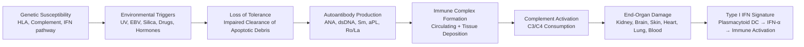
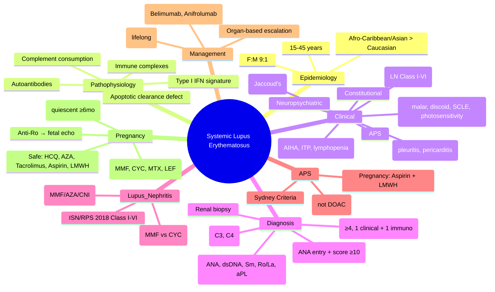

# Systemic Lupus Erythematosus (SLE)

> [!tip] **FCPS/MRCP Priority: CRITICAL**
> SLE is the **prototypic systemic autoimmune disease** — multi-organ, young women, diagnostic criteria (SLICC/EULAR), nephritis classification, pregnancy challenges. Guaranteed major viva/SBA topic.

---

## Learning Objectives
By the end of this note you should be able to:
- [ ] Apply 2019 EULAR/ACR and SLICC classification criteria for SLE
- [ ] Recognise major organ manifestations (renal, neuro, haematological, cutaneous, serosal)
- [ ] Classify lupus nephritis (ISN/RPS 2018) and select induction/maintenance therapy
- [ ] Manage SLE in pregnancy (hydroxychloroquine, aspirin, avoid teratogens)
- [ ] Diagnose and manage antiphospholipid syndrome (primary and secondary)
- [ ] Monitor disease activity (SLEDAI, BILAG, ECLAM) and damage (SLICC/ACR DI)

---

## 1. Definition & Epidemiology

| Feature | Detail |
|---------|--------|
| **Definition** | Chronic multisystem autoimmune disease with **loss of self-tolerance → autoantibodies (ANA, dsDNA, Sm, aPL) → immune complex deposition → organ damage** |
| **Prevalence** | 20-150/100,000 (varies by ethnicity) |
| **Incidence** | 1-10/100,000/year |
| **Peak Onset** | **15-45 years** (childhood and late-onset also occur) |
| **Sex Ratio** | **F:M = 9:1** (reproductive years) |
| **Ethnicity** | **Afro-Caribbean, Asian, Hispanic** > Caucasian — **higher prevalence, earlier onset, more severe disease (renal, neuro)** |
| **Genetics** | HLA-DR2/DR3, complement deficiencies (C1q, C2, C4 — strong but rare), IRF5, STAT4, BLK, TNFAIP3 |

---

## 2. Aetiology & Pathophysiology



### Key Pathogenic Features
| Mechanism | Detail | Clinical Relevance |
|-----------|--------|-------------------|
| **Defective apoptosis clearance** | NETosis, impaired DNase1 → nuclear antigens exposed | Source of autoantigens (dsDNA, histones, Sm) |
| **Type I IFN signature** | pDC → IFN-α → B-cell/T-cell activation, DC maturation | Biomarker of disease activity; anifrolumab target |
| **Autoantibodies** | **ANA** (95%), **anti-dsDNA** (70%, specific), **anti-Sm** (20-30%, pathognomonic), **aPL** (30-40%) | Diagnostic + prognostic (dsDNA = renal activity) |
| **Immune complexes** | Deposit in glomeruli (nephritis), skin (vasculitis), choroid plexus (neuro), joints | Complement fixation → inflammation |
| **Complement consumption** | **Low C3, C4** = active disease (especially renal) | Monitor C3/C4 for flare prediction |

---

## 3. Clinical Features — By System

### Constitutional
- **Fatigue** (universal, often disproportionate to inflammation)
- **Fever** (low-grade, inflammatory; exclude infection)
- **Weight loss** (active disease)
- **Lymphadenopathy** (generalised, reactive)

### Musculoskeletal (90-95%)
| Feature | Detail |
|---------|--------|
| **Arthralgia** | Often precedes arthritis; migratory, symmetrical |
| **Arthritis** | **Non-erosive**, **reducible** (Jaccoud's arthropathy — ulnar deviation, swan neck), MCP/PIP/wrist |
| **Myalgia** | Common; myositis rare (<5%) |
| **Tenosynovitis** | Can cause deformities without erosion |

> [!warning] **Jaccoud's Arthropathy**
> - **Reducible** deformities (ulnar drift, swan neck, boutonnière)
> - **Non-erosive** on X-ray
> - Laxity from tendon/ligament involvement, not synovial destruction

### Cutaneous (70-80%) — **Major Criteria**
| Lesion | Description | Specificity |
|--------|-------------|-------------|
| **Malar (butterfly) rash** | Erythema over cheeks/nose, **spares nasolabial folds** | High (SLE) |
| **Discoid lupus** | Scarring, atrophic, follicular plugging, hypo/hyperpigmentation | High (can be isolated DLE) |
| **Photosensitivity** | Rash after UV exposure (often malar) | High |
| **Subacute cutaneous (SCLE)** | Annular/papulosquamous, **Ro/SS-A+**, non-scarring | High |
| **Lupus profundus (panniculitis)** | Deep tender nodules, can ulcerate | Moderate |
| **Vasculitic lesions** | Palpable purpura, periungual infarcts, livedo reticularis | Moderate |
| **Alopecia** | **Non-scarring** (diffuse, frontal), **scarring** (discoid) | Non-specific |

> [!important] **Photosensitivity**
> - UVB → keratinocyte apoptosis → autoantigen exposure → flare
> - **Broad-spectrum sunscreen (SPF 50+) daily** = disease-modifying

### Renal — **Lupus Nephritis (LN) (40-60%)**
| Manifestation | Detail |
|---------------|--------|
| **Proteinuria** | Often nephrotic range (>3.5g/day) |
| **Haematuria** | Microscopic > macroscopic; dysmorphic RBCs, RBC casts |
| **Active sediment** | RBC casts, WBC casts, granular casts |
| **Renal impairment** | ↑ Cr, ↓ eGFR |
| **Hypertension** | Secondary to renal involvement |
| **Class** | **ISN/RPS 2018** (see Section 5) |

> [!critical] **All SLE patients: check urine dipstick + UPCR + eGFR at EVERY visit**

### Neuropsychiatric — **NPSLE (20-40%)**
| Manifestation | Central (CNS) | Peripheral (PNS) |
|---------------|---------------|------------------|
| **Seizures** | Generalised, focal | — |
| **Psychosis** | Delusions, hallucinations | — |
| **Cognitive dysfunction** | Memory, attention, executive | — |
| **Mood disorders** | Depression, anxiety | — |
| **Acute confusional state** | Delirium | — |
| **Cerebrovascular** | Stroke, TIA (aPL-related) | — |
| **Headache** | Migraine, tension (non-specific) | — |
| | | **Mononeuritis multiplex** (vasculitis) |
| | | **Polyneuropathy** (axonal) |
| | | **Cranial neuropathy** | 
| | | **Autonomic neuropathy** |

> [!important] **NPSLE Diagnosis**
> - **Exclusion diagnosis** — rule out infection, metabolic, drug, primary psychiatric, aPL stroke
> - **MRI brain** (T2/FLAIR hyperintensities, nonspecific), **CSF** (↑ protein, oligoclonal bands), **EEG**
> - **Anti-ribosomal P** = associated with psychosis/depression (low sensitivity)

### Haematological (80%)
| Manifestation | Mechanism | FCPS/MRCP Pearl |
|---------------|-----------|-----------------|
| **Anaemia of chronic disease** | Inflammation → hepcidin ↑ → iron sequestration | Normocytic, low Fe, **high ferritin** |
| **Haemolytic anaemia** | **Coombs +ve** (warm AIHA) | DAT +ve, reticulocytosis, ↑ LDH, ↓ haptoglobin |
| **Leukopenia** | Lymphopenia (common), neutropenia | Lymphopenia <1.0 = activity marker |
| **Thrombocytopenia** | **ITP-like** (anti-GPIIb/IIIa) | Can be severe (<20); rule out aPL, drugs, TTP |
| **Antiphospholipid syndrome** | aPL → thrombosis, pregnancy loss | See Section 6 |

### Serosal
| Manifestation | Detail |
|---------------|--------|
| **Pleuritis** | Pleuritic pain, effusion (exudate, low glucose, high LDH, ANA+) |
| **Pericarditis** | Most common cardiac manifestation; effusion (rarely tamponade) |
| **Peritonitis** | Rare; abdominal pain, ascites (exudate) |

### Other Systems
| System | Manifestation |
|--------|---------------|
| **GI** | Lupus enteritis (vasculitis → ischaemia), pancreatitis, hepatic vasculitis |
| **Pulmonary** | ILD (NSIP pattern), shrinking lung syndrome, pulmonary hypertension |
| **Cardiac** | **Accelerated atherosclerosis** (CV risk ×2-5), Libman-Sacks endocarditis (non-bacterial), myocarditis, conduction defects |
| **Ocular** | Keratoconjunctivitis sicca (Sjögren's overlap), scleritis, retinal vasculitis, choroidopathy |

---

## 4. Classification Criteria

### 2019 EULAR/ACR Criteria (Preferred for MRCP/FCPS)
**Entry Criterion: ANA ≥1:80 on HEp-2 cells at least once** (if negative → not SLE)

| Domain | Item | Weight |
|--------|------|--------|
| **Constitutional** | Fever | 2 |
| **Haematological** | Leukopenia (<4.0) / Lymphopenia (<1.0) | 3 |
| | Thrombocytopenia (<100) | 4 |
| | Autoimmune haemolysis | 4 |
| **Neuropsychiatric** | Seizures / Psychosis / Cognitive | 5 |
| **Mucocutaneous** | Non-scarring alopecia | 2 |
| | Oral/nasal ulcers | 2 |
| | Subacute cutaneous / Discoid lupus | 4 |
| | Acute cutaneous (malar, photosensitive) | 6 |
| **Serosal** | Pleurisy / Pericardial effusion | 5 |
| | Pericarditis (clinical) | 6 |
| **Musculoskeletal** | Joint involvement (synovitis ≥2 joints) | 6 |
| **Renal** | Proteinuria >0.5g/24h or UPCR >50 | 4 |
| | Renal biopsy Class II or V | 8 |
| | Renal biopsy Class III or IV | 10 |
| **Immunological** | ANA (≥1:80) | **Entry** |
| | Anti-dsDNA / Anti-Sm | 6 |
| | Antiphospholipid antibodies | 2 |
| | Low C3 / Low C4 | 3 / 4 |
| | Low C3 AND Low C4 | 4 |

**Total Score ≥10 = Classify as SLE** (if entry criterion met)

### SLICC 2012 Criteria (Classic — still tested)
| Clinical Criteria (4 needed, with ≥1 immunologic) | Immunologic Criteria |
|---------------------------------------------------|---------------------|
| 1. Acute cutaneous lupus | 1. ANA >lab ref |
| 2. Chronic cutaneous lupus | 2. Anti-dsDNA >lab ref |
| 3. Oral/nasal ulcers | 3. Anti-Sm >lab ref |
| 4. Non-scarring alopecia | 4. Antiphospholipid Ab |
| 5. Synovitis (2+ joints) | 5. Low C3/C4/CH50 |
| 6. Serositis (pleural/pericardial) | 6. Direct Coombs (no haemolysis) |
| 7. Renal (proteinuria >0.5g or RBC casts) | |
| 8. Neurologic (seizures/psychosis) | |
| 9. Haematologic (leukopenia/lymphopenia/thrombocytopenia/AIHA) | |

**SLICC: ≥4 criteria (1 clinical + 1 immunologic) OR biopsy-proven LN + ANA/anti-dsDNA**

> [!tip] **Key Differences**
> - **EULAR/ACR 2019**: Weighted score, ANA entry criterion, more granular renal weighting
> - **SLICC 2012**: Simple count, no entry criterion, biopsy-proven LN pathway

---

## 5. Lupus Nephritis — ISN/RPS 2018 Classification

| Class | Histology | % of LN | Clinical | Treatment |
|-------|-----------|---------|----------|-----------|
| **Class I** | Minimal mesangial | <5% | Normal urinalysis | None (HCQ) |
| **Class II** | Mesangial proliferative | 20% | Microscopic haematuria/proteinuria <1g | HCQ ± ACEi; **MMF/AZA if persistent** |
| **Class III** | Focal proliferative (<50% glomeruli) | 25% | Active sediment, proteinuria 1-3g | **Induction: MMF/IV CYC + steroids** |
| **Class IV** | Diffuse proliferative (≥50% glomeruli) | 40% | Nephritic/nephrotic, renal impairment | **Induction: MMF/IV CYC + steroids** (IV CYC preferred if severe) |
| **Class V** | Membranous | 15% | Nephrotic syndrome | **MMF + steroids** or **CNIs (tacrolimus)** |
| **Class VI** | Advanced sclerosing (>90% glomeruli) | <5% | ESRD | **RRT** (transplant if remission) |

> [!critical] **LN Treatment Algorithm**
> ```mermaid
> flowchart TD
>     A[Active LN Class III/IV/V] --> B{Severity}
>     B -->|Severe (Cr >2x, crescents >25%, rapidly progressive)| C[IV CYC 500-1000mg/m2 q2-4wk ×6 + Pulse MP 500-1000mg ×3]
>     B -->|Standard| D[MMF 2-3g/day + Oral Pred 0.5-1mg/kg taper]
>     C --> E[Maintenance: MMF 2g/day or AZA 2mg/kg + Pred ≤7.5mg]
>     D --> E
>     E --> F[Target: Complete remission (UPCR <0.5, normal Cr) at 6-12mo]
>     F -->|Not achieved| G[Switch: MMF↔CYC, add CNI, RTX, Belimumab, Voclosporin]
> ```

### Induction Regimens (6-12 months)
| Regimen | Dose | Monitoring |
|---------|------|------------|
| **MMF** | 2-3g/day (divided BD) | FBC, LFT, U&E, UPCR q2-4wk; LFT ↑ → ↓ dose; diarrhoea → switch to enteric |
| **IV Cyclophosphamide** (Euro-Lupus) | 500mg/m² q2wk ×6 (total 3g) | **Mesna + hydration**, FBC nadir day 10-14, fertility preservation (gonadotropin analogue) |
| **IV Cyclophosphamide** (NIH) | 0.5-1g/m² monthly ×6 | Higher cumulative dose → more toxicity |
| **Calcineurin Inhibitors** (Tacrolimus) | 0.05-0.1mg/kg/day (trough 5-10) | **Trough levels**, renal function, BP, glucose, neurotoxicity |
| **Corticosteroids** | Pulse MP 500-1000mg ×3 → Pred 0.5-1mg/kg → taper to ≤7.5mg by 6mo | Glucose, BP, bone, infection |

### Maintenance (minimum 3 years, often lifelong)
| Drug | Dose | Notes |
|------|------|-------|
| **MMF** | 2g/day | Preferred (better renal preservation, less malignancy) |
| **AZA** | 2mg/kg/day | If MMF intolerant; **TPMT test** |
| **Tacrolimus** | Trough 5-8 | If MMF/AZA fail |
| **Belimumab** | 10mg/kg IV q4wk / 200mg SC weekly | Add-on for active non-renal SLE ± LN |
| **Voclosporin** | 23.7mg BD | Add-on to MMF + steroids for LN (AURORA trial) |

---

## 6. Antiphospholipid Syndrome (APS)

### Classification (Sydney Criteria 2006)
| Clinical Criteria | Laboratory Criteria (on 2 occasions ≥12 weeks apart) |
|-------------------|-----------------------------------------------------|
| **Vascular thrombosis** (arterial/venous/small vessel) | **Lupus anticoagulant** (dRVVT + aPTT) |
| **Pregnancy morbidity**: ≥1 unexplained fetal death ≥10wk, ≥1 premature <34wk (eclampsia/placental), ≥3 unexplained embryonic losses <10wk | **Anti-cardiolipin** IgG/IgM (>40 GPL/MPL) |
| | **Anti-β2-glycoprotein I** IgG/IgM (>99th percentile) |

**Primary APS** = APS without SLE  
**Secondary APS** = APS with SLE (or other autoimmune)

### Management
| Scenario | Treatment |
|----------|-----------|
| **Thrombosis** | **Warfarin** (INR 2-3 venous, 3-4 arterial) — **DOACs inferior in APS** (TRAPS, ASTRO-APS trials) |
| **Pregnancy morbidity** | **Aspirin 75-100mg daily** from booking + **LMWH prophylactic** throughout pregnancy + 6wk postpartum |
| **Cardiac valve disease** (Libman-Sacks) | Consider warfarin if embolic |
| **Catastrophic APS (CAPS)** | **Triple therapy**: Anticoagulation + High-dose steroids + IVIG/Plasma exchange ± CYC/RTX |

> [!warning] **DOACs Contraindicated in APS** (especially triple positive) — use warfarin

---

## 7. Diagnosis — Investigations

| Test | Sensitivity | Specificity | Role |
|------|-------------|-------------|------|
| **ANA (HEp-2)** | **95-98%** | Low (positive in healthy, other CTDs) | **Screening** — entry criterion EULAR/ACR |
| **Anti-dsDNA** | 70% | **95%** | **Diagnostic + renal activity monitor** |
| **Anti-Sm** | 20-30% | **99%** | **Pathognomonic** |
| **Anti-Ro/SS-A** | 30-40% (SLE), 70% (Sjögren's) | 90% | SCLE, neonatal lupus (heart block), photosensitivity |
| **Anti-La/SS-B** | 30-50% (Sjögren's) | 95% | Always with Ro |
| **Antiphospholipid Ab** | 30-40% | Variable | APS diagnosis, thrombosis risk |
| **Low C3/C4** | 70-80% (active) | Moderate | **Disease activity** (especially renal flare) |
| **Direct Coombs** | 20-30% | — | AIHA |
| **Urine dipstick + UPCR** | — | — | **LN screen at EVERY visit** |
| **Renal biopsy** | — | — | **Classify LN** (ISN/RPS) — mandatory for Class III-V |
| **MRI brain / CSF / EEG** | — | — | NPSLE workup (exclusion) |

---

## 8. Disease Activity & Damage Indices

| Index | Use | Components |
|-------|-----|------------|
| **SLEDAI-2K** | Activity (research, trials) | 24 items (seizure=8, psychosis=8, renal=4, cutaneous=2, etc.) — **≥6 = active** |
| **BILAG-2004** | Activity (organ-based) | 9 systems (A=very active, B=moderate, C=mild, D=inactive) — **A/B = treat** |
| **ECLAM** | Activity (European) | Weighted clinical + lab |
| **SLICC/ACR DI** | **Cumulative damage** | 12 systems (scarring, deformity, cataract, renal failure, CV, malignancy, etc.) — **never decreases** |

> [!tip] **Clinical Practice**
> - **SLEDAI/BILAG** for trial eligibility, severe flares
> - **Clinically**: monitor symptoms, UPCR, eGFR, C3/C4, dsDNA, FBC, BP
> - **SLICC/ACR DI** annually — tracks irreversible damage

---

## 9. Management — Organ-Based

```mermaid
flowchart TD
    A[SLE Diagnosis] --> B[Hydroxychloroquine ALL PATIENTS\n200-400mg daily (≤5mg/kg)]
    B --> C{Organ Involvement}
    C -->|Mild (cutaneous, joint, serosal)| D[HCQ + Low-dose Pred (≤10mg) ± NSAID]
    C -->|Moderate (haematologic, low-grade renal Class II)| E[HCQ + Pred 0.5mg/kg + MMF/AZA]
    C -->|Severe (LN Class III/IV/V, NPSLE, severe haematologic)| F[HCQ + Pulse MP + MMF or IV CYC + Pred taper]
    C -->|APS| G[Warfarin (INR 2-3) + Aspirin if arterial]
    D --> H[Target: Remission/Low Activity]
    E --> H
    F --> H
    G --> H
    H --> I[Taper steroids to ≤5-7.5mg\nMaintain HCQ lifelong]
```

### First-Line for ALL SLE
| Drug | Dose | Duration | Rationale |
|------|------|----------|-----------|
| **Hydroxychloroquine** | 200-400mg daily (≤5mg/kg IBW) | **Lifelong** | ↓ flares, ↓ damage, ↑ survival, ↓ thrombosis, ↓ LN risk, safe in pregnancy |

### Organ-Specific Add-Ons

| Organ | Mild | Moderate | Severe |
|-------|------|----------|--------|
| **Cutaneous** | Topical steroids, HCQ | Oral pred ≤10mg, MMF, dapsone, thalidomide | Pred >10mg, MMF, RTX, anifrolumab |
| **Joint** | NSAID, HCQ | Pred ≤10mg, MTX, SSZ | Pred, MTX, biologics (belimumab, anifrolumab) |
| **Haematologic** (ITP/AIHA) | Pred 0.5-1mg/kg | IVIG, RTX, TPO-RA (romiplostim), splenectomy | IVIG, RTX, CYC |
| **LN Class II** | ACEi/ARB, HCQ | MMF/AZA + low-dose pred | — |
| **LN Class III/IV/V** | — | MMF + pred (standard) | **IV CYC + pulse MP** (if severe) |
| **NPSLE** | Exclude other causes | Pred + MMF/CYC/RTX | **Pulse MP + IV CYC/RTX** |
| **APS** | Aspirin 75mg | Warfarin (if thrombosis) | Warfarin INR 3-4 (arterial) |

### Biologics / Advanced Therapies
| Drug | Indication | Mechanism |
|------|------------|-----------|
| **Belimumab** | Active autoantibody+ve SLE (non-renal) ± LN | Anti-BLyS/BAFF → ↓ B-cell survival |
| **Anifrolumab** | Moderate-severe SLE (non-renal) | Anti-IFNAR → blocks type I IFN |
| **Voclosporin** | LN Class III/IV/V (add-on to MMF+steroids) | Calcineurin inhibitor |
| **Rituximab** | Refractory SLE (off-label), NPSLE, severe haematologic, APS | Anti-CD20 → B-cell depletion |

---

## 10. SLE in Pregnancy — **High-Yield Viva Topic**

### Pre-Conception Counselling (Ideally 6 months before)
| Goal | Action |
|------|--------|
| **Disease quiescent** | **Target: remission ≥6 months** before conception |
| **Renal function** | Baseline Cr, UPCR (if UPCR >0.5g or Cr >120 → high risk) |
| **Medication review** | **STOP teratogens** (MMF, CYC, MTX, LEF, mycophenolate) **≥3-6 months before** |
| **Safe drugs** | **HCQ (continue lifelong)**, **Pred (≤10mg safe)**, **AZA (safe)**, **Tacrolimus (safe)**, **Aspirin 75mg**, **LMWH** |
| **APS screen** | **aPL panel** — if positive → aspirin + LMWH throughout |
| **Anti-Ro/La** | If positive → **fetal echo 18-24wk, then q1-2wk to 28-30wk** (neonatal lupus heart block risk 2%) |

### Pregnancy Flare Management
| Flare | Treatment |
|-------|-----------|
| **Mild** (cutaneous, joint) | HCQ + Pred ≤10mg + NSAID (avoid 3rd tri) |
| **Moderate** (haematologic, serosal) | **Pred 0.5mg/kg** + **AZA** (safe) |
| **Severe** (LN, NPSLE, CAPS) | **Pulse MP + IV CYC (2nd/3rd tri only if life-threatening)** + **AZA** / RTX (2nd/3rd tri) |

> [!critical] **Teratogens to STOP Pre-Conception**
> - **MMF** (stop ≥6 weeks) — major malformations (ear, cleft, cardiac)
> - **CYC** (stop ≥3 months) — teratogenic, gonadal toxicity
> - **MTX** (stop ≥3 months) — teratogenic
> - **LEF** (washout cholestyramine) — teratogenic
> - **ACEi/ARB** (stop immediately on confirmation) — fetal renal toxicity

### Neonatal Lupus (Anti-Ro/La+ Mothers)
| Manifestation | Risk | Monitoring |
|---------------|------|------------|
| **Congenital heart block** (CHB) | 2% (10% if previous affected) | **Fetal echo 18-24wk, q1-2wk to 28-30wk** |
| **Cutaneous lupus** | 10-20% | Self-limiting (maternal Ab clearance by 6-8mo) |
| **Haematologic** | Rare | Transient |

---

## 11. FCPS/MRCP High-Yield Summary

| Topic | Key Points |
|-------|------------|
| **Diagnosis** | EULAR/ACR 2019: ANA ≥1:80 entry + weighted score ≥10; SLICC: ≥4 (1 clinical + 1 immunologic) |
| **Best Specific Antibody** | **Anti-Sm (99% specific)**; **Anti-dsDNA (95% specific, correlates with renal activity)** |
| **ANA Pattern** | Homogeneous (dsDNA/histones), Speckled (ENA: Sm, RNP, Ro, La), Rim (dsDNA), Nucleolar (Scl-70 — scleroderma) |
| **Lupus Nephritis** | Class III/IV = proliferative → **MMF or IV CYC + steroids**; Class V = membranous → MMF/CNI + steroids |
| **LN Induction** | Euro-Lupus CYC 500mg/m² q2wk ×6 (low dose, less gonadal toxicity) **or** MMF 2-3g/day |
| **APS** | Thrombosis/pregnancy morbidity + aPL (LA, aCL, anti-β2GPI) ×2 ≥12wk apart; **Warfarin (not DOAC)** |
| **Pregnancy Safe** | **HCQ (continue)**, Pred ≤10mg, AZA, Tacrolimus, Aspirin, LMWH |
| **Pregnancy Avoid** | MMF, CYC, MTX, LEF, ACEi/ARB |
| **Neonatal Lupus** | Anti-Ro/La → fetal heart block (2%) → fetal echo 18-30wk q1-2wk |
| **NPSLE** | Exclusion diagnosis; MRI/CSF/EEG; treat with steroids + MMF/CYC/RTX |
| **HCQ** | **ALL SLE patients lifelong** — ↓ flares, ↓ damage, ↓ thrombosis, safe in pregnancy |

---

## 12. Viva Questions (MRCP PACES / FCPS)

| Question | Expected Answer |
|----------|----------------|
| "A 25yo woman has malar rash, oral ulcers, arthritis, proteinuria 1.2g/day, ANA 1:640 homogeneous, anti-dsDNA 200, low C3. Classify and manage." | **SLE** (EULAR/ACR: acute cutaneous 6, oral ulcers 2, joint 6, renal biopsy Class III/IV 10 = 24 >10). **Renal biopsy** for ISN/RPS class. **LN Class III/IV**: MMF 2-3g/day + pred 0.5-1mg/kg taper + HCQ. |
| "What is the 2019 EULAR/ACR entry criterion for SLE?" | **ANA ≥1:80 on HEp-2 cells at least once** (if negative, not SLE). |
| "How do you classify lupus nephritis?" | **ISN/RPS 2018**: Class I (minimal), II (mesangial), III (focal <50%), IV (diffuse ≥50%), V (membranous), VI (sclerotic). |
| "A 30yo SLE patient wants pregnancy. She's on MMF 2g/day. What do you do?" | **Stop MMF ≥6 weeks pre-conception** (teratogenic). Switch to **AZA 2mg/kg/day** (safe). Continue **HCQ**. Start **aspirin 75mg** at booking. Screen aPL. |
| "SLE patient with DVT, positive lupus anticoagulant. Anticoagulant?" | **Warfarin INR 2-3** (DOACs inferior in APS — TRAPS/ASTRO-APS). |
| "Anti-Ro positive SLE patient in pregnancy. Fetal monitoring?" | **Fetal echocardiography 18-24 weeks, then every 1-2 weeks until 28-30 weeks** for congenital heart block. |
| "How does hydroxychloroquine benefit SLE?" | ↓ Flares, ↓ damage accrual, ↓ thrombosis, ↓ LN risk, ↑ survival, safe in pregnancy, ↓ lipid/glucose. **Lifelong for ALL SLE**. |
| "What is the difference between Jaccoud's arthropathy and RA deformity?" | Jaccoud's: **reducible**, **non-erosive**, tendon/ligament laxity. RA: **fixed**, **erosive**, synovial destruction. |

---

## 13. Confusions & Mnemonics

| Confusion | Clarification |
|-----------|---------------|
| **ANA negative SLE** | Rare (<5%). Usually **anti-Ro/SS-A only** (subacute cutaneous, neonatal lupus). Test ENA directly if high suspicion. |
| **Anti-dsDNA vs Anti-Sm** | dsDNA: 70% sens, 95% spec — **monitors renal activity**. Sm: 20-30% sens, **99% spec** — **diagnostic/pathognomonic**. |
| **LN Class III vs IV** | III = focal (<50% glomeruli); IV = diffuse (≥50%). Both proliferative → similar induction (MMF/CYC). |
| **DOACs in APS** | **Contraindicated** (especially triple positive) — higher thrombosis recurrence. Use **warfarin**. |
| **MMF in pregnancy** | **Teratogenic** — stop ≥6 weeks pre-conception. Switch to AZA. |
| **SLEDAI vs BILAG** | SLEDAI = global weighted score (research). BILAG = organ-based A-D (clinical decisions). |

**Mnemonic: SLE Criteria = "SOAP BRAIN MD"** (SLICC Clinical)
- **S**erology (ANA, dsDNA, Sm, aPL)
- **O**ral ulcers
- **A**rthritis (non-erosive)
- **P**hotosensitivity
- **B**lood (cytopenias, AIHA)
- **R**enal (proteinuria, casts)
- **A**nti-dsDNA/Sm
- **I**mmunologic (aPL, low complement)
- **N**eurologic (seizures, psychosis)
- **M**alar rash
- **D**iscoid rash

**Mnemonic: EULAR/ACR Weighted = "SKIN JOINTS KIDNEY BLOOD BRAIN"**
- **S**kin (acute 6, discoid 4, SCLE 4, alopecia 2, ulcers 2)
- **J**oints (6)
- **K**idney (Class III/IV 10, Class II/V 8, proteinuria 4)
- **B**lood (haemolysis 4, thrombocytopenia 4, leukopenia 3)
- **B**rain (seizure/psychosis/cognitive 5)
- **S**erosal (pericarditis 6, pleurisy 5)
- **I**mmunologic (dsDNA/Sm 6, aPL 2, low C3/C4 3/4)

**Mnemonic: Pregnancy Safe = "H.A.T.A.P."**
- **H**CQ, **A**ZA, **T**acrolimus, **A**spirin, **P**red (≤10mg), **P** = LMWH (prophylaxis)

---

## 14. Mind Map



---

## 15. One-Page Revision Card

| Domain | Key Points |
|--------|------------|
| **Demographics** | F:M 9:1, 15-45y, Afro-Caribbean/Asian > Caucasian (↑ severity) |
| **Diagnosis** | **EULAR/ACR 2019**: ANA ≥1:80 entry + weighted score ≥10 **OR SLICC**: ≥4 criteria (1 clinical + 1 immuno) |
| **Specific Antibodies** | **Anti-Sm 99% specific**; **Anti-dsDNA 95% specific + renal activity**; Anti-Ro/La → neonatal lupus, SCLE |
| **ANA Patterns** | Homogeneous (dsDNA), Speckled (ENA), Rim (dsDNA), Nucleolar (scleroderma) |
| **Lupus Nephritis** | Class III/IV = proliferative → MMF or CYC + steroids; Class V = membranous → MMF/CNI + steroids |
| **APS** | Thrombosis/pregnancy morbidity + aPL ×2 ≥12wk → **Warfarin (not DOAC)** |
| **Pregnancy** | **STOP**: MMF, CYC, MTX, LEF. **SAFE**: HCQ (continue), AZA, Tacrolimus, Pred ≤10mg, Aspirin, LMWH. Anti-Ro → fetal echo 18-30wk |
| **HCQ** | **ALL SLE lifelong** — ↓ flares, damage, thrombosis, LN, safe in pregnancy |
| **NPSLE** | Exclusion diagnosis — MRI/CSF/EEG; treat steroids + MMF/CYC/RTX |
| **Monitoring** | UPCR, eGFR, C3/C4, dsDNA, FBC, BP at EVERY visit; SLICC/ACR DI annually |

---

## 16. Spaced Repetition Trackers

| Review Interval | Date Completed | Confidence (1-5) | Notes |
|-----------------|----------------|------------------|-------|
| 24 hours | | | |
| 7 days | | | |
| 15 days | | | |
| 30 days | | | |
| 90 days | | | |

---

## 17. Self-Test Scorecard

| Section | Score /5 | Last Attempt |
|---------|----------|--------------|
| Classification Criteria (EULAR/ACR vs SLICC) | | |
| LN ISN/RPS Classification & Treatment | | |
| APS Diagnosis & Management | | |
| Pregnancy Management | | |
| NPSLE Approach | | |
| Autoantibody Specificities | | |
| HCQ Indications | | |
| Viva Questions | | |

---

## Local Navigation
- **Parent Heading**: [[../Autoimmune Rheumatic Diseases|Autoimmune Rheumatic Diseases]]
- **Parent Topic Group**: [[Systemic lupus erythematosus and related conditions]]
- **Chapter Map**: [[../Davidson Chapter 26 - Rheumatology Hierarchy|Rheumatology Hierarchy]]
- **Chapter MOC**: [[../Rheumatology MOC|Rheumatology MOC]]
- **Drug Reference**: [[../../Clinical Approach to Musculoskeletal Disease/Drugs in rheumatology|Drugs in rheumatology]]
- **Investigation Reference**: [[../../Clinical Approach to Musculoskeletal Disease/Investigations in rheumatology|Investigations in rheumatology]]
- **Related**: [[Antiphospholipid syndrome]] · [[Lupus nephritis]]
---

> Auto-generated study sections for "Autoimmune Rheumatic Diseases" — Ch 25: Rheumatology & Bone Disease.

## Flashcards (20 generated)

- Q: What is the definition of Autoimmune Rheumatic Diseases?
  A: SLE is the prototypic systemic autoimmune disease — multi-organ, young women, diagnostic criteria (SLICC/EULAR), nephritis classification, pregnancy challenges.
- Q: What is Arthralgia of Autoimmune Rheumatic Diseases?
  A: Often precedes arthritis; migratory, symmetrical
- Q: What is Arthritis of Autoimmune Rheumatic Diseases?
  A: Non-erosive, reducible (Jaccoud's arthropathy — ulnar deviation, swan neck), MCP/PIP/wrist
- Q: What is Myalgia of Autoimmune Rheumatic Diseases?
  A: Common; myositis rare (<5%)
- Q: What is Tenosynovitis of Autoimmune Rheumatic Diseases?
  A: Can cause deformities without erosion
- Q: What is Arthralgia of Autoimmune Rheumatic Diseases?
  A: Often precedes arthritis; migratory, symmetrical
- Q: What is Arthritis of Autoimmune Rheumatic Diseases?
  A: Non-erosive, reducible (Jaccoud's arthropathy — ulnar deviation, swan neck), MCP/PIP/wrist
- Q: What is Myalgia of Autoimmune Rheumatic Diseases?
  A: Common; myositis rare (<5%)
- Q: What is Tenosynovitis of Autoimmune Rheumatic Diseases?
  A: Can cause deformities without erosion
- Q: What is the investigation of choice for Autoimmune Rheumatic Diseases?
  A: EULAR/ACR 2019: ANA ≥1:80 entry + weighted score ≥10; SLICC: ≥4 (1 clinical + 1 immunologic)
- Q: What is Best Specific Antibody of Autoimmune Rheumatic Diseases?
  A: Anti-Sm (99% specific); Anti-dsDNA (95% specific, correlates with renal activity)
- Q: What is ANA Pattern of Autoimmune Rheumatic Diseases?
  A: Homogeneous (dsDNA/histones), Speckled (ENA: Sm, RNP, Ro, La), Rim (dsDNA), Nucleolar (Scl-70 — scleroderma)
- Q: What is Lupus Nephritis of Autoimmune Rheumatic Diseases?
  A: Class III/IV = proliferative → MMF or IV CYC + steroids; Class V = membranous → MMF/CNI + steroids
- Q: What is LN Induction of Autoimmune Rheumatic Diseases?
  A: Euro-Lupus CYC 500mg/m² q2wk ×6 (low dose, less gonadal toxicity) or MMF 2-3g/day
- Q: What is APS of Autoimmune Rheumatic Diseases?
  A: Thrombosis/pregnancy morbidity + aPL (LA, aCL, anti-β2GPI) ×2 ≥12wk apart; Warfarin (not DOAC)
- Q: What is Pregnancy Safe of Autoimmune Rheumatic Diseases?
  A: HCQ (continue), Pred ≤10mg, AZA, Tacrolimus, Aspirin, LMWH
- Q: What is Pregnancy Avoid of Autoimmune Rheumatic Diseases?
  A: MMF, CYC, MTX, LEF, ACEi/ARB
- Q: What is Neonatal Lupus of Autoimmune Rheumatic Diseases?
  A: Anti-Ro/La → fetal heart block (2%) → fetal echo 18-30wk q1-2wk
- Q: What is NPSLE of Autoimmune Rheumatic Diseases?
  A: Exclusion diagnosis; MRI/CSF/EEG; treat with steroids + MMF/CYC/RTX
- Q: What is HCQ of Autoimmune Rheumatic Diseases?
  A: ALL SLE patients lifelong — ↓ flares, ↓ damage, ↓ thrombosis, safe in pregnancy

## MCQs (1 generated)

1. **Which of the following best describes Autoimmune Rheumatic Diseases?**
   A. **SLE is the prototypic systemic autoimmune disease — multi-organ, young women, diagnostic criteria (SLICC/EULAR), nephritis classification, pregnancy challenges.**
   B. An unrelated condition not matching the clinical picture of Autoimmune Rheumatic Diseases
   C. A complication seen late in the disease course of Autoimmune Rheumatic Diseases
   D. A condition that mimics Autoimmune Rheumatic Diseases but has a different underlying cause

## SBA Questions (1 generated)

1. A patient with suspected Autoimmune Rheumatic Diseases presents with: Definition — Chronic multisystem autoimmune disease with loss of self-tolerance → autoantibodies (ANA, dsDNA, Sm, aPL) → immune complex deposition → organ damage; Prevalence — 20-150/100,000 (varies by ethnicity); Peak Onset — 15-45 years (childhood and late-onset also occur). What is the most likely diagnosis?
   A. **Autoimmune Rheumatic Diseases**
   B. A condition that mimics Autoimmune Rheumatic Diseases but is not the same entity
   C. A complication of Autoimmune Rheumatic Diseases rather than the primary diagnosis
   D. An unrelated condition in the same clinical category as Autoimmune Rheumatic Diseases

