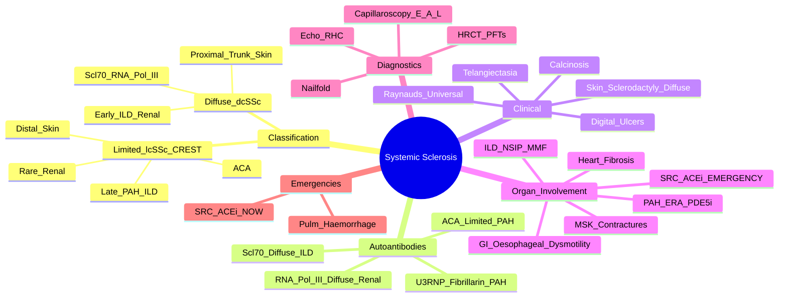

# Systemic Sclerosis (Scleroderma)

> [!tip] **FCPS/MRCP Priority: CRITICAL**
> Systemic sclerosis = **fibrotic autoimmune disease** with **vascular injury (Raynaud's)** + **fibrosis**. **Limited (CREST, ACA+) vs Diffuse (Scl-70/RNA Pol III+)**. **Scleroderma Renal Crisis (SRC) = new HTN + AKI + MAHA → ACEi IMMEDIATELY**. ILD/PAH leading causes of death.

---

## Learning Objectives
By the end of this note you should be able to:
- [ ] Classify as Limited (lcSSc/CREST) vs Diffuse (dcSSc) based on skin extent and autoantibodies
- [ ] Recognise CREST syndrome and its association with centromere antibody
- [ ] Diagnose and manage **Scleroderma Renal Crisis (SRC) — ACEi is life-saving**
- [ ] Interpret autoantibody profile (ACA = limited/PAH; Scl-70 = diffuse/ILD; RNA Pol III = diffuse/renal crisis)
- [ ] Screen for ILD (HRCT, PFTs) and PAH (Echo → RHC)
- [ ] Apply nailfold capillaroscopy for diagnosis and prognosis
- [ ] Select treatment for ILD (MMF, CYC, nintedanib, tocilizumab) and PAH (ERA, PDE5i, prostacyclin)

---

## 1. Definition & Epidemiology

| Feature | Detail |
|---------|--------|
| **Definition** | Systemic autoimmune disease characterised by **vasculopathy (Raynaud's)**, **fibrosis** (skin, viscera), and **autoimmunity** (specific autoantibodies) |
| **Incidence** | 1-2/100,000/year |
| **Prevalence** | 7-24/100,000 |
| **Peak Onset** | **30-50 years** |
| **Sex Ratio** | **F:M = 4:1** |
| **Ethnicity** | African Americans → more diffuse, severe, worse prognosis (ILD, renal crisis) |
| **Genetics** | HLA-DRB1*11, IRF5, STAT4, CD247 |

---

## 2. Classification — Limited vs Diffuse

| Feature | **Limited Cutaneous (lcSSc) / CREST** | **Diffuse Cutaneous (dcSSc)** |
|---------|--------------------------------------|-------------------------------|
| **Skin Extent** | **Distal only** — fingers, hands, face (sclerodactyly) | **Proximal + Trunk** — arms, thighs, chest, abdomen, back |
| **Onset** | **Raynaud's years before skin** (often 5-10y) | **Rapid skin progression** from onset |
| **Autoantibody** | **Centromere (ACA) 60-80%** | **Scl-70 (Topo I) 20-30%**; **RNA Pol III 10-15%** |
| **Internal Organs** | **Late** — PAH, mild ILD, GI | **Early** — ILD, renal crisis, cardiac, GI |
| **Renal Crisis** | **Rare** | **Common (10-15%)** — **RNA Pol III associated** |
| **PAH** | **Common (late)** | Less common |
| **ILD** | Late, mild | Early, severe |
| **Prognosis** | **Better** (10-yr survival ~80%) | **Worse** (10-yr survival ~60-70%) |

> [!critical] **CREST Syndrome (Limited Subset)**
> - **C**alcinosis (subcutaneous)
> - **R**aynaud's phenomenon
> - **E**sophageal dysmotility (dysphagia, reflux)
> - **S**clerodactyly (distal skin tightening)
> - **T**elangiectasia (face, hands, mucosal)
> - **Anti-centromere (ACA) positive** in 80-90%

---

## 3. Autoantibodies — **Prognostic & Organ Prediction**

| Antibody | Frequency | Subtype | Key Association | Prognosis |
|----------|-----------|---------|-----------------|-----------|
| **Centromere (ACA)** | 60-80% lcSSc | **Limited (CREST)** | **PAH** (late), calcinosis, telangiectasia | Better |
| **Scl-70 (Topoisomerase I)** | 20-30% dcSSc | **Diffuse** | **ILD (NSIP)** — early, severe | Worse (ILD) |
| **RNA Polymerase III** | 10-15% dcSSc | **Diffuse** | **Scleroderma Renal Crisis** — rapid skin progression | Worse (renal) |
| **Anti-U3 RNP (Fibrillarin)** | 5% | Diffuse (African American) | PAH, cardiac, skeletal muscle | Poor |
| **Anti-Th/To** | 5% | Limited | PAH, ILD | Intermediate |
| **Anti-PM-Scl** | 5-10% | Overlap (PM/Scl) | Myositis + scleroderma features | Variable |

> [!warning] **Antibody-Guided Organ Screening**
> - **ACA+** → Screen for **PAH** (annual echo + PFTs)
> - **Scl-70+** → Screen for **ILD** (baseline HRCT + PFTs, repeat)
> - **RNA Pol III+** → **Monitor renal function closely** (BP, Cr, urine at every visit)

---

## 4. Clinical Features

### Vascular
| Feature | Description |
|---------|-------------|
| **Raynaud's Phenomenon** | **Universal (95-99%)** — often **first symptom** (years before skin in limited) |
| **Digital Ulcers / Pitting Scars** | 40-50% — ischaemic, painful, slow healing |
| **Telangiectasia** | Face, hands, lips, oral mucosa — **matte, not spider nevi** |
| **Nailfold Capillaroscopy** | **Enlarged loops, dropout, avascular areas** — diagnostic + severity |

### Skin
| Feature | Limited | Diffuse |
|---------|---------|---------|
| **Sclerodactyly** | Distal fingers only | Proximal + trunk |
| **Diffuse Skin Thickening** | Absent | Present (arms, thighs, trunk, face) |
| **Calcinosis** | Common (fingertips, extensor) | Less common |
| **Microstomia** | Late | Earlier |
| **Salt-and-Pepper Skin** | Face, neck | Generalised |

### Visceral Organ Involvement
| Organ | Manifestation | Frequency | Key Points |
|-------|---------------|-----------|------------|
| **GI (90%)** | **Oesophageal dysmotility** (dysphagia, reflux), **bacterial overgrowth** (diarrhoea, bloating), constipation, faecal incontinence | 90% | **Most common** visceral involvement |
| **Lung** | **ILD (NSIP > UIP)** — restrictive, ↓DLCO; **PAH** (isolated or ILD-associated) | 40-80% ILD; 10-15% PAH | **Leading cause of death** |
| **Kidney** | **Scleroderma Renal Crisis** — new HTN, oliguric AKI, MAHA | 10-15% dcSSc; rare lcSSc | **ACEi = life-saving** |
| **Heart** | Fibrosis, arrhythmias, pericarditis, diastolic dysfunction | 20-30% | Conduction defects, HF |
| **Musculoskeletal** | Arthralgia, contractures (flexion), myopathy, tendon friction rubs | 50-80% | Tendon friction rubs = active disease |

---

## 5. Scleroderma Renal Crisis (SRC) — **EMERGENCY**

> [!critical] **Diagnosis: NEW Hypertension + AKI + Microangiopathic Haemolytic Anaemia (MAHA)**
> - **New-onset HTN** (often accelerated/malignant)
> - **Oliguric AKI** (rapidly rising Cr)
> - **MAHA**: Schistocytes, ↓Hb, ↓Haptoglobin, ↑LDH, ↑Reticulocytes, **normal coagulation**
> - **Thrombocytopenia** (often)
> - **Preceded by**: Rapid skin progression, new corticosteroid use, RNA Pol III+

### Management — **ACEi IMMEDIATELY**
```mermaid
flowchart TD
    A[Suspected SRC:\nNew HTN + AKI + MAHA] --> B[**START ACEi IMMEDIATELY**\nCaptopril 6.25-25mg PO q6-8h\nTITRATE AGGRESSIVELY to BP control]
    B --> C[Strict BP Monitoring\n(q1-2h initially)]
    C --> D[Renal Replacement Therapy\nif oliguric/uncontrolled]
    D --> E[Continue ACEi indefinitely\n(even if dialysis → may recover)]
    E --> F[Avoid NSAIDs, Steroids (if possible)\nMonitor K+]
```

> [!critical] **Key Points**
> - **DO NOT DELAY ACEi** — every hour of delay = worse renal recovery
> - **Captopril preferred** (short-acting, titratable) — 6.25-25mg q6-8h
> - **Continue ACEi even on dialysis** — renal recovery possible months later
> - **Avoid ACEi BEFORE SRC** (no prophylaxis) — may mask early signs
> - **Outcome**: 50% recover renal function if ACEi started early; historical mortality >80% before ACEi

---

## 6. Interstitial Lung Disease (ILD) — **Major Mortality Driver**

| Feature | Detail |
|---------|--------|
| **Pattern** | **NSIP > UIP** (contrast with IPF) |
| **Screening** | **Baseline HRCT + PFTs (FVC, DLCO)** — repeat 6-12 monthly |
| **Progression** | ↓FVC >10% or ↓DLCO >15% = progression |
| **Treatment** | **MMF 2-3g/day** (1st line, SLS-I/II trials) — **CYC alternative**; **Nintedanib** (anti-fibrotic, slows FVC decline); **Tocilizumab** (faSScinate trial — preserves FVC); **RTX** (refractory) |
| **Monitoring** | FVC, DLCO, HRCT, 6MWT |

> [!important] **NSIP vs UIP in SSc**
> - **NSIP**: Ground-glass, fine reticulation, **sparing of subpleural regions** — **better response to immunosuppression**
> - **UIP**: Honeycombing, traction bronchiectasis, **subpleural basal predominance** — less responsive

---

## 7. Pulmonary Arterial Hypertension (PAH)

| Feature | Detail |
|---------|--------|
| **Screening** | **Annual Echo (RVSP) + PFTs (DLCO)** — **DLCO <60% predicted + FVC/DLCO >1.6 = high risk** |
| **Confirmation** | **Right Heart Catheterisation (RHC)** — Gold standard: mPAP >20mmHg, PAWP ≤15mmHg, PVR >3WU |
| **SSc-PAH Specific** | **Isolated PAH** (no ILD) more common in **limited (ACA+)**; **ILD-associated PAH** in diffuse |
| **Treatment** | **ERA** (Bosentan, Ambrisentan, Macitentan) + **PDE5i** (Sildenafil, Tadalafil) ± **Prostacyclin analogues** (IV Epoprostenol, SC Treprostinil, Inhaled Iloprost) — **Selexipag** (oral IP receptor agonist) |
| **Avoid** | High-dose calcium channel blockers (non-responders); anticoagulation not routine |

---

## 8. Nailfold Capillaroscopy — **Diagnostic + Prognostic**

| Pattern | Findings | Significance |
|---------|----------|--------------|
| **Early** | Few enlarged loops, mild dropout | Early disease |
| **Active** | **Numerous enlarged/giant loops, haemorrhages, moderate dropout** | Active vasculopathy |
| **Late** | **Severe dropout, avascular areas, ramified/bushy loops** | Severe, late disease; higher organ risk |

> [!tip] **Utility**
> - **Diagnostic**: Distinguishes SSc from primary Raynaud's (normal capillaroscopy)
> - **Prognostic**: Active/late pattern → higher risk of digital ulcers, PAH, ILD

---

## 9. Management Summary

| Domain | Treatment |
|--------|-----------|
| **Raynaud's** | **Calcium channel blockers** (Nifedipine, Amlodipine) 1st line; **PDE5i** (Sildenafil); **IV Iloprost** (severe ulcers); **Bosentan** (prevent new ulcers) |
| **Digital Ulcers** | Wound care, antibiotics if infected; **IV Iloprost**; **Bosentan** (prevent new); **RTX** (refractory) |
| **GI** | **PPI** (reflux); **Prokinetics** (Domperidone, Prucalopride); **Antibiotics** (Rifaximin) for bacterial overgrowth; **Laxatives** |
| **ILD** | **MMF 2-3g/day** (1st line); **CYC IV** (alternative); **Nintedanib** (anti-fibrotic); **Tocilizumab** (preserves FVC); **RTX** (refractory) |
| **PAH** | **ERA + PDE5i** 1st line; **Prostacyclin** (IV/SC/Inhaled) if severe; **Selexipag** |
| **SRC** | **ACEi (Captopril) IMMEDIATE & AGGRESSIVE** — even on dialysis |
| **Skin** | **MMF** (improves skin score); **MTX** (early diffuse); **IVIG** (refractory); **Autologous HSCT** (ASTIS trial — severe, early) |
| **Calcinosis** | No proven medical; **Diltiazem**, **Minocycline**, **Bisphosphonates**, surgical excision if ulcerated |

---

## 10. FCPS/MRCP High-Yield Summary

| Topic | Key Points |
|-------|------------|
| **Classification** | **Limited (lcSSc/CREST)**: distal skin, ACA+, late PAH/ILD, rare renal crisis. **Diffuse (dcSSc)**: proximal+trunk, Scl-70/RNA Pol III+, early ILD/renal crisis. |
| **CREST** | Calcinosis, Raynaud's, Esophageal dysmotility, Sclerodactyly, Telangiectasia — **ACA+** |
| **Autoantibodies** | **ACA = Limited + PAH**; **Scl-70 = Diffuse + ILD**; **RNA Pol III = Diffuse + Renal Crisis** |
| **Renal Crisis (SRC)** | **New HTN + AKI + MAHA** → **ACEi (Captopril) IMMEDIATELY** — life-saving; 50% recover if early |
| **ILD** | NSIP pattern; **MMF 1st line** (SLS-I/II); Nintedanib, Tocilizumab, CYC |
| **PAH** | Annual Echo + PFTs (DLCO); RHC confirm; ERA + PDE5i ± Prostacyclin |
| **Capillaroscopy** | Enlarged loops → dropout → avascular areas = severity |
| **GI** | Oesophageal dysmotility (reflux, dysphagia) — PPI + prokinetics; bacterial overgrowth — antibiotics |
| **Prognosis** | Limited better (10yr 80%) vs Diffuse worse (10yr 60-70%); PAH/ILD = major mortality |

---

## 11. Viva Questions (MRCP PACES / FCPS)

| Question | Expected Answer |
|----------|----------------|
| "A 45yo woman has Raynaud's for 10y, sclerodactyly, telangiectasia, reflux. Anti-centromere positive. Subtype and screening?" | **Limited cutaneous SSc (CREST)**. Screen for **PAH** (annual Echo + PFTs), GI (PPI), calcinosis. Renal crisis rare. |
| "A 50yo man with diffuse SSc develops new hypertension (200/110), oliguria, Cr rising from 90 to 300, schistocytes on blood film. Management?" | **Scleroderma Renal Crisis** — **START CAPTOPRIL IMMEDIATELY** (6.25-25mg q6-8h, titrate to BP control). Continue even if dialysis needed. Avoid steroids/NSAIDs. |
| "What are the three main autoantibodies in SSc and their associations?" | **ACA** = Limited (CREST) + PAH; **Scl-70** = Diffuse + ILD; **RNA Pol III** = Diffuse + Renal Crisis. |
| "What is the first-line treatment for SSc-ILD?" | **Mycophenolate (MMF) 2-3g/day** (SLS-I/II trials). Alternatives: CYC IV, Nintedanib, Tocilizumab. |
| "How do you screen for PAH in SSc?" | **Annual Echo (RVSP) + PFTs (DLCO)**. **DLCO <60% + FVC/DLCO >1.6 = high risk**. Confirm with **RHC** (mPAP >20mmHg, PVR >3WU). |
| "What is the treatment for digital ulcers in SSc?" | Wound care, antibiotics if infected; **IV Iloprost** (healing); **Bosentan** (prevent new); **RTX** (refractory); **Calcium channel blockers/PDE5i** for Raynaud's. |
| "How does capillaroscopy pattern progress in SSc?" | **Early**: few enlarged loops → **Active**: numerous giant loops, haemorrhages, dropout → **Late**: severe dropout, avascular areas. |
| "Why is ACEi contraindicated as prophylaxis in SSc?" | May mask early renal crisis (new HTN is hallmark of SRC). Only start when SRC develops. |
| "What is the difference between NSIP and UIP in SSc-ILD?" | NSIP = ground-glass, sparing subpleural, better immunosuppression response. UIP = honeycombing, subpleural basal, less responsive. |

---

## 12. Confusions & Mnemonics

| Confusion | Clarification |
|-----------|---------------|
| **Limited vs Diffuse Skin** | Limited = **distal only** (fingers, face). Diffuse = **proximal + trunk** (arms, thighs, chest, abdomen). |
| **ACEi in SRC vs Prophylaxis** | **DO NOT USE ACEi PROPHYLACTICALLY** — may mask new HTN of SRC. **START IMMEDIATELY when SRC diagnosed**. |
| **ACA vs Scl-70 vs RNA Pol III** | ACA = **Limited + PAH**; Scl-70 = **Diffuse + ILD**; RNA Pol III = **Diffuse + Renal Crisis**. |
| **SRC vs Hypertensive Nephrosclerosis** | SRC = **sudden new HTN + AKI + MAHA (schistocytes)** in SSc context. Hypertensive nephrosclerosis = chronic HTN, gradual Cr rise, no MAHA. |
| **PAH Screening** | **Annual Echo + PFTs**. High risk = DLCO <60% + FVC/DLCO >1.6. Confirm with RHC. |
| **MMF vs CYC for ILD** | **MMF 1st line** (SLS trials, better safety). CYC alternative (IV pulse). Both effective. |
| **Calcinosis Treatment** | No proven medical; Diltiazem, Minocycline, Bisphosphonates, surgical excision if ulcerated. |

**Mnemonic: CREST = "C-R-E-S-T"**
- **C**alcinosis
- **R**aynaud's
- **E**sophageal dysmotility
- **S**clerodactyly
- **T**elangiectasia

**Mnemonic: Antibody Associations = "A-S-R"**
- **A**CA = Limited + **P**AH
- **S**cl-70 = Diffuse + **I**LD
- **R**NA Pol III = Diffuse + **R**enal Crisis

**Mnemonic: SRC = "NEW HTN + AKI + MAHA = ACEi NOW"**
- **N**ew **H**ypertension
- **A**KI
- **M**AHA (schistocytes)
- **ACEi** immediately

**Mnemonic: Capillaroscopy = "E-A-L"**
- **E**arly: few enlarged
- **A**ctive: giant loops, haemorrhages, dropout
- **L**ate: avascular areas, severe dropout

**Mnemonic: PAH Screening = "D-E-C"**
- **D**LCO <60%
- **E**cho (RVSP)
- **C**atheterisation (RHC confirm)

---

## 13. Mind Map



---

## 14. One-Page Revision Card

| Domain | Key Points |
|--------|------------|
| **Subtypes** | **Limited (CREST)**: distal skin, ACA+, late PAH, rare renal. **Diffuse**: proximal+trunk, Scl-70/RNA Pol III+, early ILD/renal crisis. |
| **CREST** | Calcinosis, Raynaud's, Esophageal dysmotility, Sclerodactyly, Telangiectasia |
| **Autoantibodies** | **ACA = Limited + PAH**; **Scl-70 = Diffuse + ILD**; **RNA Pol III = Diffuse + Renal Crisis** |
| **Renal Crisis (SRC)** | New HTN + AKI + MAHA → **ACEi (Captopril) IMMEDIATELY** — 50% recover if early |
| **ILD** | NSIP pattern; **MMF 1st line**; Nintedanib, Tocilizumab, CYC |
| **PAH** | Annual Echo + PFTs (DLCO); RHC confirm; ERA + PDE5i ± Prostacyclin |
| **GI** | Oesophageal dysmotility (PPI + prokinetics); bacterial overgrowth (antibiotics) |
| **Capillaroscopy** | Early: enlarged loops → Active: giant/dropout → Late: avascular |
| **Raynaud's/Digital Ulcers** | CCB 1st line; IV Iloprost (ulcers); Bosentan (prevent new) |

---

## 15. Spaced Repetition Trackers

| Review Interval | Date Completed | Confidence (1-5) | Notes |
|-----------------|----------------|------------------|-------|
| 24 hours | | | |
| 7 days | | | |
| 15 days | | | |
| 30 days | | | |
| 90 days | | | |

---

## 16. Self-Test Scorecard

| Section | Score /5 | Last Attempt |
|---------|----------|--------------|
| Limited vs Diffuse Classification | | |
| Autoantibody Associations | | |
| Scleroderma Renal Crisis Management | | |
| ILD Treatment Selection | | |
| PAH Screening & Management | | |
| Capillaroscopy Interpretation | | |
| CREST Syndrome | | |
| Viva Questions | | |

---

## Local Navigation
- **Parent Heading**: [[../Autoimmune Rheumatic Diseases|Autoimmune Rheumatic Diseases]]
- **Parent Topic Group**: [[Connective tissue diseases]]
- **Chapter Map**: [[../Davidson Chapter 26 - Rheumatology Hierarchy|Rheumatology Hierarchy]]
- **Chapter MOC**: [[../Rheumatology MOC|Rheumatology MOC]]
- **Drug Reference**: [[../../Clinical Approach to Musculoskeletal Disease/Drugs in rheumatology|Drugs in rheumatology]]
- **Investigation Reference**: [[../../Clinical Approach to Musculoskeletal Disease/Investigations in rheumatology|Investigations in rheumatology]]
- **Related**: [[Polymyositis and dermatomyositis]] · [[Sjogren's syndrome]] · [[Mixed connective tissue disease (MCTD)]]
---

> Auto-generated study sections for "Autoimmune Rheumatic Diseases" — Ch 25: Rheumatology & Bone Disease.

## Flashcards (37 generated)

- Q: What is the definition of Autoimmune Rheumatic Diseases?
  A: Systemic sclerosis = fibrotic autoimmune disease with vascular injury (Raynaud's) + fibrosis.
- Q: What is Raynaud's Phenomenon of Autoimmune Rheumatic Diseases?
  A: Universal (95-99%) — often first symptom (years before skin in limited)
- Q: What is Digital Ulcers / Pitting Scars of Autoimmune Rheumatic Diseases?
  A: 40-50% — ischaemic, painful, slow healing
- Q: What is Telangiectasia of Autoimmune Rheumatic Diseases?
  A: Face, hands, lips, oral mucosa — matte, not spider nevi
- Q: What is Nailfold Capillaroscopy of Autoimmune Rheumatic Diseases?
  A: Enlarged loops, dropout, avascular areas — diagnostic + severity
- Q: What is Pattern of Autoimmune Rheumatic Diseases?
  A: NSIP > UIP (contrast with IPF)
- Q: What is Screening of Autoimmune Rheumatic Diseases?
  A: Baseline HRCT + PFTs (FVC, DLCO) — repeat 6-12 monthly
- Q: What is Progression of Autoimmune Rheumatic Diseases?
  A: ↓FVC >10% or ↓DLCO >15% = progression
- Q: How is Autoimmune Rheumatic Diseases managed?
  A: MMF 2-3g/day (1st line, SLS-I/II trials) — CYC alternative; Nintedanib (anti-fibrotic, slows FVC decline); Tocilizumab (faSScinate trial — preserves FVC); RTX (refractory)
- Q: How is Autoimmune Rheumatic Diseases monitored?
  A: FVC, DLCO, HRCT, 6MWT
- Q: What is Screening of Autoimmune Rheumatic Diseases?
  A: Annual Echo (RVSP) + PFTs (DLCO) — DLCO <60% predicted + FVC/DLCO >1.6 = high risk
- Q: What is Confirmation of Autoimmune Rheumatic Diseases?
  A: Right Heart Catheterisation (RHC) — Gold standard: mPAP >20mmHg, PAWP ≤15mmHg, PVR >3WU
- Q: What is SSc-PAH Specific of Autoimmune Rheumatic Diseases?
  A: Isolated PAH (no ILD) more common in limited (ACA+); ILD-associated PAH in diffuse
- Q: How is Autoimmune Rheumatic Diseases managed?
  A: ERA (Bosentan, Ambrisentan, Macitentan) + PDE5i (Sildenafil, Tadalafil) ± Prostacyclin analogues (IV Epoprostenol, SC Treprostinil, Inhaled Iloprost) — Selexipag (oral IP receptor agonist)
- Q: What is Avoid of Autoimmune Rheumatic Diseases?
  A: High-dose calcium channel blockers (non-responders); anticoagulation not routine
- Q: What is Raynaud's Phenomenon of Autoimmune Rheumatic Diseases?
  A: Universal (95-99%) — often first symptom (years before skin in limited)
- Q: What is Digital Ulcers / Pitting Scars of Autoimmune Rheumatic Diseases?
  A: 40-50% — ischaemic, painful, slow healing
- Q: What is Telangiectasia of Autoimmune Rheumatic Diseases?
  A: Face, hands, lips, oral mucosa — matte, not spider nevi
- Q: What is Pattern of Autoimmune Rheumatic Diseases?
  A: NSIP > UIP (contrast with IPF)
- Q: What is Screening of Autoimmune Rheumatic Diseases?
  A: Baseline HRCT + PFTs (FVC, DLCO) — repeat 6-12 monthly
- Q: What is Progression of Autoimmune Rheumatic Diseases?
  A: ↓FVC >10% or ↓DLCO >15% = progression
- Q: How is Autoimmune Rheumatic Diseases managed?
  A: MMF 2-3g/day (1st line, SLS-I/II trials) — CYC alternative; Nintedanib (anti-fibrotic, slows FVC decline); Tocilizumab (faSScinate trial — preserves FVC); RTX (refractory)
- Q: How is Autoimmune Rheumatic Diseases monitored?
  A: FVC, DLCO, HRCT, 6MWT
- Q: What is Screening of Autoimmune Rheumatic Diseases?
  A: Annual Echo (RVSP) + PFTs (DLCO) — DLCO <60% predicted + FVC/DLCO >1.6 = high risk
- Q: What is Confirmation of Autoimmune Rheumatic Diseases?
  A: Right Heart Catheterisation (RHC) — Gold standard: mPAP >20mmHg, PAWP ≤15mmHg, PVR >3WU
- Q: What is SSc-PAH Specific of Autoimmune Rheumatic Diseases?
  A: Isolated PAH (no ILD) more common in limited (ACA+); ILD-associated PAH in diffuse
- Q: How is Autoimmune Rheumatic Diseases managed?
  A: ERA (Bosentan, Ambrisentan, Macitentan) + PDE5i (Sildenafil, Tadalafil) ± Prostacyclin analogues (IV Epoprostenol, SC Treprostinil, Inhaled Iloprost) — Selexipag (oral IP receptor agonist)
- Q: What is Avoid of Autoimmune Rheumatic Diseases?
  A: High-dose calcium channel blockers (non-responders); anticoagulation not routine
- Q: How is Autoimmune Rheumatic Diseases classified?
  A: Limited (lcSSc/CREST): distal skin, ACA+, late PAH/ILD, rare renal crisis. Diffuse (dcSSc): proximal+trunk, Scl-70/RNA Pol III+, early ILD/renal crisis.
- Q: What is CREST of Autoimmune Rheumatic Diseases?
  A: Calcinosis, Raynaud's, Esophageal dysmotility, Sclerodactyly, Telangiectasia — ACA+
- Q: What is Autoantibodies of Autoimmune Rheumatic Diseases?
  A: ACA = Limited + PAH; Scl-70 = Diffuse + ILD; RNA Pol III = Diffuse + Renal Crisis
- Q: What is Renal Crisis (SRC) of Autoimmune Rheumatic Diseases?
  A: New HTN + AKI + MAHA → ACEi (Captopril) IMMEDIATELY — life-saving; 50% recover if early
- Q: What is ILD of Autoimmune Rheumatic Diseases?
  A: NSIP pattern; MMF 1st line (SLS-I/II); Nintedanib, Tocilizumab, CYC
- Q: What is PAH of Autoimmune Rheumatic Diseases?
  A: Annual Echo + PFTs (DLCO); RHC confirm; ERA + PDE5i ± Prostacyclin
- Q: What is Capillaroscopy of Autoimmune Rheumatic Diseases?
  A: Enlarged loops → dropout → avascular areas = severity
- Q: What is GI of Autoimmune Rheumatic Diseases?
  A: Oesophageal dysmotility (reflux, dysphagia) — PPI + prokinetics; bacterial overgrowth — antibiotics
- Q: What is the prognosis of Autoimmune Rheumatic Diseases?
  A: Limited better (10yr 80%) vs Diffuse worse (10yr 60-70%); PAH/ILD = major mortality

## MCQs (1 generated)

1. **Which of the following best describes Autoimmune Rheumatic Diseases?**
   A. **Systemic sclerosis = fibrotic autoimmune disease with vascular injury (Raynaud's) + fibrosis.**
   B. An unrelated condition not matching the clinical picture of Autoimmune Rheumatic Diseases
   C. A complication seen late in the disease course of Autoimmune Rheumatic Diseases
   D. A condition that mimics Autoimmune Rheumatic Diseases but has a different underlying cause

## SBA Questions (1 generated)

1. A patient with suspected Autoimmune Rheumatic Diseases presents with: Definition — Systemic autoimmune disease characterised by vasculopathy (Raynaud's), fibrosis (skin, viscera), and autoimmunity (specific autoantibodies); Peak Onset — 30-50 years; Sex Ratio — F:M = 4:1. What is the most likely diagnosis?
   A. **Autoimmune Rheumatic Diseases**
   B. A condition that mimics Autoimmune Rheumatic Diseases but is not the same entity
   C. A complication of Autoimmune Rheumatic Diseases rather than the primary diagnosis
   D. An unrelated condition in the same clinical category as Autoimmune Rheumatic Diseases

