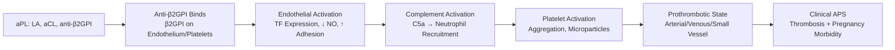
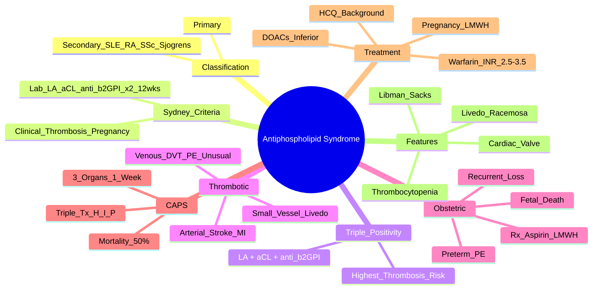

# Antiphospholipid Syndrome (APS)

> [!tip] **FCPS/MRCP Priority: CRITICAL**
> APS = **thrombotic + obstetric** autoimmune syndrome. **Sydney criteria (2006)**. **Triple positivity (LA + aCL + anti-β2GPI) = highest thrombosis risk**. **Warfarin INR 2.5-3.5 (DOACs inferior — TRAPS trial)**. **Obstetric APS: aspirin 75mg + LMWH throughout pregnancy**. **CAPS = catastrophic APS (≥3 organs in 1 week, mortality ~50%)**.

---

## Learning Objectives
By the end of this note you should be able to:
- [ ] Apply Sydney revised classification criteria (2006): 1 clinical + 1 laboratory criterion (on 2 occasions ≥12 weeks apart)
- [ ] Interpret antiphospholipid antibody tests: **Lupus anticoagulant (LA)**, **anticardiolipin (aCL) IgG/IgM**, **anti-β2-glycoprotein I (anti-β2GPI) IgG/IgM**
- [ ] Distinguish Primary APS (isolated) from Secondary APS (with SLE, other autoimmune)
- [ ] Manage thrombotic APS: **Warfarin INR 2.5-3.5** (DOACs inferior — TRAPS/ASTRO-APS trials)
- [ ] Manage obstetric APS: **Aspirin 75mg + LMWH prophylactic/therapeutic** throughout pregnancy + 6 weeks postpartum
- [ ] Recognise and manage Catastrophic APS (CAPS): ≥3 organ thromboses in 1 week → anticoagulation + steroids + IVIG/PLEX ± CYC/RTX

---

## 1. Definition & Epidemiology

| Feature | Detail |
|---------|--------|
| **Definition** | Autoimmune syndrome characterised by **arterial/venous/small vessel thrombosis** and/or **pregnancy morbidity** in the presence of **persistent antiphospholipid antibodies** |
| **Primary APS** | APS without associated autoimmune disease |
| **Secondary APS** | APS associated with **SLE** (most common), RA, SSc, Sjögren's, etc. |
| **Incidence** | ~5/100,000/year |
| **Prevalence** | 40-50/100,000 |
| **Sex Ratio** | **F:M = 3.5:1** (similar to SLE) |
| **Peak Onset** | **30-40 years** |

---

## 2. Aetiology & Pathophysiology



### Key Pathogenic Mechanisms
| Mechanism | Detail |
|-----------|--------|
| **Anti-β2GPI binding** | β2GPI on endothelial cells, platelets, trophoblasts → conformational change exposes antigenic epitope |
| **Lupus Anticoagulant (LA)** | **In vitro** prolongs phospholipid-dependent clotting (aPTT, dRVVT) — **paradoxically pro-thrombotic in vivo** |
| **Complement activation** | C5a → neutrophil activation, NETosis |
| **Trophoblast dysfunction** | Impaired placentation → pregnancy morbidity |
| **Neutrophil extracellular traps (NETs)** | Promote thrombosis in APS |

---

## 3. Classification — Sydney Revised Criteria (2006)

**Clinical Criteria (1 required)**
| Criterion | Detail |
|-----------|--------|
| **Vascular Thrombosis** | **Arterial, venous, or small vessel** — objectified by imaging/histology (DVT, PE, stroke, MI, limb ischaemia, retinal vein occlusion, etc.) |
| **Pregnancy Morbidity** | **≥1** of: <br>• **≥1 unexplained fetal death ≥10 weeks** (normal morphology) <br>• **≥1 premature birth <34 weeks** due to eclampsia/pre-eclampsia/placental insufficiency <br>• **≥3 unexplained consecutive embryonic losses <10 weeks** |

**Laboratory Criteria (1 required, on ≥2 occasions ≥12 weeks apart)**
| Test | Positive Threshold |
|------|-------------------|
| **Lupus Anticoagulant (LA)** | Positive per **ISTH guidelines** (dRVVT + aPTT mixing studies) |
| **Anticardiolipin (aCL) IgG/IgM** | **>40 GPL/MPL** (or >99th percentile) |
| **Anti-β2-glycoprotein I (anti-β2GPI) IgG/IgM** | **>99th percentile** |

**Definite APS = 1 Clinical + 1 Laboratory (confirmed on 2 occasions ≥12 weeks apart)**

---

## 4. Clinical Manifestations

### Thrombotic
| Manifestation | Detail |
|---------------|--------|
| **Venous** | **DVT (most common)**, **PE**, **unusual sites** (cerebral venous sinus, portal/mesenteric/hepatic/splenic/renal vein thrombosis) |
| **Arterial** | **Stroke (most common)**, MI, limb ischaemia, retinal artery occlusion |
| **Small Vessel** | Livedo reticularis, livedoid vasculopathy, digital ischaemia/gangrene, adrenal haemorrhage (Waterhouse-Friderichsen), thrombotic microangiopathy |

### Obstetric
| Manifestation | Detail |
|---------------|--------|
| **Recurrent early loss** | **≥3 embryonic losses <10 weeks** (unexplained) |
| **Late fetal loss** | **≥1 unexplained death ≥10 weeks** (normal karyotype) |
| **Preterm birth** | **≥1 premature <34 weeks** from pre-eclampsia/eclampsia/placental insufficiency |

### Other Manifestations
| Manifestation | Significance |
|---------------|--------------|
| **Livedo Reticularis** | **Racemosa** (branching, persistent) — >90% specificity for APS |
| **Thrombocytopenia** | Common (IgG anti-β2GPI mediated platelet clearance) |
| **Cardiac Valve Disease** | **Libman-Sacks endocarditis** (non-bacterial, sterile vegetations — aortic > mitral) |
| **Nephropathy** | APS nephropathy (arteriolar thrombosis, cortical atrophy) |
| **Catastrophic APS (CAPS)** | **≥3 organ thromboses within 1 week** — mortality ~50% |

---

## 5. Antiphospholipid Antibody Testing

| Test | Method | Clinical Utility |
|------|--------|------------------|
| **Lupus Anticoagulant (LA)** | **dRVVT** (primary) + **aPTT mixing study** (confirm) — **most specific for thrombosis** | **Gold standard**; most strongly associated with thrombosis |
| **Anticardiolipin (aCL) IgG/IgM** | ELISA | **>40 GPL/MPL** = positive; IgG > IgM for thrombosis risk |
| **Anti-β2GPI IgG/IgM** | ELISA | **>99th percentile** = positive; more specific than aCL |

> [!critical] **Triple Positivity = Highest Risk**
> - **LA + aCL + anti-β2GPI (all positive)** = **highest thrombosis recurrence risk**
> - **Single positivity (especially aCL alone)** = lower risk
> - **Persistent positivity on 2 occasions ≥12 weeks apart** = diagnostic requirement

---

## 6. Catastrophic APS (CAPS) — **Medical Emergency**

| Feature | Detail |
|---------|--------|
| **Definition** | **Thrombosis in ≥3 organs/systems within 1 week** + **aPL positivity** + **histopathology: small vessel thrombosis** |
| **Incidence** | <1% of APS |
| **Mortality** | **~50%** (improved with early aggressive therapy) |
| **Triggers** | Infection, surgery, trauma, malignancy, stopping anticoagulation, pregnancy/puerperium |
| **Common Organs** | Kidneys (renal failure), lungs (ARDS/haemorrhage), brain (stroke), heart (MI), adrenals (haemorrhage), GI (ischaemia), skin (livedo, necrosis) |

### CAPS Management (Immediate)
```mermaid
flowchart TD
    A[Suspected CAPS] --> B[**Anticoagulation**\nUnfractionated Heparin IV\n(Therapeutic aPTT/anti-Xa)]
    B --> C[**High-Dose Steroids**\nMP 1000mg IV daily ×3-5d\n→ Pred 1mg/kg]
    C --> D[**IVIG** 0.4g/kg/day ×5d\nOR **Plasma Exchange** (PLEX)\n1.5 plasma vol ×5-7 exchanges]
    D --> E[Consider: **Cyclophosphamide**\n(if SLE-associated)\nOR **Rituximab** (refractory)]
    E --> F[Supportive: ICU, organ support,\nInfection screen/prophylaxis]
```

> [!critical] **CAPS = "Triple Therapy"**
> 1. **Anticoagulation** (UFH IV)
> 2. **High-dose steroids** (MP 1000mg IV ×3-5d)
> 3. **IVIG (0.4g/kg/d ×5d) OR Plasma Exchange** (1.5 vol ×5-7 exchanges)

---

## 7. Management

### Thrombotic APS (Non-Pregnant)
| Scenario | Anticoagulation |
|----------|-----------------|
| **First venous thrombosis** | **Warfarin INR 2.5-3.5** (target 3.0) — **lifelong** if unprovoked/APS |
| **First arterial thrombosis** | **Warfarin INR 3.0-4.0** (some guidelines) — **lifelong** |
| **Recurrent thrombosis on warfarin** | Check INR adherence; **add aspirin 75mg**; consider **LMWH** (therapeutic); **increase INR target** |
| **DOACs** | **INFERIOR in APS** — **TRAPS trial (rivaroxaban)** and **ASTRO-APS (apixaban)** showed **higher thrombosis recurrence** vs warfarin. **Avoid in triple positive APS** |

### Obstetric APS (Pregnancy)
| Scenario | Management |
|----------|------------|
| **Obstetric APS only** (no prior thrombosis) | **Aspirin 75mg daily** from booking (or pre-conception) + **LMWH prophylactic** (e.g., enoxaparin 40mg daily) throughout pregnancy + **6 weeks postpartum** |
| **Obstetric APS + prior thrombosis** | **Aspirin 75mg + LMWH therapeutic** (e.g., enoxaparin 1mg/kg BD) throughout pregnancy + 6 weeks postpartum |
| **Warfarin in pregnancy** | **TERATOGENIC** (6-12 weeks: embryopathy) — **switch to LMWH** immediately on confirmation (ideally pre-conception) |

### Background Therapy (All APS)
| Drug | Indication |
|------|------------|
| **Hydroxychloroquine** | **All SLE-APS patients** — antithrombotic, improves pregnancy outcomes |
| **Aspirin 75mg** | Consider in all APS (additive antithrombotic); mandatory in obstetric APS |
| **Statins** | Emerging evidence for thromboprotection in APS |

---

## 7. Monitoring

| Parameter | Frequency |
|-----------|-----------|
| **INR** (warfarin) | **Weekly** until stable → **monthly** (target 2.5-3.5 venous, 3-4 arterial) |
| **CBC, Renal, LFT** | 3-monthly |
| **Anti-phospholipid antibodies** | Not routine for monitoring (persist); repeat only if diagnostic uncertainty |
| **Pregnancy surveillance** | Monthly obstetric review; serial growth scans; Doppler uterine arteries |

---

## 8. FCPS/MRCP High-Yield Summary

| Topic | Key Points |
|-------|------------|
| **Sydney Criteria** | 1 Clinical (thrombosis OR pregnancy morbidity) + 1 Lab (LA, aCL, anti-β2GPI ×2 ≥12wks apart) |
| **Triple Positivity** | **LA + aCL + anti-β2GPI = highest thrombosis risk** |
| **Warfarin INR** | **Venous: 2.5-3.5 (target 3.0); Arterial: 3.0-4.0** |
| **DOACs** | **INFERIOR in APS** (TRAPS, ASTRO-APS) — **avoid**, especially triple positive |
| **Obstetric APS** | **Aspirin 75mg + LMWH** throughout pregnancy + 6wks postpartum |
| **Warfarin in Pregnancy** | **TERATOGENIC (6-12wks)** — switch to LMWH immediately |
| **CAPS** | **≥3 organs thrombosis in 1 week** → **Anticoag + MP 1000mg IV ×3-5d + IVIG/PLEX ± CYC/RTX** — mortality ~50% |
| **Libman-Sacks** | Non-bacterial endocarditis (aortic > mitral) — APS/SLE |
| **Livedo Reticularis** | **Racemosa** (branching, persistent) — >90% specific for APS |

---

## 8. Viva Questions (MRCP PACES / FCPS)

| Question | Expected Answer |
|----------|----------------|
| "What are the Sydney criteria for APS?" | 1 Clinical (vascular thrombosis OR pregnancy morbidity) + 1 Laboratory (LA, aCL, or anti-β2GPI) on **2 occasions ≥12 weeks apart**. |
| "What is the target INR for APS with venous thrombosis?" | **INR 2.5-3.5 (target 3.0)**. For arterial: 3.0-4.0. |
| "Can you use DOACs in APS?" | **No — DOACs are inferior** (TRAPS, ASTRO-APS trials showed higher thrombosis recurrence). Especially avoid in **triple positive APS**. |
| "What is the management of obstetric APS?" | **Aspirin 75mg daily + LMWH prophylactic** (or therapeutic if prior thrombosis) from booking throughout pregnancy + **6 weeks postpartum**. Warfarin teratogenic → switch to LMWH. |
| "What is catastrophic APS (CAPS) and how is it managed?" | **Thrombosis in ≥3 organs within 1 week** + aPL positivity. **Triple therapy**: IV heparin + high-dose IV methylprednisolone (1000mg ×3-5d) + IVIG (0.4g/kg/d ×5d) or plasma exchange ± CYC/RTX. Mortality ~50%. |
| "What is the significance of triple positivity in APS?" | **LA + aCL + anti-β2GPI all positive** = **highest thrombosis risk** and recurrence. |
| "How do you manage a patient with APS on warfarin who develops a new DVT?" | Check INR adherence; if therapeutic, **add aspirin 75mg**; consider **LMWH therapeutic**; **increase INR target** (e.g., 3.5-4.0); investigate for other causes. |
| "What is the significance of livedo reticularis in APS?" | **Livedo racemosa** (branching, persistent, non-reversible on warming) — **>90% specific for APS**. |
| "A patient with SLE develops a stroke. aCL negative, anti-β2GPI negative, but LA positive. Diagnosis?" | **APS (LA is the most specific test for thrombosis)** — LA positive on 2 occasions ≥12 weeks apart + clinical thrombosis = APS. |
| "What is the management of a patient with APS who needs surgery?" | **Bridge with therapeutic LMWH** (stop warfarin 5d pre-op, start LMWH when INR <2, hold LMWH 24h pre-op, restart 24h post-op, restart warfarin, overlap until INR therapeutic). |

---

## 9. Confusions & Mnemonics

| Confusion | Clarification |
|-----------|---------------|
| **Primary vs Secondary APS** | Primary = APS alone; Secondary = APS + SLE/RA/SSc/Sjögren's/etc. (management same). |
| **LA vs aCL vs anti-β2GPI** | **LA = most specific for thrombosis** (functional assay). aCL/anti-β2GPI = ELISAs. **Triple positivity = highest risk**. |
| **DOACs in APS** | **Contraindicated/inferior** — TRAPS (rivaroxaban), ASTRO-APS (apixaban) showed higher recurrence. Use warfarin. |
| **Warfarin in Pregnancy** | **Teratogenic (6-12 weeks)** → switch to LMWH **immediately** on confirmation (ideally pre-conception). |
| **Arterial vs Venous INR Target** | Venous: 2.5-3.5; Arterial: 3.0-4.0 (some guidelines). |
| **CAPS vs Sepsis/MODS** | CAPS = **aPL positive + small vessel thrombosis on histology**; distinguish from TTP/HUS (ADAMTS13), DIC, sepsis. |

**Mnemonic: Sydney Criteria = "1+1 (twice)"**
- **1 Clinical** (thrombosis OR pregnancy)
- **1 Lab** (LA / aCL / anti-β2GPI)
- **Twice** (≥12 weeks apart)

**Mnemonic: Triple Positivity = "HIGH RISK"**
- **LA + aCL + anti-β2GPI** = **HIGHEST** thrombosis risk

**Mnemonic: Warfarin INR = "2.5-3.5 VEIN, 3-4 ARTERY"**
- **VENous** = 2.5-3.5 (target 3.0)
- **ARTERial** = 3.0-4.0

**Mnemonic: Obstetric APS = "A + L"**
- **A**spirin 75mg daily
- **L**MWH throughout pregnancy + 6wks postpartum

**Mnemonic: CAPS = "3-1-50"**
- **3** organs/systems
- **1** week
- **50%** mortality

**Mnemonic: CAPS Treatment = "HIP"**
- **H**eparin (IV therapeutic)
- **I**V Methylprednisolone (1000mg ×3-5d)
- **P**lasma Exchange / IVIG

**Mnemonic: Libman-Sacks = "NON-BACTERIAL"**
- Sterile vegetations on **aortic > mitral** valve
- APS + SLE

---

## 10. Mind Map



---

## 11. One-Page Revision Card

| Domain | Key Points |
|--------|------------|
| **Sydney Criteria** | 1 Clinical (thrombosis/pregnancy) + 1 Lab (LA/aCL/anti-β2GPI) ×2 ≥12wks |
| **Triple Positivity** | LA + aCL + anti-β2GPI = **highest thrombosis risk** |
| **Warfarin INR** | Venous: **2.5-3.5**; Arterial: **3-4** |
| **DOACs** | **INFERIOR** (TRAPS, ASTRO-APS) — avoid, especially triple positive |
| **Obstetric APS** | **Aspirin 75mg + LMWH** throughout pregnancy + 6wks postpartum |
| **Warfarin in Pregnancy** | **TERATOGENIC (6-12wks)** → switch to LMWH immediately |
| **CAPS** | **≥3 organs in 1 week** → Heparin + IV MP 1g ×3-5d + IVIG/PLEX ± CYC/RTX; **~50% mortality** |
| **Libman-Sacks** | Non-bacterial endocarditis (aortic > mitral) — APS/SLE |
| **Livedo Racemosa** | Branching, persistent livedo — **>90% specific for APS** |
| **LA** | **Most specific for thrombosis** (functional assay) |

---

## 12. Spaced Repetition Trackers

| Review Interval | Date Completed | Confidence (1-5) | Notes |
|-----------------|----------------|------------------|-------|
| 24 hours | | | |
| 7 days | | | |
| 15 days | | | |
| 30 days | | | |
| 90 days | | | |

---

## 13. Self-Test Scorecard

| Section | Score /5 | Last Attempt |
|---------|----------|--------------|
| Sydney Criteria Application | | |
| Warfarin INR Targets | | |
| DOACs in APS | | |
| Obstetric APS Management | | |
| CAPS Recognition & Management | | |
| Triple Positivity Significance | | |
| Viva Questions | | |

---

## 14. Local Navigation
- **Parent Heading**: [[../Autoimmune Rheumatic Diseases|Autoimmune Rheumatic Diseases]]
- **Parent Topic Group**: [[Connective tissue diseases]]
- **Chapter Map**: [[../Davidson Chapter 26 - Rheumatology Hierarchy|Rheumatology Hierarchy]]
- **Chapter MOC**: [[../Rheumatology MOC|Rheumatology MOC]]
- **Drug Reference**: [[../../Clinical Approach to Musculoskeletal Disease/Drugs in rheumatology|Drugs in rheumatology]]
- **Related**: [[Systemic Lupus Erythematosus]] · [[Catastrophic APS]]