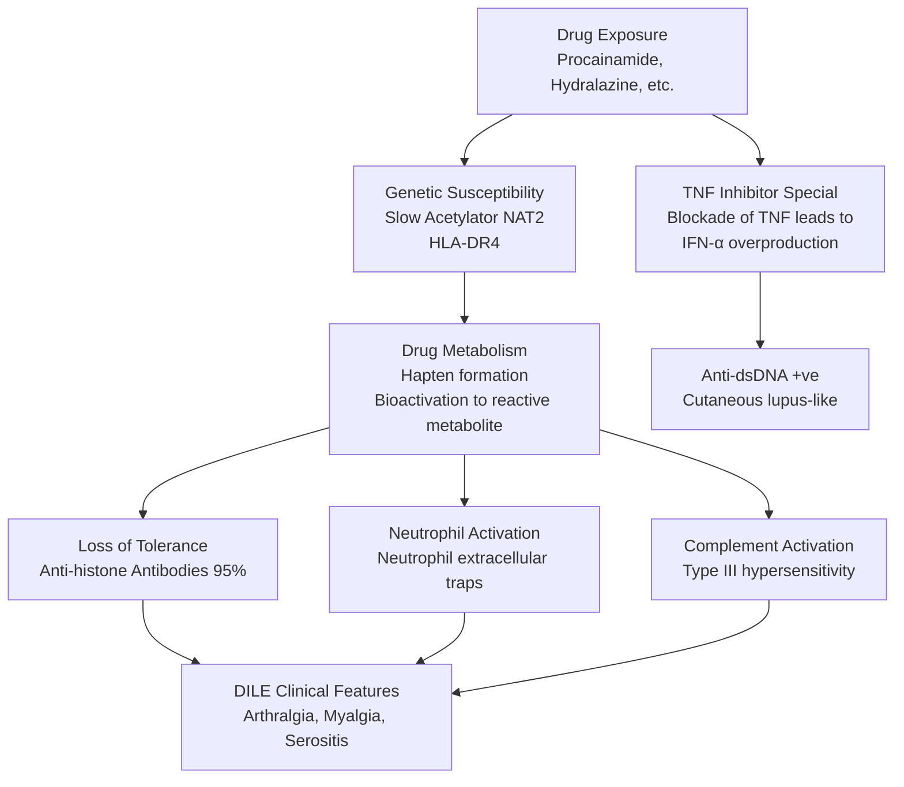
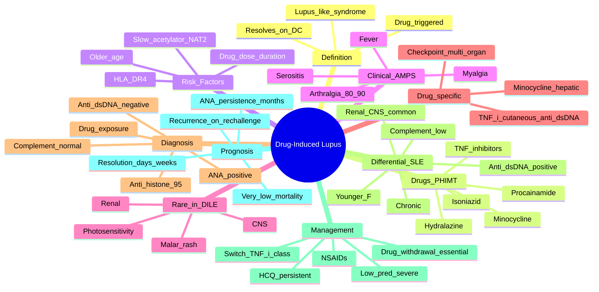

# Drug-Induced Lupus Erythematosus (DILE)

> [!tip] **FCPS/MRCP Priority: HIGH**
> Drug-induced lupus (DILE) = **lupus-like syndrome** triggered by **specific drugs** in genetically susceptible individuals. Must know: **5 high-risk drugs** (procainamide, hydralazine, isoniazid, minocycline, TNF inhibitors — **"PHIMT"**), **anti-histone antibodies in 95%**, **rare renal/CNS involvement** (vs SLE), **resolves on drug withdrawal**, and the **classic triad: arthralgia + myalgia + serositis**.

---

## Learning Objectives
By the end of this note you should be able to:
- [ ] Define DILE as **lupus-like syndrome** triggered by specific drugs
- [ ] List the **5 highest-risk drugs** (PHIMT: Procainamide, Hydralazine, Isoniazid, Minocycline, TNF inhibitors)
- [ ] Recognise the **clinical features**: arthralgia, myalgia, serositis, fever
- [ ] Distinguish DILE from **idiopathic SLE** (older age, equal sex, rare renal/CNS, anti-histone +ve, anti-dsDNA neg)
- [ ] Investigate with **ANA, anti-histone, anti-dsDNA, complement**
- [ ] Manage with **drug withdrawal (essential)** + NSAIDs/HCQ for symptoms
- [ ] Recognise **TNF inhibitor-induced lupus** as a separate entity
- [ ] Counsel on **prognosis** (resolves with withdrawal)

---

## 1. Definition & Epidemiology
| Feature | Detail |
|---------|--------|
| **Definition** | **Lupus-like syndrome** that **resolves on drug withdrawal**, caused by specific drugs in susceptible individuals |
| **Incidence** | 15,000-30,000 cases/year (US, decreasing with modern drug use) |
| **Prevalence** | ~50/100,000 |
| **Age** | Older than SLE (mean 50-60y vs SLE 30-40y) |
| **Sex** | **M = F** (vs SLE F:M 9:1) — reflects drug exposure rather than autoimmune |
| **Genetics** | **Slow acetylators** (HLA-DR4, NAT2 polymorphisms) — higher risk for procainamide/hydralazine |
| **Time to onset** | **Weeks to years** after starting drug (mean 1-2y) |

---

## 2. Causative Drugs
### High-Risk Drugs (Most Common)
| Drug | Risk | Notes |
|------|------|-------|
| **Procainamide** | **Highest** (1 in 5 exposed) | Antiarrhythmic; rarely used now |
| **Hydralazine** | **Very high** (5-10% over years) | Antihypertensive; still used in pregnancy, scleroderma renal crisis |
| **Isoniazid** | High (1% with chronic use) | Anti-TB; **slow acetylators** at higher risk |
| **Minocycline** | Moderate (1 in 1,000) | Long-term acne Rx; hepatitis, arthritis |
| **TNF inhibitors** | Moderate | **Distinct entity** (often anti-dsDNA +ve); infliximab > etanercept |

### Mnemonic — **PHIMT**
- **P**rocainamide
- **H**ydralazine
- **I**soniazid
- **M**inocycline
- **T**NF inhibitors

### Other Drugs (Lower Risk)
| Drug | Notes |
|------|-------|
| **Quinidine** | Antiarrhythmic |
| **Methyldopa** | Antihypertensive |
| **Chlorpromazine** | Antipsychotic |
| **Carbamazepine** | Anticonvulsant |
| **Phenytoin** | Anticonvulsant |
| **Sulfasalazine** | DMARD |
| **Penicillamine** | Chelator |
| **Griseofulvin** | Antifungal |
| **Statins** (rare) | Simvastatin, lovastatin |
| **Interferon-α, β, γ** | Immunomodulators |
| **Tocilizumab** | Case reports |
| **Immune checkpoint inhibitors** (anti-PD1, anti-CTLA4) | Cancer immunotherapy; new category |

### Drug-Specific Features
| Drug | DILE Features |
|------|---------------|
| **Procainamide, hydralazine** | Classical DILE; arthralgia, serositis, anti-histone |
| **TNF inhibitor-induced** | **Anti-dsDNA +ve** (50-60%); often cutaneous (malar rash, discoid); can flare lupus |
| **Minocycline** | **Hepatic** involvement (hepatitis, hyperbilirubinaemia) |
| **Anti-PD1/PDL1, anti-CTLA4** (immune checkpoint) | **irAE** (immune-related adverse event); lupus-like, vasculitis, encephalitis |

---

## 3. Pathophysiology

### Key Concepts
| Concept | Detail |
|---------|--------|
| **Acetylation** | Procainamide and hydralazine metabolised by **N-acetyltransferase 2 (NAT2)**; **slow acetylators** (autosomal recessive, ~50% Caucasians) have **higher DILE risk** |
| **Hapten hypothesis** | Drug binds self-protein → neoantigen → immune response |
| **TNF inhibitor-specific** | TNF blockade → excess **IFN-α** (loss of TNF-driven suppression); **anti-dsDNA +ve** more often; **cutaneous lupus** |
| **Anti-histone** | Found in **95%** of DILE (not specific — also in 50-70% of SLE) |
| **Complement** | Usually **normal** in DILE (vs low in active SLE) |

---

## 4. Clinical Features
### Classic DILE (Procainamide, Hydralazine, Isoniazid, Minocycline)
| Feature | Frequency |
|---------|-----------|
| **Arthralgia / arthritis** | **80-90%** (most common) |
| **Myalgia** | 50-70% |
| **Serositis** (pleuritis, pericarditis) | 30-50% |
| **Fever** | 30-50% |
| **Constitutional** (fatigue, weight loss) | Common |
| **Skin rash** | 10-30% (less than SLE; **malar rash rare** in classic DILE) |
| **Lymphadenopathy** | 10-20% |

### Organ Involvement (Less than SLE)
| System | DILE vs SLE |
|--------|------------|
| **Renal (GN)** | **Rare in DILE** (<5%); common in SLE (40-60%) |
| **CNS** | **Rare in DILE**; common in SLE |
| **Haematological** (haemolytic anaemia, leukopenia) | Less common in DILE |
| **Photosensitivity, alopecia, oral ulcers** | Less common in DILE |

### Drug-Specific Features
| Drug | Unique DILE Features |
|------|---------------------|
| **Minocycline** | **Hepatic involvement** (hepatitis, hyperbilirubinaemia), **eosinophilia**, pulmonary infiltrates |
| **TNF inhibitors** | **Anti-dsDNA +ve** (50-60%); **cutaneous** (malar rash, discoid); high rate of **flare** if used in SLE |
| **Anti-PD1/PDL1, anti-CTLA4** (cancer) | Multi-organ irAE: lupus-like, vasculitis, encephalitis, colitis, hepatitis, pneumonitis, thyroiditis |
| **Procainamide, hydralazine** | Classic DILE; serositis prominent |

---

## 5. Diagnosis
### Diagnostic Criteria (Modified)
1. **Drug exposure** for **≥1 month** (usually longer)
2. **At least 1 SLE-compatible feature** (arthralgia, myalgia, serositis, fever, rash, etc.)
3. **No prior SLE history**
4. **Resolution** on drug withdrawal (key)
5. **Positive ANA** (often high titre)
6. **Anti-histone antibodies** (95%)

### Distinguishing DILE from SLE
| Feature | DILE | SLE |
|---------|------|-----|
| **Age** | Older (50-60y) | Younger (30-40y) |
| **Sex** | **M = F** | **F > M (9:1)** |
| **Arthralgia** | 80-90% | 80% |
| **Serositis** | Common (30-50%) | Common |
| **Renal (GN)** | **Rare (<5%)** | **Common (40-60%)** |
| **CNS** | **Rare** | Common (20-40%) |
| **Malar rash** | Uncommon (10-30%, except TNF-i) | Common (40-50%) |
| **Photosensitivity** | Uncommon | Common |
| **ANA** | +ve (often high) | +ve |
| **Anti-dsDNA** | **Negative (except TNF-i)** | **Positive (60-70%)** |
| **Anti-Sm** | Negative | Positive (specific) |
| **Anti-histone** | **Positive (95%)** | 50-70% |
| **Anti-SSA/SSB** | Negative (usually) | Common |
| **Complement (C3/C4)** | **Normal** | **Low** (active) |
| **Resolution on D/C drug** | **Yes** | No (chronic) |
| **Recurrence on rechallenge** | Yes (not usually done) | N/A |

### Investigations
| Test | Purpose |
|------|---------|
| **FBC** | Anaemia, leukopenia, thrombocytopenia (less than SLE) |
| **ESR** | Often elevated |
| **CRP** | Variable |
| **LFT** | **Hepatic involvement** (minocycline); baseline before drug |
| **U&E, urinalysis** | **Renal** — usually normal; if abnormal, consider SLE |
| **ANA** | **+ve in >95%**, often high titre |
| **Anti-dsDNA** | **Negative (classic DILE)**; +ve in **TNF-i-induced** |
| **Anti-histone** | **Positive in 95%** (key) |
| **Anti-Sm, anti-Ro/SSA, anti-La/SSB, anti-RNP** | Usually negative |
| **Complement C3, C4** | **Normal** in DILE (vs low in SLE) |
| **ACLA, lupus anticoagulant** | Negative (DILE) |

---

## 6. Management
### Step 1 — Drug Withdrawal (Essential)
| Action | Notes |
|--------|-------|
| **Stop the offending drug** | **Single most important intervention** |
| **Resolution** | Symptoms usually improve within **days to weeks**; ANA may take **months to years** to disappear |
| **Most cases** | Self-limiting after drug withdrawal |
| **Identify drug** | Review all medications including OTC, supplements, topical |

### Step 2 — Symptomatic
| Therapy | Use |
|---------|-----|
| **NSAIDs** | Arthralgia, myalgia, serositis (limit duration) |
| **Paracetamol** | First-line analgesic |
| **Topical steroids** | Skin involvement |
| **Antimalarials** (**HCQ 200-400 mg/day**) | Persistent symptoms (especially cutaneous) |
| **Low-dose oral steroids** (prednisolone ≤10 mg) | Severe/refractory; short course |
| **MTX or AZA** | Rare; persistent/refractory DILE |
| **Cyclophosphamide** (rare) | Severe organ involvement (e.g., vasculitis) |

> [!tip] **Most DILE Resolves on Drug Withdrawal**
> No specific immunosuppressive therapy needed in most cases. **HCQ** for persistent cutaneous or articular symptoms.

### Step 3 — TNF Inhibitor-Induced Lupus
| Action | Notes |
|--------|-------|
| **Stop TNF inhibitor** | Switch to different class if needed |
| **If anti-dsDNA +ve, cutaneous** | Topical/intralesional steroids, HCQ |
| **If visceral (rare)** | Standard SLE-like Rx (HCQ, MMF, CYC) |
| **Rechallenge** | Different TNF inhibitor may not cause recurrence (case-dependent) |
| **Avoid** in established SLE | TNF inhibitors can flare lupus |

### Step 4 — Immune Checkpoint Inhibitor irAE
| Action | Notes |
|--------|-------|
| **Mild (skin, joints)** | Topical/oral steroids; pause ICI |
| **Severe (organ-threatening)** | High-dose steroids; consider IV methylpred |
| **Infliximab** (infliximab) for severe colitis | Steroid-sparing |
| **Mycophenolate / cyclophosphamide** | Severe organ |
| **Withhold ICI** until grade ≤1 |

---

## 7. Special Situations
### Pregnancy
- **DILE** is rare in pregnancy; reports of **hydralazine-induced** DILE in pregnancy
- **Stop hydralazine** if DILE suspected; switch to alternative antihypertensive
- **HCQ** safe in pregnancy; **NSAIDs** (1st/2nd tri)
- **Lupus neonatorale** (neonatal lupus from anti-SSA/SSB) — not typically DILE, but caution

### Slow Acetylators
- **NAT2 polymorphisms** determine acetylator status
- **50% Caucasians, 80% East Asians** are slow acetylators
- **Higher DILE risk** with procainamide, hydralazine, isoniazid
- **Pharmacogenetic testing** rarely done

### Acetylation
- Slow = more drug stays longer → more metabolite → higher DILE risk
- Practical implication: prefer fast acetylators for these drugs if possible

---

## 8. Prognosis
| Factor | Outcome |
|--------|---------|
| **After drug withdrawal** | **Resolution in days to weeks** (90%) |
| **ANA persistence** | May take **months to years** to disappear (50-80% still +ve at 6 months) |
| **Symptoms** | Resolve first; serology later |
| **Mortality** | **Very low** (unlike SLE) |
| **Rechallenge** | Usually **recurs** within days; not done |
| **D/C drug** | **Permanent** avoidance in most cases |
| **Switch to alternative** | Often possible (e.g., switch hydralazine → ACE inhibitor) |

---

## 9. FCPS/MRCP High-Yield Summary
| Topic | Key Points |
|-------|------------|
| **Definition** | Lupus-like syndrome triggered by specific drugs; **resolves on D/C** |
| **Demographics** | Older (50-60y), **M = F** (vs SLE F:M 9:1) |
| **High-risk drugs** | **PHIMT**: **P**rocainamide, **H**ydralazine, **I**soniazid, **M**inocycline, **T**NF inhibitors |
| **Genetics** | **Slow acetylators** (NAT2 polymorphism) — higher risk |
| **Clinical** | Arthralgia (80-90%), myalgia, serositis, fever |
| **Rare in DILE** | **Renal, CNS, photosensitivity, malar rash** |
| **Anti-histone** | **95% positive** (key feature) |
| **Anti-dsDNA** | **Negative in classic DILE**; **positive in TNF-i-induced** |
| **Complement** | **Normal** in DILE (vs low in SLE) |
| **Resolution** | On drug withdrawal — days to weeks |
| **HCQ** | For persistent symptoms |
| **TNF-i DILE** | Anti-dsDNA +ve, often cutaneous, can flare lupus |
| **Checkpoint inhibitor** | New category; irAE; high-dose steroids, may need to stop ICI |
| **Prognosis** | Excellent after D/C; very low mortality |

---

## 10. Viva Questions (MRCP PACES / FCPS)
| Question | Expected Answer |
|----------|-----------------|
| "Five highest-risk drugs for DILE?" | **PHIMT: Procainamide, Hydralazine, Isoniazid, Minocycline, TNF inhibitors**. |
| "Most specific antibody for DILE?" | **Anti-histone antibodies** (95% positive). Not specific to DILE (also 50-70% of SLE) but in the right clinical context, diagnostic. |
| "Differentiate DILE from SLE." | DILE: older, **M = F**, **rare renal/CNS**, **anti-histone +ve, anti-dsDNA neg, complement normal**, **resolves on D/C**. SLE: young F, renal/CNS common, anti-dsDNA +ve, low complement, chronic. |
| "A 60yo man on hydralazine for hypertension develops arthralgia, myalgia, pleuritic chest pain. ANA +ve, anti-dsDNA neg, anti-histone +ve. Diagnosis?" | **Drug-induced lupus (DILE)** secondary to **hydralazine**. Stop hydralazine, switch antihypertensive. NSAIDs for symptoms. |
| "Why is complement normal in DILE but low in SLE?" | **DILE is not associated with significant immune complex deposition** in tissues (less renal, less vasculitis). **SLE = immune complex disease** → classical complement consumption → low C3/C4. |
| "TNF inhibitor-induced lupus — what antibody?" | **Anti-dsDNA (50-60%)** — unlike classic DILE. Often **cutaneous**. Can **flare SLE** if used in established disease. |
| "Slow acetylator — what is it?" | **NAT2 (N-acetyltransferase 2) polymorphism**; slow metabolisers of procainamide, hydralazine, isoniazid. **50% Caucasians, 80% East Asians**. Higher DILE risk. |
| "Checkpoint inhibitor lupus — what's different?" | **Cancer immunotherapy** (anti-PD1, anti-PD-L1, anti-CTLA4). **Multi-organ irAE**: lupus-like, colitis, hepatitis, pneumonitis, thyroiditis. **High-dose steroids**, may need to stop ICI. |
| "When does DILE resolve after drug withdrawal?" | Symptoms: **days to weeks** (90% by 3 months). ANA: **months to years** to disappear. |

---

## 11. Confusions & Mnemonics
| Confusion | Clarification |
|-----------|---------------|
| **DILE vs SLE** | DILE: older, M=F, **rare renal/CNS, anti-histone, complement normal, resolves**. SLE: young F, renal/CNS, anti-dsDNA, low complement, chronic |
| **Anti-histone not specific** | Also in 50-70% of SLE; specificity comes from clinical context |
| **TNF-i lupus ≠ classic DILE** | **Anti-dsDNA +ve, cutaneous, can flare SLE**; switch TNF-i class |
| **Minocycline DILE** | Often **hepatic** (hepatitis); consider in acne Rx users |
| **Procainamide** | Highest risk; rarely used now (antiarrhythmic) |
| **Hydralazine** | Still used (HTN emergency, pregnancy, scleroderma renal crisis); watch for DILE |
| **Anti-Sm** | Specific for SLE; **negative in DILE** (except rarely) |
| **Slow acetylator** | NAT2 polymorphism; **50% Caucasians, 80% East Asians** |
| **Anti-SSA/SSB in DILE** | Usually **negative**; positive suggests SLE |

**Mnemonic: PHIMT = "PHIM Together" (drugs causing DILE)**
- **P**rocainamide
- **H**ydralazine
- **I**soniazid
- **M**inocycline
- **T**NF inhibitors

**Mnemonic: DILE features "AMPS"**
- **A**rthralgia (80-90%)
- **M**yalgia (50-70%)
- **P**leurisy/pericarditis (30-50%)
- **S**kin (10-30%)

**Mnemonic: DILE vs SLE "HARD-ROCK-YES-RESOLVE"**
- **H**istone antibody +ve
- **A**ge older
- **R**enal/CNS rare
- **D**rug cause
- **R**esolves
- **O**lder age
- **C**omplement normal
- **K**eep anti-dsDNA neg
- **Y**es resolvable on D/C
- **-**
- **E**xclude SLE features (rare)
- **S**ex equal
- **O**nset after drug
- **L**ess severe
- **V**isceral rare
- **E**asy to miss drug history

**Mnemonic: Slow acetylator "SLOW-NAT2"**
- **S**low = more drug stays
- **L**onger exposure to drug
- **O**rgans affected (kidney, joints)
- **W**atch for DILE
- **N**AT2 polymorphism
- **A**cetylation slow
- **T**2 gene
- **2** = risk of DILE

**Mnemonic: Anti-histone = "HIST"**
- **H**istone antibody 95% in DILE
- **I**nflammation
- **S**kin sometimes
- **T**hink DILE first
- (also in 50-70% of SLE, so not specific)

---

## 12. Mind Map

---

## 13. One-Page Revision Card
| Domain | Key Points |
|--------|------------|
| **Definition** | Lupus-like syndrome; **resolves on D/C drug** |
| **High-risk drugs** | **PHIMT**: Procainamide, Hydralazine, Isoniazid, Minocycline, TNF-i |
| **Demographics** | Older (50-60y), **M = F** |
| **Slow acetylator** | NAT2 polymorphism; 50% Caucasians, 80% East Asians |
| **Clinical (AMPS)** | **A**rthralgia (80-90%), **M**yalgia, **P**leurisy/pericarditis (30-50%), **S**kin (10-30%) |
| **Rare in DILE** | **Renal, CNS, photosensitivity, malar rash** |
| **Anti-histone** | **95% positive** (key) |
| **Anti-dsDNA** | **Negative in classic DILE**; **positive in TNF-i** |
| **Complement** | **Normal** in DILE (vs low in SLE) |
| **Diagnosis** | Drug exposure + features + anti-histone + exclusion of SLE |
| **Management** | **Drug withdrawal (essential)**, NSAIDs, HCQ for persistent |
| **TNF-i DILE** | Anti-dsDNA +ve, cutaneous, switch class |
| **Checkpoint inhibitor** | irAE; multi-organ; high-dose steroids, may stop ICI |
| **Prognosis** | **Resolution in days to weeks**; very low mortality |

---

## 14. Spaced Repetition Trackers
| Review Interval | Date Completed | Confidence (1-5) | Notes |
|-----------------|----------------|------------------|-------|
| 24 hours | | | |
| 7 days | | | |
| 15 days | | | |
| 30 days | | | |

---

## 15. Self-Test Scorecard
| Section | Score /5 | Last Attempt |
|---------|----------|--------------|
| PHIMT drugs | | |
| Anti-histone 95% | | |
| DILE vs SLE | | |
| Rare organ involvement in DILE | | |
| Slow acetylator (NAT2) | | |
| TNF-i DILE features | | |
| Drug withdrawal outcome | | |
| HCQ role | | |
| Checkpoint inhibitor irAE | | |
| Prognosis | | |
| Viva Questions | | |

---

## Local Navigation
- **Parent Heading**: [[../Autoimmune Rheumatic Diseases|Autoimmune Rheumatic Diseases]]
- **Parent Topic Group**: [[Connective tissue diseases]]
- **Sibling Topics**: [[Systemic Lupus Erythematosus]] · [[Antiphospholipid syndrome]] · [[Mixed connective tissue disease (MCTD)]] · [[Polymyositis and dermatomyositis]]
- **Chapter Map**: [[../Davidson Chapter 26 - Rheumatology Hierarchy|Rheumatology Hierarchy]]
- **Chapter MOC**: [[../Rheumatology MOC|Rheumatology MOC]]
- **Related**: [[Drugs in rheumatology]] · [[Investigations in rheumatology]]
