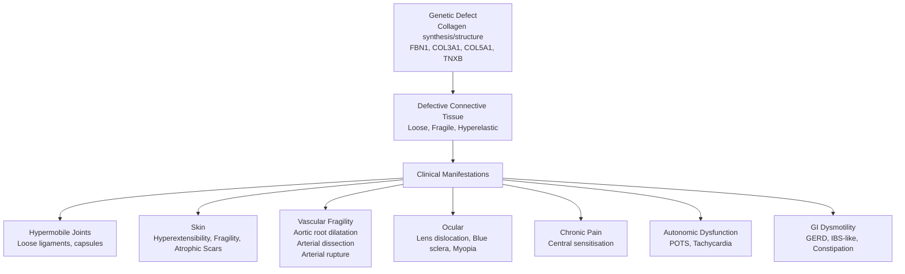
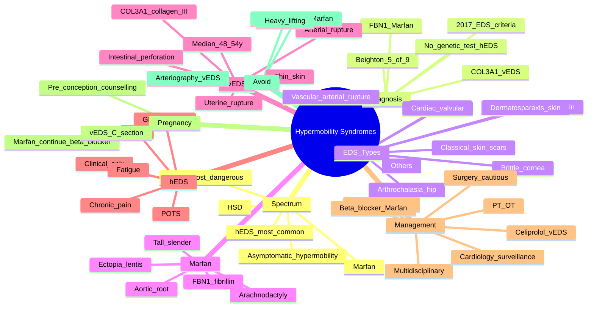

# Hypermobility Syndromes (EDS, Marfan, HSD)

> [!tip] **FCPS/MRCP Priority: HIGH**
> Hypermobility syndromes are a **spectrum** of heritable connective tissue disorders, from **asymptomatic hypermobility** through **hypermobility spectrum disorder (HSD)** to **Ehlers-Danlos syndromes (EDS)** and **Marfan syndrome**. Must know: **Beighton score ≥5/9** for hypermobility, **2017 EDS classification (13 types)**, **hypermobile EDS (hEDS) = most common**, **Marfan: FBN1, aortic root dilatation, ectopia lentis**, **vascular EDS (vEDS) = COL3A1, arterial/organ rupture**, **multidisciplinary management**, and that the **cardinal features** are **joint hypermobility + skin hyperextensibility + fragility + chronic pain**.

---

## Learning Objectives
By the end of this note you should be able to:
- [ ] Define the **spectrum**: asymptomatic hypermobility → HSD → EDS → Marfan
- [ ] Apply **Beighton score** to assess hypermobility
- [ ] Use **2017 EDS classification** to identify the 13 types (with hEDS most common)
- [ ] Diagnose **hypermobile EDS (hEDS)** with **2017 criteria**
- [ ] Recognise **vascular EDS (vEDS)** and **Marfan syndrome** as **life-threatening** variants
- [ ] Identify **cardiovascular complications** (aortic root, dissection, MVP)
- [ ] Manage with **multidisciplinary care** (PT, OT, pain, psychology, cardiology, genetics)
- [ ] Counsel on **prognosis and family screening**

---

## 1. Definition & Spectrum
### Spectrum of Heritable Connective Tissue Disorders
| Term | Definition |
|------|------------|
| **Asymptomatic hypermobility** | Beighton ≥5/9; no symptoms |
| **Generalised joint laxity** | Multi-joint laxity; mild symptoms |
| **Hypermobility Spectrum Disorder (HSD)** | Hypermobility + symptoms; **does not meet EDS criteria** |
| **Hypermobile EDS (hEDS)** | **Most common EDS**; hypermobility + skin hyperextensibility + chronic pain + systemic features |
| **Other EDS types** | Classical, vascular, kyphoscoliotic, arthrochalasia, dermatosparaxis, brittle cornea, spondylodysplastic, musculocontractural, myopathic, periodontal, cardiac-valvular (13 total) |
| **Marfan syndrome** | **FBN1** mutation; cardiovascular (aortic root), skeletal, ocular |

### Ehlers-Danlos Syndromes (2017 Classification)
| Type | Gene | Inheritance | Key Features |
|------|------|-------------|--------------|
| **Classical (cEDS)** | COL5A1, COL5A2, COL1A1 | AD | **Skin hyperextensibility, atrophic scars, joint hypermobility** |
| **Classical-like (clEDS)** | TNXB | AR | Similar to cEDS; minimal scarring |
| **Cardiac-valvular (cvEDS)** | COL1A2 | AR | Severe cardiac valve disease, hypermobility, skin hyperextensibility |
| **Vascular (vEDS)** | **COL3A1** | AD | **Arterial rupture, organ rupture, easy bruising, thin translucent skin**; **life-threatening** |
| **Hypermobile (hEDS)** | **Unknown** (likely polygenic) | AD | **Most common**; hypermobility, chronic pain, autonomic dysfunction, GI, fatigue |
| **Arthrochalasia (aEDS)** | COL1A1, COL1A2 | AD | Severe hypermobility, congenital hip dislocation, short stature |
| **Dermatosparaxis (dEDS)** | ADAMTS2 | AR | **Severe skin fragility**, redundant skin, easy bruising |
| **Kyphoscoliotic (kEDS)** | PLOD1, FKBP14 | AR | Severe hypotonia, congenital scoliosis, ocular fragility |
| **Brittle cornea (BCS)** | ZNF469, PRDM5 | AR | **Corneal fragility/rupture**, blue sclera, keratoconus |
| **Spondylodysplastic (spEDS)** | B4GALT7, B3GALT6, SLC39A13 | AR | Short stature, muscle hypotonia, skeletal dysplasia |
| **Musculocontractural (mcEDS)** | CHST14, DSE | AR | Congenital contractures, scoliosis, skin hyperextensibility |
| **Myopathic (mEDS)** | COL12A1 | AD/AR | Congenital muscle hypotonia, proximal joint contractures |
| **Periodontal (pEDS)** | C1R, C1S | AD | **Severe early-onset periodontitis, gingival recession** |

> [!important] **Most Common = hEDS**
> **Hypermobile EDS (hEDS)** is the **most common EDS** (~80-90% of cases) and the **most clinically relevant**. **No genetic test** — clinical diagnosis. **Vascular EDS (vEDS)** is **rarest** but **most life-threatening**.

---

## 2. Epidemiology
| Feature | hEDS | Marfan | vEDS |
|---------|------|--------|------|
| **Prevalence** | 1/500 (most common) | 1/5,000 | 1/50,000-200,000 |
| **Age** | All ages (often adult) | All ages | Often diagnosed in 20-40y |
| **Sex** | **F > M (3-9:1)** | M = F | M = F |
| **Inheritance** | AD (likely polygenic) | AD (FBN1) | AD (COL3A1) |
| **Mortality** | Normal (mainly morbidity) | **Reduced** (aortic dissection) | **Reduced** (arterial rupture) |

---

## 3. Pathophysiology

### Genes and Proteins
| Gene | Protein | Syndrome |
|------|---------|----------|
| **FBN1** | **Fibrillin-1** (microfibrils in ECM) | **Marfan** |
| **COL3A1** | **Collagen III** (vessels, hollow organs) | **Vascular EDS** |
| **COL5A1, COL5A2** | Collagen V | Classical EDS |
| **TNXB** | Tenascin-X (elastic fibre component) | Classical-like EDS |
| **COL1A1, COL1A2** | Collagen I | Arthrochalasia, cardiac-valvular |
| **PLOD1** | Lysyl hydroxylase | Kyphoscoliotic EDS |

---

## 4. Diagnosis
### 4.1 Beighton Score (Hypermobility)
| Joint | Tested |
|-------|--------|
| **5th finger (PIP) extension** | ≥90° (passive) — **bilateral** |
| **Thumb opposition to forearm** | Passive apposition — **bilateral** |
| **Elbow hyperextension** | ≥10° — **bilateral** |
| **Knee hyperextension** | ≥10° — **bilateral** |
| **Forward trunk flexion** | Palms flat on floor (knees extended) |
| **Maximum** | **9** |
| **Cut-off** | **≥5/9** = generalised hypermobility (children, pre-pubertal); ≥4/9 (puberty-50y); ≥3/9 (>50y) |

> [!note] **Beighton score is a SCREENING tool, not a diagnosis**
> Hypermobility is necessary but not sufficient. Use with the full **2017 EDS criteria** for hEDS diagnosis.

### 4.2 2017 hEDS Criteria (International Consortium)
**Must meet ALL 3:**
| Criterion | Description |
|-----------|-------------|
| **1. Generalized joint hypermobility** | Beighton score as above |
| **2. Systemic features** (≥5 of 12) | Soft skin, hyperextensible skin, easy bruising, stretch marks, piezogenic papules, recurrent abdominal hernias, atrophic scars, pelvic organ prolapse, dental crowding, arachnodactyly, arm span/height >1.05, mitral valve prolapse, aortic root dilatation |
| **3. No other heritable/connective tissue disorder** (excludes Marfan, Loeys-Dietz, vascular EDS) | Genetic testing if unclear |

> [!important] **No Genetic Test for hEDS**
> Diagnosis is **clinical**; no confirmatory genetic test exists. **Genetic testing** is used to **exclude** other conditions (COL3A1 for vEDS, FBN1 for Marfan, etc.).

### 4.3 Marfan Syndrome (Revised Ghent Nosology, 2010)
**Major criteria:**
- **Aortic root dilatation** (Z-score ≥2) or dissection
- **Ectopia lentis**
- **FBN1 mutation** (pathogenic)
- **Systemic score ≥7** (out of 20)

**Diagnosis:** Aortic root dilatation + ectopia lentis + FBN1; **or** aortic root + FBN1 + systemic ≥7; **or** aortic root + ectopia lentis + systemic ≥7.

### 4.4 Vascular EDS (Major + Minor Criteria)
**Major criteria (any of):**
- Arterial rupture at young age
- Intestinal/uterine rupture
- **Carotid-cavernous fistula**
- Familial history of vEDS
- **COL3A1 mutation**

**Minor criteria:** Thin translucent skin, acrogeria, easy bruising, characteristic facies, hypermobility of small joints, tendon/muscle rupture, talipes, pneumothorax, etc.

---

## 5. Clinical Features
### Hypermobile EDS (hEDS)
| System | Features |
|--------|----------|
| **Joint** | **Hypermobility** (Beighton ≥5/9); subluxations/dislocations; chronic joint pain; early OA; proprioceptive deficit |
| **Skin** | Mild hyperextensibility; **soft, smooth, velvety**; easy bruising; **atrophic scars** (paper-thin); striae (NOT pathognomonic) |
| **Pain** | **Chronic widespread pain** (similar to fibromyalgia); **central sensitisation**; worse with activity |
| **Autonomic** | **POTS** (postural tachycardia, dizziness, syncope); GI dysmotility; urinary dysfunction |
| **GI** | **GERD**, **IBS-like symptoms**, gastroparesis, constipation |
| **Cardiac** | **Mitral valve prolapse** (MVP, 30-50%); aortic root dilatation (rare in hEDS) |
| **Fatigue** | Profound, similar to ME/CFS |
| **Psychiatric** | Anxiety, depression (chronic disease burden) |
| **Sleep** | Disturbed; non-restorative |
| **Proprioception** | Impaired; clumsiness; falls |

### Marfan Syndrome
| System | Features |
|--------|----------|
| **Cardiovascular** | **Aortic root dilatation** → dissection (leading cause of death); **MVP, MR**; aortic surgery often needed |
| **Skeletal** | Tall, slender, **arachnodactyly** (long fingers), **dolichostenomelia** (arm span > height); pectus excavatum/carinatum; scoliosis; high-arched palate; pes planus |
| **Ocular** | **Ectopia lentis** (lens dislocation, usually superotemporal); myopia; retinal detachment |
| **Skin** | Striae, hyperextensibility (mild) |
| **Dural** | **Dural ectasia** (lumbosacral) |
| **Pulmonary** | Pneumothorax, apical blebs |

### Vascular EDS (vEDS)
| System | Features |
|--------|----------|
| **Vascular** | **Arterial rupture** (any medium/large vessel); **aortic dissection**; **aneurysm**; **arteriovenous fistula**; **carotid-cavernous fistula** |
| **GI** | **Intestinal perforation** (sigmoid colon most common) |
| **Uterine** | **Uterine rupture** (pregnancy) |
| **Skin** | **Thin, translucent**; **easy bruising**; **acrogeria** (aged appearance of hands); small joint hypermobility |
| **Facies** | Thin, narrow face, prominent eyes |
| **Mortality** | **Median survival 48-54y**; 25% have major complication by 20y, 80% by 40y |

---

## 6. Investigations
### Baseline
| Test | Purpose |
|------|---------|
| **FBC, ESR, CRP** | Baseline; **normal** in HCT |
| **ANA, RF** | Exclude autoimmune |
| **CK** | Exclude myositis |
| **LFT, U&E, Ca, Mg, vitamin D** | Baseline; chronic pain may have deficiency |
| **Echocardiogram** | **MVP, aortic root diameter** (Z-score) |
| **ECG** | Baseline; conduction defects |
| **Aortic MRI/CT** | If echo concerning or for surveillance (Marfan, vEDS) |
| **DEXA** | Osteoporosis (especially on chronic steroids) |

### Genetic Testing
| Indication | Test |
|------------|------|
| **Marfan** | **FBN1** sequencing + deletion/duplication |
| **Vascular EDS** | **COL3A1** sequencing |
| **Classical EDS** | COL5A1, COL5A2, COL1A1 (cEDS type) |
| **Other EDS** | Gene panels (next-gen sequencing) |
| **hEDS** | **No genetic test** (clinical diagnosis) |
| **Differential** | Loeys-Dietz (TGFBR1, TGFBR2, SMAD3) |

### Imaging
| Modality | Use |
|----------|-----|
| **Echocardiogram** | MVP, aortic root (Z-score) |
| **Cardiac MRI** | Detailed aortic anatomy |
| **Whole-body MRI** (rare) | Look for aneurysms (vEDS surveillance) |
| **Spine MRI** | Dural ectasia (Marfan) |
| **Joint US/MRI** | Effusion, soft tissue |

---

## 7. Management
### 7.1 Multidisciplinary Care
| Specialist | Role |
|-----------|------|
| **Rheumatology** | Diagnosis, pain management, joint care |
| **Physiotherapy** | **Core strengthening, proprioception, pacing** |
| **Occupational therapy** | Joint protection, pacing, ADL adaptations |
| **Cardiology** | Aortic surveillance (Marfan, vEDS), MVP, POTS |
| **Clinical genetics** | Family screening, reproductive counseling |
| **Pain management** | Chronic pain multidisciplinary programme |
| **Psychology/Psychiatry** | Anxiety, depression, CBT, acceptance |
| **Gastroenterology** | GI dysmotility |
| **Orthopaedics** | Joint stabilisation surgery (limited) |
| **Pain anaesthetics** | Nerve blocks, spinal cord stimulation (rare) |

### 7.2 Specific by Syndrome
| Syndrome | Specific Management |
|----------|---------------------|
| **hEDS** | PT, OT, pain management, **celiprolol** (off-label, ↓ vascular events), POTS Rx (fluids, salt, β-blocker, midodrine) |
| **Marfan** | **β-blocker** (atenolol) or **ARB (losartan)**; **aortic surgery** if root >4.5-5.0 cm; **avoid strenuous exercise**; ophthalmology |
| **vEDS** | **Celiprolol** (↓ arterial events); **avoid arteriography** (rupture risk); **surgery with caution**; pregnancy **high-risk** (delivery by C-section) |

### 7.3 Pharmacotherapy
| Drug | Use |
|------|-----|
| **Paracetamol, NSAIDs** | First-line for pain; **limit NSAID** (GI, renal) |
| **Amitriptyline 10-50 mg nocte** | Neuropathic pain, sleep, fibromyalgia overlap |
| **Duloxetine 30-60 mg** | Pain, mood |
| **Gabapentin/Pregabalin** | Neuropathic pain |
| **Tramadol** | Moderate-severe pain (last line) |
| **Celiprolol** | **vEDS, Marfan** — β1 agonist + β2 antagonist; ↓ arterial events |

### 7.4 Non-Pharmacological
| Intervention | Notes |
|--------------|-------|
| **Physiotherapy** | **Core strengthening, proprioception, low-impact** (Pilates, hydrotherapy) |
| **Occupational therapy** | Joint protection, pacing, splints |
| **Weight management** | Reduces joint stress |
| **Exercise** | Low-impact (swimming, cycling); **avoid contact sports, heavy lifting** |
| **Pacing** | Avoid boom-bust; activity-rest balance |
| **Bracing** | Joint supports; taping; orthotics |
| **Heat, TENS** | Symptom relief |
| **Psychological** | CBT, ACT, mindfulness, sleep hygiene |
| **CGM/dietary** | Mediterranean, anti-inflammatory |
| **Compression stockings** | POTS |

### 7.5 Surgical (Cautious)
- **Joint stabilisation**: Capsulorrhaphy, ligament reconstruction (high failure; reserved)
- **Aortic surgery (Marfan)**: Threshold varies (5 cm root; 4.5 cm if family history of dissection or rapid growth)
- **Aortic/vascular surgery (vEDS)**: **HIGH risk** — tissue fragility; minimally invasive preferred
- **C-section** preferred in vEDS/Marfan pregnancy (avoid labour stress)

> [!warning] **Surgery in vEDS is HIGH RISK**
> **Tissue fragility** → high anastomotic leak, rupture. **Surgery only for life-threatening complications**, with experienced surgical team, careful tissue handling, minimal electrocautery.

---

## 8. Special Situations
### Pregnancy
- **hEDS**: Generally well-tolerated; **labour** may be rapid; consider analgesia, instrumental delivery if needed
- **Marfan**:
  - **Aortic dissection risk ↑** in pregnancy (3rd trimester, post-partum)
  - Aortic root >4.0 cm = **relative contraindication** to pregnancy
  - Continue **β-blocker** (atenolol) throughout
  - **Avoid**: ergometrine, Valsalva (forceps)
  - **Epidural** for pain relief
- **vEDS**:
  - **Uterine rupture, arterial dissection** risk
  - **Pre-conception genetic counselling**
  - **Continue celiprolol**
  - **Elective C-section** (avoid labour)
  - Multidisciplinary care

### Children / Adolescents
- **Joint hypermobility** common (10-15% children)
- **Most grow out** or become asymptomatic
- **Persistent symptoms** = hEDS/HSD
- **Avoid over-medicalisation**; encourage activity, normal play

### Athletes
- **Marfan**: Avoid contact sports, isometric heavy lifting, Valsalva
- **EDS**: Low-impact; avoid extreme stretching (worsens laxity)
- **Pre-participation screening** (Marfan): echo, ECG, ophthalmology

---

## 9. Prognosis
| Syndrome | Outcome |
|----------|---------|
| **hEDS** | Normal life expectancy; chronic pain, fatigue, disability common |
| **Marfan** | **Reduced** (aortic dissection, surgery); 70% survival to 70y with modern Rx |
| **vEDS** | **Median survival 48-54y**; major complications in 25% by 20y, 80% by 40y |
| **HSD** | Variable; better than hEDS |
| **Children** | Beighton score decreases with age |

---

## 10. FCPS/MRCP High-Yield Summary
| Topic | Key Points |
|-------|------------|
| **Spectrum** | Asymptomatic hypermobility → HSD → hEDS → Marfan → vEDS |
| **Beighton score** | **≥5/9** (children), ≥4/9 (puberty-50y), ≥3/9 (>50y) — **9 = bilateral 5th finger, thumb, elbow, knee, trunk** |
| **hEDS (most common)** | **No genetic test**; clinical 2017 criteria; hypermobility + systemic + no other cause |
| **vEDS (most dangerous)** | **COL3A1**; **arterial/organ rupture**; thin translucent skin; median survival 48-54y |
| **Marfan** | **FBN1**; **aortic root dilatation + ectopia lentis**; tall, arachnodactyly |
| **EDS types (2017)** | **13 types**: classical, classical-like, cardiac-valvular, vascular, hypermobile (most common), arthrochalasia, dermatosparaxis, kyphoscoliotic, brittle cornea, spondylodysplastic, musculocontractural, myopathic, periodontal |
| **Skin** | Hyperextensibility, atrophic scars, easy bruising |
| **Joint** | Subluxation, dislocation, chronic pain, early OA |
| **Autonomic** | POTS (postural tachycardia) |
| **GI** | GERD, IBS-like, dysmotility |
| **Cardiovascular** | MVP (hEDS), aortic root (Marfan, vEDS), dissection |
| **Echocardiogram** | Essential (all HCT) |
| **Management** | **Multidisciplinary**; PT, OT, pain, cardiology, genetics, psychology |
| **Celiprolol** | **vEDS** (↓ arterial events); off-label in Marfan |
| **Marfan Rx** | **β-blocker + ARB (losartan)**; aortic surgery at 4.5-5.0 cm |
| **Surgery** | **High risk in vEDS**; tissue fragility |
| **Pregnancy** | Marfan: continue β-blocker, monitor aortic root; vEDS: elective C-section, celiprolol |
| **Avoid** | Contact sports, heavy lifting (Marfan), arteriography (vEDS) |

---

## 11. Viva Questions (MRCP PACES / FCPS)
| Question | Expected Answer |
|----------|-----------------|
| "Beighton score breakdown?" | **5th finger (PIP) extension ≥90° bilateral (2), thumb opposition to forearm bilateral (2), elbow hyperextension ≥10° bilateral (2), knee hyperextension ≥10° bilateral (2), trunk flexion palms flat on floor (1) = 9 total**. |
| "How do you diagnose hEDS?" | **2017 criteria**: (1) Beighton hypermobility; (2) ≥5 systemic features (12 possible); (3) exclusion of other heritable connective tissue disease. **No genetic test**. |
| "Most life-threatening EDS?" | **Vascular EDS (vEDS)** — **COL3A1** mutation; arterial rupture, intestinal/uterine perforation; median survival 48-54y. |
| "Marfan features on examination?" | Tall, slender, **arachnodactyly** (long fingers), arm span > height, pectus deformity, high-arched palate, lens dislocation (ectopia lentis), striae. |
| "Aortic root threshold for surgery in Marfan?" | **≥5.0 cm** (or 4.5 cm if family history of dissection, rapid growth, or pregnancy planned). |
| "Drug therapy for Marfan?" | **β-blocker (atenolol) + ARB (losartan)**; combination superior to either alone (COMPARE trial). |
| "Drug therapy for vEDS?" | **Celiprolol** — β1 agonist + β2 antagonist; reduces arterial events. **Avoid arteriography** (rupture risk). |
| "POTS in hypermobility?" | **Postural orthostatic tachycardia syndrome** — HR ↑ ≥30 bpm on standing, dizziness, syncope, fatigue. Common in hEDS (50%). Rx: fluids, salt, compression, β-blocker (propranolol), midodrine. |
| "Why is surgery risky in vEDS?" | **Tissue fragility** → high anastomotic leak, arterial rupture. Only for life-threatening complications, with experienced surgical team. |
| "Pregnancy in vEDS?" | **High-risk** — uterine rupture, arterial dissection. **Pre-conception genetic counselling, elective C-section, multidisciplinary care**. |

---

## 12. Confusions & Mnemonics
| Confusion | Clarification |
|-----------|---------------|
| **hEDS vs HSD** | hEDS = meets 2017 criteria. HSD = symptomatic hypermobility but doesn't meet hEDS criteria |
| **Hypermobility is common** | 10-15% of children, 5% of adults; not all are hEDS |
| **Beighton score = diagnosis?** | **No** — screening only. Use with 2017 criteria |
| **hEDS no genetic test** | Clinical diagnosis; testing to **exclude** Marfan, vEDS |
| **Marfan vs vEDS** | Marfan = FBN1, aortic root + lens. vEDS = COL3A1, arterial rupture + thin skin |
| **Surgery in vEDS** | **Very risky**; only life-threatening |
| **Marfan and pregnancy** | Continue β-blocker; monitor aortic root; C-section if root >4.0 cm |
| **Celiprolol** | **vEDS**; not β-blocker (Marfan) |

**Mnemonic: Beighton 5 = "BEND-EKTP"**
- **B**end 5th finger
- **E**xtend elbow
- **N**o (thumb) — thumb opposition
- **D**o (knee) — knee hyperextension
- **EKTP** = elbow, knee, thumb, palm

**Mnemonic: hEDS = "HYPER"**
- **H**ypermobility (Beighton ≥5/9)
- **Y**es to ≥5 systemic features
- **P**ain (chronic)
- **E**xclude other HCT
- **R**eal (not all in head)

**Mnemonic: vEDS = "VESSEL FRAGILE"**
- **V**essels rupture
- **E**asy bruising
- **S**kin thin/translucent
- **S**pontaneous intestinal perforation
- **E**ctopic pregnancy, uterine rupture
- **L**ow survival (median 48-54y)
- **F**amily history

**Mnemonic: Marfan = "MARFAN"**
- **M**yxomatous mitral valve
- **A**ortic root dilatation
- **R**eading FBN1
- **F**ibrillin defect
- **A**rachnodactyly
- **N**eed surgery at 5 cm

**Mnemonic: POTS = "STAND UP"**
- **S**ymptomatic orthostatic
- **T**achycardia ≥30 bpm on standing
- **A**lso dizziness, syncope
- **N**eeds fluids + β-blocker
- **D**aily life affected
- **U**p to 50% in hEDS
- **P**osture

**Mnemonic: EDS 13 types = "VECTOR" (most important)**
- **V**ascular (vEDS) — most dangerous
- **E**hlers-Danlos, **C**lassical
- **T**hirteen types total
- **O**h, plus cardiac-valvular, kyphoscoliotic, dermatosparaxis, arthrochalasia, brittle cornea, spondylodysplastic, musculocontractural, myopathic, periodontal, classical-like
- **R**ecall hEDS = most common

---

## 13. Mind Map

---

## 14. One-Page Revision Card
| Domain | Key Points |
|--------|------------|
| **Spectrum** | Asymptomatic → HSD → hEDS → Marfan → vEDS |
| **Beighton score** | ≥5/9 children; ≥4/9 puberty-50y; ≥3/9 >50y; **9 = bilateral 5th finger, thumb, elbow, knee, trunk** |
| **hEDS (most common)** | Clinical 2017 criteria; hypermobility + ≥5 systemic + exclude other; **no genetic test** |
| **vEDS (most dangerous)** | **COL3A1**; arterial/organ rupture; thin translucent skin; median survival 48-54y |
| **Marfan** | **FBN1**; aortic root + ectopia lentis; arachnodactyly; tall |
| **EDS 13 types** | Classical, vascular, hypermobile, cardiac-valvular, arthrochalasia, dermatosparaxis, kyphoscoliotic, brittle cornea, spondylodysplastic, musculocontractural, myopathic, periodontal, classical-like |
| **Joint** | Hypermobility, subluxation, dislocation, chronic pain, early OA |
| **Skin** | Hyperextensibility, atrophic scars, easy bruising |
| **Autonomic** | POTS (50% hEDS) |
| **GI** | GERD, dysmotility, IBS-like |
| **Cardiac** | MVP (hEDS), aortic root (Marfan, vEDS) |
| **Echocardiogram** | All HCT — MVP, aortic root Z-score |
| **Celiprolol** | **vEDS**; ↓ arterial events |
| **Marfan Rx** | **β-blocker + losartan**; surgery at 5 cm root |
| **Surgery** | **High risk in vEDS**; only life-threatening |
| **Pregnancy** | Marfan: continue β-blocker; vEDS: C-section, multidisciplinary |
| **Avoid** | Contact sports (Marfan), arteriography (vEDS), heavy lifting |

---

## 15. Spaced Repetition Trackers
| Review Interval | Date Completed | Confidence (1-5) | Notes |
|-----------------|----------------|------------------|-------|
| 24 hours | | | |
| 7 days | | | |
| 15 days | | | |
| 30 days | | | |
| 90 days | | | |

---

## 16. Self-Test Scorecard
| Section | Score /5 | Last Attempt |
|---------|----------|--------------|
| Beighton score breakdown | | |
| 2017 hEDS criteria | | |
| vEDS features and prognosis | | |
| Marfan diagnostic features | | |
| Aortic surgery threshold in Marfan | | |
| Celiprolol role in vEDS | | |
| POTS in hypermobility | | |
| 13 EDS types (key features) | | |
| Pregnancy management | | |
| Surgery risk in vEDS | | |
| Viva Questions | | |

---

## Local Navigation
- **Parent Heading**: [[../Autoimmune Rheumatic Diseases|Autoimmune Rheumatic Diseases]]
- **Parent Topic Group**: [[Connective tissue diseases]]
- **Sibling Topics**: [[Systemic sclerosis (scleroderma)]] · [[Fibromyalgia]] · [[Complex regional pain syndrome]] · [[Marfan-related]]
- **Chapter Map**: [[../Davidson Chapter 26 - Rheumatology Hierarchy|Rheumatology Hierarchy]]
- **Chapter MOC**: [[../Rheumatology MOC|Rheumatology MOC]]
- **Related**: [[Drugs in rheumatology]] · [[Investigations in rheumatology]] · [[Joint examination (GALS)]]
---

> Auto-generated study sections for "Autoimmune Rheumatic Diseases" — Ch 25: Rheumatology & Bone Disease.

## Flashcards (30 generated)

- Q: What is the definition of Autoimmune Rheumatic Diseases?
  A: Hypermobility syndromes are a spectrum of heritable connective tissue disorders, from asymptomatic hypermobility through hypermobility spectrum disorder (HSD) to Ehlers-Danlos syndromes (EDS) and Marfan syndrome.
- Q: What are the clinical features of Autoimmune Rheumatic Diseases?
  A: Beighton ≥5/9; no symptoms
- Q: What is Generalised joint laxity of Autoimmune Rheumatic Diseases?
  A: Multi-joint laxity; mild symptoms
- Q: What is Hypermobility Spectrum Disorder (HSD) of Autoimmune Rheumatic Diseases?
  A: Hypermobility + symptoms; does not meet EDS criteria
- Q: What is Hypermobile EDS (hEDS) of Autoimmune Rheumatic Diseases?
  A: Most common EDS; hypermobility + skin hyperextensibility + chronic pain + systemic features
- Q: How is Autoimmune Rheumatic Diseases classified?
  A: Classical, vascular, kyphoscoliotic, arthrochalasia, dermatosparaxis, brittle cornea, spondylodysplastic, musculocontractural, myopathic, periodontal, cardiac-valvular (13 total)
- Q: What is Marfan syndrome of Autoimmune Rheumatic Diseases?
  A: FBN1 mutation; cardiovascular (aortic root), skeletal, ocular
- Q: What are the clinical features of Autoimmune Rheumatic Diseases?
  A: Beighton ≥5/9; no symptoms
- Q: What is Generalised joint laxity of Autoimmune Rheumatic Diseases?
  A: Multi-joint laxity; mild symptoms
- Q: What is Hypermobility Spectrum Disorder (HSD) of Autoimmune Rheumatic Diseases?
  A: Hypermobility + symptoms; does not meet EDS criteria
- Q: What is Hypermobile EDS (hEDS) of Autoimmune Rheumatic Diseases?
  A: Most common EDS; hypermobility + skin hyperextensibility + chronic pain + systemic features
- Q: How is Autoimmune Rheumatic Diseases classified?
  A: Classical, vascular, kyphoscoliotic, arthrochalasia, dermatosparaxis, brittle cornea, spondylodysplastic, musculocontractural, myopathic, periodontal, cardiac-valvular (13 total)
- Q: What is Spectrum of Autoimmune Rheumatic Diseases?
  A: Asymptomatic hypermobility → HSD → hEDS → Marfan → vEDS
- Q: What is Beighton score of Autoimmune Rheumatic Diseases?
  A: ≥5/9 (children), ≥4/9 (puberty-50y), ≥3/9 (>50y) — 9 = bilateral 5th finger, thumb, elbow, knee, trunk
- Q: What is hEDS (most common) of Autoimmune Rheumatic Diseases?
  A: No genetic test; clinical 2017 criteria; hypermobility + systemic + no other cause
- Q: What is vEDS (most dangerous) of Autoimmune Rheumatic Diseases?
  A: COL3A1; arterial/organ rupture; thin translucent skin; median survival 48-54y
- Q: What is Marfan of Autoimmune Rheumatic Diseases?
  A: FBN1; aortic root dilatation + ectopia lentis; tall, arachnodactyly
- Q: How is Autoimmune Rheumatic Diseases classified?
  A: 13 types: classical, classical-like, cardiac-valvular, vascular, hypermobile (most common), arthrochalasia, dermatosparaxis, kyphoscoliotic, brittle cornea, spondylodysplastic, musculocontractural, myopathic, periodontal
- Q: What is Skin of Autoimmune Rheumatic Diseases?
  A: Hyperextensibility, atrophic scars, easy bruising
- Q: What is Joint of Autoimmune Rheumatic Diseases?
  A: Subluxation, dislocation, chronic pain, early OA
- Q: What is Autonomic of Autoimmune Rheumatic Diseases?
  A: POTS (postural tachycardia)
- Q: What is GI of Autoimmune Rheumatic Diseases?
  A: GERD, IBS-like, dysmotility
- Q: What is Cardiovascular of Autoimmune Rheumatic Diseases?
  A: MVP (hEDS), aortic root (Marfan, vEDS), dissection
- Q: What is Echocardiogram of Autoimmune Rheumatic Diseases?
  A: Essential (all HCT)
- Q: How is Autoimmune Rheumatic Diseases managed?
  A: Multidisciplinary; PT, OT, pain, cardiology, genetics, psychology
- Q: What is Celiprolol of Autoimmune Rheumatic Diseases?
  A: vEDS (↓ arterial events); off-label in Marfan
- Q: What is Marfan Rx of Autoimmune Rheumatic Diseases?
  A: β-blocker + ARB (losartan); aortic surgery at 4.5-5.0 cm
- Q: What is Surgery of Autoimmune Rheumatic Diseases?
  A: High risk in vEDS; tissue fragility
- Q: What is Pregnancy of Autoimmune Rheumatic Diseases?
  A: Marfan: continue β-blocker, monitor aortic root; vEDS: elective C-section, celiprolol
- Q: What is Avoid of Autoimmune Rheumatic Diseases?
  A: Contact sports, heavy lifting (Marfan), arteriography (vEDS)

## MCQs (1 generated)

1. **Which of the following best describes Autoimmune Rheumatic Diseases?**
   A. **Hypermobility syndromes are a spectrum of heritable connective tissue disorders, from asymptomatic hypermobility through hypermobility spectrum disorder (HSD) to Ehlers-Danlos syndromes (EDS) and Marf**
   B. An unrelated condition not matching the clinical picture of Autoimmune Rheumatic Diseases
   C. A complication seen late in the disease course of Autoimmune Rheumatic Diseases
   D. A condition that mimics Autoimmune Rheumatic Diseases but has a different underlying cause

## SBA Questions (1 generated)

1. A patient with suspected Autoimmune Rheumatic Diseases presents with: Asymptomatic hypermobility — Beighton ≥5/9; no symptoms; Generalised joint laxity — Multi-joint laxity; mild symptoms; Hypermobility Spectrum Disorder (HSD) — Hypermobility + symptoms; does not meet EDS criteria. What is the most likely diagnosis?
   A. **Autoimmune Rheumatic Diseases**
   B. A condition that mimics Autoimmune Rheumatic Diseases but is not the same entity
   C. A complication of Autoimmune Rheumatic Diseases rather than the primary diagnosis
   D. An unrelated condition in the same clinical category as Autoimmune Rheumatic Diseases

