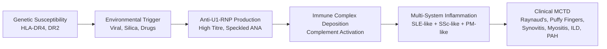
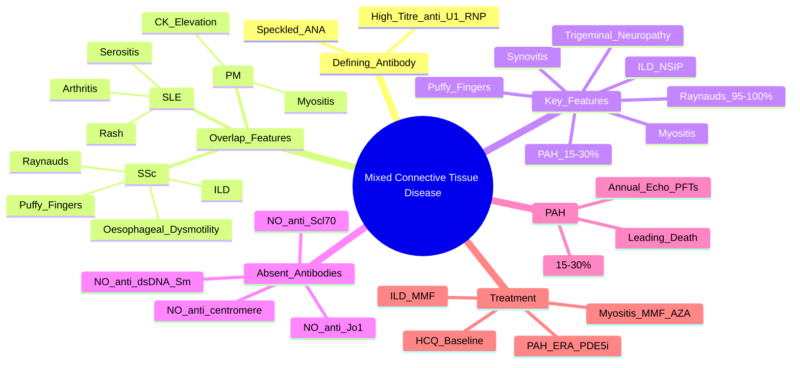

# Mixed Connective Tissue Disease (MCTD)

> [!tip] **FCPS/MRCP Priority: HIGH**
> MCTD = **overlap syndrome** with features of **SLE + SSc + PM/DM** + **HIGH-TITRE anti-U1-RNP** (defining). **Raynaud's (universal), puffy fingers, synovitis, myositis, ILD, PAH**. **PAH = leading cause of death** — screen annually. **No anti-dsDNA, anti-Sm, anti-Scl-70, anti-Jo1** (differentiates from SLE, SSc, PM).

---

## Learning Objectives
By the end of this note you should be able to:
- [ ] Apply Kasuya/Alarcón-Segovia diagnostic criteria (high-titre anti-U1-RNP + clinical features)
- [ ] Recognise "puffy fingers" as early sign vs sclerodactyly in SSc
- [ ] Differentiate MCTD from SLE, SSc, PM/DM, Rhupus using autoantibody profile
- [ ] Screen for PAH annually (echo + PFTs — leading cause of death)
- [ ] Manage organ-threatening disease (ILD, PAH, myositis) with immunosuppression
- [ ] Understand anti-U1-RNP as defining serological marker (high titre, speckled ANA)

---

## 1. Definition & Epidemiology

| Feature | Detail |
|---------|--------|
| **Definition** | **Overlap syndrome** with clinical features of **SLE, systemic sclerosis (SSc), and polymyositis/dermatomyositis (PM/DM)** plus **high-titre anti-U1-RNP antibody** |
| **Incidence** | 1-2/100,000/year |
| **Prevalence** | ~3-5/100,000 |
| **Peak Onset** | **20-40 years** |
| **Sex Ratio** | **F:M = 3:1** |
| **Genetics** | HLA-DR4, HLA-DR2 |

---

## 2. Aetiology & Pathophysiology



### Key Pathogenic Features
| Feature | Detail |
|---------|--------|
| **Anti-U1-RNP** | Targets **U1 small nuclear ribonucleoprotein** (70kDa, A, C proteins) — **defining marker** |
| **High titre** | **Defining serological feature** — distinguishes from low-titre in SLE/SSc |
| **Speckled ANA pattern** | Characteristic |
| **Overlap pathophysiology** | Features of SLE (immune complexes), SSc (vasculopathy/fibrosis), PM (myositis) |

---

## 3. Clinical Features

### Universal / Very Common
| Feature | Frequency | Detail |
|---------|-----------|--------|
| **Raynaud's Phenomenon** | **95-100%** | Often **first manifestation** (years before other features) |
| **Puffy Fingers / Hands** | **70-90%** | **Early sign** — oedematous swelling of fingers/hands; **precedes sclerodactyly** |
| **Synovitis / Arthritis** | **80-90%** | Non-erosive, symmetrical (MCP, PIP, wrists) — **SLE-like** |
| **Myositis** | **50-70%** | Proximal weakness, elevated CK — **PM-like** |

### Common
| Feature | Frequency | Detail |
|---------|-----------|--------|
| **Sclerodactyly** | **40-60%** | Skin tightening of digits — **later than puffy fingers** |
| **Oesophageal Dysmotility** | **70-80%** | Dysphagia, reflux — **SSc-like** |
| **ILD** | **40-60%** | NSIP pattern — dyspnoea, ↓DLCO |
| **PAH** | **15-30%** | **LEADING CAUSE OF DEATH** — screen annually |
| **Pleuritis/Pericarditis** | **20-30%** | SLE-like serositis |

### Other
| Feature | Frequency | Detail |
|---------|-----------|--------|
| **Trigeminal Neuropathy** | **10-20%** | Sensory loss V1/V2 — **specific for MCTD** |
| **Lymphadenopathy** | **20-30%** | Generalised |
| **Renal** | **10-20%** | Mild (mesangioproliferative) — rarely severe (unlike SLE) |
| **Skin** | Variable | Lupus-like rash, dilated nailfold capillaries |

> [!critical] **Puffy Fingers vs Sclerodactyly**
> - **Puffy fingers** = **early**, oedematous, swollen fingers/hands — **reversible** early sign
> - **Sclerodactyly** = **late**, skin tightening, tethering — **irreversible fibrosis**
> - **Progression**: Puffy fingers → Sclerodactyly (over months-years)

---

## 4. Diagnosis — Kasuya / Alarcón-Segovia Criteria

### Kasuya Criteria (1987)
| Serological | Clinical (need ≥3) |
|-------------|-------------------|
| **High-titre anti-U1-RNP** (essential) | 1. **Edema of hands** (puffy fingers) |
| | 2. **Synovitis** |
| | 3. **Myositis** |
| | 4. **Raynaud's phenomenon** |
| | 5. **Acrosclerosis** (sclerodactyly) |

**Definite MCTD = Serological + ≥3 clinical**

### Alarcón-Segovia Criteria (1987)
| Serological | Clinical (need ≥3) |
|-------------|-------------------|
| **High-titre anti-U1-RNP** | 1. **Edema of hands** |
| | 2. **Synovitis** |
| | 3. **Myositis** |
| | 4. **Raynaud's** |
| | 5. **Acrosclerosis** |

**Commonly used: High-titre anti-U1-RNP + ≥3 clinical features**

---

## 5. Autoantibody Profile — **Defining Feature**

| Antibody | MCTD | SLE | SSc | PM/DM |
|----------|------|-----|-----|-------|
| **Anti-U1-RNP (high titre)** | **DEFINING (100%)** | Low titre (20-30%) | Low titre (5-10%) | Rare |
| **Anti-dsDNA / Anti-Sm** | **Negative** | **Positive** | Negative | Negative |
| **Anti-Scl-70 (Topo I)** | **Negative** | Negative | **Positive (diffuse)** | Negative |
| **Anti-centromere** | **Negative** | Negative | **Positive (limited)** | Negative |
| **Anti-Jo1** | **Negative** | Negative | Negative | **Positive (antisynthetase)** |
| **Anti-Ro/La** | Variable | Positive | Negative | Negative |
| **ANA Pattern** | **Speckled (high titre)** | Homogeneous/Speckled | Speckled/Nucleolar/Centromere | Speckled |

> [!critical] **Differentiation Keys**
> - **Anti-U1-RNP HIGH TITRE = MCTD** (not low titre as in SLE/SSc)
> - **NO anti-dsDNA, NO anti-Sm** → excludes SLE
> - **NO anti-Scl-70** → excludes diffuse SSc
> - **NO anti-Jo1** → excludes antisynthetase/PM

---

## 6. Organ Involvement — Focus on PAH & ILD

### Pulmonary Arterial Hypertension (PAH) — **Leading Cause of Death**
| Aspect | Detail |
|--------|--------|
| **Frequency** | **15-30%** (higher than SLE/SSc) |
| **Screening** | **Annual Echo (RVSP) + PFTs (DLCO)** — **DLCO <60% + FVC/DLCO >1.6 = high risk** |
| **Confirmation** | **Right Heart Catheterisation (RHC)** — mPAP >20mmHg, PAWP ≤15mmHg, PVR >3WU |
| **Treatment** | **ERA (Bosentan, Ambrisentan, Macitentan) + PDE5i (Sildenafil, Tadalafil) ± Prostacyclin analogues** — as per SSc-PAH |

### Interstitial Lung Disease (ILD)
| Aspect | Detail |
|--------|--------|
| **Pattern** | **NSIP** (most common), UIP less common |
| **Screening** | HRCT + PFTs (FVC, DLCO) annually |
| **Treatment** | **MMF 2-3g/day** (1st line); CYC, RTX, Nintedanib, Tocilizumab (as per SSc-ILD) |

### Other Organ Threats
| Organ | Management |
|-------|------------|
| **Myositis** | Steroids + steroid-sparing (MMF, AZA, MTX) |
| **Synovitis** | HCQ, MTX, SSZ |
| **Oesophageal Dysmotility** | PPI, prokinetics, diet modification |
| **Renal** | Mild (mesangioproliferative) — usually no aggressive Rx needed |

---

## 7. Management

```mermaid
flowchart TD
    A[MCTD Diagnosis] --> B[Hydroxychloroquine ALL\n(Baseline: fatigue, arthralgia, mild synovitis)]
    B --> C{Organ Involvement}
    C -->|Mild\n(Fatigue, arthralgia, Raynaud's)| D[HCQ + NSAIDs + PPI\nRaynaud's: CCB (Nifedipine)]
    C -->|Moderate\n(Synovitis, Myositis, Mild ILD)| E[HCQ + Steroid-sparing:\nMMF 2-3g/day OR AZA 2mg/kg\nOR MTX 15-25mg/wk]
    C -->|Severe/Organ-Threatening\n(ILD, PAH, Severe Myositis)| F[Pulse MP 500-1000mg ×3\n+ CYC IV OR RTX\n+ Steroid-sparing]
    D --> G[Annual PAH Screen\n(Echo + PFTs/DLCO)]
    E --> G
    F --> G
    G --> H{PAH Detected?}
    H -->|Yes| I[ERA + PDE5i ± Prostacyclin\n(RHC confirmed)]
    H -->|No| J[Continue Monitoring]
```

### Drug Selection by Organ
| Organ | 1st Line | 2nd Line / Refractory |
|-------|----------|----------------------|
| **Baseline (All)** | **Hydroxychloroquine** (fatigue, arthralgia, mild synovitis) | — |
| **Raynaud's** | **CCB (Nifedipine, Amlodipine)** | PDE5i (Sildenafil), IV Iloprost (ulcers) |
| **Synovitis** | HCQ + MTX/SSZ | Anti-TNF, RTX |
| **Myositis** | Pred 1mg/kg → taper + **MMF/AZA/MTX** | IVIG, RTX, Tacrolimus |
| **ILD** | **MMF 2-3g/day** (1st) | CYC, RTX, Nintedanib, Tocilizumab |
| **PAH** | **ERA + PDE5i** (RHC confirmed) | Prostacyclin analogues, Selexipag |

---

## 8. FCPS/MRCP High-Yield Summary

| Topic | Key Points |
|-------|------------|
| **Defining Antibody** | **High-titre anti-U1-RNP** (speckled ANA) — **essential for diagnosis** |
| **Overlap Features** | **SLE** (arthritis, serositis, rash), **SSc** (Raynaud's, puffy fingers, sclerodactyly, ILD, oesophageal dysmotility), **PM** (myositis, CK elevation) |
| **Puffy Fingers** | **Early sign** (oedematous, reversible) vs **sclerodactyly** (late, fibrotic, irreversible) |
| **Trigeminal Neuropathy** | **Specific for MCTD** (sensory V1/V2) |
| **Anti-U1-RNP** | **High titre = defining**; **NO anti-dsDNA, anti-Sm, anti-Scl-70, anti-Jo1** (differentiates) |
| **PAH** | **15-30% — LEADING CAUSE OF DEATH**; screen annually (Echo + PFTs/DLCO) |
| **ILD** | NSIP pattern; **MMF 1st line**; screen annually (HRCT, PFTs) |
| **Renal** | Mild (mesangioproliferative) — **rarely severe** (unlike SLE) |
| **Trigeminal Neuropathy** | **Specific for MCTD** (sensory V1/V2) |
| **Treatment** | HCQ baseline; steroid-sparing (MMF/AZA/MTX) for organ involvement; PAH = ERA+PDE5i |

---

## 9. Viva Questions (MRCP PACES / FCPS)

| Question | Expected Answer |
|----------|----------------|
| "What is the defining autoantibody in MCTD?" | **High-titre anti-U1-RNP** (speckled ANA pattern) — essential for diagnosis. |
| "How do you differentiate MCTD from SLE, SSc, and PM?" | **MCTD = high-titre anti-U1-RNP, NO anti-dsDNA/anti-Sm, NO anti-Scl-70, NO anti-Jo1**. Overlap: SLE (arthritis, serositis), SSc (Raynaud's, puffy fingers, ILD), PM (myositis). |
| "What is the significance of puffy fingers in MCTD?" | **Early sign** — oedematous swelling of hands/fingers, **precedes sclerodactyly**, often reversible initially. Sclerodactyly = late fibrotic tightening. |
| "What is the leading cause of death in MCTD?" | **Pulmonary arterial hypertension (PAH)** — **15-30% develop PAH**; screen annually with Echo + PFTs (DLCO). |
| "What is the significance of trigeminal neuropathy in MCTD?" | **Specific for MCTD** — sensory loss in V1/V2 distribution (not seen in SLE/SSc/PM). |
| "How do you screen for PAH in MCTD?" | **Annual Echocardiography (RVSP) + PFTs (DLCO)**. **DLCO <60% + FVC/DLCO >1.6 = high risk** → confirm with RHC. |
| "What autoantibodies are ABSENT in MCTD (that are present in SLE/SSc/PM)?" | **NO anti-dsDNA, NO anti-Sm** (excludes SLE); **NO anti-Scl-70** (excludes diffuse SSc); **NO anti-Jo1** (excludes antisynthetase/PM). |
| "How does MCTD renal disease differ from SLE?" | **Mild mesangioproliferative GN** — **rarely severe** (unlike SLE lupus nephritis). |
| "What is the treatment for MCTD-PAH?" | Same as SSc-PAH: **ERA + PDE5i** (RHC confirmed); prostacyclin analogues if severe. Screen annually. |
| "What is the Kasuya criteria for MCTD?" | **Serological**: high-titre anti-U1-RNP (essential). **Clinical (≥3)**: edema of hands, synovitis, myositis, Raynaud's, acrosclerosis. |

---

## 10. Confusions & Mnemonics

| Confusion | Clarification |
|-----------|---------------|
| **MCTD vs SLE** | MCTD: **high-titre anti-U1-RNP**, NO anti-dsDNA/anti-Sm, mild renal. SLE: anti-dsDNA/anti-Sm+, severe renal. |
| **MCTD vs SSc** | MCTD: **anti-U1-RNP high titre**, NO anti-Scl-70/centromere, myositis common. SSc: anti-Scl-70/centromere+, no myositis, severe skin fibrosis. |
| **MCTD vs PM** | MCTD: anti-U1-RNP high titre, NO anti-Jo1, Raynaud's/puffy fingers/ILD/PAH. PM: anti-Jo1+, no Raynaud's/puffy fingers, no PAH. |
| **Puffy Fingers vs Sclerodactyly** | **Puffy = early, oedematous, reversible**. **Sclerodactyly = late, fibrotic, irreversible**. |
| **Anti-U1-RNP in SLE** | Low titre anti-U1-RNP can occur in SLE (20-30%) — **high titre + clinical overlap = MCTD**. |
| **Rhupus vs MCTD** | Rhupus = RA + SLE overlap (erosive arthritis + SLE features). MCTD = SLE+SSc+PM overlap + anti-U1-RNP. |

**Mnemonic: MCTD = "U1-RNP HIGH"**
- **U1-RNP** high titre = **defining**
- **H**igh titre (not low)
- **I**mmunological overlap (SLE+SSc+PM)
- **G**ood prognosis (if no PAH)
- **H**ybrid syndrome

**Mnemonic: Overlap = "S-S-P"**
- **S**LE features (arthritis, serositis, rash)
- **S**Sc features (Raynaud's, puffy fingers, ILD, oesophageal)
- **P**M features (myositis, CK elevation)

**Mnemonic: Absent Antibodies = "NO D-S-J"**
- **NO** anti-**D**sDNA / anti-**S**m
- **NO** anti-**S**cl-70
- **NO** anti-**J**o1

**Mnemonic: PAH = "MCTD KILLER"**
- **P**ulmonary **A**rterial **H**ypertension
- **15-30%** develop
- **L**eading cause of death
- **Annual** Echo + PFTs (DLCO)

**Mnemonic: Puffy Fingers = "EARLY REVERSIBLE"**
- **E**arly sign
- **A**cute onset
- **R**eversible (initially)
- **L**ymphoedema-like
- **Y**oung onset

---

## 11. Mind Map



---

## 12. One-Page Revision Card

| Domain | Key Points |
|--------|------------|
| **Defining Antibody** | **High-titre anti-U1-RNP** (speckled ANA) — essential |
| **Overlap** | **SLE** (arthritis, serositis) + **SSc** (Raynaud's, puffy fingers, ILD) + **PM** (myositis) |
| **Puffy Fingers** | Early, oedematous, **reversible** — vs sclerodactyly (late, fibrotic) |
| **Absent Antibodies** | **NO anti-dsDNA/Sm, NO anti-Scl-70, NO anti-Jo1, NO anti-centromere** |
| **PAH** | **15-30% — leading cause of death** — annual Echo + PFTs (DLCO) |
| **ILD** | NSIP pattern; **MMF 1st line** |
| **Trigeminal Neuropathy** | **Specific for MCTD** (V1/V2 sensory loss) |
| **Renal** | Mild mesangioproliferative — **rarely severe** |
| **Treatment** | HCQ baseline → MMF/AZA/MTX (organ involvement) → PAH: ERA+PDE5i |

---

## 13. Spaced Repetition Trackers

| Review Interval | Date Completed | Confidence (1-5) | Notes |
|-----------------|----------------|------------------|-------|
| 24 hours | | | |
| 7 days | | | |
| 15 days | | | |
| 30 days | | | |
| 90 days | | | |

---

## 14. Self-Test Scorecard

| Section | Score /5 | Last Attempt |
|---------|----------|--------------|
| Defining Features & Anti-U1-RNP | | |
| Differentiation from SLE/SSc/PM | | |
| Puffy Fingers vs Sclerodactyly | | |
| PAH Screening & Management | | |
| ILD Management | | |
| Trigeminal Neuropathy | | |
| Kasuya Criteria | | |
| Viva Questions | | |

---

## Local Navigation
- **Parent Heading**: [[../Autoimmune Rheumatic Diseases|Autoimmune Rheumatic Diseases]]
- **Parent Topic Group**: [[Connective tissue diseases]]
- **Chapter Map**: [[../Davidson Chapter 26 - Rheumatology Hierarchy|Rheumatology Hierarchy]]
- **Chapter MOC**: [[../Rheumatology MOC|Rheumatology MOC]]
- **Drug Reference**: [[../../Clinical Approach to Musculoskeletal Disease/Drugs in rheumatology|Drugs in rheumatology]]
- **Related**: [[Systemic Lupus Erythematosus]] · [[Systemic sclerosis (scleroderma)]] · [[Polymyositis and dermatomyositis]]
---

> Auto-generated study sections for "Autoimmune Rheumatic Diseases" — Ch 25: Rheumatology & Bone Disease.

## Flashcards (22 generated)

- Q: What is the definition of Autoimmune Rheumatic Diseases?
  A: MCTD = overlap syndrome with features of SLE + SSc + PM/DM + HIGH-TITRE anti-U1-RNP (defining).
- Q: What is Frequency of Autoimmune Rheumatic Diseases?
  A: 15-30% (higher than SLE/SSc)
- Q: What is Screening of Autoimmune Rheumatic Diseases?
  A: Annual Echo (RVSP) + PFTs (DLCO) — DLCO <60% + FVC/DLCO >1.6 = high risk
- Q: What is Confirmation of Autoimmune Rheumatic Diseases?
  A: Right Heart Catheterisation (RHC) — mPAP >20mmHg, PAWP ≤15mmHg, PVR >3WU
- Q: How is Autoimmune Rheumatic Diseases managed?
  A: ERA (Bosentan, Ambrisentan, Macitentan) + PDE5i (Sildenafil, Tadalafil) ± Prostacyclin analogues — as per SSc-PAH
- Q: What is Pattern of Autoimmune Rheumatic Diseases?
  A: NSIP (most common), UIP less common
- Q: What is Screening of Autoimmune Rheumatic Diseases?
  A: HRCT + PFTs (FVC, DLCO) annually
- Q: How is Autoimmune Rheumatic Diseases managed?
  A: MMF 2-3g/day (1st line); CYC, RTX, Nintedanib, Tocilizumab (as per SSc-ILD)
- Q: What is Frequency of Autoimmune Rheumatic Diseases?
  A: 15-30% (higher than SLE/SSc)
- Q: What is Screening of Autoimmune Rheumatic Diseases?
  A: Annual Echo (RVSP) + PFTs (DLCO) — DLCO <60% + FVC/DLCO >1.6 = high risk
- Q: What is Confirmation of Autoimmune Rheumatic Diseases?
  A: Right Heart Catheterisation (RHC) — mPAP >20mmHg, PAWP ≤15mmHg, PVR >3WU
- Q: What is Pattern of Autoimmune Rheumatic Diseases?
  A: NSIP (most common), UIP less common
- Q: What is Screening of Autoimmune Rheumatic Diseases?
  A: HRCT + PFTs (FVC, DLCO) annually
- Q: What is Defining Antibody of Autoimmune Rheumatic Diseases?
  A: High-titre anti-U1-RNP (speckled ANA) — essential for diagnosis
- Q: What are the clinical features of Autoimmune Rheumatic Diseases?
  A: SLE (arthritis, serositis, rash), SSc (Raynaud's, puffy fingers, sclerodactyly, ILD, oesophageal dysmotility), PM (myositis, CK elevation)
- Q: What is Puffy Fingers of Autoimmune Rheumatic Diseases?
  A: Early sign (oedematous, reversible) vs sclerodactyly (late, fibrotic, irreversible)
- Q: What is Trigeminal Neuropathy of Autoimmune Rheumatic Diseases?
  A: Specific for MCTD (sensory V1/V2)
- Q: What is Anti-U1-RNP of Autoimmune Rheumatic Diseases?
  A: High titre = defining; NO anti-dsDNA, anti-Sm, anti-Scl-70, anti-Jo1 (differentiates)
- Q: What is PAH of Autoimmune Rheumatic Diseases?
  A: 15-30% — LEADING CAUSE OF DEATH; screen annually (Echo + PFTs/DLCO)
- Q: What is ILD of Autoimmune Rheumatic Diseases?
  A: NSIP pattern; MMF 1st line; screen annually (HRCT, PFTs)
- Q: What is Renal of Autoimmune Rheumatic Diseases?
  A: Mild (mesangioproliferative) — rarely severe (unlike SLE)
- Q: How is Autoimmune Rheumatic Diseases managed?
  A: HCQ baseline; steroid-sparing (MMF/AZA/MTX) for organ involvement; PAH = ERA+PDE5i

## MCQs (1 generated)

1. **Which of the following best describes Autoimmune Rheumatic Diseases?**
   A. **MCTD = overlap syndrome with features of SLE + SSc + PM/DM + HIGH-TITRE anti-U1-RNP (defining).**
   B. An unrelated condition not matching the clinical picture of Autoimmune Rheumatic Diseases
   C. A complication seen late in the disease course of Autoimmune Rheumatic Diseases
   D. A condition that mimics Autoimmune Rheumatic Diseases but has a different underlying cause

## SBA Questions (1 generated)

1. A patient with suspected Autoimmune Rheumatic Diseases presents with: Definition — Overlap syndrome with clinical features of SLE, systemic sclerosis (SSc), and polymyositis/dermatomyositis (PM/DM) plus high-titre anti-U1-RNP antibody; Peak Onset — 20-40 years; Sex Ratio — F:M = 3:1. What is the most likely diagnosis?
   A. **Autoimmune Rheumatic Diseases**
   B. A condition that mimics Autoimmune Rheumatic Diseases but is not the same entity
   C. A complication of Autoimmune Rheumatic Diseases rather than the primary diagnosis
   D. An unrelated condition in the same clinical category as Autoimmune Rheumatic Diseases

