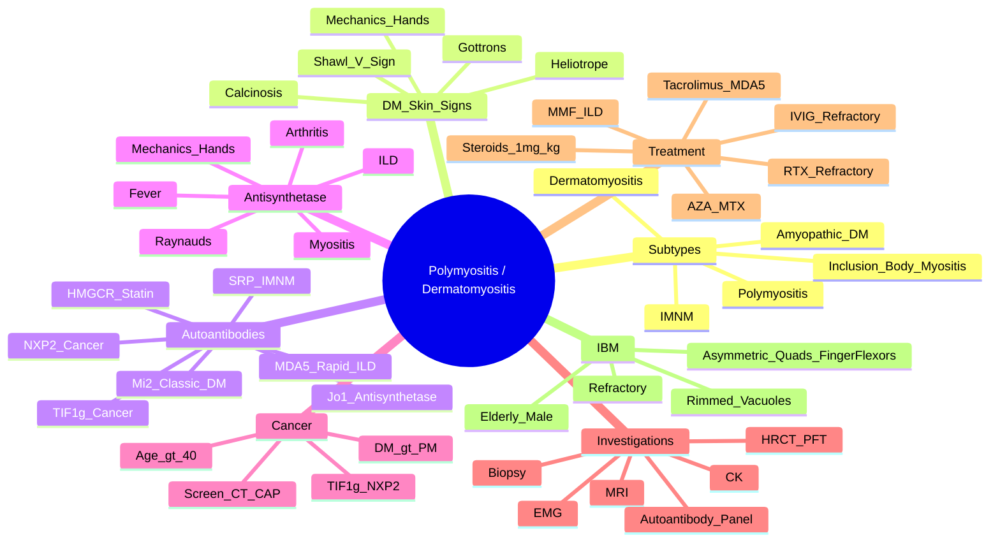

# Polymyositis (PM) & Dermatomyositis (DM)

> [!tip] **FCPS/MRCP Priority: HIGH**
> Idiopathic inflammatory myopathies. DM = PM + **characteristic skin signs** (heliotrope, Gottron's). **Malignancy association (DM > PM, age >40)** — screen aggressively. Antibody-guided: anti-Jo1 (antisynthetase), anti-TIF1γ (cancer), anti-MDA5 (rapid ILD), anti-Mi2 (classic DM). Guaranteed viva/SBA topic.

---

## Learning Objectives
By the end of this note you should be able to:
- [ ] Differentiate PM vs DM vs IBM vs IMNM using clinical, serological, and histological features
- [ ] Recognise DM-specific skin signs (heliotrope, Gottron's, shawl/V-sign, mechanic's hands)
- [ ] Apply EULAR/ACR 2017 classification criteria
- [ ] Interpret myositis-specific autoantibodies (Jo1, Mi2, TIF1γ, NXP2, MDA5, HMGCR, SRP)
- [ ] Screen for malignancy in DM (age >40) and PM
- [ ] Select treatment: steroids → steroid-sparing → IVIG/RTX for refractory
- [ ] Recognise antisynthetase syndrome and anti-MDA5 rapidly progressive ILD

---

## 1. Definition & Epidemiology

| Feature | PM | DM |
|---------|----|----|
| **Definition** | Idiopathic inflammatory myopathy — **proximal muscle weakness**, **no skin signs** | PM **+ characteristic skin signs** |
| **Incidence** | 1-2/100,000/year | 1-2/100,000/year |
| **Peak Onset** | 40-60 years | **Bimodal**: 5-15y (juvenile), 40-60y (adult) |
| **Sex Ratio** | **F > M (2:1)** | **F > M (2:1)** |
| **Malignancy Risk** | Moderate (SIR 2-3) | **High (SIR 3-6), especially age >40** |
| **Genetics** | HLA-B8, DR3, DR52, DRB1*03:01 | HLA-B8, DR3, DQ2 |

---

## 2. Clinical Features

### Shared Features (PM & DM)
| Feature | Description |
|---------|-------------|
| **Proximal Muscle Weakness** | **Symmetric**, shoulders/hips > distal; difficulty rising from chair, climbing stairs, combing hair, lifting arms |
| **Dysphagia** | Pharyngeal/oesophageal involvement (1/3) — aspiration risk |
| **Dysphonia** | Laryngeal muscle weakness |
| **Interstitial Lung Disease (ILD)** | 30-40% — NSIP pattern; **anti-Jo1, anti-MDA5** |
| **Arthralgia/Arthritis** | Non-erosive, symmetric (hands, wrists) |
| **Raynaud's Phenomenon** | 20-30% — associated with antisynthetase |
| **Constitutional** | Fatigue, low-grade fever, weight loss |
| **Cardiac** | Conduction defects, cardiomyopathy (rare) |

### DM-Specific Skin Signs — **High-Yield for OSCE/Viva**
| Sign | Location | Description |
|------|----------|-------------|
| **Heliotrope Rash** | **Periorbital** | **Violaceous/heliotrope** eyelid edema + rash — **pathognomonic** |
| **Gottron's Papules** | **MCP/PIP knuckles, elbows, knees** | **Violaceous, flat-topped papules** over extensor surfaces |
| **Gottron's Sign** | Same areas | Erythematous, scaly plaques (vs papules) |
| **Shawl Sign** | **Upper back, shoulders, neck** | Violaceous erythema in "shawl" distribution |
| **V-Sign** | **Anterior chest, neck** | Violaceous erythema in "V" distribution |
| **Mechanic's Hands** | **Palmar, lateral fingers** | **Hyperkeratotic, fissured, dirty-appearing palms** — **antisynthetase syndrome** |
| **Periungual Telangiectasia** | Nail folds | Dilated capillary loops (similar to scleroderma) |
| **Calcinosis** | Subcutaneous | **Juvenile DM** — hydroxyapatite deposits; can ulcerate/infect |

> [!critical] **DM = PM + Skin Signs**
> - **Heliotrope + Gottron's = classic DM**
> - **Mechanic's hands = antisynthetase syndrome (anti-Jo1)**
> - **Skin signs may precede weakness** (amyopathic DM)

---

## 3. Subtypes & Differential

| Subtype | Key Features | FCPS/MRCP Pearl |
|---------|--------------|-----------------|
| **Polymyositis (PM)** | Proximal weakness, **no skin signs**, CK ↑, myopathic EMG, biopsy: endomysial CD8+ T-cells | **Exclusion diagnosis** — must rule out IBM, drug-induced, endocrine, metabolic |
| **Dermatomyositis (DM)** | **PM + skin signs** (heliotrope, Gottron's, shawl, V, mechanic's) | **Skin signs pathognomonic** |
| **Inclusion Body Myositis (IBM)** | **Elderly M**, **asymmetric** proximal + distal (quads + **finger flexors**), **rimmed vacuoles**, **refractory** to immunosuppression | **Quadriceps + finger flexor weakness = IBM**; **no response to steroids** |
| **Immune-Mediated Necrotizing Myopathy (IMNM)** | **High CK**, necrotizing biopsy (minimal inflammation), **anti-HMGCR** (statin), **anti-SRP** | **Statin-associated (HMGCR)** — improves with statin stop + immunosuppression |
| **Clinically Amyopathic DM (CADM)** | **Skin signs only**, minimal/no weakness, **anti-MDA5** → **rapidly progressive ILD** | **Anti-MDA5 = high mortality ILD** |

---

## 4. Autoantibodies — **Antibody-Guided Phenotypes**

| Antibody | Syndrome | Frequency | Key Features |
|----------|----------|-----------|--------------|
| **Anti-Jo1** (tRNA synthetase) | **Antisynthetase Syndrome** | 20-30% myositis | **Myositis + ILD + Mechanic's Hands + Raynaud's + Non-erosive Arthritis + Fever**; "Gary's syndrome" |
| **Anti-Mi2** | **Classic DM** | 10-20% DM | **Good prognosis**, skin-predominant, responsive to treatment |
| **Anti-TIF1γ (p155/140)** | **Cancer-Associated DM** | 10-20% adult DM | **Strongest cancer association**; age >40; ovarian, lung, breast, GI |
| **Anti-NXP2 (MJ)** | **Cancer-Associated DM / Juvenile DM** | 10-15% DM | Cancer (adult), **calcinosis + contractures (juvenile)** |
| **Anti-MDA5** | **Clinically Amyopathic DM + Rapid ILD** | 10-20% DM (Asian > Caucasian) | **Rapidly progressive ILD**, high mortality, skin ulcers, palmar papules, **amyopathic** |
| **Anti-HMGCR** | **Statin-Associated IMNM** | 50% IMNM | **Statin exposure** — may persist after stop; high CK, necrotizing biopsy |
| **Anti-SRP** | **Severe IMNM** | 10-20% IMNM | Cardiac involvement, dysphagia, refractory |
| **Anti-PM-Scl** | **PM/Scleroderma Overlap** | 5-10% | Myositis + scleroderma features (Raynaud's, ILD) |
| **Anti-Ku** | **Overlap (PM/SLE/PSS)** | Rare | |

> [!critical] **Antisynthetase Syndrome (Anti-Jo1)**
> - **Myositis + ILD + Mechanic's Hands + Raynaud's + Non-erosive Arthritis + Fever**
> - **Anti-Jo1 most common** (70% of antisynthetase)
> - **ILD often NSIP** — dominant feature determining prognosis
> - **Mechanic's Hands = hyperkeratotic fissured palms** (pathognomonic)

> [!critical] **Anti-MDA5 = Rapid ILD**
> - **Clinically amyopathic DM** (skin signs, minimal weakness)
> - **Rapidly progressive ILD** (weeks) — high mortality
> - **Skin ulcers, palmar papules, oral ulcers, alopecia**
> - **Early aggressive immunosuppression** (calcineurin inhibitors, RTX, IVIG)

---

## 5. Classification — EULAR/ACR 2017

| Criterion | Weight |
|-----------|--------|
| **Proximal muscle weakness** (symmetric) | 2 |
| **Elevated CK** (>ULN) | 2 |
| **Myopathic EMG** | 2 |
| **Muscle biopsy** (inflammatory/necrotizing/vacuolar) | 3 |
| **DM skin signs** (heliotrope, Gottron's, shawl/V, mechanic's) | 4 |
| **Myositis-specific autoantibody** (Jo1, Mi2, TIF1γ, etc.) | 2 |

**Probability Score: ≥5.5 = Definite; 4.5-5.4 = Probable; 3.5-4.4 = Possible**

---

## 6. Investigations

| Test | Role | Typical Finding |
|------|------|-----------------|
| **CK** | **Screening + monitoring** | **Markedly elevated** (10-100x ULN); normal in CADM/IBM |
| **Aldolase, LDH, AST, ALT** | Muscle enzymes | Elevated (AST/ALT can mimic hepatitis) |
| **EMG/NCS** | Confirm myopathy | **Short duration, low amplitude, polyphasic** MUPs; **fibrillations/positive waves** |
| **MRI (Muscle)** | Extent of inflammation, guide biopsy | **STIR/T2 hyperintensity = oedema/inflammation**; fatty replacement = chronic |
| **Muscle Biopsy** | **Gold standard** | **PM**: endomysial CD8+ T-cells invading MHC-I+ fibres; **DM**: perivascular B-cells, MAC deposition, perifascicular atrophy; **IBM**: rimmed vacuoles, 15-18nm filaments; **IMNM**: necrosis, minimal inflammation |
| **Autoantibody Panel** | Phenotype, prognosis, cancer risk | Jo1, Mi2, TIF1γ, NXP2, MDA5, HMGCR, SRP, PM-Scl, Ku |
| **HRCT Chest** | ILD (NSIP pattern) | Ground-glass, reticulation, traction bronchiectasis |
| **PFTs** | ILD severity | Restrictive pattern, ↓DLCO |
| **Malignancy Screen (DM >40, PM)** | **CT CAP, Mammography, Colonoscopy, Gynae, PSA** | Age-appropriate + directed by antibodies (TIF1γ/NXP2) |

---

## 7. Malignancy Screening — **DM >40y Critical**

| Timing | Action |
|--------|--------|
| **At Diagnosis** | **CT Chest/Abdomen/Pelvis**, **Mammography** (women), **Colonoscopy** (>45y), **Gynaecological** (transvaginal US, CA125), **PSA** (men) |
| **Directed by Antibody** | **Anti-TIF1γ / Anti-NXP2** → **intensive search** (ovarian, lung, breast, GI, nasopharyngeal) |
| **Repeat** | **Annually ×3-5 years** (highest risk first 2-3 years) |
| **Juvenile DM** | **No routine cancer screen** (low risk) |

> [!warning] **DM Cancer Risk**
> - **DM > PM** (SIR 3-6 vs 2-3)
> - **Age >40** = highest risk
> - **Anti-TIF1γ = strongest association** (ovarian, lung, breast, GI)
> - **Anti-NXP2** = also cancer-associated

---

## 8. Management

```mermaid
flowchart TD
    A[PM/DM Diagnosis] --> B[Glucocorticoids: Pred 1mg/kg\n(60-80mg daily) → taper over months]
    B --> C[Steroid-Sparing Agent\nStart Early (within 4-8 weeks)]
    C --> C1[MMF 2-3g/day\n(1st line for ILD)]
    C --> C2[Azathioprine 2mg/kg/day\n(TPMT test)]
    C --> C3[Methotrexate 15-25mg/week\n(if no ILD)]
    C --> C4[Tacrolimus\n(if rapid ILD/MDA5+)]
    C --> C5[Rituximab 1000mg ×2\n(refractory, MDA5+)]
    C --> D[Monitor: CK, Muscle Strength,\nPFTs/HRCT (ILD), Side Effects]
    D --> E{Refractory?}
    E -->|Yes| F[IVIG 2g/kg/cycle\n(5 days monthly)]
    F --> G[Consider RTX, Tacrolimus,\nCyclophosphamide]
    E -->|No| H[Taper Steroids to ≤10mg\nContinue Steroid-Sparing 1-2yr]
```

### Treatment Details

| Agent | Indication | Dose | Monitoring |
|-------|------------|------|------------|
| **Prednisolone** | **1st line ALL** | 1mg/kg (60-80mg) daily → taper 10mg q2-4wk to 20mg → slower | Glucose, BP, bone, weight, cataracts, infection |
| **Mycophenolate (MMF)** | **1st choice for ILD** | 2-3g/day (divided) | FBC, LFT, U&E q1-3mo; diarrhoea → enteric |
| **Azathioprine** | Alternative | 2mg/kg/day | **TPMT test**; FBC, LFT; avoid with allopurinol |
| **Methotrexate** | If no ILD | 15-25mg weekly + folate | FBC, LFT; avoid in ILD (pneumonitis risk) |
| **Tacrolimus** | **Rapid ILD / MDA5+** | 0.05-0.1mg/kg (trough 5-10) | Trough levels, renal, BP, glucose, neuro |
| **Rituximab** | Refractory, MDA5+, antisynthetase | 1000mg IV ×2 (2wks apart) + steroids | IgG, B-cells (CD19), HepB, infection |
| **IVIG** | Refractory, dysphagia, IBM? | 2g/kg over 2-5 days monthly | Renal function, thrombosis risk, headache |
| **Cyclophosphamide** | Severe refractory | IV pulse 500-1000mg/m² | Mesna, hydration, FBC, gonadoprotection |

> [!important] **IBM — No Immunosuppression Benefit**
> - **Refractory to steroids/immunosuppressants**
> - **Management**: Physiotherapy, fall prevention, dysphagia management (cricopharyngeal myotomy)
> - **IVIG not effective** (unlike PM/DM)

---

## 9. FCPS/MRCP High-Yield Summary

| Topic | Key Points |
|-------|------------|
| **PM vs DM** | **DM = PM + skin signs** (heliotrope, Gottron's, shawl/V, mechanic's hands) |
| **DM Skin Signs** | **Heliotrope** (periorbital violaceous), **Gottron's** (knuckles), **Shawl/V-sign**, **Mechanic's hands** (antisynthetase) |
| **Antisynthetase (Jo1)** | **Myositis + ILD + Mechanic's Hands + Raynaud's + Arthritis + Fever** |
| **Cancer Association** | **DM > PM**; age >40; **Anti-TIF1γ (strongest), Anti-NXP2** → **CT CAP, mammo, colonoscopy, gynae, PSA** |
| **Anti-MDA5** | **Clinically amyopathic DM + Rapid ILD** — high mortality; early tacrolimus/RTX/IVIG |
| **Anti-HMGCR** | **Statin-associated IMNM** — high CK, necrotizing biopsy; stop statin + immunosuppress |
| **IBM** | **Elderly M**, **asymmetric quads + finger flexors**, **rimmed vacuoles**, **refractory** |
| **Investigations** | **CK** (screening), **EMG** (myopathic), **MRI** (oedema), **Biopsy** (gold standard), **Autoantibody panel** |
| **Treatment** | **Steroids 1mg/kg** → **Steroid-sparing (MMF 1st for ILD)** → **IVIG/RTX** refractory |
| **Malignancy Screen (DM >40)** | **CT CAP, Mammo, Colonoscopy, Gynae, PSA** at Dx + annually ×3-5yr |

---

## 10. Viva Questions (MRCP PACES / FCPS)

| Question | Expected Answer |
|----------|----------------|
| "A 55yo woman has proximal weakness, heliotrope rash, Gottron's papules, and mechanic's hands. Anti-Jo1 positive. What syndrome?" | **Dermatomyositis + Antisynthetase Syndrome** (anti-Jo1). Features: myositis + ILD + mechanic's hands + Raynaud's + arthritis + fever. Screen for ILD (HRCT, PFTs). Malignancy screen (age >40). |
| "What are the characteristic skin signs of dermatomyositis?" | **Heliotrope rash** (periorbital violaceous oedema), **Gottron's papules** (knuckles), **Shawl sign** (upper back), **V-sign** (chest), **Mechanic's hands** (hyperkeratotic palms — antisynthetase). |
| "A 65yo man on simvastatin develops severe proximal weakness, CK 50x ULN. Biopsy shows necrotizing myopathy with minimal inflammation. Antibody?" | **Anti-HMGCR** — **statin-associated IMNM**. Stop statin, start steroids + immunosuppression (MMF/RTX). |
| "How does inclusion body myositis differ from PM/DM?" | **Elderly M**, **asymmetric** proximal + **distal** (quadriceps + **finger flexors**), **rimmed vacuoles** on biopsy, **refractory** to immunosuppression. |
| "What malignancy screen for a 50yo woman with new dermatomyositis, anti-TIF1γ positive?" | **CT CAP, Mammography, Colonoscopy, Gynaecological (TV US, CA125), age-appropriate**. Repeat annually ×3-5 years. Anti-TIF1γ = highest cancer risk. |
| "A 40yo woman with DM has rapidly progressive dyspnoea, HRCT shows diffuse ground-glass. Anti-MDA5 positive. Management?" | **Anti-MDA5 clinically amyopathic DM with rapid ILD** — **urgent aggressive immunosuppression**: high-dose steroids + **tacrolimus** + **RTX** ± **IVIG** ± **cyclophosphamide**. Early referral to specialist. |
| "What is the cancer risk in DM vs PM, and which antibodies increase risk?" | **DM > PM** (SIR 3-6 vs 2-3). Age >40. **Anti-TIF1γ (strongest), Anti-NXP2** increase risk. Screen at diagnosis + annually. |
| "What is the first-line steroid-sparing agent for myositis with ILD?" | **Mycophenolate (MMF) 2-3g/day** — preferred over MTX (pneumonitis risk). |

---

## 11. Confusions & Mnemonics

| Confusion | Clarification |
|-----------|---------------|
| **PM vs DM** | **DM = PM + skin signs**. If skin signs = DM. No skin signs = PM (diagnosis of exclusion). |
| **Mechanic's Hands** | **Hyperkeratotic fissured palms** — **antisynthetase (Anti-Jo1)**. Not just dry skin. |
| **Anti-Jo1 vs Anti-Mi2** | Jo1 = antisynthetase (ILD, mechanic's hands). Mi2 = classic DM, **good prognosis**, skin-predominant. |
| **Anti-TIF1γ vs Anti-NXP2** | **Both cancer-associated**. TIF1γ = strongest (ovarian, lung, breast, GI). NXP2 = also cancer + juvenile calcinosis. |
| **Anti-MDA5** | **Rapid ILD** + clinically amyopathic DM. **High mortality**. Not just skin. |
| **IBM vs PM** | IBM: elderly M, **asymmetric**, **quads + finger flexors**, rimmed vacuoles, **refractory**. PM: symmetric proximal, responsive (partially). |
| **Statin Myopathy vs IMNM** | Statin myopathy: improves with stop. **Anti-HGCR IMNM**: persists after stop, needs immunosuppression. |

**Mnemonic: DM Skin Signs = "H-G-S-V-M"**
- **H**eliotrope (periorbital)
- **G**ottron's (knuckles)
- **S**hawl sign (upper back)
- **V**-sign (chest)
- **M**echanic's hands (palms = antisynthetase)

**Mnemonic: Antisynthetase = "M-I-R-A-F"**
- **M**echanic's hands
- **I**LD
- **R**aynaud's
- **A**rthritis (non-erosive)
- **F**ever

**Mnemonic: Cancer Antibodies = "TIF-NXP"**
- **TIF**1γ = **strongest** cancer (ovarian, lung, breast, GI)
- **NXP**2 = cancer + juvenile calcinosis

**Mnemonic: Rapid ILD = "MDA5"**
- **M**DA5 = **clinically amyopathic** + **rapid ILD** + **high mortality**

**Mnemonic: Statin Myopathy = "HMGCR"**
- **HMGCR** antibody = statin-associated IMNM (persists after statin stop)

**Mnemonic: IBM = "OLD-MAN"**
- **O**lder
- **M**ale
- **A**symmetric
- **N**ear-distal (finger flexors)
- **R**efractory

---

## 12. Mind Map



---

## 13. One-Page Revision Card

| Domain | Key Points |
|--------|------------|
| **PM vs DM** | DM = PM + **skin signs** (heliotrope, Gottron's, shawl/V, mechanic's hands) |
| **DM Skin Signs** | Heliotrope (periorbital), Gottron's (knuckles), Shawl/V-sign, Mechanic's hands |
| **Antisynthetase (Jo1)** | Myositis + **ILD** + Mechanic's hands + Raynaud's + Arthritis + Fever |
| **Cancer Risk** | **DM > PM**; age >40; **Anti-TIF1γ (strongest), Anti-NXP2** → screen CT CAP, mammo, colonoscopy, gynae, PSA |
| **Anti-MDA5** | Clinically amyopathic DM + **rapid ILD** (high mortality) → early tacrolimus/RTX/IVIG |
| **Anti-HMGCR** | **Statin-associated IMNM** — persists after statin stop |
| **IBM** | Elderly M, asymmetric quads + finger flexors, rimmed vacuoles, **refractory** |
| **Investigations** | CK, EMG, MRI (STIR), Biopsy (gold standard), Autoantibody panel, HRCT/PFTs for ILD |
| **Treatment** | Pred 1mg/kg → Steroid-sparing (MMF 1st for ILD, AZA, MTX) → RTX/IVIG refractory |
| **Malignancy Screen** | DM >40: CT CAP, mammo, colonoscopy, gynae, PSA at Dx + annually ×3-5yr |

---

## 14. Spaced Repetition Trackers

| Review Interval | Date Completed | Confidence (1-5) | Notes |
|-----------------|----------------|------------------|-------|
| 24 hours | | | |
| 7 days | | | |
| 15 days | | | |
| 30 days | | | |
| 90 days | | | |

---

## 15. Self-Test Scorecard

| Section | Score /5 | Last Attempt |
|---------|----------|--------------|
| PM vs DM vs IBM vs IMNM | | |
| DM Skin Signs | | |
| Autoantibody Phenotypes | | |
| Antisynthetase Syndrome | | |
| Cancer Screening | | |
| Anti-MDA5 Rapid ILD | | |
| Treatment Algorithm | | |
| Viva Questions | | |

---

## Local Navigation
- **Parent Heading**: [[../Autoimmune Rheumatic Diseases|Autoimmune Rheumatic Diseases]]
- **Parent Topic Group**: [[Connective tissue diseases]]
- **Chapter Map**: [[../Davidson Chapter 26 - Rheumatology Hierarchy|Rheumatology Hierarchy]]
- **Chapter MOC**: [[../Rheumatology MOC|Rheumatology MOC]]
- **Drug Reference**: [[../../Clinical Approach to Musculoskeletal Disease/Drugs in rheumatology|Drugs in rheumatology]]
- **Investigation Reference**: [[../../Clinical Approach to Musculoskeletal Disease/Investigations in rheumatology|Investigations in rheumatology]]
- **Related**: [[Systemic sclerosis (scleroderma)]] · [[Sjogren's syndrome]] · [[Mixed connective tissue disease (MCTD)]]
---

> Auto-generated study sections for "Autoimmune Rheumatic Diseases" — Ch 25: Rheumatology & Bone Disease.

## Flashcards (26 generated)

- Q: What is the definition of Autoimmune Rheumatic Diseases?
  A: | Definition | Idiopathic inflammatory myopathy — proximal muscle weakness, no skin signs | PM + characteristic skin signs |
- Q: What is Proximal Muscle Weakness of Autoimmune Rheumatic Diseases?
  A: Symmetric, shoulders/hips > distal; difficulty rising from chair, climbing stairs, combing hair, lifting arms
- Q: What is Dysphagia of Autoimmune Rheumatic Diseases?
  A: Pharyngeal/oesophageal involvement (1/3) — aspiration risk
- Q: What is Dysphonia of Autoimmune Rheumatic Diseases?
  A: Laryngeal muscle weakness
- Q: What is Interstitial Lung Disease (ILD) of Autoimmune Rheumatic Diseases?
  A: 30-40% — NSIP pattern; anti-Jo1, anti-MDA5
- Q: What is Arthralgia/Arthritis of Autoimmune Rheumatic Diseases?
  A: Non-erosive, symmetric (hands, wrists)
- Q: What is Raynaud's Phenomenon of Autoimmune Rheumatic Diseases?
  A: 20-30% — associated with antisynthetase
- Q: What is Constitutional of Autoimmune Rheumatic Diseases?
  A: Fatigue, low-grade fever, weight loss
- Q: What is Cardiac of Autoimmune Rheumatic Diseases?
  A: Conduction defects, cardiomyopathy (rare)
- Q: What is Proximal Muscle Weakness of Autoimmune Rheumatic Diseases?
  A: Symmetric, shoulders/hips > distal; difficulty rising from chair, climbing stairs, combing hair, lifting arms
- Q: What is Dysphagia of Autoimmune Rheumatic Diseases?
  A: Pharyngeal/oesophageal involvement (1/3) — aspiration risk
- Q: What is Dysphonia of Autoimmune Rheumatic Diseases?
  A: Laryngeal muscle weakness
- Q: What is Interstitial Lung Disease (ILD) of Autoimmune Rheumatic Diseases?
  A: 30-40% — NSIP pattern; anti-Jo1, anti-MDA5
- Q: What is Arthralgia/Arthritis of Autoimmune Rheumatic Diseases?
  A: Non-erosive, symmetric (hands, wrists)
- Q: What is Raynaud's Phenomenon of Autoimmune Rheumatic Diseases?
  A: 20-30% — associated with antisynthetase
- Q: What is Constitutional of Autoimmune Rheumatic Diseases?
  A: Fatigue, low-grade fever, weight loss
- Q: What is PM vs DM of Autoimmune Rheumatic Diseases?
  A: DM = PM + skin signs (heliotrope, Gottron's, shawl/V, mechanic's hands)
- Q: What is DM Skin Signs of Autoimmune Rheumatic Diseases?
  A: Heliotrope (periorbital violaceous), Gottron's (knuckles), Shawl/V-sign, Mechanic's hands (antisynthetase)
- Q: What is Antisynthetase (Jo1) of Autoimmune Rheumatic Diseases?
  A: Myositis + ILD + Mechanic's Hands + Raynaud's + Arthritis + Fever
- Q: What is Cancer Association of Autoimmune Rheumatic Diseases?
  A: DM > PM; age >40; Anti-TIF1γ (strongest), Anti-NXP2 → CT CAP, mammo, colonoscopy, gynae, PSA
- Q: What is Anti-MDA5 of Autoimmune Rheumatic Diseases?
  A: Clinically amyopathic DM + Rapid ILD — high mortality; early tacrolimus/RTX/IVIG
- Q: What is Anti-HMGCR of Autoimmune Rheumatic Diseases?
  A: Statin-associated IMNM — high CK, necrotizing biopsy; stop statin + immunosuppress
- Q: What is IBM of Autoimmune Rheumatic Diseases?
  A: Elderly M, asymmetric quads + finger flexors, rimmed vacuoles, refractory
- Q: What is the investigation of choice for Autoimmune Rheumatic Diseases?
  A: CK (screening), EMG (myopathic), MRI (oedema), Biopsy (gold standard), Autoantibody panel
- Q: How is Autoimmune Rheumatic Diseases managed?
  A: Steroids 1mg/kg → Steroid-sparing (MMF 1st for ILD) → IVIG/RTX refractory
- Q: What is Malignancy Screen (DM >40) of Autoimmune Rheumatic Diseases?
  A: CT CAP, Mammo, Colonoscopy, Gynae, PSA at Dx + annually ×3-5yr

## MCQs (1 generated)

1. **Which of the following best describes Autoimmune Rheumatic Diseases?**
   A. **| Definition | Idiopathic inflammatory myopathy — proximal muscle weakness, no skin signs | PM + characteristic skin signs |**
   B. An unrelated condition not matching the clinical picture of Autoimmune Rheumatic Diseases
   C. A complication seen late in the disease course of Autoimmune Rheumatic Diseases
   D. A condition that mimics Autoimmune Rheumatic Diseases but has a different underlying cause

## SBA Questions (1 generated)

1. A patient with suspected Autoimmune Rheumatic Diseases presents with: Definition — Idiopathic inflammatory myopathy — proximal muscle weakness, no skin signs; Peak Onset — 40-60 years; Sex Ratio — F > M (2:1). What is the most likely diagnosis?
   A. **Autoimmune Rheumatic Diseases**
   B. A condition that mimics Autoimmune Rheumatic Diseases but is not the same entity
   C. A complication of Autoimmune Rheumatic Diseases rather than the primary diagnosis
   D. An unrelated condition in the same clinical category as Autoimmune Rheumatic Diseases

