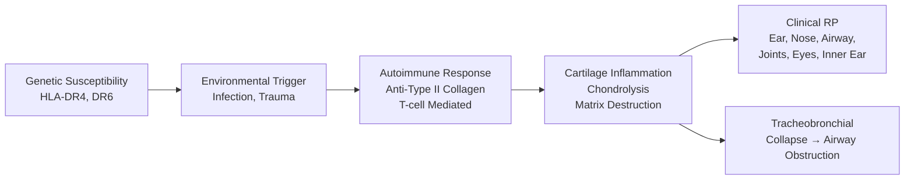
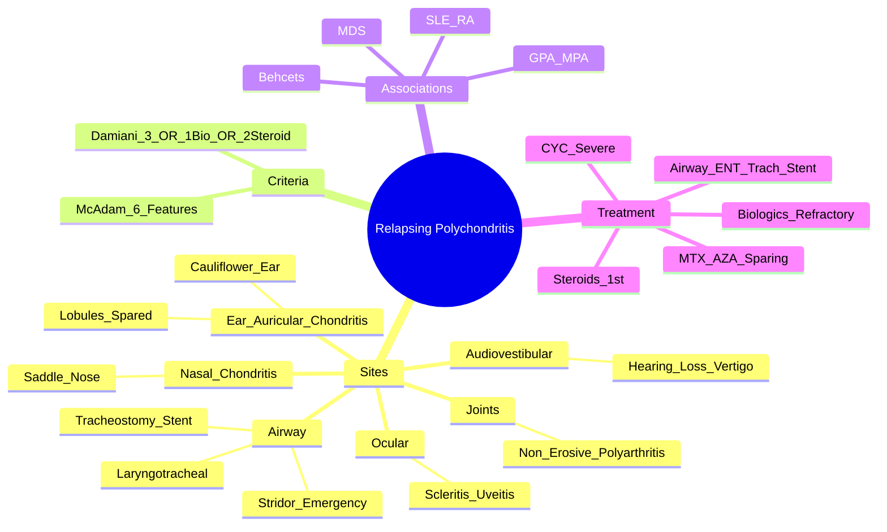

# Relapsing Polychondritis

> [!tip] **FCPS/MRCP Priority: HIGH**
> RP = **recurrent autoimmune inflammation of cartilage** — **ear (sparing lobules), nose (saddle nose), airway (laryngotracheal → stridor/airway emergency), joints, eyes, audiovestibular**. **McAdam/Damiani criteria** for diagnosis. **Airway involvement = emergency**. **Steroids 1st line; MTX/AZA/CYC steroid-sparing; anti-TNF/RTX for refractory; airway stenting/tracheostomy for severe airway disease**.

---

## Learning Objectives
By the end of this note you should be able to:
- [ ] Apply **McAdam/Damiani criteria** for diagnosis (≥3 of 6 clinical features or 1+ histology)
- [ ] Recognise **classic triad**: **auricular chondritis (lobules spared) + nasal chondritis (saddle nose) + respiratory chondritis (airway emergency)**
- [ ] Identify **airway emergency** (stridor, hoarseness, obstruction) — **early ENT referral, tracheostomy/stenting**
- [ ] Differentiate from **GPA (c-ANCA), SLE, RA, infectious chondritis**
- [ ] Select treatment: **steroids 1st line** → steroid-sparing (MTX, AZA, CYC) → **biologics (anti-TNF, RTX)** → **airway stenting/tracheostomy**

---

## 1. Definition & Epidemiology

| Feature | Detail |
|---------|--------|
| **Definition** | **Recurrent autoimmune inflammation of cartilage** — auricular, nasal, laryngotracheobronchial, costal, articular, ocular, audiovestibular |
| **Incidence** | **3-5/1,000,000/year** (very rare) |
| **Peak Onset** | **40-60 years** |
| **Sex Ratio** | **F = M** |
| **Associations** | **Systemic vasculitis** (GPA, MPA, Behçet's), **SLE, RA, Myelodysplastic syndromes (MDS)**, inflammatory bowel disease |
| **Autoantibodies** | Anti-type II collagen (not diagnostic, ~30%); no specific diagnostic antibody |

---

## 2. Aetiology & Pathophysiology



### Key Pathogenic Features
| Feature | Detail |
|---------|--------|
| **Target** | **Type II collagen** (major cartilage component) + **matrilin-1** |
| **Mechanism** | **T-cell mediated** + **anti-collagen antibodies** → complement activation → chondrolysis |
| **Airway** | **Subglottic/tracheal chondritis** → **fibrosis, stenosis, collapse** → life-threatening |
| **Associations** | **GPA (c-ANCA), MPA, Behçet's, SLE, RA, MDS** — screen accordingly |

---

## 3. Clinical Features — **Diagnostic Criteria**

### McAdam Criteria (1976) — **Classic**
**≥3 of 6 clinical features** = Definite RP
1. **Bilateral auricular chondritis** (painful, red, swollen, **sparing earlobes**)
2. **Non-erosive inflammatory polyarthritis** (seronegative)
3. **Nasal chondritis** (saddle nose deformity)
4. **Ocular inflammation** (scleritis, episcleritis, uveitis, keratitis)
5. **Respiratory tract chondritis** (laryngotracheal/bronchial) — **stridor, hoarseness, cough**
6. **Audiovestibular damage** (sensorineural hearing loss, tinnitus, vertigo)

### Damiani Criteria (1976) — **More Sensitive**
| Option | Criteria |
|--------|----------|
| **A** | ≥3 McAdam features |
| **B** | **1 McAdam feature + histological confirmation** (cartilage biopsy: perichondral inflammation, chondrolysis) |
| **C** | **≥2 McAdam features + response to steroids** |

> [!critical] **Histology**
> - **Perichondrial inflammation** with **lymphocytic/plasma cell infiltrate**
> - **Chondrolysis** (loss of cartilage matrix), **basophilic degeneration**
> - **Biopsy site**: auricular or nasal cartilage (if clinically involved)

---

## 4. Clinical Features by Site

### 1. Auricular Chondritis — **Most Common (85-95%)** 🎯
| Feature | Detail |
|---------|--------|
| **Appearance** | **Painful, red, swollen, tender** — **"cauliflower ear" late** |
| **Key Differentiator** | **EARLOBES SPARED** (no cartilage) — **pathognomonic** |
| **Course** | Recurrent attacks → **cartilage destruction** → **floppy ear** |
| **Bilateral** | Usually bilateral (asymmetric) |

### 2. Nasal Chondritis
| Feature | Detail |
|---------|--------|
| **Presentation** | Pain, tenderness, epistaxis, crusting |
| **Late Complication** | **Saddle nose deformity** (cartilage collapse, dorsum depression) |
| **Septal Perforation** | Possible |

### 3. Respiratory Tract Chondritis — **AIRWAY EMERGENCY** 🚨
| Feature | Detail |
|---------|--------|
| **Sites** | **Larynx (subglottic) > Trachea > Bronchi** |
| **Symptoms** | **Hoarseness, dysphonia, cough, stridor, dyspnoea** |
| **Complication** | **Airway stenosis/collapse** — **life-threatening** |
| **PFTs** | **Fixed airflow obstruction** (flow-volume loop truncation) |
| **CT** | **Circumferential mural thickening** of trachea/bronchi |

> [!critical] **Airway Involvement = EMERGENCY**
> - **Stridor, hoarseness, dyspnoea** → **urgent ENT referral**
> - **Fibreoptic laryngoscopy** — avoid rigid if severe
> - **Tracheostomy/stenting** if impending obstruction
> - **High-dose steroids + CYC** for active inflammation

### 4. Ocular Involvement (50-60%)
| Feature | Detail |
|---------|--------|
| **Scleritis/Episcleritis** | Most common |
| **Uveitis** | Anterior > posterior |
| **Keratitis** | Peripheral ulcerative |

### 5. Arthritis (50-70%)
| Feature | Detail |
|---------|--------|
| **Pattern** | **Non-erosive**, **polyarticular**, migratory, seronegative (RF/CCP -ve) |
| **Joints** | MCPs, PIPs, wrists, knees, ankles |

### 6. Audiovestibular (20-40%)
| Feature | Detail |
|---------|--------|
| **Sensorineural Hearing Loss** | High-frequency, often permanent |
| **Tinnitus, Vertigo** | Inner ear cartilage involvement |

---

## 5. Associations — **Screen for These**
| Condition | Frequency | Action |
|-----------|-----------|--------|
| **GPA (c-ANCA)** | 10-20% | **c-ANCA/PR3** if respiratory/renal |
| **MPA (p-ANCA)** | 5-10% | **p-ANCA/MPO** |
| **Behçet's** | <5% | Oral/genital ulcers, uveitis, pathergy |
| **SLE** | 5-10% | ANA, anti-dsDNA, complement |
| **RA** | 5-10% | RF/CCP, erosive arthritis |
| **Myelodysplastic Syndrome (MDS)** | 5-10% | **CBC + blood film** (elderly) |

---

## 6. Diagnosis

```mermaid
flowchart TD
    A[Suspected RP] --> B{McAdam ≥3 Features?}
    B -->|Yes| C[**Definite RP**]
    B -->|No| D{1 Feature + Biopsy?}
    D -->|Yes| E[**Definite RP (Damiani B)**]
    D -->|No| F{2 Features + Steroid Response?}
    F -->|Yes| G[**Probable RP (Damiani C)**]
    F -->|No| H[Consider Alternative Dx]
```

### Investigations
| Test | Finding | Role |
|------|---------|------|
| **ESR/CRP** | Elevated (monitor activity) | Monitor |
| **CT Airway** | **Circumferential mural thickening** (trachea/bronchi) | Airway assessment |
| **PFTs** | Fixed obstruction (flow-volume loop) | Airway function |
| **Laryngoscopy** | Mucosal inflammation, stenosis | Airway visualisation |
| **Audiogram** | Sensorineural HL (high-frequency) | Baseline/follow-up |
| **Biopsy** | Perichondritis, chondrolysis, lymphoplasmacytic infiltrate | Damiani B |
| **c-ANCA/p-ANCA** | Screen for GPA/MPA | Association screen |
| **CBC + Blood Film** | Screen for MDS (elderly) | Association screen |

> [!important] **No Specific Autoantibody**
> - Anti-type II collagen ~30% (not diagnostic)
> - No single diagnostic test — **clinical + radiographic + histological**

---

## 7. Management

```mermaid
flowchart TD
    A[RP Diagnosis] --> B{Severity / Organ Involvement}
    B -->|Mild\n(Auricular, Joint, Ocular)| C[**Prednisolone 0.5-1mg/kg**\n→ taper to lowest effective]
    B -->|Moderate-Severe\n(Airway, Scleritis, Refractory)| D[**Pulse Methylprednisolone\n500-1000mg IV ×3d**\n→ Pred 1mg/kg\n+ **Steroid-Sparing**]
    B -->|Airway Emergency\n(Stridor, Obstruction)| E[**ENT URGENT**\nFibreoptic laryngoscopy\n**Tracheostomy/Stenting**\n**Pulse MP + CYC**]
    C --> F[Steroid-Sparing if >10mg/day\nor Relapse on Taper]
    D --> F
    E --> F
    F --> G[**Steroid-Sparing**:\nMTX 15-25mg/wk (1st)\nAZA 2mg/kg/day\nCYC (severe, airway)\n**Biologics** (Refractory):\nAnti-TNF (Adalimumab/Infliximab)\nRituximab]
```

### Treatment by Severity

| Severity | Treatment |
|----------|-----------|
| **Mild** (auricular, joints, ocular) | **Pred 0.5-1mg/kg** → taper to ≤10mg; **MTX 15-25mg/wk** if steroid-dependent |
| **Moderate-Severe** (scleritis, refractory) | **Pulse MP 500-1000mg ×3d** → Pred 1mg/kg → **Steroid-sparing** |
| **Airway Emergency** | **ENT URGENT** → **Tracheostomy/Stenting** + **Pulse MP + CYC** |
| **Refractory** | **Biologics**: **Anti-TNF** (adalimumab, infliximab), **Rituximab** (anti-CD20) |

### Steroid-Sparing Agents
| Drug | Dose | Indication |
|------|------|------------|
| **Methotrexate** | 15-25mg weekly | **1st line steroid-sparing** |
| **Azathioprine** | 2mg/kg/day | Alternative (TPMT test) |
| **Cyclophosphamide** | IV pulse / oral | **Severe airway, refractory** |
| **Anti-TNF** (Adalimumab, Infliximab) | Standard dosing | Refractory, VEXAS-like (if applicable) |
| **Rituximab** | 1000mg ×2 (2wks apart) | Refractory, anti-synthetase overlap |

---

## 5. Airway Management — **Protocol**

```mermaid
flowchart TD
    A[Stridor / Hoarseness / Dyspnoea] --> B[**URGENT ENT Referral**\nFibreoptic laryngoscopy\n(Avoid rigid if severe)]
    B --> C{Pending Obstruction?}
    C -->|Yes| D[**Tracheostomy** (surgical)\nOR **Stenting** (silicone/metallic)]
    C -->|No| E[**High-dose Steroids**\nPulse MP 500-1000mg ×3d\n→ Pred 1mg/kg\n+ **CYC** (airway)]
    D --> F[**Post-tracheostomy**\nPulse MP + CYC\nWean steroids slowly\nStent if recurrent]
    E --> F
    F --> G[Long-term: MTX/AZA\nRegular PFTs + Laryngoscopy\nStent revision if needed]
```

---

## 6. FCPS/MRCP High-Yield Summary

| Topic | Key Points |
|-------|------------|
| **Classic Triad** | **Auricular chondritis (lobules spared) + Nasal chondritis (saddle nose) + Respiratory chondritis (stridor/airway)** |
| **Auricular Chondritis** | **Painful, red, swollen ears — LOBULES SPARED** (no cartilage) = **pathognomonic** |
| **Nasal Chondritis** | **Saddle nose deformity** (cartilage collapse) |
| **Airway** | **Laryngotracheobronchial chondritis** → **stridor, hoarseness, airway collapse** = **EMERGENCY** |
| **McAdam Criteria** | **≥3 of 6**: auricular, nasal, respiratory, ocular, polyarthritis, audiovestibular |
| **Damiani Criteria** | ≥3 McAdam **OR** 1 feature + **biopsy** **OR** 2 features + **steroid response** |
| **Associations** | **GPA (c-ANCA), MPA (p-ANCA), Behçet's, SLE, RA, MDS** |
| **Airway Management** | **Stridor = ENT emergency** → fibreoptic laryngoscopy → **tracheostomy/stenting + pulse MP + CYC** |
| **Treatment** | **Steroids 1st line** → **MTX/AZA 1st steroid-sparing** → **CYC (severe/airway)** → **Anti-TNF/RTX (refractory)** |
| **Histology** | Perichondritis, lymphoplasmacytic infiltrate, chondrolysis, basophilic degeneration |

---

## 6. Viva Questions (MRCP PACES / FCPS)

| Question | Expected Answer |
|----------|----------------|
| "A 50yo woman has recurrent painful red swollen ears sparing lobes, saddle nose deformity, and new-onset hoarseness. Diagnosis?" | **Relapsing Polychondritis** — classic triad (auricular chondritis sparing lobes, nasal chondritis/saddle nose, respiratory chondritis/laryngitis). |
| "What are the McAdam criteria for RP?" | **≥3 of 6**: 1) Bilateral auricular chondritis (lobules spared), 2) Non-erosive polyarthritis, 3) Nasal chondritis (saddle nose), 4) Ocular inflammation, 5) Respiratory tract chondritis (stridor), 6) Audiovestibular damage. |
| "How does Damiani criteria differ from McAdam?" | Damiani: **≥3 McAdam features OR 1 feature + histology OR 2 features + steroid response** — more sensitive. |
| "What is the pathognomonic feature of auricular chondritis in RP?" | **EARLOBES SPARED** (no cartilage) — red, painful, swollen pinna but earlobes unaffected. |
| "A patient with RP presents with stridor and dyspnoea. Immediate management?" | **ENT EMERGENCY** — **fibreoptic laryngoscopy**, **urgent tracheostomy/stenting** if impending obstruction, **pulse MP 1g ×3d + CYC**. |
| "What are the associations of RP that you must screen for?" | **GPA (c-ANCA), MPA (p-ANCA), Behçet's, SLE, RA, Myelodysplastic Syndrome (MDS)** — especially elderly. |
| "What is the role of cyclophosphamide in RP?" | **Severe disease (airway, scleritis, refractory)** — IV pulse 500-1000mg/m² or oral 2mg/kg; steroid-sparing. |
| "What biologic is used for refractory RP?" | **Anti-TNF** (adalimumab, infliximab) and **Rituximab** (anti-CD20) — case reports/series, no RCT. |
| "What is the most common site of auricular chondritis, and what is spared?" | **Pinna (cartilage)** — **earlobes spared** (no cartilage). |
| "How does RP airway disease differ from GPA subglottic stenosis?" | RP = **cartilage inflammation (chondritis)** causing circumferential tracheal stenosis; GPA = **granulomatous vasculitis** causing subglottic stenosis. Both can coexist. |

---

## 9. Confusions & Mnemonics

| Confusion | Clarification |
|-----------|---------------|
| **RP vs GPA Subglottic Stenosis** | RP = **cartilage inflammation (chondritis)**, circumferential tracheal thickening; GPA = **granulomatous vasculitis**, subglottic. **c-ANCA + in GPA**; negative in RP. |
| **McAdam vs Damiani** | McAdam = **≥3 clinical features**. Damiani = **McAdam ≥3 OR 1 feature + biopsy OR 2 features + steroid response** (more sensitive). |
| **RP vs SLE Ear Involvement** | SLE = **photosensitivity, malar rash** (not chondritis). RP = **true cartilage inflammation**, lobules spared. |
| **Airway Emergency** | **Stridor = ENT emergency** — **fibreoptic laryngoscopy**, **tracheostomy if impending obstruction**. Don't force rigid scope. |
| **Steroid Response in Damiani** | **Rapid response to steroids** (clinically) supports diagnosis if only 2 McAdam features. |

**Mnemonic: McAdam = "A-N-R-O-R-A"**
- **A**uricular chondritis (lobules spared)
- **N**asal chondritis (saddle nose)
- **R**espiratory chondritis (stridor)
- **O**cular inflammation
- **R**heumatoid arthritis (non-erosive)
- **A**udiovestibular damage

**Mnemonic: 6 Features = "A-N-R-O-R-A" → "A NORA"**

**Mnemonic: Damiani = "3 OR 1+BIOPSY OR 2+STEROID"**
- **3** McAdam features
- **1** feature + **Biopsy**
- **2** features + **Steroid response**

**Mnemonic: Ear = "LOBE SPARED"**
- **L**obule
- **O**r
- **B**oth
- **E**ars
- **S**pared (no cartilage)
- **P**athognomonic
- **A**uricular
- **R**ed
- **E**dematous

**Mnemonic: Airway Emergency = "ENT = TRACH + STENT + CYC"**
- **ENT** urgent
- **TRACH**eostomy
- **STENT**ing
- **CYC**lophosphamide + Pulse MP

**Mnemonic: Associations = "G-B-S-R-M"**
- **G**PA (c-ANCA)
- **B**ehçet's
- **S**LE
- **R**A
- **M**DS

---

## 10. Mind Map



---

## 11. One-Page Revision Card

| Domain | Key Points |
|--------|------------|
| **Classic Triad** | Auricular chondritis (**lobules spared**) + Nasal chondritis (saddle nose) + Respiratory chondritis (stridor/airway emergency) |
| **McAdam Criteria** | **≥3 of 6**: Auricular (lobules spared), Nasal (saddle nose), Respiratory (stridor), Ocular, Non-erosive polyarthritis, Audiovestibular |
| **Damiani** | **≥3 McAdam OR 1 feature + biopsy OR 2 features + steroid response** |
| **Auricular Chondritis** | **Painful, red, swollen ears — LOBULES SPARED** (pathognomonic) |
| **Airway** | **Laryngotracheobronchial chondritis** → stridor, hoarseness, **airway emergency** |
| **Associations** | **GPA (c-ANCA), MPA (p-ANCA), Behçet's, SLE, RA, MDS** |
| **Treatment** | Steroids 1st → **MTX 1st steroid-sparing** → **CYC (severe/airway)** → **Biologics (anti-TNF, RTX)** |
| **Airway Emergency** | **ENT urgent → fibreoptic laryngoscopy → tracheostomy/stenting + Pulse MP + CYC** |
| **Biopsy** | Perichondritis, lymphoplasmacytic infiltrate, chondrolysis (Damiani B) |

---

## 12. Spaced Repetition Trackers

| Review Interval | Date Completed | Confidence (1-5) | Notes |
|-----------------|----------------|------------------|-------|
| 24 hours | | | |
| 7 days | | | |
| 15 days | | | |
| 30 days | | | |
| 90 days | | | |

---

## 13. Self-Test Scorecard

| Section | Score /5 | Last Attempt |
|---------|----------|--------------|
| McAdam/Damiani Criteria | | |
| Auricular Chondritis Recognition | | |
| Airway Emergency Management | | |
| Associations Screening | | |
| Treatment Ladder | | |
| Viva Questions | | |

---

## Local Navigation
- **Parent Heading**: [[../Autoimmune Rheumatic Diseases|Autoimmune Rheumatic Diseases]]
- **Parent Topic Group**: [[Connective tissue diseases]]
- **Chapter Map**: [[../Davidson Chapter 26 - Rheumatology Hierarchy|Rheumatology Hierarchy]]
- **Chapter MOC**: [[../Rheumatology MOC|Rheumatology MOC]]
- **Drug Reference**: [[../../Clinical Approach to Musculoskeletal Disease/Drugs in rheumatology|Drugs in rheumatology]]
- **Related**: [[Granulomatosis with polyangiitis (GPA)]] · [[Drugs in rheumatology]]