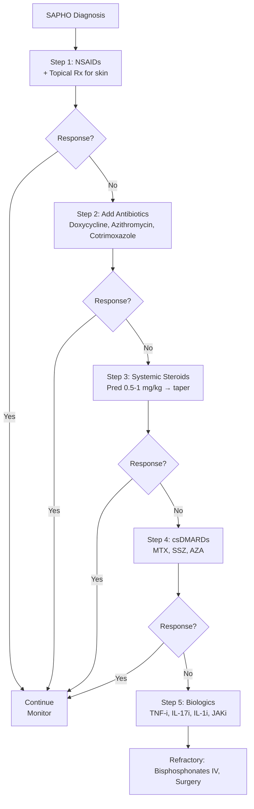
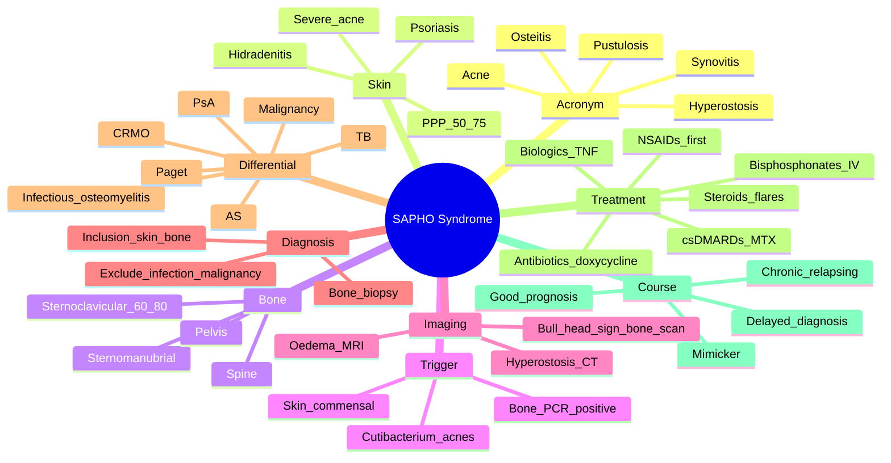

# SAPHO Syndrome

> [!tip] **FCPS/MRCP Priority: MEDIUM**
> SAPHO = **Synovitis, Acne, Pustulosis, Hyperostosis, Osteitis** — a **rare but recognised** chronic inflammatory disorder of **bone + joints + skin**. Must know: **chronic recurrent multifocal osteomyelitis (CRMO) in adults** + **sternoclavicular + sternomanubrial + spine involvement** + **palmoplantar pustulosis** + **propionibacterium acnes (Cutibacterium)** trigger + **steroids first-line** + **TNF inhibitors for refractory** + **differentiate from infection, malignancy, Paget's**.

---

## Learning Objectives
By the end of this note you should be able to:
- [ ] Define SAPHO and its component disorders
- [ ] Recognise the classic **sternoclavicular / sternomanubrial / chest wall** involvement
- [ ] Identify the **skin associations**: palmoplantar pustulosis, severe acne, psoriasis
- [ ] Differentiate SAPHO from **infection (osteomyelitis, TB), malignancy (metastases), Paget's, AS, SpA**
- [ ] Apply **imaging** (X-ray, CT, MRI, bone scan) — characteristic features
- [ ] Manage with **NSAIDs, antibiotics, steroids, TNF inhibitors, bisphosphonates**
- [ ] Counsel on the **chronic relapsing course** and good prognosis

---

## 1. Definition & Spectrum
### Acronym
| Letter | Component | Examples |
|--------|-----------|----------|
| **S** | **Synovitis** | Ster noclavicular, sternomanubrial, peripheral arthritis |
| **A** | **Acne** | Severe acne (conglobata, fulminans, hidradenitis suppurativa) |
| **P** | **Pustulosis** | **Palmoplantar pustulosis** (PPP) — most common skin finding |
| **H** | **Hyperostosis** | Ster noclavicular, spine, pelvis — bony proliferation |
| **O** | **Osteitis** | Ster noclavicular osteitis, vertebral, iliac |

### Spectrum of Disease
| Disorder | Notes |
|----------|-------|
| **SAPHO** (full) | All components |
| **CRMO** (chronic recurrent multifocal osteomyelitis) | Predominantly children/adolescents; sterile osteomyelitis of long bones, clavicle, spine |
| **CNO** (chronic non-bacterial osteomyelitis) | Broader term including CRMO |
| **Pustulotic arthro-osteitis** (Sonozaki syndrome) | Japanese variant; PPP + sternoclavicular |
| **Acne-associated SAPHO** | Severe acne (conglobata, fulminans) + osteoarticular |

> [!note] **SAPHO ≠ Infection**
> Despite the **inflammation of bone (osteitis)**, SAPHO is **sterile** — bone biopsies are **culture-negative** (in most cases). Don't treat with prolonged antibiotics unless co-infection confirmed.

---

## 2. Epidemiology
| Feature | Detail |
|---------|--------|
| **Prevalence** | **Rare** (<1/10,000); increasingly recognised |
| **Age** | **Bimodal**: children (CRMO) + **adults 30-50y** |
| **Sex** | F > M (slight); variable |
| **Geography** | Worldwide; **Japanese and Caucasian** reported |
| **Trigger** | **Cutibacterium acnes** (formerly Propionibacterium) — low-virulence skin organism |

---

## 3. Pathophysiology
```mermaid
flowchart TD
    A[Genetic Susceptibility\nHLA-B27 (30% in SpA-like), PSTPIP2] --> B[Trigger\nCutibacterium acnes\nDysbiosis]
    B --> C[Innate Immune Activation\nIL-1β, IL-23/17, TNF-α]
    C --> D[Skin Manifestations\nPPP, Severe Acne, Psoriasis]
    C --> E[Bone Inflammation\nOsteitis, Hyperostosis]
    E --> F[Sites: Sternoclavicular, Spine, Pelvis, Long Bones]
    C --> G[Synovitis\nSternoclavicular, Peripheral]
    D & E & G --> H[SAPHO Syndrome\nClinical Manifestations]
```

### Key Concepts
| Concept | Detail |
|---------|--------|
| **Cutibacterium acnes** | Low-virulence skin commensal; detected in bone biopsies (PCR+) despite sterile culture |
| **IL-1 / IL-23 / IL-17 axis** | Similar to SpA; target of biologics |
| **Bone lesions** | Sterile osteitis → hyperostosis → sclerosis |
| **Chronic relapsing** | Flares over years; rarely progressive systemic disease |

---

## 4. Clinical Features
### Bone / Joint
| Site | Features |
|------|----------|
| **Sternoclavicular** | **MOST COMMON (60-80%)**; pain, swelling, restricted shoulder movement |
| **Sternomanubrial** | Chest pain, swelling over upper sternum |
| **Spine** | Vertebral body (similar to Andersson lesions in AS), facet joints, spondylodiscitis |
| **Pelvis** | Iliac, sacroiliac (unilateral or bilateral) |
| **Mandible** | Rare (more in CRMO) |
| **Long bones** | Femur, tibia, humerus (CRMO more than adult SAPHO) |
| **Peripheral joints** | Knees, hips, shoulders, ankles |

### Skin
| Disorder | Frequency |
|----------|-----------|
| **Palmoplantar pustulosis (PPP)** | **50-75%** (most common) — sterile pustules on palms/soles |
| **Psoriasis vulgaris** | 20-30% |
| **Severe acne** (conglobata, fulminans, hidrosadenitis) | 10-20% |
| **Other** | Hidradenitis suppurativa, dissecting cellulitis |

> [!important] **Skin May Precede or Follow Bone**
> Skin lesions can appear **months to years before** bone disease (or vice versa). **Both may flare together**.

### Other Features
- **Chest wall pain** (mimics MI, MSK chest pain, costochondritis)
- **Spinal pain** (mimics discitis, malignancy)
- **Sacroiliac pain** (mimics AS)
- **Fever** (low-grade during flares)
- **Fatigue**
- **No visceral involvement** (unlike RA, SLE)

---

## 5. Diagnosis — Criteria
### Proposed Diagnostic Criteria (Kahn, 2003; updated)
**Inclusion (any of):**
- **Bone + joint** features (≥1 of: osteitis, hyperostosis, synovitis, enthesitis, spondylodiscitis)
- **Skin** features (≥1 of: PPP, severe acne, psoriasis, HS)

**Exclusion:**
- Infectious osteomyelitis (unless coexistent)
- Malignancy
- Other rheumatic disease (if fully explained)
- SAPHO diagnosis = inclusion + exclusion

### Imaging
| Modality | Findings |
|----------|----------|
| **X-ray** | **Hyperostosis** (bone proliferation), sclerosis, erosions, ankylosis; **"bull's head"** sign on sternoclavicular (CT/scintigraphy) |
| **CT** | Best for **bone detail**; hyperostosis, sclerosis, erosions, soft tissue mass |
| **MRI** | **Active lesions** (bone marrow oedema, soft tissue inflammation); monitor treatment response |
| **Bone scan / Scintigraphy** | **"Bull's head" sign** — **sternoclavicular + manubrium + 1st rib** uptake (pathognomonic) |
| **18F-FDG PET** | Active disease extent; can monitor response |

> [!important] **"Bull's Head" Sign**
> Bone scan (scintigraphy) shows characteristic **bilateral sternoclavicular + manubrial + 1st costal cartilage uptake** in a **bull-horn pattern** — **pathognomonic for SAPHO**.

### Differential Diagnosis
| Condition | Distinguishing |
|-----------|---------------|
| **Infectious osteomyelitis** | Culture +ve, systemic sepsis, no skin association |
| **TB** | Chest, biopsy AFB +ve, IGRA +ve |
| **Paget's disease** | Older, ALP ↑, no skin, mosaic pattern |
| **Ankylosing spondylitis** | Younger M, axial > chest wall, no PPP |
| **Psoriatic arthritis** | Joint + skin psoriasis, no sternoclavicular hyperostosis |
| **Reactive arthritis** | Post-infectious, asymmetric oligoarthritis, mucocutaneous |
| **Bone metastases / lymphoma** | Older, weight loss, biopsy malignant |
| **Erdheim-Chester** | Rare, "coated aorta", CD68+, BRAF V600E |
| **Chronic non-bacterial osteomyelitis (CNO)** | Children, multifocal, sterile |

---

## 6. Investigations
### Baseline
| Test | Purpose |
|------|---------|
| **FBC, ESR, CRP** | Inflammation (often mild) |
| **Blood culture** | Exclude infectious osteomyelitis |
| **IGRA / Quantiferon** | Exclude TB |
| **ANA, RF, anti-CCP** | Exclude autoimmune |
| **HLA-B27** | 30% positive (SpA-like subset) |
| **LFT, U&E, Ca, PO4, ALP, vitamin D** | Exclude metabolic bone disease |
| **ACE** | Exclude sarcoidosis |

### Specific
| Test | Purpose |
|------|---------|
| **Skin biopsy** (PPP, severe acne) | Confirm skin diagnosis |
| **Bone biopsy** | Exclude malignancy/infection; **PCR for Cutibacterium acnes** |
| **Blood cultures** (if febrile) | Exclude subacute osteomyelitis |
| **HIV, syphilis serology** | If clinical concern |

---

## 7. Management
### Stepwise Approach


### Step 1 — Symptomatic
| Therapy | Notes |
|---------|-------|
| **NSAIDs** | First-line; high dose; **active in 60-70%** initially |
| **Topical steroids** for PPP | For skin |
| **Topical vitamin D analogues** (calcipotriol) | For PPP |
| **Topical retinoids** | For acne |

### Step 2 — Antibiotics (Controversial but used)
| Drug | Duration | Notes |
|------|----------|-------|
| **Doxycycline 100 mg BD** | 3-6 months | Most evidence; anti-inflammatory + antibacterial |
| **Azithromycin 500 mg ×3/week** | 3-6 months | Alternative |
| **Cotrimoxazole** | 3-6 months | Some case series |
| **Rifampin + others** | Variable | For refractory |

> [!note] **Antibiotics: Mechanism Unclear**
> Antibiotics may work via **anti-inflammatory** or by **eradicating Cutibacterium acnes** in bone. Culture is usually negative; PCR often positive. Clinical response is variable.

### Step 3 — Systemic Therapy
| Therapy | Notes |
|---------|-------|
| **Prednisolone 0.5-1 mg/kg** | For flares; short-term, taper |
| **MTX 15-25 mg weekly** | csDMARD; steroid-sparing |
| **Sulfasalazine 2-3 g/day** | Some evidence, especially with SpA features |
| **AZA 2 mg/kg/day** | Alternative csDMARD |
| **Apremilast** (PDE4 inhibitor) | For skin + joint; some case series |

### Step 4 — Biologics (Refractory)
| Class | Drug | Notes |
|-------|------|-------|
| **Anti-TNF** | **Adalimumab 40 mg SC q2w** OR **Infliximab 5 mg/kg** | **Best evidence**; effective for bone + skin |
| **Anti-IL-17** | Secukinumab, ixekizumab | Effective; off-label |
| **Anti-IL-1** | Anakinra, canakinumab | Case reports; CRMO |
| **Anti-IL-12/23** | Ustekinumab | Case reports |
| **JAK inhibitor** | Tofacitinib | Emerging |

### Step 5 — Other
| Therapy | Notes |
|---------|-------|
| **Bisphosphonates IV (Zoledronate 5 mg)** | Anti-inflammatory; **effective in CRMO and SAPHO**; reduces bone pain, osteitis |
| **Surgery** | Reserved for severe hyperostosis with nerve/vessel compression; **risk of infection** |
| **TNFi + bisphosphonate** | Combination in severe/refractory |

### Skin Treatment
- **PPP**: Topical steroids, calcipotriol, PUVA; **apremilast**; **TNFi**
- **Severe acne**: Isotretinoin (caution — can worsen bone pain); **TNFi**
- **Hidradenitis suppurativa**: Adalimumab (FDA-approved)

---

## 8. Special Situations
### Pregnancy
- **Disease may improve during pregnancy** (as with AS)
- **Continue**: NSAIDs (1st/2nd tri), sulfasalazine, paracetamol
- **Avoid**: MTX, retinoids, cyclophosphamide
- **Biologics**: Limited data; **certolizumab** preferred if needed
- **Multidisciplinary** (rheumatology, dermatology, obstetric medicine)

### Children (CRMO)
- **CNO/CRMO** = paediatric version
- **Multifocal** clavicle, metaphyses of long bones, spine
- **TNF inhibitors** for refractory
- **Bisphosphonates** (pamidronate) for severe

### Refractory Disease
- **Switch biologics** (TNF → IL-17 → IL-1)
- **IV bisphosphonates** (zoledronate, pamidronate)
- **Combination biologics** (TNF + bisphosphonate)
- **Re-biopsy** to exclude evolving pathology

---

## 9. Prognosis
| Factor | Outcome |
|--------|---------|
| **Overall** | **Good**; chronic relapsing course; normal life expectancy |
| **Disability** | Mild-moderate during flares; long-term function preserved |
| **Skin-bone correlation** | Often parallel (but not always) |
| **Major complications** | **Pathological fracture** (spine, long bone), **venous thrombosis** (clavicular compression), **chronic pain** |
| **Malignancy risk** | Not directly increased (unlike AS or PsA) |
| **Response to TNF** | Generally good; **60-80%** improvement in skin + bone |
| **Time to diagnosis** | Often **delayed** (years) — misdiagnosed as infection, malignancy |

---

## 10. FCPS/MRCP High-Yield Summary
| Topic | Key Points |
|-------|------------|
| **Acronym** | **S**ynovitis, **A**cne, **P**ustulosis, **H**yperostosis, **O**steitis |
| **Skin** | **PPP (50-75%, most common)**, severe acne, psoriasis |
| **Bone** | **Sternoclavicular (60-80%, MOST COMMON)**, spine, pelvis |
| **Trigger** | **Cutibacterium acnes** (skin commensal); sterile osteitis |
| **Imaging** | **"Bull's head" sign on bone scan** (pathognomonic); hyperostosis on CT |
| **Diagnosis** | Bone + skin features; **exclusion of infection + malignancy** |
| **Biopsy** | Sterile (culture neg); **PCR+ for C. acnes** |
| **Differential** | Infectious osteomyelitis, TB, AS, PsA, Paget's, malignancy |
| **NSAIDs** | First-line (60-70% respond) |
| **Antibiotics** | Doxycycline, azithromycin, cotrimoxazole (3-6 months); controversial |
| **Steroids** | Flares; short-term |
| **csDMARDs** | MTX, SSZ, AZA |
| **Biologics** | **TNF-i (best evidence)**; IL-17, IL-1, IL-23, JAK |
| **Bisphosphonates IV** | Zoledronate; effective in refractory |
| **Surgery** | Last resort; nerve/vessel compression |
| **Prognosis** | Good; chronic relapsing; normal life expectancy |
| **Time to diagnosis** | Often delayed (years) — "great mimicker" |

---

## 11. Viva Questions (MRCP PACES / FCPS)
| Question | Expected Answer |
|----------|-----------------|
| "What does SAPHO stand for?" | **S**ynovitis, **A**cne, **P**ustulosis, **H**yperostosis, **O**steitis. |
| "Most common bone involvement?" | **Sternoclavicular joint** (60-80%); also sternomanubrial, spine, pelvis. |
| "Most common skin finding?" | **Palmoplantar pustulosis (PPP)** (50-75%); then severe acne, psoriasis. |
| "What is the 'bull's head' sign?" | **Bone scan (scintigraphy)** showing bilateral **sternoclavicular + manubrial + 1st costal cartilage** uptake in a bull-horn pattern — **pathognomonic for SAPHO**. |
| "Trigger organism?" | **Cutibacterium acnes** (formerly Propionibacterium acnes) — low-virulence skin commensal. Bone biopsy culture usually negative but **PCR often positive**. |
| "Differentiate SAPHO from infectious osteomyelitis?" | SAPHO: **sterile cultures**, skin association, chronic relapsing, doesn't respond to standard antibiotics. Infection: culture +ve, sepsis, progressive. **Bone biopsy** distinguishes. |
| "Differentiate from Paget's disease?" | Paget's: older (>50y), **↑ALP**, mosaic pattern, no skin disease, no sternoclavicular. SAPHO: younger, normal ALP, skin + bone inflammation. |
| "First-line treatment?" | **NSAIDs** (60-70% respond). Then **antibiotics** (doxycycline 3-6 months), then **steroids**, then **csDMARDs**, then **biologics** (TNF-i). |
| "Best biological therapy?" | **TNF inhibitors** (adalimumab, infliximab) — best evidence for skin + bone. |
| "Role of bisphosphonates?" | **IV zoledronate** is effective in refractory SAPHO and CRMO — anti-inflammatory + bone effect. |

---

## 12. Confusions & Mnemonics
| Confusion | Clarification |
|-----------|---------------|
| **SAPHO vs infection** | **Sterile** cultures, PCR+ for C. acnes, no sepsis, chronic course |
| **SAPHO vs AS** | AS = young M, axial, no skin. SAPHO = sternoclavicular, skin, no axial preference |
| **SAPHO vs Paget's** | Paget's = older, ↑ALP, mosaic, no skin. SAPHO = younger, normal ALP, skin |
| **Skin-bone timing** | Can precede or follow by years; not always parallel |
| **Antibiotics mechanism** | Anti-inflammatory + eradicate C. acnes (PCR+ even when culture neg) |
| **Surgery** | Last resort (infection risk); only for severe compression |
| **Acne retinoids** | **Isotretinoin** can paradoxically worsen bone pain — caution |

**Mnemonic: SAPHO = "SHARP Skin-Bone"**
- **S**ynovitis
- **A**cne
- **P**ustulosis (PPP)
- **H**yperostosis
- **O**steitis

**Mnemonic: Sternoclavicular "SCAR-S"**
- **S**ternoclavicular (60-80%)
- **C**lavicle (1st rib)
- **A**nterior chest wall
- **R**ibs
- **S**ternomanubrial

**Mnemonic: Bull's Head = "T-Bone on Bone Scan"**
- **T**-shape / **bull horns** at sternoclavicular + manubrium + 1st ribs
- **B**one scan pathognomonic

**Mnemonic: Treatment pyramid "NSAIDs → Antibiotics → Steroids → csDMARDs → Biologics → Bisphosphonates"**
- **N**SAIDs first
- **A**ntibiotics (doxycycline)
- **S**teroids (short)
- **c**sDMARDs (MTX, SSZ)
- **B**iologics (TNF, IL-17, IL-1)
- **B**isphosphonates IV (refractory)

**Mnemonic: Cutibacterium acnes = "Skin-Bone"**
- **Skin commensal** (sebum, hair follicles)
- **Bone PCR+** (even when culture neg)
- **Trigger** for sterile osteitis

---

## 13. Mind Map


---

## 14. One-Page Revision Card
| Domain | Key Points |
|--------|------------|
| **Acronym** | **S**ynovitis, **A**cne, **P**ustulosis, **H**yperostosis, **O**steitis |
| **Skin** | **PPP (50-75%, most common)**, severe acne, psoriasis |
| **Bone** | **Sternoclavicular (60-80%, most common)**, sternomanubrial, spine, pelvis |
| **Trigger** | **Cutibacterium acnes** (skin commensal); sterile osteitis |
| **"Bull's head" sign** | **Bone scan** — pathognomonic; bilateral sternoclavicular + manubrial + 1st rib uptake |
| **Diagnosis** | Bone + skin features; **exclusion of infection + malignancy** |
| **Biopsy** | Sterile (culture neg); **PCR+ for C. acnes** |
| **Differential** | Infectious osteomyelitis, TB, AS, PsA, Paget's, malignancy, CRMO |
| **NSAIDs** | First-line (60-70% respond) |
| **Antibiotics** | Doxycycline 100 BD × 3-6 months; azithro; cotrimoxazole |
| **Steroids** | Short-term for flares |
| **csDMARDs** | MTX, SSZ, AZA |
| **Biologics** | **TNF-i (best evidence)**; IL-17, IL-1, JAK |
| **Bisphosphonates IV** | Zoledronate; effective refractory |
| **Surgery** | Last resort (nerve/vessel compression) |
| **Prognosis** | **Good**; chronic relapsing; normal life |

---

## 15. Spaced Repetition Trackers
| Review Interval | Date Completed | Confidence (1-5) | Notes |
|-----------------|----------------|------------------|-------|
| 24 hours | | | |
| 7 days | | | |
| 15 days | | | |
| 30 days | | | |

---

## 16. Self-Test Scorecard
| Section | Score /5 | Last Attempt |
|---------|----------|--------------|
| SAPHO acronym | | |
| Sternoclavicular involvement | | |
| PPP as most common skin | | |
| "Bull's head" sign | | |
| Cutibacterium acnes role | | |
| Differential (infection, AS, Paget's) | | |
| Treatment pyramid | | |
| TNF inhibitors | | |
| Bisphosphonates role | | |
| Prognosis | | |
| Viva Questions | | |

---

## Local Navigation
- **Parent Heading**: [[../Autoimmune Rheumatic Diseases|Autoimmune Rheumatic Diseases]]
- **Parent Topic Group**: [[Other musculoskeletal syndromes]]
- **Sibling Topics**: [[Ankylosing spondylitis]] · [[Psoriatic arthritis]] · [[Reactive arthritis]] · [[Polymyalgia rheumatica]] · [[Paget's disease of bone]]
- **Chapter Map**: [[../Davidson Chapter 26 - Rheumatology Hierarchy|Rheumatology Hierarchy]]
- **Chapter MOC**: [[../Rheumatology MOC|Rheumatology MOC]]
- **Related**: [[Drugs in rheumatology]] · [[Investigations in rheumatology]]
---

> Auto-generated study sections for "Autoimmune Rheumatic Diseases" — Ch 25: Rheumatology & Bone Disease.

## Flashcards (27 generated)

- Q: What is the definition of Autoimmune Rheumatic Diseases?
  A: SAPHO = Synovitis, Acne, Pustulosis, Hyperostosis, Osteitis — a rare but recognised chronic inflammatory disorder of bone + joints + skin.
- Q: What is the epidemiology of Autoimmune Rheumatic Diseases?
  A: Rare (<1/10,000); increasingly recognised
- Q: What is Age of Autoimmune Rheumatic Diseases?
  A: Bimodal: children (CRMO) + adults 30-50y
- Q: What is Sex of Autoimmune Rheumatic Diseases?
  A: F > M (slight); variable
- Q: What is Geography of Autoimmune Rheumatic Diseases?
  A: Worldwide; Japanese and Caucasian reported
- Q: What is Trigger of Autoimmune Rheumatic Diseases?
  A: Cutibacterium acnes (formerly Propionibacterium) — low-virulence skin organism
- Q: What is Cutibacterium acnes of Autoimmune Rheumatic Diseases?
  A: Low-virulence skin commensal; detected in bone biopsies (PCR+) despite sterile culture
- Q: What is IL-1 / IL-23 / IL-17 axis of Autoimmune Rheumatic Diseases?
  A: Similar to SpA; target of biologics
- Q: What is Bone lesions of Autoimmune Rheumatic Diseases?
  A: Sterile osteitis → hyperostosis → sclerosis
- Q: What is Chronic relapsing of Autoimmune Rheumatic Diseases?
  A: Flares over years; rarely progressive systemic disease
- Q: What is Skin biopsy (PPP, severe acne) of Autoimmune Rheumatic Diseases?
  A: Confirm skin diagnosis
- Q: What is Bone biopsy of Autoimmune Rheumatic Diseases?
  A: Exclude malignancy/infection; PCR for Cutibacterium acnes
- Q: What is Blood cultures (if febrile) of Autoimmune Rheumatic Diseases?
  A: Exclude subacute osteomyelitis
- Q: What is HIV, syphilis serology of Autoimmune Rheumatic Diseases?
  A: If clinical concern
- Q: What is the epidemiology of Autoimmune Rheumatic Diseases?
  A: Rare (<1/10,000); increasingly recognised
- Q: What is Age of Autoimmune Rheumatic Diseases?
  A: Bimodal: children (CRMO) + adults 30-50y
- Q: What is Sex of Autoimmune Rheumatic Diseases?
  A: F > M (slight); variable
- Q: What is Geography of Autoimmune Rheumatic Diseases?
  A: Worldwide; Japanese and Caucasian reported
- Q: What is Trigger of Autoimmune Rheumatic Diseases?
  A: Cutibacterium acnes (formerly Propionibacterium) — low-virulence skin organism
- Q: What is Cutibacterium acnes of Autoimmune Rheumatic Diseases?
  A: Low-virulence skin commensal; detected in bone biopsies (PCR+) despite sterile culture
- Q: What is IL-1 / IL-23 / IL-17 axis of Autoimmune Rheumatic Diseases?
  A: Similar to SpA; target of biologics
- Q: What is Bone lesions of Autoimmune Rheumatic Diseases?
  A: Sterile osteitis → hyperostosis → sclerosis
- Q: What is Chronic relapsing of Autoimmune Rheumatic Diseases?
  A: Flares over years; rarely progressive systemic disease
- Q: What is Skin biopsy (PPP, severe acne) of Autoimmune Rheumatic Diseases?
  A: Confirm skin diagnosis
- Q: What is Bone biopsy of Autoimmune Rheumatic Diseases?
  A: Exclude malignancy/infection; PCR for Cutibacterium acnes
- Q: What is Blood cultures (if febrile) of Autoimmune Rheumatic Diseases?
  A: Exclude subacute osteomyelitis
- Q: What is HIV, syphilis serology of Autoimmune Rheumatic Diseases?
  A: If clinical concern

## MCQs (1 generated)

1. **Which of the following best describes Autoimmune Rheumatic Diseases?**
   A. **SAPHO = Synovitis, Acne, Pustulosis, Hyperostosis, Osteitis — a rare but recognised chronic inflammatory disorder of bone + joints + skin.**
   B. An unrelated condition not matching the clinical picture of Autoimmune Rheumatic Diseases
   C. A complication seen late in the disease course of Autoimmune Rheumatic Diseases
   D. A condition that mimics Autoimmune Rheumatic Diseases but has a different underlying cause

## SBA Questions (1 generated)

1. A patient with suspected Autoimmune Rheumatic Diseases presents with: SAPHO (full) — All components; CRMO (chronic recurrent multifocal osteomyelitis) — Predominantly children/adolescents; sterile osteomyelitis of long bones, clavicle, spine; CNO (chronic non-bacterial osteomyelitis) — Broader term including CRMO. What is the most likely diagnosis?
   A. **Autoimmune Rheumatic Diseases**
   B. A condition that mimics Autoimmune Rheumatic Diseases but is not the same entity
   C. A complication of Autoimmune Rheumatic Diseases rather than the primary diagnosis
   D. An unrelated condition in the same clinical category as Autoimmune Rheumatic Diseases

