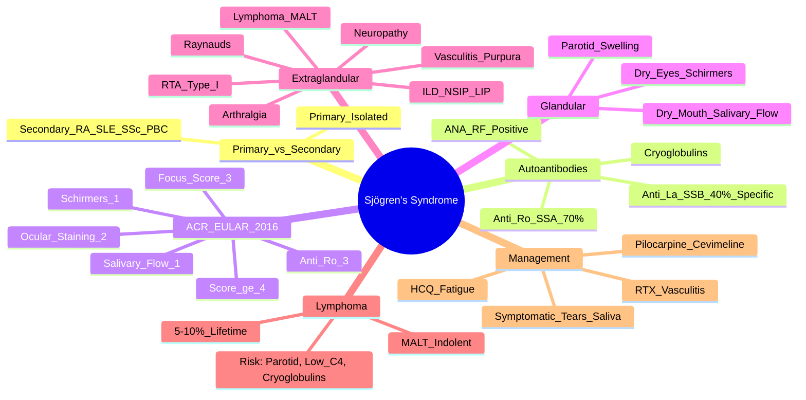

# Sjögren's Syndrome

> [!tip] **FCPS/MRCP Priority: HIGH**
> Sjögren's = **sicca syndrome** (dry eyes + dry mouth) + **systemic extraglandular features**. **Anti-Ro/SSA 70%, Anti-La/SSB 40% (highly specific)**. **Lymphoma risk 5-10% (MALT)** — risk factors: persistent parotid swelling, low C4, cryoglobulins. **ACR/EULAR 2016 weighted criteria (score ≥4)**.

---

## Learning Objectives
By the end of this note you should be able to:
- [ ] Apply ACR/EULAR 2016 weighted classification criteria (score ≥4)
- [ ] Interpret autoantibodies: Anti-Ro/SSA (70%), Anti-La/SSB (40%, highly specific), ANA+, RF+
- [ ] Evaluate sicca objectively: Schirmer's test (≤5mm/5min), unstimulated salivary flow (≤0.1ml/min), ocular staining score (≥5), focus score (≥1 on biopsy)
- [ ] Recognise extraglandular manifestations: arthralgia, Raynaud's, vasculitis, ILD, neuropathy, **RTA type I**, lymphoma
- [ ] Assess lymphoma risk (5-10% lifetime, MALT) — red flags: persistent parotid swelling, palpable purpura, low C4, cryoglobulins, monoclonal gammopathy
- [ ] Manage: symptomatic (tears/saliva substitutes, pilocarpine/cevimeline), HCQ for fatigue/arthralgia, immunosuppression for severe organ involvement

---

## 1. Definition & Epidemiology

| Feature | Detail |
|---------|--------|
| **Definition** | Chronic autoimmune **exocrinopathy** → **keratoconjunctivitis sicca** (dry eyes) + **xerostomia** (dry mouth) ± **systemic extraglandular involvement** |
| **Primary vs Secondary** | **Primary**: isolated; **Secondary**: associated with RA, SLE, SSc, PBC, etc. |
| **Incidence** | 3-5/100,000/year |
| **Prevalence** | 0.1-0.6% |
| **Peak Onset** | **4th-6th decade** |
| **Sex Ratio** | **F:M = 9:1** |
| **Genetics** | HLA-DR3, IRF5, STAT4 |

---

## 2. Aetiology & Pathophysiology

```mermaid
flowchart LR
    A[Genetic Susceptibility\nHLA-DR3, IRF5, STAT4] --> B[Environmental Trigger\nViral (EBV, HCV),\nHormonal]
    B --> C[Epithelial Cell Activation\nType I IFN Signature]
    C --> D[Lymphocytic Infiltration\nCD4+ T-cells, B-cells\nSalivary/Lacrimal Glands]
    D --> E[Glandular Destruction\nApoptosis, Fibrosis]
    E --> F[Autoantibody Production\nAnti-Ro/SSA, Anti-La/SSB]
    F --> G[Extraglandular Manifestations\nImmune Complexes, Lymphoma Risk]
```

### Key Pathogenic Features
| Feature | Detail |
|---------|--------|
| **Lymphocytic infiltration** | Focal lymphocytic sialadenitis (focus score ≥1 = diagnostic) |
| **Type I IFN signature** | Drives autoimmunity — similar to SLE |
| **Anti-Ro/SSA** | Targets Ro60/Ro52 — **associates with photosensitivity, neonatal lupus** |
| **Anti-La/SSB** | Almost always with Ro — **highly specific** |
| **Germinal centre formation** | In salivary glands — **lymphoma precursor** |

---

## 3. Clinical Features

### Glandular (Sicca Syndrome)
| Feature | Description |
|---------|-------------|
| **Dry Eyes (Keratoconjunctivitis Sicca)** | Gritty, burning, foreign body sensation, **blurred vision**, photophobia, corneal ulceration (severe) |
| **Dry Mouth (Xerostomia)** | Difficulty swallowing dry food, **dysphagia**, **dental caries** (rampant), **oral candidiasis**, altered taste, difficulty speaking |
| **Parotid Enlargement** | **Bilateral, painless, persistent** — **lymphoma risk if persistent/unilateral** |
| **Other Glands** | Dry nose (epistaxis), dry throat (cough), dry skin, vaginal dryness (dyspareunia) |

### Extraglandular (Systemic) — **High-Yield**
| System | Manifestation | FCPS/MRCP Pearl |
|--------|---------------|-----------------|
| **Musculoskeletal** | Arthralgia (non-erosive), **arthritis** (mild, non-deforming), myalgia | Overlap with RA/SLE |
| **Cutaneous** | **Vasculitis** (palpable purpura, livedo), annular erythema, Raynaud's | Palpable purpura = cryoglobulins |
| **Pulmonary** | **ILD** (NSIP > LIP), bronchiolitis, tracheobronchial sicca | LIP = lymphocytic interstitial pneumonitis |
| **Neurological** | **Peripheral neuropathy** (sensory, axonal), **cranial neuropathy**, CNS (rare) | |
| **Renal** | **Distal RTA (Type I)** — hypokalaemia, nephrocalcinosis, metabolic acidosis | **Classic Sjögren's renal** |
| **Haematological** | **Cryoglobulinaemia** (type II), hypergammaglobulinaemia, leukopenia | Cryoglobulins = lymphoma risk |
| **Malignancy** | **Lymphoma (MALT) 5-10% lifetime** — **40x increased risk** | Red flags: parotid swelling, low C4, cryoglobulins |

> [!critical] **Renal Tubular Acidosis Type I (Distal)**
> - **Classic Sjögren's renal manifestation**
> - **Hypokalaemia**, **nephrocalcinosis**, metabolic acidosis, inability to acidify urine (pH >5.5)
> - Screen with urine pH, serum K+, bicarbonate

---

## 4. Classification — ACR/EULAR 2016 Weighted Criteria

**Inclusion:** At least **one symptom** of ocular or oral dryness (or systemic feature suggestive)

| Item | Weight | Method |
|------|--------|--------|
| **Anti-Ro/SSA positive** | **3** | ELISA/Immunoprecipitation |
| **Focus score ≥1** (minor salivary gland biopsy) | **3** | ≥1 lymphocytic focus/4mm² |
| **Ocular staining score ≥5** (van Bijsterveld) | **2** | Lissamine green/fluorescein |
| **Schirmer's test ≤5mm/5min** | **1** | Without anaesthesia |
| **Unstimulated salivary flow ≤0.1ml/min** | **1** | 15-min collection |

**Total Score ≥4 = Classify as Primary Sjögren's** (Specificity 95%, Sensitivity 96%)

> [!important] **Exclusion Criteria**
> - History of head/neck radiation
- Hepatitis C infection
- AIDS
- Sarcoidosis
- Amyloidosis
- Graft-vs-host disease
- IgG4-related disease

---

## 5. Autoantibodies & Investigations

| Test | Finding | Significance |
|------|---------|--------------|
| **Anti-Ro/SSA** | **60-70%** | **Photosensitivity**, neonatal lupus (heart block), subacute cutaneous lupus |
| **Anti-La/SSB** | **30-40%** | **Highly specific** (95%); almost always with Ro |
| **ANA** | Positive (speckled pattern) | Non-specific |
| **RF** | **60-90%** | Often high titre |
| **ESR/CRP** | Mildly elevated | |
| **Immunoglobulins** | **Hypergammaglobulinaemia** (polyclonal) | |
| **Complement (C3, C4)** | **Low C4** = lymphoma risk marker | |
| **Cryoglobulins** | Type II (monoclonal IgMκ + polyclonal IgG) | Lymphoma risk |
| **Salivary Gland Biopsy** | **Focus score ≥1** (lymphocytic foci/4mm²) | **Gold standard** for histology |
| **Schirmer's Test** | **≤5mm in 5 min** (without anaesthesia) | Objective dry eye |
| **Unstimulated Salivary Flow** | **≤0.1ml/min** (15-min collection) | Objective dry mouth |
| **Ocular Staining Score** | **≥5** (van Bijsterveld) | Corneal/conjunctival damage |
| **Sialography / Salivary Scintigraphy** | Not routine; historical | |

---

## 6. Lymphoma Risk — **5-10% Lifetime (MALT)**

| Risk Factor | Significance |
|-------------|--------------|
| **Persistent parotid swelling** | **Major red flag** — ultrasound/MRI, biopsy if suspicious |
| **Palpable purpura** | Cutaneous vasculitis = cryoglobulins |
| **Low C4** | **Strongest serological predictor** |
| **Cryoglobulins** (Type II) | Monoclonal IgMκ — lymphoma precursor |
| **Monoclonal gammopathy** | Serum/urine immunofixation |
| **Persistent salivary gland enlargement** | Imaging (US/MRI) ± biopsy |

> [!warning] **Lymphoma Surveillance**
> - **Annual clinical exam** (parotid, lymph nodes, spleen)
> - **CBC, LDH, β2-microglobulin** annually
> - **Low C4 + cryoglobulins = refer haematology** for imaging/biopsy
> - **MALT lymphoma** = indolent; gastric MALT → H. pylori eradication first

---

## 7. Management

### Symptomatic (All Patients)
| Domain | Treatment |
|--------|-----------|
| **Dry Eyes** | **Artificial tears** (preservative-free) q1-2h; **gel/ointment** at night; **cyclosporine 0.05% / lifitegrast** (anti-inflammatory); **punctal plugs** (severe); **serum autologous tears** (refractory) |
| **Dry Mouth** | **Sialagogues**: **Pilocarpine 5mg QDS** / **Cevimeline 30mg TDS** (cholinergic agonists); **saliva substitutes** (xylitol gum, sprays); **fluoride** (caries prevention); **antifungals** (candidiasis) |
| **Parotid Swelling** | Warm compresses, sialagogues, **avoid anticholinergics** |
| **Dry Skin/Nose/Vagina** | Emollients, nasal saline, vaginal lubricants |

### Systemic
| Indication | Treatment |
|------------|-----------|
| **Fatigue/Arthralgia** | **Hydroxychloroquine 200-400mg daily** (improves fatigue, mild arthralgia) |
| **Arthritis** | HCQ first; **MTX/SSZ** if persistent |
| **Vasculitis** | **Steroids + steroid-sparing** (MMF, AZA, MTX); **RTX** for severe |
| **ILD** | **MMF 2-3g/day** or **AZA/MTX**; **RTX** if progressive |
| **Peripheral Neuropathy** | Steroids + immunosuppression (MMF, AZA, IVIG for severe) |
| **RTA Type I** | **Potassium citrate** (alkalinisation), **K+ replacement** |
| **Cryoglobulinaemic Vasculitis** | **Rituximab** (depletes B-cells producing cryoglobulins) + steroids |
| **Lymphoma (MALT)** | **H. pylori eradication** (if gastric); **RTX ± chlorambucil**; **surgery/radiation** (localised) |

> [!important] **Rituximab in Sjögren's**
> - **Depletes B-cells** → reduces cryoglobulins, improves sicca, treats vasculitis
> - **TRACTISS trial**: modest benefit in primary Sjögren's (not practice-changing but used for severe extraglandular)

---

## 8. FCPS/MRCP High-Yield Summary

| Topic | Key Points |
|-------|------------|
| **Core Triad** | **Dry eyes + Dry mouth + Parotid swelling** (sicca) |
| **Autoantibodies** | **Anti-Ro/SSA 70%**, **Anti-La/SSB 40% (highly specific)**, ANA+, RF+ |
| **ACR/EULAR 2016** | Weighted score **≥4**: Anti-Ro (3), Focus score ≥1 (3), Ocular staining ≥5 (2), Schirmer's ≤5mm (1), Salivary flow ≤0.1ml/min (1) |
| **Schirmer's Test** | **≤5mm in 5 min** (abnormal) |
| **Salivary Gland Biopsy** | **Focus score ≥1** (lymphocytic foci/4mm²) = diagnostic |
| **Extraglandular** | Arthralgia, Raynaud's, **vasculitis (palpable purpura)**, ILD, neuropathy, **RTA Type I**, cryoglobulins |
| **Lymphoma** | **5-10% lifetime (MALT)**; red flags: **parotid swelling, low C4, cryoglobulins, purpura, monoclonal gammopathy** |
| **Renal** | **Distal RTA (Type I)** — hypokalaemia, nephrocalcinosis, metabolic acidosis |
| **Treatment** | Symptomatic (tears, saliva substitutes, pilocarpine/cevimeline), **HCQ** (fatigue/arthralgia), **MMF/AZA/RTX** for severe organ involvement |

---

## 9. Viva Questions (MRCP PACES / FCPS)

| Question | Expected Answer |
|----------|----------------|
| "What are the ACR/EULAR 2016 criteria for Sjögren's syndrome?" | Weighted score ≥4: Anti-Ro/SSA (3), Focus score ≥1 (3), Ocular staining ≥5 (2), Schirmer's ≤5mm (1), Salivary flow ≤0.1ml/min (1). Need ≥1 symptom of dryness. |
| "What is the significance of anti-La/SSB antibody?" | **Highly specific (95%)** for Sjögren's; almost always present with anti-Ro/SSA. |
| "A patient with Sjögren's has hypokalaemia, metabolic acidosis, urine pH 6.5. Diagnosis?" | **Distal RTA (Type I)** — classic renal manifestation of Sjögren's. Treat with potassium citrate + K+ replacement. |
| "What are the red flags for lymphoma in Sjögren's?" | **Persistent parotid swelling**, palpable purpura (cryoglobulins), **low C4**, cryoglobulins, monoclonal gammopathy. |
| "What is the Schirmer's test and what is abnormal?" | Filter paper at lateral canthus ×5 min (no anaesthesia). **≤5mm = abnormal** (dry eye). |
| "Which autoantibody is most specific for Sjögren's?" | **Anti-La/SSB (40%, specificity 95%)** — almost always with anti-Ro/SSA. |
| "How do you manage cryoglobulinaemic vasculitis in Sjögren's?" | **Rituximab** (depletes B-cells producing cryoglobulins) + steroids. |
| "What is the difference between primary and secondary Sjögren's?" | **Primary**: isolated sicca syndrome. **Secondary**: sicca + another autoimmune disease (RA, SLE, SSc, PBC). |
| "A patient with Sjögren's has photosensitivity and anti-Ro/SSA. What neonatal risk?" | **Neonatal lupus** — **congenital heart block** (2% risk if anti-Ro+). Fetal echo 18-30wk. |
| "What sialagogues are used for dry mouth in Sjögren's?" | **Pilocarpine 5mg QDS** or **Cevimeline 30mg TDS** (cholinergic agonists). Also saliva substitutes, fluoride, xylitol gum. |

---

## 10. Confusions & Mnemonics

| Confusion | Clarification |
|-----------|---------------|
| **Primary vs Secondary Sjögren's** | **Primary** = isolated. **Secondary** = sicca + RA/SLE/SSc/PBC/etc. |
| **Anti-Ro vs Anti-La** | **Ro = 70% sensitive, photosensitivity, neonatal lupus**. **La = 40% sensitive, 95% specific**, always with Ro. |
| **RTA Type I vs Type II** | **Type I (Distal) = Sjögren's classic** — failure to acidify urine (pH >5.5), hypokalaemia, nephrocalcinosis. Type II (Proximal) = Fanconi syndrome. |
| **Focus Score** | **≥1 lymphocytic focus/4mm²** on minor salivary gland biopsy = diagnostic (weight 3 in criteria). |
| **Lymphoma Surveillance** | Annual clinical exam + CBC/LDH/β2-microglobulin; **low C4 + cryoglobulins = urgent haematology referral**. |
| **Sicca vs Medication Effects** | Anticholinergics, antihistamines, antidepressants, diuretics → mimic sicca. Drug history essential. |

**Mnemonic: Sjögren's = "SICCA"**
- **S**icca (dry eyes + dry mouth)
- **I**mmunoglobulins (hypergammaglobulinaemia)
- **C**ryoglobulins (lymphoma risk)
- **C**omplement (low C4 = lymphoma risk)
- **A**nti-Ro/SSA & Anti-La/SSB

**Mnemonic: ACR/EULAR = "3-3-2-1-1"**
- **3** = Anti-Ro/SSA (3)
- **3** = Focus score ≥1 (3)
- **2** = Ocular staining ≥5 (2)
- **1** = Schirmer's ≤5mm (1)
- **1** = Salivary flow ≤0.1ml/min (1)
- **≥4 = Positive**

**Mnemonic: Lymphoma Red Flags = "P-C-C-M"**
- **P**arotid swelling (persistent)
- **C**ryoglobulins
- **C**omplement (low C4)
- **M**onoclonal gammopathy

**Mnemonic: Renal = "RTA TYPE I"**
- **R**enal **T**ubular **A**cidosis **TYPE I** (Distal) — Sjögren's classic

**Mnemonic: Extraglandular = "A-R-V-I-N-L"**
- **A**rthralgia/Arthritis
- **R**aynaud's
- **V**asculitis (palpable purpura)
- **I**LD (NSIP/LIP)
- **N**europathy (peripheral)
- **L**ymphoma (MALT) / **R**TA

---

## 11. Mind Map



---

## 12. One-Page Revision Card

| Domain | Key Points |
|--------|------------|
| **Core** | Dry eyes + Dry mouth (+ parotid swelling) = Sicca |
| **Antibodies** | **Anti-Ro/SSA 70%**, **Anti-La/SSB 40% (95% specific)**, ANA+, RF+ |
| **Criteria** | ACR/EULAR 2016: **Score ≥4** (Anti-Ro 3, Focus score 3, Ocular staining 2, Schirmer's 1, Salivary flow 1) |
| **Schirmer's** | **≤5mm/5min** = abnormal |
| **Biopsy** | Focus score **≥1** (lymphocytic foci/4mm²) |
| **Renal** | **Distal RTA Type I** — hypokalaemia, nephrocalcinosis, urine pH >5.5 |
| **Lymphoma** | 5-10% MALT; red flags: **parotid swelling, low C4, cryoglobulins, purpura** |
| **Vasculitis** | Palpable purpura = cryoglobulins → **Rituximab** |
| **Treatment** | Symptomatic (tears, saliva, pilocarpine/cevimeline), **HCQ** (fatigue), **MMF/AZA/RTX** (severe) |

---

## 13. Spaced Repetition Trackers

| Review Interval | Date Completed | Confidence (1-5) | Notes |
|-----------------|----------------|------------------|-------|
| 24 hours | | | |
| 7 days | | | |
| 15 days | | | |
| 30 days | | | |
| 90 days | | | |

---

## 14. Self-Test Scorecard

| Section | Score /5 | Last Attempt |
|---------|----------|--------------|
| ACR/EULAR Criteria Application | | |
| Autoantibody Interpretation | | |
| Lymphoma Risk Assessment | | |
| Renal Tubular Acidosis | | |
| Extraglandular Manifestations | | |
| Management Algorithm | | |
| Viva Questions | | |

---

## Local Navigation
- **Parent Heading**: [[../Autoimmune Rheumatic Diseases|Autoimmune Rheumatic Diseases]]
- **Parent Topic Group**: [[Connective tissue diseases]]
- **Chapter Map**: [[../Davidson Chapter 26 - Rheumatology Hierarchy|Rheumatology Hierarchy]]
- **Chapter MOC**: [[../Rheumatology MOC|Rheumatology MOC]]
- **Drug Reference**: [[../../Clinical Approach to Musculoskeletal Disease/Drugs in rheumatology|Drugs in rheumatology]]
- **Related**: [[Systemic Lupus Erythematosus]] · [[Systemic sclerosis (scleroderma)]] · [[Mixed connective tissue disease (MCTD)]]