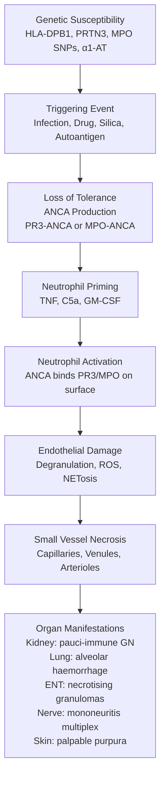
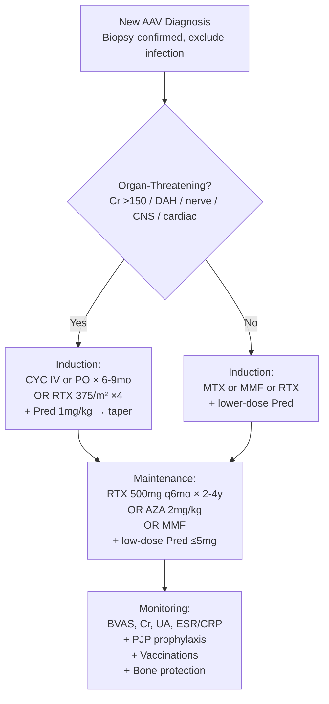
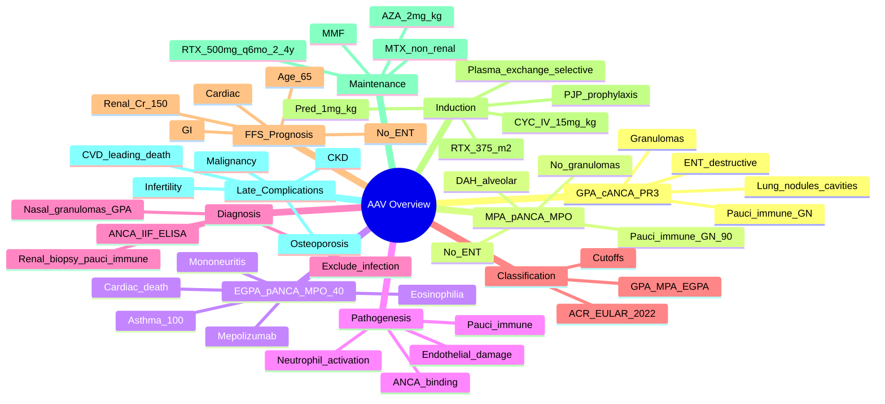

# ANCA-Associated Vasculitis (AAV) — Integrated Overview

> [!tip] **FCPS/MRCP Priority: CRITICAL**
> AAV is the **prototype small-vessel vasculitis** and a high-yield viva. Must know: **c-ANCA/PR3 = GPA** (ENT/lung/renal), **p-ANCA/MPO = MPA** (renal/pulmonary, no ENT, no granulomas) or **EGPA** (asthma + eosinophilia), **pauci-immune crescentic GN** is the renal hallmark, **induction with CYC or RTX + steroids**, **maintenance with RTX or AZA**, **PJP prophylaxis on CYC**, and the **5-factor score** for prognosis.

---

## Learning Objectives
By the end of this note you should be able to:
- [ ] Classify AAV into **GPA, MPA, EGPA** and identify key clinical and serological features
- [ ] Interpret **ANCA testing** (IIF pattern + ELISA antigen: PR3 vs MPO)
- [ ] Recognise **pauci-immune crescentic GN** as the renal hallmark of AAV
- [ ] Apply **2022 ACR/EULAR classification criteria** for GPA, MPA, EGPA
- [ ] Differentiate **active vasculitis** from infection, drug toxicity, and other mimics
- [ ] Plan **induction (CYC or RTX + steroids)** and **maintenance (RTX or AZA)** therapy
- [ ] Use the **five-factor score (FFS 2009/2011)** for prognosis
- [ ] Monitor disease activity (**BVAS**), damage (**VDI**), and drug toxicity

---

## 1. Definition & Classification
| Syndrome | Synonym | ANCA | Key Features |
|----------|---------|------|--------------|
| **Granulomatosis with polyangiitis (GPA)** | Wegener's granulomatosis | **c-ANCA / PR3 (90%)** | Upper + lower respiratory tract (granulomas), renal, **ENT** destructive |
| **Microscopic polyangiitis (MPA)** | — | **p-ANCA / MPO (70%)** | **Pauci-immune GN**, **alveolar haemorrhage**, **no granulomas, no ENT** |
| **Eosinophilic granulomatosis with polyangiitis (EGPA)** | Churg-Strauss syndrome | **p-ANCA / MPO (40-60%)** | **Asthma + eosinophilia + vasculitis**, neuropathy, cardiac, lung infiltrates |

### ANCA Subtypes — Definitive Differences
| Subtype | IIF Pattern | ELISA Antigen | Sensitivity | Specificity |
|---------|--------------|---------------|-------------|-------------|
| **GPA** | **c-ANCA** (cytoplasmic, granular) | **PR3 (proteinase 3)** | **90%** in active generalised disease | **>95%** for GPA |
| **MPA** | **p-ANCA** (perinuclear) | **MPO (myeloperoxidase)** | **70%** | ~95% for MPA |
| **EGPA** | **p-ANCA** | **MPO** | **40-60%** | Less specific; ANCA-negative in 40-60% |
| **Atypical** | Atypical ANCA | (borders, mixed) | — | IBD, autoimmune hepatitis, drugs (PTU, hydralazine, cocaine/levamisole) |

> [!important] **ANCA Testing — Two-Step**
> 1. **IIF (screening)**: c-ANCA or p-ANCA pattern
> 2. **ELISA (confirmation)**: PR3 or MPO antigen
> - **IIF + ELISA combination** is the standard
> - **High-titre PR3-ANCA = GPA** until proven otherwise
> - **Persistent low-titre p-ANCA** may be seen in IBD, autoimmune hepatitis, drugs

> [!warning] **Drugs That Cause ANCA-Positive Vasculitis**
> - **PTU (propylthiouracil)** — most common
> - **Hydralazine, minocycline**
> - **Levamisole** (cocaine adulterant)
> - **TNF inhibitors** (paradoxal, anti-TNF-induced)
> - **Allopurinol, sulfasalazine, penicillamine**
> - **Rituximab** (rare)
> - Drug-induced AAV: **dual MPO + PR3 positivity** is a red flag (especially with cocaine/levamisole)

---

## 2. Epidemiology
| Feature | GPA | MPA | EGPA |
|---------|-----|-----|------|
| **Incidence** | 10-20/million/year | 5-10/million/year | 1-3/million/year |
| **Prevalence** | ~250/million | ~100/million | ~50/million |
| **Age (peak)** | 40-60y | 50-70y | 40-60y |
| **Sex** | M = F or slight M | M = F | M = F |
| **Ethnicity** | White > Asian, African | Variable | Variable |
| **Genetic** | **HLA-DPB1, PRTN3, SERPINA1** (α1-AT) | **HLA-DQA, MPO** | **HLA-DRB4** |
| **Seasonal** | Winter peak (infection trigger) | Less clear | Less clear |

---

## 3. Pathogenesis — "Pauci-Immune" Small-Vessel Vasculitis

### Key Concepts
| Concept | Detail |
|---------|--------|
| **Pauci-immune** | **Scant immunoglobulin deposition** on IF (vs immune-complex vasculitis) — distinguishes from lupus, IgA, cryoglobulinemic |
| **Small vessels** | Capillaries, venules, arterioles; **also medium-vessel** involvement in EGPA and severe GPA |
| **Granulomas** | **GPA**: necrotising granulomas (ENT, lung); **MPA**: **NO granulomas** (key differentiator) |
| **NETs** | Neutrophil extracellular traps contribute to endothelial damage |
| **Complement** | Alternative pathway activation (C5a); C5a inhibitor (vilobelimab) emerging |

---

## 4. Clinical Features — Unified Approach
### Constitutional (All AAV)
- Fever, weight loss, fatigue, night sweats, myalgia, arthralgia

### Organ-Specific Patterns
| System | GPA | MPA | EGPA |
|--------|-----|-----|------|
| **ENT** | **Sinusitis (90%)**, **saddle-nose deformity**, septal perforation, otitis media, subglottic stenosis | **No ENT** (key) | **Allergic rhinitis, nasal polyps, chronic sinusitis** |
| **Lung** | **Nodules (often cavitating)**, alveolar haemorrhage (10-30%) | **Diffuse alveolar haemorrhage (30%)**, no nodules/granulomas | **Asthma (100%)**, pulmonary infiltrates, eosinophilic pneumonia |
| **Kidney** | Pauci-immune crescentic GN (80%) | Pauci-immune crescentic GN (**90-100%**) | GN (10-30%, often ANCA+) |
| **Skin** | Palpable purpura, ulcers | Palpable purpura, livedo | Palpable purpura, nodules |
| **Peripheral nerve** | Mononeuritis multiplex (20-30%) | Mononeuritis multiplex (30%) | **Mononeuritis multiplex (50-78%, ANCA+ subset)** |
| **Cardiac** | Rare | Rare | **Cardiomyopathy, pericarditis, coronary vasculitis (leading cause of EGPA death)** |
| **GI** | Rare | Rare | Abdominal pain, GI bleeding, perforation |
| **Eye** | Scleritis, episcleritis, orbital mass | Scleritis (rare) | — |
| **Joint** | Arthralgia, myalgia | Arthralgia, myalgia | Arthralgia |

### Triad of Common Disease
- **GPA**: ENT + lung (nodules/cavities) + renal
- **MPA**: Renal + pulmonary haemorrhage (no ENT)
- **EGPA**: Asthma + eosinophilia + vasculitis (skin, nerve, cardiac)

---

## 5. Diagnosis — Investigations
### Baseline Workup
| Test | Purpose |
|------|---------|
| **ANCA (IIF + ELISA)** | **PR3-ANCA = GPA, MPO-ANCA = MPA/EGPA** |
| **FBC** | **Eosinophilia (>10%, >1.5×10⁹/L) in EGPA**; anaemia of chronic disease |
| **ESR, CRP** | Inflammatory markers (active disease) |
| **U&E, creatinine** | Renal function (rising Cr = urgent) |
| **Urinalysis + microscopy** | **Active sediment: dysmorphic RBCs, RBC casts, proteinuria** (urgent) |
| **CXR / HRCT chest** | **Nodules, cavities, infiltrates, alveolar haemorrhage (DAH)** |
| **Sinus CT** | Mucosal thickening, bone erosion (GPA) |
| **Biopsy** | **Renal** (pauci-immune crescentic GN); **nasal** (necrotising granulomas, GPA); **skin** (leukocytoclastic); **lung** (DAH, granulomas) |

### Confirmatory Biopsy
| Site | Typical Finding |
|------|-----------------|
| **Kidney** | **Focal segmental necrotising GN**, crescents, **pauci-immune** (IF: scanty Ig) |
| **Nasal (GPA)** | **Necrotising granulomatous inflammation** |
| **Lung (GPA)** | Necrotising granulomas, geographic necrosis |
| **Skin** | Leukocytoclastic vasculitis, no Ig/C3 (vs IgA in HSP) |
| **Nerve (mononeuritis)** | Vasculitic neuropathy (epineurial vessel inflammation) |

### Mimics to Exclude
- **Infection** (TB, endocarditis, fungal) — **do NOT immunosuppress without excluding infection**
- **Lupus, IgA vasculitis, cryoglobulinemia** — **immune complex** (IF positive, not pauci-immune)
- **Anti-GBM disease (Goodpasture)** — **linear IgG** on IF, anti-GBM antibody
- **Drug-induced ANCA vasculitis** (PTU, hydralazine, levamisole-cocaine)
- **Malignancy** (paraneoplastic vasculitis)
- **Granulomatosis with sarcoidosis, IgG4-RD, lymphomatoid granulomatosis** (GPA mimic)

> [!warning] **Biopsy and Exclude Infection Before Immunosuppression**
> All three AAVs can mimic infection (TB, fungal, endocarditis). In endemic regions, **always biopsy and stain for organisms**. **Induction immunosuppression in undiagnosed infection can be fatal**.

---

## 6. Classification — 2022 ACR/EULAR Criteria
### GPA — 10 items, ≥5 points
| Item | Points |
|------|--------|
| **Nasal/oral inflammation** (oral ulcers, nasal discharge, septal defect, saddle nose) | +3 |
| **Cartilaginous involvement** (ear, nose, laryngotracheal) | +2 |
| **Conductive/mixed hearing loss** | +1 |
| **c-ANCA or PR3-ANCA positive** | **+5** |
| **Pulmonary nodules, mass, or cavitation** | +2 |
| **Granuloma on biopsy** | +2 |
| **Pauci-immune GN on biopsy** | +1 |
| **Eosinophilia >1×10⁹/L** | -3 |
| **Maximum** | **10** |

### MPA — 6 items, ≥5 points
| Item | Points |
|------|--------|
| **p-ANCA or MPO-ANCA positive** | **+6** |
| **Pauci-immune GN on biopsy** | +3 |
| **Pulmonary capillaritis / DAH** | +3 |
| **Nasal/oral inflammation** (only crusting, no granulomas) | -3 |
| **Cartilaginous involvement** | -2 |
| **Maximum** | **6** |

### EGPA — 7 items, ≥4 points
| Item | Points |
|------|--------|
| **Eosinophilia ≥1×10⁹/L** | **+5** |
| **Asthma / airflow obstruction** | **+3** |
| **Nasal polyps** | +3 |
| **p-ANCA or MPO-ANCA positive** | -1 |
| **Mononeuritis multiplex or polyneuropathy** | +1 |
| **Pulmonary infiltrates (non-fixed)** | +1 |
| **Sinus abnormalities** | +1 |
| **Extravascular eosinophils on biopsy** | +2 |
| **Maximum** | **10** |

> [!tip] **Classification vs Diagnostic Criteria**
> These are **classification** criteria (use after diagnosis is established clinically) — not diagnostic. Apply in patient with medium-small vessel vasculitis + diagnostic features (excluded mimics).

---

## 7. Disease Activity — BVAS and Damage
### Birmingham Vasculitis Activity Score (BVAS v3)
- **9 organ systems**: constitutional, cutaneous, mucous membrane/eye, ENT, chest, cardiovascular, abdominal, renal, nervous system
- Items weighted by importance
- **Active disease**: BVAS ≥1 (some use ≥3)
- **Major items**: e.g., DAH, RPGN, mesenteric ischaemia, mononeuritis multiplex, CNS

### Vasculitis Damage Index (VDI)
- **Cumulative damage** (not active disease) — irreversible
- Persistent items ≥3 months
- Predicts long-term morbidity (CKD, CVD, malignancy)

### Monitoring
- **BVAS** at every visit
- **Cr, urinalysis, ESR/CRP** monthly
- **PR3/MPO ANCA** titres (rising PR3 predicts relapse in GPA)
- **Imaging** (HRCT, sinus) as indicated
- **DEXA** baseline (steroid-induced osteoporosis)
- **PJP prophylaxis** (TMP-SMX or pentamidine) on high-dose steroids or CYC
- **TB, HepB, HepC, HIV** screen pre-biologic
- **Cardiovascular** risk assessment (CVD is leading late complication)

---

## 8. Five-Factor Score (FFS 2009) — Prognosis
| Item | Points |
|------|--------|
| **Renal involvement (Cr >1.7 mg/dL / 150 µmol/L)** | +1 |
| **Cardiac involvement** | +1 |
| **GI involvement** (bleeding, perforation, ischaemia) | +1 |
| **Age >65y** | +1 |
| **No ENT manifestations** (GPA without ENT = worse prognosis — like MPA) | +1 |
| **Maximum** | **5** |

- **FFS 0**: 5y survival ~90%
- **FFS 1**: 5y survival ~75%
- **FFS ≥2**: 5y survival ~50-60% — **high-risk**, **aggressive induction**

> [!tip] **Use FFS to Guide Treatment Intensity**
> FFS ≥2 or organ-threatening disease (renal, lung, nerve, CNS) → **CYC or RTX + high-dose steroids**. FFS 0, non-organ-threatening (e.g., ENT-only GPA) → consider **MTX or RTX ± steroids**.

---

## 9. Management — Induction and Maintenance

### Induction Therapy (Organ-Threatening)
| Regimen | Dose | Notes |
|---------|------|-------|
| **Cyclophosphamide (CYC) IV** | **15 mg/kg IV q2-3 weeks × 6 pulses** (CYCLOPS regimen) | Adjust for age, Cr; **MESNA** for uroprotection; **PJP prophylaxis** |
| **CYC oral** | 2 mg/kg/day (max 200 mg) | More cumulative dose → more toxicity; less used now |
| **Rituximab (RTX)** | **375 mg/m² weekly × 4** (RA protocol) OR **1g q2 weeks × 2** | **RAVED, RITUXVAS** trials; **non-inferior to CYC** for remission; preferred in **young women** (fertility), relapsing disease, **PR3-ANCA** (better at maintaining remission) |
| **Steroids** | **Pred 1 mg/kg/day** (max 60-80 mg) → **taper over 3-6 months** | PJP prophylaxis, gastric protection, bone protection, glycaemic monitoring; consider IV methylpred 500-1000 mg × 3 days for severe |

> [!important] **RTX vs CYC — Key Points**
> - **RTX preferred**: PR3-ANCA, relapsing disease, young women (fertility preservation), avoiding CYC toxicity (haemorrhagic cystitis, bladder cancer, lymphoma, infertility)
> - **CYC preferred**: severe renal disease (especially if Cr >400), MPO-ANCA, severe alveolar haemorrhage
> - **Plasma exchange**: PEXIVAS trial (2020) showed **no overall benefit** for severe AAV, but consider in **DAH with severe hypoxia, refractory disease, anti-GBM co-existence**

### Maintenance Therapy
| Regimen | Dose | Duration |
|---------|------|----------|
| **Rituximab** | **500 mg IV q6 months** (MAINRITSAN) | 2-4 years (extended → lower relapse) |
| **Azathioprine (AZA)** | 2 mg/kg/day | 2-4 years (REMAIN: longer = better) |
| **Mycophenolate (MMF)** | 2-3 g/day | 2-4 years (less effective for GPA relapse) |
| **Methotrexate (MTX)** | 20-25 mg weekly | 2-4 years (non-renal only — contraindicated in CKD) |
| **Belimumab** | Add-on (BREVAS trial) | Not yet standard |

> [!tip] **RTX Maintenance Is Standard of Care**
> MAINRITSAN-2 and -3 trials established **RTX 500 mg q6 months** as **superior to AZA** for relapse prevention in GPA, especially PR3-ANCA. Continue **≥2 years**, often **4 years** in PR3+.

### Adjunctive Therapies (All Patients)
- **PJP prophylaxis**: **TMP-SMX 480 mg daily** (or 960 mg 3x/week) — on high-dose steroids or CYC
- **Bone protection**: Calcium, vitamin D, **bisphosphonate** (or denosumab)
- **Vaccination**: Influenza, pneumococcal (PCV13 + PPSV23), COVID; live vaccines **before** starting biologic; update before RTX
- **Cardiovascular risk**: Statin, BP control, lifestyle — CVD leading cause of late death
- **Gastric protection**: PPI on steroids + NSAID
- **Fertility**: Sperm banking (men) before CYC; **GnRH agonists** (women) for ovarian protection

---

## 10. Special Situations
### Refractory Disease
- **Switch CYC → RTX** or vice versa
- **IVIG**, **plasma exchange** (especially DAH), **mycophenolate**, **ATG**
- **Complement C5a inhibitor (vilobelimab)** — emerging
- **Re-biopsy** to confirm vasculitis (vs infection, malignancy)

### Relapse
| Severity | Definition | Treatment |
|----------|-----------|-----------|
| **Major relapse** | Organ-threatening (renal, lung, nerve, CNS) | Re-induction: **RTX (preferred) or CYC** + steroids; consider plasma exchange |
| **Minor relapse** | Non-organ-threatening (ENT, arthralgia, fatigue) | Increase steroids; **RTX re-dose** if on maintenance; add MTX |

> [!tip] **PR3-ANCA Titer Rising → Consider Pre-emptive RTX**
> In PR3-ANCA patients in remission, a rising titre predicts relapse. **MAINRITSAN-3**: pre-emptive RTX (at ANCA re-rise or CD19+ B-cell return) reduces relapse vs fixed-schedule.

### Pregnancy
- **Active disease** is high-risk (renal, BP, prematurity)
- **Stable remission** for 6-12 months before conception
- **Safe in pregnancy**: Prednisolone, **AZA**, **HCQ**, **tacrolimus**, RTX (limited — last dose ideally >6 months pre-conception)
- **Avoid**: CYC, MMF, MTX (teratogenic)
- **Multidisciplinary care** with obstetric medicine, nephrology, rheumatology

### Renal Transplantation
- **Stable remission ≥12 months** (some say 2y) before transplant
- **Recurrence risk**: ~10-20% in ANCA+ (especially PR3+)
- **RTX** can be used to treat recurrence in graft

### EGPA-Specific
- **Asthma management**: high-dose inhaled corticosteroid, **omalizumab** (anti-IgE) for refractory, **mepolizumab** (anti-IL-5) **now licensed for EGPA** (MIRRA trial)
- **Cardiac involvement**: leading cause of death → **MRI/echocardiogram at baseline and follow-up**; high-dose steroids + CYC
- **ANCA+ EGPA**: more vasculitic features (GN, neuropathy)
- **ANCA− EGPA**: more cardiac, lung, ENT features

---

## 11. Prognosis
| Factor | Impact |
|--------|--------|
| **FFS** | 5y survival 90% (FFS 0), 75% (FFS 1), 50-60% (FFS ≥2) |
| **ANCA type** | PR3 = higher relapse, MPO = higher mortality early |
| **Renal** | Cr >400 at presentation → 30-50% progress to ESRD |
| **DAH** | Acute mortality 25-50% |
| **Cardiac (EGPA)** | Leading cause of EGPA mortality |
| **Modern Rx** | 5y survival **80-90%** (was 10% pre-steroids) |
| **Cumulative damage** | CKD, CVD, malignancy, infertility, fractures, mood |

---

## 12. FCPS/MRCP High-Yield Summary
| Topic | Key Points |
|-------|------------|
| **GPA** | **c-ANCA/PR3 (90%)**; ENT (sinusitis, saddle nose) + lung nodules/cavities + renal (pauci-immune GN) |
| **MPA** | **p-ANCA/MPO (70%)**; renal (crescentic GN) + DAH; **no ENT, no granulomas** |
| **EGPA** | **Asthma + eosinophilia + vasculitis**; p-ANCA/MPO 40-60%; cardiac = leading cause of death |
| **Pauci-immune** | **Scant Ig on IF**; distinguishes from immune complex vasculitis (IgA, lupus, cryo) |
| **ANCA testing** | **IIF + ELISA** (PR3 vs MPO); high-titre PR3 = GPA |
| **Biopsy** | Renal (pauci-immune crescentic GN), nasal (granulomas, GPA), skin (LCV) |
| **FFS** | Renal Cr >150, cardiac, GI, age >65, no ENT — 5y survival by score |
| **Induction** | **RTX 375/m² ×4 OR CYC IV** + Pred 1mg/kg (PJP prophylaxis) |
| **Maintenance** | **RTX 500 mg q6mo × 2-4y** (preferred) OR AZA, MMF, MTX |
| **PEXIVAS** | Plasma exchange **no benefit** in severe AAV (use selectively) |
| **Drugs that cause AAV** | PTU, hydralazine, levamisole (cocaine), minocycline, anti-TNF |
| **Late complications** | **CVD leading cause**; CKD, malignancy, osteoporosis, infertility |
| **EGPA biologics** | **Mepolizumab (anti-IL-5)** licensed; omalizumab for asthma |

---

## 13. Viva Questions (MRCP PACES / FCPS)
| Question | Expected Answer |
|----------|-----------------|
| "Differentiate GPA from MPA." | **GPA**: c-ANCA/PR3 (90%), ENT (sinusitis, saddle nose), lung nodules/cavities, granulomas. **MPA**: p-ANCA/MPO (70%), no ENT, no granulomas, pauci-immune GN + DAH. |
| "ANCA-negative vasculitis — is it possible?" | Yes — **5-10% of AAV** ANCA-negative; **EGPA ANCA-negative 40-60%**; still classify clinically and histologically. |
| "Most common renal biopsy finding in AAV?" | **Focal segmental necrotising crescentic GN, pauci-immune** (scant Ig on IF). |
| "A 50yo woman with new asthma, eosinophilia 8×10⁹/L, purpura, mononeuritis multiplex. Diagnosis?" | **EGPA** (Churg-Strauss). Apply 2022 ACR/EULAR (eosinophilia +5, asthma +3, neuropathy +1, etc.). |
| "Induction therapy for organ-threatening GPA in a 25-year-old woman?" | **RTX 375 mg/m² ×4 weekly** (preferred — fertility preservation, less bladder cancer) + Pred 1mg/kg. Add PJP prophylaxis. |
| "What's the role of plasma exchange in AAV?" | **PEXIVAS trial (2020)**: no overall benefit in severe AAV. Consider selectively in **DAH with severe hypoxia, anti-GBM co-existence, refractory disease**. |
| "Five-factor score (FFS) for prognosis?" | **Renal Cr >150, cardiac, GI, age >65, no ENT** = each +1; FFS 0 = 90% 5y survival; FFS ≥2 = 50-60%. |
| "PR3-ANCA patient in remission on AZA — rising PR3-ANCA titre. Next step?" | **Pre-emptive RTX** (500 mg ×1) or switch maintenance to RTX q6mo. PR3 rising = high relapse risk. |
| "Most common cause of late death in AAV?" | **Cardiovascular disease** (accelerated atherosclerosis from chronic inflammation, steroids, CKD). |

---

## 14. Confusions & Mnemonics
| Confusion | Clarification |
|-----------|---------------|
| **ANCA IIF vs ELISA** | **IIF = pattern** (c-ANCA = cytoplasmic = GPA; p-ANCA = perinuclear = MPA/EGPA). **ELISA = antigen** (PR3 = GPA; MPO = MPA/EGPA). Always do both. |
| **PR3 vs MPO prognosis** | **PR3** = higher relapse; **MPO** = higher initial mortality, more renal disease. Both treated similarly. |
| **AAV vs immune complex vasculitis** | **AAV = pauci-immune** (scant Ig); **lupus/IgA/cryo = immune complex** (Ig/C3 deposits). |
| **Granulomas in AAV** | **GPA = YES**; **MPA = NO**; **EGPA = YES** (extravascular eosinophils + granulomas) |
| **CYC vs RTX choice** | **RTX**: young (fertility), relapsing, PR3+. **CYC**: severe renal Cr >400, severe DAH, MPO+. |
| **DAH — what confirms it?** | **Diffuse alveolar infiltrates + falling Hb + blood on bronchoscopy lavage** (siderophages >20%). Exclude infection. |
| **Drug-induced ANCA** | **PTU > hydralazine > minocycline > levamisole > anti-TNF**; dual MPO+PR3 positivity suggests levamisole/cocaine |
| **EGPA cardiac involvement** | **Leading cause of EGPA death**; MRI + echo at baseline; high-dose steroids + CYC |

**Mnemonic: AAV Subtypes by ANCA = "G-P, M-P, E-M"**
- **G**PA = **P**R3 (c-ANCA) — "**G**roup of **P**R3"
- **M**PA = p-ANCA + MPO — "**M**icro**P**oly-angiitis"
- **E**GPA = MPO 40-60% (p-ANCA) — "**E**osinophilic with **M**PO"

**Mnemonic: GPA Triad = "ESR + ENT + RENAL + LUNG"**
- Constitutional, **S**inusitis
- **E**ar/nose/throat destructive
- **R**enal (pauci-immune GN)
- **L**ung (nodules, cavitation)
- **N**erve (mononeuritis)

**Mnemonic: MPA = "MPA No ENT"**
- **M**PO, **P**auci-immune, **A**lveolar haemorrhage
- **No ENT** (key differentiator from GPA)

**Mnemonic: EGPA = "A-E-N-C"**
- **A**sthma (100%)
- **E**osinophilia (≥10%)
- **N**europathy (mononeuritis multiplex)
- **C**ardiac (leading cause of death)

**Mnemonic: FFS = "Re-C-GA-N-E"**
- **Re**nal Cr >150
- **C**ardiac
- **G**I (ischaemia, perforation)
- **A**ge >65
- **N**o ENT (worse — like MPA)

**Mnemonic: AAV Induction "RTX or CYC + Pred + PJP"**
- **R**ituximab 375/m² ×4 OR **C**yclophosphamide IV
- **P**rednisolone 1 mg/kg → taper
- **J**ust cover with **P**JP (TMP-SMX)
- **Bone** + **gastric** + **vaccinate** + **CV risk**

**Mnemonic: Mepolizumab = "Mepo for E-G-PA"**
- Anti-IL-5 → eosinophil depletion
- **MIRRA trial**: steroid-sparing in EGPA

---

## 15. Mind Map

---

## 16. One-Page Revision Card
| Domain | Key Points |
|--------|------------|
| **GPA** | c-ANCA/PR3 (90%); **ENT (sinusitis, saddle nose) + lung (nodules/cavities) + renal**; granulomas |
| **MPA** | p-ANCA/MPO (70%); **renal (crescentic GN 90-100%) + DAH**; **no ENT, no granulomas** |
| **EGPA** | **Asthma + eosinophilia + vasculitis**; p-ANCA/MPO 40-60%; **cardiac = leading cause of death**; mepolizumab licensed |
| **ANCA testing** | **IIF (c-ANCA / p-ANCA) + ELISA (PR3 / MPO)** |
| **Pauci-immune** | **Scant Ig on IF**; distinguishes from immune complex vasculitis |
| **Biopsy** | Renal (pauci-immune crescentic GN), nasal (granulomas, GPA) |
| **FFS** | Renal Cr >150, cardiac, GI, age >65, no ENT (5 items); 5y survival 90% → 50% |
| **Induction (organ-threatening)** | **RTX 375/m² ×4 OR CYC IV** + Pred 1mg/kg + PJP prophylaxis |
| **Maintenance** | **RTX 500 mg q6mo × 2-4y** (preferred for PR3) OR AZA 2mg/kg |
| **PEXIVAS** | Plasma exchange **no overall benefit**; consider in DAH, anti-GBM co-existence |
| **Drug-induced AAV** | PTU, hydralazine, levamisole/cocaine, minocycline, anti-TNF; **dual MPO+PR3 = levamisole** |
| **Late death** | **CVD** (leading) > CKD > malignancy > infection |
| **Pregnancy** | AZA + Pred safe; **avoid CYC, MMF, MTX**; RTX limited |

---

## 17. Spaced Repetition Trackers
| Review Interval | Date Completed | Confidence (1-5) | Notes |
|-----------------|----------------|------------------|-------|
| 24 hours | | | |
| 7 days | | | |
| 15 days | | | |
| 30 days | | | |
| 90 days | | | |

---

## 18. Self-Test Scorecard
| Section | Score /5 | Last Attempt |
|---------|----------|--------------|
| GPA vs MPA vs EGPA differentiation | | |
| ANCA IIF + ELISA interpretation | | |
| Pauci-immune GN biopsy | | |
| 2022 ACR/EULAR criteria | | |
| FFS calculation | | |
| RTX vs CYC choice | | |
| Maintenance strategy (RTX vs AZA) | | |
| Drug-induced AAV | | |
| EGPA cardiac + mepolizumab | | |
| Late complications (CVD, CKD) | | |
| Viva Questions | | |

---

## Local Navigation
- **Parent Heading**: [[../Vasculitis|Vasculitis]]
- **Parent Topic Group**: [[Primary systemic vasculitides overview]]
- **Sibling Topics**: [[Granulomatosis with polyangiitis (GPA)]] · [[Microscopic polyangiitis (MPA)]] · [[Eosinophilic granulomatosis with polyangiitis (EPA)]]
- **Chapter Map**: [[../Davidson Chapter 26 - Rheumatology Hierarchy|Rheumatology Hierarchy]]
- **Chapter MOC**: [[../Rheumatology MOC|Rheumatology MOC]]
- **Related**: [[Primary systemic vasculitides overview]] · [[Secondary vasculitides]] · [[Investigations in rheumatology]] · [[Drugs in rheumatology]]
