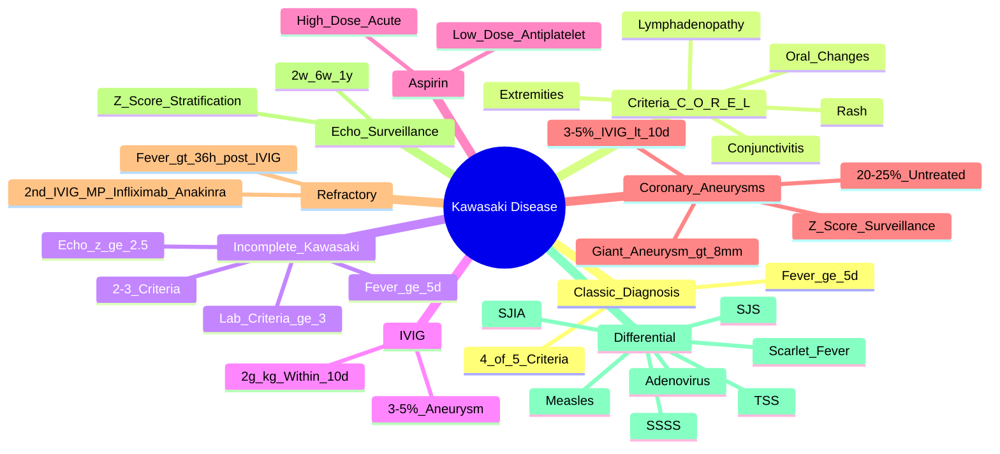

# Kawasaki Disease

> [!tip] **FCPS/MRCP Priority: HIGH**
> Kawasaki = **medium vessel vasculitis of childhood**. **Fever ≥5 days + ≥4/5 principal criteria**. **Coronary artery aneurysms** = major complication. **IVIG 2g/kg + aspirin within 10 days** = standard. **Incomplete Kawasaki** = fever ≥5d + 2-3 criteria + lab/echo criteria. **Echo surveillance at 2w, 6w, 1y** with z-scores.

---

## Learning Objectives
By the end of this note you should be able to:
- [ ] Apply **classic diagnostic criteria**: **fever ≥5 days + ≥4/5 principal features**
- [ ] Diagnose **incomplete (atypical) Kawasaki**: fever ≥5d + 2-3 criteria + supplementary lab/echo criteria
- [ ] Recognise **coronary artery aneurysm risk** (20-25% untreated → 3-5% with IVIG <10 days) and **echo z-score surveillance**
- [ ] Initiate **IVIG 2g/kg + high-dose aspirin within 10 days** of fever onset
- [ ] Manage **refractory Kawasaki** (persistent fever >36h post-IVIG) → 2nd IVIG, steroids, infliximab, anakinra
- [ ] Apply **echo surveillance schedule** (2w, 6w, 1y) with **z-score risk stratification**

---

## 1. Definition & Epidemiology

| Feature | Detail |
|---------|--------|
| **Definition** | **Acute medium vessel vasculitis of childhood** — systemic inflammation → **coronary artery aneurysms** (major morbidity/mortality) |
| **Incidence** | **10-30/100,000** <5y (highest in Japan, Korea, Taiwan); increasing globally |
| **Peak Age** | **<5 years** (peak **1-2 years**); rare <3 months or >8 years |
| **Sex Ratio** | **M > F** (1.5:1) |
| **Ethnicity** | **Asian > Caucasian** (Japan highest) |
| **Seasonality** | **Winter/Spring** peaks |
| **Aetiology** | Unknown — likely **post-infectious immune dysregulation** in genetically susceptible |

---

## 2. Clinical Features — **Classic Criteria (Fever + 4/5)**

| Principal Feature | Description | FCPS/MRCP Pearl |
|-------------------|-------------|-----------------|
| **1. Fever** | **≥5 days** (often high, 39-40°C, **unresponsive to antipyretics**) | **Mandatory** — if <5 days, cannot diagnose classic |
| **2. Bilateral Conjunctival Injection** | **Non-purulent**, **limbal sparing**, **bilateral** | **Most common** (90%) |
| **3. Oral Mucosal Changes** | **Injected pharynx, red/cracked lips, strawberry tongue** | **Strawberry tongue** = classic |
| **4. Polymorphous Rash** | **Trunk, perineum, extremities**; maculopapular, morbilliform, scarlatiniform | **Perineal accentuation** common |
| **5. Extremity Changes** | **Acute**: erythema palms/soles, oedema hands/feet; **Subacute (week 2-3)**: **periungual desquamation** | **Desquamation = week 2-3** |
| **6. Cervical Lymphadenopathy** | **≥1.5cm**, **unilateral**, **non-suppurative**, usually anterior cervical | **Least common** (50%) |

> [!critical] **Classic Diagnosis = Fever ≥5 days + ≥4/5 Principal Features**
> - **Cannot diagnose if fever <5 days** (except with echo evidence of coronary aneurysm)

---

## 3. Incomplete (Atypical) Kawasaki Disease

| Criterion | Description |
|-----------|-------------|
| **Fever** | **≥5 days** |
| **Principal Features** | **2-3** (not meeting classic 4/5) |
| **PLUS Supplementary Criteria** | **Lab OR Echo** criteria below |

### Supplementary Laboratory Criteria
| Criterion | Threshold |
|-----------|-----------|
| **CRP** | **≥3.0 mg/dL** (≥30 mg/L) |
| **ESR** | **≥40 mm/hr** |
| **Albumin** | **≤3.0 g/dL** |
| **Anaemia** | (Age-dependent) |
| **Platelet Count** | **≥450 ×10⁹/L** (week 2-3) |
| **WBC** | **≥15 ×10⁹/L** |
| **Urine** | **≥10 WBC/hpf** (sterile pyuria) |

### Supplementary Echocardiography Criteria
| Criterion | Threshold |
|-----------|-----------|
| **Coronary Artery Z-score** | **≥2.5** (or aneurysm) |
| **Z-score 2-2.5** | **Dilation** (borderline) |

> [!important] **Incomplete Kawasaki Diagnosis**
> - **Fever ≥5 days + 2-3 principal features + ≥3 lab criteria OR echo z-score ≥2.5**
> - **Treat as classic** — **IVIG + aspirin within 10 days**

---

## 4. Coronary Artery Aneurysms — **Major Complication**

| Aneurysm Size (Z-score) | Classification | Risk |
|-------------------------|----------------|------|
| **<2.0** | Normal | — |
| **2.0-2.5** | Dilation | Monitor |
| **2.5-5.0** | Small aneurysm | Monitor |
| **5.0-10.0** | Medium aneurysm | Anticoagulation consideration |
| **>10.0 / >8mm absolute** | **Giant aneurysm** | **Thrombosis, stenosis, rupture, MI** — **highest risk** |

| Timeline | Aneurysm Risk |
|----------|----------------|
| **Untreated** | **20-25%** |
| **IVIG <10 days** | **3-5%** |
| **IVIG >10 days** | **15-25%** |

> [!critical] **IVIG within 10 days of fever onset = CRITICAL**
> - **Day 1-10**: 3-5% aneurysm risk
> - **Day >10**: 15-25% aneurysm risk

---

## 5. Investigations

| Test | Typical Finding | Role |
|------|-----------------|------|
| **CRP/ESR** | **Markedly elevated** (CRP ≥3, ESR ≥40) | Acute phase, supplementary criteria |
| **Platelets** | **↑↑ (week 2-3)** — **≥450 ×10⁹/L** | Reactive thrombocytosis, supplementary criteria |
| **Albumin** | **≤3.0 g/dL** (hypoalbuminaemia) | Supplementary criteria |
| **WBC** | **≥15 ×10⁹/L** | Supplementary criteria |
| **Anaemia** | Normochromic normocytic | Supplementary criteria |
| **Urine** | **≥10 WBC/hpf** (sterile pyuria) | Supplementary criteria |
| **LFT** | Mild transaminitis, elevated GGT | |
| **Echocardiography** | **Gold standard** — coronary artery z-scores, aneurysm detection, ventricular function | **Surveillance: 2w, 6w, 1y** |
| **ECG** | Tachycardia, ST/T changes if myocarditis | |
| **Coagulation** | Normal (unless giant aneurysm on anticoagulation) | |

> [!critical] **Echo Surveillance Schedule**
> - **2 weeks** (acute) — baseline z-scores
> - **6 weeks** (subacute) — aneurysm evolution
> - **1 year** (convalescent) — long-term sequelae
> - **Additional**: if abnormal, every 6-12 months; giant aneurysm → every 3-6 months

---

## 6. Management

```mermaid
flowchart TD
    A[Kawasaki Diagnosis\n(Classic or Incomplete)] --> B[**IVIG 2g/kg**\nSingle infusion\n**WITHIN 10 DAYS** of fever onset]
    B --> C[**Aspirin**\n**High-dose 30-50mg/kg/day** (anti-inflammatory)\n×2-3 weeks until afebrile\n→ **Low-dose 3-5mg/kg/day** (antiplatelet)\nuntil echo normal at 6-8w]
    C --> D{Fever Persists >36h\nPost-IVIG?}
    D -->|Yes| E[**Refractory Kawasaki**\n**2nd IVIG 2g/kg**\nOR **Pulse MP 10-30mg/kg ×1-3d**\nOR **Infliximab 5-10mg/kg**\nOR **Anakinra 2-4mg/kg/day**]
    D -->|No| F[**Echo Surveillance**\n2w, 6w, 1y\nZ-score stratification]
    E --> F
```

### Acute Phase Treatment
| Drug | Dose | Duration | Key Points |
|------|------|----------|------------|
| **IVIG** | **2g/kg single infusion** | **Within 10 days of fever onset** | **Standard**; **<10 days = 3-5% aneurysms** |
| **Aspirin (High-dose)** | **30-50mg/kg/day** (divided QID) | **Until afebrile 48h** (typically 2-3 weeks) | **Anti-inflammatory**; monitor for GI bleed |
| **Aspirin (Low-dose)** | **3-5mg/kg/day** | **Until echo normal at 6-8 weeks** | **Antiplatelet**; stop if platelet dysfunction/bleeding |

### Refractory Kawasaki (Fever >36h post-IVIG)
| Option | Dose | Evidence |
|--------|------|----------|
| **2nd IVIG** | **2g/kg** (repeat) | 50-70% respond |
| **Pulse Methylprednisolone** | **10-30mg/kg/day IV ×1-3 days** | RAISE trial: reduces refractory rate |
| **Infliximab** | **5-10mg/kg IV single dose** | TNF blockade; case series |
| **Anakinra** | **2-4mg/kg/day SC** | IL-1 blockade; emerging |

> [!warning] **IVIG Timing is Critical**
> - **<10 days fever**: 3-5% aneurysm risk
> - **>10 days fever**: 15-25% aneurysm risk
> - **Do NOT delay** for incomplete criteria workup — **treat empirically if high suspicion**

---

## 7. Echo Surveillance & Z-Score Risk Stratification

| Z-Score | Coronary Status | Follow-Up |
|---------|-----------------|-----------|
| **<2.0** | Normal | **2w, 6w, 1y** routine |
| **2.0-2.5** | Dilation | **Every 6 months** until normal |
| **2.5-5.0** | Small aneurysm | **Every 3-6 months**; low-dose aspirin |
| **5.0-10.0** | Medium aneurysm | **Every 3-6 months**; **low-dose aspirin + consider anticoagulation** |
| **>10.0 / >8mm** | **Giant aneurysm** | **Every 3 months**; **anticoagulation (warfarin) + aspirin**; cardiology/surgery |

> [!important] **Z-Score Calculation**
> - **Z-score = (Observed - Mean) / SD** — adjusted for body surface area
> - **BSA-adjusted** — avoids overdiagnosis in small children

---

## 8. Differential Diagnosis

| Condition | Distinguishing Features |
|-----------|------------------------|
| **Scarlet Fever** | **Streptococcal** (sandpaper rash, strawberry tongue, circumoral pallor), **ASO+, throat culture** |
| **Measles** | **Koplik spots**, **cough/coryza/conjunctivitis**, **centrifugal rash**, Koplik spots |
| **Adenovirus/Enterovirus** | Exudative pharyngitis, conjunctivitis, **no extremity changes/desquamation** |
| **Staphylococcal Scalded Skin** | **Nikolsky sign**, **desquamation** (not periungual), **no fever ≥5d criteria** |
| **Toxic Shock Syndrome** | **Hypotension, multi-organ failure, desquamation**, **S. aureus** |
| **Juvenile Idiopathic Arthritis (Systemic)** | **Quotidian fever, salmon rash, arthritis**, **no conjunctivitis/oral changes** |
| **Stevens-Johnson Syndrome** | **Mucosal erosions, target lesions**, **drug trigger**, **Nikolsky sign** |

---

## 9. FCPS/MRCP High-Yield Summary

| Topic | Key Points |
|-------|------------|
| **Diagnosis** | **Fever ≥5 days + ≥4/5 principal criteria** (conjunctivitis, oral, rash, extremities, lymphadenopathy) |
| **Incomplete Kawasaki** | Fever ≥5d + 2-3 criteria + **≥3 lab criteria OR echo z-score ≥2.5** |
| **Principal Criteria** | 1) Bilateral non-purulent conjunctivitis (limbal sparing) 2) Oral changes (strawberry tongue, cracked lips) 3) Polymorphous rash 4) Extremity changes (erythema/desquamation) 5) Cervical lymphadenopathy ≥1.5cm |
| **IVIG** | **2g/kg single infusion WITHIN 10 DAYS** — **3-5% aneurysms**; >10 days = 15-25% |
| **Aspirin** | **High-dose 30-50mg/kg/day** (anti-inflammatory) → **Low-dose 3-5mg/kg** (antiplatelet) |
| **Coronary Aneurysms** | **20-25% untreated**; **3-5% with IVIG <10d**; **z-score surveillance** |
| **Echo Surveillance** | **2w, 6w, 1y**; z-score stratification |
| **Refractory** | Fever >36h post-IVIG → **2nd IVIG / Pulse MP / Infliximab / Anakinra** |
| **Incomplete Criteria Labs** | CRP ≥3, ESR ≥40, Albumin ≤30, Platelets ≥450, WBC ≥15, Anaemia, Urine WBC ≥10 |

---

## 10. Viva Questions (MRCP PACES / FCPS)

| Question | Expected Answer |
|----------|----------------|
| "A 3yo child has fever for 6 days, bilateral conjunctival injection, strawberry tongue, polymorphous rash, and periungual desquamation. Diagnosis?" | **Classic Kawasaki Disease** — Fever ≥5d + 4/5 criteria (conjunctivitis, oral, rash, extremity changes). |
| "What are the 5 principal criteria for Kawasaki disease?" | 1) Bilateral non-purulent conjunctival injection (limbal sparing), 2) Oral mucosal changes (strawberry tongue, cracked lips), 3) Polymorphous rash, 4) Extremity changes (erythema/desquamation), 5) Cervical lymphadenopathy ≥1.5cm. |
| "What is the treatment for Kawasaki disease and why is timing critical?" | **IVIG 2g/kg single infusion + Aspirin**. **IVIG within 10 days of fever onset = 3-5% aneurysm risk**; **>10 days = 15-25% aneurysm risk**. |
| "What is the aspirin dosing regimen in Kawasaki disease?" | **High-dose 30-50mg/kg/day (divided QID)** until afebrile 48h (anti-inflammatory) → **Low-dose 3-5mg/kg/day** until echo normal at 6-8 weeks (antiplatelet). |
| "How do you diagnose incomplete Kawasaki disease?" | **Fever ≥5 days + 2-3 principal criteria + ≥3 supplementary lab criteria (CRP≥3, ESR≥40, albumin≤30, platelets≥450, WBC≥15, anaemia, urine WBC≥10) OR echo z-score ≥2.5.** |
| "What is the echo surveillance schedule for Kawasaki disease?" | **2 weeks, 6 weeks, 1 year** — coronary artery z-scores. Additional if abnormal. |
| "What is the risk of coronary aneurysm if IVIG given at day 11 of fever?" | **15-25%** (vs 3-5% if <10 days). |
| "A child with Kawasaki disease has persistent fever 48h after IVIG. Next step?" | **Refractory Kawasaki** — **2nd IVIG 2g/kg** OR **Pulse MP 10-30mg/kg ×1-3d** OR **Infliximab 5-10mg/kg** OR **Anakinra**. |
| "What z-score defines a coronary artery aneurysm?" | **≥2.5** (dilatation 2.0-2.5). **Giant aneurysm** = z-score >10 or absolute diameter >8mm. |
| "What are the supplementary laboratory criteria for incomplete Kawasaki?" | CRP ≥3, ESR ≥40, Albumin ≤30, Platelets ≥450, WBC ≥15, Anaemia, Urine WBC ≥10 — **≥3 required**. |

---

## 11. Confusions & Mnemonics

| Confusion | Clarification |
|-----------|---------------|
| **Classic vs Incomplete** | Classic = **fever ≥5d + ≥4/5**. Incomplete = **fever ≥5d + 2-3 + lab/echo criteria**. Both need IVIG within 10d. |
| **IVIG Timing** | **<10 days fever = 3-5% aneurysms**; **>10 days = 15-25%** — **do not delay** for incomplete workup. |
| **Aspirin Dosing** | **High-dose (30-50mg/kg) = anti-inflammatory (acute)**; **Low-dose (3-5mg/kg) = antiplatelet (convalescent)**. |
| **Z-Score** | **BSA-adjusted** — avoids overdiagnosis in infants. **2.5 = aneurysm threshold**. |
| **Refractory Definition** | **Fever >36h after IVIG completion** — not just persistent fever during infusion. |
| **Incomplete Kawasaki Echo** | **Z-score ≥2.5** = diagnostic; **2.0-2.5 = dilation** (borderline). |
| **Desquamation Timing** | **Week 2-3** (periungual) — **not acute phase**. |
| **Scarlet Fever vs Kawasaki** | Scarlet: **Streptococcal, sandpaper rash, circumoral pallor, Koplik spots absent**. Kawasaki: **conjunctivitis, extremity changes, desquamation week 2-3**. |

**Mnemonic: 5 Criteria = "C-O-R-E-L"**
- **C**onjunctivitis (bilateral, non-purulent, limbal sparing)
- **O**ral changes (strawberry tongue, cracked lips)
- **R**ash (polymorphous)
- **E**xtrimity changes (erythema → desquamation)
- **L**ymphadenopathy (cervical, ≥1.5cm)

**Mnemonic: Incomplete Kawasaki = "2-3 + LABS/ECHO"**
- **Fever ≥5d + 2-3 criteria**
- **LABS**: ≥3 of (CRP≥3, ESR≥40, Alb≤30, Plt≥450, WBC≥15, Anaemia, Urine WBC≥10)
- **ECHO**: z-score ≥2.5

**Mnemonic: IVIG Timing = "<10 DAYS = GOOD"**
- **<10 days** = 3-5% aneurysms
- **>10 days** = 15-25% aneurysms

**Mnemonic: Aspirin = "HIGH then LOW"**
- **HIGH** (30-50mg/kg) = anti-inflammatory (acute)
- **LOW** (3-5mg/kg) = antiplatelet (convalescent)

**Mnemonic: Echo Schedule = "2-6-1"**
- **2** weeks
- **6** weeks
- **1** year

**Mnemonic: Incomplete Labs = "C-E-A-P-W-A-U"**
- **C**RP ≥3
- **E**SR ≥40
- **A**lbumin ≤30
- **P**latelets ≥450
- **W**BC ≥15
- **A**naemia
- **U**rine WBC ≥10

---

## 12. Mind Map



---

## 13. One-Page Revision Card

| Domain | Key Points |
|--------|------------|
| **Diagnosis** | **Fever ≥5d + ≥4/5**: Conjunctivitis, Oral, Rash, Extremities, Lymphadenopathy |
| **Incomplete** | Fever ≥5d + 2-3 criteria + **≥3 labs (CRP≥3, ESR≥40, Alb≤30, Plt≥450, WBC≥15, Anaemia, Urine WBC≥10) OR echo z≥2.5** |
| **IVIG** | **2g/kg single infusion WITHIN 10 DAYS** of fever — **3-5% aneurysms**; >10 days = 15-25% |
| **Aspirin** | **High-dose 30-50mg/kg/day** (anti-inflammatory) → **Low-dose 3-5mg/kg/day** (antiplatelet) |
| **Echo Surveillance** | **2w, 6w, 1y** — z-scores |
| **Z-Score** | **≥2.5 = aneurysm**; **2.0-2.5 = dilation**; **>10 / >8mm = giant** |
| **Refractory** | Fever >36h post-IVIG → **2nd IVIG / Pulse MP / Infliximab / Anakinra** |
| **Incomplete Labs** | CRP≥3, ESR≥40, Alb≤30, Plt≥450, WBC≥15, Anaemia, Urine WBC≥10 — **≥3 needed** |
| **Incomplete Echo** | **z-score ≥2.5** |
| **Desquamation** | **Week 2-3**, periungual |

---

## 14. Spaced Repetition Trackers

| Review Interval | Date Completed | Confidence (1-5) | Notes |
|-----------------|----------------|------------------|-------|
| 24 hours | | | |
| 7 days | | | |
| 15 days | | | |
| 30 days | | | |
| 90 days | | | |

---

## 15. Self-Test Scorecard

| Section | Score /5 | Last Attempt |
|---------|----------|--------------|
| Classic vs Incomplete Criteria | | |
| IVIG Timing & Dosing | | |
| Aspirin Regimen | | |
| Echo Surveillance & Z-Scores | | |
| Refractory Management | | |
| Differential Diagnosis | | |
| Viva Questions | | |

---

## Local Navigation
- **Parent Heading**: [[../Vasculitis|Vasculitis]]
- **Parent Topic Group**: [[Primary systemic vasculitides overview]]
- **Chapter Map**: [[../Davidson Chapter 26 - Rheumatology Hierarchy|Rheumatology Hierarchy]]
- **Chapter MOC**: [[../Rheumatology MOC|Rheumatology MOC]]
- **Drug Reference**: [[../../Clinical Approach to Musculoskeletal Disease/Drugs in rheumatology|Drugs in rheumatology]]
- **Related**: [[IgA vasculitis (Henoch-Schönlein purpura)]] · [[Polyarteritis nodosa (PAN)]]
---

> Auto-generated study sections for "Vasculitis" — Ch 25: Rheumatology & Bone Disease.

## Flashcards (10 generated)

- Q: What is the definition of Vasculitis?
  A: | Definition | Acute medium vessel vasculitis of childhood — systemic inflammation → coronary artery aneurysms (major morbidity/mortality) |
- Q: What is the investigation of choice for Vasculitis?
  A: Fever ≥5 days + ≥4/5 principal criteria (conjunctivitis, oral, rash, extremities, lymphadenopathy)
- Q: What is Incomplete Kawasaki of Vasculitis?
  A: Fever ≥5d + 2-3 criteria + ≥3 lab criteria OR echo z-score ≥2.5
- Q: What is Principal Criteria of Vasculitis?
  A: 1) Bilateral non-purulent conjunctivitis (limbal sparing) 2) Oral changes (strawberry tongue, cracked lips) 3) Polymorphous rash 4) Extremity changes (erythema/desquamation) 5) Cervical lymphadenopathy ≥1.5cm
- Q: What is IVIG of Vasculitis?
  A: 2g/kg single infusion WITHIN 10 DAYS — 3-5% aneurysms; >10 days = 15-25%
- Q: What is Aspirin of Vasculitis?
  A: High-dose 30-50mg/kg/day (anti-inflammatory) → Low-dose 3-5mg/kg (antiplatelet)
- Q: What is Coronary Aneurysms of Vasculitis?
  A: 20-25% untreated; 3-5% with IVIG <10d; z-score surveillance
- Q: What is Echo Surveillance of Vasculitis?
  A: 2w, 6w, 1y; z-score stratification
- Q: What is Refractory of Vasculitis?
  A: Fever >36h post-IVIG → 2nd IVIG / Pulse MP / Infliximab / Anakinra
- Q: What is Incomplete Criteria Labs of Vasculitis?
  A: CRP ≥3, ESR ≥40, Albumin ≤30, Platelets ≥450, WBC ≥15, Anaemia, Urine WBC ≥10

## MCQs (1 generated)

1. **Which of the following best describes Vasculitis?**
   A. **| Definition | Acute medium vessel vasculitis of childhood — systemic inflammation → coronary artery aneurysms (major morbidity/mortality) |**
   B. An unrelated condition not matching the clinical picture of Vasculitis
   C. A complication seen late in the disease course of Vasculitis
   D. A condition that mimics Vasculitis but has a different underlying cause

## SBA Questions (1 generated)

1. A patient with suspected Vasculitis presents with: Definition — Acute medium vessel vasculitis of childhood — systemic inflammation → coronary artery aneurysms (major morbidity/mortality); Incidence — 10-30/100,000 <5y (highest in Japan, Korea, Taiwan); increasing globally; Peak Age — <5 years (peak 1-2 years); rare <3 months or >8 years. What is the most likely diagnosis?
   A. **Vasculitis**
   B. A condition that mimics Vasculitis but is not the same entity
   C. A complication of Vasculitis rather than the primary diagnosis
   D. An unrelated condition in the same clinical category as Vasculitis

## PasTest Scenario SBAs (Clinical Vignettes)

> **Auto-generated PasTest/Mediscope-style scenario SBAs** grounded in the authored source. Each scenario tests a real clinical fact (triad, specific sign, contraindication, trial, first-line Rx) extracted from the topic. *Source: Ch 25: Rheumatology — Kawasaki disease*

**Q1.** Which of the following features is most specific or characteristic of Kawasaki disease?

  - **A.** Incomplete Kawasaki Echo
  - **B.** A feature common to many acute inflammatory conditions
  - **C.** A non-specific sign that does not localise the diagnosis
  - **D.** An investigation finding rather than a clinical feature

  > **Answer: A** — Incomplete Kawasaki Echo
  >
  > *Source:* |
| **Incomplete Kawasaki Echo** | **Z-score ≥2.5** = diagnostic; **2.0-2.5 = dilation** (borderline)

**Q2.** What is the most appropriate first-line therapy for Kawasaki disease?

  - **A.** Aspirin + 30-50mg/kg/day + Until afebrile
  - **B.** An advanced/surgical therapy reserved for refractory disease
  - **C.** Symptomatic treatment only, no disease-modifying therapy
  - **D.** Empiric broad-spectrum therapy without specific indication

  > **Answer: A** — Aspirin + 30-50mg/kg/day + Until afebrile
  >
  > *Source:* **Aspirin (High-dose)**   **30-50mg/kg/day** (divided QID)   **Until afebrile 48h** (typically 2-3 weeks)   **Anti-inflammatory**; monitor for GI bleed

