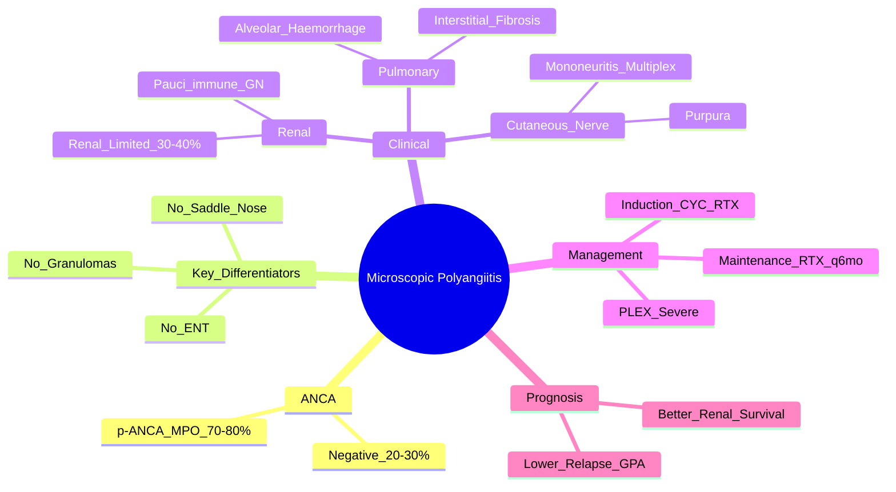

# Microscopic polyangiitis (MPA)

---
tags: [medicine, rheumatology, davidson, mpa, fcps, mrcp]
chapter: Rheumatology
davidson_part: Part 3: Clinical Medicine
davidson_chapter: Chapter 26: Rheumatology and bone disease
heading: Vasculitis
topic_group: ANCA-associated vasculitis overview
topic: Microscopic polyangiitis (MPA)
status: full-fcps-mrcp-note
priority: high
cards: 15
created: 2026-06-11
modified: 2026-06-11
exam_relevance: [FCPS, MRCP Part 1, MRCP Part 2, PACES]
see_also:
  - "[[Granulomatosis with polyangiitis (GPA)]]"
  - "[[Eosinophilic granulomatosis with polyangiitis (EPA)]]"
  - "[[ANCA-associated vasculitis overview]]"
  - "[[Drugs in rheumatology]]"
---

# Microscopic Polyangiitis (MPA)

> [!tip] **FCPS/MRCP Priority: HIGH**
> MPA = **p-ANCA/MPO+ pauci-immune necrotising vasculitis WITHOUT granulomas or ENT involvement**. Renal-limited presentation common. Key differentiator from GPA: **no granulomas, no ENT, no saddle nose**. Same treatment as GPA.

---

## Learning Objectives
By the end of this note you should be able to:
- [ ] Recognise MPA as p-ANCA/MPO+ vasculitis without granulomatous inflammation
- [ ] Differentiate MPA from GPA (no ENT, no granulomas, no saddle nose) and EGPA (no asthma/eosinophilia)
- [ ] Identify renal-limited MPA and pulmonary-renal syndrome
- [ ] Apply induction (CYC/RTX + steroids) and maintenance (RTX > AZA) regimens
- [ ] Monitor for relapse (less frequent than GPA)

---

## 1. Definition & Epidemiology

| Feature | Detail |
|---------|--------|
| **Definition** | **Necrotising vasculitis** of small vessels (capillaries, venules, arterioles) **without granulomatous inflammation** — strongly associated with **p-ANCA/MPO** |
| **Incidence** | 3-5/1,000,000/year |
| **Peak Onset** | **50-70 years** (older than GPA) |
| **Sex Ratio** | **M = F** |
| **Genetics** | HLA-DQ, SERPINA1 (α1-antitrypsin) |

---

## 2. Aetiology & Pathophysiology

```mermaid
flowchart LR
    A[Genetic Susceptibility\nHLA-DQ, SERPINA1] --> B[Environmental Trigger\nSilica, Drugs, Infection]
    B --> C[MPO Expression on Neutrophils]
    C --> D[p-ANCA (Anti-MPO) Binding\nNeutrophil Activation]
    D --> E[Respiratory Burst, Degranulation\nEndothelial Damage]
    E --> F[Necrotising Vasculitis\nNo Granulomas]
    F --> G[Small Vessel Involvement\nKidney, Lung, Skin, Nerve]
```

### Key Differences from GPA
| Feature | **MPA** | **GPA** |
|---------|---------|---------|
| **Granulomas** | **Absent** | **Present** (necrotising, geographic necrosis) |
| **ENT Involvement** | **Absent** | **Present** (sinusitis, saddle nose, subglottic stenosis) |
| **ANCA** | **p-ANCA/MPO** (70-80%) | **c-ANCA/PR3** (90%) |
| **Lung** | Alveolar haemorrhage, fibrosis | Nodules, cavities, haemorrhage |
| **Age** | Older (50-70) | Younger (40-60) |

---

## 3. Clinical Features

### Renal (Most Common & Severe)
| Feature | Description |
|---------|-------------|
| **Pauci-immune Necrotising Crescentic GN** | **RPGN** — haematuria, proteinuria, RBC casts, rising Cr |
| **Renal-Limited MPA** | **Pauci-immune GN WITHOUT systemic features** — 30-40% of MPA |
| **Severity** | Often **more severe/frequent renal involvement** than GPA |

### Pulmonary
| Feature | Description |
|---------|-------------|
| **Alveolar Haemorrhage** | Haemoptysis, dyspnoea, anaemia, diffuse ground-glass on CT — **emergency** |
| **Interstitial Fibrosis** | Chronic dyspnoea, restrictive PFTs, reticulation on HRCT |
| **Pleural Effusion** | Exudative, less common |

### Other Systems
| System | Manifestation |
|--------|---------------|
| **Cutaneous** | Palpable purpura (legs), livedo reticularis, ulcers |
| **Neurological** | **Mononeuritis multiplex** (wrist/foot drop), peripheral neuropathy |
| **Constitutional** | Fever, weight loss, malaise, myalgia |
| **GI** | Rare: ischaemia, perforation |

> [!critical] **Pulmonary-Renal Syndrome**
> - **Alveolar haemorrhage + RPGN** = medical emergency
> - **Same in GPA and MPA** (also anti-GBM, SLE)
> - **Immediate**: IV MP + CYC/RTX + PLEX (if severe)

---

## 4. Investigations

| Test | Finding in MPA |
|------|----------------|
| **p-ANCA / MPO ELISA** | **Positive 70-80%** (negative in 20-30%) |
| **c-ANCA / PR3** | Negative (if +ve, think GPA) |
| **Renal Biopsy** | **Pauci-immune necrotising crescentic GN** (no immune complexes on IF) — same as GPA |
| **CXR / CT Chest** | Alveolar haemorrhage (ground-glass), interstitial fibrosis |
| **FBC, ESR, CRP** | Leukocytosis, anaemia, markedly elevated inflammatory markers |
| **Urine** | Haematuria, proteinuria, RBC casts |
| **Nerve Conduction** | Axonal neuropathy (mononeuritis multiplex) |

> [!important] **ANCA-Negative MPA**
> - ~20-30% of MPA are ANCA-negative
> - **Diagnosis relies on biopsy** (pauci-immune necrotising GN + small vessel vasculitis)
> - **Do not exclude MPA on negative ANCA** if clinical picture fits

---

## 5. Management — **Same as GPA**

```mermaid
flowchart TD
    A[MPA Diagnosis] --> B{Severity}
    B -->|Severe (RPGN, Pulm Haemorrhage)| C[Induction: CYC IV + Pulse MP\nOR RTX + Pulse MP\n± PLEX (PEXIVAS)]
    B -->|Non-Severe| D[Induction: CYC Oral + Pred\nOR RTX + Pred]
    C --> E[Maintenance: Rituximab q6mo\n> AZA (MAINRITSAN applies)]
    D --> E
    E --> F[Monitor: q3mo clinical + p-ANCA + Cr + Urine]
    F --> G{Relapse?}
    G -->|Yes| H[Re-induction: RTX preferred]
    G -->|No| I[Taper Steroids to Stop\nContinue RTX q6mo 2-5yr]
```

### Induction Regimens
| Regimen | Indication | Details |
|---------|------------|---------|
| **CYC IV Pulse** | **Severe** (RPGN, pulmonary haemorrhage) | 500-1000mg/m² IV q2-4wk ×3-6mo + Pulse MP 500-1000mg ×3; Mesna + hydration |
| **CYC Oral** | Non-severe | 2mg/kg/day + pred taper; more bladder toxicity |
| **Rituximab** | **All severity** (RAVE: non-inferior to CYC) | 375mg/m² IV weekly ×4 (or 1000mg ×2) + pred taper; **preferred for relapsing, CYC contraindicated** |
| **PLEX** | Severe pulmonary haemorrhage / RPGN (Cr >5.6) | PEXIVAS: 7 exchanges ×1.5 plasma volume — reduces ESKD |

### Maintenance
| Drug | Dose | Duration | Evidence |
|------|------|----------|----------|
| **Rituximab** | 500mg IV q6mo | **2-5 years** | **MAINRITSAN**: RTX > AZA for relapse-free survival |
| **Azathioprine** | 2mg/kg/day | 2-5 years | If RTX contraindicated; TPMT test |
| **Methotrexate** | 15-25mg weekly | Limited use | Not for renal involvement |

---

## 6. Prognosis & Relapse

| Aspect | MPA vs GPA |
|--------|------------|
| **Relapse Rate** | **Lower than GPA** (~30% at 5 years vs 50% in GPA) |
| **Renal Survival** | **Better if treated early** — less chronic damage |
| **Common Relapse Sites** | Renal, pulmonary, cutaneous |
| **Re-induction** | **RTX preferred** (cumulative CYC dose limit) |

---

## 7. FCPS/MRCP High-Yield Summary

| Topic | Key Points |
|-------|------------|
| **ANCA** | **p-ANCA/MPO** (70-80%); c-ANCA/PR3 negative |
| **Key Differentiator from GPA** | **NO granulomas, NO ENT involvement, NO saddle nose** |
| **Renal** | **Pauci-immune necrotising crescentic GN**; often **more severe** than GPA; **renal-limited MPA = 30-40%** |
| **Lung** | **Alveolar haemorrhage** (emergency), **interstitial fibrosis** (not nodules/cavities) |
| **Treatment** | **Same as GPA**: Induction CYC/RTX + steroids; Maintenance RTX q6mo > AZA |
| **Relapse** | **Less frequent than GPA** (~30% at 5yr); re-induce with RTX |
| **ANCA-Negative MPA** | ~20-30% — biopsy if high suspicion (pauci-immune GN) |

---

## 8. Viva Questions (MRCP PACES / FCPS)

| Question | Expected Answer |
|----------|----------------|
| "How do you differentiate MPA from GPA?" | **MPA: p-ANCA/MPO+, NO granulomas, NO ENT involvement, NO saddle nose**. GPA: c-ANCA/PR3+, granulomas, ENT (sinusitis, saddle nose, subglottic stenosis). Both have pauci-immune GN. |
| "What is renal-limited MPA?" | **Pauci-immune necrotising crescentic GN WITHOUT systemic features** (no lung, skin, nerve involvement) — 30-40% of MPA. |
| "A patient has pulmonary haemorrhage and RPGN. p-ANCA positive. Diagnosis and emergency management?" | **MPA (pulmonary-renal syndrome)**. **IV MP 1000mg ×3 + CYC/RTX + PLEX** (PEXIVAS if Cr >5.6). ICU admission. |
| "What ANCA pattern in MPA? What if negative?" | **p-ANCA/MPO** (70-80%). **Negative in 20-30%** — do not exclude; diagnose by biopsy (pauci-immune GN). |
| "Is the treatment of MPA different from GPA?" | **No — identical**. Induction: CYC or RTX + steroids. Maintenance: RTX q6mo > AZA. PLEX for severe pulmonary-renal. |
| "What is the relapse rate of MPA vs GPA?" | **MPA: ~30% at 5 years (lower than GPA's 50%)**. Re-induction with RTX preferred. |

---

## 9. Confusions & Mnemonics

| Confusion | Clarification |
|-----------|---------------|
| **MPA vs GPA** | **MPA = p-ANCA/MPO, NO granulomas, NO ENT, NO saddle nose**. GPA = c-ANCA/PR3, granulomas, ENT, saddle nose. |
| **MPA vs EGPA** | **MPA: NO asthma, NO eosinophilia**. EGPA = asthma + eosinophilia + vasculitis; p-ANCA/MPO 40-60%. |
| **ANCA-Negative MPA** | ~20-30% — **diagnose by biopsy** (pauci-immune necrotising GN). Do not exclude on serology alone. |
| **Pulmonary Haemorrhage** | Same management in GPA/MPA/anti-GBM: **IV MP + CYC/RTX + PLEX**. |
| **Renal-Limited MPA** | Pauci-immune GN alone — treat same as systemic MPA. |

**Mnemonic: MPA = "MPO, No Granulomas, No ENT"**
- **M**PO-ANCA (p-ANCA)
- **P**auci-immune GN
- **A**bsent granulomas & ENT

**Mnemonic: MPA vs GPA = "GPA Has, MPA Has Not"**
- **GPA HAS**: Granulomas, ENT, Saddle nose, c-ANCA/PR3
- **MPA HAS NOT**: Granulomas, ENT, Saddle nose (has p-ANCA/MPO instead)

---

## 10. Mind Map



---

## 11. One-Page Revision Card

| Domain | Key Points |
|--------|------------|
| **ANCA** | **p-ANCA/MPO** (70-80%); negative 20-30% |
| **vs GPA** | **NO granulomas, NO ENT, NO saddle nose** |
| **Renal** | Pauci-immune GN (often severe); **renal-limited 30-40%** |
| **Lung** | Alveolar haemorrhage (emergency), interstitial fibrosis (NOT nodules/cavities) |
| **Treatment** | Same as GPA: CYC/RTX + steroids induction → RTX q6mo maintenance |
| **Relapse** | ~30% at 5yr (lower than GPA); RTX for re-induction |
| **ANCA-Negative** | Biopsy-based diagnosis (pauci-immune GN) |

---

## 12. Spaced Repetition Trackers

| Review Interval | Date Completed | Confidence (1-5) | Notes |
|-----------------|----------------|------------------|-------|
| 24 hours | | | |
| 7 days | | | |
| 15 days | | | |
| 30 days | | | |
| 90 days | | | |

---

## 13. Self-Test Scorecard

| Section | Score /5 | Last Attempt |
|---------|----------|--------------|
| MPA vs GPA Differentiation | | |
| ANCA Interpretation | | |
| Renal-Limited MPA | | |
| Pulmonary-Renal Syndrome | | |
| Treatment Algorithm | | |
| Relapse Management | | |
| Viva Questions | | |

---

## Local Navigation
- **Parent Heading**: [[../Vasculitis|Vasculitis]]
- **Parent Topic Group**: [[ANCA-associated vasculitis overview]]
- **Chapter Map**: [[../Davidson Chapter 26 - Rheumatology Hierarchy|Rheumatology Hierarchy]]
- **Chapter MOC**: [[../Rheumatology MOC|Rheumatology MOC]]
- **Drug Reference**: [[../../Clinical Approach to Musculoskeletal Disease/Drugs in rheumatology|Drugs in rheumatology]]
- **Related**: [[Granulomatosis with polyangiitis (GPA)]] · [[Eosinophilic granulomatosis with polyangiitis (EPA)]] · [[ANCA-associated vasculitis overview]]
---

> Auto-generated study sections for "Vasculitis" — Ch 25: Rheumatology & Bone Disease.

## Flashcards (40 generated)

- Q: What is the definition of Vasculitis?
  A: MPA = p-ANCA/MPO+ pauci-immune necrotising vasculitis WITHOUT granulomas or ENT involvement.
- Q: What is Pauci-immune Necrotising Crescentic GN of Vasculitis?
  A: RPGN — haematuria, proteinuria, RBC casts, rising Cr
- Q: What is Renal-Limited MPA of Vasculitis?
  A: Pauci-immune GN WITHOUT systemic features — 30-40% of MPA
- Q: What is Severity of Vasculitis?
  A: Often more severe/frequent renal involvement than GPA
- Q: What is Alveolar Haemorrhage of Vasculitis?
  A: Haemoptysis, dyspnoea, anaemia, diffuse ground-glass on CT — emergency
- Q: What is Interstitial Fibrosis of Vasculitis?
  A: Chronic dyspnoea, restrictive PFTs, reticulation on HRCT
- Q: What is Pleural Effusion of Vasculitis?
  A: Exudative, less common
- Q: What is p-ANCA / MPO ELISA of Vasculitis?
  A: Positive 70-80% (negative in 20-30%)
- Q: What is c-ANCA / PR3 of Vasculitis?
  A: Negative (if +ve, think GPA)
- Q: What is Renal Biopsy of Vasculitis?
  A: Pauci-immune necrotising crescentic GN (no immune complexes on IF) — same as GPA
- Q: What is CXR / CT Chest of Vasculitis?
  A: Alveolar haemorrhage (ground-glass), interstitial fibrosis
- Q: What is FBC, ESR, CRP of Vasculitis?
  A: Leukocytosis, anaemia, markedly elevated inflammatory markers
- Q: What is Urine of Vasculitis?
  A: Haematuria, proteinuria, RBC casts
- Q: What is Nerve Conduction of Vasculitis?
  A: Axonal neuropathy (mononeuritis multiplex)
- Q: What is Relapse Rate of Vasculitis?
  A: Lower than GPA (~30% at 5 years vs 50% in GPA)
- Q: What is Renal Survival of Vasculitis?
  A: Better if treated early — less chronic damage
- Q: What is Common Relapse Sites of Vasculitis?
  A: Renal, pulmonary, cutaneous
- Q: What is Re-induction of Vasculitis?
  A: RTX preferred (cumulative CYC dose limit)
- Q: What is Pauci-immune Necrotising Crescentic GN of Vasculitis?
  A: RPGN — haematuria, proteinuria, RBC casts, rising Cr
- Q: What is Renal-Limited MPA of Vasculitis?
  A: Pauci-immune GN WITHOUT systemic features — 30-40% of MPA
- Q: What is Alveolar Haemorrhage of Vasculitis?
  A: Haemoptysis, dyspnoea, anaemia, diffuse ground-glass on CT — emergency
- Q: What is Interstitial Fibrosis of Vasculitis?
  A: Chronic dyspnoea, restrictive PFTs, reticulation on HRCT
- Q: What is p-ANCA / MPO ELISA of Vasculitis?
  A: Positive 70-80% (negative in 20-30%)
- Q: What is c-ANCA / PR3 of Vasculitis?
  A: Negative (if +ve, think GPA)
- Q: What is Renal Biopsy of Vasculitis?
  A: Pauci-immune necrotising crescentic GN (no immune complexes on IF) — same as GPA
- Q: What is CXR / CT Chest of Vasculitis?
  A: Alveolar haemorrhage (ground-glass), interstitial fibrosis
- Q: What is FBC, ESR, CRP of Vasculitis?
  A: Leukocytosis, anaemia, markedly elevated inflammatory markers
- Q: What is Urine of Vasculitis?
  A: Haematuria, proteinuria, RBC casts
- Q: What is Nerve Conduction of Vasculitis?
  A: Axonal neuropathy (mononeuritis multiplex)
- Q: What is Relapse Rate of Vasculitis?
  A: Lower than GPA (~30% at 5 years vs 50% in GPA)
- Q: What is Renal Survival of Vasculitis?
  A: Better if treated early — less chronic damage
- Q: What is Common Relapse Sites of Vasculitis?
  A: Renal, pulmonary, cutaneous
- Q: What is Re-induction of Vasculitis?
  A: RTX preferred (cumulative CYC dose limit)
- Q: What is ANCA of Vasculitis?
  A: p-ANCA/MPO (70-80%); c-ANCA/PR3 negative
- Q: What is Key Differentiator from GPA of Vasculitis?
  A: NO granulomas, NO ENT involvement, NO saddle nose
- Q: What is Renal of Vasculitis?
  A: Pauci-immune necrotising crescentic GN; often more severe than GPA; renal-limited MPA = 30-40%
- Q: What is Lung of Vasculitis?
  A: Alveolar haemorrhage (emergency), interstitial fibrosis (not nodules/cavities)
- Q: How is Vasculitis managed?
  A: Same as GPA: Induction CYC/RTX + steroids; Maintenance RTX q6mo > AZA
- Q: What is Relapse of Vasculitis?
  A: Less frequent than GPA (~30% at 5yr); re-induce with RTX
- Q: What is ANCA-Negative MPA of Vasculitis?
  A: ~20-30% — biopsy if high suspicion (pauci-immune GN)

## MCQs (1 generated)

1. **Which of the following best describes Vasculitis?**
   A. **MPA = p-ANCA/MPO+ pauci-immune necrotising vasculitis WITHOUT granulomas or ENT involvement.**
   B. An unrelated condition not matching the clinical picture of Vasculitis
   C. A complication seen late in the disease course of Vasculitis
   D. A condition that mimics Vasculitis but has a different underlying cause

## SBA Questions (1 generated)

1. A patient with suspected Vasculitis presents with: Peak Onset — 50-70 years (older than GPA); Sex Ratio — M = F; Genetics — HLA-DQ, SERPINA1 (α1-antitrypsin). What is the most likely diagnosis?
   A. **Vasculitis**
   B. A condition that mimics Vasculitis but is not the same entity
   C. A complication of Vasculitis rather than the primary diagnosis
   D. An unrelated condition in the same clinical category as Vasculitis

