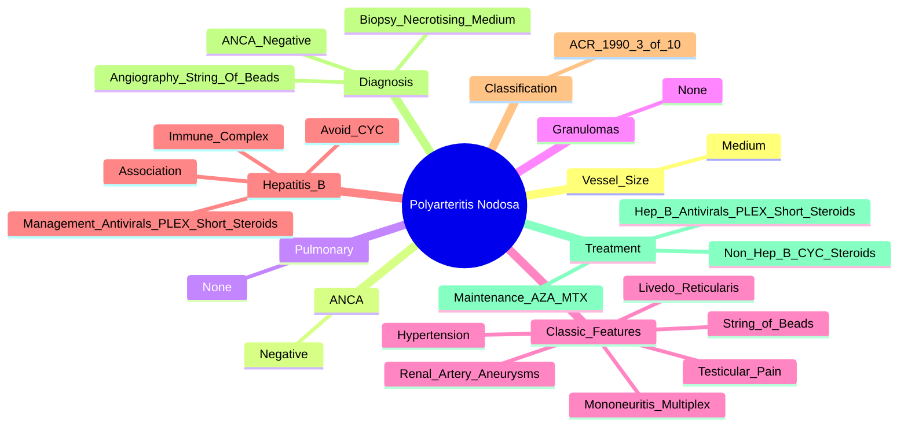

# Polyarteritis Nodosa (PAN)

> [!tip] **FCPS/MRCP Priority: HIGH**
> PAN = **medium vessel necrotising vasculitis**, **ANCA-negative**. **No pulmonary involvement** (key vs GPA/MPA/EGPA). **Renal artery aneurysms ("string of beads")**, **Hepatitis B association** (historically strong). **Mononeuritis multiplex**, **testicular pain**, **hypertension**. **CYC + steroids**; **Hep B PAN = antivirals + PLEX + short steroids**.

---

## Learning Objectives
By the end of this note you should be able to:
- [ ] Recognise PAN as **medium vessel ANCA-negative vasculitis** with **no pulmonary involvement**
- [ ] Apply **ACR 1990 classification criteria** for diagnosis
- [ ] Recognise **classic features**: renal artery aneurysms ("string of beads"), mononeuritis multiplex, testicular pain, livedo reticularis, hypertension, mesenteric ischaemia
- [ ] Differentiate from **GPA (c-ANCA, granulomas, ENT), MPA (p-ANCA, pulmonary), EGPA (asthma, eosinophilia)**
- [ ] Select treatment: **CYC + steroids**; **Hep B PAN = antivirals + PLEX + short steroids (avoid prolonged immunosuppression)**
- [ ] Screen for Hepatitis B association

---

## 1. Definition & Epidemiology

| Feature | Detail |
|---------|--------|
| **Definition** | **Necrotising vasculitis of medium-sized arteries** (renal, mesenteric, coronary, hepatic, testicular) — **ANCA-negative**, **no pulmonary involvement**, **no granulomas** |
| **Incidence** | **3-5/1,000,000/year** (declining with Hep B vaccination) |
| **Peak Onset** | **40-60 years** |
| **Sex Ratio** | **M > F** (1.5-2:1) |
| **Hepatitis B Association** | **Historically 30-50%** (now **<10%** in vaccinated populations) — immune complex-mediated |

---

## 2. Aetiology & Pathophysiology

```mermaid
flowchart LR
    A[Genetic Susceptibility] --> B[Environmental Trigger\nHepatitis B (Classical)\nOther Infections, Drugs]
    B --> C[Immune Complex Formation\nHBsAg-Anti-HBs\nor Other Antigens]
    C --> D[Complement Activation\nC5a → Neutrophil Recruitment]
    D --> E[Medium Artery Inflammation\nNecrotising Inflammation\nAneurysm Formation]
    E --> F[Clinical PAN\nRenal, Mesenteric, Coronary,\nHepatic, Testicular Arteries]
```

### Key Pathogenic Features
| Feature | Detail |
|---------|--------|
| **Immune Complexes** | **HBsAg-anti-HBs** (classical) — deposit in medium arteries |
| **Vessel Size** | **Medium** (renal, mesenteric, coronary, hepatic, testicular) — **NOT small** |
| **Inflammation** | **Necrotising** — transmural, fibrinoid necrosis, aneurysm formation |
| **No Granulomas** | Distinguishes from GPA/EGPA |
| **No Pulmonary Involvement** | **Key differentiator** from ANCA vasculitides |

---

## 3. Clinical Features

| System | Manifestation | FCPS/MRCP Pearl |
|--------|----------------|-----------------|
| **Constitutional** | Fever, weight loss, malaise, myalgia/arthralgia | Often first presentation |
| **Renal** | **Renal artery aneurysms/microaneurysms** → **hypertension** (often severe/diastolic), **renal infarcts**, flank pain | **"String of beads" on angiography** = classic |
| **Neurological** | **Mononeuritis multiplex** (common) — wrist/foot drop, asymmetric | **Peripheral neuropathy** vs GPA/MPA similar |
| **Gastrointestinal** | **Mesenteric ischaemia/infarction** — abdominal pain (post-prandial), GI bleed, perforation, pancreatitis | **Abdominal pain out of proportion** |
| **Genitourinary** | **Testicular pain/tenderness** (orchitis) — **sensitive but not specific** | **Orchitis = medium artery vasculitis of testicular artery** |
| **Skin** | **Livedo reticularis** (reticulate, persistent), **cutaneous nodules**, **palpable purpura** (less common) | Livedo = medium vessel |
| **Cardiac** | **Coronary arteritis** → MI, pericarditis, cardiomyopathy | |
| **Peripheral Vascular** | Limb ischaemia, claudication, aneurysms | |

> [!critical] **Key Negative Features (vs ANCA Vasculitides)**
> - **NO pulmonary involvement** (no haemorrhage, nodules, infiltrates)
> - **NO granulomas** (on biopsy)
> - **ANCA-negative** (c-ANCA/p-ANCA both negative)
> - **NO ENT involvement** (no sinusitis, saddle nose, subglottic stenosis)

---

## 4. Classification — **ACR 1990 Criteria**

**≥3 of 10 Criteria = Sensitivity 82%, Specificity 87%**

| Criterion | Description |
|-----------|-------------|
| 1. **Weight loss >4 kg** | Unintentional |
| 2. **Livedo reticularis** | Fixed, reticulate, persistent |
| 3. **Testicular pain/tenderness** | Orchitis (orchialgia) |
| 4. **Myalgia/Arthralgia** | Muscle/joint pain |
| 5. **Neuropathy** | **Mononeuritis multiplex** or polyneuropathy |
| 6. **Diastolic BP >90 mmHg** | Hypertension (renal artery involvement) |
| 7. **Elevated BUN/Cr** | Renal involvement (renal artery aneurysms) |
| 8. **Hepatitis B** | HBsAg or anti-HBc positive |
| 9. **Arteriography** | **Renal artery aneurysms/microaneurysms** ("string of beads") |
| 10. **Biopsy** | **Necrotising inflammation of medium artery** (no granulomas) |

---

## 5. Hepatitis B-Associated PAN

| Aspect | Detail |
|--------|--------|
| **Mechanism** | **Immune complex** (HBsAg-anti-HBs) deposition in medium arteries |
| **Historical Prevalence** | **30-50% of PAN** (now **<10%** with vaccination) |
| **Presentation** | Often **acute**, severe, shortly after acute HBV |
| **Serology** | **HBsAg+, anti-HBc IgM+, HBeAg+** (active replication) |
| **Management** | **Antivirals + Plasmapheresis + Short-course steroids** — **AVOID prolonged immunosuppression** (CYC contraindicated in active HBV) |

> [!critical] **Hep B PAN Management**
> - **Antivirals (entecavir/tenofovir)** — cornerstone
> - **Plasmapheresis** (removes immune complexes) — acute phase
> - **Short-course steroids** (pred 1mg/kg → rapid taper) — **NO prolonged CYC**
> - **Vaccination era**: Now rare (<10% of PAN)

---

## 6. Investigations

| Test | Finding in PAN |
|------|----------------|
| **ANCA (c-ANCA/p-ANCA)** | **Negative** (key differentiator) |
| **ESR/CRP** | Markedly elevated |
| **FBC** | Leukocytosis, anaemia, thrombocytosis |
| **LFT** | Elevated if hepatic artery involvement |
| **Renal Function** | Elevated Cr, hypertension |
| **Hepatitis B Serology** | **HBsAg, anti-HBc IgM, HBeAg** — essential screen |
| **Urine** | Haematuria, proteinuria (renal artery involvement) |
| **Angiography (Renal/Mesenteric)** | **"String of beads"** — **multiple microaneurysms** in renal arteries |
| **Biopsy (Artery/Skin/Nerve)** | **Necrotising inflammation of medium artery** — **no granulomas** |
| **Nerve Conduction** | Axonal neuropathy (mononeuritis multiplex) |

> [!critical] **Angiography "String of Beads"**
> - **Multiple microaneurysms** alternating with stenoses in **renal arteries**
> - **Pathognomonic for PAN** (also seen in fibromuscular dysplasia, but context differs)

---

## 7. Management

```mermaid
flowchart TD
    A[PAN Diagnosis] --> B{Hepatitis B Associated?}
    B -->|Yes| C[**Antivirals (Entecavir/Tenofovir)**\n+ **Plasmapheresis** (acute)\n+ **Short-course Steroids**\nPred 1mg/kg → taper 4-8w\n**AVOID CYC**]
    B -->|No| D[**CYC + Steroids**\nInduction: CYC 2mg/kg/day oral\nor Pulse CYC IV 500-1000mg/m² q2-4wk\n+ Pred 1mg/kg → taper]
    C --> E[Monitor: HBV DNA, Liver, BP, Renal]
    D --> E
    E --> F[Maintenance: AZA 2mg/kg/day\nor MTX 15-25mg/wk\nTaper Steroids to Stop]
    F --> G[Relapse: Re-induce with CYC/RTX]
```

### Standard PAN (Non-Hep B) Regimen

| Phase | Regimen |
|-------|---------|
| **Induction** | **Cyclophosphamide** (oral 2mg/kg/day **OR** IV pulse 500-1000mg/m² q2-4wk) **+ Prednisolone 1mg/kg** |
| **Maintenance** | **Azathioprine 2mg/kg/day** or **Methotrexate 15-25mg/week** — taper steroids to stop |
| **Duration** | **12-18 months** minimum; relapse → re-induction with CYC or RTX |

### Hepatitis B PAN Regimen
| Component | Detail |
|-----------|--------|
| **Antivirals** | **Entecavir 0.5mg daily** or **Tenofovir 245mg daily** — **lifelong** |
| **Plasmapheresis** | **1.5 plasma volume ×5-7 exchanges** (acute severe) |
| **Steroids** | **Pred 1mg/kg** → **rapid taper over 4-8 weeks** |
| **Avoid** | **CYC, prolonged immunosuppression** (reactivates HBV) |

---

## 8. Differential Diagnosis

| Feature | **PAN** | **GPA** | **MPA** | **EGPA** |
|---------|---------|---------|---------|----------|
| **ANCA** | **Negative** | **c-ANCA/PR3+** | **p-ANCA/MPO+** | **p-ANCA/MPO 40-60%** |
| **Vessel Size** | **Medium** | Small (ANCA) | Small (ANCA) | Small (ANCA) |
| **Granulomas** | **No** | **Yes** | **No** | **Yes (eosinophilic)** |
| **Pulmonary** | **No** | **Yes** (nodules, haemorrhage) | **Yes** (haemorrhage, fibrosis) | **Yes** (asthma, infiltrates) |
| **ENT** | **No** | **Yes** (sinusitis, saddle nose) | **No** | **Yes** (rhinitis, polyps) |
| **Eosinophilia** | No | No | No | **Yes (>1.5×10⁹/L)** |
| **Hepatitis B** | **Association** | No | No | No |
| **Testicular Pain** | **Yes** | No | No | No |

---

## 9. FCPS/MRCP High-Yield Summary

| Topic | Key Points |
|-------|------------|
| **Vessel Size** | **Medium** (renal, mesenteric, coronary, hepatic, testicular) |
| **ANCA** | **Negative** (key vs GPA/MPA/EGPA) |
| **Pulmonary** | **No involvement** (key differentiator) |
| **Granulomas** | **No** |
| **Classic Features** | **Renal artery aneurysms ("string of beads"), mononeuritis multiplex, testicular pain, livedo, hypertension** |
| **Hepatitis B** | **Historically 30-50%** (now <10%); **immune complex**; **antivirals + PLEX + short steroids** |
| **ACR Criteria** | **≥3/10**: weight loss, livedo, testicular pain, myalgia/arthralgia, neuropathy, hypertension, renal, Hep B, angiography, biopsy |
| **Angiography** | **"String of beads" (renal artery microaneurysms)** — pathognomonic |
| **Treatment (Non-Hep B)** | **CYC + steroids** → AZA/MTX maintenance |
| **Treatment (Hep B)** | **Antivirals + PLEX + short steroids** — **AVOID CYC** |

---

## 10. Viva Questions (MRCP PACES / FCPS)

| Question | Expected Answer |
|----------|----------------|
| "What is the key feature that distinguishes PAN from GPA and MPA?" | **ANCA-negative** and **NO pulmonary involvement** (no pulmonary haemorrhage, nodules, infiltrates). |
| "What is the classic angiographic finding in PAN?" | **"String of beads"** — multiple renal artery microaneurysms with alternating stenoses. |
| "What are the ACR 1990 criteria for PAN?" | **≥3 of 10**: weight loss >4kg, livedo reticularis, testicular pain, myalgia/arthralgia, mononeuritis multiplex, diastolic BP >90, elevated BUN/Cr, Hepatitis B, angiography (aneurysms), biopsy (necrotising medium artery). |
| "How does PAN management differ if Hepatitis B is associated?" | **Antivirals (entecavir/tenofovir) + Plasmapheresis + short-course steroids** — **AVOID cyclophosphamide** (prolonged immunosuppression reactivates HBV). |
| "What is the classic presentation of testicular involvement in PAN?" | **Orchitis/testicular pain/tenderness** — medium artery vasculitis of testicular artery; **sensitive but not specific**. |
| "What is the 'string of beads' appearance in PAN?" | **Renal artery microaneurysms** with alternating stenoses on angiography — **pathognomonic for PAN** (also seen in fibromuscular dysplasia). |
| "How do you differentiate PAN from GPA?" | PAN: **ANCA-negative, NO pulmonary, NO granulomas, NO ENT, testicular pain, renal artery aneurysms**. GPA: **c-ANCA+, granulomas, ENT (saddle nose, subglottic), pulmonary nodules/cavities**. |
| "What is the treatment for non-Hep B PAN?" | **Cyclophosphamide + Prednisolone** induction → **Azathioprine/Methotrexate** maintenance. |
| "Why is cyclophosphamide avoided in Hepatitis B-associated PAN?" | **Prolonged immunosuppression reactivates HBV** → risk of fulminant hepatitis. Use **antivirals + plasmapheresis + short steroids** instead. |
| "What is the significance of livedo reticularis in PAN?" | **Fixed, persistent, reticulate livedo** = medium vessel cutaneous involvement; one of ACR criteria. |

---

## 11. Confusions & Mnemonics

| Confusion | Clarification |
|-----------|---------------|
| **PAN vs GPA** | PAN = **ANCA-negative, NO pulmonary, NO granulomas, NO ENT, testicular pain**. GPA = **c-ANCA+, granulomas, ENT, pulmonary**. |
| **PAN vs MPA** | PAN = **medium vessel, ANCA-negative, NO pulmonary, testicular pain, renal artery aneurysms**. MPA = **small vessel, p-ANCA+, pulmonary haemorrhage**. |
| **PAN vs EGPA** | PAN = **medium vessel, ANCA-negative, NO asthma/eosinophilia**. EGPA = **small vessel, asthma, eosinophilia, p-ANCA 40-60%**. |
| **Hep B PAN vs Non-Hep B PAN** | Hep B PAN = **antivirals + PLEX + short steroids, AVOID CYC**. Non-Hep B = **CYC + steroids → AZA/MTX maintenance**. |
| **Microaneurysms vs Atherosclerosis** | **"String of beads" = multiple microaneurysms** in PAN; atherosclerosis = focal stenoses, calcification, not beaded. |
| **Testicular Pain** | **Orchitis** in PAN = medium artery vasculitis of testicular artery; **sensitive but not specific**. |

**Mnemonic: PAN = "MEDIUM, ANCA NEG, NO LUNG"**
- **M**edium vessel
- **E**D (ANCA negative)
- **D**oesn't involve lung
- **I**U (immune complex, Hep B)
- **U**N... No granulomas
- **M**edium vessel only

**Mnemonic: ACR Criteria = "W-L-T-M-N-B-H-A-B"**
- **W**eight loss >4kg
- **L**ivedo reticularis
- **T**esticular pain
- **M**yalgia/Arthralgia
- **N**europathy (mononeuritis multiplex)
- **B**P diastolic >90
- **H**igh BUN/Cr
- **A**ngiography (string of beads)
- **B**iopsy (necrotising medium artery)

**Mnemonic: Hep B PAN = "ANTI-VIRAL + PLEX + STEROID (SHORT)"**
- **ANTI**-virals (entecavir/tenofovir)
- **PLEX** (plasmapheresis)
- **STEROID** (short course, taper fast)
- **NO CYC**

**Mnemonic: Classic PAN Features = "R-T-H-L"**
- **R**enal artery aneurysms (string of beads)
- **T**esticular pain
- **H**ypertension (renal artery)
- **L**ivedo reticularis / **L**imb ischaemia

**Mnemonic: PAN vs ANCA Vasculitis = "NO PIG"**
- **N**O **P**ulmonary **I**nvolvement
- **N**O **G**ranulomas
- **A**NCA **N**egative

---

## 12. Mind Map



---

## 13. One-Page Revision Card

| Domain | Key Points |
|--------|------------|
| **Vessel** | **Medium** (renal, mesenteric, coronary, hepatic, testicular) |
| **ANCA** | **Negative** |
| **Pulmonary** | **None** |
| **Granulomas** | **None** |
| **Key Features** | **Renal artery aneurysms ("string of beads")**, mononeuritis multiplex, testicular pain, livedo, hypertension |
| **Hep B** | **Association** (immune complex); **antivirals + PLEX + short steroids**; **AVOID CYC** |
| **ACR Criteria** | ≥3/10: weight loss, livedo, testicular pain, myalgia/arthralgia, neuropathy, HTN, renal, Hep B, angiography, biopsy |
| **Angiography** | **"String of beads" (renal artery microaneurysms)** |
| **Biopsy** | Necrotising inflammation of **medium artery** (no granulomas) |
| **Treatment (Non-Hep B)** | **CYC + steroids** → AZA/MTX maintenance |
| **Treatment (Hep B)** | **Antivirals + PLEX + short steroids** — **NO CYC** |

---

## 14. Spaced Repetition Trackers

| Review Interval | Date Completed | Confidence (1-5) | Notes |
|-----------------|----------------|------------------|-------|
| 24 hours | | | |
| 7 days | | | |
| 15 days | | | |
| 30 days | | | |
| 90 days | | | |

---

## 15. Self-Test Scorecard

| Section | Score /5 | Last Attempt |
|---------|----------|--------------|
| ACR Criteria Application | | |
| PAN vs GPA/MPA/EGPA | | |
| Hepatitis B PAN Management | | |
| Angiography Interpretation | | |
| Testicular Pain Significance | | |
| Treatment Algorithm | | |
| Viva Questions | | |

---

## Local Navigation
- **Parent Heading**: [[../Vasculitis|Vasculitis]]
- **Parent Topic Group**: [[Primary systemic vasculitides overview]]
- **Chapter Map**: [[../Davidson Chapter 26 - Rheumatology Hierarchy|Rheumatology Hierarchy]]
- **Chapter MOC**: [[../Rheumatology MOC|Rheumatology MOC]]
- **Drug Reference**: [[../../Clinical Approach to Musculoskeletal Disease/Drugs in rheumatology|Drugs in rheumatology]]
- **Related**: [[Granulomatosis with polyangiitis (GPA)]] · [[Microscopic polyangiitis (MPA)]] · [[Eosinophilic granulomatosis with polyangiitis (EPA)]]
---

> Auto-generated study sections for "Vasculitis" — Ch 25: Rheumatology & Bone Disease.

## Flashcards (21 generated)

- Q: What is the definition of Vasculitis?
  A: | Definition | Necrotising vasculitis of medium-sized arteries (renal, mesenteric, coronary, hepatic, testicular) — ANCA-negative, no pulmonary involvement, no granulomas |
- Q: What is Immune Complexes of Vasculitis?
  A: HBsAg-anti-HBs (classical) — deposit in medium arteries
- Q: What is Vessel Size of Vasculitis?
  A: Medium (renal, mesenteric, coronary, hepatic, testicular) — NOT small
- Q: What is Inflammation of Vasculitis?
  A: Necrotising — transmural, fibrinoid necrosis, aneurysm formation
- Q: What is No Granulomas of Vasculitis?
  A: Distinguishes from GPA/EGPA
- Q: What is No Pulmonary Involvement of Vasculitis?
  A: Key differentiator from ANCA vasculitides
- Q: What is the mechanism of Vasculitis?
  A: Immune complex (HBsAg-anti-HBs) deposition in medium arteries
- Q: What is the epidemiology of Vasculitis?
  A: 30-50% of PAN (now <10% with vaccination)
- Q: What are the clinical features of Vasculitis?
  A: Often acute, severe, shortly after acute HBV
- Q: What is Serology of Vasculitis?
  A: HBsAg+, anti-HBc IgM+, HBeAg+ (active replication)
- Q: How is Vasculitis managed?
  A: Antivirals + Plasmapheresis + Short-course steroids — AVOID prolonged immunosuppression (CYC contraindicated in active HBV)
- Q: What is Immune Complexes of Vasculitis?
  A: HBsAg-anti-HBs (classical) — deposit in medium arteries
- Q: What is Vessel Size of Vasculitis?
  A: Medium (renal, mesenteric, coronary, hepatic, testicular) — NOT small
- Q: What is Inflammation of Vasculitis?
  A: Necrotising — transmural, fibrinoid necrosis, aneurysm formation
- Q: What is No Granulomas of Vasculitis?
  A: Distinguishes from GPA/EGPA
- Q: What is No Pulmonary Involvement of Vasculitis?
  A: Key differentiator from ANCA vasculitides
- Q: What is the mechanism of Vasculitis?
  A: Immune complex (HBsAg-anti-HBs) deposition in medium arteries
- Q: What is the epidemiology of Vasculitis?
  A: 30-50% of PAN (now <10% with vaccination)
- Q: What are the clinical features of Vasculitis?
  A: Often acute, severe, shortly after acute HBV
- Q: What is Serology of Vasculitis?
  A: HBsAg+, anti-HBc IgM+, HBeAg+ (active replication)
- Q: How is Vasculitis managed?
  A: Antivirals + Plasmapheresis + Short-course steroids — AVOID prolonged immunosuppression (CYC contraindicated in active HBV)

## MCQs (1 generated)

1. **Which of the following best describes Vasculitis?**
   A. **| Definition | Necrotising vasculitis of medium-sized arteries (renal, mesenteric, coronary, hepatic, testicular) — ANCA-negative, no pulmonary involvement, no granulomas |**
   B. An unrelated condition not matching the clinical picture of Vasculitis
   C. A complication seen late in the disease course of Vasculitis
   D. A condition that mimics Vasculitis but has a different underlying cause

## SBA Questions (1 generated)

1. A patient with suspected Vasculitis presents with: Incidence — 3-5/1,000,000/year (declining with Hep B vaccination); Peak Onset — 40-60 years; Sex Ratio — M > F (1.5-2:1). What is the most likely diagnosis?
   A. **Vasculitis**
   B. A condition that mimics Vasculitis but is not the same entity
   C. A complication of Vasculitis rather than the primary diagnosis
   D. An unrelated condition in the same clinical category as Vasculitis

