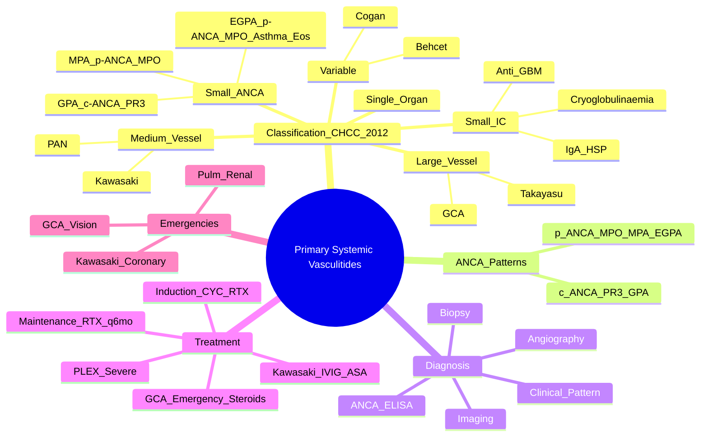

# Primary Systemic Vasculitides — Overview & Classification

> [!tip] **FCPS/MRCP Priority: CRITICAL**
> **CHCC 2012 classification by vessel size = exam staple**. **ANCA patterns**: **c-ANCA/PR3 = GPA**, **p-ANCA/MPO = MPA/EGPA**. **Key differentiators**: GPA (granulomas, ENT), MPA (no granulomas/ENT), EGPA (asthma+eos), PAN (medium vessel, no lung), GCA (cranial), Takayasu (young women, aortic arch). **Treat-to-target** with induction → maintenance.

---

## Learning Objectives
By the end of this note you should be able to:
- [ ] Classify vasculitides by **CHCC 2012 vessel size** and apply to clinical vignettes
- [ ] Apply **ANCA patterns** (c-ANCA/PR3 = GPA; p-ANCA/MPO = MPA/EGPA) in diagnosis
- [ ] Differentiate primary vasculitides by clinical features, ANCA, vessel size
- [ ] Apply **induction → maintenance** treatment paradigm across vasculitides
- [ ] Recognise **emergency presentations**: pulmonary-renal syndrome, GCA vision loss, Kawasaki coronary aneurysms

---

## 1. CHCC 2012 Classification — **Exam Staple**

```mermaid
flowchart TD
    A[Primary Systemic Vasculitis] --> B{Vessel Size}
    B -->|Large| C[GCA, Takayasu]
    B -->|Medium| D[PAN, Kawasaki]
    B -->|Small - ANCA| E[GPA (c-ANCA/PR3), MPA (p-ANCA/MPO), EGPA (p-ANCA/MPO)]
    B -->|Small - Immune Complex| F[IgA vasculitis/HSP, Cryoglobulinaemic, Anti-GBM, Hypocomplementemic]
    B -->|Variable| G[Behçet's, Cogan's]
    B -->|Single Organ| H[Cutaneous, Isolated aortitis, etc.]
```

### CHCC 2012 Summary Table

| Vessel Size | Conditions | Key ANCA | Hallmark Features |
|-------------|------------|----------|-------------------|
| **Large Vessel** | GCA, Takayasu | Usually negative | Cranial ischaemia (GCA) / Aortic arch (Takayasu) |
| **Medium Vessel** | PAN, Kawasaki | Usually negative | Renal artery aneurysms (PAN) / Coronary aneurysms (Kawasaki) |
| **Small Vessel (ANCA-associated)** | **GPA** (c-ANCA/PR3), **MPA** (p-ANCA/MPO), **EGPA** (p-ANCA/MPO) | **c-ANCA/PR3 = GPA**, **p-ANCA/MPO = MPA/EGPA** | Granulomas/ENT (GPA), Pulmonary-renal (MPA), Asthma/eos (EGPA) |
| **Small Vessel (Immune Complex)** | IgA vasculitis (HSP), Cryoglobulinaemic, Anti-GBM, Hypocomplementemic | IgA, Cryoglobulins, Anti-GBM, Low C3/C4 | Palpable purpura (HSP), Cryoglobulins, Anti-GBM, Urticaria |
| **Variable Vessel** | Behçet's, Cogan's | Variable | Oral/genital ulcers + uveitis (Behçet's) |
| **Single Organ** | Cutaneous leukocytoclastic, Isolated aortitis, etc. | Usually negative | Organ-specific |

---

## 2. ANCA Patterns — **Diagnostic Linchpin**

| ANCA Pattern | Target | Primary Association | Sensitivity/Specificity |
|--------------|--------|---------------------|------------------------|
| **c-ANCA (cytoplasmic)** | **PR3 (Proteinase 3)** | **GPA (Granulomatosis with Polyangiitis)** | 90% active GPA, 60% remission; >95% specificity |
| **p-ANCA (perinuclear)** | **MPO (Myeloperoxidase)** | **MPA** (Microscopic Polyangiitis), **EGPA** (Eosinophilic Granulomatosis with Polyangiitis) | 70-80% MPA, 40-60% EGPA; 70-80% specificity |
| **Atypical p-ANCA** | BPI, lactoferrin, etc. | IBD (UC > Crohn), PSC, drug-induced | Not vasculitis-specific |

> [!critical] **ANCA = Diagnostic + Monitoring Tool**
> - **c-ANCA/PR3 = GPA** (granulomas, ENT)
> - **p-ANCA/MPO = MPA** (no granulomas, no ENT) **or EGPA** (asthma + eos)
> - **ANCA-negative vasculitis** = 10-20% GPA/MPA/EGPA — **biopsy if high suspicion**
> - **Rising titres may predict relapse** but treat clinically, not by titre alone

---

## 3. Primary Vasculitides — Quick Comparison

### Large Vessel
| Feature | **GCA** | **Takayasu** |
|---------|---------|--------------|
| **Age** | >50 (peak 70-80) | **<40** (peak 20-30) |
| **Sex** | F:M 2-3:1 | **F:M 9:1** |
| **Key Features** | **Temporal headache, jaw claudication, visual loss (AION/CRAO), PMR overlap** | **Pulseless, aortic arch branches, hypertension, bruits** |
| **ANCA** | Negative | Negative |
| **Emergency** | **Vision loss → IV MP immediately** | Aortic aneurysm/dissection, stroke |

### Medium Vessel
| Feature | **PAN** | **Kawasaki** |
|---------|---------|--------------|
| **Age** | 40-60 | **<5 years** (peak 1-2) |
| **Vessel** | **Medium** (renal, mesenteric, coronary) | Medium |
| **Key** | **Renal artery aneurysms ("string of beads"), mononeuritis multiplex, testicular pain, NO lung** | **Fever ≥5d + 4/5 criteria (conjunctivitis, oral, rash, extremities, lymphadenopathy), coronary aneurysms** |
| **Hepatitis B** | Association (immune complex) | No |
| **ANCA** | Negative | Negative |

### Small Vessel — ANCA-Associated
| Feature | **GPA** (c-ANCA/PR3) | **MPA** (p-ANCA/MPO) | **EGPA** (p-ANCA/MPO) |
|---------|---------------------|---------------------|---------------------|
| **Granulomas** | **Yes** (necrotising) | **No** | **Eosinophilic** |
| **ENT** | **Yes** (sinusitis, saddle nose, subglottic stenosis) | **No** | No (rhinitis, polyps) |
| **Lung** | Nodules, cavities, haemorrhage | Haemorrhage, fibrosis | **Asthma, eosinophilic infiltrates** |
| **Renal** | Pauci-immune GN | Pauci-immune GN (often severe) | Less common |
| **Eosinophilia** | No | No | **Yes (>1.5×10⁹/L)** |
| **Asthma** | No | No | **Yes** |
| **ANCA** | **c-ANCA/PR3** (90%) | **p-ANCA/MPO** (70-80%) | **p-ANCA/MPO** (40-60%) |

> [!critical] **GPA vs MPA vs EGPA**
> - **GPA = c-ANCA/PR3 + Granulomas + ENT (saddle nose, subglottic stenosis)**
> - **MPA = p-ANCA/MPO + NO granulomas + NO ENT + pulmonary-renal common**
> - **EGPA = p-ANCA/MPO + Asthma + Eosinophilia + Allergy**

### Immune Complex Small Vessel
| Condition | Key Features |
|-----------|--------------|
| **IgA Vasculitis (HSP)** | Children, **palpable purpura (gravity-dependent)**, arthritis, abdominal pain, **IgA nephropathy**; **Platelets normal** |
| **Cryoglobulinaemic** | **Type I** (monoclonal, lymphoproliferative), **Type II/III** (mixed, HCV); Purpura, neuropathy, MPGN |
| **Anti-GBM** | Anti-GBM antibodies, **pulmonary-renal syndrome**, linear IgG on biopsy |
| **Hypocomplementemic Urticarial** | Urticaria + **low C1q**, COPD, uveitis |

---

## 3. Variable Vessel
| Feature | **Behçet's** | **Cogan's** |
|---------|-------------|-------------|
| **Key** | **Oral/genital ulcers + uveitis + skin + pathergy** | Interstitial keratitis + audiovestibular dysfunction |
| **Vessel** | Variable (arteries + veins, all sizes) | Variable |
| **Key Test** | **Pathergy test**, **HLA-B51** | Audiology, ophthalmology |
| **ANCA** | Usually negative | Negative |

---

## 4. Diagnostic Approach

```mermaid
flowchart TD
    A[Suspected Vasculitis] --> B{Clinical Pattern}
    B -->|Cranial symptoms >50| C[GCA → ESR/CRP, Temporal artery biopsy, US halo sign]
    B -->|Young woman, pulseless, hypertension| D[Takayasu → Angio/MRI/PET, ESR/CRP]
    B -->|Renal + Pulmonary| E[ANCA + Biopsy]
    E -->|c-ANCA/PR3| F[GPA → ENT, granulomas]
    E -->|p-ANCA/MPO| G{EGPA features?}
    G -->|Asthma + Eos| H[EGPA]
    G -->|No asthma/eos| I[MPA]
    B -->|Medium vessel clues| J[PAN → Angio renal "string of beads", Hep B screen]
    B -->|Child + Fever 5d + 4/5 criteria| K[Kawasaki → Echo coronary, IVIG+ASA]
    B -->|Child + Purpura + Abd pain| L[IgA vasculitis (HSP) → IgA deposits, normal platelets]
    B -->|Oral/Genital ulcers + Uveitis| M[Behçet's → Pathergy, HLA-B51]
```

---

## 5. Investigations

| Test | Role | Key Interpretation |
|------|------|-------------------|
| **ANCA (ELISA: PR3, MPO)** | **Primary serology** | **c-ANCA/PR3 = GPA; p-ANCA/MPO = MPA/EGPA** |
| **ESR/CRP** | Inflammation | Markedly elevated in active disease |
| **Renal Function** | Renal involvement | RPGN = RPGN |
| **Urine** | Renal + immune complex | Haematuria, proteinuria, RBC casts, cryoglobulins |
| **Biopsy** | **Gold standard** | **Necrotising inflammation, granulomas, immune deposits** |
| **Angiography** | Medium/Large vessel | Renal artery aneurysms (PAN "string of beads"), Takayasu aortic arch |
| **Imaging (CT/MRI/PET-CT)** | Large vessel, extent | Aortic arch (Takayasu), large vessel GCA |
| **Echocardiography** | Kawasaki, cardiac | Coronary aneurysms, valvular |
| **Pathergy Test** | Behçet's | Needle → pustule 24-48h |
| **HLA-B27 / B51** | SpA / Behçet's | Supportive, not diagnostic |

---

## 5. Treatment Paradigm — **Induction → Maintenance**

```mermaid
flowchart TD
    A[Vasculitis Diagnosis] --> B{Severity / Organ Threat}
    B -->|Severe (RPGN, Pulm Haem, CNS, Vision)| C[**Induction: CYC IV + Pulse MP OR RTX + Pulse MP**\n± PLEX (PEXIVAS)]
    B -->|Non-Severe| D[Induction: CYC Oral + Pred OR RTX + Pred]
    C --> E[**Maintenance: Rituximab q6mo > AZA/MTX**]
    D --> E
    E --> F[Monitor: q3mo clinical + ANCA + Cr + Urine]
    F --> G{Relapse?}
    G -->|Yes| H[Re-induction: RTX preferred]
    G -->|No| I[Taper Steroids → Stop\nContinue RTX q6mo 2-5yr]
```

### Induction Regimens
| Regimen | Indication | Details |
|---------|------------|---------|
| **CYC IV Pulse** | **Severe** (RPGN, pulm haemorrhage, life-threatening) | 500-1000mg/m² IV q2-4wk ×3-6mo + Pulse MP 500-1000mg ×3; **Mesna + hydration**; gonadoprotection |
| **CYC Oral** | Non-severe | 2mg/kg/day + pred taper; more bladder toxicity |
| **Rituximab** | **All severity** (RAVE: non-inferior to CYC) | 375mg/m² IV weekly ×4 (or 1000mg ×2 2wks apart) + pred taper; **preferred for relapsing, childbearing, CYC contraindicated** |
| **PLEX** | Severe pulm haemorrhage / RPGN (Cr >5.6) | PEXIVAS: 7 exchanges ×1.5 plasma volume — reduces ESKD |

### Maintenance
| Drug | Dose | Duration | Evidence |
|------|------|----------|----------|
| **Rituximab** | 500mg IV q6mo | **2-5 years** | **MAINRITSAN**: RTX superior to AZA for relapse-free survival |
| **Azathioprine** | 2mg/kg/day | 2-5 years | If RTX contraindicated; TPMT test |
| **Methotrexate** | 15-25mg weekly | Limited use | Not for renal involvement |

> [!critical] **ANCA-negative vasculitis** (10-20%) — diagnose by biopsy, treat same as ANCA+.

---

## 6. Emergency Presentations

| Emergency | Vasculitis | Immediate Action |
|-----------|------------|------------------|
| **Vision Loss** | GCA | **IV MP 1000mg ×3 days IMMEDIATELY** — do not delay for biopsy |
| **Pulmonary-Renal Syndrome** | GPA, MPA, anti-GBM | **IV MP 1g ×3 + CYC/RTX + PLEX** (PEXIVAS) |
| **Coronary Aneurysms** | Kawasaki | **IVIG 2g/kg + Aspirin within 10 days** |
| **Pulmonary Haemorrhage** | GPA, MPA, anti-GBM, SLE | **IV MP + CYC/RTX + PLEX** |
| **Acute Vision Loss** | GCA, Retinal vasculitis (Behçet's, SLE) | **IV MP + urgent ophthalmology** |
| **Acute Limb Ischaemia** | PAN, Takayasu | **Emergent vascular surgery + immunosuppression** |

---

## 6. FCPS/MRCP High-Yield Summary

| Topic | Key Points |
|-------|------------|
| **CHCC 2012** | Classify by **vessel size**: Large (GCA, Takayasu), Medium (PAN, Kawasaki), Small ANCA (GPA c-ANCA, MPA p-ANCA, EGPA p-ANCA), Small IC (IgA/HSP, Cryo), Variable (Behçet's) |
| **ANCA** | **c-ANCA/PR3 = GPA** (granulomas, ENT); **p-ANCA/MPO = MPA** (no granulomas, no ENT) **or EGPA** (asthma+eos) |
| **GPA** | c-ANCA/PR3, **granulomas, ENT** (saddle nose, subglottic), pulmonary-renal |
| **MPA** | p-ANCA/MPO, **no granulomas, no ENT**, renal-limited 30-40%, pulmonary-renal |
| **EGPA** | p-ANCA/MPO (40-60%), **asthma + eosinophilia**, allergic rhinitis, mononeuritis |
| **PAN** | Medium vessel, **ANCA-negative**, **NO lung**, renal artery aneurysms "string of beads", Hep B association |
| **Kawasaki** | <5y, fever ≥5d + 4/5 criteria, **coronary aneurysms**, IVIG 2g/kg <10d |
| **GCA** | >50, headache, jaw claudication, visual loss, **emergency steroids**, temporal artery biopsy |
| **Takayasu** | Young women, aortic arch, pulseless, hypertension, aortitis |
| **IgA Vasculitis (HSP)** | Children, palpable purpura (gravity-dependent), arthritis, abdominal pain, IgA nephropathy; **platelets normal** |
| **Behçet's** | Oral/genital ulcers + uveitis + skin + pathergy; HLA-B51; Silk Road; vascular thrombosis |
| **Treatment** | **Induction: CYC/RTX + steroids** → **Maintenance: RTX q6mo > AZA**; PLEX for severe |

---

## 7. Viva Questions (MRCP PACES / FCPS)

| Question | Expected Answer |
|----------|----------------|
| "What is the CHCC 2012 classification of vasculitis by vessel size?" | Large (GCA, Takayasu), Medium (PAN, Kawasaki), Small ANCA (GPA, MPA, EGPA), Small IC (IgA, Cryo, Anti-GBM), Variable (Behçet's, Cogan's), Single organ. |
| "What ANCA pattern is seen in GPA vs MPA vs EGPA?" | **GPA: c-ANCA/PR3**; **MPA: p-ANCA/MPO**; **EGPA: p-ANCA/MPO** (40-60%). |
| "How do you differentiate GPA from MPA?" | **GPA**: c-ANCA/PR3, **granulomas**, **ENT** (sinusitis, saddle nose, subglottic). **MPA**: p-ANCA/MPO, **no granulomas**, **no ENT**, renal-pulmonary. |
| "What is the classic presentation of PAN?" | Medium vessel, **ANCA-negative**, **no pulmonary involvement**, **renal artery aneurysms (string of beads)**, testicular pain, mononeuritis multiplex, Hep B association. |
| "What is the management of Kawasaki disease?" | **IVIG 2g/kg single infusion within 10 days of fever** + **Aspirin** (high-dose anti-inflammatory → low-dose antiplatelet). Echo surveillance 2w, 6w, 1y. |
| "How do you manage GCA with visual loss?" | **IV methylprednisolone 1000mg ×3 days IMMEDIATELY** — do not delay for biopsy. Urgent ophthalmology. Temporal artery biopsy within 2-4 weeks. |
| "What is the treatment algorithm for ANCA-associated vasculitis?" | **Induction**: Severe = CYC IV + Pulse MP ± PLEX; Non-severe = CYC oral or RTX + Pred. **Maintenance: RTX q6mo > AZA/MTX** (2-5 years). |
| "What is the significance of ANCA-negative vasculitis?" | ~10-20% of GPA/MPA/EGPA. **Diagnose by biopsy** (pauci-immune necrotising GN, granulomas). Treat same as ANCA+. |
| "How does EGPA differ from GPA and MPA?" | EGPA = **asthma + eosinophilia (+ p-ANCA/MPO 40-60%)**. GPA = granulomas + ENT + c-ANCA. MPA = p-ANCA, no granulomas/ENT. |
| "What is the 'string of beads' appearance in PAN?" | **Renal artery microaneurysms with alternating stenoses** on angiography — pathognomonic for PAN. |

---

## 8. Confusions & Mnemonics

| Confusion | Clarification |
|-----------|---------------|
| **GPA vs MPA** | **GPA = c-ANCA/PR3, granulomas, ENT (saddle nose, subglottic)**. **MPA = p-ANCA/MPO, no granulomas, no ENT, no saddle nose**. |
| **MPA vs EGPA** | MPA = p-ANCA/MPO, no asthma/eos. EGPA = **asthma + eosinophilia + p-ANCA/MPO (40-60%)**, allergic rhinitis. |
| **PAN vs GPA/MPA** | PAN = **medium vessel, ANCA-negative, NO lung, testicular pain, renal artery aneurysms, Hep B association**. |
| **ANCA-negative vasculitis** | ~10-20% GPA/MPA/EGPA. **Biopsy if suspicion**. Treat same as ANCA+. |
| **Renal-limited MPA** | Pauci-immune GN **without systemic features** — 30-40% of MPA. |
| **Kawasaki vs Scarlet Fever** | Kawasaki = fever ≥5d + 4/5 criteria, **no streptococcal evidence**. Scarlet = streptococcal, sandpaper rash, circumoral pallor. |

**Mnemonic: Vessel Size = "L-M-S"**
- **L**arge = GCA, Takayasu
- **M**edium = PAN, Kawasaki
- **S**mall = ANCA (GPA, MPA, EGPA), IC (IgA, Cryo), Variable

**Mnemonic: ANCA = "C-P"**
- **C**-ANCA / **P**R3 = **GPA**
- **P**-ANCA / **M**PO = **MPA** / **EGPA**

**Mnemonic: GPA = "GRANULOMA, ENT, C-ANCA"**
- **GRANULOMA** (necrotising)
- **ENT** (sinusitis, saddle nose, subglottic)
- **C-ANCA** (PR3)

**Mnemonic: MPA = "MICRO, NO GRANULOMA, P-ANCA"**
- **MICRO**scopic (small vessel)
- **NO** granulomas
- **NO** ENT
- **P-ANCA** (MPO)

**Mnemonic: EGPA = "A-E-P"**
- **A**sthma
- **E**osinophilia
- **P**-ANCA (MPO, 40-60%)

**Mnemonic: PAN = "MEDIUM, ANCA NEG, NO LUNG"**
- **M**edium vessel
- **E**D (ANCA negative)
- **D**oesn't involve lung
- **I**U (immune complex, Hep B)
- **U**N... No granulomas
- **M**edium vessel only

**Mnemonic: Kawasaki = "F-C-R-E-L" (5 Criteria)**
- **F**ever ≥5d
- **C**onjunctivitis (bilateral, non-purulent)
- **R**ash (polymorphous)
- **E**xtremity changes (erythema/desquamation)
- **L**ymphadenopathy (cervical ≥1.5cm)

**Mnemonic: GCA = "HEADACHE"**
- **H**eadache (temporal)
- **E**SR ↑↑
- **A**ge >50
- **D** (jaw clau**D**ication)
- **A**rtery (temporal biopsy)
- **C**c (visual loss = emergency)
- **H**igh-dose steroids

**Mnemonic: Takayasu = "PULSELESS"**
- **P**ulseless
- **U**nilateral/BP diff
- **L**arge vessel (aortic arch)
- **S**enile? No — **Y**oung women
- **E**SR ↑↑
- **L**arge artery
- **E**stin (aortic stenosis/regurg)
- **S**yndrome

---

## 8. Mind Map



---

## 9. One-Page Revision Card

| Domain | Key Points |
|--------|------------|
| **CHCC 2012** | Large (GCA, Takayasu), Medium (PAN, Kawasaki), Small ANCA (GPA c-ANCA/PR3, MPA p-ANCA/MPO, EGPA p-ANCA/MPO), Small IC (IgA, Cryo), Variable (Behçet's), Single Organ |
| **ANCA** | **c-ANCA/PR3 = GPA**; **p-ANCA/MPO = MPA/EGPA** |
| **GPA** | c-ANCA/PR3, **granulomas, ENT** (saddle nose, subglottic), pulmonary-renal |
| **MPA** | p-ANCA/MPO, **no granulomas, no ENT**, renal-limited 30-40% |
| **EGPA** | **asthma + eosinophilia**, p-ANCA/MPO (40-60%) |
| **PAN** | Medium, **ANCA-negative, NO lung**, renal artery aneurysms, Hep B association |
| **Kawasaki** | Fever ≥5d + 4/5 criteria, **coronary aneurysms**, IVIG 2g/kg <10d |
| **GCA** | >50, temporal headache, jaw claudication, **vision loss = emergency steroids** |
| **Takayasu** | Young women, aortic arch, pulseless, hypertension |
| **IgA Vasculitis (HSP)** | Children, gravity-dependent purpura, normal platelets, IgA nephropathy |
| **Behçet's** | Oral/genital ulcers + uveitis + pathergy, HLA-B51, Silk Road |
| **Treatment** | Induction: CYC/RTX + steroids; Maintenance: RTX q6mo > AZA; PLEX for severe |

---

## 8. Spaced Repetition Trackers

| Review Interval | Date Completed | Confidence (1-5) | Notes |
|-----------------|----------------|------------------|-------|
| 24 hours | | | |
| 7 days | | | |
| 15 days | | | |
| 30 days | | | |
| 90 days | | | |

---

## 9. Self-Test Scorecard

| Section | Score /5 | Last Attempt |
|---------|----------|--------------|
| CHCC 2012 Classification | | |
| ANCA Pattern Application | | |
| GPA vs MPA vs EGPA | | |
| PAN vs GPA/MPA | | |
| Kawasaki Criteria | | |
| GCA Emergency Management | | |
| Treatment Algorithm | | |
| Viva Questions | | |

---

## Local Navigation
- **Parent Heading**: [[../Vasculitis|Vasculitis]]
- **Parent Topic Group**: [[Primary systemic vasculitides overview]]
- **Chapter Map**: [[../Davidson Chapter 26 - Rheumatology Hierarchy|Rheumatology Hierarchy]]
- **Chapter MOC**: [[../Rheumatology MOC|Rheumatology MOC]]
- **Drug Reference**: [[../../Clinical Approach to Musculoskeletal Disease/Drugs in rheumatology|Drugs in rheumatology]]
- **Related**: All individual vasculitis notes linked above
---

> Auto-generated study sections for "Vasculitis" — Ch 25: Rheumatology & Bone Disease.

## Flashcards (13 generated)

- Q: What is the definition of Vasculitis?
  A: # Primary Systemic Vasculitides — Overview & Classification
- Q: What is CHCC 2012 of Vasculitis?
  A: Classify by vessel size: Large (GCA, Takayasu), Medium (PAN, Kawasaki), Small ANCA (GPA c-ANCA, MPA p-ANCA, EGPA p-ANCA), Small IC (IgA/HSP, Cryo), Variable (Behçet's)
- Q: What is ANCA of Vasculitis?
  A: c-ANCA/PR3 = GPA (granulomas, ENT); p-ANCA/MPO = MPA (no granulomas, no ENT) or EGPA (asthma+eos)
- Q: What is GPA of Vasculitis?
  A: c-ANCA/PR3, granulomas, ENT (saddle nose, subglottic), pulmonary-renal
- Q: What is MPA of Vasculitis?
  A: p-ANCA/MPO, no granulomas, no ENT, renal-limited 30-40%, pulmonary-renal
- Q: What is EGPA of Vasculitis?
  A: p-ANCA/MPO (40-60%), asthma + eosinophilia, allergic rhinitis, mononeuritis
- Q: What is PAN of Vasculitis?
  A: Medium vessel, ANCA-negative, NO lung, renal artery aneurysms "string of beads", Hep B association
- Q: What is Kawasaki of Vasculitis?
  A: <5y, fever ≥5d + 4/5 criteria, coronary aneurysms, IVIG 2g/kg <10d
- Q: What is GCA of Vasculitis?
  A: >50, headache, jaw claudication, visual loss, emergency steroids, temporal artery biopsy
- Q: What is Takayasu of Vasculitis?
  A: Young women, aortic arch, pulseless, hypertension, aortitis
- Q: What is IgA Vasculitis (HSP) of Vasculitis?
  A: Children, palpable purpura (gravity-dependent), arthritis, abdominal pain, IgA nephropathy; platelets normal
- Q: What is Behçet's of Vasculitis?
  A: Oral/genital ulcers + uveitis + skin + pathergy; HLA-B51; Silk Road; vascular thrombosis
- Q: How is Vasculitis managed?
  A: Induction: CYC/RTX + steroids → Maintenance: RTX q6mo > AZA; PLEX for severe

## MCQs (1 generated)

1. **Which of the following best describes Vasculitis?**
   A. **# Primary Systemic Vasculitides — Overview & Classification**
   B. An unrelated condition not matching the clinical picture of Vasculitis
   C. A complication seen late in the disease course of Vasculitis
   D. A condition that mimics Vasculitis but has a different underlying cause

## SBA Questions (1 generated)

1. A patient with suspected Vasculitis presents with: A[Primary Systemic Vasculitis] --> B{Vessel Size}; B -->|Large| C[GCA, Takayasu]; B -->|Medium| D[PAN, Kawasaki]. What is the most likely diagnosis?
   A. **Vasculitis**
   B. A condition that mimics Vasculitis but is not the same entity
   C. A complication of Vasculitis rather than the primary diagnosis
   D. An unrelated condition in the same clinical category as Vasculitis

