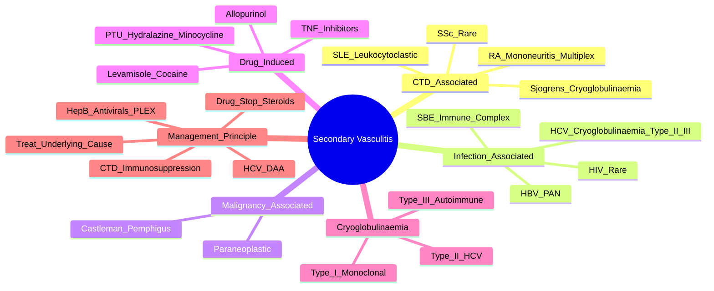

# Secondary Vasculitides

> [!tip] **FCPS/MRCP Priority: HIGH**
> **Secondary vasculitis** = vasculitis **due to underlying disease** (CTD, infection, malignancy, drugs). **Key principle: treat the underlying cause**. **High-yield**: HCV cryoglobulinaemia (DAAs), drug-induced (PTU/hydralazine/levamisole-cocaine), RA vasculitis, SLE vasculitis.

---

## Learning Objectives
By the end of this note you should be able to:
- [ ] Classify secondary vasculitis by aetiology: **CTD, infection, malignancy, drug-induced**
- [ ] Recognise **HCV-associated cryoglobulinaemic vasculitis** (Type II/III): purpura, MPGN, neuropathy — **DAA cures both**
- [ ] Identify **drug-induced vasculitis**: **PTU (p-ANCA/MPA-like)**, **hydralazine**, **minocycline**, **levamisole-adulterated cocaine (p-ANCA)**
- [ ] Differentiate **RA vasculitis** (severe RA, RF+, mononeuritis multiplex, digital infarcts)
- [ ] Differentiate **SLE vasculitis** (leukocytoclastic, small vessel, antiphospholipid association)
- [ ] Apply **management principle: treat underlying cause** (HCV DAAs, stop drug, immunosuppression for autoimmune)

---

## 1. Classification by Aetiology

| Category | Examples | Key Features |
|----------|----------|--------------|
| **Connective Tissue Disease** | SLE, RA, Sjögren's, SSc | Immune complex, ANCA usually negative |
| **Infection-Associated** | **HCV (cryoglobulinaemia), HBV (PAN), SBE, HIV** | Immune complex, ANCA variable |
| **Malignancy-Associated** | Paraneoplastic (haematologic > solid) | Immune complex, paraneoplastic pemphigus |
| **Drug-Induced** | **PTU, hydralazine, minocycline, levamisole-cocaine, TNF inhibitors** | **ANCA+ (usually p-ANCA/MPO)** |

---

## 2. Connective Tissue Disease-Associated Vasculitis

### SLE Vasculitis
| Feature | Detail |
|---------|--------|
| **Type** | **Small vessel** (leukocytoclastic vasculitis) |
| **Clinical** | Palpable purpura (lower limbs), livedo reticularis, digital infarcts, urticarial vasculitis |
| **Serology** | **ANA+, anti-dsDNA+, low C3/C4**; **ANCA usually negative** |
| **Antiphospholipid** | Co-existing APS → thrombosis |
| **Management** | **Steroids + immunosuppression** (MMF, AZA, CYC, RTX) |

### RA Vasculitis
| Feature | Detail |
|---------|--------|
| **Setting** | **Long-standing, severe, seropositive RA** (RF high titre) |
| **Features** | **Mononeuritis multiplex**, digital infarcts, cutaneous ulcers, nailfold infarcts, episcleritis, scleritis |
| **Biopsy** | **Necrotising vasculitis** of small/medium vessels |
| **Management** | **Steroids + CYC** or **RTX** (preferred now) |

### Sjögren's Vasculitis
| Feature | Detail |
|---------|--------|
| **Mechanism** | **Cryoglobulinaemic vasculitis** (Type II/III) |
| **Clinical** | Purpura, weakness, arthralgia, MPGN, peripheral neuropathy |
| **Serology** | **Anti-Ro/La+**, **cryoglobulins+**, **low C4** |
| **Management** | **Treat cryoglobulinaemia** (see below) |

### SSc Vasculitis
| Feature | Detail |
|---------|--------|
| **Rarity** | Rare; ILD/PAH more common |
| **Features** | Digital ischaemia, calcinosis, telangiectasia |

---

## 3. Infection-Associated Vasculitis

### Hepatitis C — **Cryoglobulinaemic Vasculitis (Type II/III)**
| Feature | Detail |
|---------|--------|
| **Mechanism** | **HCV + IgMκ RF** → **Type II/III mixed cryoglobulins** → immune complex deposition |
| **Clinical Triad** | **Palpable purpura + weakness/neuropathy + MPGN** |
| **Lab** | **Cryoglobulins+**, **low C4**, **RF+**, **HCV RNA+** |
| **Types** | **Type II** (monoclonal IgMκ + polyclonal IgG) — **most common**; **Type III** (polyclonal) |
| **Management** | **DAA for HCV (cures both)**; **Rituximab** if severe/organ-threatening; **CYC** if life-threatening |

### Hepatitis B — **Polyarteritis Nodosa (PAN)**
| Feature | Detail |
|---------|--------|
| **Mechanism** | **Immune complex** (HBsAg-anti-HBs) in medium arteries |
| **Prevalence** | Historically 30-50% PAN; now **<10%** with vaccination |
| **Management** | **Antivirals (entecavir/tenofovir) + Plasmapheresis + Short steroids** — **AVOID CYC** |

### Subacute Bacterial Endocarditis (SBE)
| Feature | Detail |
|---------|--------|
| **Mechanism** | **Immune complex** (bacterial antigens) |
| **Signs** | Janeway lesions, Osler nodes, Roth spots, splinter haemorrhages, **GN** |
| **Management** | **Antibiotics (treat infection)** — vasculitis resolves |

---

## 4. Drug-Induced Vasculitis — **High-Yield**

| Drug | Mimics | ANCA Pattern | Management |
|------|--------|--------------|------------|
| **Propylthiouracil (PTU)** | **MPA** (p-ANCA/MPO+) | **p-ANCA/MPO+** | **Stop PTU + steroids + immunosuppression** |
| **Hydralazine** | SLE-like / MPA | **p-ANCA/MPO+** | **Stop drug + steroids** |
| **Minocycline** | SLE-like / Vasculitis | p-ANCA+ | **Stop drug** |
| **Levamisole-adulterated Cocaine** | **ANCA+ vasculitis** (p-ANCA/MPO+) | **p-ANCA/MPO+** | **Stop cocaine + steroids + immunosuppression** |
| **TNF Inhibitors** | Drug-induced lupus / vasculitis | Variable | Stop drug, steroids |
| **Allopurinol** | DRESS / Hypersensitivity | Usually ANCA- | Stop drug, steroids |

> [!critical] **PTU-Induced Vasculitis**
> - **p-ANCA/MPO+** — mimics MPA
> - **Stop PTU immediately** — switch to carbimazole/methimazole
> - **Steroids + immunosuppression** (CYC/RTX) if severe

> [!critical] **Levamisole-Adulterated Cocaine**
> - **p-ANCA/MPO+** in 70-80%
> - **Neutropenia, purpura, necrosis, alveolar haemorrhage**
> - **Stop cocaine + steroids + immunosuppression**

---

## 5. Cryoglobulinaemic Vasculitis — **Classification**

| Type | Composition | Aetiology | Clinical |
|------|-------------|-----------|----------|
| **Type I** | **Monoclonal** (IgG or IgM) | **Lymphoproliferative** (WM, MM, CLL) | Hyperviscosity, purpura, neuropathy, GN |
| **Type II** | **Mixed**: Monoclonal IgMκ + Polyclonal IgG | **HCV (90%)** | Purpura, arthralgia, neuropathy, **MPGN** |
| **Type III** | **Mixed**: Polyclonal IgM + Polyclonal IgG | **Autoimmune** (SLE, Sjögren's, RA), Infections | Similar to Type II |

> [!critical] **Cryoglobulinaemia Workup**
> 1. **Cryoglobulins** (precipitate at 4°C, dissolve at 37°C)
> 2. **Type** (I/II/III) → immunofixation
> 3. **RF** (usually + in Type II/III)
> 4. **Complement** (C4 **low**, C3 normal/low)
> 5. **HCV RNA** (if Type II/III)
> 6. **Serum/urine immunofixation** (if Type I)

---

## 6. Malignancy-Associated Vasculitis

| Context | Detail |
|---------|--------|
| **Paraneoplastic** | **Haematologic > Solid** (lymphoma, CLL, MM) |
| **Mechanism** | Immune complex (tumour antigens) |
| **Paraneoplastic Pemphigus** | **Castleman disease / Lymphoma** — severe mucocutaneous ulceration |
| **Management** | **Treat malignancy** → vasculitis often resolves |

---

## 7. Management Principle — **Treat the Underlying Cause**

```mermaid
flowchart TD
    A[Suspected Secondary Vasculitis] --> B{Identify Underlying Cause}
    B -->|HCV| C[**DAA for HCV**\n(Cures HCV + Cryoglobulinaemia)]
    B -->|Drug-Induced| D[**STOP OFFENDING DRUG**\n(PTU, hydralazine, minocycline, levamisole-cocaine)]
    B -->|CTD (SLE, RA, Sjögren's)| E[**Immunosuppression**\nSteroids + CYC/RTX/MMF/AZA\n(RTX preferred for RA vasculitis)]
    B -->|Hep B PAN| F[**Antivirals + PLEX + Short Steroids**\n**NO CYC**]
    B -->|Malignancy| G[**Treat Malignancy**\n(Vasculitis often resolves)]
    C --> H[Rituximab if Severe/Refractory]
    D --> H
    E --> H
    F --> H
    G --> H
```

---

## 8. FCPS/MRCP High-Yield Summary

| Topic | Key Points |
|-------|------------|
| **HCV Cryoglobulinaemia** | **Type II/III**, purpura + neuropathy + MPGN; **DAA cures HCV + vasculitis**; Rituximab if severe |
| **Drug-Induced** | **PTU (p-ANCA/MPO+), hydralazine, minocycline, levamisole-cocaine** → **STOP DRUG + steroids + immunosuppression** |
| **RA Vasculitis** | Severe RA + RF+ + mononeuritis multiplex, digital infarcts, ulcers → **CYC/RTX + steroids** |
| **SLE Vasculitis** | Leukocytoclastic, small vessel; **ANA/dsDNA+, low C3/C4**, ANCA usually negative |
| **Hep B PAN** | **Antivirals + PLEX + short steroids** — **NO CYC** |
| **Cryoglobulinaemia Types** | **Type I** = monoclonal (lymphoproliferative); **Type II/III** = mixed (HCV, autoimmune) |
| **Levamisole-Cocaine** | **p-ANCA/MPO+**, purpura, neutropenia, necrosis — **stop cocaine + steroids + CYC/RTX** |
| **Management Principle** | **Treat underlying cause**: HCV → DAAs; Drug → stop + steroids; CTD → immunosuppression |

---

## 9. Viva Questions (MRCP PACES / FCPS)

| Question | Expected Answer |
|----------|----------------|
| "A 55yo woman on PTU for Graves' disease develops purpura, mononeuritis multiplex, renal impairment. p-ANCA positive. Diagnosis and management?" | **PTU-induced ANCA vasculitis (MPA-like)**. **Stop PTU immediately**, switch to carbimazole. **Steroids + CYC/RTX** for severe disease. |
| "What is the classic triad of HCV cryoglobulinaemic vasculitis?" | **Palpable purpura + peripheral neuropathy + MPGN** (Type II/III mixed cryoglobulins). |
| "How do you treat HCV-associated cryoglobulinaemic vasculitis?" | **DAA for HCV** (cures both HCV and cryoglobulinaemia). **Rituximab** if severe/organ-threatening. |
| "What drug causes ANCA-positive vasculitis mimicking MPA?" | **Propylthiouracil (PTU)** — **p-ANCA/MPO+**. Also hydralazine, minocycline, levamisole-cocaine. |
| "A cocaine user presents with purpura, neutropenia, necrotic skin lesions, p-ANCA positive. Diagnosis?" | **Levamisole-adulterated cocaine vasculitis** — **stop cocaine, steroids, immunosuppression (CYC/RTX)**. |
| "How does RA vasculitis differ from SLE vasculitis?" | **RA**: severe seropositive RA, mononeuritis multiplex, digital infarcts, **CYC/RTX**. **SLE**: leukocytoclastic, ANA/dsDNA+, low complement, **steroids + MMF/AZA/RTX**. |
| "What are the three types of cryoglobulinaemia?" | **Type I**: monoclonal (lymphoproliferative). **Type II**: mixed monoclonal IgMκ + polyclonal IgG (HCV). **Type III**: mixed polyclonal (autoimmune). |
| "How do you manage drug-induced vasculitis?" | **STOP the offending drug** (PTU, hydralazine, minocycline, levamisole-cocaine) + **steroids + immunosuppression** (CYC/RTX) if severe. |
| "What is the management of Hepatitis B-associated PAN?" | **Antivirals (entecavir/tenofovir) + Plasmapheresis + short-course steroids** — **AVOID cyclophosphamide**. |
| "What is the difference between Type I, II, III cryoglobulinaemia?" | **Type I**: monoclonal (lymphoproliferative). **Type II**: mixed monoclonal IgMκ + polyclonal IgG (HCV). **Type III**: mixed polyclonal (autoimmune). |

---

## 10. Confusions & Mnemonics

| Confusion | Clarification |
|-----------|---------------|
| **Primary vs Secondary Vasculitis** | **Primary** = idiopathic (GPA, MPA, EGPA, PAN, etc.). **Secondary** = due to CTD, infection, malignancy, drugs. |
| **HCV Cryoglobulinaemia** | **Type II/III** mixed cryoglobulins. **DAA cures both HCV and vasculitis**. Rituximab for severe. |
| **Drug-Induced ANCA** | **PTU, hydralazine, minocycline, levamisole-cocaine** → **p-ANCA/MPO+** → **STOP DRUG + steroids + immunosuppression**. |
| **RA vs SLE Vasculitis** | RA = severe RA, RF+, mononeuritis, digital infarcts, **CYC/RTX**. SLE = leukocytoclastic, ANA/dsDNA+, low C3/C4, **steroids + MMF/AZA/RTX**. |
| **Hep B PAN** | **Antivirals + PLEX + short steroids** — **NEVER CYC** (reactivates HBV). |
| **Type I vs II vs III Cryo** | Type I = monoclonal (lymphoma); Type II = mixed IgMκ + IgG (HCV); Type III = polyclonal (autoimmune). |

**Mnemonic: Secondary Vasculitis Causes = "C-I-M-D"**
- **C**onnective tissue disease (SLE, RA, Sjögren's)
- **I**nfection (HCV, HBV, SBE, HIV)
- **M**alignancy (paraneoplastic)
- **D**rug-induced (PTU, hydralazine, minocycline, levamisole-cocaine)

**Mnemonic: HCV Cryoglobulinaemia = "PURPURA + NEUROPATHY + MPGN = TYPE II/III"**
- **P**alpable purpura
- **N**europathy (peripheral)
- **M**PGN (renal)

**Mnemonic: Drug-Induced ANCA = "PTU-HYDRA-MINO-LEVAMISOLE"**
- **PTU** (p-ANCA/MPO+)
- **HYDRA**lazine (p-ANCA/MPO+)
- **MINO**cycline (p-ANCA/MPO+)
- **LEVAMISOLE**-cocaine (p-ANCA/MPO+)

**Mnemonic: Cryoglobulinaemia Types = "1-MONO, 2-MIXED-HCV, 3-POLY"**
- **Type 1** = **MONO**clonal (lymphoproliferative)
- **Type 2** = **MIXED** IgMκ + IgG (**HCV**)
- **Type 3** = **POLY**clonal (autoimmune)

**Mnemonic: Management Principle = "TREAT THE CAUSE"**
- **HCV** → **DAAs**
- **Drug** → **STOP + Steroids**
- **CTD** → **Immunosuppression**
- **Hep B** → **Antivirals + PLEX**
- **Malignancy** → **Treat Cancer**

---

## 11. Mind Map



---

## 12. One-Page Revision Card

| Domain | Key Points |
|--------|------------|
| **Categories** | CTD (SLE, RA, Sjögren's), Infection (HCV, HBV, SBE), Malignancy, Drugs (PTU, hydralazine, minocycline, levamisole-cocaine) |
| **HCV Cryoglobulinaemia** | Type II/III mixed; purpura + neuropathy + MPGN; **DAA cures both**; Rituximab if severe |
| **Drug-Induced** | **PTU, hydralazine, minocycline, levamisole-cocaine** → **p-ANCA/MPO+** → stop drug + steroids + immunosuppression |
| **RA Vasculitis** | Severe RA + RF+ + mononeuritis/digital infarcts → **CYC/RTX + steroids** |
| **SLE Vasculitis** | Leukocytoclastic, ANA/dsDNA+, low C3/C4, ANCA- → steroids + MMF/AZA/RTX |
| **Hep B PAN** | Antivirals + PLEX + short steroids — **NO CYC** |
| **Cryoglobulinaemia** | Type I = monoclonal (lymphoma); Type II = HCV; Type III = autoimmune |
| **Management Principle** | **Treat underlying cause**: HCV → DAA; Drug → stop + steroids; CTD → immunosuppression; Hep B → antivirals/PLEX |

---

## 12. Spaced Repetition Trackers

| Review Interval | Date Completed | Confidence (1-5) | Notes |
|-----------------|----------------|------------------|-------|
| 24 hours | | | |
| 7 days | | | |
| 15 days | | | |
| 30 days | | | |
| 90 days | | | |

---

## 13. Self-Test Scorecard

| Section | Score /5 | Last Attempt |
|---------|----------|--------------|
| HCV Cryoglobulinaemia Management | | |
| Drug-Induced Vasculitis Recognition | | |
| RA vs SLE Vasculitis | | |
| Cryoglobulinaemia Classification | | |
| Hep B PAN Management | | |
| Viva Questions | | |

---

## Local Navigation
- **Parent Heading**: [[../Vasculitis|Vasculitis]]
- **Parent Topic Group**: [[Primary systemic vasculitides overview]]
- **Chapter Map**: [[../Davidson Chapter 26 - Rheumatology Hierarchy|Rheumatology Hierarchy]]
- **Chapter MOC**: [[../Rheumatology MOC|Rheumatology MOC]]
- **Drug Reference**: [[../../Clinical Approach to Musculoskeletal Disease/Drugs in rheumatology|Drugs in rheumatology]]
- **Related**: [[Granulomatosis with polyangiitis (GPA)]] · [[Microscopic polyangiitis (MPA)]] · [[IgA vasculitis (Henoch-Schönlein purpura)]] · [[Polyarteritis nodosa (PAN)]]
---

> Auto-generated study sections for "Vasculitis" — Ch 25: Rheumatology & Bone Disease.

## Flashcards (56 generated)

- Q: What is the definition of Vasculitis?
  A: Secondary vasculitis = vasculitis due to underlying disease (CTD, infection, malignancy, drugs).
- Q: How is Vasculitis classified?
  A: Small vessel (leukocytoclastic vasculitis)
- Q: What is Clinical of Vasculitis?
  A: Palpable purpura (lower limbs), livedo reticularis, digital infarcts, urticarial vasculitis
- Q: What is Serology of Vasculitis?
  A: ANA+, anti-dsDNA+, low C3/C4; ANCA usually negative
- Q: What is Antiphospholipid of Vasculitis?
  A: Co-existing APS → thrombosis
- Q: How is Vasculitis managed?
  A: Steroids + immunosuppression (MMF, AZA, CYC, RTX)
- Q: What is Setting of Vasculitis?
  A: Long-standing, severe, seropositive RA (RF high titre)
- Q: What are the clinical features of Vasculitis?
  A: Mononeuritis multiplex, digital infarcts, cutaneous ulcers, nailfold infarcts, episcleritis, scleritis
- Q: What is Biopsy of Vasculitis?
  A: Necrotising vasculitis of small/medium vessels
- Q: How is Vasculitis managed?
  A: Steroids + CYC or RTX (preferred now)
- Q: What is the mechanism of Vasculitis?
  A: Cryoglobulinaemic vasculitis (Type II/III)
- Q: What is Clinical of Vasculitis?
  A: Purpura, weakness, arthralgia, MPGN, peripheral neuropathy
- Q: What is Serology of Vasculitis?
  A: Anti-Ro/La+, cryoglobulins+, low C4
- Q: How is Vasculitis managed?
  A: Treat cryoglobulinaemia (see below)
- Q: What is Rarity of Vasculitis?
  A: Rare; ILD/PAH more common
- Q: What are the clinical features of Vasculitis?
  A: Digital ischaemia, calcinosis, telangiectasia
- Q: What is the mechanism of Vasculitis?
  A: HCV + IgMκ RF → Type II/III mixed cryoglobulins → immune complex deposition
- Q: What is Clinical Triad of Vasculitis?
  A: Palpable purpura + weakness/neuropathy + MPGN
- Q: What is Lab of Vasculitis?
  A: Cryoglobulins+, low C4, RF+, HCV RNA+
- Q: How is Vasculitis classified?
  A: Type II (monoclonal IgMκ + polyclonal IgG) — most common; Type III (polyclonal)
- Q: How is Vasculitis managed?
  A: DAA for HCV (cures both); Rituximab if severe/organ-threatening; CYC if life-threatening
- Q: What is the mechanism of Vasculitis?
  A: Immune complex (HBsAg-anti-HBs) in medium arteries
- Q: What is the epidemiology of Vasculitis?
  A: Historically 30-50% PAN; now <10% with vaccination
- Q: How is Vasculitis managed?
  A: Antivirals (entecavir/tenofovir) + Plasmapheresis + Short steroids — AVOID CYC
- Q: What is the mechanism of Vasculitis?
  A: Immune complex (bacterial antigens)
- Q: What is Signs of Vasculitis?
  A: Janeway lesions, Osler nodes, Roth spots, splinter haemorrhages, GN
- Q: How is Vasculitis managed?
  A: Antibiotics (treat infection) — vasculitis resolves
- Q: How is Vasculitis classified?
  A: Small vessel (leukocytoclastic vasculitis)
- Q: What is Clinical of Vasculitis?
  A: Palpable purpura (lower limbs), livedo reticularis, digital infarcts, urticarial vasculitis
- Q: What is Serology of Vasculitis?
  A: ANA+, anti-dsDNA+, low C3/C4; ANCA usually negative
- Q: What is Antiphospholipid of Vasculitis?
  A: Co-existing APS → thrombosis
- Q: What is Setting of Vasculitis?
  A: Long-standing, severe, seropositive RA (RF high titre)
- Q: What are the clinical features of Vasculitis?
  A: Mononeuritis multiplex, digital infarcts, cutaneous ulcers, nailfold infarcts, episcleritis, scleritis
- Q: What is Biopsy of Vasculitis?
  A: Necrotising vasculitis of small/medium vessels
- Q: What is the mechanism of Vasculitis?
  A: Cryoglobulinaemic vasculitis (Type II/III)
- Q: What is Clinical of Vasculitis?
  A: Purpura, weakness, arthralgia, MPGN, peripheral neuropathy
- Q: What is Serology of Vasculitis?
  A: Anti-Ro/La+, cryoglobulins+, low C4
- Q: What is Rarity of Vasculitis?
  A: Rare; ILD/PAH more common
- Q: What are the clinical features of Vasculitis?
  A: Digital ischaemia, calcinosis, telangiectasia
- Q: What is the mechanism of Vasculitis?
  A: HCV + IgMκ RF → Type II/III mixed cryoglobulins → immune complex deposition
- Q: What is Clinical Triad of Vasculitis?
  A: Palpable purpura + weakness/neuropathy + MPGN
- Q: What is Lab of Vasculitis?
  A: Cryoglobulins+, low C4, RF+, HCV RNA+
- Q: How is Vasculitis classified?
  A: Type II (monoclonal IgMκ + polyclonal IgG) — most common; Type III (polyclonal)
- Q: What is the mechanism of Vasculitis?
  A: Immune complex (HBsAg-anti-HBs) in medium arteries
- Q: What is the epidemiology of Vasculitis?
  A: Historically 30-50% PAN; now <10% with vaccination
- Q: What is the mechanism of Vasculitis?
  A: Immune complex (bacterial antigens)
- Q: What is Signs of Vasculitis?
  A: Janeway lesions, Osler nodes, Roth spots, splinter haemorrhages, GN
- Q: How is Vasculitis managed?
  A: Antibiotics (treat infection) — vasculitis resolves
- Q: What is HCV Cryoglobulinaemia of Vasculitis?
  A: Type II/III, purpura + neuropathy + MPGN; DAA cures HCV + vasculitis; Rituximab if severe
- Q: What is Drug-Induced of Vasculitis?
  A: PTU (p-ANCA/MPO+), hydralazine, minocycline, levamisole-cocaine → STOP DRUG + steroids + immunosuppression
- Q: What is RA Vasculitis of Vasculitis?
  A: Severe RA + RF+ + mononeuritis multiplex, digital infarcts, ulcers → CYC/RTX + steroids
- Q: What is SLE Vasculitis of Vasculitis?
  A: Leukocytoclastic, small vessel; ANA/dsDNA+, low C3/C4, ANCA usually negative
- Q: What is Hep B PAN of Vasculitis?
  A: Antivirals + PLEX + short steroids — NO CYC
- Q: How is Vasculitis classified?
  A: Type I = monoclonal (lymphoproliferative); Type II/III = mixed (HCV, autoimmune)
- Q: What is Levamisole-Cocaine of Vasculitis?
  A: p-ANCA/MPO+, purpura, neutropenia, necrosis — stop cocaine + steroids + CYC/RTX
- Q: How is Vasculitis managed?
  A: Treat underlying cause: HCV → DAAs; Drug → stop + steroids; CTD → immunosuppression

## MCQs (1 generated)

1. **Which of the following best describes Vasculitis?**
   A. **Secondary vasculitis = vasculitis due to underlying disease (CTD, infection, malignancy, drugs).**
   B. An unrelated condition not matching the clinical picture of Vasculitis
   C. A complication seen late in the disease course of Vasculitis
   D. A condition that mimics Vasculitis but has a different underlying cause

## SBA Questions (1 generated)

1. A patient with suspected Vasculitis presents with: Connective Tissue Disease — SLE, RA, Sjögren's, SSc; Infection-Associated — HCV (cryoglobulinaemia), HBV (PAN), SBE, HIV; Malignancy-Associated — Paraneoplastic (haematologic > solid). What is the most likely diagnosis?
   A. **Vasculitis**
   B. A condition that mimics Vasculitis but is not the same entity
   C. A complication of Vasculitis rather than the primary diagnosis
   D. An unrelated condition in the same clinical category as Vasculitis

## PasTest Scenario SBAs (Clinical Vignettes)

> **Auto-generated PasTest/Mediscope-style scenario SBAs** grounded in the authored source. Each scenario tests a real clinical fact (triad, specific sign, contraindication, trial, first-line Rx) extracted from the topic. *Source: Ch 25: Rheumatology — Secondary vasculitides*

**Q1.** What is the most appropriate first-line therapy for Secondary vasculitides?

  - **A.** DAA for HCV
  - **B.** An advanced/surgical therapy reserved for refractory disease
  - **C.** Symptomatic treatment only, no disease-modifying therapy
  - **D.** Empiric broad-spectrum therapy without specific indication

  > **Answer: A** — DAA for HCV
  >
  > *Source:* B --> HCV  C[**DAA for HCV**\n(Cures HCV + Cryoglobulinaemia)]

