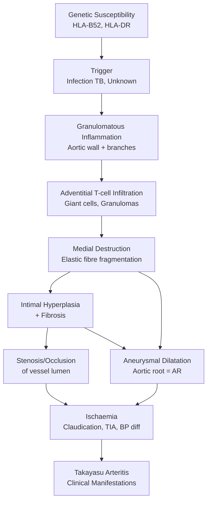
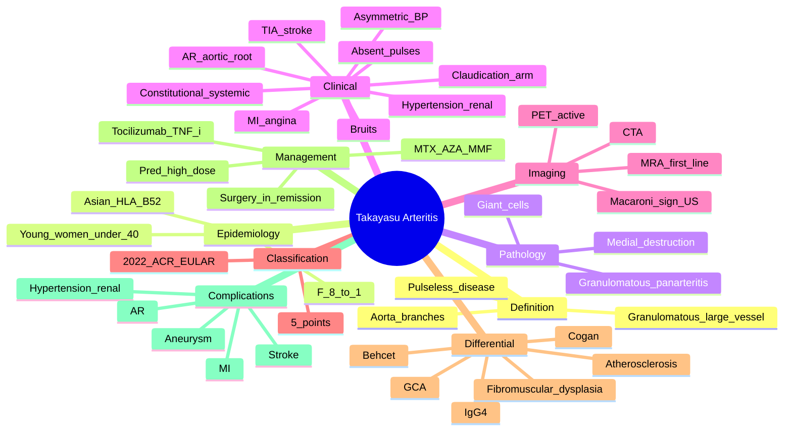

# Takayasu Arteritis ("Pulseless Disease")

> [!tip] **FCPS/MRCP Priority: HIGH**
> Takayasu arteritis = **granulomatous large-vessel vasculitis** of the **aorta and its major branches**, primarily in **women <40 years** of Asian origin. Must know: **"pulseless disease"** (asymmetric BP, absent/diminished pulses, bruits), **hypertension** (renal artery stenosis most common cause of death), **aortic regurgitation** (aortic root dilatation), **crescendo TIA/stroke**, **1990 ACR criteria**, **MRA/CTA/PET** for diagnosis, **high-dose steroids + DMARD**, and that **Takayasu = GCA in young women** (histologically identical).

---

## Learning Objectives
By the end of this note you should be able to:
- [ ] Define Takayasu arteritis as **granulomatous large-vessel vasculitis** in young women
- [ ] Apply **1990 ACR / 2022 ACR-EULAR classification criteria**
- [ ] Recognise the **"pulseless disease"** phenotype (asymmetric BP, absent pulses, bruits)
- [ ] Identify **major complications** (hypertension, AR, TIA/stroke, MI, aneurysm)
- [ ] Use **MRA/CTA/PET** for diagnosis and monitoring
- [ ] Plan **induction (high-dose steroids + DMARD)** and **maintenance (TNF-i / tocilizumab)**
- [ ] Differentiate from **GCA** (Takayasu = young, GCA = >50), **fibromuscular dysplasia**, **atherosclerosis**

---

## 1. Definition & Epidemiology
| Feature | Detail |
|---------|--------|
| **Definition** | **Granulomatous large-vessel vasculitis** affecting **aorta, its major branches, and pulmonary arteries** |
| **Synonym** | "**Pulseless disease**" (asymmetric pulses, occlusion of subclavian/carotid) |
| **Prevalence** | 1-3/million (varies geographically); **highest in East Asia** (Japan ~40/million) |
| **Age of onset** | **<40 years** (typically 15-30y); **>40y = unlikely** |
| **Sex** | **F:M = 8-9:1** (overwhelmingly women) |
| **Ethnicity** | Asian > Caucasian, African |
| **Genetics** | **HLA-B52, HLA-B67** (Japanese); **HLA-DRB1** |
| **Geography** | **Japan, SE Asia, India, Mexico, Brazil** |

---

## 2. Classification — 2022 ACR/EULAR
### 2022 ACR-EULAR (≥5 points required)
| Item | Points |
|------|--------|
| **Age ≤40 years at diagnosis** | +2 |
| **Female sex** | +1 |
| **Angina or cardiac ischaemia** | +2 |
| **Arm or leg claudication** | +2 |
| **Vascular bruit** | +2 |
| **Reduced pulse in upper extremity** | +2 |
| **Reduced pulse or tenderness of a carotid artery** | +2 |
| **Blood pressure difference between arms of ≥20 mmHg** | +1 |
| **Imaging showing arteriography abnormalities (occlusion, stenosis, aneurysm) of aorta, branches, or large arteries** | **+2** |
| **Maximum** | **20** |

### 1990 ACR (Old — ≥3 of 6)
1. Age ≤40y
2. Claudication of extremities
3. **Diminished brachial artery pulse**
4. **BP difference >10 mmHg between arms**
5. **Bruit over subclavian or aorta**
6. **Arteriographic abnormalities** (occlusion, stenosis, aneurysm)

> [!note] **1990 vs 2022**
> 1990 ACR required **≥3 of 6 criteria**; 2022 ACR-EULAR replaced with weighted scoring ≥5 points and includes sex, imaging, and clinical features. **2022 is current standard**.

---

## 3. Pathophysiology

### Pathology
| Feature | Detail |
|---------|--------|
| **Type** | **Granulomatous** (identical to GCA) |
| **Layers** | Panarteritis — adventitia, media, intima |
| **Cells** | T cells, macrophages, **giant cells**, granulomas |
| **Medial** | Elastic fibre fragmentation → aneurysm |
| **Intima** | Hyperplasia → stenosis |

> [!important] **Takayasu and GCA are Histologically Identical**
> Both = granulomatous large-vessel vasculitis. Difference: **Takayasu <40y, GCA >50y**. GCA prefers temporal/cranial arteries; Takayasu prefers aorta/branches.

---

## 4. Clinical Features
### Constitutional (Systemic Phase — early)
- Fever, night sweats, weight loss, fatigue, myalgia, arthralgia
- May mimic infection, TB, lymphoma

### Vascular (Occlusive Phase — late)
| Pattern | Features |
|---------|----------|
| **Asymmetric blood pressure** | **>10 mmHg** between arms (key) |
| **Diminished/absent pulses** | **Subclavian** (most common), **carotid**, **brachial**, **renal**, **femoral** |
| **Vascular bruits** | **Subclavian** (50-70%), carotid, abdominal aorta, renal |
| **Claudication** | Arm > leg (subclavian); jaw claudication (carotid) |
| **Carotidynia** | Tenderness over carotid (early sign) |
| **Renal artery stenosis** | **Hypertension** — most common cause of death (50-70%) |
| **Aortic regurgitation** | **Aortic root dilatation** — 20% (causes HF, often surgical) |
| **TIA / stroke** | Carotid/vertebral stenosis; **most devastating complication** |
| **MI / angina** | Coronary ostial stenosis (10-30%) |
| **Pulmonary artery involvement** | Pulmonary hypertension, chest pain, dyspnoea (15-30%) |
| **Skin** | Erythema nodosum, pyoderma gangrenosum (rare) |
| **Visual** | Retinal ischaemia, Takayasu retinopathy (rare) |

### Numano Classification (Angiographic)
| Type | Vessels Involved |
|------|------------------|
| **I** | Branches of aortic arch (subclavian, carotid) |
| **IIa** | Ascending aorta, arch, branches |
| **IIb** | IIa + thoracic descending aorta |
| **III** | **Thoracic descending aorta + abdominal aorta + renal** (most common) |
| **IV** | **Abdominal aorta + renal** |
| **V** | **Entire aorta + branches** |

---

## 5. Investigations
### Baseline
| Test | Purpose |
|------|---------|
| **ESR, CRP** | Active inflammation (often **disproportionately low** in late disease despite active vascular damage) |
| **FBC** | Anaemia of chronic disease, thrombocytosis |
| **U&E, LFT, urinalysis** | Baseline, monitor for renal involvement |
| **BP — both arms + legs** | **Asymmetric BP** >10 mmHg = key clinical sign |
| **CXR** | Widened mediastinum, rib notching, calcified aortic wall |
| **ECG** | LVH (HTN), ischaemia, conduction defects |

### Imaging — Essential for Diagnosis and Monitoring
| Modality | Use | Notes |
|----------|-----|-------|
| **MRA (MR angiography)** | **First-line**; wall thickening, oedema, lumen | No radiation; good for serial monitoring |
| **CTA** | Alternative to MRA; lumen and wall | Higher resolution; radiation |
| **PET-CT** | **Active inflammation** (FDG uptake in vessel wall) | Most sensitive for active disease; expensive; not always available |
| **Conventional angiography** | **Gold standard** but invasive | Stenosis, occlusion, aneurysm; now largely replaced by MRA/CTA |
| **Ultrasound (carotid, subclavian)** | Wall thickening ("**macaroni sign**"), stenosis | Bedside, no radiation |

### 1990/2022 criteria require imaging confirmation
- **MRA/CTA/PET** demonstrating aortic/branch involvement is **mandatory** for classification

### Biopsy (Rare)
- Subclavian/carotid biopsy if surgery
- Shows **granulomatous inflammation, giant cells, elastic fibre destruction**

---

## 6. Differential Diagnosis
| Condition | Distinguishing |
|-----------|---------------|
| **GCA (temporal arteritis)** | **>50y**, temporal artery (not aorta); HLA-DR4 |
| **Atherosclerosis** | Older, risk factors, calcified plaque, **no systemic inflammation** |
| **Fibromuscular dysplasia** | **Young women**, "string of beads" on angiography, **no inflammation** |
| **Congenital coarctation** | Rib notching, **BP difference upper/lower** (not arm-arm) |
| **Behçet's disease** | Oral/genital ulcers, uveitis, pathergy |
| **Cogan's syndrome** | Interstitial keratitis, vestibuloauditory |
| **IgG4-related disease** | Multi-organ, ↑serum IgG4, storiform fibrosis |
| **Marfan / Loeys-Dietz** | Aortic root aneurysm, family history, no inflammation |
| **Erdheim-Chester** | Rare; "coated aorta", xanthogranulomatous |
| **TB aortitis** | TB exposure, positive IGRA, AFB |

> [!warning] **Don't Confuse with Atherosclerosis**
> Young patients with vascular symptoms are often labelled "premature atherosclerosis" — think Takayasu in a young Asian woman with asymmetric BP, absent pulses, systemic features.

---

## 7. Management
### Induction (Active Disease)
| Regimen | Dose | Notes |
|---------|------|-------|
| **Prednisolone** | **0.5-1 mg/kg/day** (max 60-80 mg) → taper over 6-12 months | High-dose; most respond initially |
| **Methylpred pulse** | 500-1000 mg IV × 3 days | Severe / organ-threatening |
| **csDMARD** (concurrent) | **MTX 20-25 mg weekly** OR **AZA 2 mg/kg/day** OR **MMF 2-3 g/day** | Steroid-sparing; from outset in most cases |
| **Biologic (refractory/relapsing)** | **Tocilizumab 162 mg SC weekly** OR **TNF inhibitor (adalimumab, infliximab)** | For steroid-sparing or refractory disease |

### Maintenance
| Regimen | Notes |
|---------|-------|
| **Low-dose pred** + **MTX or AZA or MMF** | Standard maintenance |
| **Tocilizumab** (Tocilizumab in Takayasu, GiACTA-Takayasu trial) | Effective for relapse prevention |
| **TNF inhibitors** (etanercept, adalimumab, infliximab) | For refractory disease |
| **Duration** | **2-5 years minimum**; many require lifelong therapy |

### Surgical / Interventional
| Indication | Intervention |
|------------|--------------|
| **Critical stenosis (cerebral, coronary, renal)** | **Revascularisation** (angioplasty ± stent, bypass) — **ideally in remission** |
| **Severe AR** | **Aortic valve replacement** (mechanical in young) |
| **Aortic aneurysm** | Surgical repair if >5 cm or expanding |
| **Renal artery stenosis** | **Angioplasty ± stent** (after disease control) |

> [!warning] **Surgery in Active Disease Fails**
> Bypass grafts and stents placed in **active inflammation** have high restenosis rates. **Control disease first** (3-6 months of remission) before elective revascularisation.

### Monitoring
- **ESR, CRP** monthly (may be normal in active disease — "**silent progression**")
- **MRA** every 6-12 months (assess wall thickening, new stenosis/aneurysm)
- **PET** if MRA equivocal for active disease
- **BP both arms + legs** every visit
- **Echocardiogram** (aortic root, AR) yearly
- **CT coronary** if coronary involvement suspected

---

## 8. Special Situations
### Pregnancy
- **Active disease** = high-risk (HTN, aortic dissection, fetal loss)
- **Pre-conception counselling**, multidisciplinary
- **Safe in pregnancy**: Prednisolone, **AZA**, **HCQ**, **tacrolimus**; **continue HCQ** (expert recommendation)
- **Avoid**: MTX, MMF, CYC, TNF-i (limited data, adalimumab/etanercept used if needed)
- **Monitor BP carefully** (renal artery stenosis)

### Children
- **Juvenile Takayasu** = 1/3 of cases <20y
- Often presents with **HTN**, failure to thrive
- Same treatment as adult; consider biologics for steroid-sparing

### Refractory Disease
- **Switch biologic** (tocilizumab ↔ TNF-i)
- **JAK inhibitors** (case reports)
- **IVIG, plasma exchange** (limited evidence)
- **Re-biopsy** to confirm active vasculitis vs damage

---

## 9. Prognosis
| Factor | Impact |
|--------|--------|
| **10y survival** | 80-90% with modern Rx (was 50% pre-steroids) |
| **Renal artery stenosis** | Leading cause of death (HTN, CKD) |
| **Aortic complications** | AR, dissection, aneurysm — major morbidity |
| **Cerebrovascular** | TIA, stroke (10-15%) |
| **Cardiac** | MI, HF (10-20%) |
| **Relapse** | 30-50% during taper; need long-term immunosuppression |
| **Damage vs activity** | Distinguish: **damage** (stenosis, aneurysm) is permanent; **activity** (inflammation) needs treatment |

---

## 10. FCPS/MRCP High-Yield Summary
| Topic | Key Points |
|-------|------------|
| **Definition** | **Granulomatous large-vessel vasculitis** in **young women <40** |
| **"Pulseless disease"** | **Asymmetric BP, absent pulses (subclavian/carotid), bruits** |
| **Epidemiology** | **F:M 8-9:1**, **<40y**, **Asian**; HLA-B52 |
| **Vessels** | **Aorta + major branches** (subclavian, carotid, renal, coronary) |
| **Hypertension** | **Renal artery stenosis** = leading cause of death (50-70%) |
| **AR** | Aortic root dilatation (20%); surgical |
| **TIA / stroke** | Carotid/vertebral stenosis |
| **1990 ACR** | ≥3 of 6: age <40, claudication, BP diff, diminished pulse, bruit, arteriographic abnormality |
| **2022 ACR-EULAR** | ≥5 points (age, sex, angina, claudication, bruit, pulses, BP diff, imaging) |
| **Imaging** | **MRA/CTA** first-line; **PET** for active inflammation; "**macaroni sign**" on US |
| **Histology** | **Identical to GCA** — granulomatous, giant cells, panarteritis |
| **vs GCA** | **Takayasu <40y, aorta**; **GCA >50y, temporal artery** |
| **Induction** | **High-dose pred + csDMARD (MTX/AZA/MMF)**; **Tocilizumab or TNF-i** for refractory |
| **Maintenance** | 2-5 years minimum; often lifelong |
| **Surgery** | In **remission**; bypass/valve for critical stenosis/AR |
| **Silent progression** | ESR/CRP can be normal; **MRA/PET essential** for monitoring |

---

## 11. Viva Questions (MRCP PACES / FCPS)
| Question | Expected Answer |
|----------|-----------------|
| "Takayasu vs GCA — key differences?" | Both granulomatous large-vessel vasculitis (histology identical). **Takayasu <40y, F:M 8-9:1, aorta + branches, Asian, "pulseless disease"**. **GCA >50y, M:F 3:1, cranial arteries (temporal, ophthalmic), jaw claudication, vision loss**. |
| "A 25yo Asian woman has BP 160/100 right arm, 110/70 left arm, absent left radial pulse, left subclavian bruit. Diagnosis?" | **Takayasu arteritis**. Apply 2022 ACR-EULAR: age ≤40 (+2), female (+1), BP diff ≥20 mmHg (+1), reduced upper extremity pulse (+2), vascular bruit (+2), imaging showing arteriographic abnormalities (+2) = ≥10 points. |
| "Most common cause of death in Takayasu?" | **Hypertension from renal artery stenosis** (50-70% of deaths). Aortic complications (AR, dissection) and cerebrovascular disease also contribute. |
| "First-line imaging in suspected Takayasu?" | **MRA (MR angiography)** — wall thickening, lumen, no radiation. **CTA** alternative. **PET-CT** for active inflammation monitoring. |
| "When to consider surgery in Takayasu?" | **Critical stenosis (cerebral, coronary, renal)**, severe **AR**, large/expanding **aneurysm**. **ALWAYS** after disease control (3-6 months remission) — surgery in active disease has high restenosis. |
| "Why is ESR/CRP unreliable in Takayasu monitoring?" | **Silent progression** — active vascular damage can occur despite normal acute phase reactants. **MRA/PET** are more sensitive for ongoing inflammation. |
| "What is the 'macaroni sign'?" | **Ultrasound** of carotid/subclavian in Takayasu (and GCA) — **concentric wall thickening** of the vessel wall resembling a piece of macaroni. Sign of active large-vessel vasculitis. |

---

## 12. Confusions & Mnemonics
| Confusion | Clarification |
|-----------|---------------|
| **Takayasu vs GCA** | **Same histology**. **Takayasu <40y, aorta**; **GCA >50y, cranial**. |
| **Atherosclerosis mimic** | **Young patient with vascular symptoms** = don't dismiss as atherosclerosis; consider Takayasu/FMD. |
| **BP measurement** | Always **both arms**; difference >10 mmHg = significant. |
| **Active vs damage** | **Active** = inflammation (treat); **Damage** = stenosis/aneurysm (surgical). MRA/PET distinguish. |
| **Surgery timing** | **Remission first**; active disease = graft failure. |
| **Silent progression** | Normal ESR/CRP ≠ inactive; image to confirm. |
| **Pulmonary artery involvement** | In ~15-30%; can cause pulmonary HTN, mimics PE. |

**Mnemonic: Takayasu = "PULSE-LESS young woman"**
- **P**ulseless disease
- **U**nilateral BP >10 mmHg diff
- **L**imb claudication (arm > leg)
- **S**ubclavian stenosis
- **E**cho/aortic root = AR
- **L**arge-vessel
- **E**thnic: Asian
- **S**ex: Female
- **S**ilent progression
- young woman

**Mnemonic: 2022 ACR-EULAR "40-F-Cl-CLAUD-BRUIT-PULSE-BP-IMG"**
- **40**: Age ≤40
- **F**: Female
- **Cl**: Cardiac ischaemia (angina)
- **Clau**: Arm/leg claudication
- **Bru**: Bruit
- **Puls**: Reduced pulse
- **BP**: ≥20 mmHg difference
- **Img**: Arteriographic abnormality

**Mnemonic: Takayasu = "GAOL" in young woman**
- **G**ranulomatous (identical to GCA)
- **A**orta + branches
- **O**cclusion (subclavian, carotid, renal)
- **L**arge-vessel

**Mnemonic: Takayasu vs GCA "AGE REVERSAL"**
- **Takayasu = YOUNG (10-40)**; **GCA = OLD (>50)**
- **Takayasu = aorta, Asian, F**; **GCA = cranial, Caucasian, M**

---

## 13. Mind Map

---

## 14. One-Page Revision Card
| Domain | Key Points |
|--------|------------|
| **Definition** | **Granulomatous large-vessel vasculitis** of aorta + branches in **young women <40** |
| **"Pulseless disease"** | Asymmetric BP, absent pulses (subclavian/carotid), bruits |
| **Demographics** | F:M 8-9:1, **<40y**, Asian; HLA-B52 |
| **Vessels** | Aorta + major branches (subclavian, carotid, renal, coronary, pulmonary) |
| **vs GCA** | Identical histology; **Takayasu <40y aorta, GCA >50y cranial** |
| **Hypertension** | **Renal artery stenosis = leading cause of death** (50-70%) |
| **Aortic regurgitation** | Aortic root dilatation (20%); surgical |
| **TIA/stroke** | Carotid/vertebral stenosis (10-15%) |
| **2022 ACR-EULAR** | ≥5 points: age ≤40, female, angina, claudication, bruit, reduced pulse, BP diff ≥20, imaging abnormality |
| **Imaging** | **MRA first-line**; CTA, PET (active), US (macaroni sign) |
| **Biopsy** | Granulomatous, giant cells, panarteritis (if done) |
| **Induction** | **High-dose pred + csDMARD (MTX/AZA/MMF)**; tocilizumab/TNF-i for refractory |
| **Maintenance** | 2-5 years minimum; often lifelong |
| **Surgery** | **In remission** only; bypass/valve for critical stenosis/AR/aneurysm |
| **Monitoring** | ESR/CRP + MRA; **silent progression** common (image) |

---

## 15. Spaced Repetition Trackers
| Review Interval | Date Completed | Confidence (1-5) | Notes |
|-----------------|----------------|------------------|-------|
| 24 hours | | | |
| 7 days | | | |
| 15 days | | | |
| 30 days | | | |
| 90 days | | | |

---

## 16. Self-Test Scorecard
| Section | Score /5 | Last Attempt |
|---------|----------|--------------|
| Takayasu vs GCA | | |
| 2022 ACR-EULAR criteria | | |
| "Pulseless disease" features | | |
| Hypertension as cause of death | | |
| Imaging (MRA, PET, US) | | |
| Induction and maintenance Rx | | |
| Surgical timing | | |
| Silent progression | | |
| Viva Questions | | |

---

## Local Navigation
- **Parent Heading**: [[../Vasculitis|Vasculitis]]
- **Parent Topic Group**: [[Primary systemic vasculitides overview]]
- **Sibling Topics**: [[Giant cell arteritis (temporal arteritis)]] · [[ANCA-associated vasculitis overview]] · [[Behçet's disease]] · [[Secondary vasculitides]] · [[Primary systemic vasculitides overview]]
- **Chapter Map**: [[../Davidson Chapter 26 - Rheumatology Hierarchy|Rheumatology Hierarchy]]
- **Chapter MOC**: [[../Rheumatology MOC|Rheumatology MOC]]
- **Related**: [[Polymyalgia rheumatica]] · [[Drugs in rheumatology]]
---

> Auto-generated study sections for "Vasculitis" — Ch 25: Rheumatology & Bone Disease.

## Flashcards (37 generated)

- Q: What is the definition of Vasculitis?
  A: Granulomatous large-vessel vasculitis affecting aorta, its major branches, and pulmonary arteries
- Q: What is Synonym of Vasculitis?
  A: "Pulseless disease" (asymmetric pulses, occlusion of subclavian/carotid)
- Q: What is the epidemiology of Vasculitis?
  A: 1-3/million (varies geographically); highest in East Asia (Japan ~40/million)
- Q: What is Age of onset of Vasculitis?
  A: <40 years (typically 15-30y); >40y = unlikely
- Q: What is Sex of Vasculitis?
  A: F:M = 8-9:1 (overwhelmingly women)
- Q: What is Ethnicity of Vasculitis?
  A: Asian > Caucasian, African
- Q: What is Genetics of Vasculitis?
  A: HLA-B52, HLA-B67 (Japanese); HLA-DRB1
- Q: What is Geography of Vasculitis?
  A: Japan, SE Asia, India, Mexico, Brazil
- Q: How is Vasculitis classified?
  A: Granulomatous (identical to GCA)
- Q: What is Layers of Vasculitis?
  A: Panarteritis — adventitia, media, intima
- Q: What is Cells of Vasculitis?
  A: T cells, macrophages, giant cells, granulomas
- Q: What is Medial of Vasculitis?
  A: Elastic fibre fragmentation → aneurysm
- Q: What is Intima of Vasculitis?
  A: Hyperplasia → stenosis
- Q: What is ESR, CRP of Vasculitis?
  A: Active inflammation (often disproportionately low in late disease despite active vascular damage)
- Q: What is FBC of Vasculitis?
  A: Anaemia of chronic disease, thrombocytosis
- Q: What is U&E, LFT, urinalysis of Vasculitis?
  A: Baseline, monitor for renal involvement
- Q: What is BP — both arms + legs of Vasculitis?
  A: Asymmetric BP >10 mmHg = key clinical sign
- Q: What is CXR of Vasculitis?
  A: Widened mediastinum, rib notching, calcified aortic wall
- Q: What is ECG of Vasculitis?
  A: LVH (HTN), ischaemia, conduction defects
- Q: What is Critical stenosis (cerebral, coronary, renal) of Vasculitis?
  A: Revascularisation (angioplasty ± stent, bypass) — ideally in remission
- Q: What is Severe AR of Vasculitis?
  A: Aortic valve replacement (mechanical in young)
- Q: What is Aortic aneurysm of Vasculitis?
  A: Surgical repair if >5 cm or expanding
- Q: What is Renal artery stenosis of Vasculitis?
  A: Angioplasty ± stent (after disease control)
- Q: How is Vasculitis classified?
  A: Granulomatous (identical to GCA)
- Q: What is Layers of Vasculitis?
  A: Panarteritis — adventitia, media, intima
- Q: What is Cells of Vasculitis?
  A: T cells, macrophages, giant cells, granulomas
- Q: What is Medial of Vasculitis?
  A: Elastic fibre fragmentation → aneurysm
- Q: What is Intima of Vasculitis?
  A: Hyperplasia → stenosis
- Q: What is ESR, CRP of Vasculitis?
  A: Active inflammation (often disproportionately low in late disease despite active vascular damage)
- Q: What is FBC of Vasculitis?
  A: Anaemia of chronic disease, thrombocytosis
- Q: What is U&E, LFT, urinalysis of Vasculitis?
  A: Baseline, monitor for renal involvement
- Q: What is BP — both arms + legs of Vasculitis?
  A: Asymmetric BP >10 mmHg = key clinical sign
- Q: What is CXR of Vasculitis?
  A: Widened mediastinum, rib notching, calcified aortic wall
- Q: What is Critical stenosis (cerebral, coronary, renal) of Vasculitis?
  A: Revascularisation (angioplasty ± stent, bypass) — ideally in remission
- Q: What is Severe AR of Vasculitis?
  A: Aortic valve replacement (mechanical in young)
- Q: What is Aortic aneurysm of Vasculitis?
  A: Surgical repair if >5 cm or expanding
- Q: What is Renal artery stenosis of Vasculitis?
  A: Angioplasty ± stent (after disease control)

## MCQs (1 generated)

1. **Which of the following best describes Vasculitis?**
   A. **Takayasu arteritis = granulomatous large-vessel vasculitis of the aorta and its major branches, primarily in women <40 years of Asian origin.**
   B. An unrelated condition not matching the clinical picture of Vasculitis
   C. A complication seen late in the disease course of Vasculitis
   D. A condition that mimics Vasculitis but has a different underlying cause

## SBA Questions (1 generated)

1. A patient with suspected Vasculitis presents with: Definition — Granulomatous large-vessel vasculitis affecting aorta, its major branches, and pulmonary arteries; Synonym — "Pulseless disease" (asymmetric pulses, occlusion of subclavian/carotid); Prevalence — 1-3/million (varies geographically); highest in East Asia (Japan ~40/million). What is the most likely diagnosis?
   A. **Vasculitis**
   B. A condition that mimics Vasculitis but is not the same entity
   C. A complication of Vasculitis rather than the primary diagnosis
   D. An unrelated condition in the same clinical category as Vasculitis

