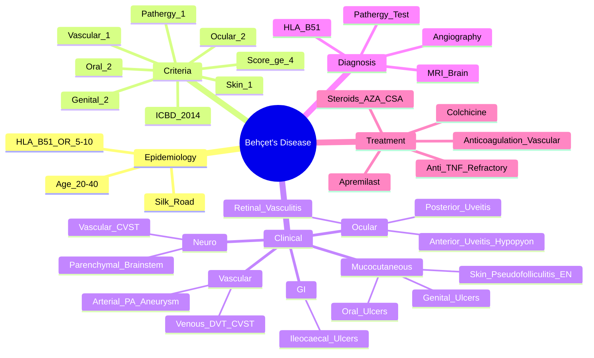

# Behçet's Disease

> [!tip] **FCPS/MRCP Priority: HIGH**
> Behçet's = **variable vessel vasculitis** with **oral/genital ulcers + uveitis + skin + pathergy**. **Silk Road distribution** (Turkey, Japan, Middle East). **ICBD 2014 criteria** (≥4 points). **HLA-B51** strong association. **Neuro-Behçet's + vascular + ocular** = major morbidity.

---

## Learning Objectives
By the end of this note you should be able to:
- [ ] Apply **ICBD 2014 classification criteria** (≥4 points)
- [ ] Recognise **classic tetrad**: **oral ulcers, genital ulcers, uveitis, skin lesions**
- [ ] Interpret **pathergy test** and **HLA-B51**
- [ ] Differentiate **neuro-Behçet's** (parenchymal vs vascular) and **vascular Behçet's** (venous > arterial, pulmonary artery aneurysm)
- [ ] Select treatment: **colchicine (mucocutaneous) → apremilast (oral) → steroids/immunosuppressants (severe) → anti-TNF (refractory)**
- [ ] Manage **venous thrombosis** (anticoagulation) and **pulmonary artery aneurysm** (immunosuppression + anticoagulation)

---

## 1. Definition & Epidemiology

| Feature | Detail |
|---------|--------|
| **Definition** | **Variable vessel vasculitis** (arteries + veins, all sizes) — **recurrent oral/genital ulcers + uveitis + skin lesions + pathergy** |
| **Distribution** | **Silk Road**: Turkey, Iran, Japan, China, Korea, Mediterranean — **highest in Turkey** (80-370/100,000) |
| **Incidence** | 0.5-15/100,000/year (varies by region) |
| **Peak Onset** | **20-40 years** |
| **Sex Ratio** | **M = F** (varies by region; M > F in Turkey, F > M in Japan/West) |
| **Genetics** | **HLA-B51** — **OR 5-10** (strongest association); ERAP1, IL10, IL23R |

---

## 2. Aetiology & Pathophysiology

```mermaid
flowchart LR
    A[Genetic Susceptibility\nHLA-B51, ERAP1, IL10, IL23R] --> B[Environmental Trigger\nInfection (Strep, HSV),\nMicrobiome, Trauma]
    B --> C[Innate Immune Activation\nNeutrophil Hyperreactivity,\nTh1/Th17 Polarisation]
    C --> D[Cytokine Storm\nIL-1β, IL-6, IL-17,\nIL-23, TNF-α, IFN-γ]
    D --> E[Vasculitis\nVariable Vessel\n(Arteries + Veins, All Sizes)]
    E --> F[Clinical Behçet's\nUlcers, Uveitis, Skin,\nVascular, Neuro, GI]
```

### Key Pathogenic Features
| Feature | Detail |
|---------|--------|
| **Neutrophil Hyperreactivity** | **Chemotaxis, ROS production, NETosis** — enhanced |
| **Th1/Th17 Polarisation** | **IL-12/IL-23 → IL-17, IFN-γ** — drives inflammation |
| **Pathergy** | **Needle prick → sterile pustule** — neutrophil exaggerated response |
| **Variable Vessel Vasculitis** | **All sizes** (arteries + veins) — **unique among vasculitides** |

---

## 3. Clinical Features

### Mucocutaneous (Diagnostic Hallmarks)
| Feature | Description | Frequency |
|---------|-------------|-----------|
| **Oral Ulcers** | **Recurrent (≥3/year)**, painful, round/oval, **heal without scarring** | **>99%** (often first symptom) |
| **Genital Ulcers** | **Scarring**, painful, scrotum/vulva/penis | 70-90% |
| **Skin Lesions** | **Pseudofolliculitis** (sterile pustules), **Erythema nodosum**, acneiform | 60-80% |
| **Pathergy Test** | **Sterile needle prick → papule/pustule at 24-48h** — **60-70% Turkey/Japan, <10% West** | Variable |

### Ocular — **Vision-Threatening**
| Manifestation | Frequency | Key Feature |
|---------------|-----------|-------------|
| **Anterior Uveitis** | 30-50% | **Hypopyon** (sterile), acute painful red eye, photophobia |
| **Posterior Uveitis** | 20-30% | Vitritis, retinal vasculitis, **branch retinal vein occlusion** |
| **Panuveitis** | 10-20% | Combined anterior + posterior |
| **Retinal Vasculitis** | Common | **Occlusive** — branch retinal vein/artery occlusion |

> [!critical] **Ocular Involvement = Leading Cause of Blindness**
> - **Anterior uveitis with hypopyon** = classic
> - **Posterior uveitis/retinal vasculitis** = more vision-threatening
> - **Urgent ophthalmology + immunosuppression**

### Vascular — **Venous > Arterial**
| Vessel | Manifestation |
|--------|---------------|
| **Venous Thrombosis** | **DVT (most common)**, **SVT**, **Cerebral Venous Sinus Thrombosis (CVST)**, **Budd-Chiari** (hepatic vein), **IVC/SVC thrombosis** |
| **Arterial** | **Aneurysm** (pulmonary artery aneurysm **characteristic**), **arterial thrombosis**, **arteritis** |
| **Superior Vena Cava Syndrome** | Thrombosis of SVC |

### Neurological — **Neuro-Behçet's**
| Type | Features |
|-------|----------|
| **Parenchymal** | **Brainstem** (most common) — pyramidal, cerebellar, cranial nerve signs; **hemispheric** — seizures, hemiparesis |
| **Vascular** | **CVST**, arterial thrombosis, aneurysm rupture, dural sinus thrombosis |

> [!critical] **Neuro-Behçet's = Poor Prognosis**
> - **Parenchymal** (brainstem) = worse prognosis
> - **Vascular** = CVST, aneurysm
> - **Brainstem involvement** = pyramidal signs, cranial nerve palsies

### Gastrointestinal
| Feature | Detail |
|---------|--------|
| **Ileocaecal Ulcers** | Most common — mimics Crohn's; **single, punched-out, deep** |
| **Symptoms** | Abdominal pain, diarrhoea, bleeding, intussusception |
| **Differentiation from Crohn's** | **Single ulcer** (vs multiple), **no granulomas**, **perianal disease rare** |

### Other
| System | Manifestation |
|--------|---------------|
| **Musculoskeletal** | Arthralgia (50%), non-erosive oligoarthritis (knees, ankles) |
| **Cardiac** | Pericarditis, myocarditis, coronary arteritis (rare) |
| **Pulmonary** | Pulmonary artery aneurysm (characteristic), thrombosis |

---

## 4. Classification Criteria — **ICBD 2014**

| Criterion | Points |
|-----------|--------|
| **Oral Aphthosis** (recurrent, ≥3/year) | **2** |
| **Genital Aphthosis** (scarring) | **2** |
| **Ocular Lesions** (anterior uveitis, posterior uveitis, retinal vasculitis) | **2** |
| **Skin Lesions** (pseudofolliculitis, erythema nodosum) | **1** |
| **Vascular** (venous thrombosis, arterial thrombosis, aneurysm) | **1** |
| **Positive Pathergy Test** | **1** |

**Total Score ≥4 = Behçet's Disease** (Sensitivity 94%, Specificity 96%)

> [!important] **ICBD vs Old Criteria**
> - **ICBD 2014**: Weighted scoring system
> - **Old ISG Criteria**: Oral ulcers mandatory + 2 of 4 (genital, ocular, skin, pathergy)
> - **ICBD more sensitive** for incomplete presentations

---

## 5. Diagnosis — Investigations

| Test | Role | Typical Finding |
|------|------|-----------------|
| **HLA-B51** | **Supportive** (not diagnostic) | **Positive** (OR 5-10); high in Silk Road populations |
| **Pathergy Test** | **Supportive** | Sterile needle → pustule at 24-48h (positive in 60-70% Turkey/Japan) |
| **ESR/CRP** | Activity marker | Elevated during flares |
| **Eye Exam** | **Fundus fluorescein angiography** (retinal vasculitis) | Vascular leakage, occlusion |
| **Brain MRI** | Neuro-Behçet's | Brainstem lesions, CVST |
| **Angiography/PET-CT** | Vascular involvement | Pulmonary artery aneurysm, venous thrombosis |
| **Colonoscopy** | GI involvement | Ileocaecal ulcers |
| **CSF** | Neuro-Behçet's | Lymphocytic pleocytosis, elevated protein |

> [!important] **Pathergy Test**
> - **Sterile needle prick (20G) → read at 24-48h**
> - **Positive**: Erythematous papule/pustule ≥2mm
> - **Sensitivity**: 60-70% (Turkey/Japan), **<10% (Western)**
> - **Specificity**: >95%

---

## 6. Management

```mermaid
flowchart TD
    A[Behçet's Diagnosis] --> B{Mucocutaneous\n(Oral/Genital Ulcers, Skin)}
    B -->|Mild| C[**Colchicine 0.5-1mg BD**\n1st line for mucocutaneous]
    B -->|Moderate/Refractory| D[**Apremilast 30mg BD**\n(Oral ulcers)\nOR **Dapsone**\n(Skin)]
    D --> E{Severe / Organ-Threatening}
    E -->|Ocular (Uveitis/Retinal Vasculitis)| F[**Steroids + Immunosuppressant**\n**Azathioprine** (1st)\n**Cyclosporine** (rapid control)\n**Anti-TNF** (Refractory)]
    E -->|Vascular (Venous Thrombosis)| G[**Anticoagulation**\n**LMWH/Warfarin**\n**Immunosuppression** (AZA/CYC/RTX)\n**CVST**: UFH → Warfarin + Steroids]
    E -->|Pulmonary Artery Aneurysm| H[**Immunosuppression** (CYC + Steroids)\n**Anticoagulation**\n**Anti-TNF** (Refractory)]
    E -->|Neuro-Behçet's| I[**High-dose Steroids**\n+ **Cyclophosphamide**\n+ **Anti-TNF**]
    E -->|GI (Ileocaecal Ulcers)| J[**Steroids + AZA**\nSurgery if stricture/perforation]
```

### Treatment by Manifestation

| Manifestation | 1st Line | Refractory |
|---------------|----------|------------|
| **Oral/Genital Ulcers** | **Colchicine 0.5-1mg BD** | **Apremilast 30mg BD**, Dapsone, **Anti-TNF** |
| **Skin (Pseudofolliculitis, EN)** | Colchicine, Dapsone | Anti-TNF, Thalidomide |
| **Anterior Uveitis** | Topical steroids + mydriatics | **Systemic steroids + AZA/Cyclosporine** |
| **Posterior Uveitis/Retinal Vasculitis** | **Steroids + AZA/Cyclosporine** | **Anti-TNF (Infliximab/Adalimumab)** |
| **Venous Thrombosis** | **Anticoagulation** (LMWH/Warfarin) + **Immunosuppression** (AZA/CYC) | **Anti-TNF**, IVIG |
| **Arterial Aneurysm (Pulmonary)** | **CYC + Steroids** | **Anti-TNF**, Endovascular repair |
| **Neuro-Behçet's (Parenchymal)** | **Pulse MP + CYC** | **Anti-TNF**, RTX, MMF |
| **GI Ulcers** | **Steroids + AZA** | **Anti-TNF**, Surgery if stricture |

> [!critical] **Anticoagulation in Vascular Behçet's**
> - **Venous thrombosis**: **Anticoagulation + Immunosuppression**
> - **Arterial aneurysm**: **Immunosuppression primary** (anticoagulation cautious)
> - **CVST**: **UFH → Warfarin + Steroids + Immunosuppression**

---

## 7. FCPS/MRCP High-Yield Summary

| Topic | Key Points |
|-------|------------|
| **Distribution** | **Silk Road** (Turkey, Iran, Japan, China) — **Highest in Turkey** |
| **Classic Tetrad** | **Oral ulcers, Genital ulcers, Uveitis, Skin lesions** |
| **ICBD 2014 Criteria** | **≥4 points**: Oral (2), Genital (2), Ocular (2), Skin (1), Vascular (1), Pathergy (1) |
| **Pathergy Test** | **Needle prick → pustule 24-48h**; **60-70% Turkey/Japan, <10% West** |
| **HLA-B51** | **OR 5-10** — strong association, Silk Road populations |
| **Ocular** | **Anterior uveitis (hypopyon)**, **Posterior uveitis, Retinal vasculitis** — **vision threat** |
| **Vascular** | **Venous > Arterial**; DVT, CVST, **Pulmonary artery aneurysm** (characteristic) |
| **Neuro-Behçet's** | **Parenchymal (brainstem)** + **Vascular (CVST, aneurysm)** |
| **GI** | **Ileocaecal ulcers** (single, deep) — mimics Crohn's |
| **Pathergy** | **Needle prick → pustule 24-48h**; high in Silk Road, low in West |
| **Treatment** | **Colchicine** (mucocutaneous) → **Apremilast** (oral ulcers) → **Steroids + AZA/CSA** (organ-threatening) → **Anti-TNF** (refractory) |
| **Anticoagulation** | **Venous thrombosis = anticoagulation + immunosuppression** |

---

## 8. Viva Questions (MRCP PACES / FCPS)

| Question | Expected Answer |
|----------|----------------|
| "A 28yo Turkish man has recurrent oral ulcers, genital ulcers, and painful red eye with hypopyon. HLA-B51 positive. Diagnosis?" | **Behçet's Disease** — classic triad (oral, genital, ocular). ICBD: oral (2) + genital (2) + ocular (2) = 6 ≥4. |
| "What are the ICBD 2014 criteria for Behçet's disease?" | ≥4 points: Oral ulcers (2), Genital ulcers (2), Ocular lesions (2), Skin lesions (1), Vascular (1), Pathergy test (1). |
| "What is the pathergy test and its significance?" | **Sterile needle prick → papule/pustule at 24-48h**. **Positive in 60-70% Turkey/Japan, <10% West**. Supports diagnosis but not required. |
| "What is the most characteristic vascular manifestation of Behçet's disease?" | **Pulmonary artery aneurysm** (characteristic); also **venous thrombosis** (DVT, CVST, Budd-Chiari). |
| "How does neuro-Behçet's present?" | **Parenchymal** (brainstem: pyramidal, cerebellar, cranial nerve signs) **and Vascular** (CVST, arterial thrombosis, aneurysm). |
| "What is the treatment for Behçet's uveitis?" | **Topical steroids + mydriatics** (anterior); **Systemic steroids + Azathioprine/Cyclosporine** (posterior/retinal); **Anti-TNF (Infliximab/Adalimumab)** if refractory. |
| "How do you manage venous thrombosis in Behçet's?" | **Anticoagulation (LMWH/Warfarin) + Immunosuppression** (Azathioprine/Cyclophosphamide/Rituximab). |
| "What is the GI manifestation of Behçet's and how to differentiate from Crohn's?" | **Ileocaecal ulcers** — **single, deep, punched-out** in Behçet's vs multiple, granulomatous in Crohn's. |
| "What is the significance of HLA-B51 in Behçet's?" | **Strong association (OR 5-10)**, highest in Silk Road populations. **Supportive, not diagnostic**. |
| "What is the pathergy test?" | **Sterile needle prick (20G) → erythematous papule/pustule ≥2mm at 24-48h**. 60-70% positive in Silk Road, <10% West. |

---

## 9. Confusions & Mnemonics

| Confusion | Clarification |
|-----------|---------------|
| **Behçet's vs Crohn's GI** | Behçet's = **single, deep, punched-out ileocaecal ulcer**; Crohn's = **multiple, granulomatous, perianal disease**. |
| **Oral Ulcers: Behçet's vs SLE** | Behçet's = **recurrent ≥3/year, heal without scarring**; SLE = **painless, palatal/buccal, scarring**. |
| **Pathergy Test** | **High in Silk Road** (Turkey/Japan 60-70%), **low in West** (<10%). Not required for diagnosis. |
| **Venous vs Arterial in Behçet's** | **Venous > Arterial** (DVT, CVST, Budd-Chiari). **Pulmonary artery aneurysm = arterial characteristic**. |
| **Pathergy Positivity** | **Geography-dependent** — high in Turkey/Japan, low in Europe/US. Don't rely on it in Western populations. |
| **Neuro-Behçet's** | **Parenchymal (brainstem) = worse prognosis**; Vascular = CVST, aneurysm. |

**Mnemonic: ICBD Criteria = "2-2-2-1-1-1"**
- **2** = Oral ulcers
- **2** = Genital ulcers
- **2** = Ocular lesions
- **1** = Skin lesions
- **1** = Vascular
- **1** = Pathergy
- **≥4 = Behçet's**

**Mnemonic: Classic Triad = "O-G-U"**
- **O**ral ulcers
- **G**enital ulcers
- **U**veitis

**Mnemonic: Vascular = "V-A-P"**
- **V**enous thrombosis (DVT, CVST, Budd-Chiari)
- **A**rterial aneurysm (pulmonary artery **characteristic**)
- **P**athergy (needle → pustule)

**Mnemonic: Neuro-Behçet's = "P-V"**
- **P**arenchymal (brainstem = pyramidal, cerebellar)
- **V**ascular (CVST, aneurysm)

**Mnemonic: Treatment Ladder = "C-A-S-T"**
- **C**olchicine (mucocutaneous)
- **A**premilast (oral ulcers)
- **S**teroids + **A**ZA/**C**SA (organ-threatening)
- **T**NF inhibitors (refractory)

**Mnemonic: HLA-B51 = "SILK ROAD"**
- **S**ilk **R**oad populations (Turkey, Iran, Japan, China)
- **O**dds **R**atio 5-10
- **A**ssociation strong
- **D**iagnostic? No, supportive only

---

## 10. Mind Map



---

## 11. One-Page Revision Card

| Domain | Key Points |
|--------|------------|
| **Epidemiology** | Silk Road (Turkey, Japan), HLA-B51 (OR 5-10), 20-40y |
| **ICBD Criteria** | ≥4 points: Oral (2), Genital (2), Ocular (2), Skin (1), Vascular (1), Pathergy (1) |
| **Classic Triad** | Oral ulcers (≥3/yr) + Genital ulcers (scarring) + Uveitis |
| **Pathergy Test** | Needle prick → pustule 24-48h; **Turkey/Japan 60-70%, West <10%** |
| **Ocular** | **Anterior uveitis (hypopyon)**, Posterior uveitis, Retinal vasculitis — **vision threat** |
| **Vascular** | **Venous > Arterial**; DVT, CVST, **Pulmonary artery aneurysm** (characteristic) |
| **Neuro-Behçet's** | Parenchymal (brainstem) + Vascular (CVST, aneurysm) |
| **GI** | **Ileocaecal ulcers** (single, deep) — mimics Crohn's |
| **Treatment** | Colchicine → Apremilast → Steroids + AZA/CSA → **Anti-TNF (refractory)** |
| **Anticoagulation** | Venous thrombosis = anticoagulation + immunosuppression |

---

## 12. Spaced Repetition Trackers

| Review Interval | Date Completed | Confidence (1-5) | Notes |
|-----------------|----------------|------------------|-------|
| 24 hours | | | |
| 7 days | | | |
| 15 days | | | |
| 30 days | | | |
| 90 days | | | |

---

## 13. Self-Test Scorecard

| Section | Score /5 | Last Attempt |
|---------|----------|--------------|
| ICBD Criteria Application | | |
| Pathergy Test Interpretation | | |
| Ocular Manifestations | | |
| Vascular Manifestations | | |
| Neuro-Behçet's Types | | |
| Treatment Algorithm | | |
| Viva Questions | | |

---

## Local Navigation
- **Parent Heading**: [[../Vasculitis|Vasculitis]]
- **Parent Topic Group**: [[Primary systemic vasculitides overview]]
- **Chapter Map**: [[../Davidson Chapter 26 - Rheumatology Hierarchy|Rheumatology Hierarchy]]
- **Chapter MOC**: [[../Rheumatology MOC|Rheumatology MOC]]
- **Drug Reference**: [[../../Clinical Approach to Musculoskeletal Disease/Drugs in rheumatology|Drugs in rheumatology]]
- **Related**: [[IgA vasculitis (Henoch-Schönlein purpura)]] · [[Polyarteritis nodosa (PAN)]] · [[Drugs in rheumatology]]