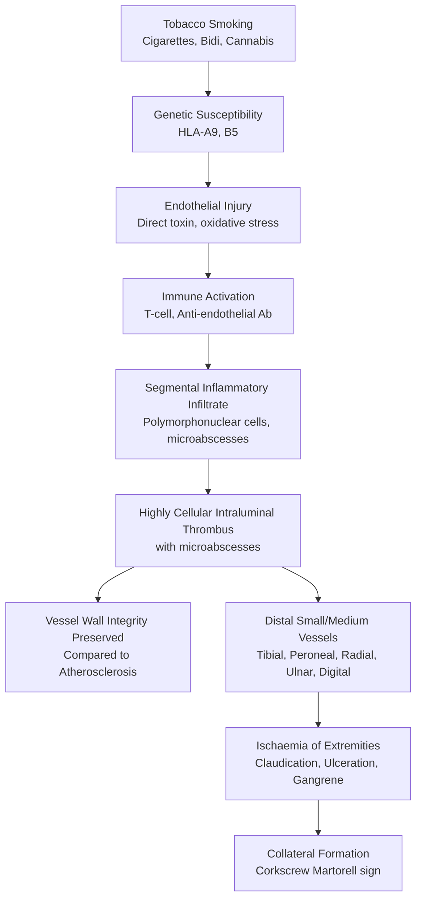
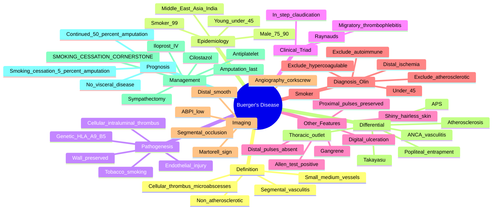

# Buerger's Disease (Thromboangiitis Obliterans)

> [!tip] **FCPS/MRCP Priority: HIGH**
> Buerger's disease = **non-atherosclerotic segmental inflammatory vasculitis + thrombosis** of **small/medium arteries and veins** in **young male smokers** (<45y). Must know: **smoking is the only proven cause**, **"in-step" claudication** (sole/arch of foot), **Raynaud's, migratory superficial thrombophlebitis, digital gangrene, ulceration**, **strongly positive Allen's test**, **shiny skin + trophic changes + absent distal pulses**, **critical ischaemia + amputation risk**, and the **cornerstone of treatment: smoking cessation** (no drugs reverse disease without it).

---

## Learning Objectives
By the end of this note you should be able to:
- [ ] Define Buerger's disease as **non-atherosclerotic segmental vasculitis** in **young male smokers**
- [ ] Recognise the classic **triad**: **claudication + Raynaud's + thrombophlebitis**
- [ ] Distinguish from **atherosclerosis, Takayasu, ANCA-vasculitis, hypercoagulable states**
- [ ] Apply **Shionoya, Olin, or Papaioannou diagnostic criteria**
- [ ] Use **angiography** to show **"corkscrew" collaterals** (Martorell sign)
- [ ] Manage with **smoking cessation (essential)**, vasodilators, iloprost, sympathectomy, amputation
- [ ] Counsel on **prognosis without smoking cessation** (progression to amputation)

---

## 1. Definition & Epidemiology
| Feature | Detail |
|---------|--------|
| **Definition** | **Non-atherosclerotic segmental inflammatory vasculitis** of small/medium arteries and veins, with **highly cellular intraluminal thrombosis** |
| **Synonym** | Thromboangiitis obliterans (TAO), Winiwarter-Buerger disease |
| **Prevalence** | 1-10/100,000 (varies with smoking prevalence); 0.5-5% of all PAD |
| **Age** | **<45 years** (peak 20-40y) |
| **Sex** | **Male 75-90%** (increasing in women with smoking) |
| **Ethnicity** | **Middle East, Asia, India, SE Asia** (high smoking populations); rare in African/European |
| **Genetics** | **HLA-A9, HLA-B5** associations |
| **Essential cause** | **TOBACCO SMOKING** (cigarettes, bidi, hookah, cannabis) — almost universal |

> [!important] **Smoking is the Cause**
> Buerger's disease is **strongly tied to tobacco use**. **99% of patients smoke**. Smoking cessation is the **only** treatment that halts progression. Continued smoking → amputation (50% within 5y).

---

## 2. Pathophysiology

### Pathology — Hallmark
| Feature | Detail |
|---------|--------|
| **Type** | **Segmental** (skip lesions, intervening normal) |
| **Vessels** | **Small + medium** arteries **AND** veins (pan-vasculitis) |
| **Wall** | **Relatively preserved** (unlike atherosclerosis/other vasculitis) |
| **Thrombus** | **Highly cellular** with **neutrophil microabscesses** (pathognomonic) |
| **Stages** | Acute (cellular thrombus) → Subacute (organisation) → Chronic (fibrosis) |

---

## 3. Clinical Features
### Classic Triad
| Feature | Description |
|---------|-------------|
| **Claudication** | **"In-step"** (sole of foot, arch) — unusual in atherosclerosis; also calf, forearm, hand |
| **Raynaud's phenomenon** | 40-50% — cold-induced digital ischaemia |
| **Migratory superficial thrombophlebitis** | 30-40% — recurrent, segmental, in unusual sites (chest, abdominal wall) |

### Other Features
| Feature | Description |
|---------|-------------|
| **Rest pain** | Critical ischaemia, worse at night, dependent position |
| **Ulceration** | Distal (toes, fingers, dorsum of foot); painful; slow to heal |
| **Gangrene** | Digital (toes, fingers); **>40% require amputation** (in continued smokers) |
| **Cold sensitivity** | Severe — even mild cold worsens |
| **Trophic changes** | **Shiny, hairless, atrophic skin**; thickened, brittle nails |
| **Allen test** | **Strongly positive** — delayed refill from radial/ulnar |
| **Pulse** | Distal pulses (DP, PT, radial, ulnar) **absent/diminished**; femoral/brachial preserved |
| **Sensory** | Paraesthesia, burning (chronic ischaemia) |
| **Joint** | Migratory arthralgia, sometimes inflammatory |

### Sites
- **Lower limb** (75%): tibial, peroneal, plantar, digital
- **Upper limb** (50%): radial, ulnar, digital
- **Both upper + lower** in 30-40%

> [!warning] **Critical Ischaemia in a Young Smoker = Buerger's**
> Young man (<45y), heavy smoker, painful legs/feet, **instep claudication**, distal ulceration, **absent DP/PT pulses, present femoral pulse, normal ECG, no diabetes, no hyperlipidaemia** = Buerger's until proven otherwise.

---

## 4. Diagnosis — Criteria
### Olin Criteria (2000)
| Criterion | Detail |
|-----------|--------|
| **Age ≤45y** at onset |
| **Current/recent tobacco use** |
| **Distal extremity ischemia** (claudication, rest pain, ulceration, gangrene) |
| **Exclusion of autoimmune disease** (negative ANA, RF, ANCA) |
| **Exclusion of hypercoagulable state** (negative thrombophilia screen) |
| **Exclusion of atherosclerotic risk factors** (no diabetes, no hyperlipidaemia, normal ECG) |
| **Imaging-confirmed distal disease** (angiography, US) |

### Shionoya Criteria (1983) — All Required
1. **Smoking history**
2. **Onset <50y**
3. **Infrapopliteal arterial occlusion** (or upper limb equivalent)
4. **Either upper limb involvement OR migratory thrombophlebitis**
5. **Exclusion of autoimmune/hypercoagulable states**

### Papaioannou Criteria (Modified)
- Age <45, male, smoker
- Infrapopliteal + upper limb disease
- Migratory thrombophlebitis
- Raynaud's
- Exclude other causes

---

## 5. Investigations
### Baseline
| Test | Purpose |
|------|---------|
| **FBC, ESR, CRP** | Baseline inflammation (often normal between flares) |
| **ANA, RF, anti-CCP, ANCA** | **Exclusion** of autoimmune vasculitis |
| **Thrombophilia screen** | **Exclusion** (factor V Leiden, PT/proc, ACLA, lupus anticoagulant, homocysteine, antithrombin, protein C/S) |
| **Lipid profile, HbA1c** | **Exclusion** of atherosclerotic risk |
| **ECG, echo** | Exclude cardiac source of embolism |

### Imaging
| Modality | Findings |
|----------|----------|
| **Angiography (DSA / CTA / MRA)** | **"Corkscrew" collaterals** (Martorell sign) — pathognomonic; **segmental occlusions**; **distal, smooth, non-calcified** vessels; **infrapopliteal** (tibial, peroneal); no proximal source |
| **Duplex ultrasound** | Distal occlusion, monophasic waveforms |
| **CT/MR angiography** | Non-invasive; confirm distal disease |
| **Ankle-brachial pressure index (ABPI)** | <0.9 (low); often unrecordable at toe |
| **Toe pressure / TcPO2** | Severe reduction (<30 mmHg) |
| **Tissue biopsy** | **Hypercellular thrombus with microabscesses** (rare, only if needed to exclude) |

### Exclude
- **Atherosclerosis** (older, risk factors, proximal disease)
- **Takayasu** (young, large vessel, inflammatory, women)
- **GCA** (>50y, cranial)
- **ANCA-vasculitis** (ANCA +ve)
- **Antiphospholipid syndrome** (lupus anticoagulant, ACLA +ve)
- **Embolism** (cardiac source, sudden onset)
- **Thoracic outlet syndrome** (unilateral, position-related)
- **Cystic adventitial disease, popliteal entrapment** (younger, mechanical)

---

## 6. Management
### Step 1 — Smoking Cessation (THE cornerstone)
| Action | Notes |
|--------|-------|
| **Complete cessation** | **ALL** tobacco (cigarettes, bidi, hookah, cannabis, e-cigarettes if relevant) |
| **Mechanism** | Removes the trigger; disease progression halts |
| **Outcomes** | **50% amputation rate** in continued smokers vs **<5%** in those who quit |
| **Counseling + NRT + varenicline/bupropion** | Standard support |
| **"Cold turkey"** not adequate — use combined behavioural + pharmacotherapy |

> [!important] **Smoking Cessation Saves Limbs**
> Buerger's disease is one of the most powerful examples of the effect of lifestyle on disease. **Continued smoking → amputation in 40-50% within 5-10 years**. **Complete cessation → halting of disease, healing of ulcers**.

### Step 2 — Pharmacotherapy
| Drug | Mechanism | Notes |
|------|-----------|-------|
| **Iloprost** (prostacyclin analogue) | **Vasodilator, antiplatelet, cytoprotective** | **Most evidence** for critical ischaemia; IV infusion 3-28 days; expensive |
| **Cilostazol** | Phosphodiesterase III inhibitor, vasodilator, antiplatelet | Improve walking distance; **avoid in HF** |
| **Aspirin / clopidogrel** | Antiplatelet | Standard for PAD |
| **Statin** | Plaque stabilisation (if some atherosclerosis) | Often used |
| **Pentoxifylline** | ↓ Blood viscosity | Modest benefit |
| **Bosentan** (endothelin receptor antagonist) | For digital ulceration (esp. in scleroderma) | Case reports in Buerger's |
| **Sildenafil / tadalafil** | PDE5 inhibitor; vasodilator | Case reports |

> [!tip] **Iloprost is Best-Evidenced**
> **IV iloprost** improves ulcer healing, pain, and amputation rates vs placebo. Use during **active critical ischaemia** in non-quitters (or as bridge in quitters).

### Step 3 — Surgical / Interventional
| Indication | Intervention |
|------------|--------------|
| **Failure of medical Rx** | **Surgical sympathectomy** (lumbar for lower limb, cervico-dorsal for upper) |
| **Critical ischaemia with tissue loss** | **Distal bypass** (limited role — distal vessels poor) |
| **Digital gangrene** | **Amputation** (last resort) — but only if extensive |
| **Refractory pain** | Sympathectomy, spinal cord stimulation |
| **Revascularisation** | Often **impossible** — distal vessels involved |
| **Therapeutic angiogenesis** | **VEGF gene therapy**, **stem cells** (investigational) |

### Step 4 — Supportive
- **Pain control** (neuropathic: gabapentin, amitriptyline, pregabalin; opiates if needed)
- **Wound care** (specialist podiatry, dressings, offloading)
- **Foot care** (warm, dry, avoid trauma, regular podiatry)
- **Cold avoidance**
- **Exercise** (supervised walking) within pain limits
- **Infection control** (any ulcer/infection = urgent treatment; risk of osteomyelitis)

---

## 7. Special Situations
### Cannabis Arteritis
- **Variant** of Buerger's
- Associated with **cannabis** (often in young adults)
- **Cessation** = mainstay
- Consider when young man with digital ischaemia but no tobacco use

### Pregnancy
- Buerger's is rare in women of reproductive age
- If occurs, multidisciplinary care
- **Smoking cessation is paramount**

### Occupational / Recreational Exposure
- Some cases associated with **arsenic exposure** (industrial)
- **Arteritis** vs Buerger's distinguished histologically

---

## 8. Prognosis
| Factor | Outcome |
|--------|---------|
| **Smoking cessation** | **Halts progression**; ulcer healing; **5y amputation <5%** |
| **Continued smoking** | **50% amputation rate** within 5-10y |
| **Mortality** | Not directly increased (no visceral organ involvement) |
| **Quality of life** | Significantly affected by chronic pain, amputations |
| **Major amputation** | (Above ankle) 5-10% with cessation, 30-40% without |
| **Minor amputation** (digital) | 30-40% continued smoking, 10-20% cessation |
| **Disease remains in extremities** | **No coronary, cerebral, or visceral involvement** (key differentiator from atherosclerosis) |

---

## 9. FCPS/MRCP High-Yield Summary
| Topic | Key Points |
|-------|------------|
| **Definition** | Non-atherosclerotic segmental vasculitis; small/medium arteries + veins; intraluminal cellular thrombus with microabscesses |
| **Demographics** | **<45y, M (75-90%), smoker (99%)**; Middle East/Asia/India |
| **Cause** | **Tobacco smoking** (cigarettes, bidi, hookah, cannabis) — only proven cause |
| **Clinical triad** | **Claudication + Raynaud's + migratory thrombophlebitis** |
| **"In-step" claudication** | Sole of foot/arch — unusual in atherosclerosis, **suggests Buerger's** |
| **Allen test** | Strongly positive (delayed refill) |
| **Pulses** | Distal absent (DP, PT, radial, ulnar); proximal preserved (femoral, brachial) |
| **Olin criteria** | <45y + smoker + distal ischaemia + exclude autoimmune/hypercoagulable/atherosclerotic |
| **Angiography** | **"Corkscrew" collaterals (Martorell sign)**; segmental; distal; smooth |
| **Pathology** | Cellular intraluminal thrombus with **microabscesses** (pathognomonic) |
| **Treatment cornerstone** | **SMOKING CESSATION** (50% → 5% amputation) |
| **Iloprost** | Best-evidenced drug for critical ischaemia |
| **Cilostazol** | Improve walking distance |
| **Surgical** | **Lumbar sympathectomy**; bypass (limited role); **amputation last resort** |
| **Differentiate from** | Atherosclerosis, Takayasu, GCA, ANCA-vasculitis, APS, embolism, TOS |
| **No visceral disease** | **Stays in extremities** (key differentiator) |

---

## 10. Viva Questions (MRCP PACES / FCPS)
| Question | Expected Answer |
|----------|-----------------|
| "A 30yo Indian man, 20 cigarettes/day, presents with bilateral foot pain, instep claudication, and digital gangrene. Distal pulses absent. ECG normal, no diabetes, no lipids. Diagnosis?" | **Buerger's disease** (thromboangiitis obliterans). Apply Olin criteria: <45, smoker, distal ischaemia, no atherosclerotic risk, no autoimmune markers. |
| "What is the Martorell sign?" | **"Corkscrew" collaterals** on angiography in Buerger's — pathognomonic; **distal, smooth, non-calcified** segmental occlusions. |
| "What is the single most important treatment?" | **Smoking cessation** (complete, all forms). Reduces amputation from 50% to <5%. |
| "How does Buerger's differ from atherosclerosis?" | **Atherosclerosis**: older, risk factors, proximal disease (iliac, femoral, carotid), calcified, systemic. **Buerger's**: <45y, smoker, **distal** (tibial, peroneal, radial, ulnar, digital), **no calcification**, **instep claudication**, **no visceral involvement**. |
| "Best evidenced drug therapy?" | **IV iloprost** (prostacyclin analogue) for critical ischaemia. Improves ulcer healing, pain, amputation risk. |
| "Role of bypass surgery?" | **Limited** — distal vessels are diseased; bypass often fails. Used selectively in limited disease with good runoff. |
| "Buerger's disease in women?" | Rare (5-10% historically); **rising with smoking** in women. Same diagnostic criteria apply. |
| "Why are autoimmune and hypercoagulable states tested?" | To **exclude** them (Buerger's is a diagnosis of exclusion). Positive ANA/ANCA → other vasculitis. Positive ACLA/lupus anticoagulant → APS. |

---

## 11. Confusions & Mnemonics
| Confusion | Clarification |
|-----------|---------------|
| **Buerger's vs atherosclerosis** | **Age, location, smoking, no risk factors**. Buerger's = distal, no proximal, no calcification, no visceral disease |
| **Buerger's vs Takayasu** | Takayasu = **large vessel (aorta/branches), F, Asian, <40**, inflammatory, **constitutional + BP diff**. Buerger's = **small/medium distal, M, smoker, <45**, distal ischaemia, **no BP issues** |
| **Buerger's vs ANCA-vasculitis** | ANCA +ve, respiratory, renal, etc. — not in Buerger's. **Exclusion criteria** |
| **Vasculitis or vasculopathy?** | Buerger's = **vasculitis** (inflammatory infiltrate, microabscesses) but vessel wall preserved vs other vasculitis |
| **Cellular thrombus** | **Microabscesses within thrombus** are **pathognomonic** for Buerger's |
| **Raynaud's in Buerger's** | 40-50% — secondary Raynaud's, less severe than scleroderma |
| **Cannabis arteritis** | Variant — young, no tobacco, cannabis only; **same pathology and treatment** |

**Mnemonic: Buerger's = "SMOKING YOUNG MAN"**
- **S**moking (99%)
- **M**ale 75-90%
- **O**nset <45y
- **K**or-T (Turkish, Indian, Asian)
- **I**nstep claudication
- **N**o atherosclerotic risk factors
- **G**angrene (digital)
- **Y**ou must quit smoking
- **O**'s sign = corkscrew collaterals (Martorell)
- **U**lceration (distal)
- **N**ail changes, hair loss
- **G**angrene (if not quit)
- **M**igratory thrombophlebitis
- **A**llen test positive
- **N**o visceral disease

**Mnemonic: Olin criteria = "ASIA"**
- **A**ge ≤45
- **S**moker
- **I**schemia distal
- **A**utoimmune/hypercoagulable/atherosclerotic excluded

**Mnemonic: Treatment pyramid "SMOKING STOP → ILOPROST → SURGERY"**
- **SMOKING STOP** (cornerstone; amputation 50% → 5%)
- **ILOPROST** IV (best evidence; critical ischaemia)
- **C**ilostazol (walking)
- **S**urgical sympathectomy (refractory)
- **S**tem cells / VEGF (investigational)
- **A**mputation (last resort)

**Mnemonic: Martorell "Corkscrew" = "WINES"**
- **W**iggly, **I**nstep, **N**o calcification, **E**xclusion diagnosis, **S**mall distal

**Mnemonic: Distinguish Buerger's from "PAT"**
- **P**opliteal entrapment (mechanical, young athletes)
- **A**therosclerosis (older, risk factors, proximal)
- **T**akayasu (young, large vessel, F)

---

## 12. Mind Map

---

## 13. One-Page Revision Card
| Domain | Key Points |
|--------|------------|
| **Definition** | Non-atherosclerotic segmental vasculitis; small/medium vessels; cellular thrombus with microabscesses |
| **Demographics** | **<45y, M (75-90%), smoker (99%)**; Middle East/Asia/India |
| **Cause** | **Tobacco smoking** (cigarettes, bidi, hookah, cannabis) |
| **Triad** | **Claudication + Raynaud's + migratory thrombophlebitis** |
| **In-step claudication** | Sole/arch — pathognomonic pattern |
| **Allen test** | Strongly positive |
| **Pulses** | Distal absent, proximal preserved |
| **Olin criteria** | <45, smoker, distal ischaemia, exclude other causes |
| **Angiography** | **Corkscrew collaterals (Martorell sign)**, segmental, distal |
| **Pathology** | Cellular intraluminal thrombus with **microabscesses** |
| **Smoking cessation** | **Cornerstone**; 50% → 5% amputation |
| **Iloprost** | Best evidence for critical ischaemia |
| **Cilostazol** | Walking distance |
| **Sympathectomy** | Refractory pain/ulcer |
| **Amputation** | Last resort (continued smoking) |
| **No visceral** | Stays in extremities (key differentiator) |

---

## 14. Spaced Repetition Trackers
| Review Interval | Date Completed | Confidence (1-5) | Notes |
|-----------------|----------------|------------------|-------|
| 24 hours | | | |
| 7 days | | | |
| 15 days | | | |
| 30 days | | | |
| 90 days | | | |

---

## 15. Self-Test Scorecard
| Section | Score /5 | Last Attempt |
|---------|----------|--------------|
| Buerger's vs atherosclerosis | | |
| Olin criteria | | |
| Martorell sign | | |
| Smoking cessation outcomes | | |
| Iloprost role | | |
| Pathology (cellular thrombus) | | |
| Allen test | | |
| Migratory thrombophlebitis | | |
| In-step claudication | | |
| Viva Questions | | |

---

## Local Navigation
- **Parent Heading**: [[../Vasculitis|Vasculitis]]
- **Parent Topic Group**: [[Secondary vasculitides]]
- **Sibling Topics**: [[Takayasu arteritis]] · [[Giant cell arteritis (temporal arteritis)]] · [[ANCA-associated vasculitis overview]] · [[Secondary vasculitides]] · [[Behçet's disease]]
- **Chapter Map**: [[../Davidson Chapter 26 - Rheumatology Hierarchy|Rheumatology Hierarchy]]
- **Chapter MOC**: [[../Rheumatology MOC|Rheumatology MOC]]
- **Related**: [[Drugs in rheumatology]] · [[Investigations in rheumatology]]
---

> Auto-generated study sections for "Vasculitis" — Ch 25: Rheumatology & Bone Disease.

## Flashcards (74 generated)

- Q: What is the definition of Vasculitis?
  A: Non-atherosclerotic segmental inflammatory vasculitis of small/medium arteries and veins, with highly cellular intraluminal thrombosis
- Q: What is Synonym of Vasculitis?
  A: Thromboangiitis obliterans (TAO), Winiwarter-Buerger disease
- Q: What is the epidemiology of Vasculitis?
  A: 1-10/100,000 (varies with smoking prevalence); 0.5-5% of all PAD
- Q: What is Age of Vasculitis?
  A: <45 years (peak 20-40y)
- Q: What is Sex of Vasculitis?
  A: Male 75-90% (increasing in women with smoking)
- Q: What is Ethnicity of Vasculitis?
  A: Middle East, Asia, India, SE Asia (high smoking populations); rare in African/European
- Q: What is Genetics of Vasculitis?
  A: HLA-A9, HLA-B5 associations
- Q: What causes Vasculitis?
  A: TOBACCO SMOKING (cigarettes, bidi, hookah, cannabis) — almost universal
- Q: How is Vasculitis classified?
  A: Segmental (skip lesions, intervening normal)
- Q: What is Vessels of Vasculitis?
  A: Small + medium arteries AND veins (pan-vasculitis)
- Q: What is Wall of Vasculitis?
  A: Relatively preserved (unlike atherosclerosis/other vasculitis)
- Q: What is Thrombus of Vasculitis?
  A: Highly cellular with neutrophil microabscesses (pathognomonic)
- Q: What is Claudication of Vasculitis?
  A: "In-step" (sole of foot, arch) — unusual in atherosclerosis; also calf, forearm, hand
- Q: What is Raynaud's phenomenon of Vasculitis?
  A: 40-50% — cold-induced digital ischaemia
- Q: What is Migratory superficial thrombophlebitis of Vasculitis?
  A: 30-40% — recurrent, segmental, in unusual sites (chest, abdominal wall)
- Q: What is Rest pain of Vasculitis?
  A: Critical ischaemia, worse at night, dependent position
- Q: What is Ulceration of Vasculitis?
  A: Distal (toes, fingers, dorsum of foot); painful; slow to heal
- Q: What is Gangrene of Vasculitis?
  A: Digital (toes, fingers); >40% require amputation (in continued smokers)
- Q: What is Cold sensitivity of Vasculitis?
  A: Severe — even mild cold worsens
- Q: What is Trophic changes of Vasculitis?
  A: Shiny, hairless, atrophic skin; thickened, brittle nails
- Q: What is the investigation of choice for Vasculitis?
  A: Strongly positive — delayed refill from radial/ulnar
- Q: What is Pulse of Vasculitis?
  A: Distal pulses (DP, PT, radial, ulnar) absent/diminished; femoral/brachial preserved
- Q: What is Sensory of Vasculitis?
  A: Paraesthesia, burning (chronic ischaemia)
- Q: What is Joint of Vasculitis?
  A: Migratory arthralgia, sometimes inflammatory
- Q: What is FBC, ESR, CRP of Vasculitis?
  A: Baseline inflammation (often normal between flares)
- Q: What is ANA, RF, anti-CCP, ANCA of Vasculitis?
  A: Exclusion of autoimmune vasculitis
- Q: What is Thrombophilia screen of Vasculitis?
  A: Exclusion (factor V Leiden, PT/proc, ACLA, lupus anticoagulant, homocysteine, antithrombin, protein C/S)
- Q: What is Lipid profile, HbA1c of Vasculitis?
  A: Exclusion of atherosclerotic risk
- Q: What is ECG, echo of Vasculitis?
  A: Exclude cardiac source of embolism
- Q: What is Failure of medical Rx of Vasculitis?
  A: Surgical sympathectomy (lumbar for lower limb, cervico-dorsal for upper)
- Q: What is Critical ischaemia with tissue loss of Vasculitis?
  A: Distal bypass (limited role — distal vessels poor)
- Q: What is Digital gangrene of Vasculitis?
  A: Amputation (last resort) — but only if extensive
- Q: What is Refractory pain of Vasculitis?
  A: Sympathectomy, spinal cord stimulation
- Q: What is Revascularisation of Vasculitis?
  A: Often impossible — distal vessels involved
- Q: What is Therapeutic angiogenesis of Vasculitis?
  A: VEGF gene therapy, stem cells (investigational)
- Q: How is Vasculitis classified?
  A: Segmental (skip lesions, intervening normal)
- Q: What is Vessels of Vasculitis?
  A: Small + medium arteries AND veins (pan-vasculitis)
- Q: What is Wall of Vasculitis?
  A: Relatively preserved (unlike atherosclerosis/other vasculitis)
- Q: What is Thrombus of Vasculitis?
  A: Highly cellular with neutrophil microabscesses (pathognomonic)
- Q: What is Claudication of Vasculitis?
  A: "In-step" (sole of foot, arch) — unusual in atherosclerosis; also calf, forearm, hand
- Q: What is Raynaud's phenomenon of Vasculitis?
  A: 40-50% — cold-induced digital ischaemia
- Q: What is Rest pain of Vasculitis?
  A: Critical ischaemia, worse at night, dependent position
- Q: What is Ulceration of Vasculitis?
  A: Distal (toes, fingers, dorsum of foot); painful; slow to heal
- Q: What is Gangrene of Vasculitis?
  A: Digital (toes, fingers); >40% require amputation (in continued smokers)
- Q: What is Cold sensitivity of Vasculitis?
  A: Severe — even mild cold worsens
- Q: What is Trophic changes of Vasculitis?
  A: Shiny, hairless, atrophic skin; thickened, brittle nails
- Q: What is the investigation of choice for Vasculitis?
  A: Strongly positive — delayed refill from radial/ulnar
- Q: What is Pulse of Vasculitis?
  A: Distal pulses (DP, PT, radial, ulnar) absent/diminished; femoral/brachial preserved
- Q: What is Sensory of Vasculitis?
  A: Paraesthesia, burning (chronic ischaemia)
- Q: What is FBC, ESR, CRP of Vasculitis?
  A: Baseline inflammation (often normal between flares)
- Q: What is ANA, RF, anti-CCP, ANCA of Vasculitis?
  A: Exclusion of autoimmune vasculitis
- Q: What is Thrombophilia screen of Vasculitis?
  A: Exclusion (factor V Leiden, PT/proc, ACLA, lupus anticoagulant, homocysteine, antithrombin, protein C/S)
- Q: What is Lipid profile, HbA1c of Vasculitis?
  A: Exclusion of atherosclerotic risk
- Q: What is Failure of medical Rx of Vasculitis?
  A: Surgical sympathectomy (lumbar for lower limb, cervico-dorsal for upper)
- Q: What is Critical ischaemia with tissue loss of Vasculitis?
  A: Distal bypass (limited role — distal vessels poor)
- Q: What is Digital gangrene of Vasculitis?
  A: Amputation (last resort) — but only if extensive
- Q: What is Refractory pain of Vasculitis?
  A: Sympathectomy, spinal cord stimulation
- Q: What is Revascularisation of Vasculitis?
  A: Often impossible — distal vessels involved
- Q: What is the definition of Vasculitis?
  A: Non-atherosclerotic segmental vasculitis; small/medium arteries + veins; intraluminal cellular thrombus with microabscesses
- Q: What is Demographics of Vasculitis?
  A: <45y, M (75-90%), smoker (99%); Middle East/Asia/India
- Q: What causes Vasculitis?
  A: Tobacco smoking (cigarettes, bidi, hookah, cannabis) — only proven cause
- Q: What is Clinical triad of Vasculitis?
  A: Claudication + Raynaud's + migratory thrombophlebitis
- Q: What is "In-step" claudication of Vasculitis?
  A: Sole of foot/arch — unusual in atherosclerosis, suggests Buerger's
- Q: What is the investigation of choice for Vasculitis?
  A: Strongly positive (delayed refill)
- Q: What is Pulses of Vasculitis?
  A: Distal absent (DP, PT, radial, ulnar); proximal preserved (femoral, brachial)
- Q: What is Olin criteria of Vasculitis?
  A: <45y + smoker + distal ischaemia + exclude autoimmune/hypercoagulable/atherosclerotic
- Q: What is Angiography of Vasculitis?
  A: "Corkscrew" collaterals (Martorell sign); segmental; distal; smooth
- Q: What is Pathology of Vasculitis?
  A: Cellular intraluminal thrombus with microabscesses (pathognomonic)
- Q: How is Vasculitis managed?
  A: SMOKING CESSATION (50% → 5% amputation)
- Q: What is Iloprost of Vasculitis?
  A: Best-evidenced drug for critical ischaemia
- Q: What is Cilostazol of Vasculitis?
  A: Improve walking distance
- Q: What is Surgical of Vasculitis?
  A: Lumbar sympathectomy; bypass (limited role); amputation last resort
- Q: What is Differentiate from of Vasculitis?
  A: Atherosclerosis, Takayasu, GCA, ANCA-vasculitis, APS, embolism, TOS
- Q: What is No visceral disease of Vasculitis?
  A: Stays in extremities (key differentiator)

## MCQs (1 generated)

1. **Which of the following best describes Vasculitis?**
   A. **Buerger's disease = non-atherosclerotic segmental inflammatory vasculitis + thrombosis of small/medium arteries and veins in young male smokers (<45y).**
   B. An unrelated condition not matching the clinical picture of Vasculitis
   C. A complication seen late in the disease course of Vasculitis
   D. A condition that mimics Vasculitis but has a different underlying cause

## SBA Questions (1 generated)

1. A patient with suspected Vasculitis presents with: Definition — Non-atherosclerotic segmental inflammatory vasculitis of small/medium arteries and veins, with highly cellular intraluminal thrombosis; Synonym — Thromboangiitis obliterans (TAO), Winiwarter-Buerger disease; Prevalence — 1-10/100,000 (varies with smoking prevalence); 0.5-5% of all PAD. What is the most likely diagnosis?
   A. **Vasculitis**
   B. A condition that mimics Vasculitis but is not the same entity
   C. A complication of Vasculitis rather than the primary diagnosis
   D. An unrelated condition in the same clinical category as Vasculitis

