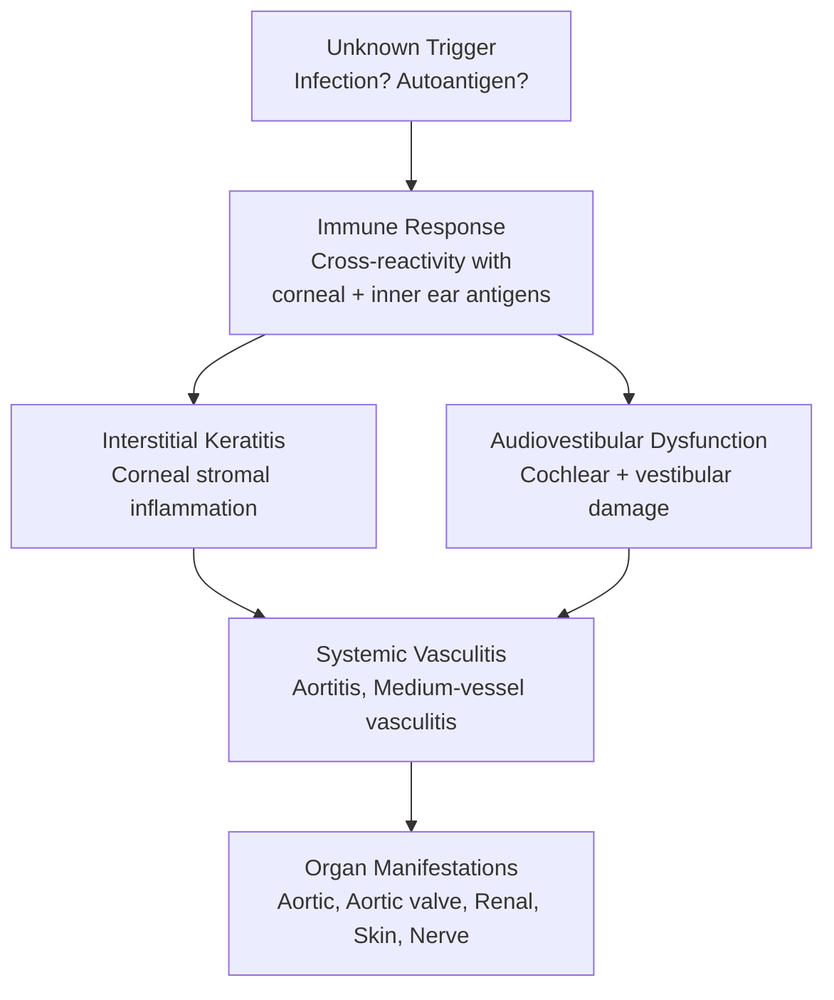
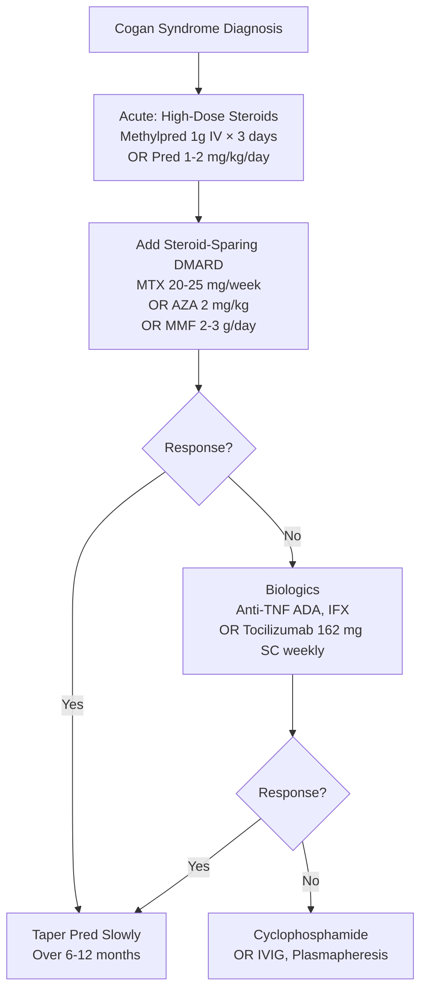
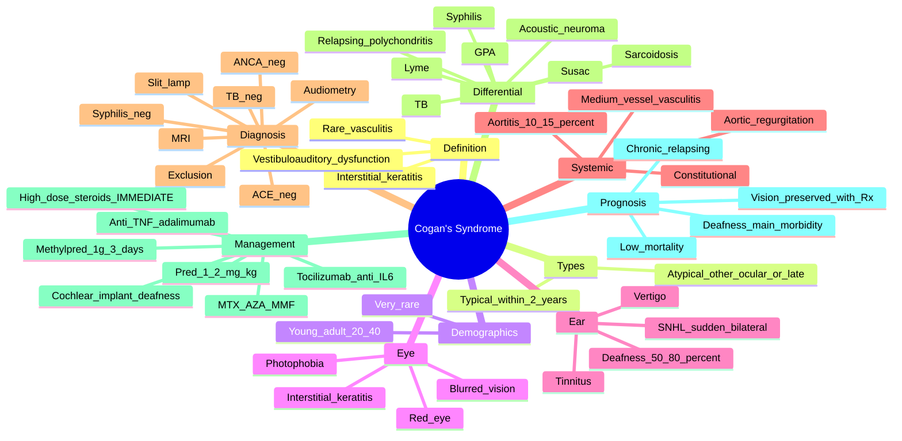

# Cogan's Syndrome

> [!tip] **FCPS/MRCP Priority: LOW-MEDIUM**
> Cogan's syndrome = **rare vasculitis** characterised by **interstitial keratitis + vestibuloauditory dysfunction** (eye + inner ear). Must know: **typical form** (interstitial keratitis + audiovestibular symptoms, weeks apart), **atypical form** (other ocular inflammation or audiovestibular onset >2y apart), **ANCA-negative**, **aortitis in 10%** (similar to Takayasu), and that **prompt treatment with steroids** is essential to **prevent deafness**.

---

## Learning Objectives
By the end of this note you should be able to:
- [ ] Define Cogan's syndrome as **interstitial keratitis + vestibuloauditory dysfunction**
- [ ] Differentiate **typical** vs **atypical** forms
- [ ] Recognise the **constitutional + vasculitic features** (aortitis, systemic vasculitis)
- [ ] Investigate with **audiometry, vestibular testing, slit-lamp, MRI, ANCA**
- [ ] Diagnose by **exclusion** (rule out infection, sarcoidosis, GPA, syphilis)
- [ ] Treat with **high-dose steroids + DMARDs + biologics (anti-TNF, tocilizumab)**
- [ ] Counsel on **deafness** as the main morbidity

---

## 1. Definition & Epidemiology
| Feature | Detail |
|---------|--------|
| **Definition** | **Rare vasculitis** with **interstitial keratitis + vestibuloauditory dysfunction**; systemic features possible (aortitis, vasculitis) |
| **First described** | Cogan, 1945 |
| **Prevalence** | **Very rare** (<1/million); ~300 cases in literature |
| **Age** | Young adult (20-40y); children possible |
| **Sex** | F > M (slight) or M = F |
| **Course** | Acute, subacute, chronic |

---

## 2. Classification
### Typical Cogan's Syndrome
- **Interstitial keratitis** (IK)
- **Audiovestibular symptoms** (sensorineural hearing loss, vertigo, tinnitus, ataxia)
- **Onset within 2 years** of ocular symptoms (often weeks)

### Atypical Cogan's Syndrome
- Ocular: other than IK (uveitis, scleritis, retinal vasculitis, optic neuritis, etc.)
- Audiovestibular: typical IK but **>2 years** between ocular and audiovestibular
- Both atypical ocular AND atypical audiovestibular

> [!tip] **Typical vs Atypical — Same Treatment**
> Both are treated with **high-dose steroids** + immunosuppression. Atypical is more likely to have **systemic vasculitis**.

---

## 3. Pathophysiology

### Hypothesis
- **Autoimmune** response with **cross-reactivity** between corneal and inner ear antigens
- **T-cell mediated** inflammation
- **Aortitis** = granulomatous (similar to Takayasu/GCA)
- **ANCA-negative** in most cases

---

## 4. Clinical Features
### Eye (Ocular)
| Feature | Detail |
|---------|--------|
| **Interstitial keratitis (IK)** | **Classic** (typical form); corneal stromal inflammation; **photophobia, blurred vision, red eye, pain**; bilateral often |
| **Other ocular inflammation** | Scleritis, episcleritis, uveitis, retinal vasculitis, retinal artery occlusion, optic neuritis (atypical) |

### Ear (Audiovestibular)
| Feature | Detail |
|---------|--------|
| **Sensorineural hearing loss (SNHL)** | **Sudden, often bilateral, fluctuating then progressive**; **Ménière-like** |
| **Vertigo** | Acute, with ataxia, nausea |
| **Tinnitus** | Common |
| **Vestibular dysfunction** | Unidirectional or bilateral |
| **Outcome** | **Bilateral deafness** in 50-80% without treatment |

### Systemic (10-50%)
| System | Features |
|--------|----------|
| **Constitutional** | Fever, weight loss, fatigue |
| **Aortitis** | **10-15%**; ascending aorta, arch (similar to Takayasu) |
| **Aortic valve** | Aortic regurgitation (from root dilatation) |
| **Medium-vessel vasculitis** | Renal, mesenteric, skin, peripheral nerve |
| **Skin** | Purpura, nodules, livedo |
| **Joint** | Arthralgia, myalgia |
| **Cardiac** | Pericarditis, myocarditis, coronary arteritis (rare) |
| **Neuropathy** | Mononeuritis multiplex |

---

## 5. Diagnosis
### Diagnostic Criteria (Proposed)
**Required:**
- **Bilateral audiovestibular dysfunction** (sensorineural hearing loss + vestibular symptoms)
- **Ocular inflammation** (typically interstitial keratitis)
- **Exclusion** of other causes (syphilis, sarcoidosis, GPA, TB, Lyme, post-viral)

### Investigations
| Test | Purpose |
|------|---------|
| **Audiometry** | Sensorineural hearing loss (high-frequency first) |
| **Vestibular testing** (caloric, VNG) | Vestibular dysfunction |
| **Slit-lamp examination** | **Interstitial keratitis** (corneal stromal infiltrate) |
| **Fundoscopy** | Retinal vasculitis (atypical) |
| **FBC, ESR, CRP** | Inflammation |
| **ANA, RF, ANCA** | **Negative** (exclusion of autoimmune) |
| **ACE** | Exclude sarcoidosis |
| **Syphilis serology** | Exclude syphilis |
| **Lyme serology** | Exclude Lyme (if exposure) |
| **TB / Quantiferon** | Exclude TB |
| **Blood cultures** | Exclude endocarditis (if fever) |
| **MRI brain / IAC** | Exclude acoustic neuroma, demyelination |
| **CT/MR aortogram** | **Aortitis** (10-15%); esp. if BP asymmetry, AR |
| **Echocardiogram** | Aortic valve, root diameter |
| **Renal biopsy** (if renal involvement) | Vasculitis |

### Differential Diagnosis
| Condition | Distinguishing |
|-----------|---------------|
| **GPA (Wegener's)** | c-ANCA/PR3, ENT + lung + renal, scleritis; no IK |
| **Sarcoidosis** | Bilateral hilar LAD, ↑ACE, granulomas; uveitis, not IK |
| **Syphilis (tertiary)** | STS +ve, latent infection, slowly progressive |
| **TB** | TB exposure, IGRA +ve, granulomas |
| **Lyme disease** | Erythema migrans, serology, joint (not IK) |
| **Post-viral SNHL** | Self-limiting, no recurrent IK |
| **Rheumatoid arthritis** | Symmetric polyarthritis, RF/CCP +ve |
| **SLE** | ANA +ve, multi-system, not typically IK |
| **Relapsing polychondritis** | Auricular, nasal, costal chondritis; sparing ear lobe |
| **Susac syndrome** | Triad: branch retinal artery + encephalopathy + SNHL; F > M |
| **Vestibular schwannoma** | Slowly progressive, MRI diagnostic |

---

## 6. Management
### Stepwise Approach

### Acute (First-Line)
| Therapy | Dose | Notes |
|---------|------|-------|
| **Methylprednisolone IV** | 500-1000 mg × 3 days | Severe, sensorineural hearing loss |
| **Prednisolone oral** | **1-2 mg/kg/day** (max 60-80 mg) | Initial; **prompt response critical** for hearing preservation |
| **Topical steroids** (eye) | Prednisolone acetate drops | For interstitial keratitis |

> [!critical] **Time-Critical for Hearing**
> **Delay > 2 weeks** of high-dose steroids → **permanent deafness**. Treat **aggressively and early**.

### Maintenance (Steroid-Sparing)
| Drug | Dose | Notes |
|------|------|-------|
| **MTX** | 20-25 mg weekly | First-line steroid-sparing |
| **AZA** | 2 mg/kg/day | Alternative |
| **MMF** | 2-3 g/day | Alternative |
| **Ciclosporin** | 3-5 mg/kg/day | Some evidence |

### Biologics (Refractory)
| Drug | Dose | Notes |
|------|------|-------|
| **Adalimumab** | 40 mg SC q2w | Anti-TNF; good response in case series |
| **Infliximab** | 5 mg/kg IV | Alternative anti-TNF |
| **Tocilizumab** | 162 mg SC weekly | **Best evidence** for inner ear inflammation; IL-6 |
| **Etanercept** | 50 mg weekly | Some reports |

### Other
| Therapy | Notes |
|---------|-------|
| **Cyclophosphamide** | Severe vasculitis (aortitis, renal); IV pulses |
| **IVIG** | Case reports; useful when other options limited |
| **Plasmapheresis** | Refractory |
| **Hearing aids / cochlear implant** | Once deafness established |
| **Vestibular rehabilitation** | For chronic vertigo |
| **Ophthalmology** | Slit-lamp follow-up; topical Rx for IK |

### Aortitis Management
- Same as **Takayasu/GCA** principles
- **High-dose steroids** + DMARD/biologic
- **Surgical repair** if aortic root >5 cm or severe AR
- **Imaging follow-up** (MRA/CTA)

---

## 7. Special Situations
### Pregnancy
- **Active disease** = high-risk (relapse, hearing loss progression)
- **Stable disease** for 6-12 months before conception
- **Safe in pregnancy**: Prednisolone, AZA, HCQ, tacrolimus; **ciclosporin** if needed
- **Avoid**: MTX, MMF, CYC
- **Tocilizumab** — limited data; consider if needed
- **Multidisciplinary care** (rheumatology, ENT, ophthalmology, obstetric medicine)

### Children
- **Cogan's syndrome** in children is rare
- Same treatment principles; **aggressive early therapy** to prevent deafness

### Refractory Disease
- **Switch biologics** (TNF ↔ tocilizumab)
- **IVIG**, **plasmapheresis** (case reports)
- **Cochlear implant** for deafness

---

## 8. Prognosis
| Factor | Outcome |
|--------|---------|
| **Overall** | Variable; often chronic relapsing |
| **Hearing** | **Bilateral deafness in 50-80%** without prompt treatment; **<20%** with early aggressive Rx |
| **Vision** | Generally preserved with treatment |
| **Systemic vasculitis** | 10-15% have aortitis; life-threatening if untreated |
| **Mortality** | Low; mainly from systemic vasculitis complications |
| **Quality of life** | Significantly affected by hearing loss, vertigo |

---

## 9. FCPS/MRCP High-Yield Summary
| Topic | Key Points |
|-------|------------|
| **Definition** | **Interstitial keratitis + vestibuloauditory dysfunction** (rare vasculitis) |
| **Typical** | IK + audiovestibular within 2 years (often weeks) |
| **Atypical** | Other ocular inflammation OR >2y onset between eye/ear |
| **Demographics** | Young adult (20-40y); rare |
| **Eye** | **Interstitial keratitis** (corneal stromal inflammation); photophobia, blurred vision |
| **Ear** | **Sudden sensorineural hearing loss** (often bilateral, fluctuating then progressive); vertigo, tinnitus |
| **Deafness risk** | 50-80% bilateral without Rx; <20% with early aggressive Rx |
| **Systemic** | 10-15% aortitis (similar to Takayasu); medium-vessel vasculitis |
| **Diagnosis** | Exclusion; ANCA neg, ACE neg, syphilis neg, TB neg |
| **Acute Rx** | **High-dose steroids immediately** (Methylpred 1g ×3d → Pred 1-2 mg/kg) |
| **Time-critical** | **Delay >2 weeks → permanent deafness** |
| **Steroid-sparing** | MTX, AZA, MMF |
| **Biologics** | **Tocilizumab** (best for inner ear), anti-TNF (ADA, IFX) |
| **Aortitis** | Same as Takayasu — surveillance, surgery at 5 cm |
| **Differential** | GPA, sarcoidosis, syphilis, TB, Lyme, Susac, relapsing polychondritis, acoustic neuroma |
| **Outcome** | Chronic relapsing; deafness is main morbidity |

---

## 10. Viva Questions (MRCP PACES / FCPS)
| Question | Expected Answer |
|----------|-----------------|
| "Cogan's syndrome — clinical definition?" | **Interstitial keratitis + vestibuloauditory dysfunction** (typically within 2 years). Rare vasculitis. |
| "Typical vs atypical?" | **Typical**: IK + audiovestibular within 2 years. **Atypical**: other ocular inflammation OR >2y between eye/ear OR atypical features in both. |
| "Most important prognostic factor in Cogan's?" | **Early aggressive treatment**. Delay >2 weeks → permanent deafness. High-dose steroids **immediately**. |
| "A 30yo woman has sudden bilateral hearing loss, vertigo, photophobia, red eyes. Most likely diagnosis?" | **Cogan's syndrome** (interstitial keratitis + vestibuloauditory). Exclude syphilis, sarcoidosis, GPA. |
| "Differential of eye + ear inflammation?" | Cogan's syndrome, **GPA** (c-ANCA, ENT + lung + renal), **sarcoidosis** (↑ACE), **syphilis** (STS +ve), **relapsing polychondritis** (cartilage, sparing ear lobe), **Susac syndrome** (retinal + encephalopathy + SNHL). |
| "What is the best biologic for inner ear inflammation in Cogan's?" | **Tocilizumab** (anti-IL-6) — best evidence in case series for inner ear inflammation. Anti-TNF (adalimumab, infliximab) also effective. |
| "Aortitis in Cogan's syndrome?" | **10-15%**; ascending aorta, arch; granulomatous (like Takayasu). Surveillance with MRA/CT. Surgery at aortic root >5 cm. |
| "Susac syndrome vs Cogan's?" | **Susac**: triad of **branch retinal artery occlusion + encephalopathy + SNHL**; F > M; 20-40y. **Cogan**: IK + audiovestibular without encephalopathy. |

---

## 11. Confusions & Mnemonics
| Confusion | Clarification |
|-----------|---------------|
| **Cogan's vs GPA** | GPA: c-ANCA, ENT + lung + renal, scleritis. **Cogan's**: IK + audiovestibular, ANCA neg |
| **Cogan's vs sarcoidosis** | Sarcoid: uveitis + bilateral hilar LAD + ↑ACE + granulomas. **Cogan's**: IK + audiovestibular, no systemic granulomas |
| **Cogan's vs relapsing polychondritis** | RP: auricular chondritis (sparing lobe), nasal, costal. **Cogan's**: IK + audiovestibular, no cartilage |
| **Cogan's vs Susac** | Susac: BRAO + encephalopathy + SNHL (triad). **Cogan's**: IK + audiovestibular (no brain involvement) |
| **Sensorineural vs conductive hearing loss** | SNHL = inner ear (Cogan's, presbyacusis). Conductive = middle ear (otosclerosis, effusion) |
| **Time-critical** | Delay >2 weeks → permanent deafness |
| **Ménière's vs Cogan's** | Ménière: episodic vertigo + SNHL + tinnitus + aural fullness. **Cogan's**: acute + bilateral + progressive + eye inflammation |

**Mnemonic: Cogan's = "EYE + EAR + AORTA"**
- **E**ye (interstitial keratitis)
- **Y**ou lose hearing (Ear)
- **E**xclusion diagnosis
- **A**ortitis (10-15%)
- **O**cular + audiovestibular within 2 years
- **R**are, young adult
- **T**reat early (steroids)
- **A**void deafness

**Mnemonic: Differential "EARS-EYE"**
- **E**ar (relapsing polychondritis, GPA, Susac, Ménière's)
- **A**utoimmune (SLE, RA, GPA)
- **R**elapsing polychondritis
- **S**arcoidosis
- **-**
- **E**ye (GPA, sarcoidosis, Behçet's, syphilis)
- **Y**ou need to differentiate

**Mnemonic: Treatment "P-M-T"**
- **P**rednisolone (high-dose immediate)
- **M**TX (steroid-sparing)
- **T**ocilizumab (refractory inner ear)

**Mnemonic: Cogan's triad (not really triad but) "E-V"**
- **E**ye: Interstitial Keratitis
- **V**estibulocochlear: SNHL + Vertigo

---

## 12. Mind Map

---

## 13. One-Page Revision Card
| Domain | Key Points |
|--------|------------|
| **Definition** | **Interstitial keratitis + vestibuloauditory dysfunction** |
| **Typical** | IK + audiovestibular within 2 years |
| **Atypical** | Other ocular OR >2y between eye/ear |
| **Demographics** | Young adult (20-40y); very rare |
| **Eye** | **Interstitial keratitis** (corneal stromal inflammation) |
| **Ear** | **Sudden SNHL (often bilateral)**, vertigo, tinnitus |
| **Deafness** | 50-80% without Rx; <20% with early aggressive Rx |
| **Systemic** | **Aortitis 10-15%** (Takayasu-like); medium-vessel vasculitis |
| **Diagnosis** | Exclusion; ANCA neg, ACE neg, syphilis neg, TB neg |
| **Acute Rx** | **Methylpred 1g IV ×3d → Pred 1-2 mg/kg** (immediate) |
| **Time-critical** | **Delay >2 weeks → permanent deafness** |
| **Steroid-sparing** | MTX, AZA, MMF |
| **Biologics** | **Tocilizumab** (best for inner ear), anti-TNF (ADA, IFX) |
| **Aortitis** | Surveillance, surgery at root >5 cm |
| **Differential** | GPA, sarcoidosis, syphilis, TB, Lyme, RP, Susac, acoustic neuroma |
| **Prognosis** | Chronic relapsing; deafness main morbidity |

---

## 14. Spaced Repetition Trackers
| Review Interval | Date Completed | Confidence (1-5) | Notes |
|-----------------|----------------|------------------|-------|
| 24 hours | | | |
| 7 days | | | |
| 15 days | | | |
| 30 days | | | |

---

## 15. Self-Test Scorecard
| Section | Score /5 | Last Attempt |
|---------|----------|--------------|
| Cogan's definition | | |
| Typical vs atypical | | |
| Eye features (IK) | | |
| Ear features (SNHL) | | |
| Aortitis (10-15%) | | |
| Differential | | |
| Time-critical Rx | | |
| Steroid-sparing | | |
| Tocilizumab for inner ear | | |
| Prognosis | | |
| Viva Questions | | |

---

## Local Navigation
- **Parent Heading**: [[../Vasculitis|Vasculitis]]
- **Parent Topic Group**: [[Secondary vasculitides]]
- **Sibling Topics**: [[Takayasu arteritis]] · [[Giant cell arteritis (temporal arteritis)]] · [[Behçet's disease]] · [[Secondary vasculitides]] · [[ANCA-associated vasculitis overview]]
- **Chapter Map**: [[../Davidson Chapter 26 - Rheumatology Hierarchy|Rheumatology Hierarchy]]
- **Chapter MOC**: [[../Rheumatology MOC|Rheumatology MOC]]
- **Related**: [[Drugs in rheumatology]] · [[Investigations in rheumatology]]
---

> Auto-generated study sections for "Vasculitis" — Ch 25: Rheumatology & Bone Disease.

## Flashcards (18 generated)

- Q: What is Interstitial keratitis (IK) of Vasculitis?
  A: Classic (typical form); corneal stromal inflammation; photophobia, blurred vision, red eye, pain; bilateral often
- Q: What is Other ocular inflammation of Vasculitis?
  A: Scleritis, episcleritis, uveitis, retinal vasculitis, retinal artery occlusion, optic neuritis (atypical)
- Q: What is the definition of Vasculitis?
  A: Interstitial keratitis + vestibuloauditory dysfunction (rare vasculitis)
- Q: What is Typical of Vasculitis?
  A: IK + audiovestibular within 2 years (often weeks)
- Q: What is Atypical of Vasculitis?
  A: Other ocular inflammation OR >2y onset between eye/ear
- Q: What is Demographics of Vasculitis?
  A: Young adult (20-40y); rare
- Q: What is Eye of Vasculitis?
  A: Interstitial keratitis (corneal stromal inflammation); photophobia, blurred vision
- Q: What is Ear of Vasculitis?
  A: Sudden sensorineural hearing loss (often bilateral, fluctuating then progressive); vertigo, tinnitus
- Q: What is Deafness risk of Vasculitis?
  A: 50-80% bilateral without Rx; <20% with early aggressive Rx
- Q: What is Systemic of Vasculitis?
  A: 10-15% aortitis (similar to Takayasu); medium-vessel vasculitis
- Q: What is the investigation of choice for Vasculitis?
  A: Exclusion; ANCA neg, ACE neg, syphilis neg, TB neg
- Q: What is Acute Rx of Vasculitis?
  A: High-dose steroids immediately (Methylpred 1g ×3d → Pred 1-2 mg/kg)
- Q: What is Time-critical of Vasculitis?
  A: Delay >2 weeks → permanent deafness
- Q: What is Steroid-sparing of Vasculitis?
  A: MTX, AZA, MMF
- Q: What is Biologics of Vasculitis?
  A: Tocilizumab (best for inner ear), anti-TNF (ADA, IFX)
- Q: What is Aortitis of Vasculitis?
  A: Same as Takayasu — surveillance, surgery at 5 cm
- Q: What is Differential of Vasculitis?
  A: GPA, sarcoidosis, syphilis, TB, Lyme, Susac, relapsing polychondritis, acoustic neuroma
- Q: What is the prognosis of Vasculitis?
  A: Chronic relapsing; deafness is main morbidity

## MCQs (1 generated)

1. **Which of the following best describes Vasculitis?**
   A. **Cogan's syndrome = rare vasculitis characterised by interstitial keratitis + vestibuloauditory dysfunction (eye + inner ear).**
   B. An unrelated condition not matching the clinical picture of Vasculitis
   C. A complication seen late in the disease course of Vasculitis
   D. A condition that mimics Vasculitis but has a different underlying cause

## SBA Questions (1 generated)

1. A patient with suspected Vasculitis presents with: Definition — Rare vasculitis with interstitial keratitis + vestibuloauditory dysfunction; systemic features possible (aortitis, vasculitis); First described — Cogan, 1945; Prevalence — Very rare (<1/million); ~300 cases in literature. What is the most likely diagnosis?
   A. **Vasculitis**
   B. A condition that mimics Vasculitis but is not the same entity
   C. A complication of Vasculitis rather than the primary diagnosis
   D. An unrelated condition in the same clinical category as Vasculitis

## PasTest Scenario SBAs (Clinical Vignettes)

> **Auto-generated PasTest/Mediscope-style scenario SBAs** grounded in the authored source. Each scenario tests a real clinical fact (triad, specific sign, contraindication, trial, first-line Rx) extracted from the topic. *Source: Ch 25: Rheumatology — Cogan's syndrome*

**Q1.** Which of the following features is most specific or characteristic of Cogan's syndrome?

  - **A.** Interstitial keratitis
  - **B.** A feature common to many acute inflammatory conditions
  - **C.** A non-specific sign that does not localise the diagnosis
  - **D.** An investigation finding rather than a clinical feature

  > **Answer: A** — Interstitial keratitis
  >
  > *Source:* ## Eye (Ocular)
| Feature | Detail |
|---------|--------|
| **Interstitial keratitis (IK)** | **Classic** (typical form); corneal stromal inflammation; **photophobia, blurred vision, red eye, pain**; 

**Q2.** What is the most appropriate first-line therapy for Cogan's syndrome?

  - **A.** Prednisolone oral + 1-2 mg/kg/day + prompt response critical
  - **B.** An advanced/surgical therapy reserved for refractory disease
  - **C.** Symptomatic treatment only, no disease-modifying therapy
  - **D.** Empiric broad-spectrum therapy without specific indication

  > **Answer: A** — Prednisolone oral + 1-2 mg/kg/day + prompt response critical
  >
  > *Source:* **Prednisolone oral**   **1-2 mg/kg/day** (max 60-80 mg)   Initial; **prompt response critical** for hearing preservation

