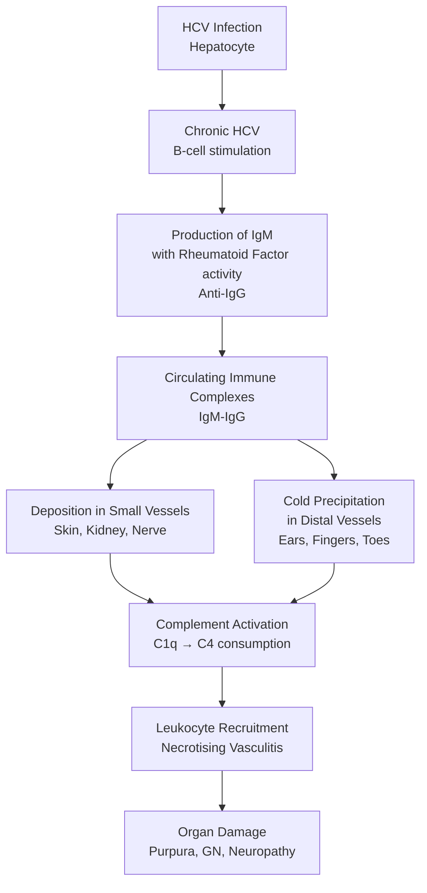
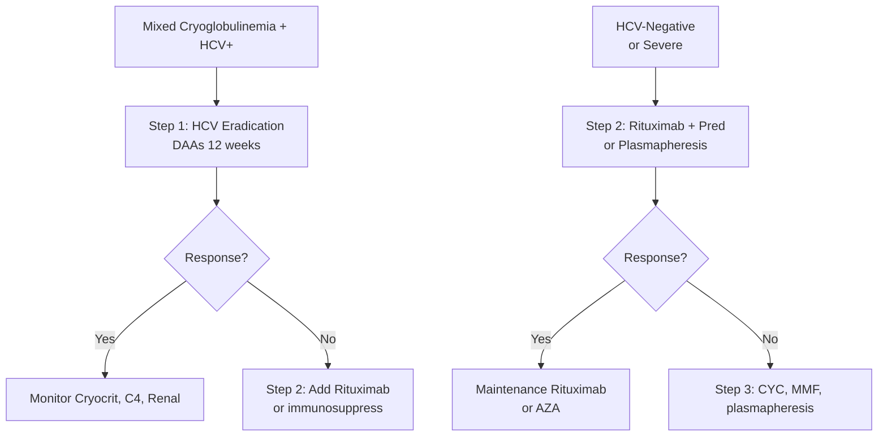
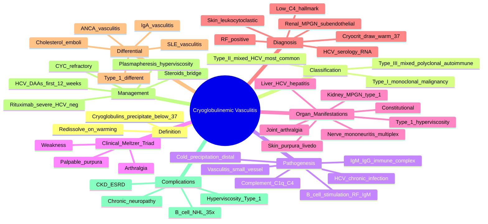

# Cryoglobulinemic Vasculitis (Mixed Cryoglobulinemia)

> [!tip] **FCPS/MRCP Priority: HIGH**
> Cryoglobulinemic vasculitis = **small-to-medium vessel immune complex vasculitis** caused by **cryoglobulins** (immunoglobulins that **precipitate at <37°C** and redissolve on warming). Must know: **Type II mixed cryoglobulinemia + HCV** (most common), the **triad of palpable purpura + arthralgia + weakness** ("**Meltzer's triad**"), **low complement C4**, **HCV treatment as primary therapy**, **rituximab** for severe/HCV-negative cases, and that **cryocrit** is the diagnostic test (drawn warm).

---

## Learning Objectives
By the end of this note you should be able to:
- [ ] Define **cryoglobulins** and classify them into **types I, II, III**
- [ ] Recognise **mixed cryoglobulinemia (Type II) + HCV** as the most common scenario
- [ ] Identify **Meltzer's triad**: palpable purpura, arthralgia, weakness
- [ ] Apply the **HCV → mixed cryoglobulinemia → vasculitis** pathway
- [ ] Investigate with **cryocrit (drawn warm), HCV serology/RNA, low C4, RF, haematology**
- [ ] Treat with **HCV eradication (DAAs)** for HCV-positive; **rituximab + steroids** for severe/HCV-negative
- [ ] Differentiate from **ANCA-vasculitis, SLE, IgA vasculitis**
- [ ] Recognise **type I cryoglobulinemia** (monoclonal, hyperviscosity, no HCV) — different management

---

## 1. Definition & Classification
### Definition
**Cryoglobulins** = immunoglobulins (or immunoglobulin complexes) that **precipitate in vitro at temperatures below 37°C** and **redissolve on warming**. In vivo, they deposit in small/medium vessels, fix complement, and cause **immune-complex vasculitis**.

### Classification (Brouet, 1974)
| Type | Composition | Mechanism | Associations |
|------|-------------|-----------|--------------|
| **Type I** (monoclonal) | **Single monoclonal Ig** (IgM, IgG, or IgA) | **Hyperviscosity, thrombosis, no complement consumption** | **Haematological malignancy**: Waldenström's macroglobulinaemia, MGUS, MM, CLL |
| **Type II** (mixed, monoclonal) | **Monoclonal IgM (with RF activity) + polyclonal IgG** | **Immune complex** (IgM-IgG), **complement consumption, vasculitis** | **HCV (most common)**, HBV, HIV, **Sjögren's syndrome**, lymphoma |
| **Type III** (mixed, polyclonal) | **Polyclonal IgM + polyclonal IgG** | **Immune complex, complement, vasculitis** | **Autoimmune** (SLE, Sjögren's, RA), **chronic infections** (HCV less common than II) |

> [!important] **Type II Mixed Cryoglobulinemia + HCV = Most Common**
> In the HCV era, **80-90% of mixed cryoglobulinemia is HCV-associated**. Eradication of HCV (with direct-acting antivirals) is now the cornerstone of treatment.

---

## 2. Epidemiology
| Feature | Mixed Cryoglobulinemia (Type II/III) | Type I |
|---------|--------------------------------------|--------|
| **Incidence** | 1-5/100,000 | Rare |
| **Age** | 40-60y | Older (with haematological disease) |
| **Sex** | F > M (Sjögren's); M > F (HCV) | Variable |
| **Geography** | **Southern Europe, Japan** (HCV endemic) | Worldwide |
| **HCV prevalence** | 80-90% (Type II) | <5% |

---

## 3. Pathophysiology — HCV-Driven Model

### Mechanism Summary
1. **HCV chronic infection** → B-cell clonal expansion (often RF+)
2. **IgM RF + IgG** → immune complexes
3. **Cold precipitation** → deposits in **distal small vessels** (skin of legs, kidneys, nerves)
4. **Complement activation** (classical pathway, C1q → C4) → **low C4** (hallmark lab finding)
5. **Vasculitis** → tissue damage

### Why Distal Vessels?
- Cryoglobulins precipitate at <37°C
- **Distal, cooler** parts of body (legs, fingers, ears) most affected
- **Raynaud's** and **acrocyanosis** common

---

## 4. Clinical Features
### Meltzer's Triad (Classic)
| Feature | Frequency |
|---------|-----------|
| **Palpable purpura** (lower legs, ankles) | **80-90%** (most common) |
| **Arthralgia** (small joints) | 50-70% |
| **Weakness** (fatigue, neuropathy) | 50-70% |

### Organ-Specific Manifestations
| System | Features |
|--------|----------|
| **Skin** | **Palpable purpura** (legs, ankles), livedo, **Raynaud's, acrocyanosis**, cold-induced urticaria, ulceration, necrosis (late) |
| **Renal** | **Membranoproliferative GN (MPGN) type I** — **50%**; proteinuria, haematuria, **nephrotic range**; slowly progressive to CKD |
| **Peripheral nerve** | **Mononeuritis multiplex** (most common), **distal symmetrical polyneuropathy**; **sensory > motor**; painful paraesthesia |
| **Joint** | **Arthralgia** (non-erosive), morning stiffness |
| **Constitutional** | Fatigue, fever, weight loss |
| **Liver** | **Chronic hepatitis C** (often mild, asymptomatic); elevated ALT |
| **GI** | Abdominal pain, melaena (mesenteric vasculitis — rare) |
| **Lung** | Pulmonary haemorrhage, infiltrates (rare) |
| **Salivary/lacrimal** | Sicca (Sjögren's overlap) |
| **Hyperviscosity (Type I)** | Visual disturbance, neurological symptoms, mucosal bleeding (Type I only — rare in mixed) |

### Severity Spectrum
| Severity | Features |
|----------|----------|
| **Mild** | Purpura, arthralgia, mild sensory neuropathy |
| **Moderate** | Renal involvement (proteinuria, ↓GFR), motor neuropathy, ulcers |
| **Severe** | Rapidly progressive GN, glomerular crescents, **alveolar haemorrhage**, GI/CNS vasculitis, **ulceration/gangrene** |

---

## 5. Diagnosis — Investigations
### Diagnostic Test — **Cryocrit**
| Detail | Description |
|--------|-------------|
| **What** | **Cryoglobulins** precipitate when serum cooled to 4°C for 7 days |
| **How to draw** | **Warm to 37°C**; do NOT refrigerate before separation; keep at 37°C until serum separated; transport in warm container |
| **Type** | IgM, IgG, IgA composition by **immunofixation** |
| **Cryocrit** | % of precipitated cryoglobulins (usually <1% in mild; 5-10% in severe) |
| **False negatives** | If sample cooled/refrigerated — cryoglobulins may have already precipitated and been removed |

> [!warning] **Sample Handling is Critical**
> Blood must be drawn into a **pre-warmed (37°C) tube**, kept at body temperature during transport, and serum separated at 37°C. **Refrigerated samples give false-negative cryocrits**. Lab must be informed.

### Immunology
| Test | Typical Finding | Notes |
|------|----------------|-------|
| **C4** | **Markedly low** | Hallmark — classical pathway consumption |
| **C3** | Mildly low or normal | Less affected than C4 |
| **CH50** | Low | Total complement activity |
| **RF** | **Positive** (high) | Anti-IgG autoantibody (IgM type) |
| **ANA** | Often positive (low titre) | Non-specific |
| **Anti-CCP** | Negative | Differentiate from RA |
| **Cryoglobulins** | Type II/III | Diagnostic |

### Haematology / Chemistry
| Test | Use |
|------|-----|
| **FBC** | Anaemia (chronic disease, GI bleed), normal WBC/platelets usually |
| **ESR** | Often elevated |
| **LFT, HCV serology, HCV RNA** | **MUST TEST** — 80-90% Type II are HCV+ |
| **HBsAg, HIV** | Other chronic infections |
| **U&E, urinalysis, 24h urine protein** | Renal involvement (MPGN) |
| **SPEP, UPEP, serum free light chains** | Exclude **monoclonal gammopathy** (Type I) |

### Renal Biopsy (If Renal Involvement)
- **Membranoproliferative GN (MPGN) type I** with **subendothelial deposits**
- **Immunofluorescence**: IgM, IgG, C3 (immune complex pattern)
- **EM**: **Curved/finger-print** tubular inclusions (cryoglobulin aggregates)
- Diffuse proliferative GN (severe)

### Skin Biopsy
- **Leukocytoclastic vasculitis** (small vessel)
- **Immunofluorescence**: IgM, C3 in vessel walls (immune complex)

### Imaging / Other
- **Nerve conduction studies**: axonal neuropathy
- **Chest X-ray**: if pulmonary symptoms
- **Angiography**: rarely, if medium-vessel involvement

---

## 6. Differential Diagnosis
| Condition | Distinguishing |
|-----------|---------------|
| **ANCA-vasculitis (GPA/MPA/EGPA)** | **ANCA +ve, pauci-immune** (no/low Ig on IF); respiratory tract, no HCV |
| **IgA vasculitis (HSP)** | Children, IgA deposits on IF, **normal C4** |
| **SLE vasculitis** | ANA +ve, dsDNA +ve, low C3/C4 (but immune complexes) |
| **Lupus nephritis** | Class III/IV, "full house" IF |
| **Post-infectious GN** | Recent infection, low C3, self-limiting |
| **MPGN (other causes)** | SPEP to exclude monoclonal gammopathy, HCV, autoimmune |
| **Cholesterol embolisation** | Older, post-vascular procedure, blue toe, eosinophilia |
| **Chilblains** | Cold-induced, no immune complex |
| **Type I cryoglobulinemia** | Monoclonal Ig, **no HCV, hyperviscosity**, underlying haematological disease |

---

## 7. Management
### Stepwise Approach

### Step 1 — Treat the Cause (HCV)
| Therapy | Notes |
|---------|-------|
| **Direct-acting antivirals (DAAs)** | **Sofosbuvir/ledipasvir, sofosbuvir/velpatasvir, glecaprevir/pibrentasvir**; 8-12 weeks |
| **Sustained virologic response (SVR)** | >95% cure; **cryoglobulinemia often resolves** within months |
| **Avoid IFN + ribavirin** | Old regimen; DAAs superior and tolerated |
| **Pre-DAAs era** | IFN-α + ribavirin was used; limited efficacy, side effects |

### Step 2 — Immunosuppression (Severe / HCV-Negative / Refractory)
| Regimen | Dose | Notes |
|---------|------|-------|
| **Rituximab** | **375 mg/m² weekly × 4** OR **1g q2 weeks × 2** | **First-line** for severe/HCV-negative; depletes B-cells (IgM source); better than CYC in trials |
| **Prednisolone** | 0.5-1 mg/kg → taper | Bridge therapy, severe vasculitis |
| **Cyclophosphamide** | IV pulses (15 mg/kg q2-3 weeks) | Severe/refractory; **less preferred than RTX** |
| **MMF / AZA** | Maintenance after induction | Less evidence than RTX |
| **Plasmapheresis** | Acute severe (rapidly progressive GN, DAH, hyperviscosity) | **Removes cryoglobulins quickly**; bridge to immunosuppression |

### Step 3 — Refractory / Severe
- **Anti-IL-6 (tocilizumab)** — case reports
- **Belimumab** — case reports
- **Bortezomib** (Type I) — if plasma cell dyscrasia
- **Stem cell transplant** (severe Type I with haematological disease)

### Supportive
- **Cold avoidance** (warm clothing, avoid cold exposure)
- **Plasmapheresis** for severe / hyperviscosity
- **ACE inhibitors / ARBs** for hypertension / proteinuria
- **Dialysis** if ESRD
- **Vaccinations** before immunosuppression (PJP, pneumococcal, influenza)
- **HCV prevention** (screening blood products, harm reduction)

### Type I Cryoglobulinemia — Different Approach
- **No HCV, no complement consumption, hyperviscosity**
- **Treat underlying haematological disease** (WM, MM, CLL)
- **Plasmapheresis** for hyperviscosity
- **Rituximab** for WM
- **Avoid immunosuppression** in MGUS without symptoms

---

## 8. Special Situations
### Pregnancy
- **Mixed cryoglobulinemia** = high-risk pregnancy
- **HCV vertical transmission** ~5-6% (higher if HIV co-infection)
- **Avoid CYC, MMF**; **AZA + pred** safe; **rituximab** in 2nd/3rd trimester (limited)
- **Avoid ribavirin** (teratogenic); **DAAs** in pregnancy emerging (sofosbuvir/ledipasvir)
- Multidisciplinary care (obstetric medicine, hepatology, rheumatology)

### Renal Transplantation
- **SVR from HCV** before transplant ideal
- **HCV+ donor organs** to HCV+ recipients (previously avoided, now accepted with DAAs)
- **Recurrence risk** in graft if cryoglobulinemia not controlled
- **HCV-negative recipients** with HCV+ donor: treat with DAAs peri-transplant

### HIV Co-Infection
- **Mixed cryoglobulinemia** more common
- **Worse prognosis** if untreated
- **HAART + DAAs** for both viruses

---

## 9. Prognosis
| Factor | Impact |
|--------|--------|
| **SVR with DAAs** | **Excellent** — most resolve; cryoglobulinemia often disappears within 6-12 months |
| **Renal involvement** | MPGN → 10-30% progress to CKD/ESRD over 5-10y |
| **Neuropathy** | Often chronic, partial recovery |
| **Mortality** | **5y survival 90%** (DAAs era); was 50% pre-treatment |
| **Lymphoma risk** | **B-cell NHL** 35× higher (chronic B-cell stimulation) |
| **Relapse** | Common in HCV-eradicated patients who never achieve SVR |

---

## 10. FCPS/MRCP High-Yield Summary
| Topic | Key Points |
|-------|------------|
| **Cryoglobulins** | Immunoglobulins that **precipitate at <37°C** and redissolve on warming |
| **Type I** | Monoclonal Ig; **no HCV, no complement**; hyperviscosity; haematological disease (WM, MM) |
| **Type II** | **Mixed, monoclonal IgM (RF) + polyclonal IgG**; **HCV (80-90%)**; immune complex |
| **Type III** | Mixed, polyclonal; autoimmune (SLE, Sjögren's) or chronic infection |
| **Meltzer's triad** | **Purpura + arthralgia + weakness** (mixed cryoglobulinemia) |
| **HCV → mixed cryoglobulinemia → vasculitis** | Most common pathway |
| **Lab hallmark** | **Low C4** (classical complement consumption); **positive RF**; **low C3 mild** |
| **Cryocrit** | **Draw blood warm (37°C)**; do not refrigerate; transport warm |
| **Renal** | **MPGN type I** (50%); proteinuria, slowly progressive; subendothelial deposits, IgM/IgG/C3 |
| **Skin** | **Leukocytoclastic vasculitis** (palpable purpura, lower legs) |
| **Nerve** | **Mononeuritis multiplex** (most common), sensory polyneuropathy |
| **Treatment (HCV+)** | **DAAs (sofosbuvir-based, 12 weeks) = first-line**; >95% SVR |
| **Treatment (HCV− / severe)** | **Rituximab + steroids** (first-line); CYC, plasmapheresis (severe) |
| **Type I treatment** | **Treat underlying haematological disease** (WM, MM); plasmapheresis for hyperviscosity |
| **Prognosis** | **5y survival 90%** (DAAs era); lymphoma risk ↑35× |

---

## 11. Viva Questions (MRCP PACES / FCPS)
| Question | Expected Answer |
|----------|-----------------|
| "Meltzer's triad?" | **Palpable purpura + arthralgia + weakness** — classic for mixed cryoglobulinemia. |
| "How do you draw a cryoglobulin sample?" | **Warm to 37°C** — pre-warmed tube, kept warm in transit, serum separated at 37°C. **Refrigerated samples give false-negative cryocrits**. |
| "Type I vs Type II cryoglobulinemia — key differences?" | **Type I**: monoclonal Ig, **no HCV**, **no complement consumption**, hyperviscosity, haematological malignancy (WM, MM). **Type II**: mixed monoclonal IgM (RF) + polyclonal IgG, **HCV+ (80-90%)**, complement consumption, vasculitis. |
| "A 55yo Italian man with HCV, palpable purpura, arthralgia, low C4, high RF, proteinuria. Diagnosis?" | **Mixed cryoglobulinemia (Type II) + HCV** → **MPGN**. Apply: HCV chronic infection → B-cell RF+ → immune complex → vasculitis. |
| "First-line treatment for HCV-associated mixed cryoglobulinemia?" | **Direct-acting antivirals (DAAs)** for HCV (sofosbuvir-based, 12 weeks, >95% SVR). Cryoglobulinemia usually resolves within 6-12 months. |
| "Best immunosuppression for severe HCV-negative cryoglobulinemia?" | **Rituximab** (375 mg/m² ×4 weekly) + steroids. **Better than cyclophosphamide** in trials (less toxicity, more durable). |
| "Why is C4 low but C3 normal?" | **Classical complement pathway** activated by immune complex (IgM RF + IgG) — **C1q → C4 → C2** consumed early; C3 (alternative/terminal) less affected initially. |
| "Membranoproliferative GN pattern on biopsy — what to look for?" | **MPGN type I** with **subendothelial deposits**, "tram-track" capillary walls, IF: **IgM, IgG, C3** (immune complex). EM: **curved/finger-print tubular inclusions** of cryoglobulins. |

---

## 12. Confusions & Mnemonics
| Confusion | Clarification |
|-----------|---------------|
| **Sample handling** | **Warm** (37°C) for cryoglobulins; **NOT** for cryofibrinogen (different test) |
| **C4 low, C3 normal** | Classical pathway consumption (immune complex); NOT alternative (which is C3) |
| **Type I vs II — management differs** | **Type I**: haematology, plasmapheresis (no HCV, no vasculitis). **Type II**: HCV DAAs ± rituximab |
| **DAAs first, immunosuppression later?** | For HCV+: **DAAs first** (cure HCV, vasculitis resolves). Add immunosuppression only for severe/refractory |
| **HCV eradication → cure?** | ~95% SVR with DAAs; cryoglobulins may take 6-12 months to disappear; some require rituximab |
| **Meltzer's triad is 3, but more organs can be involved** | Triad = classic; also renal, nerve, GI, lung, liver |
| **Lymphoma risk** | B-cell NHL 35× higher — chronic B-cell stimulation by HCV |

**Mnemonic: Cryoglobulinemia = "COLD"**
- **C**ryoglobulins
- **O**rganism (HCV) — Type II
- **L**ow C4 (hallmark)
- **D**raw warm

**Mnemonic: Type I "Monoclonal = Malignancy"**
- **M**onoclonal Ig
- **M**acroglobulinaemia (WM)
- **M**alignancy (MM, CLL)
- **N**o HCV, **N**o complement
- **H**yperviscosity

**Mnemonic: Type II "Mixed-M = HCV-Mediated"**
- **M**ixed (mono IgM + poly IgG)
- **M**edium: HCV
- **M**eltzer's triad
- **M**embranoproliferative GN
- **M**ononeuritis multiplex
- **M**arkedly low C4

**Mnemonic: Type III "Pure Polyclonal"**
- **P**olyclonal
- **P**rimary autoimmune (Sjögren's, SLE)
- **P**eripheral, less HCV

**Mnemonic: DAA regimens "SOF/VEL/GLP"**
- **S**ofosbuvir (NS5B inhibitor)
- **V**elpatasvir (NS5A inhibitor)
- **G**lecaprevir (NS3/4A)
- **P**ibrentasvir (NS5A)

**Mnemonic: Treatment hierarchy "DAAs → Rituximab → CYC → Plasma"**
- **DAA**s (HCV+)
- **R**ituximab (HCV−, severe)
- **C**YC (refractory)
- **P**lasmapheresis (hyperviscosity, severe)

---

## 13. Mind Map

---

## 14. One-Page Revision Card
| Domain | Key Points |
|--------|------------|
| **Definition** | Cryoglobulins precipitate at <37°C; immune complex vasculitis |
| **Type I** | **Monoclonal Ig; no HCV, no complement; hyperviscosity**; WM, MM, CLL |
| **Type II** | **Mixed (mono IgM RF + poly IgG); HCV 80-90%**; immune complex, low C4 |
| **Type III** | Mixed, polyclonal; autoimmune (SLE, Sjögren's) |
| **Meltzer's triad** | Purpura + arthralgia + weakness |
| **HCV pathway** | HCV → B-cell RF+ → IgM-IgG IC → complement C1q/C4 → vasculitis |
| **Lab hallmark** | **Low C4, normal C3, RF+, cryoglobulins** |
| **Cryocrit** | **Draw warm (37°C)**, transport warm, separate warm |
| **Renal** | **MPGN type I** (50%); subendothelial, IF IgM/IgG/C3, EM finger-print |
| **Skin** | **Leukocytoclastic vasculitis** (palpable purpura, lower legs) |
| **Nerve** | **Mononeuritis multiplex**, sensory polyneuropathy |
| **Treatment (HCV+)** | **DAAs first** (sofosbuvir-based 12w, >95% SVR) |
| **Treatment (HCV−)** | **Rituximab + steroids**; CYC if refractory |
| **Plasmapheresis** | Severe (hyperviscosity, DAH, rapidly progressive GN) |
| **Lymphoma risk** | B-cell NHL **35×** higher (chronic B-cell stimulation) |

---

## 15. Spaced Repetition Trackers
| Review Interval | Date Completed | Confidence (1-5) | Notes |
|-----------------|----------------|------------------|-------|
| 24 hours | | | |
| 7 days | | | |
| 15 days | | | |
| 30 days | | | |
| 90 days | | | |

---

## 16. Self-Test Scorecard
| Section | Score /5 | Last Attempt |
|---------|----------|--------------|
| Cryoglobulin classification | | |
| HCV → mixed cryoglobulinemia pathway | | |
| Meltzer's triad | | |
| Cryocrit sample handling | | |
| Low C4 mechanism | | |
| MPGN type I biopsy | | |
| DAAs as first-line for HCV+ | | |
| Rituximab for HCV-negative | | |
| Type I vs II management | | |
| Lymphoma risk | | |
| Viva Questions | | |

---

## Local Navigation
- **Parent Heading**: [[../Vasculitis|Vasculitis]]
- **Parent Topic Group**: [[Secondary vasculitides]]
- **Sibling Topics**: [[Secondary vasculitides]] · [[ANCA-associated vasculitis overview]] · [[Behçet's disease]] · [[Primary systemic vasculitides overview]] · [[Sjogren's syndrome]]
- **Chapter Map**: [[../Davidson Chapter 26 - Rheumatology Hierarchy|Rheumatology Hierarchy]]
- **Chapter MOC**: [[../Rheumatology MOC|Rheumatology MOC]]
- **Related**: [[Drugs in rheumatology]] · [[Investigations in rheumatology]]
---

> Auto-generated study sections for "Vasculitis" — Ch 25: Rheumatology & Bone Disease.

## Flashcards (12 generated)

- Q: What is the definition of Vasculitis?
  A: Cryoglobulinemic vasculitis = small-to-medium vessel immune complex vasculitis caused by cryoglobulins (immunoglobulins that precipitate at <37°C and redissolve on warming).
- Q: What is Cryoglobulins of Vasculitis?
  A: Immunoglobulins that precipitate at <37°C and redissolve on warming
- Q: How is Vasculitis classified?
  A: Monoclonal Ig; no HCV, no complement; hyperviscosity; haematological disease (WM, MM)
- Q: What is Meltzer's triad of Vasculitis?
  A: Purpura + arthralgia + weakness (mixed cryoglobulinemia)
- Q: What is HCV → mixed cryoglobulinemia → vasculitis of Vasculitis?
  A: Most common pathway
- Q: What is Lab hallmark of Vasculitis?
  A: Low C4 (classical complement consumption); positive RF; low C3 mild
- Q: What is Cryocrit of Vasculitis?
  A: Draw blood warm (37°C); do not refrigerate; transport warm
- Q: What is Renal of Vasculitis?
  A: MPGN type I (50%); proteinuria, slowly progressive; subendothelial deposits, IgM/IgG/C3
- Q: What is Skin of Vasculitis?
  A: Leukocytoclastic vasculitis (palpable purpura, lower legs)
- Q: What is Nerve of Vasculitis?
  A: Mononeuritis multiplex (most common), sensory polyneuropathy
- Q: How is Vasculitis managed?
  A: DAAs (sofosbuvir-based, 12 weeks) = first-line; >95% SVR
- Q: What is the prognosis of Vasculitis?
  A: 5y survival 90% (DAAs era); lymphoma risk ↑35×

## MCQs (1 generated)

1. **Which of the following best describes Vasculitis?**
   A. **Cryoglobulinemic vasculitis = small-to-medium vessel immune complex vasculitis caused by cryoglobulins (immunoglobulins that precipitate at <37°C and redissolve on warming).**
   B. An unrelated condition not matching the clinical picture of Vasculitis
   C. A complication seen late in the disease course of Vasculitis
   D. A condition that mimics Vasculitis but has a different underlying cause

## SBA Questions (1 generated)

1. A patient with suspected Vasculitis presents with: Cryoglobulins = immunoglobulins (or immunoglobulin complexes) that precipitate in vitro at temperatures below 37°C and redissolve on warming. In vivo, they deposit in small/medium vessels, fix complement, and cause immune-complex vasculitis.; Type I (monoclonal) — Single monoclonal Ig (IgM, IgG, or IgA); Type II (mixed, monoclonal) — Monoclonal IgM (with RF activity) + polyclonal IgG. What is the most likely diagnosis?
   A. **Vasculitis**
   B. A condition that mimics Vasculitis but is not the same entity
   C. A complication of Vasculitis rather than the primary diagnosis
   D. An unrelated condition in the same clinical category as Vasculitis

