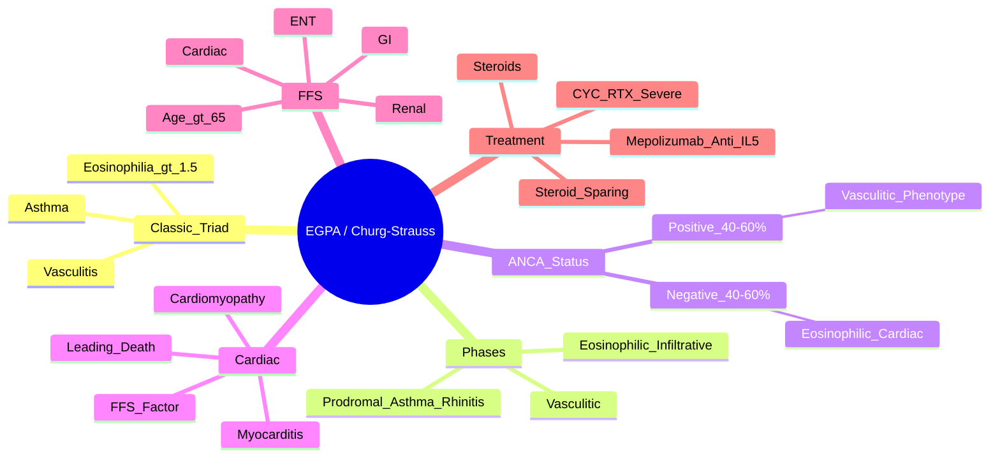

# Eosinophilic Granulomatosis with Polyangiitis (EGPA / Churg-Strauss)

> [!tip] **FCPS/MRCP Priority: HIGH**
> EGPA = **AsTHMA + EOSinophilia + VASCulitis** (Churg-Strauss). **p-ANCA/MPO only 40-60%** (ANCA-negative = more eosinophilic, less vasculitic). **Cardiac involvement = leading cause of death**. **Mepolizumab (anti-IL-5) FDA approved** for steroid-sparing.

---

## Learning Objectives
By the end of this note you should be able to:
- [ ] Apply the classic triad (asthma + eosinophilia + vasculitis) and ICBD/ACR criteria
- [ ] Distinguish ANCA-positive (vasculitic) from ANCA-negative (eosinophilic) phenotypes
- [ ] Recognise cardiac involvement (myocarditis, cardiomyopathy) as the major mortality driver
- [ ] Apply Five-Factor Score (FFS) for prognosis
- [ ] Select treatment: steroids → steroid-sparing (AZA/MMF/MTX) → **mepolizumab (anti-IL-5)** → CYC/RTX for severe
- [ ] Monitor for relapse and eosinophilia recrudescence

---

## 1. Definition & Epidemiology

| Feature | Detail |
|---------|--------|
| **Definition** | **Necrotising vasculitis** of small/medium vessels with **eosinophilic tissue infiltration**, **asthma**, and **peripheral eosinophilia** — associated with **p-ANCA/MPO** in 40-60% |
| **Previous Name** | Churg-Strauss Syndrome |
| **Incidence** | 1-3/1,000,000/year |
| **Peak Onset** | **30-50 years** |
| **Sex Ratio** | **M = F** |
| **Genetics** | HLA-DRB4, IL-10, TSLP |

---

## 2. Aetiology & Pathophysiology

```mermaid
flowchart LR
    A[Genetic Susceptibility\nHLA-DRB4, IL-10, TSLP] --> B[Environmental Trigger\nAllergens, Infection, Drugs]
    B --> C[TH2 Polarisation\nIL-4, IL-5, IL-13]
    C --> D[Eosinophil Activation &\nRecruitment (IL-5 Key)]
    D --> E[Eosinophilic Tissue Infiltration\nLung, GI, Heart, Skin, Nerve]
    E --> F[Vasculitic Phase\nNecrotising Vasculitis\n(ANCA+ subset)]
    F --> G[Clinical EGPA\n3 Phases]
```

### The Three Phases (Not Always Sequential)

| Phase | Features | Duration |
|-------|----------|----------|
| **1. Prodromal (Allergic)** | **Adult-onset asthma** (severe, steroid-dependent), **allergic rhinitis**, **nasal polyps**, eosinophilia | Years |
| **2. Eosinophilic (Infiltrative)** | **Pulmonary infiltrates** (fleeting), **eosinophilic gastroenteritis** (abdominal pain, diarrhoea), **myocarditis**, eosinophilia >1.5×10⁹/L | Months-years |
| **3. Vasculitic** | **Necrotising vasculitis**: mononeuritis multiplex, palpable purpura, renal, GI ischaemia, neuropathy | Variable |

> [!warning] **Phases Overlap**
> - Patients may have features of multiple phases simultaneously
> - **Asthma often precedes vasculitis by years**
> - **Eosinophilia may be absent on steroids**

---

## 3. Clinical Features

### Classic Triad
| Component | Detail |
|-----------|--------|
| **Asthma** | **Adult-onset**, severe, **steroid-dependent**, often precedes vasculitis by 5-10 years |
| **Eosinophilia** | **>1.5×10⁹/L or >10%** of WBC (may be suppressed by steroids) |
| **Vasculitis** | Necrotising vasculitis of small/medium vessels (nerves, skin, GI, kidney) |

### Organ Involvement

| System | Manifestation | FCPS/MRCP Pearl |
|--------|---------------|-----------------|
| **Cardiac** | **Myocarditis, pericarditis, cardiomyopathy, heart failure** — **LEADING CAUSE OF DEATH** | **FFS includes cardiac**; Cardiac MRI: late gadolinium enhancement |
| **Neurological** | **Mononeuritis multiplex** (wrist/foot drop), peripheral neuropathy | Common in vasculitic phase |
| **Cutaneous** | Palpable purpura, nodules, urticaria, livedo reticularis | |
| **GI** | Eosinophilic gastroenteritis (abdominal pain, diarrhoea), ischaemia, perforation | |
| **Renal** | **Less common/severe** than GPA/MPA; pauci-immune GN if ANCA+ | ANCA-negative EGPA rarely has renal disease |
| **Pulmonary** | **Fleeting pulmonary infiltrates** (asthma + eosinophilia), pleural effusion | |
| **ENT** | Chronic sinusitis, nasal polyps (prodromal phase) | |

> [!critical] **Cardiac Involvement = Leading Cause of Death**
> - **Myocarditis → fibrosis → restrictive cardiomyopathy**
> - **FFS includes cardiac insufficiency**
> - **Cardiac MRI (late gadolinium enhancement)** for diagnosis
> - **Echocardiography** for systolic function, wall motion

---

## 4. Classification & ANCA Status

### ANCA-Positive EGPA (40-60%)
| Feature | Detail |
|---------|--------|
| **ANCA** | **p-ANCA/MPO** positive |
| **Phenotype** | **More vasculitic**: mononeuritis multiplex, palpable purpura, renal involvement, alveolar haemorrhage |
| **Prognosis** | More vasculitic complications |

### ANCA-Negative EGPA (40-60%)
| Feature | Detail |
|---------|--------|
| **ANCA** | Negative |
| **Phenotype** | **More eosinophilic**: cardiac, lung infiltrates, eosinophilic gastroenteritis, cardiomyopathy |
| **Prognosis** | More cardiac complications; **less renal/vasculitic**; better renal survival |

> [!important] **ANCA Status Guides Phenotype, Not Diagnosis**
> - **Diagnosis = Clinical triad + eosinophilia + exclusion**
> - **ANCA status = predicts organ involvement pattern**

---

## 5. Investigations

| Test | Typical Finding |
|------|-----------------|
| **Eosinophil Count** | **>1.5×10⁹/L or >10%** (key diagnostic criterion) |
| **p-ANCA / MPO** | **Positive 40-60%** (if +ve, more vasculitic) |
| **IgE** | **Markedly elevated** |
| **Troponin / BNP** | Elevated if cardiac involvement |
| **Cardiac MRI** | **Late gadolinium enhancement** (myocarditis/fibrosis) — gold standard for cardiac involvement |
| **Echocardiography** | Reduced EF, wall motion abnormalities, pericardial effusion |
| **Nerve Conduction** | Axonal neuropathy (mononeuritis multiplex) |
| **Lung Biopsy** | Eosinophilic infiltration, granulomas (if done) |
| **Renal Biopsy** | Eosinophilic interstitial nephritis (rare), pauci-immune GN (if ANCA+) |
| **Bronchoalveolar Lavage** | Eosinophilia >25% |

---

## 6. Five-Factor Score (FFS) — **Prognostic Tool**

| Factor (1 point each) | Score 0 | Score 1 | Score ≥2 |
|------------------------|---------|---------|----------|
| **Age >65 years** | 5-yr survival 98% | 5-yr survival 90% | 5-yr survival 66% |
| **Cardiac insufficiency** | | | |
| **GI involvement** | | | |
| **Renal insufficiency** (Cr >1.58 mg/dL) | | | |
| **ENT involvement** | | | |

**FFS 0 = Good prognosis; FFS ≥2 = Poor prognosis → needs aggressive induction (CYC)**

---

## 7. Management

```mermaid
flowchart TD
    A[EGPA Diagnosis] --> B{Severity / FFS}
    B -->|FFS 0 (Mild)\nNo organ-threatening| C[Steroids: Pred 0.5-1mg/kg\nTaper to lowest effective dose]
    B -->|FFS ≥1 / Organ-Threatening\n(Cardiac, CNS, Renal, Severe GI)| D[Steroids: Pulse MP 500-1000mg ×3\n→ Pred 1mg/kg + CYC IV\nOR RTX if ANCA+]
    C --> E[Steroid-Sparing Start Early\nAZA 2mg/kg / MMF 2-3g/day / MTX 15-25mg/wk]
    D --> E
    E --> F{Refractory / Relapse / Steroid-Dependent}
    F -->|Yes| G[**Mepolizumab 300mg SC q4wk**\n(Anti-IL-5, FDA approved for EGPA)\nSTEROID-SPARING, reduces relapse]
    F -->|No| H[Taper Steroids Slowly\nContinue Steroid-Sparing 1-2yr]
    G --> H
```

### Treatment by Severity

| Severity | Induction | Maintenance |
|----------|-----------|-------------|
| **Mild (FFS 0)** | Pred 0.5-1mg/kg → taper | **Steroid-sparing**: AZA 2mg/kg, MMF 2-3g/day, MTX 15-25mg/wk |
| **Severe (FFS ≥1)** | **Pulse MP 500-1000mg ×3** + **CYC IV** (or **RTX if ANCA+**) | Steroid-sparing + **Mepolizumab** if refractory |
| **Cardiac/Neuro/GI Severe** | Pulse MP + CYC/RTX | Mepolizumab + steroid-sparing |

### Mepolizumab (Anti-IL-5) — **FDA Approved for EGPA**
| Detail | Info |
|--------|------|
| **Dose** | 300mg SC every 4 weeks |
| **Indication** | Refractory/relapsing EGPA, steroid-sparing |
| **Evidence** | MIRRA trial: higher remission, lower steroid dose, fewer relapses |
| **Monitoring** | Eosinophil count (may drop to zero), parasitic infections (pre-screen) |

---

## 8. FCPS/MRCP High-Yield Summary

| Topic | Key Points |
|-------|------------|
| **Classic Triad** | **Asthma + Eosinophilia (>1.5×10⁹/L or >10%) + Vasculitis** |
| **ANCA** | **p-ANCA/MPO 40-60% only** — **ANCA-negative = more eosinophilic/cardiac, less vasculitic/renal** |
| **Cardiac** | **Myocarditis, cardiomyopathy, HF = LEADING CAUSE OF DEATH** — FFS includes cardiac |
| **Phases** | Prodromal (asthma/rhinitis) → Eosinophilic (infiltrates, GI, myocarditis) → Vasculitic (nerves, skin, kidney) |
| **Five-Factor Score (FFS)** | Age >65, cardiac, GI, renal, ENT → 0=good, ≥2=poor (needs CYC) |
| **Mepolizumab** | **Anti-IL-5, 300mg SC q4wk** — FDA approved, steroid-sparing, reduces relapse |
| **Treatment** | Steroids → steroid-sparing (AZA/MMF/MTX) → **mepolizumab** for refractory → CYC/RTX for severe |
| **ANCA+ vs ANCA-** | ANCA+ = more vasculitic (nerves, kidney, purpura); ANCA- = more eosinophilic (heart, lung, GI) |

---

## 9. Viva Questions (MRCP PACES / FCPS)

| Question | Expected Answer |
|----------|----------------|
| "What is the classic triad of EGPA (Churg-Strauss)?" | **Asthma + Eosinophilia (>1.5×10⁹/L or >10%) + Vasculitis** |
| "What percentage of EGPA patients are ANCA-positive, and how does it change the phenotype?" | **40-60% p-ANCA/MPO positive**. ANCA+ = more vasculitic (mononeuritis multiplex, renal, purpura). ANCA- = more eosinophilic (cardiac, lung infiltrates, GI). |
| "What is the leading cause of death in EGPA?" | **Cardiac involvement** (myocarditis → cardiomyopathy → heart failure). |
| "What is the Five-Factor Score (FFS) in EGPA, and how does it guide treatment?" | 5 factors: age >65, cardiac insufficiency, GI involvement, renal insufficiency, ENT involvement. **FFS 0 = steroids alone; FFS ≥1 = add CYC/RTX**. |
| "What is the role of mepolizumab in EGPA?" | **Anti-IL-5, 300mg SC q4wk**. FDA approved for EGPA. Steroid-sparing, reduces relapse, higher remission (MIRRA trial). Give for steroid-dependent/refractory disease. |
| "How do you differentiate EGPA from GPA and MPA?" | **EGPA = Asthma + Eosinophilia + Vasculitis**. GPA = ENT/granulomas/c-ANCA. MPA = no asthma/no eosinophilia/p-ANCA. |
| "A patient with EGPA has cardiomyopathy. What is the prognostic significance?" | **Cardiac insufficiency = FFS factor** → worse prognosis (FFS ≥1) → needs **aggressive induction (Pulse MP + CYC)**. |
| "Is rituximab used in EGPA?" | **Only if ANCA-positive** (vasculitic subset). ANCA-negative EGPA: eosinophilic driven, RTX less effective. Use mepolizumab. |

---

## 10. Confusions & Mnemonics

| Confusion | Clarification |
|-----------|---------------|
| **EGPA vs GPA vs MPA** | **EGPA = Asthma + Eosinophilia + Vasculitis**. GPA = ENT/granulomas/c-ANCA. MPA = no asthma/no eosinophilia/p-ANCA. |
| **ANCA in EGPA** | **Only 40-60% positive** (p-ANCA/MPO). **Negative ANCA ≠ exclude EGPA** — more eosinophilic phenotype. |
| **Mepolizumab vs RTX** | **Mepolizumab (anti-IL-5) = for eosinophilic disease (ANCA- too). RTX = for ANCA+ vasculitic subset.** |
| **FFS 0 vs FFS ≥1** | FFS 0 = steroids alone. FFS ≥1 = add CYC/RTX. |
| **Cardiac EGPA** | **Leading cause of death**. Screen with troponin, BNP, echo, cardiac MRI. |

**Mnemonic: EGPA = "A-E-V"**
- **A**sthma (adult-onset, steroid-dependent)
- **E**osinophilia (>1.5×10⁹/L or >10%)
- **V**asculitis (necrotising, small/medium vessels)

**Mnemonic: Three Phases = "A-E-V"**
- **A**llergic/Prodromal (asthma, rhinitis, polyps)
- **E**osinophilic/Infiltrative (lung, GI, heart)
- **V**asculitic (nerves, skin, kidney)

**Mnemonic: FFS = "C-A-G-R-E"**
- **C**ardiac insufficiency
- **A**ge >65
- **G**I involvement
- **R**enal insufficiency
- **E**NT involvement

**Mnemonic: ANCA+ vs ANCA- EGPA = "VAS vs EOS"**
- **ANCA+** = **VAS**culitic (nerves, kidney, purpura)
- **ANCA-** = **EOS**inophilic (heart, lung, GI)

---

## 11. Mind Map



---

## 12. One-Page Revision Card

| Domain | Key Points |
|--------|------------|
| **Triad** | **Asthma + Eosinophilia (>1.5×10⁹/L) + Vasculitis** |
| **ANCA** | **p-ANCA/MPO 40-60%** — ANCA-negative = more eosinophilic/cardiac |
| **Phases** | Prodromal (asthma) → Eosinophilic (lung/GI/heart) → Vasculitic (nerves/skin/kidney) |
| **Cardiac** | **Myocarditis/cardiomyopathy = leading cause of death** |
| **FFS** | Age >65, cardiac, GI, renal, ENT → 0=steroids, ≥1=add CYC |
| **Mepolizumab** | **Anti-IL-5, 300mg SC q4wk** — FDA approved, steroid-sparing |
| **Treatment** | Steroids → AZA/MMF/MTX → mepolizumab (refractory) → CYC/RTX (severe) |
| **ANCA+ vs -** | ANCA+ = vasculitic; ANCA- = eosinophilic |

---

## 13. Spaced Repetition Trackers

| Review Interval | Date Completed | Confidence (1-5) | Notes |
|-----------------|----------------|------------------|-------|
| 24 hours | | | |
| 7 days | | | |
| 15 days | | | |
| 30 days | | | |
| 90 days | | | |

---

## 14. Self-Test Scorecard

| Section | Score /5 | Last Attempt |
|---------|----------|--------------|
| Triad & Phases | | |
| ANCA Status & Phenotypes | | |
| Cardiac Involvement & FFS | | |
| Mepolizumab Indication | | |
| Treatment Algorithm | | |
| EGPA vs GPA vs MPA | | |
| Viva Questions | | |

---

## Local Navigation
- **Parent Heading**: [[../Vasculitis|Vasculitis]]
- **Parent Topic Group**: [[ANCA-associated vasculitis overview]]
- **Chapter Map**: [[../Davidson Chapter 26 - Rheumatology Hierarchy|Rheumatology Hierarchy]]
- **Chapter MOC**: [[../Rheumatology MOC|Rheumatology MOC]]
- **Drug Reference**: [[../../Clinical Approach to Musculoskeletal Disease/Drugs in rheumatology|Drugs in rheumatology]]
- **Related**: [[Granulomatosis with polyangiitis (GPA)]] · [[Microscopic polyangiitis (MPA)]] · [[ANCA-associated vasculitis overview]]
---

> Auto-generated study sections for "Vasculitis" — Ch 25: Rheumatology & Bone Disease.

## Flashcards (9 generated)

- Q: What is the definition of Vasculitis?
  A: # Eosinophilic Granulomatosis with Polyangiitis (EGPA / Churg-Strauss)
- Q: What is Classic Triad of Vasculitis?
  A: Asthma + Eosinophilia (>1.5×10⁹/L or >10%) + Vasculitis
- Q: What is ANCA of Vasculitis?
  A: p-ANCA/MPO 40-60% only — ANCA-negative = more eosinophilic/cardiac, less vasculitic/renal
- Q: What is Cardiac of Vasculitis?
  A: Myocarditis, cardiomyopathy, HF = LEADING CAUSE OF DEATH — FFS includes cardiac
- Q: What is Phases of Vasculitis?
  A: Prodromal (asthma/rhinitis) → Eosinophilic (infiltrates, GI, myocarditis) → Vasculitic (nerves, skin, kidney)
- Q: What is Five-Factor Score (FFS) of Vasculitis?
  A: Age >65, cardiac, GI, renal, ENT → 0=good, ≥2=poor (needs CYC)
- Q: What is Mepolizumab of Vasculitis?
  A: Anti-IL-5, 300mg SC q4wk — FDA approved, steroid-sparing, reduces relapse
- Q: How is Vasculitis managed?
  A: Steroids → steroid-sparing (AZA/MMF/MTX) → mepolizumab for refractory → CYC/RTX for severe
- Q: What is ANCA+ vs ANCA- of Vasculitis?
  A: ANCA+ = more vasculitic (nerves, kidney, purpura); ANCA- = more eosinophilic (heart, lung, GI)

## MCQs (1 generated)

1. **Which of the following best describes Vasculitis?**
   A. **# Eosinophilic Granulomatosis with Polyangiitis (EGPA / Churg-Strauss)**
   B. An unrelated condition not matching the clinical picture of Vasculitis
   C. A complication seen late in the disease course of Vasculitis
   D. A condition that mimics Vasculitis but has a different underlying cause

## SBA Questions (1 generated)

1. A patient with suspected Vasculitis presents with: Previous Name — Churg-Strauss Syndrome; Peak Onset — 30-50 years; Sex Ratio — M = F. What is the most likely diagnosis?
   A. **Vasculitis**
   B. A condition that mimics Vasculitis but is not the same entity
   C. A complication of Vasculitis rather than the primary diagnosis
   D. An unrelated condition in the same clinical category as Vasculitis

