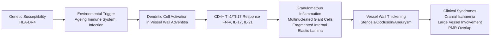
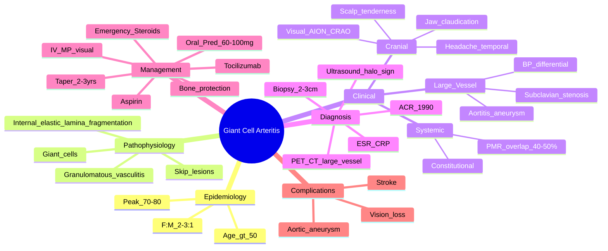

# Giant Cell Arteritis (Temporal Arteritis)

> [!tip] **FCPS/MRCP Priority: CRITICAL**
> GCA = **most common large vessel vasculitis**, **ophthalmic emergency**. **Start high-dose steroids IMMEDIATELY on suspicion — do NOT delay for biopsy**. **Temporal artery biopsy = gold standard** (skip lesions, need 2-3cm). **PMR overlap: 40-50% GCA have PMR, 10-20% PMR develop GCA**.

---

## Learning Objectives
By the end of this note you should be able to:
- [ ] Recognise GCA as a medical emergency requiring immediate steroid treatment
- [ ] Apply ACR 1990 classification criteria and understand temporal artery biopsy limitations
- [ ] Differentiate cranial vs large vessel GCA and manage both
- [ ] Manage GCA-PMR overlap and screen for large vessel involvement
- [ ] Select steroid-sparing agents (tocilizumab) and manage complications

---

## 1. Definition & Epidemiology

| Feature | Detail |
|---------|--------|
| **Definition** | **Granulomatous large vessel vasculitis** primarily affecting **cranial branches of the carotid artery** (especially temporal artery) — **giant cells** on histology |
| **Incidence** | 15-20/100,000/year >50y |
| **Peak Age** | **>50 years** (peak 70-80) — **never <50** |
| **Sex Ratio** | **F:M = 2-3:1** |
| **Ethnicity** | Caucasian > Asian > African |
| **Genetics** | HLA-DR4 (shared with PMR, RA) |

---

## 2. Aetiology & Pathophysiology



### Key Pathogenic Features
| Feature | Detail |
|---------|--------|
| **Granulomatous inflammation** | CD4+ T-cells, macrophages, **multinucleated giant cells** (not always present) |
| **Internal elastic lamina fragmentation** | Histological hallmark |
| **Segmental/skip lesions** | **Biopsy may miss** — need 2-3cm length |
| **Cranial vs large vessel** | Cranial (temporal, ophthalmic) vs large vessel (aortic arch branches) |

---

## 3. Clinical Features

### Cranial Features — **High-Yield**
| Symptom | Frequency | FCPS/MRCP Pearl |
|---------|-----------|-----------------|
| **New headache** | 70-90% | **Temporal**, throbbing, severe; may be occipital/frontal |
| **Jaw claudication** | 40-50% | **Pain on chewing** — masseter ischaemia; **high specificity for GCA** |
| **Scalp tenderness** | 30-50% | Combining hair, laying on pillow |
| **Visual symptoms** | 20-50% | **Amaurosis fugax** (transient), **diplopia**, **permanent vision loss** (AION, CRAO) |
| **Temporal artery abnormality** | 50-70% | Tender, pulseless, nodular, prominent |

### Systemic Features
| Feature | Frequency |
|---------|-----------|
| Constitutional (fever, weight loss, malaise, anorexia) | 50-60% |
| **PMR symptoms** (girdle pain/stiffness >45min) | **40-50%** of GCA have PMR |

### Large Vessel Involvement (10-20%)
| Vessel | Manifestation |
|--------|---------------|
| **Aorta** | Aortitis → **aortic aneurysm/dissection** (late), aortic regurgitation |
| **Subclavian/axillary** | **Stenosis/occlusion** → diminished/absent pulses, BP differential (>10mmHg), arm claudication |
| **Carotid** | Stroke, TIA |
| **Coronary** | Angina, MI (rare) |

### Ophthalmic Emergency
| Complication | Mechanism | Outcome |
|--------------|-----------|---------|
| **AION** (Anterior Ischaemic Optic Neuropathy) | Posterior ciliary artery occlusion | **Permanent vision loss** (pale swollen disc) |
| **CRAO** (Central Retinal Artery Occlusion) | Ophthalmic artery occlusion | **Permanent vision loss** (cherry red spot) |
| **Posterior Ischaemic Optic Neuropathy** | Uncommon | Vision loss, normal disc acutely |

> [!critical] **Vision Loss = Irreversible**
> - **Start steroids IMMEDIATELY on clinical suspicion** — do not wait for biopsy, imaging, or ophthalmology review
> - **IV methylprednisolone 500-1000mg daily ×3 days** if visual threat/loss
> - Fellow eye at risk in 24-48h without treatment

---

## 4. Classification Criteria — ACR 1990

| Criterion | Detail |
|-----------|--------|
| 1. **Age ≥50 years** at onset | Mandatory |
| 2. **New headache** (localised, temporal) | |
| 3. **Temporal artery abnormality** (tenderness, reduced pulsation) | |
| 4. **ESR ≥50 mm/hr** (Westergren) | |
| 5. **Temporal artery biopsy** showing **granulomatous inflammation** with **multinucleated giant cells** | |

**≥3/5 Criteria = Sensitivity 93%, Specificity 91%**

> [!important] **Biopsy Pearls**
> - **Skip lesions** → need **2-3cm length** (not 1cm)
> - **Bilateral biopsy** increases yield (but unilateral usually sufficient)
> - **Steroids do NOT immediately abolish histology** — biopsy valid up to **2-4 weeks** after starting steroids
> - **Negative biopsy ≠ exclude GCA** if high clinical suspicion

---

## 5. Diagnosis — Investigations

| Test | Role | Typical Finding |
|------|------|-----------------|
| **ESR** | **Primary marker** | **Markedly elevated** (often >80-100 mm/hr) — but **normal in 5-10%** |
| **CRP** | More sensitive than ESR | **Markedly elevated** (often >100 mg/L) |
| **FBC** | Anaemia, thrombocytosis | Normochromic normocytic anaemia, reactive thrombocytosis |
| **LFT** | ALP elevated | Hepatic involvement (rare) |
| **Temporal Artery Biopsy** | **Gold standard** | Granulomatous inflammation, giant cells, internal elastic lamina fragmentation |
| **Ultrasound (Temporal Axillary)** | Non-invasive, operator-dependent | **Halo sign** (hypoechoic vessel wall thickening) — **specific** |
| **PET-CT** | Large vessel involvement | **FDG uptake in aortic arch branches** — assesses extent |
| **MRI Angiography** | Large vessel | Vessel wall thickening, enhancement |

> [!warning] **Normal ESR Does NOT Exclude GCA**
> - 5-10% have normal ESR (especially on steroids, elderly, comorbid)
> - **CRP more sensitive** — if ESR normal but CRP high, still suspect GCA
> - **Clinical picture + CRP + imaging/biopsy = diagnosis**

---

## 6. Management — **Emergency Pathway**

```mermaid
flowchart TD
    A[Suspected GCA] --> B{Visual Symptoms/Loss?}
    B -->|Yes| C[**IV Methylprednisolone\n500-1000mg daily ×3 days**\nTHEN Prednisolone 60-100mg daily]
    B -->|No| D[**Prednisolone 60-100mg daily**\nORT - start IMMEDIATELY]
    C --> E[Urgent Ophthalmology\nTemporal Artery Biopsy\n(Do NOT delay steroids)]
    D --> E
    E --> F[Screen Large Vessel:\nPulses, BP both arms, bruits, PET-CT if indicated]
    F --> G[Add Aspirin 75mg daily\n(may reduce ischaemic events)]
    G --> H[Bone Protection:\nCa/Vit D + Bisphosphonate]
    H --> I[Tocilizumab 162mg SC weekly\n+ steroid taper\n(FDA approved, steroid-sparing)]
    I --> J[Taper: 10mg q4-8wk to 20mg → 2.5mg q4-8wk to 10mg → 1mg/month]
    J --> K[Monitor ESR/CRP + Symptoms q4-8wk\nFlare = increase to previous dose]
```

### Steroid Regimen
| Scenario | Initial Dose | Taper |
|----------|--------------|-------|
| **Visual threat/loss** | **IV MP 500-1000mg ×3 days** → Pred 60-100mg daily | Slower |
| **No visual threat** | **Prednisolone 60-100mg daily** immediately | Standard |

### Taper Schedule (Standard)
| Phase | Dose Reduction | Interval | Monitoring |
|-------|----------------|----------|------------|
| **High dose → 20mg** | ↓ 10mg | Every 4-8 weeks | ESR/CRP, symptoms, GCA screen |
| **20mg → 10mg** | ↓ 2.5mg | Every 4-8 weeks | ESR/CRP, symptoms, GCA screen |
| **<10mg** | ↓ 1mg | Every 4-8 weeks | Slow; flares common |

> [!important] **Average treatment duration: 2-3 years** (longer than PMR)

### Tocilizumab (FDA Approved for GCA)
| Detail | Info |
|--------|------|
| **Dose** | 162mg SC weekly (or 8mg/kg IV monthly) |
| **Role** | **Steroid-sparing** — sustains remission, reduces cumulative steroid dose |
| **Evidence** | GiACTA trial: higher sustained remission at 52 weeks with tocilizumab + 26-week taper vs placebo + 52-week taper |

### Aspirin 75mg Daily
- **Low-dose aspirin** may reduce ischaemic complications (stroke, vision loss) — **BSR recommends consider in all**

### Bone Protection
- **All patients**: Calcium 1g + Vitamin D 800-1000 IU + **Bisphosphonate** (alendronate 70mg weekly)

---

## 7. Large Vessel GCA — Specific Features

| Feature | Detail |
|---------|--------|
| **Presentation** | Arm claudication, diminished pulses, BP differential >10mmHg, aortic regurgitation murmur, back/chest pain (aortitis) |
| **Diagnosis** | **PET-CT** (gold standard for large vessel), MRI angiography, US axillary arteries |
| **Management** | Same steroids + tocilizumab; **surgical intervention** for aortic aneurysm/dissection |
| **Follow-up** | Annual imaging (CT/MRI/PET) for aortic aneurysm surveillance |

---

## 8. Differential Diagnosis

| Mimic | Distinguishing Features |
|-------|------------------------|
| **Non-arteritic AION** | Age 50-70, vascular risk factors (HTN, DM), **no headache/jaw claudication**, normal ESR/CRP |
| **Migraine/Cluster Headache** | Younger, typical migraine features, normal ESR/CRP, no temporal artery abnormality |
| **Trigeminal Neuralgia** | Paroxysmal lancinating pain, trigger zones, normal ESR/CRP |
| **Temporal Artery Thrombosis (Non-inflammatory)** | Rare, post-trauma/surgery, no systemic features |
| **PMR without GCA** | Girdle pain/stiffness, no cranial symptoms, lower steroid dose |
| **Infection (TB, Fungal)** | Immunocompromised, positive cultures, granulomas on biopsy (caseating) |
| **Malignancy (Lymphoma, Metastatic)** | Weight loss, lymphadenopathy, imaging findings |

---

## 9. FCPS/MRCP High-Yield Summary

| Topic | Key Points |
|-------|------------|
| **Emergency** | **Start steroids IMMEDIATELY** — do not delay for biopsy |
| **Visual Threat** | IV MP 500-1000mg ×3 days → pred 60-100mg |
| **No Visual Threat** | Pred 60-100mg daily immediately |
| **Key Symptoms** | New **temporal headache**, **jaw claudication** (specific), scalp tenderness, visual symptoms |
| **PMR Overlap** | **40-50% GCA have PMR; 10-20% PMR have GCA** — screen every visit |
| **ACR 1990** | ≥3/5: age ≥50, new headache, temporal artery abnormality, ESR ≥50, biopsy |
| **Biopsy** | 2-3cm length (skip lesions); valid 2-4 weeks on steroids; negative ≠ exclude |
| **Large Vessel** | Aortitis → aneurysm; subclavian stenosis → diminished pulses/BP diff |
| **Tocilizumab** | 162mg SC weekly — steroid-sparing, FDA approved |
| **Aspirin** | 75mg daily — consider for all |
| **Bone Protection** | Ca/Vit D + bisphosphonate |

---

## 10. Viva Questions (MRCP PACES / FCPS)

| Question | Expected Answer |
|----------|----------------|
| "A 75yo woman presents with new temporal headache, jaw claudication, and scalp tenderness. ESR 95. What is the immediate management?" | **GCA — ophthalmic emergency**. **Start prednisolone 60-100mg daily IMMEDIATELY** (do not wait for biopsy). If visual symptoms → IV methylprednisolone 500-1000mg ×3 days. Arrange temporal artery biopsy (valid up to 2-4 weeks on steroids). Aspirin 75mg. Bone protection. |
| "What are the ACR 1990 criteria for GCA?" | Age ≥50, new headache, temporal artery abnormality, ESR ≥50, biopsy with giant cells. **≥3/5 = 93% sens, 91% spec**. |
| "A patient on pred 60mg for GCA develops sudden painless vision loss in one eye. What do you do?" | **Ophthalmic emergency**. **IV methylprednisolone 1000mg daily ×3 days** (even if already on oral steroids). Urgent ophthalmology. Protect fellow eye. Do not delay. |
| "How long after starting steroids can you do a temporal artery biopsy?" | **Up to 2-4 weeks** — steroids do not immediately abolish histology. But **do not delay steroids for biopsy**. |
| "What is the halo sign on ultrasound?" | **Hypoechoic vessel wall thickening** (vascular oedema) around temporal/axillary artery — specific for GCA. |
| "What is the PMR-GCA overlap?" | **40-50% GCA have PMR; 10-20% PMR have GCA**. Screen every PMR patient for GCA symptoms at every visit. |
| "What large vessel complications occur in GCA?" | Aortitis → **aortic aneurysm/dissection** (late); subclavian stenosis → **diminished pulses, BP differential >10mmHg, arm claudication**. |
| "What is the role of tocilizumab in GCA?" | **Steroid-sparing** — 162mg SC weekly. GiACTA trial: higher sustained remission with 26-week taper vs 52-week taper alone. FDA approved. |
| "Does normal ESR exclude GCA?" | **No** — 5-10% have normal ESR (elderly, on steroids, comorbid). CRP more sensitive. Clinical picture + CRP + imaging/biopsy = diagnosis. |
| "What is the management of a patient with GCA who needs surgery?" | **Hold steroids** — increase dose peri-operatively (stress dosing). If on long-term steroids, give stress-dose hydrocortisone. |

---

## 11. Confusions & Mnemonics

| Confusion | Clarification |
|-----------|---------------|
| **Start steroids vs wait for biopsy** | **NEVER delay steroids for biopsy** — vision loss is irreversible. Biopsy valid 2-4 weeks on steroids. |
| **IV vs Oral steroids** | **Visual threat/loss** = IV MP 500-1000mg ×3 days. **No visual threat** = oral pred 60-100mg. |
| **PMR vs GCA** | PMR = girdle pain/stiffness, low-dose steroids (15-20mg). GCA = cranial symptoms, high-dose steroids (60-100mg). **Overlap 40-50%**. |
| **Normal ESR in GCA** | 5-10% have normal ESR. **CRP more sensitive**. Don't exclude on ESR alone. |
| **Biopsy skip lesions** | Need **2-3cm length**; bilateral increases yield but unilateral usually sufficient. |
| **Tocilizumab timing** | Can start **with steroids** (not after failure) — GiACTA used concomitant initiation. |

**Mnemonic: GCA Emergency = "S.T.A.R.T."**
- **S**teroids IMMEDIATELY
- **T**emporal artery biopsy (within 2-4 weeks)
- **A**spirin 75mg
- **R**efer ophthalmology (if visual)
- **T**ocilizumab (steroid-sparing)

**Mnemonic: ACR Criteria = "HAT-B"**
- **H**eadache (new)
- **A**ge ≥50
- **T**emporal artery abnormality
- **B**iopsy (giant cells) + ESR ≥50

**Mnemonic: Cranial Symptoms = "H-J-V-S-T"**
- **H**eadache (temporal)
- **J**aw claudication
- **V**isual symptoms
- **S**calp tenderness
- **T**emporal artery abnormality

**Mnemonic: Large Vessel = "A-S-B"**
- **A**ortitis → aneurysm
- **S**ubclavian stenosis → pulse/BP diff
- **B**ruit (axillary/subclavian)

---

## 12. Mind Map



---

## 13. One-Page Revision Card

| Domain | Key Points |
|--------|------------|
| **Emergency** | **Start steroids IMMEDIATELY** — do not delay for biopsy |
| **Visual Threat** | **IV MP 500-1000mg ×3d** → pred 60-100mg |
| **No Visual Threat** | **Pred 60-100mg daily** immediately |
| **Key Symptoms** | Temporal headache, **jaw claudication** (specific), scalp tenderness, visual symptoms |
| **ACR 1990** | ≥3/5: age ≥50, new headache, temporal artery abnormality, ESR ≥50, biopsy |
| **Biopsy** | 2-3cm length (skip lesions); valid 2-4 weeks on steroids; negative ≠ exclude |
| **PMR Overlap** | **40-50% GCA have PMR; 10-20% PMR have GCA** — screen every visit |
| **Large Vessel** | Aortitis → aneurysm; subclavian stenosis → diminished pulses/BP diff |
| **Tocilizumab** | 162mg SC weekly — steroid-sparing, FDA approved |
| **Aspirin** | 75mg daily — consider for all |
| **Bone Protection** | Ca/Vit D + bisphosphonate |
| **Taper** | 60-100mg → ↓10mg q4-8wk to 20mg → ↓2.5mg q4-8wk to 10mg → ↓1mg/month |

---

## 14. Spaced Repetition Trackers

| Review Interval | Date Completed | Confidence (1-5) | Notes |
|-----------------|----------------|------------------|-------|
| 24 hours | | | |
| 7 days | | | |
| 15 days | | | |
| 30 days | | | |
| 90 days | | | |

---

## 15. Self-Test Scorecard

| Section | Score /5 | Last Attempt |
|---------|----------|--------------|
| Emergency Recognition & Management | | |
| ACR Criteria Application | | |
| Biopsy Interpretation | | |
| PMR-GCA Overlap | | |
| Steroid Taper | | |
| Large Vessel Complications | | |
| Tocilizumab/Aspirin Role | | |
| Viva Questions | | |

---

## Local Navigation
- **Parent Heading**: [[../Vasculitis|Vasculitis]]
- **Parent Topic Group**: [[Primary systemic vasculitides overview]]
- **Chapter Map**: [[../Davidson Chapter 26 - Rheumatology Hierarchy|Rheumatology Hierarchy]]
- **Chapter MOC**: [[../Rheumatology MOC|Rheumatology MOC]]
- **Drug Reference**: [[../../Clinical Approach to Musculoskeletal Disease/Drugs in rheumatology|Drugs in rheumatology]]
- **Related**: [[Polymyalgia rheumatica]] · [[Drugs in rheumatology]]
---

> Auto-generated study sections for "Vasculitis" — Ch 25: Rheumatology & Bone Disease.

## Flashcards (20 generated)

- Q: What is the definition of Vasculitis?
  A: GCA = most common large vessel vasculitis, ophthalmic emergency.
- Q: What are the clinical features of Vasculitis?
  A: Arm claudication, diminished pulses, BP differential >10mmHg, aortic regurgitation murmur, back/chest pain (aortitis)
- Q: What is the investigation of choice for Vasculitis?
  A: PET-CT (gold standard for large vessel), MRI angiography, US axillary arteries
- Q: How is Vasculitis managed?
  A: Same steroids + tocilizumab; surgical intervention for aortic aneurysm/dissection
- Q: What is Follow-up of Vasculitis?
  A: Annual imaging (CT/MRI/PET) for aortic aneurysm surveillance
- Q: What are the clinical features of Vasculitis?
  A: Arm claudication, diminished pulses, BP differential >10mmHg, aortic regurgitation murmur, back/chest pain (aortitis)
- Q: What is the investigation of choice for Vasculitis?
  A: PET-CT (gold standard for large vessel), MRI angiography, US axillary arteries
- Q: How is Vasculitis managed?
  A: Same steroids + tocilizumab; surgical intervention for aortic aneurysm/dissection
- Q: What is Follow-up of Vasculitis?
  A: Annual imaging (CT/MRI/PET) for aortic aneurysm surveillance
- Q: What is Emergency of Vasculitis?
  A: Start steroids IMMEDIATELY — do not delay for biopsy
- Q: What is Visual Threat of Vasculitis?
  A: IV MP 500-1000mg ×3 days → pred 60-100mg
- Q: What is No Visual Threat of Vasculitis?
  A: Pred 60-100mg daily immediately
- Q: What are the clinical features of Vasculitis?
  A: New temporal headache, jaw claudication (specific), scalp tenderness, visual symptoms
- Q: What is PMR Overlap of Vasculitis?
  A: 40-50% GCA have PMR; 10-20% PMR have GCA — screen every visit
- Q: What is ACR 1990 of Vasculitis?
  A: ≥3/5: age ≥50, new headache, temporal artery abnormality, ESR ≥50, biopsy
- Q: What is Biopsy of Vasculitis?
  A: 2-3cm length (skip lesions); valid 2-4 weeks on steroids; negative ≠ exclude
- Q: What is Large Vessel of Vasculitis?
  A: Aortitis → aneurysm; subclavian stenosis → diminished pulses/BP diff
- Q: What is Tocilizumab of Vasculitis?
  A: 162mg SC weekly — steroid-sparing, FDA approved
- Q: What is Aspirin of Vasculitis?
  A: 75mg daily — consider for all
- Q: What is Bone Protection of Vasculitis?
  A: Ca/Vit D + bisphosphonate

## MCQs (1 generated)

1. **Which of the following best describes Vasculitis?**
   A. **GCA = most common large vessel vasculitis, ophthalmic emergency.**
   B. An unrelated condition not matching the clinical picture of Vasculitis
   C. A complication seen late in the disease course of Vasculitis
   D. A condition that mimics Vasculitis but has a different underlying cause

## SBA Questions (1 generated)

1. A patient with suspected Vasculitis presents with: Definition — Granulomatous large vessel vasculitis primarily affecting cranial branches of the carotid artery (especially temporal artery) — giant cells on histology; Incidence — 15-20/100,000/year >50y; Peak Age — >50 years (peak 70-80) — never <50. What is the most likely diagnosis?
   A. **Vasculitis**
   B. A condition that mimics Vasculitis but is not the same entity
   C. A complication of Vasculitis rather than the primary diagnosis
   D. An unrelated condition in the same clinical category as Vasculitis

## PasTest Scenario SBAs (Clinical Vignettes)

> **Auto-generated PasTest/Mediscope-style scenario SBAs** grounded in the authored source. Each scenario tests a real clinical fact (triad, specific sign, contraindication, trial, first-line Rx) extracted from the topic. *Source: Ch 25: Rheumatology — Giant cell arteritis (temporal arteritis)*

**Q1.** Which of the following features is most specific or characteristic of Giant cell arteritis (temporal arteritis)?

  - **A.** Jaw claudication
  - **B.** A feature common to many acute inflammatory conditions
  - **C.** A non-specific sign that does not localise the diagnosis
  - **D.** An investigation finding rather than a clinical feature

  > **Answer: A** — Jaw claudication
  >
  > *Source:* ------|
| **New headache** | 70-90% | **Temporal**, throbbing, severe; may be occipital/frontal |
| **Jaw claudication** | 40-50% | **Pain on chewing** — masseter ischaemia; **high specificity for GCA

**Q2.** What is the most appropriate first-line therapy for Giant cell arteritis (temporal arteritis)?

  - **A.** PMR-predominant
  - **B.** An advanced/surgical therapy reserved for refractory disease
  - **C.** Symptomatic treatment only, no disease-modifying therapy
  - **D.** Empiric broad-spectrum therapy without specific indication

  > **Answer: A** — PMR-predominant
  >
  > *Source:* **PMR-predominant**   Pred 20-30mg daily (but screen for GCA)   Standard  

### Taper Schedule (Standard)

