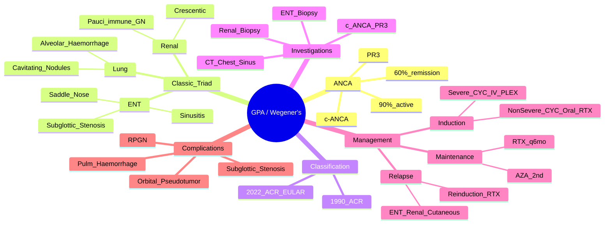

# Granulomatosis with Polyangiitis (GPA / Wegener's)

> [!tip] **FCPS/MRCP Priority: CRITICAL**
> GPA = **c-ANCA/PR3+ granulomatous vasculitis**. Classic triad: **ENT (sinusitis, saddle nose, subglottic stenosis) + Lung (nodules, cavities, haemorrhage) + Renal (pauci-immune GN)**. Induction: CYC or RTX + steroids. Maintenance: RTX > AZA. Guaranteed viva/SBA topic.

---

## Learning Objectives
By the end of this note you should be able to:
- [ ] Apply 2022 ACR/EULAR classification criteria for GPA
- [ ] Recognise the classic triad and limited vs generalised forms
- [ ] Interpret c-ANCA/PR3 (sensitivity/specificity, serial monitoring)
- [ ] Select induction regimen (CYC vs RTX) and maintenance strategy
- [ ] Manage subglottic stenosis and pulmonary haemorrhage emergencies
- [ ] Monitor for relapse (common, 50% at 5 years)

---

## 1. Definition & Epidemiology

| Feature | Detail |
|---------|--------|
| **Definition** | **Necrotising granulomatous vasculitis** of small/medium vessels, strongly associated with **c-ANCA/PR3** — affects **upper respiratory, lungs, kidneys** |
| **Previous Name** | Wegener's Granulomatosis |
| **Incidence** | 10-14/1,000,000/year |
| **Prevalence** | 30-100/1,000,000 |
| **Peak Onset** | **40-60 years** (can occur any age) |
| **Sex Ratio** | **M = F** (slight male predominance in some series) |
| **Genetics** | HLA-DPB1*04:01, SERPINA1 (α1-antitrypsin), PRTN3 |

---

## 2. Aetiology & Pathophysiology

```mermaid
flowchart LR
    A[Genetic Susceptibility\nHLA-DPB1, SERPINA1, PRTN3] --> B[Environmental Trigger\nInfection (S. aureus), Silica]
    B --> C[PR3 Expression on Neutrophils\nTranslocation to Surface]
    C --> D[c-ANCA (Anti-PR3) Binding\nNeutrophil Activation]
    D --> E[Respiratory Burst, Degranulation\nNETosis, Endothelial Damage]
    E --> F[Granulomatous Inflammation\nNecrotising, Geographic Necrosis]
    F --> G[Small/Medium Vessel Vasculitis\nENT, Lung, Kidney]
```

### Key Pathogenic Features
| Feature | Detail |
|---------|--------|
| **PR3 (Proteinase 3)** | Neutrophil serine protease — **target of c-ANCA** |
| **c-ANCA mechanism** | Anti-PR3 binds surface PR3 → neutrophil activation → ROS, degranulation, NETosis → endothelial damage |
| **Granulomatous inflammation** | **Necrotising granulomas** with **geographic necrosis** (distinct from sarcoid non-necrotising) |
| **S. aureus carriage** | Chronic nasal carriage → recurrent ENT flares; **trimethoprim prophylaxis reduces relapse** |

---

## 3. Clinical Features — **The Classic Triad**

| System | Manifestations | FCPS/MRCP Pearl |
|--------|----------------|-----------------|
| **Upper Respiratory (ENT)** | **Chronic sinusitis** (crusting, purulent), **epistaxis**, **saddle nose deformity** (septal cartilage destruction), **subglottic stenosis** (high-pitched stridor, dyspnoea), otitis media, hearing loss | **Saddle nose = pathognomonic** for GPA; Subglottic stenosis = high stridor, may need dilation/tracheostomy |
| **Lower Respiratory** | **Pulmonary nodules** (multiple, cavitating, "mass-like"), **alveolar haemorrhage** (haemoptysis, anaemia, ground-glass on CT), **fleeting infiltrates**, pleural effusion | **Cavitating nodules** = classic; Alveolar haemorrhage = emergency |
| **Renal** | **Pauci-immune necrotising crescentic GN** (RPGN), haematuria, proteinuria, RBC casts, rising Cr | **Renal biopsy = pauci-immune** (no/few immune complexes on IF) |
| **Other** | Cutaneous (palpable purpura, nodules), ocular (scleritis, orbital pseudotumor), neurological (mononeuritis multiplex), constitutional (fever, weight loss) | Limited GPA = ENT + Lung only (no renal) |

> [!warning] **Limited GPA**
> - **ENT + Lung involvement only** (no renal)
> - Better prognosis but still needs treatment
> - **c-ANCA/PR3 +ve in 70-80%**

---

## 4. Classification — 2022 ACR/EULAR Criteria

| Criterion | Score |
|-----------|-------|
| **Nasal crusting / epistaxis / saddle nose** | 4 |
| **Lung nodules / cavities / haemorrhage** | 4 |
| **Pauci-immune GN** (renal biopsy) | 8 |
| **c-ANCA / PR3 positive** | 6 |
| **Granulomatous inflammation on biopsy** (ENT/Lung) | 5 |
| **Conductive or sensorineural hearing loss** | 2 |

**Total Score ≥5 = GPA** (Specificity 97%, Sensitivity 90%)

> [!important] **1990 ACR Criteria (Classic — Still Tested)**
> 1. Nasal/oral inflammation (crusting, epistaxis)
> 2. Abnormal CXR (nodules, cavities, infiltrates)
> 3. Urinary sediment (RBC casts, >5 RBC/hpf)
> 4. Granulomatous inflammation on biopsy (artery/perivascular)
> **≥2/4 = Sensitivity 88%, Specificity 92%**

---

## 5. ANCA — c-ANCA / PR3

| Feature | Detail |
|---------|--------|
| **Pattern** | **c-ANCA (cytoplasmic)** — granular cytoplasmic staining |
| **Target** | **PR3 (Proteinase 3)** |
| **Sensitivity** | **90% active generalised GPA**, **70-80% limited GPA**, **60% remission** |
| **Specificity** | **>95%** for GPA (vs MPA, EGPA, other) |
| **Serial Monitoring** | **Rising titres may predict relapse** (but not perfect — treat clinically) |
| **Negative GPA** | ~10% active GPA — biopsy if high suspicion |

> [!critical] **ANCA Pitfalls**
> - **c-ANCA/PR3 ≠ 100% GPA** — can be +ve in IBD, RA, endocarditis, drugs (rare)
> - **Negative ANCA ≠ exclude GPA** — 10% active GPA ANCA-negative
> - **Titres don't always correlate with activity** — clinical assessment primary

---

## 6. Diagnosis — Investigations

| Test | Role |
|------|------|
| **c-ANCA / PR3 ELISA** | **Primary serological test** (90% active generalised) |
| **p-ANCA / MPO** | Usually negative (if +ve, think MPA/EGPA) |
| **FBC, ESR, CRP** | Inflammatory markers (monitor activity) |
| **Renal Function** | Cr, eGFR, urine dipstick (proteinuria, haematuria, RBC casts) |
| **CXR / CT Chest** | **Nodules (cavitating), haemorrhage (ground-glass), infiltrates** |
| **Sinus CT** | Opacification, mucosal thickening, bony destruction |
| **Renal Biopsy** | **Pauci-immune necrotising crescentic GN** (IF: negative/few immune complexes) |
| **ENT/Lung Biopsy** | **Necrotising granulomatous inflammation** with geographic necrosis |
| **Urine for Alveolar Haemorrhage** | Haemosiderin-laden macrophages (if pulmonary haemorrhage) |

---

## 7. Management

```mermaid
flowchart TD
    A[GPA Diagnosis\nGeneralised (Renal) vs Limited] --> B{Severity}
    B -->|Severe (RPGN, Pulm Haemorrhage)| C[Induction: CYC IV + Pulse MP\nOR RTX + Pulse MP]
    B -->|Non-Severe| D[Induction: CYC Oral + Pred\nOR RTX + Pred]
    C --> E[PLEX for Severe Pulm Haemorrhage/\nRPGN (PEXIVAS: consider if Cr >5.6)]
    D --> F[Maintenance: Rituximab q6mo\n> AZA (MAINRITSAN)]
    E --> F
    F --> G[Relapse Monitoring:\nq3mo clinical + c-ANCA + Cr + Urine]
    G --> H{Relapse?}
    H -->|Yes| I[Re-induction: RTX preferred\n(CYC cumulative dose limit)]
    H -->|No| J[Taper Steroids to Stop\nContinue RTX q6mo 2-5yr]
```

### Induction Regimens

| Regimen | Indication | Details |
|---------|------------|---------|
| **Cyclophosphamide (IV Pulse)** | **Severe** (RPGN, pulmonary haemorrhage, life-threatening) | **500-1000mg/m² IV q2-4wk** ×3-6 months + **Pulse MP 500-1000mg ×3** → oral pred taper; **Mesna + hydration**; gonadoprotection |
| **Cyclophosphamide (Oral)** | Non-severe | 2mg/kg/day (max 200mg) + pred taper; more bladder toxicity |
| **Rituximab** | **All severity** (RAVE trial: non-inferior to CYC for remission) | **375mg/m² IV weekly ×4** (or 1000mg ×2 2wks apart) + pred taper; **preferred for relapsing, childbearing, CYC contraindicated** |
| **Plasma Exchange (PLEX)** | **Severe pulmonary haemorrhage or RPGN** (Cr >5.6 mg/dL / 500 µmol/L) | **PEXIVAS trial**: PLEX reduces ESKD but not mortality; 7 exchanges ×1.5 plasma volume |

> [!critical] **Induction Choice**
> - **Severe/RPGN/Pulm Haemorrhage**: **CYC IV + PLEX** or **RTX + PLEX**
> - **Childbearing potential / relapsing / CYC contraindicated**: **RTX**
> - **Standard**: Either (discuss with patient)

### Maintenance (After Induction Remission)
| Drug | Dose | Duration | Evidence |
|------|------|----------|----------|
| **Rituximab** | **500mg IV q6mo** (or 1000mg q6mo) | **2-5 years** | **MAINRITSAN**: RTX superior to AZA for relapse-free survival |
| **Azathioprine** | 2mg/kg/day | 2-5 years | If RTX contraindicated; TPMT test |
| **Methotrexate** | 15-25mg weekly | Limited GPA only | Not for generalised with renal involvement |
| **Prednisolone** | Taper to **stop** by 4-6 months | steroid-free remission goal | |

> [!important] **Relapse = Common**
> - **50% at 5 years** — ENT (subglottic stenosis), renal, cutaneous
> - **Rising c-ANCA may herald relapse** — but treat clinically
> - **Re-induction**: **RTX preferred** (cumulative CYC dose limit ~15-20g)

### Trimethoprim Prophylaxis
- **Co-trimoxazole 480mg 3x/week** — reduces **ENT relapse** (S. aureus carriage) and **PJP**
- **Continued throughout maintenance**

---

## 8. Complications & Emergency Situations

| Emergency | Recognition | Immediate Action |
|-----------|-------------|------------------|
| **Pulmonary Haemorrhage** | Haemoptysis, dropping Hb, ground-glass CXR/CT, respiratory failure | **IV MP 1000mg ×3 + CYC/RTX + PLEX** (PEXIVAS); ICU, intubation if needed |
| **RPGN** | Rising Cr, oliguria, RBC casts, pulmonary-renal syndrome | **IV MP + CYC/RTX + PLEX** (if Cr >5.6) |
| **Subglottic Stenosis** | **High-pitched stridor, dyspnoea on exertion**, voice change | **Urgent ENT** — endoscopic dilation, steroid injection; **RTX may help**; tracheostomy if critical |
| **Orbital Pseudotumor** | Proptosis, diplopia, pain, vision threat | **High-dose steroids + CYC/RTX**; urgent ophtho |
| **Mononeuritis Multiplex** | Asymmetric sensory/motor deficits, foot/wrist drop | Nerve conduction, biopsy; **CYC/RTX + steroids** |

---

## 9. FCPS/MRCP High-Yield Summary

| Topic | Key Points |
|-------|------------|
| **ANCA** | **c-ANCA/PR3** (cytoplasmic) — 90% active generalised, 60% remission, >95% specific |
| **Classic Triad** | **ENT** (sinusitis, saddle nose, subglottic stenosis) + **Lung** (cavitating nodules, haemorrhage) + **Renal** (pauci-immune crescentic GN) |
| **Saddle Nose** | Septal cartilage destruction — **pathognomonic** |
| **Subglottic Stenosis** | High stridor, voice change — **endoscopic dilation**, RTX may help |
| **Renal Biopsy** | **Pauci-immune** necrotising crescentic GN (no immune complexes on IF) |
| **Induction** | **Severe**: CYC IV + MP + PLEX **or** RTX + MP + PLEX. **Non-severe**: CYC oral or RTX + pred |
| **Maintenance** | **RTX 500mg q6mo > AZA** (MAINRITSAN); 2-5 years |
| **Relapse** | 50% at 5yr — ENT (subglottic), renal, cutaneous; re-induction with RTX |
| **Trimethoprim** | 480mg 3x/week — reduces ENT relapse (S. aureus) + PJP prophylaxis |
| **Limited GPA** | ENT + Lung only (no renal); c-ANCA 70-80%; better prognosis |

---

## 10. Viva Questions (MRCP PACES / FCPS)

| Question | Expected Answer |
|----------|----------------|
| "A 50yo man has chronic sinusitis, saddle nose, haemoptysis, and rising Cr with RBC casts. c-ANCA positive. Diagnosis and induction?" | **GPA (generalised)**. **Severe (RPGN)** → **IV CYC 500-1000mg/m² q2-4wk + Pulse MP 1000mg ×3** ± **PLEX** (if Cr >5.6). Or **RTX 375mg/m² ×4 + MP** if CYC contraindicated. |
| "What is the classic triad of GPA?" | **Upper respiratory** (sinusitis, saddle nose, subglottic stenosis) + **Lower respiratory** (cavitating nodules, alveolar haemorrhage) + **Renal** (pauci-immune crescentic GN). |
| "What ANCA pattern and target in GPA?" | **c-ANCA (cytoplasmic) / PR3** — 90% active generalised, 60% remission, >95% specific. |
| "How does GPA renal biopsy differ from SLE nephritis?" | **GPA: pauci-immune** (no/few immune complexes on IF). **SLE: "full house" IF** (IgG, IgM, IgA, C3, C1q), subendothelial deposits on EM. |
| "A GPA patient develops high-pitched stridor. What is this and management?" | **Subglottic stenosis** — **urgent ENT for endoscopic dilation ± steroid injection**; RTX may help prevent recurrence; tracheostomy if critical. |
| "What is the maintenance regimen after GPA induction?" | **Rituximab 500mg IV q6mo for 2-5 years** (MAINRITSAN: superior to AZA). Taper steroids to stop. Co-trimoxazole 480mg 3x/week for ENT relapse/PJP prophylaxis. |
| "What is the difference between GPA and MPA?" | **GPA: c-ANCA/PR3, granulomatous inflammation, ENT involvement (saddle nose, subglottic stenosis)**. **MPA: p-ANCA/MPO, no granulomas, no ENT, renal-pulmonary syndrome common**. |
| "When do you use plasma exchange in GPA?" | **Severe pulmonary haemorrhage** or **RPGN with Cr >5.6 mg/dL (500 µmol/L)** — PEXIVAS: reduces ESKD, not mortality. 7 exchanges ×1.5 plasma volume. |
| "How does limited GPA differ from generalised?" | Limited = ENT + Lung only (**no renal**); c-ANCA 70-80%; better prognosis; MTX possible for maintenance. |
| "What is the role of co-trimoxazole in GPA?" | **480mg 3x/week** — reduces **ENT relapse** (eradicates S. aureus nasal carriage) + **PJP prophylaxis** during immunosuppression. |

---

## 11. Confusions & Mnemonics

| Confusion | Clarification |
|-----------|---------------|
| **GPA vs MPA** | GPA = **c-ANCA/PR3**, **granulomas**, **ENT** (saddle nose, subglottic). MPA = **p-ANCA/MPO**, **no granulomas**, **no ENT**, renal-pulmonary. |
| **GPA vs EGPA** | GPA = c-ANCA/PR3, no asthma/eos. EGPA = **p-ANCA/MPO (40-60%)**, **asthma**, **eosinophilia**, allergic rhinitis. |
| **c-ANCA/PR3 Negative GPA** | ~10% active GPA ANCA-negative — biopsy if high suspicion. |
| **Rising ANCA = Relapse?** | **Not always** — may rise without clinical relapse; treat **clinically**, not by titre alone. |
| **CYC vs RTX Induction** | **Severe/RPGN/Pulm Haem**: CYC IV + PLEX or RTX + PLEX. **Childbearing/relapsing/CYC contraindicated**: RTX. Both non-inferior (RAVE). |
| **Maintenance Duration** | **2-5 years** after remission — relapse risk persists. RTX q6mo. |

**Mnemonic: GPA = "C-ANCA PR3"**
- **C**-ANCA = **C**ytoplasmic
- **PR3** = **P**roteinase **3**

**Mnemonic: Classic Triad = "E-L-R"**
- **E**NT (sinusitis, saddle nose, subglottic stenosis)
- **L**ung (cavitating nodules, haemorrhage)
- **R**enal (pauci-immune GN)

**Mnemonic: Induction = "SEVERE = CYC IV + PLEX"**
- **S**EVERE (RPGN, Pulm Haem) → **CYC IV** + **PLEX** (or RTX + PLEX)

**Mnemonic: Maintenance = "RITUX q6mo > AZA"**
- **MAINRITSAN trial**: RTX superior to AZA for relapse-free survival

**Mnemonic: ENT Features = "S-S-S"**
- **S**inusitis (chronic, crusting)
- **S**addle nose (septal destruction)
- **S**ubglottic stenosis (high stridor)

**Mnemonic: Relapse Sites = "E-R-C"**
- **E**NT (subglottic stenosis)
- **R**enal
- **C**utaneous

---

## 12. Mind Map



---

## 13. One-Page Revision Card

| Domain | Key Points |
|--------|------------|
| **ANCA** | **c-ANCA / PR3** (cytoplasmic) — 90% active, 60% remission, >95% specific |
| **Classic Triad** | ENT (sinusitis, **saddle nose**, **subglottic stenosis**) + Lung (cavitating nodules, haemorrhage) + Renal (pauci-immune crescentic GN) |
| **Renal Biopsy** | **Pauci-immune** necrotising crescentic GN (no immune complexes) |
| **Induction** | **Severe (RPGN/Pulm Haem)**: CYC IV + MP + **PLEX** (or RTX + MP + PLEX) |
| **Maintenance** | **RTX 500mg q6mo > AZA** (MAINRITSAN); 2-5 years; taper steroids off |
| **Relapse** | **50% at 5yr** — ENT (subglottic), renal, cutaneous; re-induce with RTX |
| **Subglottic Stenosis** | High stridor — endoscopic dilation, RTX may help |
| **Trimethoprim** | 480mg 3x/week — ENT relapse (S. aureus) + PJP prophylaxis |
| **Limited GPA** | ENT + Lung only (no renal); c-ANCA 70-80%; better prognosis |
| **GPA vs MPA** | GPA: c-ANCA/PR3, granulomas, ENT. MPA: p-ANCA/MPO, no granulomas, no ENT. |

---

## 14. Spaced Repetition Trackers

| Review Interval | Date Completed | Confidence (1-5) | Notes |
|-----------------|----------------|------------------|-------|
| 24 hours | | | |
| 7 days | | | |
| 15 days | | | |
| 30 days | | | |
| 90 days | | | |

---

## 15. Self-Test Scorecard

| Section | Score /5 | Last Attempt |
|---------|----------|--------------|
| ANCA Interpretation | | |
| Classic Triad Recognition | | |
| Induction Selection (CYC vs RTX vs PLEX) | | |
| Maintenance Strategy | | |
| Subglottic Stenosis Management | | |
| Relapse Monitoring | | |
| GPA vs MPA vs EGPA | | |
| Viva Questions | | |

---

## Local Navigation
- **Parent Heading**: [[../Vasculitis|Vasculitis]]
- **Parent Topic Group**: [[ANCA-associated vasculitis overview]]
- **Chapter Map**: [[../Davidson Chapter 26 - Rheumatology Hierarchy|Rheumatology Hierarchy]]
- **Chapter MOC**: [[../Rheumatology MOC|Rheumatology MOC]]
- **Drug Reference**: [[../../Clinical Approach to Musculoskeletal Disease/Drugs in rheumatology|Drugs in rheumatology]]
- **Related**: [[Microscopic polyangiitis (MPA)]] · [[Eosinophilic granulomatosis with polyangiitis (EPA)]] · [[ANCA-associated vasculitis overview]]