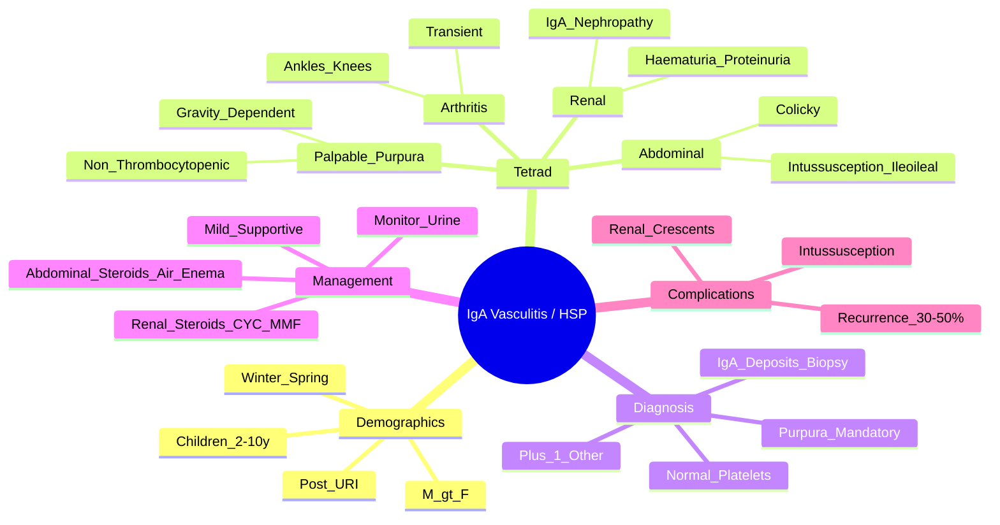

# IgA Vasculitis (Henoch-Schönlein Purpura)

> [!tip] **FCPS/MRCP Priority: HIGH**
> IgA Vasculitis (HSP) = **most common childhood vasculitis**. **Tetrad**: **palpable purpura (gravity-dependent) + arthritis/arthralgia + abdominal pain + renal (IgA nephropathy)**. **Self-limiting** in most; **steroids for severe abdominal/renal**; **recurrence 30-50% within 6 months**.

---

## Learning Objectives
By the end of this note you should be able to:
- [ ] Recognise the **classic tetrad**: **palpable purpura (gravity-dependent) + arthralgia/arthritis + abdominal pain + renal involvement**
- [ ] Apply **EULAR/PRINTO/PRES 2015 classification criteria** for diagnosis
- [ ] Interpret **renal involvement (IgA nephropathy)** — haematuria, proteinuria, nephritic/nephrotic syndrome
- [ ] Manage **severe abdominal pain** (intussusception risk) and **renal disease** (steroids ± immunosuppression)
- [ ] Recognise **recurrence risk** (30-50% within 6 months, often triggered by URI)
- [ ] Differentiate from **meningococcemia, TTP/HUS, SLE, IgA nephropathy (isolated renal)**

---

## 1. Definition & Epidemiology

| Feature | Detail |
|---------|--------|
| **Definition** | **IgA-dominant immune complex small vessel vasculitis** — **palpable purpura**, arthritis, abdominal pain, **renal involvement** |
| **Previous Name** | Henoch-Schönlein Purpura (HSP) |
| **Incidence** | **10-20/100,000/year** (most common childhood vasculitis) |
| **Peak Age** | **Children 2-10 years** (peak 4-6 years) |
| **Sex Ratio** | **M > F** (1.5:1) |
| **Seasonality** | **Winter/Spring** (post-URI) |
| **Genetics** | HLA-DRB1, HLA-B35; **familial clustering** |

---

## 2. Aetiology & Pathophysiology

```mermaid
flowchart LR
    A[Genetic Susceptibility\nHLA-DRB1, B35] --> B[Environmental Trigger\nURI (Strep, Viral),\nDrugs, Vaccines, Cold]
    B --> C[Galactose-Deficient IgA1\nGd-IgA1 Production]
    C --> D[Anti-Gd-IgA1 Antibodies\nIgG/IgM]
    D --> E[IgA-Containing Immune Complexes\nCirculating + Vascular Deposition]
    E --> F[Complement Activation\nAlternative Pathway]
    F --> G[Small Vessel Vasculitis\nSkin, Joints, GI, Kidney]
```

### Key Pathogenic Features
| Feature | Detail |
|---------|--------|
| **Gd-IgA1** | **Galactose-deficient IgA1** — hinge region O-glycosylation defect |
| **Anti-Gd-IgA1** | **IgG/IgM autoantibodies** against Gd-IgA1 |
| **Immune Complexes** | **IgA1-containing** — deposit in **dermal capillaries, synovium, GI vasculature, glomeruli** |
| **Complement** | **Alternative pathway** (C3 activation, C5a) → neutrophil recruitment |

---

## 3. Clinical Features — **Classic Tetrad**

| Feature | Description | Frequency |
|---------|-------------|-----------|
| **1. Palpable Purpura** | **Gravity-dependent**: **buttocks, lower limbs, extensor surfaces**; **non-thrombocytopenic**, non-blanching, **symmetrical**, may become necrotic/ulcerated | **100%** (required for diagnosis) |
| **2. Arthritis/Arthralgia** | **Transient, migratory**, ankles > knees, **non-erosive**, self-limiting days-weeks | **70-85%** |
| **3. Abdominal Pain** | **Colicky**, periumbilical, **mesenteric vasculitis** → **intussusception** (ileo-ileal), **GI bleed**, **pancreatitis** | **50-75%** |
| **4. Renal Involvement** | **IgA nephropathy**: **haematuria** (microscopic > macroscopic), **proteinuria**, **nephritic/nephrotic syndrome**, **hypertension** | **20-50%** (weeks-months after onset) |

### Other Features
| Feature | Detail |
|---------|--------|
| **Scrotal Pain/Swelling** | **Testicular torsion mimic** — epididymo-orchitis from vasculitis |
| **CNS** | Rare: encephalopathy, seizures, intracranial haemorrhage |
| **Pulmonary** | Rare: pulmonary haemorrhage (capillaritis) |
| **Constitutional** | Low-grade fever, malaise, preceding URI (2-3 weeks) |

> [!critical] **Purpura Characteristics**
> - **Palpable** (not just petechiae)
> - **Gravity-dependent** (buttocks, legs, extensor surfaces)
> - **Non-thrombocytopenic** (platelets normal)
> - **Symmetrical**
> - **May progress** to vesicles, bullae, ulceration, necrosis

> [!warning] **Intussusception**
> - **Ileo-ileal** (not ileo-caecal as in infants)
> - **Peak days 3-5** of abdominal pain
> - **Air enema** diagnostic + therapeutic; **surgery if failed/necrosis**

---

## 4. Classification Criteria — **EULAR/PRINTO/PRES 2015**

**Mandatory:** **Palpable purpura** (not thrombocytopenic) **PLUS ≥1 of:**

| Criterion | Description |
|-----------|-------------|
| **Diffuse abdominal pain** | Colicky, with/without intussusception |
| **Arthritis/Arthralgia** | Acute, transient, ankles/knees |
| **Renal involvement** | Haematuria (± proteinuria, nephritic/nephrotic) |
| **Biopsy (if done)** | **IgA-dominant immune deposits** (granular) in vessel walls |

> [!important] **Diagnosis: Mandatory purpura + ≥1 other criterion**
> - **No single laboratory test** is diagnostic
> - **Biopsy** (skin/kidney): **IgA-dominant granular deposits** in vessel walls/glomeruli (confirmatory)

---

## 5. Renal Involvement — **IgA Nephropathy**

| Manifestation | Frequency | Prognosis |
|---------------|-----------|-----------|
| **Isolated microscopic haematuria** | 50% of renal | **Excellent** |
| **Proteinuria + haematuria** | 30% | **Good** if <0.5g/day |
| **Nephritic syndrome** | 15% | **Guarded** (crescents) |
| **Nephrotic syndrome** | 5% | **Poor** |
| **Rapidly progressive GN (crescentic)** | <5% | **Poor** — needs immunosuppression |

> [!critical] **Renal Biopsy (if indicated)**
> - **Mesangial IgA deposits** (granular, dominant or co-dominant)
> - **Light microscopy**: mesangial hypercellularity, crescents (if severe)
> - **Oxford MEST-C score** for prognostication

---

## 6. Investigations

| Test | Purpose | Typical Finding |
|------|---------|-----------------|
| **CBC** | Exclude thrombocytopenia | **Normal platelets** (vs TTP/HUS/meningococcemia) |
| **Coagulation** | Normal | PT/APTT normal |
| **LFT** | Exclude other causes | Normal |
| **Renal Function** | Screen renal involvement | Cr, eGFR |
| **Urinalysis** | **Screen renal** (EVERY visit) | **Haematuria ± proteinuria** |
| **Urine Protein/Creatinine Ratio** | Quantify proteinuria | >0.5 = significant |
| **Serum IgA** | Supportive | **Elevated in 50-60%** |
| **Complement (C3, C4)** | Normal | Distinguishes from SLE/cryoglobulinaemia |
| **ASO/Throat Swab** | Identify strep trigger | If preceding URI |
| **Skin Biopsy (if atypical)** | **IgA-dominant deposits** in dermal vessels | Confirmatory |
| **Renal Biopsy** | If proteinuria >0.5g, nephritic, nephrotic | IgA deposits, MEST-C score |
| **Ultrasound Abdomen** | If intussusception suspected | **Target sign** (air enema therapeutic) |

---

## 7. Management

```mermaid
flowchart TD
    A[IgA Vasculitis Diagnosis] --> B{Mild\n(Skin Only ± Mild Arthritis)}
    B -->|Yes| C[**Supportive**\nNSAIDs (arthritis/abdominal)\nAvoid NSAIDs if renal\nMonitor urine weekly ×4-6w]
    B -->|No| D{Severe Abdominal Pain /\nIntussusception}
    D -->|Yes| E[**Admit, NBM, IV Fluids**\nAir enema (diagnostic/therapeutic)\nSurgery if failed/necrosis\nSteroids if severe/pancreatitis]
    D -->|No| F{Renal Involvement}
    F -->|Mild (Haematuria only)| G[Monitor urine weekly ×6mo\nNo immunosuppression]
    F -->|Moderate-Severe\n(Proteinuria, Nephritic/\nNephrotic, Crescents)| H[**Steroids**\nPred 1-2mg/kg/day\n+ **Immunosuppression**\nCYC/MMF/AZA if severe\nACEi/ARB for proteinuria]
```

### Treatment by Severity

| Manifestation | Treatment |
|---------------|-----------|
| **Skin only / mild arthritis** | **Supportive**: NSAIDs (avoid if renal), analgesia; **monitor urine weekly ×4-6 weeks** |
| **Severe abdominal pain** | **Admit**: NBM, IV fluids; **steroids** (pred 1-2mg/kg) if severe/pancreatitis; **air enema** for intussusception; surgery if failed/necrosis |
| **Renal: isolated haematuria** | **Monitor** urine weekly ×6 months; **no immunosuppression** |
| **Renal: proteinuria/nephritic/nephrotic** | **Steroids** (pred 1-2mg/kg/day) ± **immunosuppression** (CYC, MMF, AZA); **ACEi/ARB** for proteinuria |
| **Nephrotic syndrome / crescentic GN** | **Pulse MP 500-1000mg ×3d** + **CYC IV** (or MMF) + ACEi/ARB |

> [!important] **Recurrence**
> - **30-50% recur within 6 months** (often triggered by URI)
> - **Monitor urine weekly during flare**
> - **Long-term renal follow-up** (up to 5 years)

---

## 8. Differential Diagnosis

| Condition | Distinguishing Features |
|-----------|------------------------|
| **Meningococcemia** | **Petechiae/purpura + sepsis + thrombocytopenia + coagulopathy** — **EMERGENCY** |
| **TTP/HUS** | **Thrombocytopenia + MAHA + fever + renal + neuro** — **ADAMTS13** (TTP) |
| **SLE** | **ANA/RF +**, malar rash, oral ulcers, renal, serositis, cytopenias |
| **IgA Nephropathy (Isolated)** | **Renal only** — no purpura, arthritis, abdominal pain; biopsy: mesangial IgA |
| **GPA/MPA** | **c-ANCA/p-ANCA +**, respiratory, renal, no gravity-dependent purpura |
| **Urticaria** | **Pruritic wheals**, blanchable, transient (not palpable purpura) |
| **Serum Sickness** | Drug/antiserum trigger, fever, urticaria, arthralgia, lymphadenopathy |

> [!critical] **Purpura + Thrombocytopenia = NOT IgA Vasculitis**
> - Think **TTP, HUS, meningococcemia, DIC, leukaemia**

---

## 9. FCPS/MRCP High-Yield Summary

| Topic | Key Points |
|-------|------------|
| **Demographics** | **Children 2-10y (peak 4-6y)**, M>F, winter/spring, post-URI |
| **Tetrad** | **Palpable purpura (gravity-dependent) + arthritis + abdominal pain + renal** |
| **Purpura** | **Palpable, gravity-dependent (buttocks/legs), non-thrombocytopenic, symmetrical** |
| **Abdominal** | **Colicky pain, intussusception (ileo-ileal), GI bleed** — air enema therapeutic |
| **Renal** | **IgA nephropathy** — haematuria ± proteinuria; **biopsy: mesangial IgA deposits** |
| **Criteria** | **Mandatory purpura + ≥1** (abdominal, arthritis, renal, biopsy) |
| **Platelets** | **Normal** (vs TTP/HUS/meningococcemia) |
| **Recurrence** | **30-50% within 6 months** — often post-URI |
| **Severe Abdominal** | **Air enema** (therapeutic); steroids if severe; surgery if failed |
| **Severe Renal** | **Steroids + CYC/MMF** + ACEi/ARB; biopsy if proteinuria >0.5g |
| **Platelets** | **Normal** — thrombocytopenia = TTP/HUS/meningococcemia |

---

## 10. Viva Questions (MRCP PACES / FCPS)

| Question | Expected Answer |
|----------|----------------|
| "A 6yo boy has palpable purpura on buttocks/legs, ankle/knee arthritis, colicky abdominal pain. Platelets normal. Diagnosis?" | **IgA Vasculitis (HSP)** — classic tetrad (purpura, arthritis, abdominal pain, renal later). **Normal platelets** exclude TTP/HUS/meningococcemia. |
| "What are the EULAR/PRINTO/PRES 2015 criteria for IgA vasculitis?" | **Mandatory palpable purpura (non-thrombocytopenic) + ≥1 of**: abdominal pain, arthritis/arthralgia, renal involvement, or biopsy with IgA deposits. |
| "What is the characteristic distribution of purpura in HSP?" | **Gravity-dependent**: **buttocks, lower limbs, extensor surfaces**; **symmetrical, palpable, non-thrombocytopenic**. |
| "A child with HSP develops sudden severe abdominal pain, vomiting, bloody stool. What do you suspect and manage?" | **Intussusception (ileo-ileal)** — **admit, NBM, IV fluids, air enema (diagnostic + therapeutic)**; surgery if failed/necrosis. **Steroids** if severe/pancreatitis. |
| "When do you biopsy the kidney in HSP?" | **Proteinuria >0.5g/day, nephritic syndrome, nephrotic syndrome, hypertension, rising Cr** — **Oxford MEST-C score** for prognosis. |
| "What is the recurrence rate of HSP and when?" | **30-50% within 6 months** — often triggered by **URI**. Monitor urine weekly during flares. |
| "How do you differentiate HSP from meningococcemia?" | HSP: **palpable purpura + normal platelets + well child**. Meningococcemia: **petechiae/purpura + thrombocytopenia + sepsis + coagulopathy + toxic child**. |
| "What is the management of severe renal involvement in HSP (nephrotic syndrome/crescents)?" | **Pulse MP 500-1000mg ×3d** + **CYC IV** (or MMF) + **ACEi/ARB** for proteinuria; **renal biopsy** (MEST-C). |
| "What is the significance of normal platelets in a child with purpura?" | **Excludes TTP/HUS/meningococcemia/leukaemia** — supports HSP/IgA vasculitis. |
| "How long do you monitor urine after HSP diagnosis?" | **Weekly for 4-6 weeks** if mild; **6 months** if renal involvement; **long-term if proteinuria/crescents**. |

---

## 11. Confusions & Mnemonics

| Confusion | Clarification |
|-----------|---------------|
| **HSP vs Meningococcemia** | HSP: **palpable purpura + normal platelets + non-toxic**. Meningococcemia: **petechiae + thrombocytopenia + septic + coagulopathy**. |
| **HSP vs TTP/HUS** | HSP: **normal platelets, no MAHA**. TTP: **thrombocytopenia + MAHA + neuro + fever + renal**. HUS: **thrombocytopenia + MAHA + renal (STEC)**. |
| **Intussusception in HSP** | **Ileo-ileal** (not ileo-caecal), **air enema therapeutic**, peak days 3-5 of abdominal pain. |
| **Renal Biopsy Timing** | Don't biopsy isolated haematuria. Biopsy if **proteinuria >0.5g, nephritic/nephrotic, hypertension, rising Cr**. |
| **NSAIDs in HSP** | **Avoid if renal involvement** (worsens renal perfusion). Use paracetamol/opioids for pain. |
| **Recurrence** | **30-50% within 6 months** — monitor urine weekly; often triggered by URI. |

**Mnemonic: HSP Tetrad = "P-A-A-R"**
- **P**alpable purpura (gravity-dependent)
- **A**rthritis/Arthralgia
- **A**bdominal pain (intussusception)
- **R**enal (IgA nephropathy)

**Mnemonic: Purpura = "GRAVITY"**
- **G**ravity-dependent
- **R**eal (palpable)
- **A**symmetrical? No, **SYM**metrical
- **V**essels (small)
- **I**gA deposits
- **T**hrombocytes normal
- **Y**oung children

**Mnemonic: Intussusception = "ILEO-ILEAL"**
- **ILEO**-ileal (not ileo-caecal)
- **AIR ENEM**A therapeutic
- **S**urgery if failed

**Mnemonic: Renal = "MEST-C"**
- **M**esangial hypercellularity
- **E**ndocapillary hypercellularity
- **S**egmental glomerulosclerosis
- **T**ubular atrophy/interstitial fibrosis
- **C**rescents

**Mnemonic: Differential = "M-T-H"**
- **M**eningococcemia (thrombocytopenia, septic)
- **T**TP/HUS (thrombocytopenia + MAHA)
- **H**SP (normal platelets, gravity-dependent purpura)

---

## 13. Mind Map



---

## 14. One-Page Revision Card

| Domain | Key Points |
|--------|------------|
| **Demographics** | Children 2-10y (peak 4-6), M>F, winter/spring, post-URI |
| **Tetrad** | **Palpable purpura (gravity-dependent) + arthritis + abdominal pain + renal** |
| **Purpura** | **Palpable, gravity-dependent (buttocks/legs), non-thrombocytopenic, symmetrical** |
| **Criteria** | **Mandatory purpura + ≥1** (abdominal, arthritis, renal, biopsy with IgA) |
| **Abdominal** | **Intussusception (ileo-ileal)** — air enema therapeutic; steroids if severe |
| **Renal** | **IgA nephropathy** — haematuria ± proteinuria; biopsy if >0.5g proteinuria |
| **Platelets** | **Normal** (vs TTP/HUS/meningococcemia) |
| **Recurrence** | **30-50% within 6 months** — monitor urine weekly |
| **Severe Renal** | Steroids + CYC/MMF + ACEi/ARB; biopsy (MEST-C) |
| **Severe Abdominal** | Air enema (therapeutic); steroids; surgery if failed |

---

## 15. Spaced Repetition Trackers

| Review Interval | Date Completed | Confidence (1-5) | Notes |
|-----------------|----------------|------------------|-------|
| 24 hours | | | |
| 7 days | | | |
| 15 days | | | |
| 30 days | | | |
| 90 days | | | |

---

## 16. Self-Test Scorecard

| Section | Score /5 | Last Attempt |
|---------|----------|--------------|
| Tetrad Recognition | | |
| Criteria Application | | |
| Intussusception Management | | |
| Renal Involvement Stratification | | |
| Differential Diagnosis | | |
| Viva Questions | | |

---

## Local Navigation
- **Parent Heading**: [[../Vasculitis|Vasculitis]]
- **Parent Topic Group**: [[Primary systemic vasculitides overview]]
- **Chapter Map**: [[../Davidson Chapter 26 - Rheumatology Hierarchy|Rheumatology Hierarchy]]
- **Chapter MOC**: [[../Rheumatology MOC|Rheumatology MOC]]
- **Drug Reference**: [[../../Clinical Approach to Musculoskeletal Disease/Drugs in rheumatology|Drugs in rheumatology]]
- **Related**: [[Granulomatosis with polyangiitis (GPA)]] · [[Microscopic polyangiitis (MPA)]] · [[Polyarteritis nodosa (PAN)]]