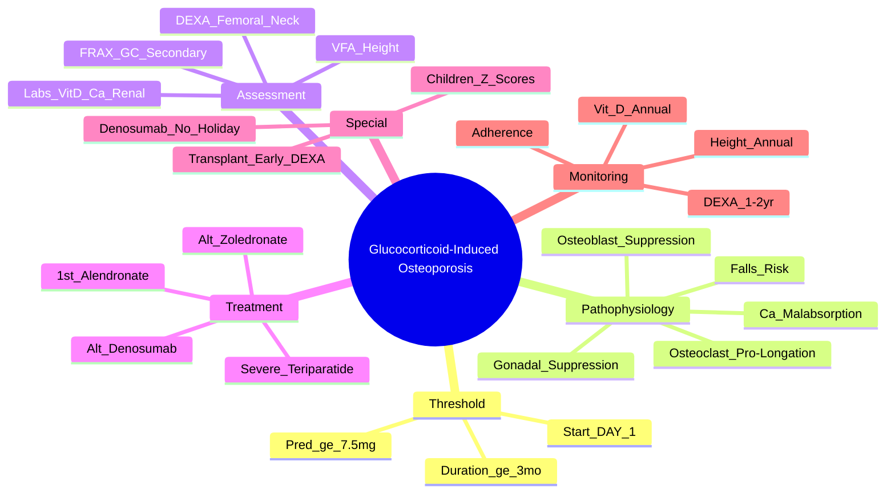

# Glucocorticoid-Induced Osteoporosis (GIOP)

> [!tip] **FCPS/MRCP Priority: CRITICAL**
> GIOP = **most common cause of secondary osteoporosis**. **Start bone protection DAY 1** if ≥7.5mg pred ≥3 months expected. **Fracture risk increases immediately** (within 3 months). **Teriparatide > oral bisphosphonate** for high-risk (active fractures, very low BMD).

---

## Learning Objectives
By the end of this note you should be able to:
- [ ] Define GIOP threshold (≥7.5mg prednisolone ≥3 months) and recognise rapid bone loss
- [ ] Implement immediate bone protection (Ca/Vit D + bisphosphonate) at steroid initiation
- [ ] Select first-line (oral bisphosphonate) vs alternative (IV zoledronate, denosumab, teriparatide)
- [ ] Apply FRAX with "glucocorticoid" and "secondary osteoporosis" ticks
- [ ] Monitor and manage GIOP in special populations (children, transplant, cycling steroids)

---

## 1. Definition & Epidemiology

| Feature | Detail |
|---------|--------|
| **Definition** | **Bone loss and increased fracture risk** due to **exogenous glucocorticoid excess** — combined effects on bone formation, resorption, calcium, sex hormones |
| **Threshold** | **≥7.5mg prednisolone (or equivalent) daily for ≥3 months** |
| **Incidence** | **30-50% of long-term steroid users** develop fractures |
| **Fracture Risk** | **Rapid increase within 3 months** of starting steroids; **vertebral > non-vertebral** |
| **Dose-Response** | **≥7.5mg/day** = significant risk; **<2.5mg/day** = minimal risk; **pulse IV** = high risk |
| **Reversibility** | **Partial** — bone density improves after stopping but fracture risk persists |

---

## 2. Pathophysiology

```mermaid
flowchart LR
    A[Glucocorticoid Excess] --> B[Direct Osteoblast Inhibition\n↓ Osteoblast Differentiation/Function\n↑ Osteoblast Apoptosis]
    A --> C[Indirect: RANKL/OPG Shift\n↑ RANKL, ↓ OPG → ↑ Osteoclastogenesis]
    A --> D[Calcium Homeostasis\n↓ Intestinal Ca Absorption\n↑ Renal Ca Excretion\n↓ 1,25-(OH)2 Vit D\n↑ PTH (secondary)]
    A --> E[Gonadal Suppression\n↓ GnRH → ↓ LH/FSH → ↓ Oestrogen/Testosterone]
    A --> F[Muscle Weakness\nProximal Myopathy → Falls]
    B --> G[Reduced Bone Formation]
    C --> H[Increased Bone Resorption]
    D --> I[Negative Calcium Balance]
    E --> J[Loss of Hormonal Bone Protection]
    F --> K[Increased Falls Risk]
    G --> L[Rapid Trabecular Bone Loss]
    H --> L
    I --> L
    J --> L
    K --> M[Increased Fracture Risk]
    L --> M
```

### Key Mechanisms
| Mechanism | Effect |
|-----------|--------|
| **Osteoblast suppression** | ↓ Bone formation (early, dominant) |
| **Osteoclast prolongation** | ↑ Bone resorption (later) |
| **↓ Calcium absorption** | Gut + kidney → secondary hyperparathyroidism |
| **Gonadal suppression** | Hypogonadism → bone loss |
| **Muscle wasting** | Proximal myopathy → falls → fractures |

---

## 3. Clinical Features & Risk Factors

| Risk Factor | Impact |
|-------------|--------|
| **Dose ≥7.5mg/day pred** | **Threshold for prophylaxis** |
| **Duration ≥3 months** | Cumulative dose matters |
| **Age >65 / Postmenopausal** | Additive risk |
| **Prior fragility fracture** | **Strongest predictor** |
| **Low BMI (<19)** | Low bone mass reserve |
| **Falls risk** | Myopathy, neuropathy, polypharmacy |
| **Low 25-OH Vit D** | Common in chronic disease |
| **High alcohol/smoking** | Additive |
| **Underlying disease** | RA (inflammation → bone loss), SLE, vasculitis, transplant |

> [!critical] **Fracture Risk Timeline**
> - **0-3 months**: Rapid trabecular bone loss (spine > hip)
> - **3-12 months**: Continued loss, slower
> - **>12 months**: Cortical bone loss, porosity
> - **Fracture risk peaks** at 3-6 months, remains elevated while on steroids

---

## 4. Diagnosis & Assessment

### FRAX for GIOP
| FRAX Adjustment | Application |
|-----------------|-------------|
| **"Glucocorticoid" tick** | **Current or recent ≥7.5mg pred ≥3mo** |
| **"Secondary osteoporosis" tick** | Underlying disease (RA, SLE, etc.) |
| **BMD input** | **Femoral neck T-score** (spine unreliable if degenerative) |
| **Thresholds (UK/NOGG)** | **Major osteoporotic ≥10-20%** or **Hip ≥3%** (age-dependent) |

### DEXA Interpretation in GIOP
| Caveat | Detail |
|--------|--------|
| **Spine BMD** | May be **falsely elevated** by aortic calcification, OA, vertebral fractures |
| **Femoral Neck** | **Preferred site** for FRAX and diagnosis |
| **T-score ≤-2.5** | Osteoporosis (but **fracture risk higher at same T-score** vs postmenopausal) |
| **Z-score** | Use in **premenopausal women, men <50, children** |

### Baseline Investigations (Before/At Steroid Start)
| Test | Purpose |
|------|---------|
| **DEXA (Spine + Hip)** | Baseline BMD |
| **Lateral Spine X-ray / VFA** | Detect **prevalent vertebral fractures** (asymptomatic 2/3) |
| **25-OH Vit D** | Deficiency <30 nmol/L → **treat before bisphosphonate** |
| **Calcium, Phosphate, ALP, PTH** | Exclude other metabolic bone disease |
| **U&E, eGFR** | Renal function (bisphosphonate dosing) |
| **FBC, LFT** | Baseline for steroids/bisphosphonates |

---

## 5. Management — **Start DAY 1**

```mermaid
flowchart TD
    A[Patient Starting ≥7.5mg Pred ≥3mo] --> B[**IMMEDIATE Bone Protection**]
    B --> B1[**Calcium 1g/day** (diet + supplement)]
    B1 --> B2[**Vitamin D 800-1000 IU/day**\n(loading if deficient <30 nmol/L)]
    B2 --> C[Assess Fracture Risk\nFRAX + Clinical + DEXA]
    C --> D{High Risk?\n(Fracture, T-score ≤-2.5,\nAge >70, High FRAX,\nHigh-dose steroids)}
    D -->|Yes| E[**Oral Bisphosphonate 1st Line**\nAlendronate 70mg weekly\n(or Risedronate 35mg weekly)]
    D -->|No / Oral intolerant| F[**IV Zoledronate 5mg yearly**\nOR Denosumab 60mg q6mo]
    D -->|Severe (T ≤-3.5 + fracture) / GIOP with fractures| G[**Teriparatide 20µg daily ×24mo**\n> Oral BP for GIOP (superior BMD/fracture)]
    E --> H[Monitor: DEXA 2-3yr, Height, Adherence]
    F --> H
    G --> H
    H --> I[Review at Steroid Dose Change/Stop]
```

### Pharmacological Options

| Drug | GIOP Position | Dose | Key Points |
|------|---------------|------|------------|
| **Oral Bisphosphonate (Alendronate/Risedronate)** | **1st line** | Alendronate 70mg weekly | **Start DAY 1**; upright 30min; eGFR ≥35 |
| **IV Zoledronate 5mg yearly** | Alternative (GI intolerance, adherence) | 5mg IV over 15min | eGFR ≥35; pre-hydrate; Vit D replete |
| **Denosumab 60mg SC q6mo** | Alternative (Renal impairment, GI intolerance) | 60mg SC q6mo | **Ca/Vit D MANDATORY**; no renal clearance; **rebound if stopped** |
| **Teriparatide 20µg daily SC** | **Superior for high-risk GIOP** (vertebral fractures) | 20µg SC daily **max 24 months** | **1st choice if prevalent fractures / very low BMD**; follow with antiresorptive |
| **Raloxifene** | Postmenopausal women only | 60mg daily | Not 1st line for GIOP |
| **HRT** | Premature menopause | — | Not 1st line |

> [!critical] **Teriparatide > Oral BP in GIOP**
> - **EUROGIOP trial**: Teriparatide superior to alendronate for **vertebral BMD and vertebral fracture reduction** in GIOP
> - **Use if**: T-score ≤-3.5, prevalent vertebral fractures, multiple fractures on BP

---

## 6. Special Populations

### Children / Adolescents
- **DEXA**: **Z-scores** (not T-scores)
- **Bisphosphonates**: **Pamidronate IV** or **Zoledronate IV** (oral not approved); **only if significant fractures + low BMD**
- **Ca/Vit D**: **Essential** — growth demands

### Transplant Recipients
- **High-dose steroids initially** → rapid bone loss
- **Baseline DEXA** pre-transplant or at 3 months
- **Zoledronate/Denosumab** preferred (adherence, GI issues post-transplant)

### Cyclic / Pulse Steroids
- **Pulse IV methylprednisolone** (e.g., vasculitis induction): treat as **≥7.5mg pred equivalent**
- **Cyclic oral**: if cumulative ≥7.5mg/day average → treat as chronic

---

## 7. Monitoring & Follow-Up

| Parameter | Frequency |
|-----------|-----------|
| **DEXA** | Baseline → **1-2 years** if treating; 2-3 years if monitoring |
| **Height** | Every visit (height loss >4cm = vertebral fracture) |
| **25-OH Vit D** | Annually (target >50 nmol/L) |
| **Calcium/ALP/Renal** | Annually |
| **Vertebral Fracture Assessment** | Annual height; VFA if height loss >2cm |
| **Adherence** | Every visit (especially oral BP) |

---

## 8. FCPS/MRCP High-Yield Summary

| Topic | Key Points |
|-------|------------|
| **Threshold** | **≥7.5mg prednisolone (equiv) daily for ≥3 months** |
| **Start Protection** | **DAY 1** of steroids if ≥3 months expected — **Ca 1g + Vit D 800-1000 IU + Oral Bisphosphonate** |
| **FRAX** | Tick **"Glucocorticoid"** and **"Secondary osteoporosis"** |
| **1st Line** | **Alendronate 70mg weekly** (upright 30min, water, fast 30min) |
| **Renal <35** | Avoid oral BP → **IV Zoledronate 5mg yearly** or **Denosumab 60mg q6mo** |
| **Denosumab** | **Ca/Vit D mandatory**; **no drug holiday** (rebound fractures) |
| **Teriparatide** | **Superior to alendronate in GIOP** (vertebral fractures); use if fractures on BP or T ≤-3.5 |
| **Vertebral Fractures** | **Asymptomatic 2/3** — **annual height + VFA** |
| **Children** | Z-scores; IV pamidronate/zoledronate only |
| **Transplant** | Baseline DEXA at 3 months; zoledronate/denosumab preferred |

---

## 9. Viva Questions (MRCP PACES / FCPS)

| Question | Expected Answer |
|----------|----------------|
| "A 55yo woman starts prednisolone 15mg for PMR. When and what bone protection?" | **Start DAY 1**: **Ca 1g + Vit D 800-1000 IU + Alendronate 70mg weekly** (≥7.5mg pred expected ≥3mo). DEXA baseline. |
| "What is the threshold for GIOP prophylaxis?" | **≥7.5mg prednisolone (or equivalent) daily for ≥3 months expected**. |
| "How does FRAX change for a patient on glucocorticoids?" | **Tick "Glucocorticoid" and "Secondary osteoporosis"** — significantly increases fracture probability. |
| "A 70yo man on pred 20mg for GCA has eGFR 25. What bone protection?" | **IV Zoledronate 5mg yearly** (if eGFR ≥35) **OR Denosumab 60mg SC q6mo** (no renal clearance) + Ca/Vit D mandatory. |
| "Why is teriparatide preferred over alendronate in high-risk GIOP?" | **EUROGIOP trial**: Teriparatide superior for **vertebral BMD gain and vertebral fracture reduction** in GIOP. Use if prevalent fractures or T-score ≤-3.5. |
| "A patient on denosumab for GIOP wants to stop after 3 years. What do you advise?" | **NO drug holiday for denosumab** — **rebound vertebral fractures**. Must **transition to bisphosphonate** (alendronate or zoledronate) after last dose. |
| "What DEXA site is preferred for GIOP diagnosis and FRAX?" | **Femoral neck** — spine falsely elevated by degeneration/calcification/fractures. |
| "A child on chronic steroids for nephrotic syndrome needs bone protection. What do you use?" | **Z-score DEXA**; **IV Pamidronate or Zoledronate** (oral not approved); Ca/Vit D essential. |

---

## 10. Confusions & Mnemonics

| Confusion | Clarification |
|-----------|---------------|
| **Start prophylaxis "after 3 months"** | **WRONG** — start **DAY 1** if ≥3 months expected. Fracture risk rises within 3 months. |
| **Spine DEXA in GIOP** | **Unreliable** — falsely elevated by OA, aortic calcification, fractures. Use **femoral neck**. |
| **Teriparatide in GIOP vs Postmenopausal** | **Superior in GIOP** (EUROGIOP) — use for high-risk GIOP (fractures on BP, T ≤-3.5). |
| **Denosumab rebound in GIOP** | **Same risk** — must transition to BP after stopping. No drug holiday. |
| **Steroid dose threshold** | **7.5mg pred** = threshold. **<2.5mg** = minimal risk. **Pulse IV** = high risk. |
| **Children on steroids** | Use **Z-scores**; IV bisphosphonates only; Ca/Vit D essential. |

**Mnemonic: GIOP = "DAY 1 START"**
- **D**AY 1 of steroids
- **A**ssess risk (FRAX)
- **Y**es to Ca/Vit D + BP

**Mnemonic: 1st Line = "AL-EN-DR"**
- **AL**endronate 70mg weekly
- **EN**sure Vit D replete
- **DR**ink water, upright 30min

**Mnemonic: Teriparatide Indication = "GIOP HIGH RISK"**
- **G**IOP with **H**igh risk (fractures, T≤-3.5, on BP)
- **I**ndicated over alendronate
- **G**lucocorticoid
- **H**igh fracture risk
- **R**educe vertebral fractures
- **I**mprove BMD more

**Mnemonic: Denosumab = "NO HOLIDAY, YES TRANSITION"**
- **NO** drug holiday
- **YES** transition to BP

---

## 11. Mind Map



---

## 12. One-Page Revision Card

| Domain | Key Points |
|--------|------------|
| **Threshold** | **≥7.5mg pred ≥3mo** → **Start protection DAY 1** |
| **FRAX** | Tick **"Glucocorticoid"** + **"Secondary osteoporosis"** |
| **1st Line** | **Alendronate 70mg weekly** + **Ca 1g + Vit D 800-1000 IU** |
| **Renal <35** | Avoid oral BP → **Zoledronate 5mg IV yearly** or **Denosumab 60mg q6mo** |
| **Denosumab** | **Ca/Vit D mandatory**; **NO drug holiday** → transition to BP |
| **Teriparatide** | **Superior in GIOP** (EUROGIOP) — use if fractures on BP, T ≤-3.5 |
| **Fracture Risk** | **Rapid within 3mo**; vertebral > non-vertebral; **asymptomatic 2/3** |
| **DEXA** | **Femoral neck preferred** (spine falsely elevated) |
| **Children** | Z-scores; IV BP only; Ca/Vit D essential |
| **Transplant** | Baseline DEXA 3mo; zoledronate/denosumab preferred |

---

## 13. Spaced Repetition Trackers

| Review Interval | Date Completed | Confidence (1-5) | Notes |
|-----------------|----------------|------------------|-------|
| 24 hours | | | |
| 7 days | | | |
| 15 days | | | |
| 30 days | | | |
| 90 days | | | |

---

## 14. Self-Test Scorecard

| Section | Score /5 | Last Attempt |
|---------|----------|--------------|
| Threshold & Timing | | |
| FRAX Application in GIOP | | |
| Bisphosphonate Selection | | |
| Teriparatide vs Alendronate | | |
| Denosumab Rebound | | |
| Special Populations | | |
| Viva Questions | | |

---

## Local Navigation
- **Parent Heading**: [[../Bone Metabolic Diseases|Bone Metabolic Diseases]]
- **Parent Topic Group**: [[Metabolic bone disease]]
- **Chapter Map**: [[../Davidson Chapter 26 - Rheumatology Hierarchy|Rheumatology Hierarchy]]
- **Chapter MOC**: [[../Rheumatology MOC|Rheumatology MOC]]
- **Drug Reference**: [[../../Clinical Approach to Musculoskeletal Disease/Drugs in rheumatology|Drugs in rheumatology]]
- **Related**: [[Osteoporosis]] · [[Paget's disease of bone]] · [[Osteomalacia and rickets]]
---

> Auto-generated study sections for "Bone Metabolic Diseases" — Ch 25: Rheumatology & Bone Disease.

## Flashcards (26 generated)

- Q: What is the definition of Bone Metabolic Diseases?
  A: Bone loss and increased fracture risk due to exogenous glucocorticoid excess — combined effects on bone formation, resorption, calcium, sex hormones
- Q: What is Threshold of Bone Metabolic Diseases?
  A: ≥7.5mg prednisolone (or equivalent) daily for ≥3 months
- Q: What is the epidemiology of Bone Metabolic Diseases?
  A: 30-50% of long-term steroid users develop fractures
- Q: What is Fracture Risk of Bone Metabolic Diseases?
  A: Rapid increase within 3 months of starting steroids; vertebral > non-vertebral
- Q: What is the dose of Bone Metabolic Diseases?
  A: ≥7.5mg/day = significant risk; <2.5mg/day = minimal risk; pulse IV = high risk
- Q: What is Reversibility of Bone Metabolic Diseases?
  A: Partial — bone density improves after stopping but fracture risk persists
- Q: What is Osteoblast suppression of Bone Metabolic Diseases?
  A: ↓ Bone formation (early, dominant)
- Q: What is Osteoclast prolongation of Bone Metabolic Diseases?
  A: ↑ Bone resorption (later)
- Q: What is ↓ Calcium absorption of Bone Metabolic Diseases?
  A: Gut + kidney → secondary hyperparathyroidism
- Q: What is Gonadal suppression of Bone Metabolic Diseases?
  A: Hypogonadism → bone loss
- Q: What is Muscle wasting of Bone Metabolic Diseases?
  A: Proximal myopathy → falls → fractures
- Q: What is Osteoblast suppression of Bone Metabolic Diseases?
  A: ↓ Bone formation (early, dominant)
- Q: What is Osteoclast prolongation of Bone Metabolic Diseases?
  A: ↑ Bone resorption (later)
- Q: What is ↓ Calcium absorption of Bone Metabolic Diseases?
  A: Gut + kidney → secondary hyperparathyroidism
- Q: What is Gonadal suppression of Bone Metabolic Diseases?
  A: Hypogonadism → bone loss
- Q: What is Muscle wasting of Bone Metabolic Diseases?
  A: Proximal myopathy → falls → fractures
- Q: What is Threshold of Bone Metabolic Diseases?
  A: ≥7.5mg prednisolone (equiv) daily for ≥3 months
- Q: What is Start Protection of Bone Metabolic Diseases?
  A: DAY 1 of steroids if ≥3 months expected — Ca 1g + Vit D 800-1000 IU + Oral Bisphosphonate
- Q: What is FRAX of Bone Metabolic Diseases?
  A: Tick "Glucocorticoid" and "Secondary osteoporosis"
- Q: What is 1st Line of Bone Metabolic Diseases?
  A: Alendronate 70mg weekly (upright 30min, water, fast 30min)
- Q: What is Renal <35 of Bone Metabolic Diseases?
  A: Avoid oral BP → IV Zoledronate 5mg yearly or Denosumab 60mg q6mo
- Q: What is Denosumab of Bone Metabolic Diseases?
  A: Ca/Vit D mandatory; no drug holiday (rebound fractures)
- Q: What is Teriparatide of Bone Metabolic Diseases?
  A: Superior to alendronate in GIOP (vertebral fractures); use if fractures on BP or T ≤-3.5
- Q: What is Vertebral Fractures of Bone Metabolic Diseases?
  A: Asymptomatic 2/3 — annual height + VFA
- Q: What is Children of Bone Metabolic Diseases?
  A: Z-scores; IV pamidronate/zoledronate only
- Q: What is Transplant of Bone Metabolic Diseases?
  A: Baseline DEXA at 3 months; zoledronate/denosumab preferred

## MCQs (1 generated)

1. **Which of the following best describes Bone Metabolic Diseases?**
   A. **GIOP = most common cause of secondary osteoporosis.**
   B. An unrelated condition not matching the clinical picture of Bone Metabolic Diseases
   C. A complication seen late in the disease course of Bone Metabolic Diseases
   D. A condition that mimics Bone Metabolic Diseases but has a different underlying cause

## SBA Questions (1 generated)

1. A patient with suspected Bone Metabolic Diseases presents with: Definition — Bone loss and increased fracture risk due to exogenous glucocorticoid excess — combined effects on bone formation, resorption, calcium, sex hormones; Threshold — ≥7.5mg prednisolone (or equivalent) daily for ≥3 months; Incidence — 30-50% of long-term steroid users develop fractures. What is the most likely diagnosis?
   A. **Bone Metabolic Diseases**
   B. A condition that mimics Bone Metabolic Diseases but is not the same entity
   C. A complication of Bone Metabolic Diseases rather than the primary diagnosis
   D. An unrelated condition in the same clinical category as Bone Metabolic Diseases

