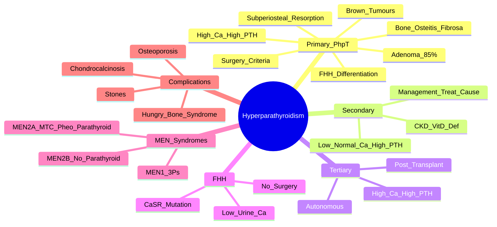

# Hyperparathyroidism and Bone

> [!tip] **FCPS/MRCP Priority: HIGH**
> **Primary Hyperparathyroidism (PHPT)** = **high Ca + inappropriately high/normal PTH**. **Adenoma (85%)**. **Bone: osteitis fibrosa cystica, subperiosteal resorption (radial middle phalanges), brown tumours, osteoporosis.** **FHH: CaSR mutation, low urine Ca** — no surgery. **Cinacalcet** if not surgical candidate.

---

## Learning Objectives
By the end of this note you should be able to:
- [ ] Differentiate **primary, secondary, tertiary** hyperparathyroidism by biochemistry
- [ ] Apply **NIH surgical criteria** for PHPT
- [ ] Recognise **bone manifestations**: osteitis fibrosa cystica, subperiosteal resorption (radial middle phalanges), brown tumours
- [ ] Distinguish **PHPT from FHH** (Familial Hypocalciuric Hypercalcaemia) — **urine Ca <250mg/24h**
- [ ] Use **cinacalcet** for non-surgical candidates
- [ ] Screen for **MEN syndromes** (MEN1, MEN2A, MEN4)

---

## 1. Definition & Classification

| Type | Biochemistry | Mechanism | Common Causes |
|------|--------------|-----------|---------------|
| **Primary (PHPT)** | **High Ca, High/Inappropriate PTH** | Autonomous PTH secretion | **Adenoma (85%)**, Hyperplasia (15%), Carcinoma (<1%) |
| **Secondary** | **Low/Normal Ca, High PTH** | Response to chronic hypocalcaemia | **CKD** (most common), Vit D deficiency, Malabsorption |
| **Tertiary** | **High Ca, High PTH** | Autonomous PTH after long-standing secondary | **Post-renal transplant**, long-standing CKD |

---

## 2. Primary Hyperparathyroidism (PHPT) — **FCPS/MRCP Focus**

### Epidemiology
| Feature | Detail |
|---------|--------|
| **Incidence** | 20-30/100,000/year |
| **Prevalence** | 1-4/1000 (postmenopausal women highest) |
| **Peak Age** | 50-70 years |
| **Sex Ratio** | **F:M = 3:1** |
| **Genetics** | **MEN1 (15-20%)**, MEN2A, MEN4, isolated familial |

---

## 3. Clinical Features

### Asymptomatic (Majority)
- **Incidental hypercalcaemia** on routine bloods
- **"Stones, Bones, Abdominal Groans, Psychiatric Moans"** (classic symptomatic tetrad — now rare)

### Bone Manifestations — **High-Yield**
| Feature | Description |
|---------|-------------|
| **Osteitis Fibrosa Cystica** | **High-turnover bone disease** — subperiosteal resorption, brown tumours, pathological fractures |
| **Subperiosteal Resorption** | **Radial aspect of middle phalanges** — **pathognomonic X-ray sign** |
| **Brown Tumours** | **Giant cell lesions** — osteoclast-rich, not true malignancy; **regress after parathyroidectomy** |
| **Osteoporosis** | Cortical thinning > trabecular; **forearm (cortical) > spine (trabecular)** |
| **Chondrocalcinosis** | CPPD deposition — **pseudogout** association |

### Renal
- **Nephrolithiasis** (calcium phosphate/oxalate stones) — **20-25%**
- **Nephrocalcinosis** — cortical calcifications

### Neuromuscular/Psychiatric
- Fatigue, weakness, depression, cognitive impairment, constipation

---

## 3. Diagnosis & Investigations

### Biochemical Diagnosis (PHPT)
| Test | Finding |
|------|---------|
| **Corrected Calcium** | **High** (>2.6 mmol/L) |
| **PTH (Intact)** | **High or Inappropriately Normal** (should be suppressed) |
| **Phosphate** | **Low** (PTH phosphaturia) |
| **ALP** | High (if bone disease) |
| **25-OH Vit D** | Often low (consumed) — replete before surgery |
| **24h Urine Calcium** | **>250 mg/24h** (excludes FHH) |

> [!critical] **PHPT = High Ca + Inappropriately High/Normal PTH**
> - **Exclude FHH**: 24h urine Ca **<250 mg/24h** = FHH (CaSR mutation) — **NO surgery**

### Localisation (Pre-operative)
| Modality | Role |
|----------|------|
| **Sestamibi Scan** | **Gold standard** — localises adenoma |
| **4D-CT** | If sestamibi negative/equivocal |
| **Ultrasound** | Complementary; operator-dependent |

---

## 4. Differentiation: PHPT vs FHH vs Secondary vs Tertiary

| Feature | **PHPT** | **FHH** | **Secondary HPT** | **Tertiary HPT** |
|---------|----------|---------|-------------------|------------------|
| **Calcium** | High | High | Low/Normal | High |
| **PTH** | High/Inappropriately Normal | Normal/High | **High** (appropriate) | High (autonomous) |
| **Urine Ca (24h)** | **>250 mg** | **<250 mg** | Low | High |
| **Phosphate** | Low | Normal | Low/Normal | Low |
| **Genetics** | MEN1, MEN2A, MEN4 | **CaSR mutation** | CKD, Vit D def | Post-transplant |
| **Surgery** | **Yes (if criteria)** | **NO** | Treat cause | **Yes** |

> [!critical] **FHH = CaSR Mutation**
> - **Autosomal dominant**, high Ca, **normal PTH**, **low urine Ca (<250mg/24h)**
> - **NO surgery** — benign, asymptomatic
> - **Family screening** essential

---

## 5. Surgical Criteria (NIH Consensus)

| Criteria | Threshold |
|----------|-----------|
| **Age** | **<50 years** |
| **Calcium** | **>2.85 mmol/L** (>1 mg/dL above ULN) |
| **Bone** | **Osteoporosis** (T-score ≤-2.5) or **Fragility Fracture** |
| **Renal** | **Nephrolithiasis** or **Nephrocalcinosis** |
| **Age >50** | **End-organ damage** (stones, bone, renal) |

> [!important] **Asymptomatic PHPT**
> - If **NO surgical criteria** → **Monitor**: Ca, PTH, renal function, BMD annually; replete Vit D
> - **Cinacalcet** if not surgical candidate with symptomatic hypercalcaemia

---

## 6. Management

```mermaid
flowchart TD
    A[PHPT Diagnosis] --> B{Surgical Criteria Met?}
    B -->|Yes| C[**Parathyroidectomy**\n(Only Curative)\nSestamibi localisation]
    B -->|No| D[Monitor: Ca, PTH, BMD, Renal annually\nVit D Repletion\nCinacalcet if Symptomatic Hypercalcaemia]
    C --> E[Post-op: Monitor for Hungry Bone Syndrome\nHypocalcaemia (transient)\nRecheck PTH/Ca at 6 weeks]
    D --> F{Cinacalcet Indication?}
    F -->|Symptomatic Hypercalcaemia\nNot Surgical Candidate| G[Cinacalcet: CaSR Sensitiser\n↓ PTH, ↓ Ca]
```

### Cinacalcet (Calcimimetic)
| Parameter | Detail |
|-----------|--------|
| **Mechanism** | **Positive allosteric modulator of CaSR** → ↓ PTH, ↓ Ca |
| **Indication** | **Non-surgical candidates** with symptomatic hypercalcaemia; refractory PHPT |
| **Dose** | 30-180mg daily (titrate to Ca/PTH) |
| **Monitoring** | **Hypocalcaemia risk** — monitor Ca, PTH |

### Bone Protection
- **Bisphosphonates/Denosumab** for osteoporosis (if not surgical or post-op)
- **Cinacalcet** does not improve BMD — only controls Ca/PTH

---

## 6. Familial Syndromes

| Syndrome | Genes | Features | Hyperparathyroidism |
|----------|-------|----------|---------------------|
| **MEN1** | **MEN1** (menin) | **3 P's**: Parathyroid, Pituitary, Pancreas | **100%** (hyperplasia) |
| **MEN2A** | **RET** | Medullary Thyroid CA, Pheochromocytoma, **Parathyroid** | 10-20% (hyperplasia) |
| **MEN2B** | RET | MTC, Pheo, Mucosal neuromas — **No HPT** | No |
| **MEN4** | **CDKN1B** | MEN1-like | Hyperplasia |
| **FHH** | **CaSR** | High Ca, normal PTH, **low urine Ca** | Benign — no surgery |

---

## 7. FCPS/MRCP High-Yield Summary

| Topic | Key Points |
|-------|------------|
| **PHPT Diagnosis** | **High Ca + Inappropriately High/Normal PTH** (should be suppressed) |
| **Adenoma** | **85%** (solitary); Hyperplasia 15%; Carcinoma <1% |
| **Bone Signs** | **Subperiosteal resorption (radial middle phalanges)** — **classic**; Brown tumours (giant cell lesions); Osteoporosis (cortical > trabecular) |
| **NIH Surgical Criteria** | **Age <50, Ca >2.85, Osteoporosis/Fracture, Stones, >50 with organ damage** |
| **FHH** | **CaSR mutation**, **Urine Ca <250mg/24h**, **No surgery** |
| **Brown Tumours** | Giant cell lesions (osteoclast-rich) — **regress after parathyroidectomy** |
| **Cinacalcet** | **Calcimimetic** (CaSR sensitiser) → ↓ PTH, ↓ Ca; **if not surgical candidate** |
| **MEN1** | MEN1 gene; **Parathyroid, Pituitary, Pancreas** — 100% HPT (hyperplasia) |
| **Hungry Bone Syndrome** | **Post-parathyroidectomy** — rapid Ca/PO4 uptake → **prolonged hypocalcaemia** |

---

## 8. Viva Questions (MRCP PACES / FCPS)

| Question | Expected Answer |
|----------|----------------|
| "A 55yo woman has Ca 2.8, PTH 12 pmol/L (ULN 6.8), PO4 0.7, ALP 200. 24h urine Ca 300mg. Diagnosis?" | **Primary Hyperparathyroidism** — High Ca + Inappropriately High PTH + High urine Ca (>250mg) excludes FHH. |
| "What is the classic X-ray finding in PHPT bone disease?" | **Subperiosteal resorption of the radial aspect of the middle phalanges** — pathognomonic. |
| "What are the NIH criteria for parathyroidectomy in PHPT?" | Age <50, Ca >2.85 mmol/L, osteoporosis/fracture, renal stones, age >50 with organ damage. |
| "How do you distinguish PHPT from FHH?" | **24h urine Calcium**: **PHPT >250 mg/24h**, **FHH <250 mg/24h**. FHH = CaSR mutation, normal PTH, no surgery. |
| "What are brown tumours in PHPT?" | **Giant cell lesions** (osteoclast-rich) due to PTH-driven osteoclast activity — **regress after parathyroidectomy**. |
| "What is the management of asymptomatic PHPT not meeting surgical criteria?" | Monitor Ca, PTH, BMD, renal function annually; replete Vit D; avoid thiazides; **cinacalcet if symptomatic hypercalcaemia**. |
| "What is the role of cinacalcet in PHPT?" | **Calcimimetic** (CaSR sensitiser) → ↓ PTH, ↓ Ca; **for non-surgical candidates** with symptomatic hypercalcaemia. |
| "What is Hungry Bone Syndrome?" | **Post-parathyroidectomy** — rapid mineralisation → **prolonged hypocalcaemia, hypophosphataemia** — IV Ca, PO4, calcitriol. |
| "What are the MEN syndromes with hyperparathyroidism?" | **MEN1** (100% HPT, hyperplasia), **MEN2A** (10-20% HPT), **MEN4** (HPT). **MEN2B = NO HPT**. |

---

## 9. Confusions & Mnemonics

| Confusion | Clarification |
|-----------|---------------|
| **PHPT vs FHH** | **Urine Ca is key**: PHPT **>250mg/24h**, FHH **<250mg/24h**. FHH = CaSR mutation, benign, no surgery. |
| **Secondary vs Tertiary HPT** | Secondary = **Low Ca, High PTH** (CKD). Tertiary = **High Ca, High PTH** (autonomous after long-standing secondary). |
| **Brown Tumour vs Malignancy** | Brown tumour = **giant cell lesion from PTH**, **regresses after parathyroidectomy**. Not cancer. |
| **Hungry Bone Syndrome** | **Post-op hypocalcaemia** due to rapid bone mineralisation — needs IV Ca, calcitriol, PO4. |
| **Cinacalcet in PHPT** | **Non-surgical candidates only** — calcimimetic (CaSR sensitiser) → ↓ PTH, ↓ Ca. |
| **Subperiosteal Resorption** | **Radial aspect of middle phalanges** — **specific for PHPT**. |

**Mnemonic: PHPT = "HIGH Ca, HIGH PTH"**
- **H**igh Calcium
- **I**nappropriately
- **G**H (PTH)
- **H**ypercalcaemia

**Mnemonic: NIH Criteria = "A-C-B-R-A"**
- **A**ge <50
- **C**alcium >2.85
- **B**one (osteoporosis/fracture)
- **R**enal stones
- **A**ge >50 with organ damage

**Mnemonic: FHH = "LOW URINE CA"**
- **L**ow **U**rine **C**a (<250mg/24h)
- **CaSR** mutation
- **No Surgery**

**Mnemonic: Bone Signs = "SUB-BROWN-OST"**
- **SUB**periosteal resorption (radial middle phalanges)
- **BROWN** tumours (giant cell)
- **OST**eoporosis (cortical thinning)

**Mnemonic: MEN Syndromes = "MEN1 = 3Ps, MEN2A = MTC+PHEO+Parathyroid"**
- **MEN1** = Parathyroid, **P**ituitary, **P**ancreas (**3 P's**)
- **MEN2A** = **M**edullary **Thyroid** CA, **P**heochromocytoma, **Parathyroid**
- **MEN2B** = **NO Parathyroid** (MTC, Pheo, Mucosal neuromas)

---

## 10. Mind Map



---

## 11. One-Page Revision Card

| Domain | Key Points |
|--------|------------|
| **PHPT** | **High Ca + Inappropriately High/Normal PTH** (should be suppressed) |
| **Adenoma** | 85% of PHPT; solitary; localise with sestamibi |
| **Bone** | **Subperiosteal resorption (radial middle phalanges)**, brown tumours, osteoporosis, chondrocalcinosis |
| **Surgery** | **NIH criteria**: age <50, Ca>2.85, osteoporosis/fracture, stones, >50 with organ damage |
| **FHH** | CaSR mutation, **Urine Ca <250mg**, normal PTH, **NO surgery** |
| **Brown Tumours** | Giant cell lesions (osteoclast-driven) — **regress after parathyroidectomy** |
| **Cinacalcet** | Calcimimetic (CaSR sensitiser) → ↓ PTH, ↓ Ca; **non-surgical candidates** |
| **Hungry Bone** | Post-parathyroidectomy — rapid mineralisation → **hypocalcaemia** (IV Ca, calcitriol) |
| **MEN1** | 3 P's (Parathyroid, Pituitary, Pancreas) — 100% HPT (hyperplasia) |
| **MEN2A** | MTC, Pheo, Parathyroid (10-20% HPT) |

---

## 12. Spaced Repetition Trackers

| Review Interval | Date Completed | Confidence (1-5) | Notes |
|-----------------|----------------|------------------|-------|
| 24 hours | | | |
| 7 days | | | |
| 15 days | | | |
| 30 days | | | |
| 90 days | | | |

---

## 13. Self-Test Scorecard

| Section | Score /5 | Last Attempt |
|---------|----------|--------------|
| PHPT vs FHH Differentiation | | |
| NIH Surgical Criteria | | |
| Bone Manifestations | | |
| Brown Tumours | | |
| MEN Syndromes | | |
| Cinacalcet Role | | |
| Viva Questions | | |

---

## Local Navigation
- **Parent Heading**: [[../Bone Metabolic Diseases|Bone Metabolic Diseases]]
- **Parent Topic Group**: [[Bone metabolic disorders]]
- **Chapter Map**: [[../Davidson Chapter 26 - Rheumatology Hierarchy|Rheumatology Hierarchy]]
- **Chapter MOC**: [[../Rheumatology MOC|Rheumatology MOC]]
- **Drug Reference**: [[../../Clinical Approach to Musculoskeletal Disease/Drugs in rheumatology|Drugs in rheumatology]]
- **Related**: [[Osteoporosis]] · [[Renal osteodystrophy]] · [[Osteomalacia and rickets]]
---

> Auto-generated study sections for "Bone Metabolic Diseases" — Ch 25: Rheumatology & Bone Disease.

## Flashcards (38 generated)

- Q: What is the definition of Bone Metabolic Diseases?
  A: Primary Hyperparathyroidism (PHPT) = high Ca + inappropriately high/normal PTH.
- Q: What is Osteitis Fibrosa Cystica of Bone Metabolic Diseases?
  A: High-turnover bone disease — subperiosteal resorption, brown tumours, pathological fractures
- Q: What is Subperiosteal Resorption of Bone Metabolic Diseases?
  A: Radial aspect of middle phalanges — pathognomonic X-ray sign
- Q: What is Brown Tumours of Bone Metabolic Diseases?
  A: Giant cell lesions — osteoclast-rich, not true malignancy; regress after parathyroidectomy
- Q: What is Osteoporosis of Bone Metabolic Diseases?
  A: Cortical thinning > trabecular; forearm (cortical) > spine (trabecular)
- Q: What is Chondrocalcinosis of Bone Metabolic Diseases?
  A: CPPD deposition — pseudogout association
- Q: What is Corrected Calcium of Bone Metabolic Diseases?
  A: High (>2.6 mmol/L)
- Q: What is PTH (Intact) of Bone Metabolic Diseases?
  A: High or Inappropriately Normal (should be suppressed)
- Q: What is Phosphate of Bone Metabolic Diseases?
  A: Low (PTH phosphaturia)
- Q: What is ALP of Bone Metabolic Diseases?
  A: High (if bone disease)
- Q: What is 25-OH Vit D of Bone Metabolic Diseases?
  A: Often low (consumed) — replete before surgery
- Q: What is 24h Urine Calcium of Bone Metabolic Diseases?
  A: >250 mg/24h (excludes FHH)
- Q: What is the mechanism of Bone Metabolic Diseases?
  A: Positive allosteric modulator of CaSR → ↓ PTH, ↓ Ca
- Q: What is Bone Metabolic Diseases indicated for?
  A: Non-surgical candidates with symptomatic hypercalcaemia; refractory PHPT
- Q: What is the dose of Bone Metabolic Diseases?
  A: 30-180mg daily (titrate to Ca/PTH)
- Q: How is Bone Metabolic Diseases monitored?
  A: Hypocalcaemia risk — monitor Ca, PTH
- Q: What is Osteitis Fibrosa Cystica of Bone Metabolic Diseases?
  A: High-turnover bone disease — subperiosteal resorption, brown tumours, pathological fractures
- Q: What is Subperiosteal Resorption of Bone Metabolic Diseases?
  A: Radial aspect of middle phalanges — pathognomonic X-ray sign
- Q: What is Brown Tumours of Bone Metabolic Diseases?
  A: Giant cell lesions — osteoclast-rich, not true malignancy; regress after parathyroidectomy
- Q: What is Osteoporosis of Bone Metabolic Diseases?
  A: Cortical thinning > trabecular; forearm (cortical) > spine (trabecular)
- Q: What is Corrected Calcium of Bone Metabolic Diseases?
  A: High (>2.6 mmol/L)
- Q: What is PTH (Intact) of Bone Metabolic Diseases?
  A: High or Inappropriately Normal (should be suppressed)
- Q: What is Phosphate of Bone Metabolic Diseases?
  A: Low (PTH phosphaturia)
- Q: What is ALP of Bone Metabolic Diseases?
  A: High (if bone disease)
- Q: What is 25-OH Vit D of Bone Metabolic Diseases?
  A: Often low (consumed) — replete before surgery
- Q: What is 24h Urine Calcium of Bone Metabolic Diseases?
  A: >250 mg/24h (excludes FHH)
- Q: What is the mechanism of Bone Metabolic Diseases?
  A: Positive allosteric modulator of CaSR → ↓ PTH, ↓ Ca
- Q: What is Bone Metabolic Diseases indicated for?
  A: Non-surgical candidates with symptomatic hypercalcaemia; refractory PHPT
- Q: What is the dose of Bone Metabolic Diseases?
  A: 30-180mg daily (titrate to Ca/PTH)
- Q: What is the investigation of choice for Bone Metabolic Diseases?
  A: High Ca + Inappropriately High/Normal PTH (should be suppressed)
- Q: What is Adenoma of Bone Metabolic Diseases?
  A: 85% (solitary); Hyperplasia 15%; Carcinoma <1%
- Q: What is Bone Signs of Bone Metabolic Diseases?
  A: Subperiosteal resorption (radial middle phalanges) — classic; Brown tumours (giant cell lesions); Osteoporosis (cortical > trabecular)
- Q: What is NIH Surgical Criteria of Bone Metabolic Diseases?
  A: Age <50, Ca >2.85, Osteoporosis/Fracture, Stones, >50 with organ damage
- Q: What is FHH of Bone Metabolic Diseases?
  A: CaSR mutation, Urine Ca <250mg/24h, No surgery
- Q: What is Brown Tumours of Bone Metabolic Diseases?
  A: Giant cell lesions (osteoclast-rich) — regress after parathyroidectomy
- Q: What is Cinacalcet of Bone Metabolic Diseases?
  A: Calcimimetic (CaSR sensitiser) → ↓ PTH, ↓ Ca; if not surgical candidate
- Q: What is MEN1 of Bone Metabolic Diseases?
  A: MEN1 gene; Parathyroid, Pituitary, Pancreas — 100% HPT (hyperplasia)
- Q: What is Hungry Bone Syndrome of Bone Metabolic Diseases?
  A: Post-parathyroidectomy — rapid Ca/PO4 uptake → prolonged hypocalcaemia

## MCQs (1 generated)

1. **Which of the following best describes Bone Metabolic Diseases?**
   A. **Primary Hyperparathyroidism (PHPT) = high Ca + inappropriately high/normal PTH.**
   B. An unrelated condition not matching the clinical picture of Bone Metabolic Diseases
   C. A complication seen late in the disease course of Bone Metabolic Diseases
   D. A condition that mimics Bone Metabolic Diseases but has a different underlying cause

## SBA Questions (1 generated)

1. A patient with suspected Bone Metabolic Diseases presents with: Primary (PHPT) — High Ca, High/Inappropriate PTH; Secondary — Low/Normal Ca, High PTH; Tertiary — High Ca, High PTH. What is the most likely diagnosis?
   A. **Bone Metabolic Diseases**
   B. A condition that mimics Bone Metabolic Diseases but is not the same entity
   C. A complication of Bone Metabolic Diseases rather than the primary diagnosis
   D. An unrelated condition in the same clinical category as Bone Metabolic Diseases

## PasTest Scenario SBAs (Clinical Vignettes)

> **Auto-generated PasTest/Mediscope-style scenario SBAs** grounded in the authored source. Each scenario tests a real clinical fact (triad, specific sign, contraindication, trial, first-line Rx) extracted from the topic. *Source: Ch 25: Rheumatology — Hyperparathyroidism and bone*

**Q1.** Which of the following features is most specific or characteristic of Hyperparathyroidism and bone?

  - **A.** Subperiosteal Resorption
  - **B.** A feature common to many acute inflammatory conditions
  - **C.** A non-specific sign that does not localise the diagnosis
  - **D.** An investigation finding rather than a clinical feature

  > **Answer: A** — Subperiosteal Resorption
  >
  > *Source:* *High-turnover bone disease** — subperiosteal resorption, brown tumours, pathological fractures |
| **Subperiosteal Resorption** | **Radial aspect of middle phalanges** — **pathognomonic X-ray sign** 

**Q2.** What is the most appropriate first-line therapy for Hyperparathyroidism and bone?

  - **A.** Indication + Non-surgical candidates
  - **B.** An advanced/surgical therapy reserved for refractory disease
  - **C.** Symptomatic treatment only, no disease-modifying therapy
  - **D.** Empiric broad-spectrum therapy without specific indication

  > **Answer: A** — Indication + Non-surgical candidates
  >
  > *Source:* **Indication**   **Non-surgical candidates** with symptomatic hypercalcaemia; refractory PHPT

