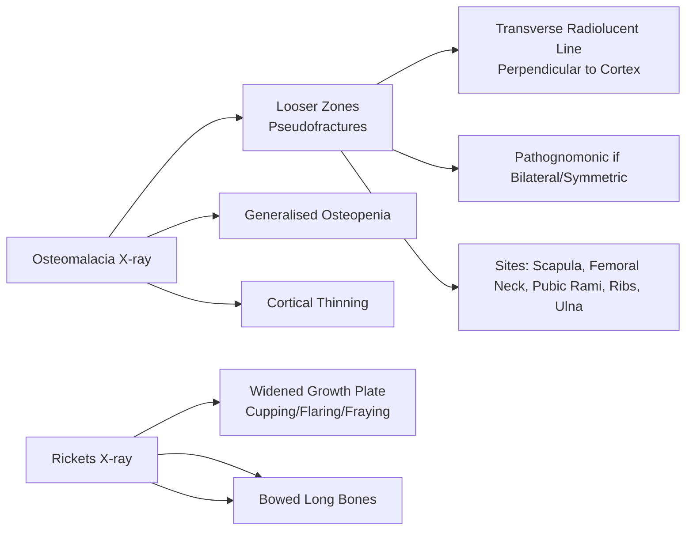
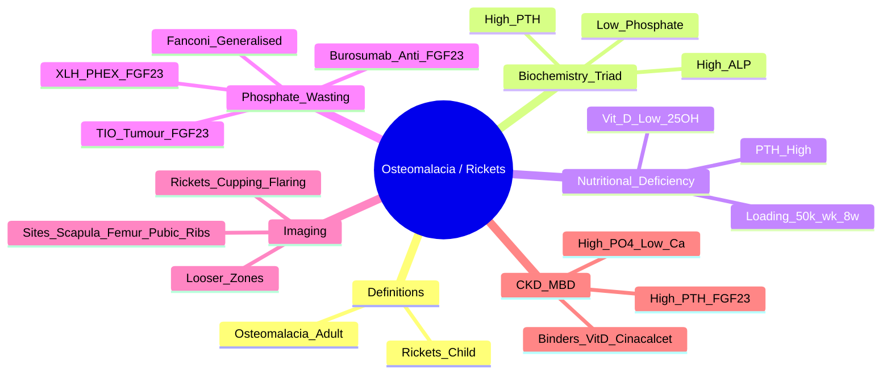

# Osteomalacia & Rickets

> [!tip] **FCPS/MRCP Priority: HIGH**
> **Osteomalacia** (adults) = **defective mineralisation of osteoid**. **Rickets** (children) = **defective mineralisation of growth plate**. **Biochemistry**: **Low phosphate, High ALP, High PTH, Low 25-OH Vit D** (nutritional). **Looser zones** = pathognomonic pseudofractures. Screen for XLH, tumour-induced, renal causes.

---

## Learning Objectives
By the end of this note you should be able to:
- [ ] Distinguish osteomalacia (adult) from rickets (child) based on growth plate status
- [ ] Interpret diagnostic biochemistry (Low PO₄, High ALP, High PTH, Low Vit D)
- [ ] Recognise Looser zones (pseudofractures) on imaging
- [ ] Differentiate nutritional vitamin D deficiency from renal phosphate wasting (XLH, tumour-induced, Fanconi)
- [ ] Apply appropriate replacement therapy (Vit D loading, phosphate ± alfacalcidol, burosumab for XLH)
- [ ] Identify renal osteodystrophy (CKD-MBD) pattern

---

## 1. Definition & Epidemiology

| Feature | **Osteomalacia** | **Rickets** |
|---------|------------------|-------------|
| **Definition** | Defective mineralisation of **osteoid** in **adults** (growth plates fused) | Defective mineralisation of **growth plate cartilage** in **children** |
| **Age** | Adults (>18-20y, plates fused) | Children (<18y, plates open) |
| **Key Defect** | Accumulation of **unmineralised osteoid** | Disordered **growth plate** (hypertrophic zone widening) |
| **Prevalence** | High in South Asian, Middle Eastern, African populations in UK; veiled women, elderly housebound | Common in high-risk groups (dark skin, prolonged breastfeeding without supplementation, malnutrition) |

---

## 2. Aetiology — **Nutritional vs Phosphate Wasting**

```mermaid
flowchart TD
    A[Defective Mineralisation] --> B{Nutritional Deficiency}
    B -->|Vitamin D Deficiency| C[↓ Sunlight, Malabsorption\nLiver/Kidney Disease\nAnticonvulsants, Vegans]
    B -->|Calcium Deficiency| D[Low Intake, High Phytate Diet]
    B -->|Phosphate Deficiency| E[Renal Phosphate Wasting]
    E --> E1[X-Linked Hypophosphataemia (XLH)\nPHEX mutation → FGF23 excess]
    E2[Tumour-Induced Osteomalacia\nPhosphaturic Mesenchymal Tumour]
    E3[Fanconi Syndrome\nGeneralised Proximal Tubulopathy]
    E4[Drug-Induced\nTenofovir, Ifosfamide, Aminoglycosides]
```

### Vitamin D Metabolism Pathway
```
Sunlight (UVB) → Skin: 7-dehydrocholesterol → Pre-vit D3 → Vit D3 (Cholecalciferol)
                    ↓
Diet: Vit D2 (Ergocalciferol) / Vit D3
                    ↓
Liver: 25-hydroxylase → **25-OH Vit D (Calcidiol)** → **MAJOR CIRCULATING FORM**
                    ↓
Kidney: 1α-hydroxylase (PTH stimulated) → **1,25-(OH)2 Vit D (Calcitriol)** → **ACTIVE HORMONE**
                    ↓
Intestine: ↑ Ca²⁺ & PO₄ absorption → Mineralisation
```

---

## 3. Biochemistry — **Diagnostic Pattern**

| Parameter | **Nutritional Vit D Deficiency** | **Renal Phosphate Wasting (XLH, TIO)** | **Renal Osteodystrophy (CKD-MBD)** |
|-----------|----------------------------------|----------------------------------------|------------------------------------|
| **Calcium** | Low / Normal | Normal | Low / Normal |
| **Phosphate (PO₄)** | **Low** | **Low** | **High** |
| **ALP** | **High** (bone isoform) | **High** | **High** |
| **PTH** | **High** (2° hyperparathyroidism) | Normal / Mildly ↑ | **High** (2°/3° HPT) |
| **25-OH Vit D** | **Low** (<30 nmol/L deficient) | **Normal** | Low / Normal |
| **1,25-(OH)2 Vit D** | Normal / Low (substrate limited) | **High** (FGF23 not suppressing 1α-hydroxylase) | **Low** (↓1α-hydroxylase, ↑FGF23) |
| **FGF23** | Normal | **High** (XLH, TIO) | **High** |
| **Urinary Phosphate** | Low (appropriate retention) | **High** (inappropriate wasting) | Variable |

> [!critical] **Key Biochemical Triad for Osteomalacia/Rickets**
> 1. **Low Phosphate**
> 2. **High ALP** (bone isoform)
> 3. **High PTH** (secondary)

> [!important] **Distinguish Nutritional vs Phosphate Wasting**
> - **Low 25-OH Vit D** → **Nutritional deficiency** (treat with Vit D)
> - **Normal 25-OH Vit D + Low PO₄ + High ALP** → **Renal phosphate wasting** (XLH, TIO, Fanconi) — **measure FGF23**

---

## 4. Clinical Features

### Osteomalacia (Adults)
| Feature | Description |
|---------|-------------|
| **Bone Pain** | **Dull, aching**, lower back, pelvis, ribs, thighs — worse on weight-bearing |
| **Proximal Myopathy** | **Waddling gait**, difficulty climbing stairs, rising from chair (osteomalacic myopathy) |
| **Looser Zones (Pseudofractures)** | **Pathognomonic** — transverse radiolucent lines perpendicular to cortex |
| **Fractures** | Minimal trauma, multiple |
| **Bone Tenderness** | Specific sites: ribs, pelvis, scapulae |

### Rickets (Children)
| Feature | Description |
|---------|-------------|
| **Delayed Walking** | Motor milestone delay |
| **Bowed Legs** | **Genu varum** (weight-bearing) or **genu valgum** |
| **Widened Wrists/Ankles** | **Cupping, flaring, fraying** of metaphyses (growth plate) |
| **Rachitic Rosary** | Costochondral junction beading |
| **Craniotabes** | Softening of skull bones (ping-pong ball) |
| **Delayed Dentition** | Enamel defects |
| **Harrison's Groove** | Diaphragmatic pull on softened ribs |

---

## 5. Imaging — **Looser Zones**



| Finding | Significance |
|---------|--------------|
| **Looser Zones** | **Transverse radiolucent lines** perpendicular to cortex — **pseudofractures**; **bilateral/symmetric = pathognomonic** |
| **Sites** | **Scapula (axillary border), Femoral neck (medial), Pubic rami, Ribs, Ulna (medial)** |
| **Rickets: Growth Plate** | **Widening, cupping, flaring, fraying** of metaphyses (wrist, knee, ankle) |

> [!warning] **Looser Zones = Pseudofractures**
> - **Not true fractures** — represent insufficiency fractures through unmineralised osteoid
> - **Heal with sclerosis** after treatment (become visible as sclerotic lines)

---

## 6. Specific Causes — **Exam Favourites**

### X-Linked Hypophosphataemia (XLH)
| Feature | Detail |
|---------|--------|
| **Genetics** | **PHEX mutation** (X-linked dominant) → ↓ PHEX → **↑ FGF23** |
| **Pathophysiology** | FGF23 excess → ↓ renal phosphate reabsorption (NaPi-IIa/IIc) + ↓ 1α-hydroxylase → **phosphate wasting + low 1,25 Vit D** |
| **Biochemistry** | Low PO₄, **Normal 25-OH Vit D**, High ALP, High FGF23, Normal/low PTH |
| **Inheritance** | X-linked dominant — males more severely affected |
| **Treatment** | **Burosumab (anti-FGF23 mAb)** — newest, superior; **Conventional**: Phosphate supplements + Alfacalcidol (1α-OH Vit D) |

### Tumour-Induced Osteomalacia (TIO)
| Feature | Detail |
|---------|--------|
| **Cause** | **Phosphaturic mesenchymal tumour** (usually benign, sinonasal, extremity, bone) → **secretes FGF23** |
| **Presentation** | Adults: bone pain, fractures, myopathy; **normal 25-OH Vit D** |
| **Diagnosis** | **High FGF23**, low PO₄, high ALP; **tumour localisation**: FDG-PET, Octreotide scan, MRI, venous sampling |
| **Treatment** | **Surgical resection = cure** (FGF23 normalises); medical bridge (phosphate + alfacalcidol) |

### Fanconi Syndrome
| Feature | Detail |
|---------|--------|
| **Defect** | **Generalised proximal tubular dysfunction** → glycosuria, aminoaciduria, phosphaturia, bicarbonaturia (proximal RTA), uric acid wasting |
| **Causes** | **Genetic** (cystinosis, Wilson's, Lowe), **Drugs** (tenofovir, ifosfamide, aminoglycosides, outdated tetracycline), **Myeloma**, **Amyloidosis** |
| **Biochemistry** | **Low PO₄, Low bicarbonate, Glycosuria (normal blood glucose), Aminoaciduria** |

---

## 7. Renal Osteodystrophy (CKD-MBD) — **FCPS/MRCP Essential**

| Stage | Biochemistry |
|-------|--------------|
| **CKD 3-4** | ↓ 1,25 Vit D → ↓ Ca → ↑ PTH (2° HPT) → ↑ FGF23 → ↓ PO₄ retention |
| **CKD 5 / ESRD** | **High PO₄**, **Low Ca**, **High PTH** (3° HPT), **High ALP**, **High FGF23**, Low 1,25 Vit D |

| Bone Histology | Turnover | PTH Level |
|----------------|----------|-----------|
| **High Turnover** (Osteitis Fibrosa) | High | **High** (2°/3° HPT) |
| **Low Turnover** (Adynamic Bone) | Low | **Low** (over-suppressed PTH) |
| **Mixed** | Mixed | Variable |
| **Osteomalacia** | Low (if aluminium) | Low/Normal |

> [!important] **CKD-MBD Management**
> - **Phosphate binders** (Ca-based, sevelamer, sucroferric oxyhydroxide) with meals
> - **Vitamin D analogues** (Alfacalcidol, Paricalcitol) — suppress PTH
> - **Calcimimetic** (Cinacalcet) — if PTH refractory, Ca×PO₄ controlled
> - **Target PTH**: 2-9x ULN (KDIGO) — not normalise

---

## 8. Management

### Nutritional Vitamin D Deficiency (Most Common)
| Phase | Regimen |
|-------|---------|
| **Loading (Adults)** | **Cholecalciferol 50,000 IU (1.25mg) weekly ×8 weeks** OR **300,000 IU IM single dose** (if malabsorption) |
| **Loading (Children)** | **Cholecalciferol 10,000-25,000 IU daily ×4-8 weeks** (age-dependent) |
| **Maintenance** | **Cholecalciferol 800-2000 IU daily** (or 20,000 IU monthly) |
| **Calcium** | **1g elemental Ca daily** (diet + supplement) — essential for mineralisation |

### Renal Phosphate Wasting (XLH, TIO, Fanconi)
| Condition | Treatment |
|-----------|-----------|
| **XLH** | **Burosumab (anti-FGF23)** SC q2wk (children) / q4wk (adults) — **1st line**; Conventional: Phosphate 30-60mg/kg/day ÷3-5 doses + Alfacalcidol 20-50ng/kg/day |
| **TIO** | **Tumour resection = cure**; Bridge: Phosphate + Alfacalcidol |
| **Fanconi** | Treat underlying cause; bicarbonate, phosphate, potassium replacement |

### Renal Osteodystrophy (CKD-MBD)
| Agent | Indication |
|-------|------------|
| **Phosphate Binders** | With meals: Ca-carbonate/acetate, Sevelamer, Sucroferric oxyhydroxide |
| **Vit D Analogues** | Alfacalcidol, Paricalcitol — suppress PTH |
| **Calcimimetic** | Cinacalcet — if PTH refractory despite binders + Vit D |
| **Target PTH** | **2-9x ULN** (KDIGO) — avoid over-suppression (adynamic bone) |

---

## 9. FCPS/MRCP High-Yield Summary

| Topic | Key Points |
|-------|------------|
| **Definition** | Osteomalacia = adult defective osteoid mineralisation; Rickets = child defective growth plate mineralisation |
| **Biochemistry** | **Low PO₄, High ALP, High PTH** + Low 25-OH Vit D (nutritional) OR Normal 25-OH Vit D + High FGF23 (phosphate wasting) |
| **Looser Zones** | **Transverse radiolucent lines perpendicular to cortex** — scapula, femoral neck, pubic rami, ribs — **pathognomonic** |
| **Rickets Signs** | Bowed legs (genu varum), widened wrists/ankles (cupping/flaring), rachitic rosary, craniotabes |
| **Nutritional Vit D Deficiency** | Low 25-OH Vit D, High PTH, Low PO₄, High ALP → **Loading: 50,000 IU weekly ×8wk** |
| **XLH** | **PHEX mutation → FGF23 excess** → phosphate wasting; Normal 25-OH Vit D; **Burosumab (anti-FGF23)** 1st line |
| **Tumour-Induced Osteomalacia** | Mesenchymal tumour → FGF23 → phosphate wasting; **Resect tumour = cure** |
| **Fanconi Syndrome** | Proximal tubulopathy: phosphaturia + glycosuria + aminoaciduria + bicarbonate wasting |
| **CKD-MBD** | High PO₄, Low Ca, High PTH, High FGF23, Low 1,25 Vit D → Binders, Vit D analogues, Cinacalcet |

---

## 10. Viva Questions (MRCP PACES / FCPS)

| Question | Expected Answer |
|----------|----------------|
| "What is the biochemical hallmark of osteomalacia?" | **Low phosphate, High ALP, High PTH** — plus low 25-OH Vit D (nutritional) or normal 25-OH Vit D + high FGF23 (phosphate wasting). |
| "How do you distinguish nutritional vitamin D deficiency from XLH?" | Nutritional: **Low 25-OH Vit D, High PTH**. XLH: **Normal 25-OH Vit D, High FGF23, Low phosphate, High ALP, Normal/mildly raised PTH**. |
| "What are Looser zones and where are they found?" | **Transverse radiolucent lines perpendicular to cortex** (pseudofractures). Sites: **scapula (axillary border), femoral neck (medial), pubic rami, ribs, ulna (medial)**. Pathognomonic if bilateral/symmetric. |
| "A 30yo man has bone pain, low phosphate, normal 25-OH Vit D, high ALP, high FGF23. Diagnosis?" | **X-Linked Hypophosphataemia (XLH)** — PHEX mutation. Treatment: **Burosumab (anti-FGF23)** or conventional phosphate + alfacalcidol. |
| "What is tumour-induced osteomalacia and how is it treated?" | **Phosphaturic mesenchymal tumour** secretes FGF23 → phosphate wasting. Localise with FDG-PET/octreotide/MRI. **Surgical resection = cure**. |
| "Describe the biochemistry of renal osteodystrophy (CKD-MBD)." | **High phosphate, Low calcium, High PTH (3° HPT), High ALP, High FGF23, Low 1,25 Vit D**. Target PTH 2-9x ULN. |
| "A child has bowed legs, widened wrists, rachitic rosary. Biochemistry?" | **Low phosphate, High ALP, High PTH, Low 25-OH Vit D** (nutritional rickets). Treat with Vit D loading + Calcium. |
| "What is the loading dose for vitamin D deficiency in adults?" | **Cholecalciferol 50,000 IU weekly ×8 weeks** (or 300,000 IU IM single dose if malabsorption). |

---

## 11. Confusions & Mnemonics

| Confusion | Clarification |
|-----------|---------------|
| **Osteomalacia vs Osteoporosis** | Osteomalacia = **defective mineralisation** (soft bones, Looser zones, low PO₄, high ALP). Osteoporosis = **low bone mass** (fragile bones, normal PO₄/ALP, normal PTH, T-score ≤-2.5). |
| **Rickets vs Blount Disease** | Rickets = **bilateral**, metaphyseal cupping/flaring, biochemical abnormalities. Blount = **unilateral/often**, tibia vara, normal biochemistry. |
| **XLH vs Nutritional Vit D Deficiency** | XLH = **Normal 25-OH Vit D**, **High FGF23**, phosphate wasting. Nutritional = **Low 25-OH Vit D**, **High PTH**. |
| **Fanconi vs Isolated Phosphate Wasting** | Fanconi = **generalised proximal tubulopathy** (glycosuria, aminoaciduria, bicarbonaturia, uric acid wasting). Isolated = only phosphate wasting. |
| **Looser Zones vs True Fractures** | Looser zones = **pseudofractures** (transverse, perpendicular to cortex, bilateral symmetric). True fractures = cortical breach, usually unilateral, traumatic. |

**Mnemonic: Osteomalacia Biochem = "LOW PO₄, HIGH ALP, HIGH PTH"**
- **L**ow **P**hosphate
- **H**igh **A**LP
- **H**igh **P**TH

**Mnemonic: Looser Zones Sites = "S-F-P-R-U"**
- **S**capula (axillary border)
- **F**emoral neck (medial)
- **P**ubic rami
- **R**ibs
- **U**lna (medial)

**Mnemonic: Rickets Signs = "B-W-R-C-H"**
- **B**owed legs (genu varum)
- **W**idened wrists/ankles (cupping/flaring)
- **R**achitic rosary
- **C**raniotabes
- **H**arrison's groove

**Mnemonic: XLH = "PHEX → FGF23 ↑ → PO₄ WASTING"**
- **PHEX** mutation → **FGF23 excess** → renal phosphate wasting + ↓1α-hydroxylase

**Mnemonic: TIO = "TUMOUR → FGF23 → RES..."**
- **TUMOUR** (phosphaturic mesenchymal) → **FGF23** → **RES**ection = cure

**Mnemonic: Fanconi = "G-A-B-P"**
- **G**lycosuria (normal blood glucose)
- **A**minoaciduria
- **B**icarbonate wasting (proximal RTA)
- **P**hosphaturia

---

## 12. Mind Map



---

## 13. One-Page Revision Card

| Domain | Key Points |
|--------|------------|
| **Osteomalacia vs Rickets** | Adult (osteoid) vs Child (growth plate) |
| **Biochem Triad** | **Low PO₄, High ALP, High PTH** |
| **Nutritional Vit D Def** | Low 25-OH Vit D → loading 50k IU weekly ×8wk |
| **Looser Zones** | Transverse radiolucent lines ⟂ cortex — scapula, femoral neck, pubic rami, ribs — **pathognomonic** |
| **Rickets Signs** | Bowed legs, widened wrists/ankles, rachitic rosary, craniotabes |
| **XLH** | PHEX → FGF23↑ → phosphate wasting; Normal 25-OH Vit D; **Burosumab** 1st line |
| **TIO** | Mesenchymal tumour → FGF23 → **resection = cure** |
| **Fanconi** | Glycosuria + Aminoaciduria + Bicarbonate wasting + Phosphaturia |
| **CKD-MBD** | High PO₄, Low Ca, High PTH, High FGF23, Low 1,25 Vit D → Binders, Vit D analogues, Cinacalcet |

---

## 14. Spaced Repetition Trackers

| Review Interval | Date Completed | Confidence (1-5) | Notes |
|-----------------|----------------|------------------|-------|
| 24 hours | | | |
| 7 days | | | |
| 15 days | | | |
| 30 days | | | |
| 90 days | | | |

---

## 15. Self-Test Scorecard

| Section | Score /5 | Last Attempt |
|---------|----------|--------------|
| Biochemical Interpretation | | |
| Looser Zones Recognition | | |
| Nutritional vs XLH vs TIO | | |
| Rickets Clinical Features | | |
| CKD-MBD Pattern | | |
| Treatment Selection | | |
| Viva Questions | | |

---

## Local Navigation
- **Parent Heading**: [[../Bone Metabolic Diseases|Bone Metabolic Diseases]]
- **Parent Topic Group**: [[Bone metabolic disorders]]
- **Chapter Map**: [[../Davidson Chapter 26 - Rheumatology Hierarchy|Rheumatology Hierarchy]]
- **Chapter MOC**: [[../Rheumatology MOC|Rheumatology MOC]]
- **Drug Reference**: [[../../Clinical Approach to Musculoskeletal Disease/Drugs in rheumatology|Drugs in rheumatology]]
- **Related**: [[Osteoporosis]] · [[Renal osteodystrophy]] · [[Paget's disease of bone]]