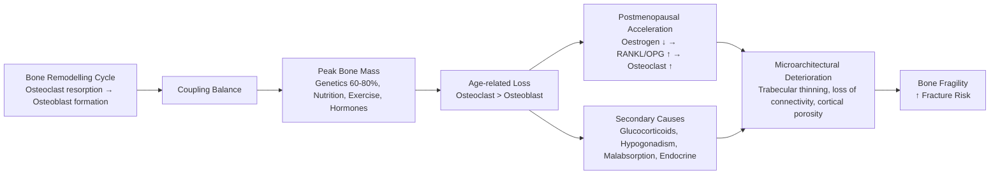
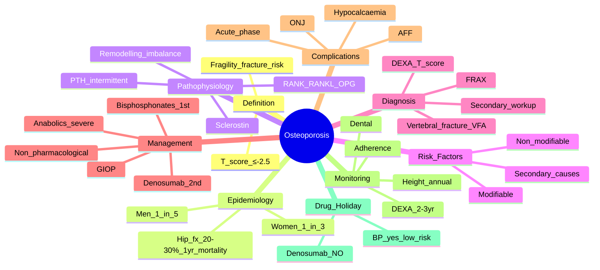

# Osteoporosis

> [!tip] **FCPS/MRCP Priority: CRITICAL**
> Osteoporosis = **fragility fracture risk**. DEXA T-score diagnosis, FRAX risk assessment, bisphosphonate 1st line, denosumab 2nd line, anabolics for severe. Guaranteed SBA/viva topic with drug monitoring nuances.

---

## Learning Objectives
By the end of this note you should be able to:
- [ ] Diagnose osteoporosis using DEXA T-scores and apply FRAX for fracture risk
- [ ] Identify secondary causes and appropriate investigations
- [ ] Select and monitor osteoporosis therapy (bisphosphonates, denosumab, anabolics)
- [ ] Manage glucocorticoid-induced osteoporosis (GIOP)
- [ ] Recognise and manage treatment complications (ONJ, atypical femoral fracture, hypocalcaemia)
- [ ] Counsel on lifestyle, falls prevention, and treatment holidays

---

## 1. Definition & Epidemiology

| Feature | Detail |
|---------|--------|
| **Definition** | **Systemic skeletal disease** — low bone mass + microarchitectural deterioration → **bone fragility** + **increased fracture risk** |
| **Prevalence** | **Women >50y: 1 in 3**; **Men >50y: 1 in 5** will sustain osteoporotic fracture |
| **Incidence** | Increases exponentially with age |
| **Peak Bone Mass** | Achieved **age 25-30** — critical window for prevention |
| **Postmenopausal Loss** | **Rapid: 2-3%/year × 5-7 years** (oestrogen loss) → then slow 0.5-1%/year |
| **Male Loss** | Gradual from ~40y; accelerated with hypogonadism |
| **Mortality** | **Hip fracture: 20-30% 1-year mortality**; vertebral fracture: ↑ mortality, ↓ QoL |

---

## 2. Pathophysiology



### Key Molecular Pathways
| Pathway | Mechanism | Therapeutic Target |
|---------|-----------|-------------------|
| **RANK/RANKL/OPG** | RANKL (osteoblast) → RANK (osteoclast) → osteoclastogenesis; OPG = decoy receptor | **Denosumab** (anti-RANKL) |
| **Sclerostin** (SOST) | Osteocyte-derived → inhibits Wnt/β-catenin → ↓ osteoblast activity | **Romosozumab** (anti-sclerostin) |
| **PTH/PTHrP** | Intermittent → anabolic (↑ osteoblast); Continuous → catabolic | **Teriparatide** (PTH 1-34) |
| **Bisphosphonate** | FPPS inhibition → osteoclast apoptosis | **Alendronate, zoledronate** |

---

## 3. Clinical Features

| Feature | Description |
|---------|-------------|
| **Asymptomatic** | **Until fracture occurs** — "silent disease" |
| **Vertebral Fracture** | **Most common** — often asymptomatic (2/3); back pain, height loss, kyphosis ("dowager's hump") |
| **Hip Fracture** | **Most devastating** — fall → groin pain, shortened/externally rotated leg, unable to weight bear |
| **Distal Radius (Colles')** | Fall on outstretched hand (FOOSH) — dinner fork deformity |
| **Other** | Proximal humerus, pelvis, ribs, sacral insufficiency fractures |

> [!important] **Vertebral Fracture Diagnosis**
> - **Genant grading**: Grade 1 (mild 20-25% height loss), 2 (moderate 25-40%), 3 (severe >40%)
> - **Lateral spine X-ray** or **vertebral fracture assessment (VFA) on DEXA**
> - **Clinical**: acute back pain + height loss >4cm or kyphosis

---

## 4. Risk Factors

### Non-Modifiable
| Factor | Detail |
|--------|--------|
| **Age** | Exponential increase >50 |
| **Female sex** | Postmenopausal oestrogen loss |
| **Ethnicity** | Caucasian/Asian > Afro-Caribbean |
| **Family history** | Parental hip fracture |
| **Genetics** | VDR, COL1A1, LRP5 polymorphisms |
| **Prior fragility fracture** | **Strongest risk factor** for subsequent fracture |

### Modifiable
| Factor | Detail |
|--------|--------|
| **Low BMI** | <19 kg/m² |
| **Smoking** | Current > former > never |
| **Alcohol** | ≥3 units/day |
| **Physical inactivity** | Sedentary lifestyle |
| **Calcium/Vitamin D deficiency** | Dietary intake, malabsorption, low sunlight |
| **Falls risk** | Gait/balance impairment, polypharmacy, visual impairment |

### Secondary Causes (Must Exclude)
| Category | Conditions |
|----------|------------|
| **Endocrine** | Primary hyperparathyroidism, thyrotoxicosis, hypogonadism, Cushing's, acromegaly, type 1 DM |
| **GI** | Coeliac, IBD, gastric bypass, chronic liver disease |
| **Renal** | CKD (renal osteodystrophy), renal tubular acidosis |
| **Haematological** | Multiple myeloma, lymphoma, mastocytosis |
| **Drugs** | **Glucocorticoids** (≥7.5mg pred >3mo), aromatase inhibitors, androgen deprivation, PPIs (long-term), anticonvulsants, heparin, SSRIs |
| **Immobilisation** | Paralysis, space flight, prolonged bed rest |

---

## 5. Diagnosis — DEXA & FRAX

### DEXA (Dual-Energy X-ray Absorptiometry) — **Gold Standard**
| Site | Indication |
|------|------------|
| **Lumbar Spine (L1-L4)** | Primary site (trabecular bone); **exclude** if degenerative change, fractures, scoliosis, aortic calcification |
| **Total Hip / Femoral Neck** | **Femoral neck = reference site for FRAX**; cortical + trabecular |
| **Forearm (1/3 radius)** | If spine/hip invalid (hyperparathyroidism, obesity >120kg) |

### T-Score vs Z-Score
| Score | Definition | Use |
|-------|------------|-----|
| **T-score** | SD from **young adult mean** (peak bone mass) | **Postmenopausal women & men ≥50** |
| **Z-score** | SD from **age/sex-matched mean** | **Premenopausal women, men <50, children** |

### WHO Classification (Postmenopausal Women & Men ≥50)
| T-score | Diagnosis |
|---------|-----------|
| **≥ -1.0** | **Normal** |
| **-1.0 to -2.5** | **Osteopenia (Low bone mass)** |
| **≤ -2.5** | **Osteoporosis** |
| **≤ -2.5 + fragility fracture** | **Severe / Established Osteoporosis** |

> [!critical] **DEXA Diagnosis Rules**
> - **T-score at femoral neck, total hip, or lumbar spine** (lowest used)
> - **Z-score for <50 years** — "osteoporosis" not diagnosed on T-score alone
> - **Repeat DEXA**: 2-3 years if treating; 3-5 years if monitoring osteopenia

### FRAX (Fracture Risk Assessment Tool) — **FRAX®**
| Indication | Action |
|------------|--------|
| **Osteopenia (T-score -1 to -2.5)** with risk factors | Calculate **10-year major osteoporotic fracture probability** + **hip fracture probability** |
| **Prior fragility fracture** | Automatic high risk — treat |
| **Glucocorticoids ≥7.5mg pred >3mo** | FRAX with "secondary osteoporosis" + "glucocorticoid" ticked |
| **Treatment threshold (UK/NOGG)** | **Major osteoporotic ≥10-20%** or **Hip ≥3%** (age-dependent) |

> [!tip] **FRAX Clinical Risk Factors**
> Age, Sex, BMI, Prior fracture, Parent hip fracture, Current smoking, Glucocorticoids, Rheumatoid arthritis, Secondary osteoporosis, Alcohol ≥3 units/day

---

## 6. Investigations — Baseline & Secondary Causes

| Test | Purpose |
|------|---------|
| **DEXA** | Diagnosis, baseline, monitoring |
| **FBC, ESR/CRP** | Exclude myeloma, inflammatory |
| **U&E, Cr, eGFR** | Renal function (bisphosphonate renal adjust) |
| **LFT, ALP** | Liver, Paget's, osteomalacia (↑ ALP) |
| **Calcium, Phosphate, Magnesium** | Metabolic bone disease |
| **Albumin** | Corrected calcium |
| **25-OH Vitamin D** | **Deficiency <30 nmol/L; Insufficiency <50 nmol/L** — treat before bisphosphonate/denosumab |
| **PTH** | Exclude primary hyperparathyroidism |
| **TSH, FT4** | Exclude thyrotoxicosis |
| **Testosterone (men)** | Exclude hypogonadism |
| **Coeliac screen (TTG IgA)** | If GI symptoms/low BMI |
| **Serum/Urinary protein electrophoresis** | If high suspicion myeloma |
| **Lateral spine X-ray / VFA** | Detect vertebral fractures |

---

## 7. Management

### Non-Pharmacological (All Patients)
| Intervention | Evidence |
|--------------|----------|
| **Calcium** | **Dietary 1000-1200mg/day** (dairy, leafy greens, fortified); supplement only if dietary insufficient |
| **Vitamin D** | **800-1000 IU/day** (20-25 µg); target 25-OH-D >50 nmol/L; **loading dose** if deficient |
| **Weight-bearing Exercise** | **Resistance + impact + balance** (e.g., Tai Chi, dancing, jumping); **falls prevention** |
| **Smoking Cessation** | Improves bone density |
| **Alcohol Moderation** | <14 units/week |
| **Falls Prevention** | Home assessment, vision check, medication review, hip protectors |
| **Hip Protectors** | For high falls risk in care homes |

### Pharmacological — **Treat-to-Target (BMD + Fracture Risk)**

```mermaid
flowchart TD
    A[Osteoporosis Diagnosis\nT-score ≤-2.5 or Fragility Fracture] --> B[Assess Fracture Risk\nFRAX + Clinical]
    B --> C{1st Line}
    C -->|Most patients| D[Oral Bisphosphonate\nAlendronate 70mg weekly]
    C -->|GI intolerance / Cannot comply| E[IV Zoledronate 5mg yearly]
    C -->|Contraindicated (eGFR <35, oesophageal stricture)| F[Denosumab 60mg SC q6mo]
    D --> G[Monitor: DEXA 2-3yr, Adherence, Dental]
    E --> G
    F --> G
    G --> H{Inadequate Response\nFracture on Rx / BMD ↓ / Intolerant}
    H -->|Yes| I[Switch: Oral BP ↔ IV Zol ↔ Denosumab]
    H -->|Severe: T-score ≤-3.5 + Fracture| J[Anabolic: Teriparatide 20µg daily ×24mo OR Romosozumab 210mg monthly ×12mo]
    I --> K[Sequential: Anabolic → Antiresorptive]
    J --> K
    K --> L[Maintenance Antiresorptive Lifelong]
```

### 1st Line: Oral Bisphosphonates
| Drug | Dose | Administration | Monitoring |
|------|------|----------------|------------|
| **Alendronate** | 70mg weekly | **Fast overnight → 200ml water → upright 30min → no food/med 30min** | DEXA 2-3yr; dental review; **CrCl <35: avoid oral** |
| **Risedronate** | 35mg weekly | Same as alendronate | CrCl <30: avoid |
| **Ibandronate** | 150mg monthly | Same | Less fracture evidence (non-vertebral) |

> [!warning] **Bisphosphonate Contraindications/Precautions**
> - **eGFR <35** (oral) — use IV zoledronate or denosumab
> - **Oesophageal stricture / achalasia / inability to sit upright** — use IV/SC
> - **Hypocalcaemia** — correct first
> - **Pregnancy/breastfeeding** — contraindicated

### 2nd Line / Alternative: Denosumab
| Parameter | Detail |
|-----------|--------|
| **Dose** | 60mg SC every 6 months |
| **Mechanism** | Anti-RANKL mAb → inhibits osteoclast formation |
| **Advantages** | **No renal clearance (OK CKD)**, no GI SE, convenient |
| **Monitoring** | **Ca/Vit D MANDATORY pre-dose** (hypocalcaemia risk); Cr, ALP |
| **Critical Risk** | **Rebound vertebral fractures if stopped** → **must transition to bisphosphonate** after last dose |
| **ONJ Risk** | Similar to BP (~0.01-0.1%) |

### Anabolic Agents (Severe / Treatment Failure)
| Drug | Dose | Duration | Indication | Sequencing |
|------|------|----------|------------|------------|
| **Teriparatide** (PTH 1-34) | 20µg SC daily | **Max 24 months** | T-score ≤-3.5 + fracture; multiple fractures on BP | **Follow with antiresorptive (BP/denosumab)** to maintain gains |
| **Romosozumab** (Anti-sclerostin) | 210mg SC monthly (2×105mg) | **Max 12 months** | Very high risk (recent fracture, T-score ≤-3.5); **CV caution** | **Follow with antiresorptive** |

> [!critical] **Anabolic → Antiresorptive Sequencing IS Mandatory**
> - Anabolic alone → bone mass lost after stopping
> - **TERIPARATIDE/ROMOSOZUMAB → BISPHOSPHONATE/DENOSUMAB**

### Glucocorticoid-Induced Osteoporosis (GIOP)
| Scenario | Management |
|----------|------------|
| **Starting ≥7.5mg pred ≥3mo** | **Ca/Vit D + Oral bisphosphonate** (alendronate 70mg weekly) **from day 1** |
| **eGFR <35 / GI intolerance** | **IV Zoledronate 5mg yearly** or **Denosumab 60mg q6mo** |
| **High fracture risk** (prior fracture, T-score ≤-2.5, age >70) | Consider **Teriparatide** (superior to alendronate in GIOP) |
| **All on steroids** | **DEXA at baseline**; repeat 1-2yrly |

---

## 8. Treatment Complications

| Complication | Drug | Incidence | Management |
|--------------|------|-----------|------------|
| **Osteonecrosis of Jaw (ONJ)** | BP, Denosumab | ~0.01-0.1% (higher in cancer doses) | **Dental review BEFORE starting**; good oral hygiene; avoid invasive dental during Rx; **drug holiday** if develops |
| **Atypical Femoral Fracture (AFF)** | BP (long-term >5-10yr) | ~1-5/10,000 patient-years | **Prodromal thigh/groin pain** → X-ray femur; **stop BP**; surgical fixation; **teriparatide** for healing |
| **Hypocalcaemia** | Denosumab (esp. CKD, Vit D def) | ~1-3% | **Ca/Vit D mandatory pre-dose**; check Ca 2wks post-dose if CKD |
| **Acute Phase Reaction** | IV Zoledronate | ~15-30% (1st dose) | Flu-like 24-48h; paracetamol/NSAID; pre-hydration |
| **Subtrochanteric/Diaphyseal Femur Fx** | Long-term BP | Rare | Same as AFF |

> [!critical] **Drug Holiday (Bisphosphonates)**
> - Consider after **3-5 years oral** or **3 years IV zoledronate** if **low-moderate risk** (no fracture, T-score >-2.5)
> - **High risk** (prior fracture, T-score ≤-2.5, steroids, high FRAX) → **continue**
> - **Monitor**: DEXA q1-2yr; restart if fracture, BMD ↓, T-score ≤-2.5
> - **Denosumab: NO DRUG HOLIDAY** — rebound fractures; must transition to BP

---

## 9. Monitoring & Follow-Up

| Parameter | Frequency |
|-----------|-----------|
| **DEXA** | Baseline → **2-3 years** (if treating); 3-5 years (if osteopenia monitoring) |
| **Height** | Annually (height loss >4cm = vertebral fracture screen) |
| **Falls Assessment** | Annually >65y |
| **Adherence** | Every visit (bisphosphonate adherence notoriously poor) |
| **Dental Review** | Before starting BP/denosumab; annually |
| **Bloods (Ca, Vit D, Cr, ALP)** | Pre-denosumab; annually on treatment |

---

## 10. FCPS/MRCP High-Yield Summary

| Topic | Key Points |
|-------|------------|
| **Definition** | T-score ≤-2.5 at hip/spine = osteoporosis; ≤-2.5 + fracture = severe |
| **DEXA Sites** | Femoral neck (FRAX reference), total hip, lumbar spine (L1-L4) |
| **T-score vs Z-score** | T-score = vs young adult (≥50y); Z-score = vs age-matched (<50y) |
| **FRAX Indication** | Osteopenia + risk factors; prior fracture; glucocorticoids |
| **1st Line** | **Alendronate 70mg weekly** (upright 30min, water 200ml, fast 30min) |
| **Renal Adjust** | eGFR <35: avoid oral BP → **IV Zoledronate 5mg yearly** or **Denosumab** |
| **Denosumab** | 60mg SC q6mo; **Ca/Vit D mandatory**; **NO drug holiday** (rebound Fx) |
| **Anabolics** | Teriparatide 20µg daily ×24mo; Romosozumab 210mg monthly ×12mo; **SEVERE only**; **follow with antiresorptive** |
| **GIOP** | **Start bisphosphonate DAY 1** if ≥7.5mg pred ≥3mo + Ca/Vit D |
| **ONJ** | Dental review BEFORE starting; good hygiene; drug holiday if develops |
| **AFF** | Prodromal thigh pain → X-ray femur → stop BP |
| **Vitamin D** | Deficiency <30 nmol/L; Insufficiency <50 nmol/L; target >50 nmol/L |

---

## 11. Viva Questions (MRCP PACES / FCPS)

| Question | Expected Answer |
|----------|----------------|
| "A 70yo woman has T-score -3.0 at femoral neck, no fractures. FRAX major 18%, hip 4%. Management?" | **Osteoporosis** (T-score ≤-2.5). FRAX above threshold. **Alendronate 70mg weekly + Ca 1g + Vit D 800-1000 IU**. DEXA in 2-3 years. Dental review. |
| "Same patient develops dyspepsia on alendronate. Alternatives?" | **IV Zoledronate 5mg yearly** (if eGFR ≥35) **OR Denosumab 60mg SC q6mo** (ensure Ca/Vit D replete). |
| "A 75yo man on prednisolone 15mg for PMR for 6 months. DEXA T-score -2.2. Management?" | **GIOP**: ≥7.5mg pred >3mo → **start bisphosphonate now** (alendronate 70mg weekly) + **Ca/Vit D**. Don't wait for T-score ≤-2.5. |
| "Patient on denosumab 60mg q6mo for 3 years wants a drug holiday. What do you advise?" | **NO drug holiday for denosumab** — **rebound vertebral fractures** (rapid bone loss). Must **transition to bisphosphonate** (alendronate or zoledronate) after last denosumab dose. |
| "What is an atypical femoral fracture and which drug causes it?" | **Subtrochanteric/diaphyseal femur fracture** with **minimal trauma**, often **bilateral**, **prodromal thigh pain**, **cortical beaking** on X-ray. Caused by **long-term bisphosphonate (>5-10 years)**. |
| "A patient on zoledronate develops hypocalcaemia. Why?" | **Vitamin D deficiency** not corrected pre-infusion. **Ca/Vit D mandatory** before IV zoledronate and denosumab. |
| "When do you use teriparatide vs romosozumab?" | **Teriparatide**: severe osteoporosis (T-score ≤-3.5 + fracture), max 24mo. **Romosozumab**: very high risk, recent fracture, max 12mo, **avoid if recent MI/stroke** (CV signal). Both **MUST be followed by antiresorptive**. |
| "How do you monitor bisphosphonate treatment?" | DEXA 2-3 years; height annually; adherence; dental review; **no routine bone turnover markers**. |

---

## 12. Confusions & Mnemonics

| Confusion | Clarification |
|-----------|---------------|
| **T-score vs Z-score** | T-score: vs **young adult** (diagnostic ≥50y). Z-score: vs **age-matched** (use <50y, premenopausal, men <50). |
| **Osteopenia vs Osteoporosis** | Osteopenia: T-score -1 to -2.5; Osteoporosis: ≤-2.5. FRAX guides treatment in osteopenia. |
| **Denosumab Drug Holiday** | **NEVER** — rebound vertebral fractures. **Transition to bisphosphonate** after last dose. |
| **Bisphosphonate Drug Holiday** | Consider after 3-5yr oral / 3yr IV zoledronate **IF low-moderate risk** (no fracture, T-score >-2.5). High risk = continue. |
| **Anabolic Sequencing** | **Anabolic FIRST → Antiresorptive AFTER** (mandatory to maintain gains). |
| **GIOP Timing** | Start **DAY 1** of steroids if ≥7.5mg pred ≥3mo expected — don't wait for bone loss. |
| **Romosozumab CV Risk** | **Avoid if MI/stroke in past year** — cardiovascular signal in trials. |

**Mnemonic: DEXA Diagnosis = "T-Scores Tell"**
- **T** ≥ -1 = Normal
- **T** -1 to -2.5 = Osteopenia
- **T** ≤ -2.5 = Osteoporosis
- **T** ≤ -2.5 + Fx = Severe

**Mnemonic: 1st Line BP = "AL-EN-DRON-ATE"**
- **A**lendronate 70mg weekly
- **L**ow risk
- **E**ffective (vertebral + non-vertebral)
- **N**o renal adjust if eGFR ≥35
- **D**RUG HOLIDAY possible
- **R**equire upright 30min
- **O**esophageal caution
- **N**o food/med 30min
- **A**nnual DEXA
- **T**eeth check
- **E**fficacy proven

**Mnemonic: Denosumab = "DENO-SU-MAB"**
- **D**enosumab 60mg SC q6mo
- **E**very 6 months
- **N**o renal clearance (OK CKD)
- **O**steonecrosis jaw risk
- **S**erum Ca mandatory
- **U**pdate: NO drug holiday
- **M**ust transition to BP
- **A**ntiresorptive
- **B**one rebound if stopped

**Mnemonic: Anabolic Sequencing = "BUILD THEN KEEP"**
- **BUILD**: Teriparatide/Romosozumab (anabolic)
- **KEEP**: Bisphosphonate/Denosumab (antiresorptive)

---

## 13. Mind Map



---

## 14. One-Page Revision Card

| Domain | Key Points |
|--------|------------|
| **Diagnosis** | T-score ≤-2.5 (hip/spine) = osteoporosis; ≤-2.5 + fracture = severe |
| **DEXA Sites** | Femoral neck (FRAX), total hip, lumbar spine (L1-L4) |
| **T vs Z** | T = young adult (≥50y); Z = age-matched (<50y) |
| **FRAX** | Osteopenia + risk factors; prior fracture; glucocorticoids |
| **1st Line** | **Alendronate 70mg weekly** (upright 30min, water 200ml, fast 30min) |
| **Renal <35** | Avoid oral BP → **IV Zoledronate 5mg yearly** or **Denosumab 60mg q6mo** |
| **Denosumab** | 60mg SC q6mo; **Ca/Vit D mandatory**; **NO drug holiday** → transition to BP |
| **Anabolics** | Teriparatide 20µg daily ×24mo; Romosozumab 210mg monthly ×12mo; **follow with BP** |
| **GIOP** | ≥7.5mg pred ≥3mo → **BP day 1** + Ca/Vit D |
| **ONJ** | Dental review BEFORE; good hygiene; drug holiday if develops |
| **AFF** | Long-term BP; prodromal thigh pain → X-ray femur → stop BP |
| **Vit D** | Deficiency <30; Insufficiency <50 nmol/L; target >50 |

---

## 15. Spaced Repetition Trackers

| Review Interval | Date Completed | Confidence (1-5) | Notes |
|-----------------|----------------|------------------|-------|
| 24 hours | | | |
| 7 days | | | |
| 15 days | | | |
| 30 days | | | |
| 90 days | | | |

---

## 16. Self-Test Scorecard

| Section | Score /5 | Last Attempt |
|---------|----------|--------------|
| DEXA T-score Interpretation | | |
| FRAX Application | | |
| Bisphosphonate Prescribing & Monitoring | | |
| Denosumab vs Bisphosphonates | | |
| Anabolic Agent Sequencing | | |
| GIOP Management | | |
| ONJ / AFF Recognition | | |
| Drug Holiday Rules | | |
| Viva Questions | | |

---

## Local Navigation
- **Parent Heading**: [[../Bone Metabolic Diseases|Bone Metabolic Diseases]]
- **Parent Topic Group**: [[Metabolic bone disease]]
- **Chapter Map**: [[../Davidson Chapter 26 - Rheumatology Hierarchy|Rheumatology Hierarchy]]
- **Chapter MOC**: [[../Rheumatology MOC|Rheumatology MOC]]
- **Drug Reference**: [[../../Clinical Approach to Musculoskeletal Disease/Drugs in rheumatology|Drugs in rheumatology]]
- **Investigation Reference**: [[../../Clinical Approach to Musculoskeletal Disease/Investigations in rheumatology|Investigations in rheumatology]]
- **Related**: [[Glucocorticoid-induced osteoporosis]] · [[Paget's disease of bone]] · [[Osteomalacia and rickets]]
---

> Auto-generated study sections for "Bone Metabolic Diseases" — Ch 25: Rheumatology & Bone Disease.

## Flashcards (47 generated)

- Q: What is the definition of Bone Metabolic Diseases?
  A: Systemic skeletal disease — low bone mass + microarchitectural deterioration → bone fragility + increased fracture risk
- Q: What is the epidemiology of Bone Metabolic Diseases?
  A: Women >50y: 1 in 3; Men >50y: 1 in 5 will sustain osteoporotic fracture
- Q: What is Peak Bone Mass of Bone Metabolic Diseases?
  A: Achieved age 25-30 — critical window for prevention
- Q: What is Postmenopausal Loss of Bone Metabolic Diseases?
  A: Rapid: 2-3%/year × 5-7 years (oestrogen loss) → then slow 0.5-1%/year
- Q: What is Male Loss of Bone Metabolic Diseases?
  A: Gradual from ~40y; accelerated with hypogonadism
- Q: What is Mortality of Bone Metabolic Diseases?
  A: Hip fracture: 20-30% 1-year mortality; vertebral fracture: ↑ mortality, ↓ QoL
- Q: What are the clinical features of Bone Metabolic Diseases?
  A: Until fracture occurs — "silent disease"
- Q: What is Vertebral Fracture of Bone Metabolic Diseases?
  A: Most common — often asymptomatic (2/3); back pain, height loss, kyphosis ("dowager's hump")
- Q: What is Hip Fracture of Bone Metabolic Diseases?
  A: Most devastating — fall → groin pain, shortened/externally rotated leg, unable to weight bear
- Q: What is Distal Radius (Colles') of Bone Metabolic Diseases?
  A: Fall on outstretched hand (FOOSH) — dinner fork deformity
- Q: What is Other of Bone Metabolic Diseases?
  A: Proximal humerus, pelvis, ribs, sacral insufficiency fractures
- Q: What causes Bone Metabolic Diseases?
  A: Calculate 10-year major osteoporotic fracture probability + hip fracture probability
- Q: What is Prior fragility fracture of Bone Metabolic Diseases?
  A: Automatic high risk — treat
- Q: What is Glucocorticoids ≥7.5mg pred >3mo of Bone Metabolic Diseases?
  A: FRAX with "secondary osteoporosis" + "glucocorticoid" ticked
- Q: How is Bone Metabolic Diseases managed?
  A: Major osteoporotic ≥10-20% or Hip ≥3% (age-dependent)
- Q: What is the dose of Bone Metabolic Diseases?
  A: 60mg SC every 6 months
- Q: What is the mechanism of Bone Metabolic Diseases?
  A: Anti-RANKL mAb → inhibits osteoclast formation
- Q: What is Advantages of Bone Metabolic Diseases?
  A: No renal clearance (OK CKD), no GI SE, convenient
- Q: How is Bone Metabolic Diseases monitored?
  A: Ca/Vit D MANDATORY pre-dose (hypocalcaemia risk); Cr, ALP
- Q: What is Critical Risk of Bone Metabolic Diseases?
  A: Rebound vertebral fractures if stopped → must transition to bisphosphonate after last dose
- Q: What is ONJ Risk of Bone Metabolic Diseases?
  A: Similar to BP (~0.01-0.1%)
- Q: What are the clinical features of Bone Metabolic Diseases?
  A: Until fracture occurs — "silent disease"
- Q: What is Vertebral Fracture of Bone Metabolic Diseases?
  A: Most common — often asymptomatic (2/3); back pain, height loss, kyphosis ("dowager's hump")
- Q: What is Hip Fracture of Bone Metabolic Diseases?
  A: Most devastating — fall → groin pain, shortened/externally rotated leg, unable to weight bear
- Q: What is Distal Radius (Colles') of Bone Metabolic Diseases?
  A: Fall on outstretched hand (FOOSH) — dinner fork deformity
- Q: What is Other of Bone Metabolic Diseases?
  A: Proximal humerus, pelvis, ribs, sacral insufficiency fractures
- Q: What causes Bone Metabolic Diseases?
  A: Calculate 10-year major osteoporotic fracture probability + hip fracture probability
- Q: What is Prior fragility fracture of Bone Metabolic Diseases?
  A: Automatic high risk — treat
- Q: What is Glucocorticoids ≥7.5mg pred >3mo of Bone Metabolic Diseases?
  A: FRAX with "secondary osteoporosis" + "glucocorticoid" ticked
- Q: How is Bone Metabolic Diseases managed?
  A: Major osteoporotic ≥10-20% or Hip ≥3% (age-dependent)
- Q: What is the dose of Bone Metabolic Diseases?
  A: 60mg SC every 6 months
- Q: What is the mechanism of Bone Metabolic Diseases?
  A: Anti-RANKL mAb → inhibits osteoclast formation
- Q: What is Advantages of Bone Metabolic Diseases?
  A: No renal clearance (OK CKD), no GI SE, convenient
- Q: How is Bone Metabolic Diseases monitored?
  A: Ca/Vit D MANDATORY pre-dose (hypocalcaemia risk); Cr, ALP
- Q: What is Critical Risk of Bone Metabolic Diseases?
  A: Rebound vertebral fractures if stopped → must transition to bisphosphonate after last dose
- Q: What is the definition of Bone Metabolic Diseases?
  A: T-score ≤-2.5 at hip/spine = osteoporosis; ≤-2.5 + fracture = severe
- Q: What is DEXA Sites of Bone Metabolic Diseases?
  A: Femoral neck (FRAX reference), total hip, lumbar spine (L1-L4)
- Q: What is T-score vs Z-score of Bone Metabolic Diseases?
  A: T-score = vs young adult (≥50y); Z-score = vs age-matched (<50y)
- Q: What is Bone Metabolic Diseases indicated for?
  A: Osteopenia + risk factors; prior fracture; glucocorticoids
- Q: What is 1st Line of Bone Metabolic Diseases?
  A: Alendronate 70mg weekly (upright 30min, water 200ml, fast 30min)
- Q: What is Renal Adjust of Bone Metabolic Diseases?
  A: eGFR <35: avoid oral BP → IV Zoledronate 5mg yearly or Denosumab
- Q: What is Denosumab of Bone Metabolic Diseases?
  A: 60mg SC q6mo; Ca/Vit D mandatory; NO drug holiday (rebound Fx)
- Q: What is Anabolics of Bone Metabolic Diseases?
  A: Teriparatide 20µg daily ×24mo; Romosozumab 210mg monthly ×12mo; SEVERE only; follow with antiresorptive
- Q: What is GIOP of Bone Metabolic Diseases?
  A: Start bisphosphonate DAY 1 if ≥7.5mg pred ≥3mo + Ca/Vit D
- Q: What is ONJ of Bone Metabolic Diseases?
  A: Dental review BEFORE starting; good hygiene; drug holiday if develops
- Q: What is AFF of Bone Metabolic Diseases?
  A: Prodromal thigh pain → X-ray femur → stop BP
- Q: What is Vitamin D of Bone Metabolic Diseases?
  A: Deficiency <30 nmol/L; Insufficiency <50 nmol/L; target >50 nmol/L

## MCQs (1 generated)

1. **Which of the following best describes Bone Metabolic Diseases?**
   A. **| Definition | Systemic skeletal disease — low bone mass + microarchitectural deterioration → bone fragility + increased fracture risk |**
   B. An unrelated condition not matching the clinical picture of Bone Metabolic Diseases
   C. A complication seen late in the disease course of Bone Metabolic Diseases
   D. A condition that mimics Bone Metabolic Diseases but has a different underlying cause

## SBA Questions (1 generated)

1. A patient with suspected Bone Metabolic Diseases presents with: Definition — Systemic skeletal disease — low bone mass + microarchitectural deterioration → bone fragility + increased fracture risk; Prevalence — Women >50y: 1 in 3; Men >50y: 1 in 5 will sustain osteoporotic fracture; Incidence — Increases exponentially with age. What is the most likely diagnosis?
   A. **Bone Metabolic Diseases**
   B. A condition that mimics Bone Metabolic Diseases but is not the same entity
   C. A complication of Bone Metabolic Diseases rather than the primary diagnosis
   D. An unrelated condition in the same clinical category as Bone Metabolic Diseases

## PasTest Scenario SBAs (Clinical Vignettes)

> **Auto-generated PasTest/Mediscope-style scenario SBAs** grounded in the authored source. Each scenario tests a real clinical fact (triad, specific sign, contraindication, trial, first-line Rx) extracted from the topic. *Source: Ch 25: Rheumatology — Osteoporosis*

**Q1.** Which of the following features is most specific or characteristic of Osteoporosis?

  - **A.** T-score vs Z-score
  - **B.** A feature common to many acute inflammatory conditions
  - **C.** A non-specific sign that does not localise the diagnosis
  - **D.** An investigation finding rather than a clinical feature

  > **Answer: A** — T-score vs Z-score
  >
  > *Source:* * | Detect vertebral fractures |

---
| Confusion | Clarification |
|-----------|---------------|
| **T-score vs Z-score** | T-score: vs **young adult** (diagnostic ≥50y)

**Q2.** What is the most appropriate first-line therapy for Osteoporosis?

  - **A.** Hip Protectors + Treat-to-Target
  - **B.** An advanced/surgical therapy reserved for refractory disease
  - **C.** Symptomatic treatment only, no disease-modifying therapy
  - **D.** Empiric broad-spectrum therapy without specific indication

  > **Answer: A** — Hip Protectors + Treat-to-Target
  >
  > *Source:* **Hip Protectors**   For high falls risk in care homes  

### Pharmacological — **Treat-to-Target (BMD + Fracture Risk)**

```mermaid
flowchart TD

