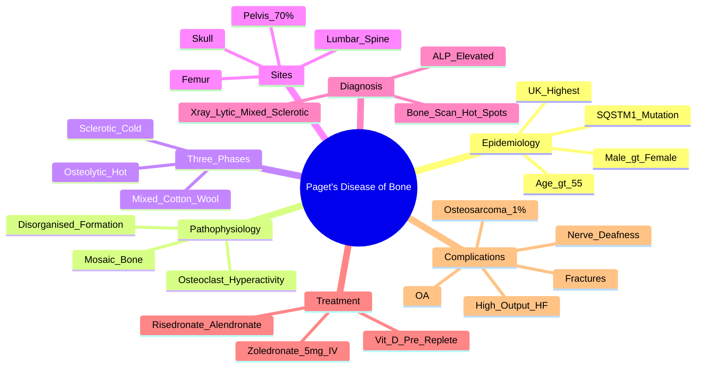

# Paget's Disease of Bone (Osteitis Deformans)

> [!tip] **FCPS/MRCP Priority: HIGH**
> Paget's = **focal disordered bone remodelling** → **↑ ALP (bone isoform)**, **mixed lytic/sclerotic bone**, **bone pain, deformity, fractures**. **Bisphosphonates (zoledronate) = curative**. **Sarcoma transformation (1%)** = dreaded complication.

---

## Learning Objectives
By the end of this note you should be able to:
- [ ] Describe the three phases of Paget's disease and their radiological appearance
- [ ] Interpret biochemical markers (ALP, bone turnover markers)
- [ ] Select and monitor bisphosphonate therapy (zoledronate 5mg IV single dose)
- [ ] Recognise complications (fractures, deformity, nerve compression, sarcomatous transformation)
- [ ] Differentiate from metastases, myeloma, osteomalacia, fibrous dysplasia

---

## 1. Definition & Epidemiology

| Feature | Detail |
|---------|--------|
| **Definition** | **Chronic focal disorder of bone remodelling** → **excessive osteoclast-mediated resorption** followed by **disorganised osteoblast-mediated formation** → **structurally abnormal, mechanically weak bone** |
| **Incidence** | Declining globally; **1-2% of whites >55y** (UK highest) |
| **Prevalence** | Increases with age; **>3% at age 85** |
| **Peak Onset** | **>55 years** (rare <40) |
| **Sex Ratio** | **M > F** (1.5:1) |
| **Geography** | **UK, Europe, Australia, NZ, North America** (high in UK); rare in Scandinavia, Asia, Africa |
| **Genetics** | **SQSTM1 (p62) mutation** — 20-30% familial; **TNFRSF11A (RANK)**; viral (paramyxovirus) hypothesis |

---

## 2. Pathophysiology

```mermaid
flowchart LR
    A[Genetic Susceptibility\nSQSTM1/p62, RANK] --> B[Environmental Trigger\nViral? (Paramyxovirus)]
    B --> C[Osteoclast Hyperactivity\n↑ Number, ↑ Nuclei,\n↑ Resorption]
    C --> D[Coupled Osteoblast Response\n↑ Formation but DISORGANISED]
    D --> E[Structurally Abnormal Bone\nWoven Bone, Mosaic Pattern,\nHigh Vascularity, Weak]
    E --> F[Clinical Paget's\nPain, Deformity, Fracture,\nNerve Compression]
```

### Three Histological Phases (Can Coexist in Same Patient)
| Phase | Histology | Radiology | Biochemistry |
|-------|-----------|-----------|--------------|
| **1. Osteolytic (Hot/Active)** | **Osteoclasts ↑↑**, Howship's lacunae, vascular fibrosis | **Osteoporosis circumscripta** (skull), **flame-shaped lytic wedge** (long bones) | **ALP ↑↑**, bone turnover markers ↑↑ |
| **2. Mixed (Osteolytic/Osteoblastic)** | Osteoclasts + osteoblasts active, mosaic bone pattern | **Cotton wool appearance** (skull), **coarse trabeculae**, **cortical thickening** | **ALP ↑↑↑** (peak) |
| **3. Osteosclerotic (Cold/Inactive)** | Osteoclasts exhausted, dense woven bone, mosaic pattern | **Ivory vertebra**, **thickened cortices**, **enlarged bone** | **ALP normalises** |

---

## 3. Clinical Features

| Feature | Description |
|---------|-------------|
| **Asymptomatic** | **>70%** — incidental X-ray/ALP finding |
| **Bone Pain** | **Dull, aching, deep**, worse at night, **mechanical** (worse with weight-bearing), **unrelieved by rest** |
| **Deformity** | **Bowing of femur/tibia** (saber shin), **enlarged skull** (hat size ↑), **kyphosis**, **waddling gait** |
| **Fractures** | **Insufficiency fractures** — transverse (chalkstick) in long bones, vertebral |
| **Nerve Compression** | **Basilar invagination** → cranial nerve palsies, **spinal stenosis** → radiculopathy, **deafness** (VIIIth nerve) |
| **Joint Involvement** | **Secondary OA** adjacent to pagetic bone (hip, knee) |
| **High-Output Cardiac Failure** | **Vascular steal** from highly vascular pagetic bone (rare, extensive disease) |

---

## 4. Common Sites (Frequency Order)
1. **Pelvis** (most common ~70%)
2. **Lumbar Spine**
3. **Femur**
4. **Thoracic Spine**
5. **Skull**
6. **Tibia**
7. **Humerus**

> [!important] **Monostotic vs Polyostotic**
> - **Monostotic** (single bone): 15-20%
> - **Polyostotic** (multiple bones): 80-85%

---

## 5. Diagnosis — Biochemistry + Imaging

### Biochemistry
| Marker | Finding | Utility |
|--------|---------|---------|
| **ALP (Total)** | **Markedly elevated** (bone isoform) — **gold standard screening** | **Diagnosis + monitoring**; normal in inactive/sclerotic phase |
| **Bone ALP (BALP)** | **More specific** than total ALP | Monitor response if liver disease |
| **P1NP / CTX** | **Bone formation/resorption markers** | Research/specialist monitoring |
| **Calcium/Phosphate/PTH** | **Normal** (unless immobilisation hypercalcaemia) | Exclude other metabolic bone disease |
| **25-OH Vit D** | Often **low** (due to high turnover) | Check before bisphosphonate |

### Imaging
| Modality | Findings |
|----------|----------|
| **X-ray** | **Diagnostic** — lytic wedge → mixed → sclerotic; "cotton wool" skull; cortical thickening; bowing |
| **Bone Scan (Tc-99m)** | **Most sensitive** — **"hot spots" at all active sites**; defines extent (polyostotic) |
| **MRI/CT** | Nerve compression, malignant transformation, surgical planning |
| **DEXA** | **Falsely elevated BMD** (high turnover, vascular bone) — **do not use for osteoporosis diagnosis** |

> [!critical] **X-ray "Cotton Wool" Skull** = classic mixed phase; **Ivory Vertebra** = sclerotic phase

---

## 6. Management — **Bisphosphonates = Mainstay**

```mermaid
flowchart TD
    A[Paget's Diagnosis] --> B{Symptomatic or\nHigh-Risk Site?}
    B -->|Yes (Bone pain, deformity risk,\nnerve compression, pre-op)| C[**Zoledronate 5mg IV single dose**\n(1st line — near-complete remission)]
    B -->|Asymptomatic, low-risk site| D[Observation + Annual ALP]
    C --> E[Recheck ALP at 3-6 months]
    E -->|Normalised| F[Remission achieved]
    E -->|Persistent elevation| G[Repeat zoledronate 5mg IV\nor consider alternative]
    F --> H[Long-term monitoring: ALP annually\nRelapse = ALP rise → retreat]
```

### Bisphosphonate Options
| Drug | Dose | Remission Rate | Notes |
|------|------|----------------|-------|
| **Zoledronate 5mg IV** | **Single infusion** (15 min) | **90-96%** at 6 months | **1st line** — rapid, prolonged remission (years) |
| **Pamidronate 60-90mg IV** | 3-6 infusions weekly | 80-90% | Alternative if zoledronate unavailable |
| **Risedronate 30mg daily** | 2 months | ~70% | Oral option (adherence issues) |
| **Alendronate 40mg daily** | 6 months | ~70% | Oral option |

> [!critical] **Pre-Treatment**
> - **Correct Vit D deficiency** (avoid hypocalcaemia)
> - **Ensure eGFR >35** (zoledronate)
> - **Dental review** (ONJ risk low but present)

### Indications for Treatment
- **Symptomatic bone pain**
- **High-risk site** (skull base, spine, weight-bearing long bones) — prevent complications
- **Pre-surgical** (reduce bleeding: wait 2-4 weeks post-bisphosphonate)
- **Hypercalcaemia** (immobilisation-induced)
- **Neurological compression** (combined with surgery)

---

## 7. Complications

| Complication | Frequency | Detail |
|--------------|-----------|--------|
| **Pathological Fractures** | Common | Transverse "chalkstick" fractures; vertebral collapse |
| **Secondary Osteoarthritis** | Hip, knee | Adjacent to pagetic bone |
| **Nerve Compression** | Skull base → deafness (VIII), cranial nerve palsies; spine → radiculopathy, cauda equina | |
| **Basilar Invagination** | Skull base pagetic → foramen magnum narrowing | |
| **Osteosarcoma (Malignant Transformation)** | **~1%** (polyostotic > monostotic) | **ALP rising despite treatment**, new lytic destruction, pain worsening — **X-ray, MRI, biopsy** |
| **High-Output Heart Failure** | Extensive polyostotic (>50% skeleton) | Vascular steal; treat Paget's + diuretics |

> [!warning] **Osteosarcoma**
> - **Peak age 60-70** (vs primary osteosarcoma 10-20)
> - **Pain worsening at night**, **ALP rising despite treatment**
> - **Biopsy mandatory** if suspected

---

## 8. FCPS/MRCP High-Yield Summary

| Topic | Key Points |
|-------|------------|
| **Demographics** | >55y, M>F, UK highest, SQSTM1 mutation (20-30% familial) |
| **Three Phases** | 1) **Osteolytic** (ALP↑↑, lytic wedge) → 2) **Mixed** (ALP↑↑↑, cotton wool) → 3) **Sclerotic** (ALP normal, ivory vertebra) |
| **ALP** | **Markedly elevated** (bone isoform) — **diagnosis + monitoring**; normal in sclerotic phase |
| **Bone Scan** | **Most sensitive** — defines extent (polyostotic 80%) |
| **Common Sites** | Pelvis > Lumbar spine > Femur > Thoracic spine > Skull |
| **Treatment** | **Zoledronate 5mg IV single dose** (1st line, 90%+ remission); oral risedronate/alendronate if IV not possible |
| **Indications** | Pain, high-risk site (skull base, spine), pre-op, nerve compression |
| **Complications** | Fractures, OA, nerve compression (deafness), **osteosarcoma (1%)**, high-output HF |
| **Osteosarcoma** | ~1%; pain worsening, ALP rising despite Rx; biopsy mandatory |

---

## 9. Viva Questions (MRCP PACES / FCPS)

| Question | Expected Answer |
|----------|----------------|
| "A 70yo man has isolated ALP 480 U/L (normal <130), normal Ca/PO4/PTH. X-ray pelvis shows mixed lytic/sclerotic changes with cortical thickening. Diagnosis and treatment?" | **Paget's disease of bone**. **Zoledronate 5mg IV single dose** (1st line). Recheck ALP at 3-6 months. |
| "What are the three histological phases of Paget's disease?" | 1) **Osteolytic (Hot)** — osteoclastic resorption, lytic wedge, ALP↑↑. 2) **Mixed** — osteoclastic + osteoblastic, mosaic bone, cotton wool skull, ALP↑↑↑. 3) **Sclerotic (Cold)** — dense woven bone, ALP normal, ivory vertebra. |
| "What is the first-line treatment for symptomatic Paget's disease?" | **Zoledronate 5mg IV single infusion** — >90% biochemical remission at 6 months. Oral risedronate/alendronate if IV not possible. |
| "A patient on zoledronate for Paget's disease develops worsening bone pain and ALP rising from 200 to 800 despite treatment. What do you suspect?" | **Osteosarcoma (malignant transformation)** — ~1% risk. **Urgent MRI + biopsy**. Pain often worse at night. |
| "What are the classic radiological features of Paget's disease?" | **Lytic wedge** (osteolytic), **cotton wool skull** (mixed), **cortical thickening + bowing** (sclerotic), **ivory vertebra** (sclerotic). |
| "Which sites are most commonly affected in Paget's disease?" | **Pelvis (70%) > Lumbar spine > Femur > Thoracic spine > Skull > Tibia**. |
| "A patient on zoledronate for Paget's develops hypocalcaemia. Why?" | **Vitamin D deficiency not corrected pre-infusion** — must check/replete 25-OH Vit D before bisphosphonate. |
| "What is the risk of osteosarcoma in Paget's disease?" | **~1%** (higher in polyostotic). **Pain worsening at night, ALP rising despite treatment** = red flags. |

---

## 10. Confusions & Mnemonics

| Confusion | Clarification |
|-----------|---------------|
| **Paget's vs Metastases** | Paget's: **ALP↑↑, Ca/PO4 normal, polyostotic symmetric, bone scan hot**. Metastases: **ALP variable, Ca may be high, lytic/blastic, known primary**. |
| **Paget's vs Osteomalacia** | Paget's: **ALP↑↑↑, Ca/PO4 normal, focal bone changes**. Osteomalacia: **ALP↑, Low PO4, Low Ca, High PTH, Low Vit D**. |
| **Paget's vs Fibrous Dysplasia** | Paget's: >55y, ALP↑↑, mixed lytic/sclerotic. Fibrous dysplasia: <30y, ALP normal/mildly ↑, ground-glass appearance. |
| **DEXA in Paget's** | **Falsely elevated BMD** (high turnover, vascular bone) — **do not use for osteoporosis diagnosis**. |
| **Osteosarcoma vs Flare** | Flare: ALP rises but responds to bisphosphonate. Osteosarcoma: **ALP rising despite treatment**, worsening night pain, new lytic lesion. |

**Mnemonic: Paget's Phases = "HOT-MIXED-COLD"**
- **HOT** = Osteolytic, ALP↑↑
- **MIXED** = Cotton wool skull, ALP↑↑↑
- **COLD** = Sclerotic, ALP normal, Ivory vertebra

**Mnemonic: Sites = "PEL-FEM-SKULL"**
- **PEL**vis (most common)
- **FEM**ur
- **SKULL** (cotton wool)

**Mnemonic: Treatment = "ZOL"**
- **ZOL**edronate 5mg IV single dose = 1st line

**Mnemonic: Complications = "FON-H"**
- **F**ractures
- **O**steoarthritis
- **N**erve compression (deafness, cauda equina)
- **H**igh-output HF (extensive)

**Mnemonic: Osteosarcoma Red Flag = "PAN"**
- **P**ain worsening (night)
- **A**LP rising despite treatment
- **N**ew lytic lesion

---

## 11. Mind Map



---

## 12. One-Page Revision Card

| Domain | Key Points |
|--------|------------|
| **Demographics** | >55y, M>F, UK highest, SQSTM1 mutation |
| **Phases** | **1) Osteolytic** (lytic wedge, ALP↑↑) → **2) Mixed** (cotton wool skull, ALP↑↑↑) → **3) Sclerotic** (ivory vertebra, ALP normal) |
| **ALP** | **Markedly elevated** (bone isoform) — **diagnosis + monitoring** |
| **Sites** | Pelvis > Lumbar spine > Femur > Thoracic spine > Skull |
| **Bone Scan** | **Most sensitive** — defines polyostotic extent |
| **Treatment** | **Zoledronate 5mg IV single dose** (1st line, >90% remission) |
| **Indications** | Pain, high-risk site (skull base, spine), pre-op, nerve compression |
| **Complications** | Fractures, OA, deafness (VIII nerve), **osteosarcoma 1%**, high-output HF |
| **Osteosarcoma** | ~1%; **ALP rising despite Rx**, worsening night pain → biopsy |

---

## 13. Spaced Repetition Trackers

| Review Interval | Date Completed | Confidence (1-5) | Notes |
|-----------------|----------------|------------------|-------|
| 24 hours | | | |
| 7 days | | | |
| 15 days | | | |
| 30 days | | | |
| 90 days | | | |

---

## 14. Self-Test Scorecard

| Section | Score /5 | Last Attempt |
|---------|----------|--------------|
| Three Phases & Radiology | | |
| ALP Interpretation | | |
| Treatment Selection & Monitoring | | |
| Complication Recognition | | |
| Osteosarcoma Red Flags | | |
| Viva Questions | | |

---

## Local Navigation
- **Parent Heading**: [[../Bone Metabolic Diseases|Bone Metabolic Diseases]]
- **Parent Topic Group**: [[Metabolic bone disease]]
- **Chapter Map**: [[../Davidson Chapter 26 - Rheumatology Hierarchy|Rheumatology Hierarchy]]
- **Chapter MOC**: [[../Rheumatology MOC|Rheumatology MOC]]
- **Drug Reference**: [[../../Clinical Approach to Musculoskeletal Disease/Drugs in rheumatology|Drugs in rheumatology]]
- **Related**: [[Osteoporosis]] · [[Osteomalacia and rickets]] · [[Glucocorticoid-induced osteoporosis]]
---

> Auto-generated study sections for "Bone Metabolic Diseases" — Ch 25: Rheumatology & Bone Disease.

## Flashcards (29 generated)

- Q: What is the definition of Bone Metabolic Diseases?
  A: Chronic focal disorder of bone remodelling → excessive osteoclast-mediated resorption followed by disorganised osteoblast-mediated formation → structurally abnormal, mechanically weak bone
- Q: What is the epidemiology of Bone Metabolic Diseases?
  A: Declining globally; 1-2% of whites >55y (UK highest)
- Q: What is Peak Onset of Bone Metabolic Diseases?
  A: >55 years (rare <40)
- Q: What is Sex Ratio of Bone Metabolic Diseases?
  A: M > F (1.5:1)
- Q: What is Geography of Bone Metabolic Diseases?
  A: UK, Europe, Australia, NZ, North America (high in UK); rare in Scandinavia, Asia, Africa
- Q: What is Genetics of Bone Metabolic Diseases?
  A: SQSTM1 (p62) mutation — 20-30% familial; TNFRSF11A (RANK); viral (paramyxovirus) hypothesis
- Q: What are the clinical features of Bone Metabolic Diseases?
  A: >70% — incidental X-ray/ALP finding
- Q: What is Bone Pain of Bone Metabolic Diseases?
  A: Dull, aching, deep, worse at night, mechanical (worse with weight-bearing), unrelieved by rest
- Q: What is Deformity of Bone Metabolic Diseases?
  A: Bowing of femur/tibia (saber shin), enlarged skull (hat size ↑), kyphosis, waddling gait
- Q: What is Fractures of Bone Metabolic Diseases?
  A: Insufficiency fractures — transverse (chalkstick) in long bones, vertebral
- Q: What is Nerve Compression of Bone Metabolic Diseases?
  A: Basilar invagination → cranial nerve palsies, spinal stenosis → radiculopathy, deafness (VIIIth nerve)
- Q: What is Joint Involvement of Bone Metabolic Diseases?
  A: Secondary OA adjacent to pagetic bone (hip, knee)
- Q: What is High-Output Cardiac Failure of Bone Metabolic Diseases?
  A: Vascular steal from highly vascular pagetic bone (rare, extensive disease)
- Q: What are the clinical features of Bone Metabolic Diseases?
  A: >70% — incidental X-ray/ALP finding
- Q: What is Bone Pain of Bone Metabolic Diseases?
  A: Dull, aching, deep, worse at night, mechanical (worse with weight-bearing), unrelieved by rest
- Q: What is Deformity of Bone Metabolic Diseases?
  A: Bowing of femur/tibia (saber shin), enlarged skull (hat size ↑), kyphosis, waddling gait
- Q: What is Fractures of Bone Metabolic Diseases?
  A: Insufficiency fractures — transverse (chalkstick) in long bones, vertebral
- Q: What is Nerve Compression of Bone Metabolic Diseases?
  A: Basilar invagination → cranial nerve palsies, spinal stenosis → radiculopathy, deafness (VIIIth nerve)
- Q: What is Joint Involvement of Bone Metabolic Diseases?
  A: Secondary OA adjacent to pagetic bone (hip, knee)
- Q: What is High-Output Cardiac Failure of Bone Metabolic Diseases?
  A: Vascular steal from highly vascular pagetic bone (rare, extensive disease)
- Q: What is Demographics of Bone Metabolic Diseases?
  A: >55y, M>F, UK highest, SQSTM1 mutation (20-30% familial)
- Q: What is Three Phases of Bone Metabolic Diseases?
  A: 1) Osteolytic (ALP↑↑, lytic wedge) → 2) Mixed (ALP↑↑↑, cotton wool) → 3) Sclerotic (ALP normal, ivory vertebra)
- Q: What is ALP of Bone Metabolic Diseases?
  A: Markedly elevated (bone isoform) — diagnosis + monitoring; normal in sclerotic phase
- Q: What is Bone Scan of Bone Metabolic Diseases?
  A: Most sensitive — defines extent (polyostotic 80%)
- Q: What is Common Sites of Bone Metabolic Diseases?
  A: Pelvis > Lumbar spine > Femur > Thoracic spine > Skull
- Q: How is Bone Metabolic Diseases managed?
  A: Zoledronate 5mg IV single dose (1st line, 90%+ remission); oral risedronate/alendronate if IV not possible
- Q: What is Bone Metabolic Diseases indicated for?
  A: Pain, high-risk site (skull base, spine), pre-op, nerve compression
- Q: What are the complications of Bone Metabolic Diseases?
  A: Fractures, OA, nerve compression (deafness), osteosarcoma (1%), high-output HF
- Q: What is Osteosarcoma of Bone Metabolic Diseases?
  A: ~1%; pain worsening, ALP rising despite Rx; biopsy mandatory

## MCQs (1 generated)

1. **Which of the following best describes Bone Metabolic Diseases?**
   A. **Paget's = focal disordered bone remodelling → ↑ ALP (bone isoform), mixed lytic/sclerotic bone, bone pain, deformity, fractures.**
   B. An unrelated condition not matching the clinical picture of Bone Metabolic Diseases
   C. A complication seen late in the disease course of Bone Metabolic Diseases
   D. A condition that mimics Bone Metabolic Diseases but has a different underlying cause

## SBA Questions (1 generated)

1. A patient with suspected Bone Metabolic Diseases presents with: Definition — Chronic focal disorder of bone remodelling → excessive osteoclast-mediated resorption followed by disorganised osteoblast-mediated formation → structurally abnormal, mechanically weak bone; Incidence — Declining globally; 1-2% of whites >55y (UK highest); Prevalence — Increases with age; >3% at age 85. What is the most likely diagnosis?
   A. **Bone Metabolic Diseases**
   B. A condition that mimics Bone Metabolic Diseases but is not the same entity
   C. A complication of Bone Metabolic Diseases rather than the primary diagnosis
   D. An unrelated condition in the same clinical category as Bone Metabolic Diseases

