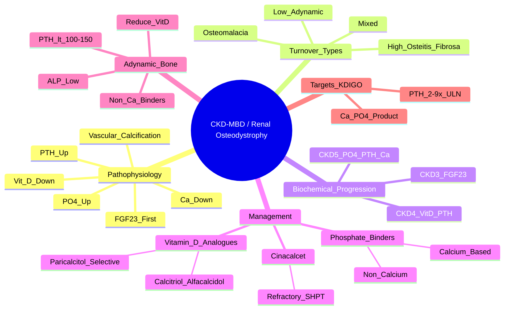

# Renal Osteodystrophy (CKD-MBD)

> [!tip] **FCPS/MRCP Priority: HIGH**
> Renal osteodystrophy = **CKD-MBD (Chronic Kidney Disease-Mineral and Bone Disorder)**. Spectrum of bone turnover abnormalities (high, low, mixed) + vascular calcification. **FGF23 rises first**, then 1,25-vit D falls, then PTH rises. **Adynamic bone (oversuppressed PTH) = high fracture risk**.

---

## Learning Objectives
By the end of this note you should be able to:
- [ ] Describe the pathophysiology of CKD-MBD (FGF23 → 1,25-vit D → PTH → Ca/PO4)
- [ ] Classify bone turnover using TMV system (High/Low/Mixed/Osteomalacia)
- [ ] Interpret biochemical progression by CKD stage
- [ ] Select phosphate binders (calcium vs non-calcium) and vitamin D analogues
- [ ] Recognise adynamic bone disease (low PTH, low ALP) and manage appropriately
- [ ] Use cinacalcet for refractory secondary hyperparathyroidism
- [ ] Screen for vascular calcification

---

## 1. Definition & Epidemiology

| Feature | Detail |
|---------|--------|
| **Definition** | **CKD-MBD** = abnormalities of **Ca, PO4, PTH, vitamin D, bone turnover, vascular calcification** due to CKD |
| **Prevalence** | **~100% of dialysis patients** have some features; increases with CKD stage |
| **Clinical Spectrum** | Bone pain, fractures, vascular calcification, pruritus, proximal myopathy |
| **Mortality** | Vascular calcification → **cardiovascular death** (major cause of death in CKD) |

---

## 2. Pathophysiology

```mermaid
flowchart LR
    A[CKD → ↓ Renal Mass] --> B[↓ 1α-hydroxylase → ↓ 1,25-(OH)2 Vit D]
    A --> C[↑ FGF23 (early)] --> D[↓ 1α-hydroxylase + ↓ Renal PO4 Reabsorption]
    B --> E[↓ Intestinal Ca Absorption]
    C --> D
    E --> F[↓ Serum Ca]
    F --> G[↑ PTH (Secondary Hyperparathyroidism)]
    D --> H[↓ Renal PO4 Reabsorption → ↑ PO4]
    G --> I[High Turnover Bone Disease (Osteitis Fibrosa)]
    H --> J[Vascular Calcification (Ca × PO4 product)]
    I --> J
    G --> K[Bone Resorption → ↑ ALP, ↑ Osteocalcin]
    J --> L[CV Death — Major Mortality]
```

### Key Mediators
| Mediator | Role in CKD-MBD |
|----------|-----------------|
| **FGF23** | **Earliest marker** — rises in CKD 3; ↓ 1α-hydroxylase, ↓ renal PO4 reabsorption |
| **1,25-(OH)2 Vit D** | ↓ due to ↓ renal mass + ↓ 1α-hydroxylase → ↓ Ca absorption |
| **PTH** | Compensatory rise → bone resorption, phosphaturia; **high turnover** if persistent |
| **PO4** | Retained as GFR falls → **vascular calcification** (Ca × PO4 product) |
| **Klotho** | FGF23 co-receptor; ↓ in CKD → resistance to FGF23 |

---

## 3. TMV Classification of Bone Turnover (Gold Standard: Bone Biopsy)

| Type | PTH | ALP | Bone Formation/Resorption | Histology | Management |
|------|-----|-----|---------------------------|-----------|------------|
| **High Turnover** (Osteitis Fibrosa) | **High** (>2-9x ULN) | **High** | **↑↑ Both** | Increased osteoblasts/osteoclasts, marrow fibrosis | ↓ PTH: vitamin D analogues, cinacalcet, phosphate control |
| **Low Turnover** (Adynamic Bone) | **Low** (<100-150 pg/mL) | **Low** | **↓↓ Both** | **Low osteoid, low cellularity, ↓ osteoblasts** | **Reduce/stop** vitamin D, calcium binders; avoid oversuppression |
| **Mixed** | Variable | Variable | Mixed features | Features of both high and low turnover | Complex; treat dominant pattern |
| **Osteomalacia** | Normal/High | High | Defective mineralisation | Increased osteoid, wide osteoid seams | Aluminium (historical); now rare; vit D deficiency |

> [!critical] **Adynamic Bone = High Fracture Risk**
> - **Oversuppressed PTH** (<100-150 pg/mL) from excessive vitamin D/calcium binders
> - **Low ALP**, low bone formation → **fragile bone**
> - **Management**: Reduce/stop vitamin D analogues, switch to non-calcium binders

---

## 4. Biochemical Progression by CKD Stage

| CKD Stage | GFR (mL/min) | FGF23 | 1,25-Vit D | PO4 | Ca | PTH | Bone Turnover |
|-----------|--------------|-------|------------|-----|----|-----|---------------|
| **CKD 3** (30-59) | Early | **↑↑** (first) | ↓/Normal | Normal | Normal | Normal/↑ | Normal → High |
| **CKD 4** (15-29) | Moderate | ↑↑↑ | **↓** | ↑ | Normal/↓ | **↑↑** | High |
| **CKD 5** (<15) / Dialysis | Severe | ↑↑↑↑ | **↓↓** | **↑↑** | **↓** | **↑↑↑** | High / Mixed / Adynamic |

> [!important] **Biochemical Targets (KDIGO)**
> - **PTH**: 2-9x ULN (avoid <100-150 pg/mL for adynamic bone)
> - **Ca**: 2.2-2.5 mmol/L (corrected)
> - **PO4**: <1.78 mmol/L (dialysis) / <1.45 mmol/L (CKD 3-5)
> - **Ca × PO4**: <4.4 mmol²/L (avoid vascular calcification)

---

## 5. Management

### Phosphate Binders (With Meals)
| Type | Examples | Indication | Caveats |
|------|----------|------------|---------|
| **Calcium-based** | Calcium carbonate, Calcium acetate | First-line (cheap, most patients) | **Avoid if** vascular calcification, high Ca, adynamic bone |
| **Non-calcium** | Sevelamer carbonate, Lanthanum carbonate, **Sucroferric oxyhydroxide** | **If** hypercalcaemia, vascular calcification, adynamic bone | More expensive; sevelamer: GI side effects |
| **Iron-based** | Sucroferric oxyhydroxide | Phosphate binding + iron repletion | Newer; limited long-term data |

### Vitamin D Analogues (Suppress PTH)
| Drug | Mechanism | Indication | Caveats |
|------|-----------|------------|---------|
| **Calcitriol** (1,25-(OH)2 D3) | Active Vit D; VDR activation | Standard | ↑ Ca, ↑ PO4 — monitor |
| **Alfacalcidol** (1α-OH D3) | Prodrug → 1,25-(OH)2 D3 | Standard (oral/IV) | ↑ Ca, ↑ PO4 |
| **Paricalcitol** (19-nor-1,25-(OH)2 D2) | **Selective VDR activator** (less Ca/PO4 rise) | **If hypercalcaemia/hyperphosphataemia** | Preferred if Ca/PO4 high |

### Cinacalcet (Calcimimetic)
| Parameter | Detail |
|-----------|--------|
| **Mechanism** | **Positive allosteric modulator of CaSR** → ↓ PTH secretion, ↓ Ca × PO4 product |
| **Indication** | **Refractory SHPT** (PTH >9x ULN despite vitamin D + phosphate binders) |
| **Dose** | 30-180mg daily (titrate to PTH target) |
| **Monitoring** | Calcium (↓ risk of hypocalcaemia), PTH, Ca × PO4 |
| **Contraindication** | Hypocalcaemia (correct first) |

> [!warning] **Adynamic Bone Management**
> - **PTH <100-150 pg/mL** + **Low ALP** → **Reduce/stop** vitamin D analogues, **switch to non-calcium binders**
> - **Fracture risk ↑** — consider teriparatide (specialist only)

---

## 6. Vascular Calcification

| Aspect | Detail |
|--------|--------|
| **Mechanism** | **High Ca × PO4 product** + **low fetuin-A** + **inflammation** → vascular smooth muscle osteogenic transformation |
| **Sites** | **Coronary arteries** (major CV mortality), aortic, peripheral arteries, cardiac valves |
| **Imaging** | **CT coronary calcium score**, plain X-ray, ultrasound |
| **Predictors** | High Ca × PO4, high PTH, low fetuin-A, inflammation, diabetes, age |
| **Management** | **Lower Ca × PO4** (phosphate binders, dialysis), **avoid calcium overload**, cinacalcet |

---

## 7. FCPS/MRCP High-Yield Summary

| Topic | Key Points |
|-------|------------|
| **CKD-MBD** | Ca, PO4, PTH, Vit D, bone turnover, vascular calcification |
| **FGF23** | **Earliest marker** — rises CKD 3; ↓ 1,25-Vit D, ↓ PO4 reabsorption |
| **Progression** | FGF23↑ → 1,25-Vit D↓ → PTH↑ → PO4↑ → Vascular calcification |
| **High Turnover** | High PTH, High ALP, Osteitis Fibrosa → vit D analogues, cinacalcet |
| **Low Turnover (Adynamic)** | **PTH <100-150, Low ALP** → **Reduce/stop vit D, switch to non-Ca binders** |
| **Mixed** | Features of both high and low turnover |
| **Phosphate Binders** | Calcium-based (1st line) vs Non-calcium (sevelamer, lanthanum, sucroferric) |
| **Vit D Analogues** | Calcitriol/Alfacalcidol (↑ Ca/PO4); **Paricalcitol** (selective VDR, less Ca/PO4) |
| **Cinacalcet** | Calcimimetic → CaSR sensitisation → ↓ PTH, ↓ Ca×PO4; refractory SHPT |
| **Adynamic Bone** | PTH <100-150, Low ALP → **Reduce/stop vit D, non-Ca binders** |
| **Vascular Calcification** | Ca × PO4 product >4.4 → CV mortality; fetuin-A low |

---

## 8. Viva Questions (MRCP PACES / FCPS)

| Question | Expected Answer |
|----------|----------------|
| "What is the earliest biochemical abnormality in CKD-MBD?" | **FGF23 rises first** (CKD 3) → then 1,25-vit D falls → then PTH rises → then phosphate rises. |
| "A dialysis patient has PTH 80 pg/mL, ALP 60 U/L. What bone turnover type and management?" | **Adynamic bone** (PTH <100-150, low ALP). **Reduce/stop vitamin D analogues**, switch to **non-calcium phosphate binders**. |
| "What are the KDIGO PTH targets in CKD-MBD?" | **2-9x ULN**. Avoid <100-150 pg/mL (adynamic bone risk). |
| "When do you use cinacalcet in CKD-MBD?" | **Refractory SHPT** — PTH >9x ULN despite vitamin D analogues + phosphate binders. Sensitises CaSR → ↓ PTH, ↓ Ca×PO4. |
| "What is the difference between calcitriol and paricalcitol?" | **Paricalcitol = selective VDR activator** → less rise in Ca and PO4 vs calcitriol/alfacalcidol. Preferred if Ca/PO4 high. |
| "A CKD 5 patient has Ca 2.6, PO4 2.0, Ca×PO4 product 5.2. What is the risk and management?" | **Vascular calcification risk** (product >4.4). **Switch to non-calcium binders**, consider cinacalcet, lower phosphate. |
| "What is adynamic bone disease and how do you manage it?" | **Oversuppressed PTH (<100-150), low ALP, low bone formation** → **reduce/stop vitamin D analogues**, switch to **non-calcium phosphate binders**. |
| "How does phosphate binder choice differ if vascular calcification present?" | **Avoid calcium-based binders** — use **non-calcium binders** (sevelamer, lanthanum, sucroferric oxyhydroxide). |

---

## 9. Confusions & Mnemonics

| Confusion | Clarification |
|-----------|---------------|
| **High vs Low Turnover** | High = **High PTH, High ALP** (Osteitis Fibrosa). Low = **Low PTH, Low ALP** (Adynamic). |
| **FGF23 vs PTH Timing** | **FGF23 rises FIRST** (CKD 3). PTH rises LATER (CKD 4-5). |
| **Calcitriol vs Paricalcitol** | Paricalcitol = **selective VDR** → less Ca/PO4 rise. Use if Ca/PO4 high. |
| **Adynamic Bone vs Osteomalacia** | Adynamic = **low PTH, low ALP, low formation**. Osteomalacia = **high ALP, high osteoid, defective mineralisation**. |
| **Hyperphosphataemia Treatment** | **Phosphate binders with meals** → calcium-based (1st line) vs non-calcium (if high Ca/vascular calcification). |
| **PTH Target** | **2-9x ULN** (KDIGO). Not normalise. |

**Mnemonic: CKD-MBD Progression = "F-P-C-V"**
- **F**GF23 ↑ (first)
- **P** 1,25-Vit D ↓
- **C**a ↓ / PTH ↑
- **V**ascular calcification (Ca × PO4 product)

**Mnemonic: Turnover Types = "HAM-O"**
- **H**igh Turnover = Osteitis Fibrosa (High PTH, High ALP)
- **A**dynamic = Low Turnover (Low PTH <100-150, Low ALP)
- **M**ixed = Both features
- **O**steomalacia (defective mineralisation)

**Mnemonic: Phosphate Binders = "CASH"**
- **C**alcium carbonate/acetate (1st line)
- **A**luminium (historical, avoid)
- **S**evelamer / **S**ucroferric (non-Ca)
- **H**ydroxide / Lanthanum (non-Ca)

**Mnemonic: Vitamin D Analogues = "Paricalcitol = SELECTIVE"**
- **P**aricalcitol = **SELECTIVE VDR** → less Ca/PO4 rise

**Mnemonic: Cinacalcet = "CALCI"**
- **C**alcimimetic
- **A**llosteric **C**aSR modulator
- **L**owers **P**TH
- **C**a × **P**O4 product ↓
- **I**f refractory SHPT

---

## 10. Mind Map



---

## 11. One-Page Revision Card

| Domain | Key Points |
|--------|------------|
| **Definition** | CKD-MBD = Ca, PO4, PTH, Vit D, bone turnover, vascular calcification abnormalities |
| **Pathophysiology** | **FGF23 ↑ first** → ↓ 1,25-Vit D → ↑ PTH → ↑ PO4 → **vascular calcification** |
| **Turnover Types** | **High**: PTH↑, ALP↑ (Osteitis Fibrosa). **Low/Adynamic**: PTH<100-150, ALP↓ (oversuppressed). **Mixed**. **Osteomalacia**: defective mineralisation |
| **PTH Target (KDIGO)** | **2-9x ULN** (avoid <100-150 pg/mL) |
| **Phosphate Binders** | **Calcium-based 1st line** (carbonate/acetate). **Non-Ca** (sevelamer, lanthanum, sucroferric) if high Ca/vascular calcification/adynamic bone |
| **Vit D Analogues** | Calcitriol/Alfacalcidol (↑Ca/PO4). **Paricalcitol** = selective VDR (less Ca/PO4) |
| **Cinacalcet** | **Calcimimetic** (CaSR sensitiser) → ↓ PTH, ↓ Ca×PO4; **refractory SHPT** |
| **Adynamic Bone** | **PTH <100-150, ALP low** → **Reduce/stop vit D, non-Ca binders** |
| **Vascular Calcification** | Ca × PO4 >4.4 → coronary calcification → CV death; fetuin-A low |

---

## 12. Spaced Repetition Trackers

| Review Interval | Date Completed | Confidence (1-5) | Notes |
|-----------------|----------------|------------------|-------|
| 24 hours | | | |
| 7 days | | | |
| 15 days | | | |
| 30 days | | | |
| 90 days | | | |

---

## 13. Self-Test Scorecard

| Section | Score /5 | Last Attempt |
|---------|----------|--------------|
| FGF23/PTH/Vit D Pathophysiology | | |
| Turnover Classification (TMV) | | |
| Adynamic Bone Recognition | | |
| Phosphate Binder Selection | | |
| Vitamin D Analogue Choice | | |
| Cinacalcet Indications | | |
| KDIGO Targets | | |
| Viva Questions | | |

---

## Local Navigation
- **Parent Heading**: [[../Bone Metabolic Diseases|Bone Metabolic Diseases]]
- **Parent Topic Group**: [[Bone metabolic disorders]]
- **Chapter Map**: [[../Davidson Chapter 26 - Rheumatology Hierarchy|Rheumatology Hierarchy]]
- **Chapter MOC**: [[../Rheumatology MOC|Rheumatology MOC]]
- **Drug Reference**: [[../../Clinical Approach to Musculoskeletal Disease/Drugs in rheumatology|Drugs in rheumatology]]
- **Related**: [[Osteoporosis]] · [[Hyperparathyroidism and bone]] · [[Osteomalacia and rickets]]
---

> Auto-generated study sections for "Bone Metabolic Diseases" — Ch 25: Rheumatology & Bone Disease.

## Flashcards (33 generated)

- Q: What is the definition of Bone Metabolic Diseases?
  A: CKD-MBD = abnormalities of Ca, PO4, PTH, vitamin D, bone turnover, vascular calcification due to CKD
- Q: What is the epidemiology of Bone Metabolic Diseases?
  A: ~100% of dialysis patients have some features; increases with CKD stage
- Q: What is Clinical Spectrum of Bone Metabolic Diseases?
  A: Bone pain, fractures, vascular calcification, pruritus, proximal myopathy
- Q: What is Mortality of Bone Metabolic Diseases?
  A: Vascular calcification → cardiovascular death (major cause of death in CKD)
- Q: What is the mechanism of Bone Metabolic Diseases?
  A: Positive allosteric modulator of CaSR → ↓ PTH secretion, ↓ Ca × PO4 product
- Q: What is Bone Metabolic Diseases indicated for?
  A: Refractory SHPT (PTH >9x ULN despite vitamin D + phosphate binders)
- Q: What is the dose of Bone Metabolic Diseases?
  A: 30-180mg daily (titrate to PTH target)
- Q: How is Bone Metabolic Diseases monitored?
  A: Calcium (↓ risk of hypocalcaemia), PTH, Ca × PO4
- Q: What is the mechanism of Bone Metabolic Diseases?
  A: High Ca × PO4 product + low fetuin-A + inflammation → vascular smooth muscle osteogenic transformation
- Q: What is Sites of Bone Metabolic Diseases?
  A: Coronary arteries (major CV mortality), aortic, peripheral arteries, cardiac valves
- Q: What is Imaging of Bone Metabolic Diseases?
  A: CT coronary calcium score, plain X-ray, ultrasound
- Q: What is Predictors of Bone Metabolic Diseases?
  A: High Ca × PO4, high PTH, low fetuin-A, inflammation, diabetes, age
- Q: How is Bone Metabolic Diseases managed?
  A: Lower Ca × PO4 (phosphate binders, dialysis), avoid calcium overload, cinacalcet
- Q: What is the mechanism of Bone Metabolic Diseases?
  A: Positive allosteric modulator of CaSR → ↓ PTH secretion, ↓ Ca × PO4 product
- Q: What is Bone Metabolic Diseases indicated for?
  A: Refractory SHPT (PTH >9x ULN despite vitamin D + phosphate binders)
- Q: What is the dose of Bone Metabolic Diseases?
  A: 30-180mg daily (titrate to PTH target)
- Q: How is Bone Metabolic Diseases monitored?
  A: Calcium (↓ risk of hypocalcaemia), PTH, Ca × PO4
- Q: What is the mechanism of Bone Metabolic Diseases?
  A: High Ca × PO4 product + low fetuin-A + inflammation → vascular smooth muscle osteogenic transformation
- Q: What is Sites of Bone Metabolic Diseases?
  A: Coronary arteries (major CV mortality), aortic, peripheral arteries, cardiac valves
- Q: What is Imaging of Bone Metabolic Diseases?
  A: CT coronary calcium score, plain X-ray, ultrasound
- Q: What is Predictors of Bone Metabolic Diseases?
  A: High Ca × PO4, high PTH, low fetuin-A, inflammation, diabetes, age
- Q: How is Bone Metabolic Diseases managed?
  A: Lower Ca × PO4 (phosphate binders, dialysis), avoid calcium overload, cinacalcet
- Q: What is CKD-MBD of Bone Metabolic Diseases?
  A: Ca, PO4, PTH, Vit D, bone turnover, vascular calcification
- Q: What is FGF23 of Bone Metabolic Diseases?
  A: Earliest marker — rises CKD 3; ↓ 1,25-Vit D, ↓ PO4 reabsorption
- Q: What is Progression of Bone Metabolic Diseases?
  A: FGF23↑ → 1,25-Vit D↓ → PTH↑ → PO4↑ → Vascular calcification
- Q: What is High Turnover of Bone Metabolic Diseases?
  A: High PTH, High ALP, Osteitis Fibrosa → vit D analogues, cinacalcet
- Q: What is Low Turnover (Adynamic) of Bone Metabolic Diseases?
  A: PTH <100-150, Low ALP → Reduce/stop vit D, switch to non-Ca binders
- Q: What is Mixed of Bone Metabolic Diseases?
  A: Features of both high and low turnover
- Q: What is Phosphate Binders of Bone Metabolic Diseases?
  A: Calcium-based (1st line) vs Non-calcium (sevelamer, lanthanum, sucroferric)
- Q: What is Vit D Analogues of Bone Metabolic Diseases?
  A: Calcitriol/Alfacalcidol (↑ Ca/PO4); Paricalcitol (selective VDR, less Ca/PO4)
- Q: What is Cinacalcet of Bone Metabolic Diseases?
  A: Calcimimetic → CaSR sensitisation → ↓ PTH, ↓ Ca×PO4; refractory SHPT
- Q: What is Adynamic Bone of Bone Metabolic Diseases?
  A: PTH <100-150, Low ALP → Reduce/stop vit D, non-Ca binders
- Q: What is Vascular Calcification of Bone Metabolic Diseases?
  A: Ca × PO4 product >4.4 → CV mortality; fetuin-A low

## MCQs (1 generated)

1. **Which of the following best describes Bone Metabolic Diseases?**
   A. **Renal osteodystrophy = CKD-MBD (Chronic Kidney Disease-Mineral and Bone Disorder).**
   B. An unrelated condition not matching the clinical picture of Bone Metabolic Diseases
   C. A complication seen late in the disease course of Bone Metabolic Diseases
   D. A condition that mimics Bone Metabolic Diseases but has a different underlying cause

## SBA Questions (1 generated)

1. A patient with suspected Bone Metabolic Diseases presents with: Definition — CKD-MBD = abnormalities of Ca, PO4, PTH, vitamin D, bone turnover, vascular calcification due to CKD; Prevalence — ~100% of dialysis patients have some features; increases with CKD stage; Clinical Spectrum — Bone pain, fractures, vascular calcification, pruritus, proximal myopathy. What is the most likely diagnosis?
   A. **Bone Metabolic Diseases**
   B. A condition that mimics Bone Metabolic Diseases but is not the same entity
   C. A complication of Bone Metabolic Diseases rather than the primary diagnosis
   D. An unrelated condition in the same clinical category as Bone Metabolic Diseases

## PasTest Scenario SBAs (Clinical Vignettes)

> **Auto-generated PasTest/Mediscope-style scenario SBAs** grounded in the authored source. Each scenario tests a real clinical fact (triad, specific sign, contraindication, trial, first-line Rx) extracted from the topic. *Source: Ch 25: Rheumatology — Renal osteodystrophy*

**Q1.** What is the most appropriate first-line therapy for Renal osteodystrophy?

  - **A.** Calcium-based + Avoid if
  - **B.** An advanced/surgical therapy reserved for refractory disease
  - **C.** Symptomatic treatment only, no disease-modifying therapy
  - **D.** Empiric broad-spectrum therapy without specific indication

  > **Answer: A** — Calcium-based + Avoid if
  >
  > *Source:* **Calcium-based**   Calcium carbonate, Calcium acetate   First-line (cheap, most patients)   **Avoid if** vascular calcification, high Ca, adynamic bone

