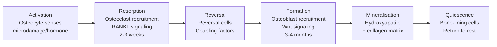
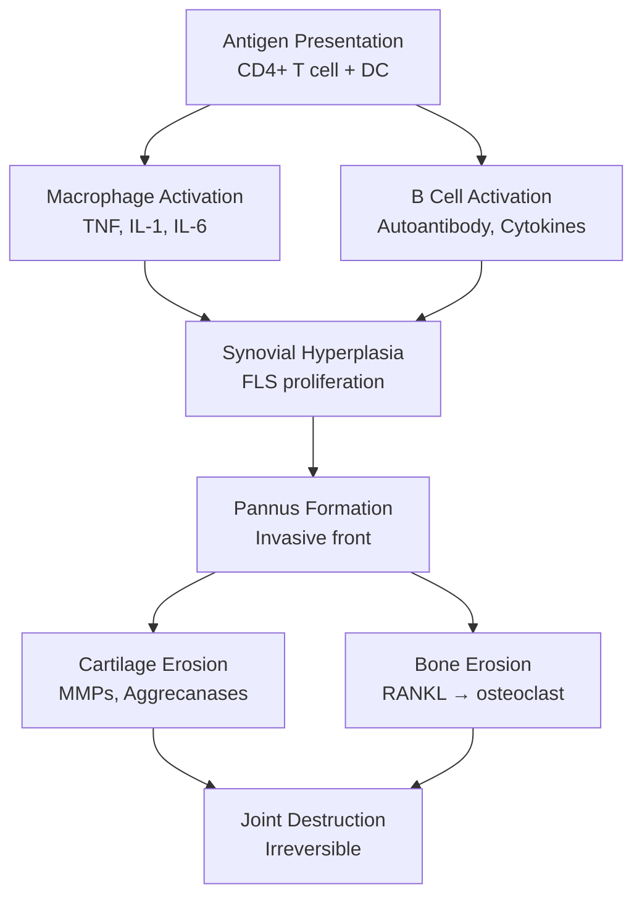
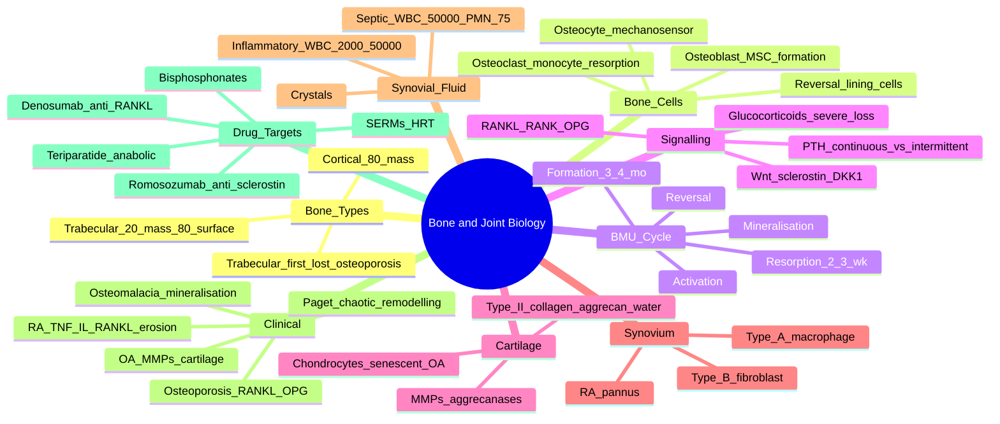

# Bone Structure & Remodelling and Joint Biology

> [!tip] **FCPS/MRCP Priority: MEDIUM (Foundational)**
> Understanding **bone remodelling (RANKL/RANK/OPG axis, Wnt/sclerostin)**, **synovial joint architecture**, and **the key cellular players (osteoblast, osteoclast, osteocyte, chondrocyte, synoviocyte)** is **foundational** to all bone and joint disease. Must know: **RANKL → osteoclastogenesis** (target of denosumab), **Wnt → osteoblast activity** (target of romosozumab), **articular cartilage composition** (type II collagen + aggrecan), and how disease (osteoporosis, OA, RA, osteomalacia) distorts normal physiology.

---

## Learning Objectives
By the end of this note you should be able to:
- [ ] Describe **bone macro- and micro-architecture** (cortical vs trabecular, Haversian systems, BMU)
- [ ] Explain the **RANKL/RANK/OPG axis** and its therapeutic targeting (denosumab)
- [ ] Outline the **Wnt/sclerostin pathway** and romosozumab mechanism
- [ ] Describe **synovial joint anatomy** (cartilage, synovium, capsule, fluid)
- [ ] Explain **articular cartilage composition** (type II collagen, aggrecan, water) and degradation (MMPs, aggrecanases)
- [ ] Apply pathophysiology to **osteoporosis, OA, RA, osteomalacia, Paget's**
- [ ] Recognise **drug targets** in rheumatology (bisphosphonates, denosumab, romosozumab, teriparatide)

---

## 1. Bone — Macroscopic Structure
### Types of Bone
| Type | Location | Structure | Function |
|------|----------|-----------|----------|
| **Cortical (compact)** | **80% of skeletal mass**; diaphysis of long bones, outer shell | Dense, **Haversian systems** (osteons), periosteum/endosteum | Mechanical strength, protection |
| **Trabecular (cancellous, spongy)** | **20% of mass, 80% of surface area**; vertebrae, metaphysis, flat bones | Honeycomb, **trabeculae** with marrow spaces | Metabolic (calcium homeostasis), shock absorption |

### Bone Surfaces
| Surface | Cells | Activity |
|---------|-------|----------|
| **Periosteum** | Outer, fibrous + osteoblast layer | Appositional growth, fracture repair, blood supply |
| **Endosteum** | Inner lining of medullary cavity | Remodelling interface |
| **Haversian canals** | Within cortical bone | Blood vessels, nerves |
| **Trabecular surface** | Lined with bone-lining cells, osteoclasts/osteoblasts | High remodelling activity |

> [!important] **Trabecular Bone Loss Pattern**
> - **Osteoporosis**: trabecular bone lost **first** (vertebral crush fractures, distal radius Colles)
> - **Cortical bone** lost later (hip fractures)
> - Trabecular bone is **8× more metabolically active** than cortical bone

---

## 2. Bone Cells
| Cell | Origin | Function | Key Markers |
|------|--------|----------|-------------|
| **Osteoclast** | **Monocyte/macrophage** lineage (haematopoietic) | **Bone resorption** | TRAP, cathepsin K, RANK |
| **Osteoblast** | **Mesenchymal stem cell** (MSC) lineage | **Bone formation** | ALP, osteocalcin, type I collagen, RUNX2 |
| **Osteocyte** | **Mature osteoblast** trapped in lacuna | **Mechanosensor**, orchestrator of remodelling, sclerostin secretion | Sclerostin, DMP1, FGF23 |
| **Bone-lining cells** | Inactive osteoblasts | Cover inactive surfaces, can reactivate | — |
| **Reversal cells** | — | Coupling resorption to formation | — |

### Osteocyte as Master Regulator
- **Most abundant bone cell** (>95%); lifespan 10-20y
- **Mechanosensing**: fluid flow → regulates sclerostin (Wnt inhibitor) and RANKL
- **Loading** → ↓ sclerostin → ↑ Wnt → ↑ bone formation
- **Unloading** (immobilisation, microgravity) → ↑ sclerostin → ↓ bone formation → bone loss
- **Orchestrates remodelling**: signals osteoblast/osteoclast precursors

---

## 3. Basic Multicellular Unit (BMU) — The Remodelling Team

### Bone Remodelling Cycle
| Phase | Duration | Key Players | Process |
|-------|----------|-------------|---------|
| **Activation** | Hours-days | Osteocytes, signals (PTH, mechanical, injury) | Microdamage detection, RANKL expression |
| **Resorption** | **2-3 weeks** | **Osteoclasts** | Dissolve mineral (acid), digest matrix (cathepsin K, MMP-9) |
| **Reversal** | Days | Reversal cells, **coupling factors** (TGF-β, IGF-1, BMPs) | Bridge resorption to formation |
| **Formation** | **3-4 months** | **Osteoblasts** | Lay down osteoid (type I collagen), then mineralise |
| **Mineralisation** | Weeks | Hydroxyapatite deposition (Ca + PO₄) | Complete new bone |

> [!tip] **Formation Phase Is Slower Than Resorption**
> Formation takes **3-4 months** vs resorption **2-3 weeks**. This is why **anti-resorptive drugs (bisphosphonates, denosumab) work fast** (block resorption), while **anabolic drugs (teriparatide, romosozumab) take months** to show full effect.

---

## 4. Key Signalling Pathways
### RANKL / RANK / OPG Axis — Master Regulator of Resorption
| Molecule | Source | Function |
|----------|--------|----------|
| **RANKL** (RANK Ligand) | **Osteoblasts, osteocytes, stromal cells, activated T cells** | Binds RANK on osteoclast precursors → **osteoclastogenesis + activation** |
| **RANK** | Osteoclast precursors, mature osteoclasts | Receptor for RANKL |
| **OPG** (osteoprotegerin) | Osteoblasts, stromal cells | **Decoy receptor** for RANKL → **inhibits osteoclastogenesis** |
| **Net effect** | RANKL : OPG ratio | **High RANKL/OPG → bone resorption** (osteoporosis, RA, Paget's, myeloma); **Low RANKL/OPG → bone formation** |

> [!important] **RANKL — Therapeutic Target**
> **Denosumab** = monoclonal antibody against RANKL → mimics OPG → **inhibits osteoclastogenesis**. Used in osteoporosis, bone metastases, RA erosions. **Discontinuation → rapid bone loss** ("rebound"); bisphosphonate cover needed.

### Wnt / β-catenin / Sclerostin Pathway — Master Regulator of Formation
| Molecule | Function |
|----------|----------|
| **Wnt** (Wingless/Int-1) | Binds Frizzled/LRP5/6 → **β-catenin stabilisation** → **osteoblast proliferation, activity, survival** |
| **Sclerostin** (SOST) | **Wnt antagonist** secreted by osteocytes → blocks LRP5/6 → **inhibits bone formation** |
| **DKK1** | Another Wnt inhibitor |
| **Net effect** | **Active Wnt → bone formation**; **High sclerostin/DKK1 → bone loss** |

> [!important] **Sclerostin Antibody — Anabolic Drug**
> **Romosozumab** = monoclonal antibody against sclerostin → releases Wnt inhibition → **potent bone formation** (anabolic). Approved for severe osteoporosis; **boxed warning for cardiovascular risk** (MACE).

### Other Key Regulators
| Regulator | Effect | Mechanism |
|-----------|--------|-----------|
| **PTH (continuous high)** | **Bone resorption** | ↑ RANKL, ↓ OPG |
| **PTH (intermittent low)** | **Bone formation** (teriparatide) | ↑ osteoblast activity, ↓ apoptosis |
| **Vitamin D (calcitriol)** | **Bone mineralisation**, ↑ Ca²⁺ absorption | Binds VDR |
| **Calcitonin** | ↓ Resorption | Direct osteoclast inhibition |
| **Oestrogen** | **Anti-resorptive** | ↓ RANKL, ↑ OPG, ↓ osteoclast lifespan, ↓ cytokines |
| **Testosterone** | Anabolic + anti-resorptive | Direct + aromatised to oestrogen |
| **Glucocorticoids** | **Bone LOSS (severe)** | ↓ osteoblast + ↑ osteoblast apoptosis, ↑ RANKL, ↓ Ca²⁺ absorption, ↓ sex hormones |
| **Mechanical loading** | **Bone formation** | ↓ sclerostin, ↑ Wnt, ↑ prostaglandins |
| **Immobilisation** | **Bone loss** (1-2% per week!) | ↑ sclerostin, ↑ RANKL |
| **Inflammatory cytokines** (TNF, IL-1, IL-6) | **Bone resorption** (RA erosions) | ↑ RANKL on synovial fibroblasts, osteoblasts |

---

## 5. Joint Anatomy — Synovial Joint
### Joint Classification
| Type | Structure | Movement | Examples |
|------|-----------|----------|----------|
| **Fibrous** | Fibrous tissue connecting bones | Minimal/immobile | Skull sutures, gomphoses (teeth) |
| **Cartilaginous (fibro-)** | Fibrocartilage disc | Limited | **Symphysis pubis, intervertebral disc, manubriosternal** |
| **Cartilaginous (hyaline)** | Hyaline cartilage (synchondrosis) | Limited | **Epiphyseal plates (growth), first sternocostal** |
| **Synovial** | Articular cartilage + synovial membrane + capsule + fluid | **Free movement** | Most limb joints, TMJ |

### Synovial Joint Components
| Component | Structure | Function |
|-----------|-----------|----------|
| **Articular cartilage** | **Hyaline cartilage** (type II collagen, aggrecan, water, chondrocytes) | Smooth, low-friction, load-bearing |
| **Subchondral bone** | Plate of bone beneath cartilage | Support |
| **Synovial membrane** | 1-2 cell layers: **type A (macrophage-like), type B (fibroblast-like)** synoviocytes | Secretes synovial fluid, removes debris |
| **Synovial fluid** | **Ultrafiltrate of plasma + hyaluronan** (hyaluronic acid) | Lubrication, nutrition (avascular cartilage) |
| **Joint capsule** | Fibrous + synovial layers | Stability, enclosure |
| **Ligaments** | Capsular, extracapsular, intracapsular | Stability |
| **Menisci** | Fibrocartilage (knee, TMJ, wrist) | Load distribution, congruity |
| **Bursae** | Synovial sac outside joint | Reduce friction between tendons/ligaments/bone |

### Synovial Fluid Analysis
| Parameter | Normal | Non-Inflammatory (OA) | Inflammatory (RA) | Septic |
|-----------|--------|----------------------|--------------------|-------|
| **Colour** | Clear, straw | Yellow, clear | Yellow, cloudy | Yellow/green, opaque |
| **Viscosity** | High | High | Low | Very low |
| **WBC (cells/µL)** | <200 | 200-2000 | 2000-50,000 | >50,000 (often >100,000) |
| **PMN %** | <25% | <25% | >50% | >75% |
| **Crystals** | None | None | Possible (gout/CPPD) | None |
| **Culture** | Negative | Negative | Negative | **Positive** |
| **Glucose** | = blood | = blood | ↓ | ↓↓ |

> [!warning] **Septic Arthritis Threshold**
> WBC >50,000/µL with >75% PMN = septic **until proven otherwise**. **Always aspirate** before antibiotics (except in delay for >2h).

---

## 6. Articular Cartilage — Composition and Degradation
### Composition
| Component | Proportion | Function |
|-----------|-----------|----------|
| **Water** | **70-80%** | Hydration, lubrication |
| **Type II collagen** | **15-20%** | Tensile strength, framework |
| **Aggrecan** (proteoglycan) | 5-10% | Hydration (binds water via GAG side chains) |
| **Other collagens** (IX, XI) | <5% | Cross-linking, network |
| **Chondrocytes** | <5% | Cellularity, maintain matrix |
| **Other PGs** (biglycan, decorin) | <2% | Matrix organisation |

### Cartilage Zones
| Zone | Features | Function |
|------|----------|----------|
| **Superficial (tangential)** | Type II collagen parallel to surface, flat chondrocytes | **Shear resistance** |
| **Middle (transitional)** | Random collagen, larger chondrocytes | **Load-bearing** |
| **Deep (radial)** | Collagen perpendicular to surface, hypertrophic chondrocytes | **Compression resistance**, tidemark |
| **Calcified cartilage** | Tidemark, deep zone attached to subchondral bone | Anchor |

### Degradation Pathways (Disease Targets)
| Enzyme | Substrate | Disease Role |
|--------|-----------|--------------|
| **MMP-1, -3, -13** | Collagens | OA, RA |
| **Aggrecanases (ADAMTS-4, -5)** | Aggrecan | OA, RA |
| **Cathepsin K** | Collagen (osteoclast) | Osteoporosis (odanacatib — failed trial) |
| **Cathepsin B, L** | Multiple | OA |
| **Hyaluronidases** | Hyaluronan | OA synovial fluid |

> [!tip] **Chondrocytes in Disease**
> - **OA**: chondrocytes undergo **senescence** + **ROS** + **mtDNA damage** → MMP/aggrecanase production → matrix loss
> - **RA**: synovial cytokines (TNF, IL-1) drive **MMP + RANKL** → cartilage + bone erosion
> - **No effective DMOAD** (disease-modifying OA drug) yet — major research gap

---

## 7. Synovium and Synovial Inflammation
### Normal Synovium
- **Type A synoviocytes** (macrophage-like): clear debris, present antigen
- **Type B synoviocytes** (fibroblast-like): produce hyaluronan, lubricin
- **Cadherin-11**: holds synoviocytes together
- **Sublining**: loose connective tissue, vessels, nerves

### Inflammatory Synovium (RA, PsA)

### Synovial Fluid in Inflammation
- **Increased volume** (effusion)
- **Increased WBC** (especially PMN)
- **Decreased viscosity** (hyaluronan dilution/degradation)
- **Cytokines**: TNF, IL-1, IL-6, IL-17, GM-CSF

---

## 8. Clinical Correlation — Disease by Mechanism
| Disease | Key Pathophysiology | Therapeutic Target |
|---------|---------------------|-------------------|
| **Osteoporosis** | **↑ RANKL, ↓ OPG, ↓ Wnt, ↓ osteoblast activity** → bone resorption > formation | Bisphosphonates, denosumab, romosozumab, teriparatide |
| **Osteomalacia** | **Defective mineralisation** (↓ vitamin D, ↓ Ca/PO₄) → unmineralised osteoid | Vitamin D, calcium, sunlight |
| **Paget's disease** | **Chaotic, excessive remodelling** (SQSTM1 mutation); **paramyxovirus-like inclusions**; **mosaic pattern** on histology | Bisphosphonates (especially zoledronate) |
| **Renal osteodystrophy** | **2° hyperparathyroidism** (↓ Ca, ↑ PO₄, ↓ calcitriol) → osteitis fibrosa cystica; **adynamic bone** | Phosphate binders, calcitriol, calcimimetics, parathyroidectomy |
| **Hyperparathyroidism (bone)** | **↑ PTH** → ↑ bone turnover, **subperiosteal resorption**, brown tumours | Parathyroidectomy, calcimimetics |
| **Rheumatoid arthritis** | **Synovitis + pannus + RANKL** → cartilage + bone erosion | DMARDs, biologics, denosumab (reduces erosion) |
| **Osteoarthritis** | **Cartilage degradation** (MMPs, aggrecanases) + **subchondral sclerosis** + **low-grade synovitis** | Core: education, exercise, weight; symptomatic: NSAID, intra-articular steroid |
| **Gout** | **MSU crystals** deposit in joints → **NLRP3 inflammasome** → IL-1β | Colchicine, NSAID, steroids, IL-1 blockade (anakinra, canakinumab) |
| **Pseudogout (CPPD)** | **CPPD crystals** → NLRP3 inflammasome → IL-1β | NSAID, intra-articular steroid, colchicine |

> [!important] **Bone Loss in RA — Mechanism**
> - **Inflammatory cytokines** (TNF, IL-1, IL-6, IL-17) → **RANKL upregulation** on synovial fibroblasts + osteoblasts
> - **Anti-citrullinated protein antibodies (ACPA)** may directly activate osteoclasts
> - **DMARDs and biologics** reduce erosion progression; **denosumab** has additive anti-erosion effect

---

## 9. Tendons, Ligaments, Entheses
### Tendon Anatomy
| Layer | Structure | Notes |
|-------|-----------|-------|
| **Epitenon** | Outer connective tissue | Vascular, innervated |
| **Paratenon** | Loose connective tissue | Allows gliding |
| **Endotenon** | Surrounds fascicles | Contains vessels, nerves |
| **Fascicles** | Bundles of collagen fibres | Load-bearing |
| **Tendon proper** | Parallel type I collagen bundles | Tensile strength |
| **Enthesis** | Insertion into bone | **4 zones**: tendon → fibrocartilage → mineralised fibrocartilage → bone |

### Enthesitis — Differentiate Mechanical vs Inflammatory
| Type | Cause | Features |
|------|-------|----------|
| **Mechanical** | Overuse, obesity, ageing | Local pain, often weight-bearing tendons (Achilles, plantar fascia) |
| **Inflammatory (seronegative SpA)** | HLA-B27, IL-23/17 axis | **Insertion inflammation + synovitis + osteitis**; young patients; bilateral; associated with dactylitis, uveitis, sacroiliitis |
| **Infection** | Direct (cellulitis, abscess) or systemic (TB, brucellosis) | Erythema, warmth, fever, systemic features |

> [!tip] **Enthesitis in SpA vs OA**
> - SpA enthesitis: **insertional inflammation + bone oedema (MRI)**; **IL-23/17 axis**; treat with **NSAIDs, anti-TNF, IL-17i**
> - Mechanical enthesitis: degeneration; treat with **load management, eccentric exercise**

---

## 10. Drug Targets — Bone Biology Applications
| Drug | Mechanism | Indication |
|------|-----------|------------|
| **Bisphosphonates** (alendronate, zoledronate, risedronate, ibandronate) | Bind hydroxyapatite → taken up by osteoclasts → inhibit **farnesyl pyrophosphate synthase** → osteoclast apoptosis | Osteoporosis, Paget's, hypercalcemia, bone metastases |
| **Denosumab** | **Anti-RANKL mAb** → mimics OPG → osteoclast inhibition | Osteoporosis, bone metastases, RA erosions |
| **Romosozumab** | **Anti-sclerostin mAb** → releases Wnt → **anabolic + anti-resorptive** | Severe osteoporosis (boxed warning: MACE) |
| **Teriparatide** | **Recombinant PTH (1-34)** → intermittent PTH → anabolic | Severe osteoporosis, glucocorticoid-induced |
| **Abaloparatide** | PTHrP analogue → anabolic | Severe osteoporosis |
| **Calcitonin** | Direct osteoclast inhibition (via calcitonin receptor) | Osteoporosis (limited), Paget's, hypercalcemia |
| **SERMs** (raloxifene) | Oestrogen receptor modulator → anti-resorptive | Postmenopausal osteoporosis (vertebral only) |
| **Strontium ranelate** | Dual action (anti-resorptive + anabolic) | Postmenopausal osteoporosis (cardiovascular concerns) |
| **HRT (oestrogen)** | Anti-resorptive (↓ RANKL, ↑ OPG) | Postmenopausal osteoporosis (use lowest dose, shortest time) |
| **Vitamin D (calcitriol)** | ↑ Ca²⁺ absorption, mineralisation | Osteomalacia, osteoporosis (adjunct) |
| **Cinacalcet** | Calcimimetic (CaSR agonist on parathyroid) → ↓ PTH | 2° hyperparathyroidism (CKD), hypercalcemia (parathyroid carcinoma) |

---

## 11. FCPS/MRCP High-Yield Summary
| Topic | Key Points |
|-------|------------|
| **Bone types** | **Cortical 80% mass** (Haversian), **trabecular 20% mass, 80% surface** (metabolically active) |
| **Bone cells** | **Osteoclast** (resorption, monocyte origin); **osteoblast** (formation, MSC origin); **osteocyte** (mechanosensor, sclerostin/RANKL) |
| **BMU** | Activation → Resorption (2-3wk) → Reversal → Formation (3-4mo) → Mineralisation → Quiescence |
| **RANKL** | From osteoblasts/osteocytes/T cells → osteoclastogenesis; **OPG** = decoy receptor |
| **Denosumab** | Anti-RANKL mAb → osteoclast inhibition; **stopping causes rebound** (need bisphosphonate cover) |
| **Wnt/sclerostin** | Wnt → bone formation; **sclerostin** (from osteocytes) blocks Wnt; mechanical loading ↓ sclerostin |
| **Romosozumab** | Anti-sclerostin → anabolic + anti-resorptive; **boxed warning MACE** |
| **PTH** | Continuous high = resorption; intermittent low = formation (teriparatide) |
| **Glucocorticoids** | Severe bone loss: ↓ osteoblast, ↑ osteoblast apoptosis, ↑ RANKL, ↓ Ca²⁺ absorption, ↓ sex hormones |
| **Articular cartilage** | Type II collagen + aggrecan + water (70-80%); chondrocytes <5% |
| **Cartilage degradation** | **MMPs** (collagen), **aggrecanases (ADAMTS-4, -5)** (aggrecan); no effective DMOAD yet |
| **Synovial fluid analysis** | Septic: WBC >50,000, PMN >75%, culture +ve; **aspirate before antibiotics** |
| **RA erosion** | Synovial cytokines (TNF, IL-1, IL-6) → **RANKL** on FLS + osteoblasts → osteoclast activation |
| **Pannus** | Invasive synovial tissue; **FLS + macrophages + T cells + B cells**; drives erosion in RA |
| **Mechanical vs inflammatory enthesitis** | SpA: insertional + bone oedema, IL-23/17; Mechanical: degenerative, eccentric exercise |
| **Bone loss in RA** | **Inflammation + RANKL + ACPA**; treat with DMARDs/biologics; denosumab reduces erosion |

---

## 12. Viva Questions (MRCP PACES / FCPS)
| Question | Expected Answer |
|----------|-----------------|
| "What is the mechanism of denosumab?" | **Anti-RANKL monoclonal antibody** → mimics OPG → **inhibits osteoclast formation + activity** → ↓ bone resorption. |
| "Why is teriparatide given as daily subcutaneous injection rather than continuous infusion?" | **Continuous PTH = resorption** (high RANKL); **intermittent PTH = formation** (↑ osteoblast activity, ↓ osteoblast apoptosis). Daily SC mimics intermittent exposure. |
| "Mechanism of romosozumab and its major safety concern?" | **Anti-sclerostin mAb** → releases Wnt inhibition → **anabolic + anti-resorptive** (dual). **Boxed warning: MACE** (myocardial infarction, stroke, cardiovascular death) — avoid in recent CV event. |
| "Differentiate trabecular and cortical bone loss in osteoporosis." | **Trabecular** lost first (vertebral crush, distal radius Colles); **cortical** lost later (hip fractures). Trabecular is 8× more metabolically active. |
| "RANKL/RANK/OPG axis in RA erosions." | Synovial cytokines (TNF, IL-1, IL-6) → **RANKL** on FLS + osteoblasts → **osteoclast activation** → marginal bone erosion. **OPG** decoy receptor inhibits. |
| "Why does stopping denosumab cause rapid bone loss?" | **Anti-RANKL effect is reversible** — no bone-bound reservoir (vs bisphosphonates). Stopping → RANKL free → rapid resorption, vertebral fracture risk. **Always give bisphosphonate cover** when stopping. |
| "What is the role of sclerostin in bone biology?" | **Sclerostin** (SOST gene) is secreted by **osteocytes** in response to unloading. **Inhibits Wnt signalling** → ↓ bone formation. Mechanical loading ↓ sclerostin → ↑ bone formation. |
| "Septic arthritis synovial fluid analysis." | **WBC >50,000/µL (often >100,000), >75% PMN, positive culture** (Staph aureus most common). Aspirate before antibiotics. |

---

## 13. Confusions & Mnemonics
| Confusion | Clarification |
|-----------|---------------|
| **RANKL is from osteoblasts (not osteoclasts)** | RANKL expressed by **osteoblasts, osteocytes, activated T cells, synovial fibroblasts**; binds **RANK on osteoclast precursors** |
| **OPG is a decoy, not a hormone** | **OPG** (osteoprotegerin) is a soluble decoy receptor for RANKL — binds it, prevents RANKL-RANK interaction |
| **Denosumab is not a bisphosphonate** | **Bisphosphonates** bind bone (residual effect years); **denosumab** reversible (rebound on stopping) |
| **PTH: continuous vs intermittent** | Continuous ↑ PTH = resorption (chronic hyperparathyroidism); **intermittent (teriparatide)** = formation |
| **Glucocorticoids cause bone loss** | Multiple mechanisms: ↓ osteoblast, ↑ osteoblast apoptosis, ↑ RANKL, ↓ Ca²⁺ absorption, ↓ sex hormones, ↑ renal Ca²⁺ loss |
| **Wnt is anabolic, RANKL is catabolic** | Wnt → osteoblast formation/activity; RANKL → osteoclast formation/activity |
| **Sclerostin source** | **Osteocytes only** — mechanosensing — increased by unloading, decreased by loading |

**Mnemonic: Bone Remodelling Cycle = "ARFM"**
- **A**ctivation (osteocytes sense)
- **R**esorption (osteoclasts, **2-3 weeks**)
- **F**ormation (osteoblasts, **3-4 months**)
- **M**ineralisation (hydroxyapatite)

**Mnemonic: RANKL/RANK/OPG = "ROA"**
- **R**ANKL (osteoblast) → binds **R**ANK (osteoclast) → activation
- **O**PG (osteoblast) = decoy → blocks RANKL → inhibition

**Mnemonic: Anabolic vs Anti-Resorptive Drugs**
- **Anti-resorptive**: Bisphosphonates, Denosumab, SERMs, HRT, Calcitonin
- **Anabolic**: Teriparatide, Abaloparatide, **Romosozumab (dual)**

**Mnemonic: Trabecular Sites for Osteoporosis = "VDR"**
- **V**ertebral crush
- **D**istal radius (Colles)
- **R**ib fractures

**Mnemonic: Cortical Sites for Osteoporosis = "HF"**
- **H**ip (femoral neck)
- **F**emur (subtrochanteric, atypical with bisphosphonates)

**Mnemonic: RA Erosion Pathway = "TIIR"**
- **T**NF, **I**L-1, **I**L-6 → ↑ **R**ANKL on FLS + osteoblasts → osteoclast → erosion

---

## 14. Mind Map

---

## 15. One-Page Revision Card
| Domain | Key Points |
|--------|------------|
| **Bone cells** | **Osteoclast** (monocyte, resorption); **Osteoblast** (MSC, formation); **Osteocyte** (mechanosensor, sclerostin/RANKL) |
| **BMU cycle** | Activation → Resorption (2-3wk) → Reversal → Formation (3-4mo) → Mineralisation |
| **RANKL axis** | **RANKL (osteoblast/osteocyte)** → RANK (osteoclast) → activation; **OPG** decoy inhibits |
| **Denosumab** | **Anti-RANKL mAb** → osteoclast inhibition; **rebound on stopping** (need bisphosphonate cover) |
| **Wnt/sclerostin** | Wnt → bone formation; **sclerostin** (osteocyte) blocks Wnt; loading ↓ sclerostin |
| **Romosozumab** | **Anti-sclerostin** → anabolic + anti-resorptive; **boxed warning MACE** |
| **PTH** | Continuous = resorption; **intermittent (teriparatide)** = formation |
| **Glucocorticoids** | Severe bone loss: ↓ osteoblast, ↑ osteoblast apoptosis, ↑ RANKL, ↓ Ca²⁺, ↓ sex hormones |
| **Cartilage** | Type II collagen + aggrecan + water (70-80%); chondrocytes <5%; degraded by MMPs + aggrecanases |
| **Septic SF** | **WBC >50,000, PMN >75%, culture +ve**; aspirate before antibiotics (Staph aureus) |
| **RA erosion** | Synovial TNF/IL-1/IL-6 → RANKL on FLS + osteoblasts → osteoclast → marginal erosion |
| **Pannus** | Invasive synovial tissue (FLS + macrophages + T/B cells) → cartilage + bone destruction |
| **Trabecular loss sites** | **V**ertebral, **D**istal radius, **R**ib |
| **Cortical loss sites** | Hip (femoral neck); atypical subtrochanteric with bisphosphonates |

---

## 16. Spaced Repetition Trackers
| Review Interval | Date Completed | Confidence (1-5) | Notes |
|-----------------|----------------|------------------|-------|
| 24 hours | | | |
| 7 days | | | |
| 15 days | | | |
| 30 days | | | |
| 90 days | | | |

---

## 17. Self-Test Scorecard
| Section | Score /5 | Last Attempt |
|---------|----------|--------------|
| Bone cell types and origins | | |
| BMU remodelling cycle | | |
| RANKL/RANK/OPG mechanism | | |
| Wnt/sclerostin pathway | | |
| Drug mechanisms (denosumab, romosozumab, teriparatide) | | |
| Articular cartilage composition | | |
| Synovial fluid analysis (septic vs inflammatory) | | |
| RA erosion mechanism | | |
| Trabecular vs cortical bone loss | | |
| Viva Questions | | |

---

## Local Navigation
- **Parent Heading**: [[../Clinical Approach to Musculoskeletal Disease|Clinical Approach to Musculoskeletal Disease]]
- **Parent Topic Group**: [[Musculoskeletal anatomy and physiology]]
- **Sibling Topics**: [[Musculoskeletal history taking]] · [[Joint examination (GALS)]] · [[Investigations in rheumatology]] · [[Drugs in rheumatology]]
- **Chapter Map**: [[../Davidson Chapter 26 - Rheumatology Hierarchy|Rheumatology Hierarchy]]
- **Chapter MOC**: [[../Rheumatology MOC|Rheumatology MOC]]
- **Related**: [[../Bone Metabolic Diseases/Osteoporosis|Osteoporosis]] · [[../Bone Metabolic Diseases/Paget's disease of bone|Paget's disease]] · [[../Bone Metabolic Diseases/Osteomalacia and rickets|Osteomalacia]]
---

> Auto-generated study sections for "Clinical Approach to Musculoskeletal Disease" — Ch 25: Rheumatology & Bone Disease.

## Flashcards (17 generated)

- Q: What is the definition of Clinical Approach to Musculoskeletal Disease?
  A: # Bone Structure & Remodelling and Joint Biology
- Q: How is Clinical Approach to Musculoskeletal Disease classified?
  A: Cortical 80% mass (Haversian), trabecular 20% mass, 80% surface (metabolically active)
- Q: What is Bone cells of Clinical Approach to Musculoskeletal Disease?
  A: Osteoclast (resorption, monocyte origin); osteoblast (formation, MSC origin); osteocyte (mechanosensor, sclerostin/RANKL)
- Q: What is BMU of Clinical Approach to Musculoskeletal Disease?
  A: Activation → Resorption (2-3wk) → Reversal → Formation (3-4mo) → Mineralisation → Quiescence
- Q: What is RANKL of Clinical Approach to Musculoskeletal Disease?
  A: From osteoblasts/osteocytes/T cells → osteoclastogenesis; OPG = decoy receptor
- Q: What is Denosumab of Clinical Approach to Musculoskeletal Disease?
  A: Anti-RANKL mAb → osteoclast inhibition; stopping causes rebound (need bisphosphonate cover)
- Q: What is Wnt/sclerostin of Clinical Approach to Musculoskeletal Disease?
  A: Wnt → bone formation; sclerostin (from osteocytes) blocks Wnt; mechanical loading ↓ sclerostin
- Q: What is Romosozumab of Clinical Approach to Musculoskeletal Disease?
  A: Anti-sclerostin → anabolic + anti-resorptive; boxed warning MACE
- Q: What is PTH of Clinical Approach to Musculoskeletal Disease?
  A: Continuous high = resorption; intermittent low = formation (teriparatide)
- Q: What is Glucocorticoids of Clinical Approach to Musculoskeletal Disease?
  A: Severe bone loss: ↓ osteoblast, ↑ osteoblast apoptosis, ↑ RANKL, ↓ Ca²⁺ absorption, ↓ sex hormones
- Q: What is Articular cartilage of Clinical Approach to Musculoskeletal Disease?
  A: Type II collagen + aggrecan + water (70-80%); chondrocytes <5%
- Q: What is Cartilage degradation of Clinical Approach to Musculoskeletal Disease?
  A: MMPs (collagen), aggrecanases (ADAMTS-4, -5) (aggrecan); no effective DMOAD yet
- Q: What is Synovial fluid analysis of Clinical Approach to Musculoskeletal Disease?
  A: Septic: WBC >50,000, PMN >75%, culture +ve; aspirate before antibiotics
- Q: What is RA erosion of Clinical Approach to Musculoskeletal Disease?
  A: Synovial cytokines (TNF, IL-1, IL-6) → RANKL on FLS + osteoblasts → osteoclast activation
- Q: What is Pannus of Clinical Approach to Musculoskeletal Disease?
  A: Invasive synovial tissue; FLS + macrophages + T cells + B cells; drives erosion in RA
- Q: What is Mechanical vs inflammatory enthesitis of Clinical Approach to Musculoskeletal Disease?
  A: SpA: insertional + bone oedema, IL-23/17; Mechanical: degenerative, eccentric exercise
- Q: What is Bone loss in RA of Clinical Approach to Musculoskeletal Disease?
  A: Inflammation + RANKL + ACPA; treat with DMARDs/biologics; denosumab reduces erosion

## MCQs (1 generated)

1. **Which of the following best describes Clinical Approach to Musculoskeletal Disease?**
   A. **# Bone Structure & Remodelling and Joint Biology**
   B. An unrelated condition not matching the clinical picture of Clinical Approach to Musculoskeletal Disease
   C. A complication seen late in the disease course of Clinical Approach to Musculoskeletal Disease
   D. A condition that mimics Clinical Approach to Musculoskeletal Disease but has a different underlying cause

## SBA Questions (1 generated)

1. A patient with suspected Clinical Approach to Musculoskeletal Disease presents with: Disease — Key Pathophysiology; Osteoporosis — ↑ RANKL, ↓ OPG, ↓ Wnt, ↓ osteoblast activity → bone resorption > formation; Osteomalacia — Defective mineralisation (↓ vitamin D, ↓ Ca/PO₄) → unmineralised osteoid. What is the most likely diagnosis?
   A. **Clinical Approach to Musculoskeletal Disease**
   B. A condition that mimics Clinical Approach to Musculoskeletal Disease but is not the same entity
   C. A complication of Clinical Approach to Musculoskeletal Disease rather than the primary diagnosis
   D. An unrelated condition in the same clinical category as Clinical Approach to Musculoskeletal Disease

