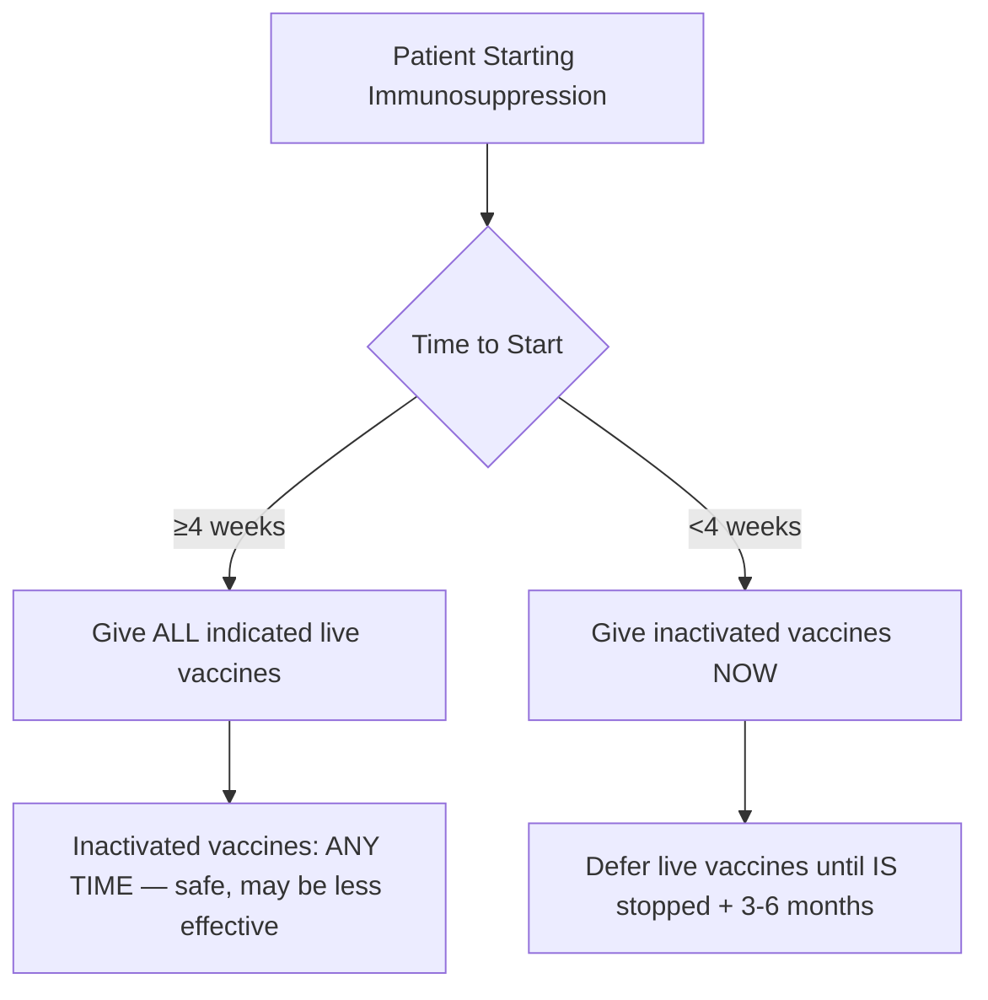
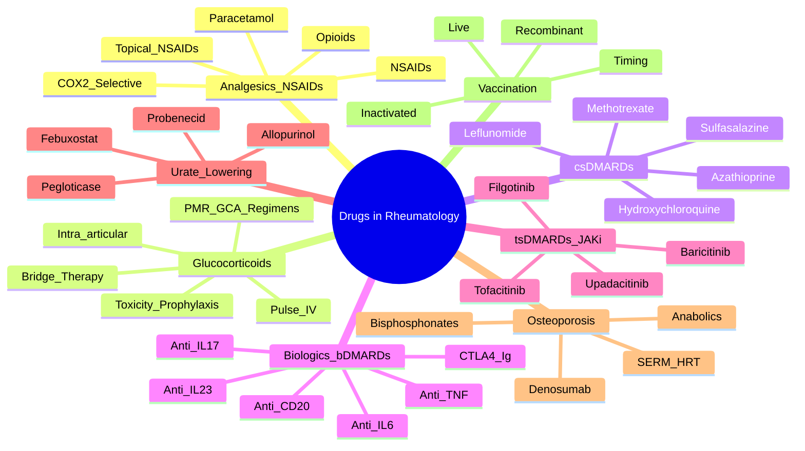

# Drugs in Rheumatology

> [!tip] **FCPS/MRCP Priority: HIGH**
> DMARD/biologic mechanisms, monitoring, step-up therapy, pregnancy safety, and vaccine timing are **guaranteed SBA/viva topics**. Know the "anchor drug" concept and treat-to-target strategy.

---

## Learning Objectives
By the end of this note you should be able to:
- [ ] Classify rheumatology drugs by mechanism and line of therapy
- [ ] Prescribe and monitor csDMARDs (MTX, SSZ, LEF, HCQ, AZA) with correct dosing and surveillance
- [ ] Select biologics by mechanism (anti-TNF, anti-IL6, anti-IL17/23, anti-CD20, CTLA4-Ig, JAKi)
- [ ] Manage glucocorticoids (bridge, pulse, taper, bone protection)
- [ ] Apply urate-lowering therapy (allopurinol, febuxostat) with HLA-B*5801 screening
- [ ] Prescribe osteoporosis drugs (bisphosphonates, denosumab, anabolics) with monitoring
- [ ] Navigate vaccination in immunosuppressed patients (live vs inactivated, timing)

---

## 1. Treatment Paradigm — Treat-to-Target

```mermaid
flowchart TD
    A[New Inflammatory Arthritis Diagnosis] --> B{Clinical Phenotype}
    B -->|RA| C[Start csDMARD ASAP — MTX anchor]
    B -->|PsA| D[csDMARD (MTX/SSZ) or biologic if axial/enthesitis]
    B -->|Axial SpA| E[NSAID → anti-TNF/IL-17 if inadequate]
    B -->|SLE| F[HCQ baseline + glucocorticoid ± MMF/AZA/CYC for organ]
    B -->|Vasculitis| G[Glucocorticoid + CYC/RTX induction → AZA/RTX/MTX maintenance]
    C --> H[Target: Remission/Low Disease Activity]
    H --> I[Monitor DAS28/CDAI/SDAI q1-3mo]
    I -->|Not at target 3-6mo| J[Step up: add/biologic]
    J --> K[Anti-TNF → non-TNF biologic → JAKi]
```

> [!important] **EULAR Treat-to-Target Principles**
> 1. **Early diagnosis** and **early csDMARD** initiation
> 2. **Target**: remission (preferred) or low disease activity
> 3. **Monitor** disease activity **every 1-3 months** until target
> 4. **Adjust therapy** if target not met by 3-6 months
> 5. **Tapering** only after sustained remission

---

## 2. Analgesics & NSAIDs — Symptomatic Control

| Drug | Dose | Key Points | Contraindications/Cautions |
|------|------|------------|---------------------------|
| **Paracetamol** | 1g QDS (max 4g/day) | First-line OA, safe in elderly/CKD | Hepatic impairment, alcohol |
| **Weak opioids** (codeine, tramadol) | PRN | Short-term breakthrough pain | Constipation, falls, dependence |
| **NSAIDs** (ibuprofen, naproxen, diclofenac) | Standard doses | **COX-1**: gastric protection; **COX-2**: CV risk | **GI bleed, CKD, HF, IHD, elderly** → add PPI; avoid in 3rd trimester |
| **COX-2 selective** (celecoxib, etoricoxib) | Lower GI risk | Higher CV risk (MI/stroke) | Avoid established IHD/CVD |
| **Topical NSAIDs** | QID | First-line knee/hand OA | Local reaction only |

> [!warning] **NSAID + PPI Co-prescription Indications**
> - Age >65
> - Prior GI bleed/ulcer
> - Concurrent steroid/anticoagulant/SSRI
> - High-dose/long-term NSAID
> - **H. pylori** positive

---

## 3. Glucocorticoids — Bridge, Pulse, Taper

| Regimen | Indication | Dose | Monitoring |
|---------|------------|------|------------|
| **Bridge therapy** | RA/SpA flare, awaiting DMARD effect | Prednisolone 10-20mg daily → taper over 4-8 weeks | BP, glucose, weight, bone protection |
| **Pulse IV methylprednisolone** | Severe SLE nephritis, vasculitis, myositis, GCA visual threat | 500-1000mg daily × 3 days → oral taper | Cardiac monitor, glucose, K+, infection screen |
| **Intra-articular** | Mono/pauciarticular flare (RA, PsA, OA, gout) | Methylprednisolone 40-80mg (large), 20-40mg (med), 10-20mg (small) | Max 3-4/year per joint; septic screen first |
| **PMR/GCA** | PMR: 15-20mg; GCA: 40-60mg (IV pulse if visual threat) | Taper by 2.5mg q2-4wk to 10mg, then 1mg/month | ESR/CRP, symptoms, GCA screening at each visit |

### Steroid Toxicity & Prophylaxis

| Toxicity | Prophylaxis / Management |
|----------|-------------------------|
| **Osteoporosis** | **All patients >7.5mg pred >3 months**: Ca 1g + Vit D 800-1000 IU + **bisphosphonate** (alendronate 70mg weekly) |
| **GI ulcer** | PPI if +NSAID or risk factors |
| **Hyperglycaemia** | Monitor HbA1c/glucose; adjust diabetic meds |
| **Hypertension** | Monitor BP; treat per guidelines |
| **Cataract/Glaucoma** | Annual ophthalmology if long-term |
| **Infection** | Vaccinate **before** starting (see section 8); PJP prophylaxis if >20mg pred + other IS |
| **Adrenal suppression** | Taper slowly; stress-dose steroids if ill/surgery |

---

## 4. csDMARDs (Conventional Synthetic DMARDs) — The Anchors

### Methotrexate (MTX) — **Anchor csDMARD for RA, PsA, JIA, Vasculitis**

| Parameter | Detail |
|-----------|--------|
| **Mechanism** | DHFR inhibition → adenosine accumulation (anti-inflammatory) + polyglutamation |
| **Dose** | **7.5-25mg ONCE WEEKLY** (oral/SC); split dose (e.g., 3 doses 12hr apart) if GI intolerance |
| **Folic Acid** | **5mg weekly** (24-48hr AFTER MTX) — reduces mucositis, LFT derangement, cytopenias |
| **Onset** | 4-8 weeks (max 12 weeks) |
| **Monitoring** | **Baseline**: FBC, LFT, U&E, Cr, Hep B/C/HIV, CXR, albumin, pregnancy test |
| | **Monthly ×3**, then **3-monthly**: FBC, LFT, U&E, Cr |
| **Toxicity** | **Hepatotoxicity** (fibrosis/cirrhosis — cumulative dose), **myelosuppression**, **pneumonitis** (acute hypersensitivity), **mucositis**, **infection** |
| **Pregnancy** | **CONTRAINDICATED (teratogenic)** — stop 3 months pre-conception (M/F) |
| **Key Interactions** | **TMP-SMX** (↑ MTX levels — avoid), NSAIDs (↓ renal clearance), PPIs (↑ MTX levels), penicillins |

> [!critical] **MTX Pneumonitis**
> - Dry cough, dyspnoea, fever, bilateral infiltrates, **eosinophilia** (sometimes)
> - **Diagnosis of exclusion** — stop MTX, HRCT, consider biopsy
> - **Rechallenge contraindicated**

### Sulfasalazine (SSZ) — RA, PsA, AS (peripheral), IBD-associated arthritis

| Parameter | Detail |
|-----------|--------|
| **Dose** | Start 500mg daily → escalate weekly by 500mg → **target 2-3g daily** (divided BD) |
| **Monitoring** | Baseline + monthly ×3, then 3-monthly: FBC, LFT, U&E |
| **Toxicity** | **Neutropenia** (early, idiosyncratic), **hepatotoxicity**, **rash**, **male infertility** (reversible oligospermia), **G6PD deficiency** (haemolysis) |
| **Pregnancy** | **SAFE** (continue); folic acid 5mg daily (SSZ inhibits folate absorption) |
| **Key Pearl** | **G6PD screen before starting** in high-risk populations |

### Leflunomide (LEF) — RA, PsA (alternative to MTX)

| Parameter | Detail |
|-----------|--------|
| **Mechanism** | Dihydroorotate dehydrogenase (DHODH) inhibition → pyrimidine synthesis blockade |
| **Dose** | **Loading 100mg daily ×3 days** (optional) → **10-20mg daily** |
| **Half-life** | **2 weeks** (active metabolite) — **washout with cholestyramine 8g TDS ×11 days** if pregnancy/toxicity |
| **Monitoring** | Baseline + monthly ×3, then 3-monthly: FBC, LFT, **BP** (hypertension), weight |
| **Toxicity** | **Hepatotoxicity**, **hypertension**, **diarrhoea**, **alopecia**, **peripheral neuropathy**, **teratogenic** |
| **Pregnancy** | **CONTRAINDICATED** — M/F washout required (cholestyramine) |
| **Key Interaction** | **Warfarin** (↑ INR — monitor), **TMP-SMX** (↑ LEF levels) |

### Hydroxychloroquine (HCQ) — SLE (baseline), RA (mild), Sjögren's, pregnancy

| Parameter | Detail |
|-----------|--------|
| **Mechanism** | Lysosomal pH ↑ → TLR inhibition, antigen processing ↓, anti-thrombotic |
| **Dose** | **≤5mg/kg actual body weight daily** (max 400mg) — **retinal toxicity dose-dependent** |
| **Monitoring** | **Baseline + annual ophthalmology** (10-2 visual field, OCT, fundus autofluorescence) after 5 years (or earlier if risk factors) |
| **Toxicity** | **Retinopathy** (bull's eye maculopathy — **irreversible**), **cardiomyopathy** (rare), **GI**, **skin pigmentation** |
| **Pregnancy** | **SAFE** — continue throughout |
| **Key Pearl** | **Baseline ophthalmology mandatory**; risk factors: >5 years, >5mg/kg, renal impairment, tamoxifen, pre-existing maculopathy |

### Azathioprine (AZA) — SLE, vasculitis maintenance, myositis, IBD, steroid-sparing

| Parameter | Detail |
|-----------|--------|
| **Mechanism** | Purine analogue → 6-MP → inhibits DNA synthesis |
| **Dose** | **1-3mg/kg daily** (adjust for TPMT) |
| **TPMT Testing** | **Mandatory before starting** — low activity = ↓ dose (10-25%) or avoid; absent = avoid |
| **Monitoring** | Baseline + monthly ×3, then 3-monthly: FBC, LFT |
| **Toxicity** | **Myelosuppression** (TPMT-related), **hepatotoxicity** (cholestatic), **pancreatitis**, **infection**, **malignancy** (skin, lymphoma) |
| **Pregnancy** | **SAFE** (continue) — fetal TPMT protects |
| **Key Interaction** | **Allopurinol** (↑ 6-MP → severe myelosuppression — **avoid or ↓ AZA to 25% dose**) |

---

## 5. Biologics (bDMARDs) — Mechanism-Based Selection

| Class | Agents | Indications (Key) | Mechanism | Key Monitoring |
|-------|--------|-------------------|-----------|----------------|
| **Anti-TNF** | Infliximab, adalimumab, etanercept, certolizumab, golimumab | RA, PsA, AS, axial SpA, Crohn's, UC, uveitis, JIA | Bind TNF-α (mAb) or TNF receptor fusion (etanercept) | **TB screen (IGRA) pre-Rx**, Hep B/C, LFT, FBC, demyelination, heart failure |
| **Anti-IL-6R** | Tocilizumab, sarilumab | RA, GCA, Still's, JIA, CRS | Block IL-6 receptor | **Neutropenia, thrombocytopenia, ↑ LFT, ↑ lipids, GI perforation**, infection |
| **Anti-IL-17** | Secukinumab, ixekizumab, bimekizumab | PsA, AS, axial SpA, psoriasis | Block IL-17A (secukinumab/ixekizumab) or IL-17A/F (bimekizumab) | **Candida infections**, IBD exacerbation (avoid in Crohn's), neutropenia |
| **Anti-IL-23** | Guselkumab, risankizumab | PsA, psoriasis, Crohn's | Block IL-23p19 | Upper respiratory infection, liver enzyme elevation |
| **Anti-CD20** | Rituximab, ocrelizumab, ofatumumab | RA (anti-TNF fail), ANCA vasculitis, SLE, myositis, pemphigus | B-cell depletion | **Hep B reactivation**, IgG monitoring, infusion reactions, PML (rare) |
| **CTLA4-Ig** | Abatacept | RA (anti-TNF fail), JIA | Block CD80/86 → inhibits T-cell co-stimulation | Infection, COPD exacerbation, malignancy |
| **Anti-IL-1** | Anakinra, canakinumab | Still's, FMF, CAPS, gout (refractory) | Block IL-1 receptor (anakinra) or IL-1β (canakinumab) | Injection site reaction (anakinra), infection |

> [!important] **Biologic Sequencing (RA Example)**
> 1. **csDMARD failure (MTX ± combo)** → **Anti-TNF** (adalimumab/etanercept/certolizumab — SC preferred)
> 2. **Anti-TNF failure** (primary/secondary non-response) → **Non-TNF biologic**: rituximab (if RF+), tocilizumab, abatacept
> 3. **Multiple biologic failure** → **JAK inhibitor** (if no contraindication) or switch mechanism

> [!warning] **Pre-Biologic Screening (MANDATORY)**
> - **TB**: IGRA (Quantiferon/T-SPOT) + CXR — treat latent TB **before** starting
> - **Hepatitis B**: HBsAg, anti-HBc, anti-HBs — if HBsAg+ or anti-HBc+ → antiviral prophylaxis (entecavir/tenofovir)
> - **Hepatitis C**: RNA PCR — treat before biologic (DAA)
> - **HIV**: screen if risk factors
> - **Vaccination status**: update **inactivated** vaccines; **live vaccines 4 weeks BEFORE** starting

---

## 6. Targeted Synthetic DMARDs (tsDMARDs) — JAK Inhibitors

| Drug | Selectivity | Indications | Key Toxicity | Contraindications |
|------|-------------|-------------|--------------|-------------------|
| **Tofacitinib** | JAK1/3 > JAK2 | RA, PsA, UC | **VTE (PE/DVT)**, herpes zoster, cytopenias, ↑ LFT, ↑ lipids, GI perforation | **High VTE risk**, active infection, pregnancy, severe hepatic |
| **Baricitinib** | JAK1/2 | RA, alopecia areata | VTE, infection, cytopenias, ↑ lipids, ↑ CK | eGFR <30, VTE risk |
| **Upadacitinib** | JAK1 | RA, PsA, AS, UC, Crohn's, atopic dermatitis | VTE, zoster, cytopenias | VTE risk, active TB |
| **Filgotinib** | JAK1 | RA, UC | Spermatogenesis effects (animal), infection | Pregnancy |

> [!critical] **JAK Inhibitor Black Box Warnings (FDA/EMA)**
> - **VTE (DVT/PE)** — avoid in high risk (prior VTE, surgery, immobilisation, obesity, oestrogen)
> - **Malignancy** (lymphoma, skin)
> - **Serious infections** (TB, herpes zoster — **vaccinate with Shingrix BEFORE starting**)
> - **Cardiovascular events** (MI, stroke) — caution in >50 with CV risk factors

---

## 7. Urate-Lowering Therapy (ULT) — Gout

| Drug | Dose & Titration | Monitoring | Key Points |
|------|------------------|------------|------------|
| **Allopurinol** | **Start low (50-100mg daily) → go slow** ↑ 100mg q2-4wk to target urate <300 µmol/L (max 900mg) | Urate q4wk during titration; FBC, LFT, Cr baseline + monitoring | **HLA-B*5801 screen** in Han Chinese, Thai, Korean, African American (SCAR risk); **renal dose adjust**; **continue during acute flare** |
| **Febuxostat** | 40mg daily → ↑ 80mg if urate not <300 µmol/L | Urate, LFT, CV monitoring | **Non-purine** (OK in CKD); **CARES trial**: ↑ CV death vs allopurinol — **2nd line** |
| **Probenecid** | 500mg BD → ↑ 1g BD (max 2g BD) | Urate, renal function, urine pH | **Uricosuric** — needs GFR >30, adequate hydration, alkalinisation; **contraindicated in urolithiasis** |
| **Pegloticase** | IV 8mg q2 weeks (refractory) | Urate, infusion reactions, anaphylaxis | **PEGylated uricase** — immunogenicity, infusion reactions; **specialist only** |

> [!critical] **ULT Initiation Rules**
> 1. **Start AFTER acute flare settles** (not during)
> 2. **Prophylaxis**: colchicine 500mcg BD or NSAID/low-dose pred **for 6 months** (prevents flare on initiation)
> 3. **Target serum urate <300 µmol/L (5 mg/dL)** — <360 µmol/L if tophi
> 4. **Don't stop ULT during flares** — treat flare separately

---

## 8. Osteoporosis Drugs

| Class | Agents | Dose | Monitoring | Key Points |
|-------|--------|------|------------|------------|
| **Oral Bisphosphonates** | Alendronate 70mg weekly, risedronate 35mg weekly | **Upright 30 min + water 200ml + fast 30 min** | DEXA 2-3 yearly; dental review | **1st line**; ONJ risk (low), atypical femoral fracture (long-term >5yr) |
| **IV Bisphosphonates** | Zoledronate 5mg yearly | CrCl >35, Ca/Vit D replete pre-infusion | Acute phase reaction (flu-like 24-48h) | Alternative if oral intolerant/CKD |
| **Denosumab** | 60mg SC q6mo | **Hypocalcaemia risk** — Ca/Vit D mandatory; CrCl <30 caution | **Rebound vertebral fractures if stopped** → transition to bisphosphonate | **No renal clearance** (OK in CKD); 2nd line |
| **Anabolics** | Teriparatide 20µg SC daily ×24mo, Romosozumab 210mg SC monthly ×12mo | PTH(1-34) / anti-sclerostin | Hypercalcaemia (teriparatide), CV (romosozumab) | **Severe osteoporosis** (T-score ≤-3.5 or fracture on BP); specialist |
| **SERM** | Raloxifene 60mg daily | DEXA, VTE risk | ↑ VTE, hot flushes | Postmenopausal only; breast cancer reduction |
| **HRT** | Oestrogen ± progestogen | — | VTE, stroke, breast cancer | Not 1st line for osteoporosis |

---

## 9. Vaccination in Immunosuppressed Patients



| Vaccine Type | Examples | Timing Relative to IS | Notes |
|--------------|----------|----------------------|-------|
| **Inactivated** | Influenza (annual), **Pneumococcal** (PCV13 → PPSV23), COVID-19, Hepatitis B, HPV, Tetanus, Diphtheria, Pertussis, Meningococcal | **ANY TIME** — safe, give before IS if possible | **Response may be blunted** — check titres if high risk |
| **Live Attenuated** | **MMR, Varicella, Zoster (Zostavax), Yellow fever, Oral typhoid, BCG, Rotavirus, Nasal flu** | **≥4 WEEKS BEFORE** starting IS | **CONTRAINDICATED** on biologics, JAKi, >20mg pred, AZA >3mg/kg, MTX >0.4mg/kg |
| **Recombinant/Subunit** | **Shingrix (RZV)**, Hepatitis B, HPV, MenB | **SAFE ANY TIME** — preferred for zoster | **Shingrix = 2 doses 2-6 months apart** — give BEFORE JAKi/biologic if possible |

> [!important] **Steroid Dose Thresholds for Live Vaccines**
> - **<20mg pred daily (or <1mg/kg)** → live vaccines OK
> - **≥20mg pred daily for ≥2 weeks** → wait **3 months after stopping** for live vaccines
> - **Pulse IV methylprednisolone** → wait **1 month**

---

## 10. FCPS/MRCP High-Yield Drug Summary Tables

### csDMARD Quick Reference

| Drug | Dose | Monitoring | Pregnancy | Key Toxicity |
|------|------|------------|-----------|--------------|
| **Methotrexate** | 7.5-25mg weekly | FBC, LFT, Cr monthly→3mo | **Contraindicated** (stop 3mo pre) | Hepatotoxicity, pneumonitis, myelosuppression |
| **Sulfasalazine** | 2-3g daily | FBC, LFT, U&E monthly→3mo | **Safe** (+ folic acid 5mg) | Neutropenia, male infertility, G6PD haemolysis |
| **Leflunomide** | 10-20mg daily | FBC, LFT, **BP** monthly→3mo | **Contraindicated** (washout) | Hepatotoxicity, hypertension, teratogenic |
| **Hydroxychloroquine** | ≤5mg/kg daily | **Annual ophthalmology** (after 5yr) | **Safe** | Retinopathy (irreversible) |
| **Azathioprine** | 1-3mg/kg daily | FBC, LFT monthly→3mo | **Safe** | Myelosuppression (TPMT), pancreatitis |

### Biologic Quick Reference

| Class | Agent Examples | Key Pre-Rx Screen | Key Monitoring | Pregnancy |
|-------|----------------|-------------------|----------------|-----------|
| **Anti-TNF** | Adalimumab, etanercept, infliximab | **TB (IGRA), Hep B/C, HIV** | FBC, LFT, infection, demyelination, HF | **Certolizumab** safe (no Fc); others: 2nd/3rd tri decision |
| **Anti-IL6** | Tocilizumab, sarilumab | TB, Hep B/C | **Neutropenia, thrombocytopenia, ↑LFT, ↑lipids** | Avoid |
| **Anti-IL17** | Secukinumab, ixekizumab | TB, Hep B/C | **Candida, IBD flare** | Avoid |
| **Anti-CD20** | Rituximab | **Hep B (reactivation!), TB** | **IgG levels, B-cells (CD19), infection** | Avoid (B-cell depletion in fetus) |
| **JAKi** | Tofacitinib, baricitinib, upadacitinib | TB, Hep B/C, **VTE risk assessment** | **VTE, zoster, cytopenias, ↑LFT, ↑lipids** | Contraindicated |

### ULT & Osteoporosis Quick Reference

| Drug | Target | Key Initiation Rule | Pregnancy |
|------|--------|--------------------|-----------|
| **Allopurinol** | Urate <300 | Start low/go slow; **HLA-B*5801** high-risk; **prophylaxis 6mo** | Safe |
| **Febuxostat** | Urate <300 | 2nd line (CV risk); no renal adjust | Avoid |
| **Denosumab** | BMD ↑ | **Ca/Vit D mandatory**; no renal adjust | Avoid |
| **Bisphosphonates** | BMD ↑ | Upright 30min; renal adjust (CrCl<35) | Avoid |

---

## 11. Viva Questions (MRCP Part 1/2, PACES, FCPS)

| Question | Expected Answer |
|----------|----------------|
| "A 35-year-old woman with RA wants to conceive. She's on methotrexate 20mg weekly. What do you advise?" | **Stop MTX 3 months pre-conception** (teratogenic). Switch to **HCQ** (safe) ± **sulfasalazine** (safe + folic acid 5mg). Folic acid 5mg daily throughout. |
| "What is the monitoring schedule for methotrexate?" | Baseline FBC/LFT/U&E/Cr/HepB/C/HIV/CXR/pregnancy. **Monthly ×3, then 3-monthly**. Folic acid 5mg weekly 24h after MTX. |
| "A patient on MTX develops dry cough and dyspnoea. CXR shows bilateral interstitial infiltrates. What do you suspect?" | **MTX pneumonitis** (diagnosis of exclusion). **Stop MTX immediately**. HRCT, consider BAL/biopsy. **Never rechallenge**. |
| "Why do we screen for HLA-B*5801 before allopurinol?" | Risk of **SCAR (Stevens-Johnson/TEN, DRESS)** — high in Han Chinese, Thai, Korean, African American. Screen before starting. |
| "A patient on rituximab develops hepatitis B reactivation. What prophylaxis should have been given?" | **Anti-HBc positive (past exposure) or HBsAg positive** → **entecavir/tenofovir prophylaxis** starting **before** rituximab and continuing **12 months after** last dose. |
| "What is the target serum urate for gout treatment?" | **<300 µmol/L (5 mg/dL)**; **<360 µmol/L (6 mg/dL)** if tophi present. |
| "A 60-year-old woman on prednisolone 10mg daily for PMR. DEXA T-score -2.8. What bone protection?" | **Ca 1g + Vit D 800-1000 IU + oral bisphosphonate (alendronate 70mg weekly)** — all patients >7.5mg pred >3 months. |
| "Can you give live vaccines to a patient on adalimumab?" | **No** — contraindicated on biologics. Give **inactivated vaccines anytime**; live vaccines **≥4 weeks before** starting biologic. Use **Shingrix (recombinant)** for zoster. |
| "What is the washout for leflunomide if pregnancy planned?" | **Cholestyramine 8g TDS ×11 days** (or activated charcoal) → verify plasma levels <0.02mg/L ×2 at 14-day interval. |
| "A patient on tofacitinib develops DVT. What do you do?" | **Stop JAKi immediately**. Therapeutic anticoagulation. **Do not restart JAKi** — switch mechanism. Assess VTE risk factors before starting. |

---

## 12. Confusions & Mnemonics

| Confusion | Clarification |
|-----------|---------------|
| **MTX weekly vs daily** | **ONCE WEEKLY ONLY** — daily dosing = fatal myelosuppression. Prescribe "weekly" explicitly. |
| **Folic acid timing with MTX** | **24-48 hours AFTER MTX** — not same day (reduces efficacy). 5mg weekly. |
| **Leflunomide washout** | **Cholestyramine 8g TDS ×11 days** — half-life 2 weeks without washout. |
| **HCQ retinal screening** | **Baseline + annual after 5 years** (earlier if risk factors). OCT + 10-2 visual field + fundus autofluorescence. |
| **Allopurinol in acute gout** | **Do NOT start during acute flare** — wait until settled. Continue if already on it. |
| **Denosumab discontinuation** | **Rebound vertebral fractures** — **must transition to bisphosphonate** after stopping. |
| **JAKi VTE risk** | **Avoid in high VTE risk** (prior VTE, surgery, immobilisation, obesity, oestrogen). |
| **Certolizumab in pregnancy** | **Only anti-TNF safe in 3rd trimester** (no Fc — no placental transfer). Others: stop by 20-24 weeks. |

**Mnemonic: csDMARD Monitoring = "F.L.U."**
- **F**BC
- **L**FT
- **U**&E/Cr

**Mnemonic: Pre-Biologic = "T.H.H."** (TB, Hepatitis B/C, HIV)

**Mnemonic: Steroid Bone Protection = "ALL >7.5mg >3mo"**
- **A**lert → **C**a/Vit D → **B**isphosphonate

**Mnemonic: Live Vaccines = "MMR VZV Yellow BCG"**
- **M**MR, **V**aricella/**Z**oster (Zostavax), **Y**ellow fever, **B**CG

---

## 13. Mind Map



---

## 14. One-Page Revision Card

| Drug Class | Key Drug | Dose/Route | Monitoring | Pregnancy | Top Toxicity |
|------------|----------|------------|------------|-----------|--------------|
| **Anchor csDMARD** | Methotrexate | 7.5-25mg weekly | FBC/LFT/Cr monthly→3mo | **X** (stop 3mo) | Hepatotoxicity, pneumonitis |
| **Safe in pregnancy** | Sulfasalazine | 2-3g daily | FBC/LFT/U&E monthly→3mo | ✓ (+ folate) | Neutropenia, infertility |
| **Safe in pregnancy** | Hydroxychloroquine | ≤5mg/kg daily | **Annual eye (5yr+)** | ✓ | Retinopathy (irreversible) |
| **Teratogenic** | Leflunomide | 10-20mg daily | FBC/LFT/BP monthly→3mo | **X** (washout) | Hepatotoxicity, HTN |
| **Safe in pregnancy** | Azathioprine | 1-3mg/kg daily | FBC/LFT monthly→3mo | ✓ | Myelosuppression (TPMT) |
| **1st biologic** | Anti-TNF (adalimumab) | SC q2wk | TB/HepB pre; FBC/LFT | Certolizumab only | TB reactivation, demyelination |
| **Non-TNF biologic** | Rituximab | IV q6mo | **HepB prophylaxis**, IgG | **X** | B-cell depletion, PML |
| **JAK inhibitor** | Tofacitinib | 5mg BD | **VTE risk**, zoster, FBC/LFT | **X** | VTE, herpes zoster |
| **ULT 1st line** | Allopurinol | 100→300→900mg | Urate q4wk titration | ✓ | SCAR (HLA-B*5801) |
| **Bone 1st line** | Alendronate | 70mg weekly | DEXA 2-3yr | **X** | ONJ, atypical femur fx |
| **Bone 2nd line** | Denosumab | 60mg SC q6mo | **Ca/Vit D**, hypocalcaemia | **X** | Rebound fx if stopped |

---

## 15. Spaced Repetition Trackers

| Review Interval | Date Completed | Confidence (1-5) | Notes |
|-----------------|----------------|------------------|-------|
| 24 hours | | | |
| 7 days | | | |
| 15 days | | | |
| 30 days | | | |
| 90 days | | | |

---

## 16. Self-Test Scorecard

| Section | Score /5 | Last Attempt |
|---------|----------|--------------|
| csDMARD Dosing & Monitoring | | |
| Biologic Selection & Sequencing | | |
| Pre-Biologic Screening | | |
| JAK Inhibitor Contraindications | | |
| ULT Initiation Rules | | |
| Osteoporosis Drug Selection | | |
| Vaccination Timing | | |
| Pregnancy Safety | | |
| Viva Questions | | |

---

## Local Navigation
- **Parent Heading**: [[../Clinical Approach to Musculoskeletal Disease|Clinical Approach to Musculoskeletal Disease]]
- **Parent Topic Group**: [[Clinical approach]]
- **Previous Topic**: [[Investigations in rheumatology]]
- **Chapter Map**: [[../Davidson Chapter 26 - Rheumatology Hierarchy|Rheumatology Hierarchy]]
- **Chapter MOC**: [[../Rheumatology MOC|Rheumatology MOC]]