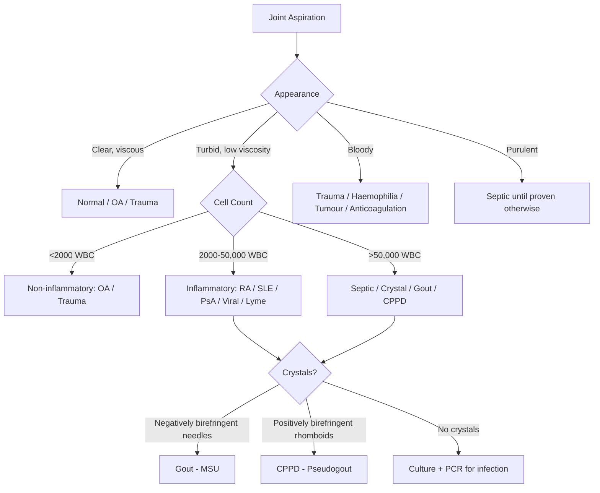
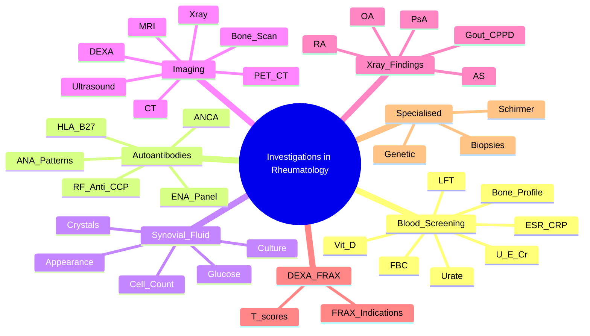

# Investigations in Rheumatology

> [!tip] **FCPS/MRCP Priority: HIGH**
> Interpretation of autoantibodies, acute phase reactants, joint fluid, and imaging is **core SBA/viva territory**. Know sensitivity/specificity, patterns, and clinical context for every test.

---

## Learning Objectives
By the end of this note you should be able to:
- [ ] Interpret autoimmune serology (RF, anti-CCP, ANA, ENA, ANCA, HLA-B27) with sensitivity/specificity
- [ ] Differentiate ANA patterns and their clinical associations
- [ ] Analyse synovial fluid (cell count, crystals, culture, glucose) for infection vs crystal vs inflammatory
- [ ] Read DEXA T-scores and apply FRAX
- [ ] Identify characteristic X-ray findings in RA, AS, PsA, OA, gout, CPPD
- [ ] Select appropriate imaging modality (X-ray, US, MRI, CT, DEXA, bone scan)

---

## 1. Blood Screening — Baseline & Monitoring

| Test | Indication | Normal | Key Abnormalities in Rheum |
|------|------------|--------|----------------------------|
| **FBC** | Baseline, DMARD monitoring, infection, anaemia of chronic disease | Hb 130-180/115-165 | **Anaemia of chronic disease** (normocytic, low Fe, high ferritin), **thrombocytosis** (inflammatory), **leukopenia** (SLE, Felty's, DMARDs) |
| **ESR** | Inflammation screen, PMR/GCA, RA activity, infection | <20/30 mm/hr (age/sex) | **Markedly elevated** (>50-100): PMR, GCA, vasculitis, infection, malignancy, myeloma |
| **CRP** | Acute inflammation, RA activity, infection, response to Rx | <5-10 mg/L | Rises/falls faster than ESR; **discordant ESR↑/CRP normal** = paraproteinaemia, SLE (low CRP despite activity) |
| **U&E/Cr** | Baseline, drug monitoring (NSAID, MTX, LEF, biologics), renal vasculitis | Creatinine 60-110 µmol/L | Renal impairment = drug dose adjustment; **RPGN** = vasculitis/SLE/Goodpasture |
| **LFT** | Baseline, MTX/LEF/AZA/biologic monitoring | ALT/AST <40 U/L | **MTX/LEF**: hepatotoxicity; **cholestatic** = PBC/PSC (ANA/AMA); **hepatic** = drug, viral, autoimmune hepatitis |
| **Bone Profile** | Osteoporosis, Paget's, myeloma, vitamin D, hyperparathyroidism | Ca 2.2-2.6, PO4 0.8-1.4, ALP 30-130 | **High ALP**: Paget's, osteomalacia, fracture, hepatic; **Low Ca/PO4**: osteomalacia, vit D deficiency; **High Ca**: hyperparathyroidism, malignancy, sarcoid |
| **Vitamin D** | Osteoporosis, osteomalacia, steroid users | >50 nmol/L (20 ng/mL) | **<30 nmol/L** = deficiency; **<50 nmol/L** = insufficiency — treat in all on steroids |
| **Urate** | Gout diagnosis/monitoring | M 200-420, F 140-360 µmol/L | **>360 µmol/L (6 mg/dL)** = hyperuricaemia; **but normal urate ≠ no gout** (acute phase lowers urate) |

---

## 2. Autoantibodies — The FCPS/MRCP Core

### Rheumatoid Factor (RF) & Anti-CCP

| Feature | **RF (IgM)** | **Anti-CCP** |
|---------|--------------|--------------|
| **Sensitivity (RA)** | 70-80% | 60-70% |
| **Specificity (RA)** | 85% (low — +ve in SLE, Sjögren's, infections, elderly) | **95-98%** |
| **Prognostic Value** | Moderate — high titre = worse | **High** — predicts erosive disease, earlier onset |
| **Timing** | Can precede symptoms by years | Can precede symptoms by years |
| **Clinical Use** | Support RA diagnosis | **Confirm RA**, prognosticate, guide early aggressive Rx |

> [!warning] **SBA Trap**
> - **Anti-CCP is MORE SPECIFIC than RF for RA** (95% vs 85%)
> - **RF positive + anti-CCP negative** → think Sjögren's, SLE, chronic infection, cryoglobulinaemia, elderly
> - **Anti-CCP positive + RF negative** → still RA (especially early)

### ANA (Antinuclear Antibody) — Patterns Matter

| Pattern | Antigen Target | Key Associations | FCPS/MRCP Pearl |
|---------|----------------|------------------|-----------------|
| **Homogeneous (diffuse)** | dsDNA, histones | **SLE** (dsDNA), drug-induced lupus | dsDNA = specific for SLE |
| **Speckled** | ENA (Sm, RNP, Ro/SS-A, La/SS-B) | SLE, MCTD, Sjögren's, scleroderma | **Sm = 99% specific SLE**; **RNP = MCTD** (high titre) |
| **Nucleolar** | Fibrillarin, PM-Scl, Th/To | **Systemic sclerosis** (limited > diffuse) | Scl-70 (topo I) = diffuse scleroderma |
| **Centromere** | CENP-B | **Limited scleroderma (CREST)** | CREST = Calcinosis, Raynaud's, Oesophageal, Sclerodactyly, Telangiectasia |
| **Rim (peripheral)** | dsDNA | **SLE** | Same as homogeneous for dsDNA |

> [!important] **ANA Titres**
> - **Screening**: usually 1:80 or 1:160 cutoff
> - **Low titre (1:80-1:160)**: can be normal elderly, infections, drugs
> - **High titre (≥1:320, especially 1:640+)**: clinically significant
> - **ANA negative SLE**: rare (<5%) — consider anti-Ro/SS-A only (subacute cutaneous, neonatal lupus)

### ENA (Extractable Nuclear Antigens) Panel

| Antibody | Specificity | Key Clinical Association | Sensitivity |
|----------|-------------|-------------------------|-------------|
| **Anti-Sm** | **99% SLE** | SLE (pathognomonic) | 20-30% |
| **Anti-dsDNA** | **95% SLE** | SLE, **lupus nephritis** (correlates with activity) | 70% |
| **Anti-Ro/SS-A** | 90% | Sjögren's (primary), subacute cutaneous SLE, neonatal lupus (heart block), SLE | 30-40% (SLE), 70% (Sjögren's) |
| **Anti-La/SS-B** | 95% | Sjögren's (always with Ro), SLE | 30-50% (Sjögren's) |
| **Anti-RNP** | 95% | **MCTD** (very high titre), SLE, scleroderma | 100% MCTD |
| **Anti-Scl-70 (Topo I)** | 95% | **Diffuse systemic sclerosis**, ILD risk | 20-30% |
| **Anti-centromere** | 98% | **Limited scleroderma (CREST)**, PAH risk | 60-80% |
| **Anti-Jo-1** | 80% | **Polymyositis/DM** + ILD (antisynthetase syndrome) | 20-30% |
| **Anti-PM-Scl** | 90% | **Overlap myositis-scleroderma** | 10-15% |

### ANCA (Anti-Neutrophil Cytoplasmic Antibodies)

| Pattern | Target | Specificity | Key Associations | FCPS/MRCP Pearl |
|---------|--------|-------------|------------------|-----------------|
| **c-ANCA** (cytoplasmic) | **PR3** (proteinase 3) | **90%** | **GPA (Granulomatosis with Polyangiitis)** | **c-ANCA/PR3 = GPA** |
| **p-ANCA** (perinuclear) | **MPO** (myeloperoxidase) | 70-80% | **MPA (Microscopic Polyangiitis)**, **EGPA (Churg-Strauss)** | **p-ANCA/MPO = MPA or EGPA** |
| **Atypical p-ANCA** | BPI, lactoferrin, etc. | Low | IBD (UC > Crohn), PSC, drug-induced | Not vasculitis-specific |

> [!warning] **ANCA Pitfalls**
> - **ANCA-negative vasculitis**: 10-20% GPA/MPA/EGPA — biopsy if high suspicion
> - **Positive ANCA ≠ vasculitis**: infections (endocarditis, TB), drugs (hydralazine, propylthiouracil), IBD, RA
> - **EGPA**: only 40-60% ANCA+ (p-ANCA/MPO); diagnosis = asthma + eosinophilia + vasculitis

### HLA-B27

| Feature | Detail |
|---------|--------|
| **Association** | 90% AS, 50-80% other SpA (PsA, reactive, enteropathic), 6-8% general population |
| **Utility** | **Supportive, not diagnostic** — pre-test probability matters |
| **Negative predictive value** | High in AS (if -ve, AS unlikely); but **not 100%** |
| **FCPS/MRCP** | Young male + inflammatory back pain + HLA-B27+ = AS until proven otherwise |

---

## 3. Synovial Fluid Analysis — The "Liquid Gold"

| Parameter | Normal | Non-inflammatory (OA) | Inflammatory (RA, SLE, SpA) | Septic | Crystal (Gout/CPPD) |
|-----------|--------|----------------------|----------------------------|--------|---------------------|
| **Appearance** | Clear, viscous | Clear/yellow, viscous | Turbid, yellow, low viscosity | Purulent, opaque | Turbid, may have crystals visible |
| **WBC (/µL)** | <200 | <2,000 | 2,000-50,000 | **>50,000** (often >100,000) | 2,000-100,000 |
| **Neutrophils %** | <25% | <25% | 50-70% | **>90%** | Variable (often high) |
| **Viscosity** | High | High | Low | Low | Low |
| **Glucose** | = Serum | = Serum | Low (↓ 10-20 mg/dL) | **Very low (<40 mg/dL or <50% serum)** | Normal or slightly low |
| **Culture** | Sterile | Sterile | Sterile | **Positive** | Sterile |
| **Crystals** | None | None | None | None | **MSU (needle, -ve birefringent) / CPPD (rhomboid, +ve birefringent)** |

> [!critical] **MRCP Pearls: Synovial Fluid**
> - **WBC >50,000 = septic until proven otherwise** — but gout/CPPD can reach 100,000
> - **Always send for: cell count + differential, crystals (polarised light), culture (aerobic/anaerobic/TB/fungal), glucose**
> - **Glucose <50% serum = septic (or TB, RA, gout)**
> - **Polarised microscopy**: **MSU = negatively birefringent needles** (yellow parallel); **CPPD = positively birefringent rhomboids** (blue parallel)
> - **Traumatic tap**: bloody but clots, WBC <50,000, fat globules

---

## 4. Imaging — Modality Selection

| Modality | Best For | Radiation | Cost | FCPS/MRCP Key Points |
|----------|----------|-----------|------|---------------------|
| **X-ray** | Baseline, bony erosions, JSN, alignment, SI joints, chest (ILD) | Low | £ | **First-line**; RA: periarticular osteopenia → JSN → erosions; AS: sacroiliitis grades 1-4 → bamboo spine |
| **Ultrasound** | Synovitis, effusion, tenosynovitis, enthesitis, crystal deposits, guided injection | None | ££ | **More sensitive than X-ray for early synovitis**; power Doppler = active inflammation; "double contour" = gout |
| **MRI** | Early sacroiliitis (AS), bone marrow oedema, enthesitis, spinal cord, occult fracture | None | ££ | **Gold standard for early AS sacroiliitis**; STIR/T2 = active inflammation; T1 = structural damage |
| **CT** | Bony detail (SI joints, spine fracture), chest (ILD), vascular | High | ££ | Better bony detail than MRI for SI joints; low-dose CT chest for ILD |
| **DEXA** | Bone density (osteoporosis), fracture risk | Very low | £ | **T-score ≤-2.5 = osteoporosis**; FRAX for 10-yr fracture risk; Z-score for <50yrs |
| **Bone Scan (Tc-99m)** | Occult fracture, infection, metastases, Paget's, reflex sympathetic dystrophy | Medium | ££ | "Hot spots" = increased turnover; **superscan** = metabolic (Paget's, renal osteodystrophy, mets) |
| **PET-CT** | Vasculitis (large vessel GCA/Takayasu), fever unknown origin, malignancy | High | £££ | **FDG uptake in vessel wall = large vessel vasculitis** |

---

## 5. Characteristic X-ray Findings — Must Know

### Rheumatoid Arthritis (RA)
| Stage | Findings |
|-------|----------|
| **Early** | Periarticular osteopenia, soft tissue swelling |
| **Intermediate** | **Uniform joint space narrowing** (cartilage loss), **marginal erosions** (bare areas) |
| **Late** | **Erosions + JSN + subluxation** (ulnar drift, swan neck, boutonnière), **zipper erosion** (carpometacarpal) |
| **Specific** | **Lunate dorsally subluxed** (caput ulnae syndrome), **carpal collapse** |

### Ankylosing Spondylitis (AS)
| Stage | Findings |
|-------|----------|
| **Sacroiliitis (graded 0-4)** | **Grade 1**: suspicious; **2**: minimal sclerosis/erosion; **3**: definite sclerosis/erosion; **4**: ankylosis (fusion) |
| **Spine** | **Squaring of vertebrae** (loss of lumbar lordosis), **"shiny corners"** (Romanus lesions), **syndesmophytes** (vertical bridging), **bamboo spine** (complete fusion) |
| **Hip/Shoulder** | Protrusio acetabulae, joint space narrowing |

### Psoriatic Arthritis (PsA)
| Pattern | Findings |
|---------|----------|
| **Distal interphalangeal (DIP)** | DIP involvement + nail changes |
| **Arthritis mutilans** | Severe osteolysis → "opera glass hand" / "pencil-in-cup" deformity |
| **Asymmetrical** | "Sausage digit" (dactylitis), periostitis, enthesopathy |

### Osteoarthritis (OA)
| Finding | Kellgren-Lawrence Grade |
|---------|------------------------|
| **Normal** | 0 |
| **Doubtful osteophyte** | 1 |
| **Definite osteophyte, possible JSN** | 2 |
| **Moderate JSN, osteophytes, sclerosis** | 3 |
| **Severe JSN, large osteophytes, sclerosis, cysts, deformity** | 4 |

### Gout / CPPD
| Condition | X-ray Findings |
|-----------|----------------|
| **Gout (chronic)** | **"Punched-out" erosions** with **overhanging edges** (rat-bite), **tophi** (soft tissue masses), **preserved JSN until late**, sclerotic margins |
| **CPPD (Chondrocalcinosis)** | **Linear calcification** of fibrocartilage: **menisci (knee), triangular fibrocartilage (wrist), pubic symphysis, spinal discs** |

---

## 6. DEXA & FRAX — Osteoporosis Assessment

| T-score | Diagnosis | FCPS/MRCP Action |
|---------|-----------|------------------|
| **≥ -1.0** | Normal | Reassure, lifestyle |
| **-1.0 to -2.5** | **Osteopenia** | Lifestyle, Ca/Vit D, FRAX if risk factors |
| **≤ -2.5** | **Osteoporosis** | **Treat** (bisphosphonate 1st line) + Ca/Vit D + falls prevention |
| **≤ -2.5 + fragility fracture** | **Severe/Established osteoporosis** | Treat aggressively (consider anabolic: teriparatide/romosozumab) |

> [!important] **FRAX Indications**
> - Age 40-90, **osteopenia (T-score -1 to -2.5)** with risk factors
> - **Prior fragility fracture**
> - **High-dose steroids (≥7.5mg pred >3 months)**
> - **Secondary causes** (RA, premature menopause, malabsorption, etc.)
> - Calculates **10-year major osteoporotic fracture risk** and **hip fracture risk**

---

## 7. Specialised Investigations

| Test | Indication | Interpretation |
|------|------------|----------------|
| **Synovial biopsy** | Unexplained chronic monoarthritis, suspected TB/sarcoid/amyloid | Granulomas = TB/sarcoid; amyloid = AA amyloid (RA, FMF) |
| **Muscle biopsy** | Suspected myositis, vasculitis | PM: endomysial CD8+; DM: perivascular B cells, MAC; inclusion body myositis: rimmed vacuoles |
| **Nerve biopsy** | Vasculitic neuropathy | Vasculitis: necrotising inflammation |
| **Skin biopsy** | Vasculitis (leukocytoclastic), lupus, dermatomyositis | Leukocytoclastic = small vessel vasculitis; interface dermatitis = lupus/DM |
| **Genetic testing** | Familial Mediterranean fever (MEFV), TRAPS (TNFRSF1A), CAPS (NLRP3), Blau syndrome (NOD2) | Confirm autoinflammatory syndromes |
| **Schirmer's test** | Sjögren's | ≤5mm in 5 min = abnormal |
| **Salivary gland biopsy** | Sjögren's | Focus score ≥1 (lymphocytic foci/4mm²) |

---

## 8. FCPS/MRCP High-Yield Summary Tables

### Autoantibody Quick Reference

| Antibody | Sensitivity | Specificity | Key Disease | Viva Tip |
|----------|-------------|-------------|-------------|----------|
| **Anti-CCP** | 60-70% | **95-98%** | RA | Best for diagnosis + prognosis |
| **RF** | 70-80% | 85% | RA, Sjögren's, infections | Low specificity |
| **ANA** | 95% (SLE) | Low | SLE screen | Titres + pattern matter |
| **Anti-dsDNA** | 70% | **95%** | SLE, nephritis | Correlates with renal activity |
| **Anti-Sm** | 20-30% | **99%** | SLE | Pathognomonic |
| **Anti-Ro/SS-A** | 70% (Sjögren's) | 90% | Sjögren's, neonatal lupus | Neonatal heart block |
| **Anti-La/SS-B** | 30-50% | 95% | Sjögren's | Always with Ro |
| **Anti-RNP** | 100% (MCTD) | 95% | MCTD | Very high titre |
| **Anti-Scl-70** | 20-30% | 95% | Diffuse scleroderma | ILD risk |
| **Anti-centromere** | 60-80% | 98% | Limited scleroderma (CREST) | PAH risk |
| **c-ANCA/PR3** | 90% (active GPA) | 90% | GPA | c-ANCA = GPA |
| **p-ANCA/MPO** | 70% (MPA), 40-60% (EGPA) | 70-80% | MPA, EGPA | p-ANCA = MPA/EGPA |
| **HLA-B27** | 90% (AS) | N/A (population freq) | AS, SpA | Support only |

### Synovial Fluid Quick Reference

| WBC Count | Most Likely | Key Differentiator |
|-----------|-------------|-------------------|
| **<200** | Normal | — |
| **<2,000** | OA, trauma | Clear, viscous |
| **2,000-50,000** | RA, SLE, PsA, viral, Lyme | Turbid, low viscosity |
| **>50,000** | **Septic, gout, CPPD** | **Crystals + culture** |
| **>100,000** | Septic (most likely) | Gram stain, culture |

### Imaging First-Line Choice

| Clinical Question | First-Line Imaging |
|-------------------|-------------------|
| Suspected RA (baseline/progression) | **X-ray hands/feet** |
| Early inflammatory back pain (suspected AS) | **MRI SI joints (STIR)** or **X-ray SI joints** |
| Acute monoarthritis (septic vs crystal) | **X-ray joint** (look for chondrocalcinosis) + **aspiration** |
| Suspected osteoporosis | **DEXA spine + hip** |
| Large vessel vasculitis (GCA/Takayasu) | **PET-CT** or **MRI angiography** / **US temporal arteries** |
| Occult fracture / bone metastases | **MRI** or **bone scan** |
| Early synovitis/enthesis/guided injection | **Ultrasound (power Doppler)** |
| Spinal cord compression | **MRI whole spine** |

---

## 9. Viva Questions (MRCP Part 1/2, PACES, FCPS)

| Question | Expected Answer |
|----------|----------------|
| "A 30-year-old woman has positive ANA 1:640 speckled. What ENA subset would you order and why?" | Anti-dsDNA (SLE nephritis), anti-Sm (specific SLE), anti-Ro/La (Sjögren's, neonatal lupus), anti-RNP (MCTD). Pattern guides subset. |
| "What is the sensitivity and specificity of anti-CCP for RA?" | Sensitivity 60-70%, **Specificity 95-98%**. Better than RF (spec 85%). |
| "A patient has p-ANCA positive. What are the two main vasculitides?" | **MPA** and **EGPA**. c-ANCA/PR3 = GPA. |
| "Synovial fluid WBC 80,000 with 95% neutrophils. Gram stain negative. What next?" | **Still septic until proven otherwise**. Send culture (aerobic/anaerobic/TB/fungal). Check crystals (gout/CPPD can mimic). Start empiric antibiotics. |
| "DEXA T-score -2.8 at spine, -2.2 at hip. 65yo woman on prednisolone 10mg for RA. FRAX major fracture risk 18%. Management?" | **Osteoporosis (T-score ≤-2.5)** + glucocorticoid + FRAX high risk → **oral bisphosphonate (alendronate) + Ca/Vit D** + falls prevention. |
| "X-ray shows 'pencil-in-cup' deformity. Diagnosis?" | **Psoriatic arthritis** (arthritis mutilans variant). Also seen in advanced RA. |
| "What X-ray finding distinguishes gout from RA?" | **Punched-out erosions with overhanging edges (rat-bite), preserved JSN until late, tophi**. RA: uniform JSN, marginal erosions, periarticular osteopenia. |
| "Chondrocalcinosis on knee X-ray. Which two sites are classic?" | **Menisci (knee)** and **triangular fibrocartilage (wrist)**. Also pubic symphysis, spinal discs. |

---

## 10. Confusions & Mnemonics

| Confusion | Clarification |
|-----------|---------------|
| **ANA negative SLE** | Rare (<5%). Usually anti-Ro/SS-A only (subacute cutaneous, neonatal lupus). Repeat ANA or test ENA directly. |
| **RF positive, anti-CCP negative** | Not RA. Think Sjögren's, SLE, chronic infection (TB, endocarditis), cryoglobulinaemia, elderly (>70% can be +ve). |
| **ANCA positive but no vasculitis** | Infections (TB, endocarditis), drugs (hydralazine, PTU, minocycline), IBD (atypical p-ANCA), RA, elderly. |
| **Normal urate in acute gout** | **Acute phase response LOWERS urate**. Check 2-4 weeks after attack resolves. |
| **DEXA in <50 years** | Use **Z-score** (not T-score). T-score = compare to young adult; Z-score = compare to age-matched. |
| **Sacroiliitis grading** | Grade 0=normal, 1=suspicious, 2=minimal, 3=definite, 4=ankylosis. **Grade ≥2 bilateral = definite AS**. |

**Mnemonic: ANA Patterns = H**omogeneous **S**peckled **N**ucleolar **C**entromere **R**im → **"HSNCR" → "His New Car Runs"**

**Mnemonic: ANCA = C-ANCA/PR3 = GPA (c=GPA word link); P-ANCA/MPO = MPA/EGPA (p=MPA/EGPA)**

**Mnemonic for Synovial Fluid: "2-50-100"**
- **<2,000** = non-inflammatory (OA)
- **2,000-50,000** = inflammatory (RA)
- **>50,000 (or >100,000)** = septic/crystal

---

## 11. Mind Map

---

## 12. One-Page Revision Card

| Test | Key Interpretation | FCPS/MRCP Pearl |
|------|-------------------|-----------------|
| **Anti-CCP** | 95-98% specific RA | Best diagnostic + prognostic |
| **RF** | 70-80% sens, 85% spec | Low spec — Sjögren's, infections |
| **ANA Homogeneous** | dsDNA, histones | SLE, drug-induced lupus |
| **ANA Speckled** | ENA (Sm, RNP, Ro, La) | SLE, MCTD, Sjögren's |
| **Anti-Sm** | 99% specific SLE | Pathognomonic |
| **Anti-dsDNA** | 95% specific SLE | Correlates with renal activity |
| **Anti-RNP high titre** | MCTD | Very high titre = MCTD |
| **Anti-Scl-70** | Diffuse scleroderma | ILD risk |
| **Anti-centromere** | Limited scleroderma (CREST) | PAH risk |
| **c-ANCA/PR3** | GPA | c = GPA |
| **p-ANCA/MPO** | MPA, EGPA | p = MPA/EGPA |
| **Synovial WBC >50k** | Septic/crystal | Aspirate! Crystals + culture |
| **MSU crystals** | Negatively birefringent needles | Yellow parallel = gout |
| **CPPD crystals** | Positively birefringent rhomboids | Blue parallel = pseudogout |
| **DEXA T-score ≤-2.5** | Osteoporosis | Treat + FRAX |
| **RA X-ray** | Periarticular osteopenia → JSN → marginal erosions → subluxation | |
| **AS X-ray** | SI joints grade 2-4 → squaring → syndesmophytes → bamboo spine | |
| **Gout X-ray** | Punched-out erosions with overhanging edges, preserved JSN | |
| **CPPD X-ray** | Chondrocalcinosis: menisci, TFCC, pubic symphysis | |

---

## 13. Spaced Repetition Trackers

| Review Interval | Date Completed | Confidence (1-5) | Notes |
|-----------------|----------------|------------------|-------|
| 24 hours | | | |
| 7 days | | | |
| 15 days | | | |
| 30 days | | | |
| 90 days | | | |

---

## 14. Self-Test Scorecard

| Section | Score /5 | Last Attempt |
|---------|----------|--------------|
| Autoantibody Sensitivity/Specificity | | |
| ANA Patterns & Clinical Correlates | | |
| ANCA Patterns & Vasculitis | | |
| Synovial Fluid Interpretation | | |
| X-ray Findings (RA, AS, PsA, OA, Gout) | | |
| DEXA/FRAX Application | | |
| Viva Questions | | |

---

## Local Navigation
- **Parent Heading**: [[../Clinical Approach to Musculoskeletal Disease|Clinical Approach to Musculoskeletal Disease]]
- **Parent Topic Group**: [[Clinical approach]]
- **Previous Topic**: [[Joint examination (GALS)]]
- **Next Topic**: [[Drugs in rheumatology]]
- **Chapter Map**: [[../Davidson Chapter 26 - Rheumatology Hierarchy|Rheumatology Hierarchy]]
- **Chapter MOC**: [[../Rheumatology MOC|Rheumatology MOC]]
---

> Auto-generated study sections for "Clinical Approach to Musculoskeletal Disease" — Ch 25: Rheumatology & Bone Disease.

## Flashcards (9 generated)

- Q: What is the definition of Clinical Approach to Musculoskeletal Disease?
  A: Interpretation of autoantibodies, acute phase reactants, joint fluid, and imaging is core SBA/viva territory.
- Q: What is Association of Clinical Approach to Musculoskeletal Disease?
  A: 90% AS, 50-80% other SpA (PsA, reactive, enteropathic), 6-8% general population
- Q: What is Utility of Clinical Approach to Musculoskeletal Disease?
  A: Supportive, not diagnostic — pre-test probability matters
- Q: What is Negative predictive value of Clinical Approach to Musculoskeletal Disease?
  A: High in AS (if -ve, AS unlikely); but not 100%
- Q: What is FCPS/MRCP of Clinical Approach to Musculoskeletal Disease?
  A: Young male + inflammatory back pain + HLA-B27+ = AS until proven otherwise
- Q: What is Association of Clinical Approach to Musculoskeletal Disease?
  A: 90% AS, 50-80% other SpA (PsA, reactive, enteropathic), 6-8% general population
- Q: What is Utility of Clinical Approach to Musculoskeletal Disease?
  A: Supportive, not diagnostic — pre-test probability matters
- Q: What is Negative predictive value of Clinical Approach to Musculoskeletal Disease?
  A: High in AS (if -ve, AS unlikely); but not 100%
- Q: What is FCPS/MRCP of Clinical Approach to Musculoskeletal Disease?
  A: Young male + inflammatory back pain + HLA-B27+ = AS until proven otherwise

## MCQs (1 generated)

1. **Which of the following best describes Clinical Approach to Musculoskeletal Disease?**
   A. **Interpretation of autoantibodies, acute phase reactants, joint fluid, and imaging is core SBA/viva territory.**
   B. An unrelated condition not matching the clinical picture of Clinical Approach to Musculoskeletal Disease
   C. A complication seen late in the disease course of Clinical Approach to Musculoskeletal Disease
   D. A condition that mimics Clinical Approach to Musculoskeletal Disease but has a different underlying cause

## PasTest Scenario SBAs (Clinical Vignettes)

> **Auto-generated PasTest/Mediscope-style scenario SBAs** grounded in the authored source. Each scenario tests a real clinical fact (triad, specific sign, contraindication, trial, first-line Rx) extracted from the topic. *Source: Ch 25: Rheumatology — Investigations in rheumatology*

**Q1.** Which of the following features is most specific or characteristic of Investigations in rheumatology?

  - **A.** ANCA positive but no vasculitis
  - **B.** A feature common to many acute inflammatory conditions
  - **C.** A non-specific sign that does not localise the diagnosis
  - **D.** An investigation finding rather than a clinical feature

  > **Answer: A** — ANCA positive but no vasculitis
  >
  > *Source:* |
| **ANCA positive but no vasculitis** | Infections (TB, endocarditis), drugs (hydralazine, PTU, minocycline), IBD (atypical p-ANCA), RA, elderly

