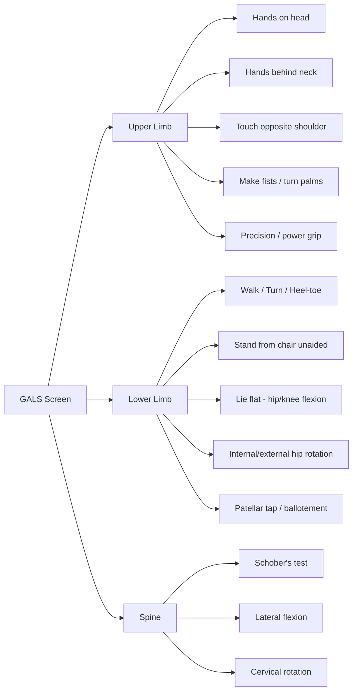
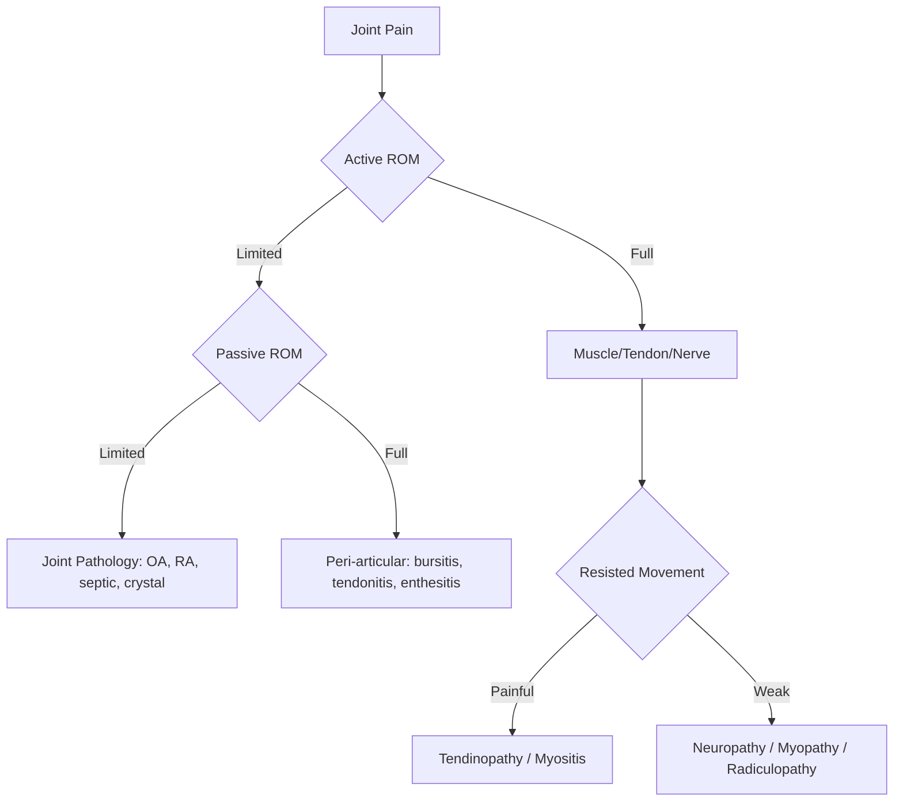
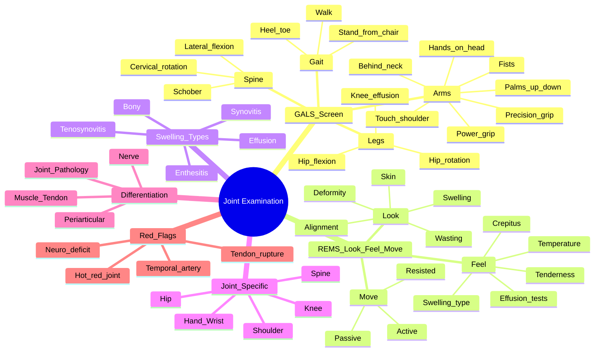

# Joint Examination (GALS)

> [!tip] **FCPS/MRCP Priority: HIGH**
> GALS (Global Assessment of Locomotor System) is the **standard screening examination** — OSCE/PACES staple. Abnormal GALS → focused regional exam (REMS: Regional Examination of the Musculoskeletal System).

---

## Learning Objectives
By the end of this note you should be able to:
- [ ] Perform a complete GALS screen in <2 minutes
- [ ] Differentiate joint vs peri-articular vs muscular pathology on examination
- [ ] Identify key signs: effusion, synovitis, bony swelling, deformity, wasting
- [ ] Apply Look-Feel-Move systematically to each joint
- [ ] Recognise examination red flags requiring urgent action

---

## 1. GALS Screening Sequence (60-90 seconds)

### GALS Steps — Verbatim for OSCE

| Step | Instruction | What You're Testing |
|------|-------------|---------------------|
| **1. Walk** | "Walk away, turn, walk back" | Gait, balance,antalgic pattern |
| **2. Heel-toe walk** | "Walk on heels, then toes" | Ankle dorsiflexion/plantarflexion, S1/L5 |
| **3. Stand from chair** | "Cross arms, stand without hands" | Proximal weakness (PMR, myopathy), hip/knee OA |
| **4. Hands on head** | "Put hands on head" | Shoulder abduction/external rotation |
| **5. Hands behind neck** | "Put hands behind neck" | Shoulder external rotation + elbow flexion |
| **6. Touch opposite shoulder** | "Touch L shoulder with R hand, then R with L" | Shoulder internal rotation + adduction |
| **7. Make fists** | "Make fists, straighten fingers" | Hand MCP/PIP flexion/extension, grip |
| **8. Turn palms** | "Turn palms up, then down" | Forearm supination/pronation, elbow |
| **9. Precision grip** | "Touch thumb to each fingertip" | Fine motor, median/ulnar nerve |
| **10. Power grip** | "Squeeze my fingers" | Grip strength, C7-T1 |
| **11. Lie flat** | Hip/knee flexion, internal/external rotation | Hip ROM, FABER test |
| **12. Patellar tap** | Ballotement for knee effusion | Knee effusion |
| **13. Schober's test** | 10cm above dimples, measure expansion | Lumbar spine flexion (AS) |
| **14. Lateral flexion** | Run hand down thigh | Thoracolumbar flexion |
| **15. Cervical rotation** | Chin to each shoulder | Cervical spine ROM |

---

## 2. REMS — Regional Examination (Look, Feel, Move)

After abnormal GALS → focused joint exam using **Look → Feel → Move** for each joint.

### Universal Joint Examination Framework

| Component | Technique | Normal | Abnormal Findings |
|-----------|-----------|--------|-------------------|
| **LOOK** | Inspect: swelling, deformity, wasting, scars, skin changes, alignment | Symmetrical, no swelling, no wasting | **Effusion** (fluid wave), **synovitis** (boggy), **bony** (hard), **deformity**, **wasting** |
| **FEEL** | Palpate: temperature, tenderness, swelling type, crepitus, effusion tests | Cool, non-tender, no swelling | **Warmth** = inflammation; **boggy** = synovitis; **fluctuant** = effusion; **hard** = bony; **crepitus** = OA |
| **MOVE** | Active → Passive → Resisted | Full painless ROM | **Active=Passive limited** = joint pathology; **Active limited/Passive full** = muscle/nerve; **Resisted pain** = tendonopathy |

---

## 3. Swelling Differentiation — OSCE Critical

| Swelling Type | Palpation | Typical Joint | Key Test |
|---------------|-----------|---------------|----------|
| **Effusion** | Fluctuant, fluid wave, ballotable | Knee (suprapatellar pouch), ankle, elbow, wrist | **Patellar tap** (knee), **ballotement** |
| **Synovitis** | Boggy, doughy, warm, thickened synovium | MCP, PIP, wrist, knee, ankle | Palpable thickening + warmth |
| **Bony** | Hard, fixed, non-tender, cool | DIP (Heberden's), PIP (Bouchard's), 1st CMC, knee | No warmth, no bogginess |
| **Tenosynovitis** | Tender along tendon sheath, crepitus | Wrist (extensor/flexor), ankle, fingers | Trigger finger, De Quervain's |
| **Enthesitis** | Tender at tendon insertion | Achilles, plantar fascia, costochondral, tibial tuberosity | Localised tenderness at insertion |

> [!warning] **MRCP Pearl: Knee Effusion Tests**
> - **Patellar tap**: compress suprapatellar pouch → tap patella → feel "click" = moderate effusion
> - **Cross fluctuation** (ballotement): milk fluid from medial → lateral → feel fluid wave = large effusion
> - **Bulge sign**: milk medial → watch lateral bulge = small effusion

---

## 4. Joint-Specific Examination Pearls

### Hand & Wrist (RA/PSA/PMR Core)
| Sign | Technique | Significance |
|------|-----------|--------------|
| **MCP squeeze** | Squeeze MCP joints laterally | Pain = synovitis (RA) |
| **Wrist palpation** | Dorsal/volar wrist | Boggy swelling = RA/PsA |
| **Piano key sign** | Press distal ulna volarly | DRUJ instability (RA, trauma) |
| **Thenar wasting** | Inspect thenar eminence | Median nerve / CTS / C8 radiculopathy |
| **Finkelstein's test** | Thumb in fist → ulnar deviation | De Quervain's tenosynovitis |

### Shoulder (PMR/Rotator Cuff/Frozen Shoulder)
| Test | Technique | Positive = |
|------|-----------|------------|
| **Empty can** | 90° abduction, 30° forward flexion, thumb down → resist | Supraspinatus tear |
| **Hawkins-Kennedy** | 90° forward flexion → internal rotation | Subacromial impingement |
| **Apprehension** | Abduction + external rotation | Anterior instability |
| **Passive ROM** | Compare active vs passive | Frozen shoulder: both limited equally |

### Hip (OA/AVN/Septic/PMR)
| Test | Technique | Positive = |
|------|-----------|------------|
| **Thomas test** | Flex contralateral hip → observe ipsilateral thigh | Hip flexion contracture (OA, psoas spasm) |
| **Trendelenburg** | Stand on one leg → observe pelvis drop | Gluteus medius weakness / hip pathology |
| **FABER** | Flexion, ABduction, External Rotation | Sacroiliac joint / hip pathology |
| **Internal rotation** | Most sensitive for hip OA | Reduced IR = early hip OA |

### Knee (OA/Septic/Gout/RA)
| Test | Technique | Significance |
|------|-----------|--------------|
| **Patellar tap** | Compress suprapatellar → tap patella | Moderate effusion |
| **Cross fluctuation** | Milk medial → feel lateral | Large effusion |
| **Bulge sign** | Milk medial → watch lateral | Small effusion |
| **McMurray's** | Flex → extend with rotation | Meniscal tear |
| **Lachman's** | 20° flexion → anterior draw | ACL tear |
| **Quadriceps wasting** | Measure 10cm above patella | Disuse atrophy (OA, post-op) |

### Spine (AS/Mechanical/Red Flags)
| Test | Technique | Significance |
|------|-----------|--------------|
| **Schober's** | Mark 10cm above dimples → flex → measure | Lumbar flexion <5cm expansion = AS |
| **Chin-to-chest** | Measure chin-sternum distance | Cervical flexion limitation (AS) |
| **Occiput-to-wall** | Back to wall → measure occiput distance | Cervical kyphosis (late AS) |
| **Lateral flexion** | Fingers down thigh | Thoracolumbar restriction |

---

## 5. Differentiating Joint vs Peri-articular vs Muscle

| Pattern | Active | Passive | Resisted | Diagnosis |
|---------|--------|---------|----------|-----------|
| **Joint** | Limited (pain) | Limited (pain) | Normal | OA, RA, septic, crystal |
| **Synovitis** | Limited | Limited | Normal | RA, PsA, SpA |
| **Bursitis** | Limited (end-range) | Full | Painful at insertion | Trochanteric, prepatellar, olecranon |
| **Tendinopathy** | Painful | Full | Painful | Rotator cuff, Achilles, tennis elbow |
| **Enthesitis** | Painful at insertion | Full | Painful at insertion | SpA, PsA, DISH |
| **Muscle** | Weak/painful | Full | Weak/painful | Myositis, PMR, myopathy |
| **Nerve** | Weak | Full | Weak | Radiculopathy, neuropathy |

---

## 6. Red Flags on Examination

| Finding | Implication | Urgency |
|---------|-------------|---------|
| **Hot, red, exquisitely tender monoarticular joint** | Septic arthritis / Gout / CPPD | **Emergency** — aspirate immediately |
| **Inability to weight bear + fever** | Septic arthritis / Osteomyelitis | **Emergency** |
| **Gross deformity + trauma history** | Fracture / dislocation | Urgent X-ray |
| **Neurological deficit (foot drop, saddle anaesthesia)** | Cauda equina / cord compression | **Emergency** |
| **Temporal artery tenderness / reduced pulsation** | GCA | **Urgent steroids + biopsy** |
| **Ruptured tendon (e.g., Achilles, quadriceps)** | Tendon rupture | Urgent surgical referral |
| **Rapidly expanding joint swelling** | Haemarthrosis / vascular injury | Urgent |

---

## 7. FCPS/MRCP High-Yield Examination Summary

| Joint | Key Inflammatory Signs | Key Mechanical Signs | Must-Not-Miss |
|-------|------------------------|---------------------|---------------|
| **Hand (RA)** | MCP squeeze +, boggy wrists, ulnar drift, swan neck, boutonnière | Heberden's (DIP), Bouchard's (PIP), 1st CMC squaring | MCP synovitis = early RA |
| **Knee** | Effusion (patellar tap), warmth, balloon sign | Crepitus, bony enlargement, varus/valgus | Septic = hot + tense + cannot move |
| **Shoulder (PMR)** | Bilateral girdle tenderness, limited abduction | Frozen shoulder: passive=active limited | PMR = no true synovitis |
| **Hip (AS/OA)** | Reduced IR (early), FABER + | Thomas test +, Trendelenburg | AS = sacroiliitis on imaging |
| **Spine (AS)** | Schober's <5cm, chest expansion <2.5cm | Normal | Bamboo spine = late |

---

## 8. Viva Questions (PACES/FCPS Clinical)

| Scenario | Expected Examination Findings |
|----------|------------------------------|
| **RA hands** | MCP synovitis (squeeze tender), wrist bogginess, ulnar drift, swan neck (PIP hyperextension/DIP flexion), boutonnière (PIP flexion/DIP extension), thenar wasting |
| **PMR** | **No true synovitis**. Bilateral shoulder/hip girdle tenderness. Limited active ROM (pain). Passive ROM better. Normal power. |
| **AS spine** | Schober's <5cm expansion, reduced chest expansion <2.5cm, reduced cervical rotation, occiput-to-wall distance increased |
| **Gout 1st MTP** | Acute: red, hot, exquisitely tender, shiny skin. Chronic: tophi (helix, olecranon, Achilles, 1st MTP) |
| **SLE** | Non-erosive arthritis (Jaccoud's: reducible ulnar deviation), malar rash, oral ulcers, livedo reticularis |
| **PsA** | Dactylitis (sausage digit), nail pitting/onycholysis, enthesitis (Achilles/plantar), asymmetrical oligoarthritis |
| **Septic knee** | Hot, red, tense effusion, exquisite tenderness, cannot move actively or passively, fever |

---

## 9. Confusions & Mnemonics

| Confusion | Clarification |
|-----------|---------------|
| **Frozen shoulder vs PMR shoulder** | Frozen: passive = active limited (capsular). PMR: active < passive (pain inhibition), no true capsular pattern. |
| **Trochanteric bursitis vs hip OA** | Bursitis: tenderness over greater trochanter, FABER -, passive IR normal. OA: reduced IR, FABER +, groin pain. |
| **Carpal tunnel vs C8 radiculopathy** | CTS: thenar wasting + sensory loss median 3.5 digits. C8: thenar wasting + medial forearm sensory loss + triceps reflex ↓. |
| **Septic vs reactive arthritis** | Septic: monoarticular, fever, toxic, urgent aspirate. Reactive: oligoarticular, post-infectious, sterile aspirate. |

**Mnemonic: GALS = G**ait **A**rms **L**egs **S**pine

**Mnemonic for Look-Feel-Move: "Look For Movement"**

**Mnemonic for Joint vs Peri-articular: JPM**
- **J**oint = Active & Passive limited
- **P**eri-articular = Passive full, Active limited
- **M**uscle = Resisted painful/weak

---

## 10. Mind Map

---

## 11. One-Page Revision Card

| Joint | Inflammatory Signs | Mechanical Signs | Red Flags |
|-------|-------------------|-----------------|-----------|
| **Hand** | MCP squeeze, boggy wrist, ulnar drift, swan neck, boutonnière | Heberden's DIP, Bouchard's PIP, 1st CMC squaring | MCP synovitis = early RA |
| **Shoulder** | Bilateral girdle tenderness (PMR), subacromial crepitus | Frozen: global passive restriction | PMR = no true synovitis |
| **Hip** | Reduced IR (early), FABER + | Thomas test +, Trendelenburg, crepitus | Septic = emergency |
| **Knee** | Effusion (patellar tap), warmth, ballotement | Crepitus, bony enlargement, varus/valgus | Hot + tense + immobile = septic |
| **Spine** | Schober's <5cm, chest expansion <2.5cm | Normal mechanical | Cauda equina = emergency |

---

## 12. Spaced Repetition Trackers

| Review Interval | Date Completed | Confidence (1-5) | Notes |
|-----------------|----------------|------------------|-------|
| 24 hours | | | |
| 7 days | | | |
| 15 days | | | |
| 30 days | | | |
| 90 days | | | |

---

## 13. Self-Test Scorecard

| Section | Score /5 | Last Attempt |
|---------|----------|--------------|
| GALS Sequence | | |
| Look-Feel-Move Framework | | |
| Swelling Differentiation | | |
| Joint-Specific Tests | | |
| Joint vs Peri-articular vs Muscle | | |
| Red Flags | | |
| Viva Scenarios | | |

---

## Local Navigation
- **Parent Heading**: [[../Clinical Approach to Musculoskeletal Disease|Clinical Approach to Musculoskeletal Disease]]
- **Parent Topic Group**: [[Clinical approach]]
- **Previous Topic**: [[Musculoskeletal history taking]]
- **Next Topic**: [[Investigations in rheumatology]]
- **Chapter Map**: [[../Davidson Chapter 26 - Rheumatology Hierarchy|Rheumatology Hierarchy]]
- **Chapter MOC**: [[../Rheumatology MOC|Rheumatology MOC]]
- **Drug Reference**: [[../Drugs in rheumatology|Drugs in rheumatology]]
---

> Auto-generated study sections for "Clinical Approach to Musculoskeletal Disease" — Ch 25: Rheumatology & Bone Disease.

## Flashcards (1 generated)

- Q: What is the definition of Clinical Approach to Musculoskeletal Disease?
  A: GALS (Global Assessment of Locomotor System) is the standard screening examination — OSCE/PACES staple.

## MCQs (1 generated)

1. **Which of the following best describes Clinical Approach to Musculoskeletal Disease?**
   A. **GALS (Global Assessment of Locomotor System) is the standard screening examination — OSCE/PACES staple.**
   B. An unrelated condition not matching the clinical picture of Clinical Approach to Musculoskeletal Disease
   C. A complication seen late in the disease course of Clinical Approach to Musculoskeletal Disease
   D. A condition that mimics Clinical Approach to Musculoskeletal Disease but has a different underlying cause

## SBA Questions (1 generated)

1. A patient with suspected Clinical Approach to Musculoskeletal Disease presents with: Scenario — Expected Examination Findings; RA hands — MCP synovitis (squeeze tender), wrist bogginess, ulnar drift, swan neck (PIP hyperextension/DIP flexion), boutonnière (PIP flexion/DIP extension), thenar wasting; PMR — No true synovitis. Bilateral shoulder/hip girdle tenderness. Limited active ROM (pain). Passive ROM better. Normal power.. What is the most likely diagnosis?
   A. **Clinical Approach to Musculoskeletal Disease**
   B. A condition that mimics Clinical Approach to Musculoskeletal Disease but is not the same entity
   C. A complication of Clinical Approach to Musculoskeletal Disease rather than the primary diagnosis
   D. An unrelated condition in the same clinical category as Clinical Approach to Musculoskeletal Disease

