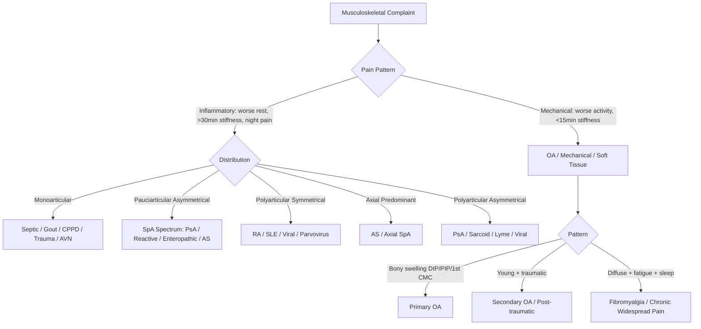
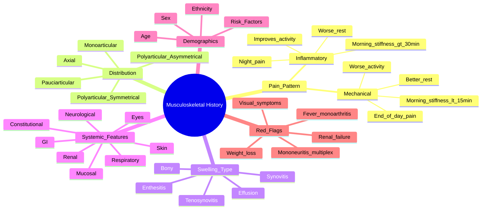

# Musculoskeletal History Taking

> [!tip] **FCPS/MRCP Priority: HIGH**
> History provides **70-80% of rheumatology diagnoses**. Master inflammatory vs mechanical pain patterns — this is a guaranteed viva/SBA topic.

---

## Learning Objectives
By the end of this note you should be able to:
- [ ] Distinguish inflammatory from mechanical pain patterns with specific duration/quality criteria
- [ ] Identify distribution patterns (mono/pauci/polyarticular; axial/peripheral; symmetrical/asymmetrical)
- [ ] Elicit morning stiffness duration and its diagnostic significance
- [ ] Recognise systemic red flags (fever, weight loss, malignancy risk, infection risk)
- [ ] Apply age/gender/ethnicity epidemiology to differential diagnosis

---

## 1. Pain Characteristics — The Diagnostic Pivot

| Feature | **Inflammatory Pain** | **Mechanical/Non-inflammatory Pain** |
|---------|----------------------|-------------------------------------|
| **Timing** | Worse at rest, night, early morning | Worse with activity, end of day |
| **Relief** | Improves with activity | Improves with rest |
| **Morning Stiffness** | **>30-60 minutes** (often hours) | **<15 minutes** |
| **Night Pain** | Often wakes patient (2-4 AM) | Rare (unless severe structural) |
| **Quality** | Dull, gnawing, throbbing | Sharp, catching, mechanical |
| **Associated Features** | Warmth, swelling, systemic symptoms | Crepitus, instability, locking |

> [!warning] **MRCP Pearl**
> - Morning stiffness **>1 hour** = strong predictor of inflammatory arthritis (RA, SpA, PMR)
> - Stiffness **<15 min** = mechanical (OA, tendinopathy)
> - **Gel phenomenon**: stiffness after inactivity (e.g., sitting in cinema) = inflammatory

---

## 2. Stiffness — Quantify Precisely

```
Duration categories:
├── <15 minutes    → Mechanical (OA, mechanical back pain)
├── 15-30 minutes  → Borderline (early inflammatory, fibromyalgia)
├── 30-60 minutes  → Inflammatory (early RA, PsA, PMR)
└── >60 minutes    → Strongly inflammatory (active RA, AS, PMR, GCA)
```

**Key questions:**
- "How long does it take to 'loosen up' in the morning?"
- "Do you feel stiff after sitting for 30 minutes?" (gel phenomenon)
- "Is it difficulty moving or pain preventing movement?"

---

## 3. Joint Distribution Patterns

| Pattern | Typical Conditions | FCPS/MRCP Clues |
|---------|-------------------|-----------------|
| **Monoarticular** (1 joint) | Septic arthritis, gout, CPPD, trauma, OA, AVN | **Red flag**: acute hot swollen knee = septic until proven otherwise |
| **Pauciarticular** (2-4 joints) | PsA, reactive arthritis, sarcoid, Lyme, TB | Asymmetrical lower limb = SpA spectrum |
| **Polyarticular** (≥5 joints) | RA, SLE, viral, parvovirus, Lyme, endocarditis | Symmetrical small joints (MCP/PIP) = RA |
| **Axial** (spine/sacroiliac) | AS, PsA, enteropathic, reactive, DISH | Young male + inflammatory back pain = AS |
| **Peripheral + Axial** | PsA, enteropathic, reactive | Add skin/nail/eye/bowel/ GU symptoms |

> [!important] **Symmetry Rule**
> - **Symmetrical** polyarthritis = RA, SLE, viral polyarthritis
> - **Asymmetrical** polyarthritis = PsA, SpA, sarcoidosis, reactive

---

## 4. Swelling Pattern — Look, Feel, Move

| Type | Feel | Typical Causes | Key Differentiator |
|------|------|---------------|-------------------|
| **Effusion** | Fluctuant, fluid wave | Septic, gout, CPPD, RA, trauma | Patellar tap / balloon sign |
| **Synovitis** | Boggy, doughy, warm | RA, PsA, SpA, SLE | Palpable synovial thickening |
| **Bony** | Hard, fixed, non-tender | OA (Heberden's/Bouchard's), DISH | No warmth, no bogginess |
| **Tenosynovitis** | Tender along tendon sheath | RA, PsA, gonococcal, TB | Trigger finger, De Quervain's |
| **Enthesitis** | Tender at insertion | SpA, PsA, DISH, CPPD | Achilles, plantar fascia, costochondral |

---

## 5. Systemic Features — The "Rest of the Body"

| System | Red Flags | Associated Conditions |
|--------|-----------|----------------------|
| **Constitutional** | Fever, weight loss, night sweats, fatigue | Infection (TB, endocarditis), malignancy, vasculitis, SLE, PMR, GCA |
| **Skin** | Rash, photosensitivity, ulcers, nodules, psoriasis | SLE, vasculitis, PsA, RA nodules, gout (tophi), sarcoid |
| **Eyes** | Uveitis (painful red eye, photophobia), scleritis, sicca | AS (acute anterior uveitis), SpA, JIA, Behçet's, SLE, RA, GCA |
| **Mucosal** | Oral/genital ulcers | Behçet's, SLE, reactive arthritis, Crohn's |
| **GI** | Diarrhoea, abdominal pain, weight loss | Enteropathic arthritis (IBD), Whipple's, coeliac |
| **Respiratory** | Cough, dyspnoea, haemoptysis | RA-ILD, SLE, vasculitis (GPA, MPA), sarcoid, drug toxicity (MTX) |
| **Renal** | Haematuria, proteinuria, hypertension | SLE nephritis, vasculitis (GPA, MPA, IgA), amyloidosis |
| **Neurological** | Neuropathy, mononeuritis multiplex, CNS | Vasculitis (GPA, MPA, PAN), SLE, cryoglobulinaemia |

---

## 6. Demographics & Epidemiology — Pre-test Probability

| Condition | Peak Age | Sex Ratio | Ethnicity/Other |
|-----------|----------|-----------|-----------------|
| **RA** | 30-50 | F:M 3:1 | Smoking = risk + severity |
| **AS** | 20-30 | M:F 2-3:1 | HLA-B27 +ve 90% |
| **SLE** | 15-45 | F:M 9:1 | Afro-Caribbean/Asian ↑ risk & severity |
| **Gout** | 40-60 | M:F 4:1 | Metabolic syndrome, CKD, diuretics |
| **PMR/GCA** | >50 (mean 70) | F:M 2:1 | Caucasian > Asian > African |
| **PsA** | 30-50 | Equal | Psoriasis precedes arthritis 70-80% |
| **Sjögren's** | 40-60 | F:M 9:1 | Primary vs secondary (RA, SLE) |
| **Scleroderma** | 30-50 | F:M 4:1 | African Americans ↑ diffuse disease |
| **Polymyositis/DM** | 40-60 / 5-15, 40-60 | F:M 2:1 | Malignancy association (DM > PM) |
| **Vasculitis** | Varies | Varies | ANCA pattern guides subtype |

---

## 7. Red Flags — Immediate Action Triggers

| Red Flag | Immediate Concern | Action |
|----------|-------------------|--------|
| **Fever + monoarthritis** | Septic arthritis | **Emergency joint aspiration** |
| **Acute severe pain + swelling** (hours) | Crystal arthritis (gout/CPPD) / Septic | Aspirate for crystals + culture |
| **Weight loss + polyarthritis** | Malignancy, TB, vasculitis | CT chest/abdomen/pelvis, malignancy screen |
| **Visual disturbance + headache (age >50)** | GCA | **Urgent steroids + temporal artery biopsy** |
| **Rapidly progressive renal failure** | RPGN (vasculitis, SLE, Goodpasture) | Urgent renal biopsy, immunosuppression |
| **Mononeuritis multiplex** | Systemic vasculitis | Nerve conduction, biopsy, ANCA |
| **New onset inflammatory arthritis >60** | Paraneoplastic, PMR/GCA, crystal | Age-appropriate cancer screen |

---

## 8. FCPS/MRCP High-Yield Summary Table

| Clinical Scenario | Most Likely Diagnosis | Key Confirmatory Feature |
|-------------------|----------------------|-------------------------|
| Young woman, symmetrical MCP/PIP swelling, >1hr stiffness, +RF/anti-CCP | **Rheumatoid Arthritis** | Anti-CCP 95% specific |
| Young man, inflammatory back pain, HLA-B27+, sacroiliitis on MRI | **Ankylosing Spondylitis** | Sacroiliitis grade ≥2 bilateral |
| Elderly woman, shoulder/pelvic girdle stiffness >45min, ESR 80 | **Polymyalgia Rheumatica** | Dramatic response to 15mg pred |
| Same + headache, jaw claudication, visual symptoms | **Giant Cell Arteritis** | Temporal artery biopsy / US halo sign |
| Middle-aged man, acute monoarthritis 1st MTP, tophi, hyperuricaemia | **Gout** | Negatively birefringent needles |
| Young woman, malar rash, photosensitivity, oral ulcers, +ANA/dsDNA | **SLE** | Anti-dsDNA 95% specific, renal bx |
| Asymmetrical oligoarthritis + psoriasis/nail changes/dactylitis | **Psoriatic Arthritis** | CASPAR criteria |
| Post-infectious arthritis (GU/GI) + conjunctivitis/urethritis | **Reactive Arthritis** | HLA-B27, preceding infection |

---

## 9. Diagnostic Algorithm — History to Differential



---

## 10. Viva Questions (MRCP PACES / FCPS Clinical)

| Question | Expected Answer |
|----------|----------------|
| "How do you distinguish inflammatory from mechanical back pain?" | Inflammatory: age <40, insidious onset, improves with exercise, no improvement with rest, night pain, morning stiffness >30 min. Mechanical: opposite. |
| "A 70-year-old woman has bilateral shoulder and hip girdle pain with morning stiffness 2 hours. ESR 85. What is your diagnosis and management?" | PMR. Prednisolone 15-20mg daily. **Must screen for GCA** (headache, jaw claudication, visual symptoms). Bone protection. |
| "A 25-year-old man presents with acute painful red eye, photophobia, and lower back pain. What is the association?" | Acute anterior uveitis + inflammatory back pain = Ankylosing Spondylitis (HLA-B27 90%). |
| "What autoantibodies would you order for suspected RA?" | RF (70-80% sensitive) + Anti-CCP (95% specific, prognostic for erosions). |
| "A patient on methotrexate develops cough and dyspnoea. What do you suspect?" | Methotrexate pneumonitis (diagnosis of exclusion). Stop MTX, HRCT, consider biopsy. |

---

## 11. Confusions & Mnemonics

| Confusion | Clarification |
|-----------|---------------|
| **Morning stiffness vs morning pain** | Stiffness = difficulty moving; Pain = hurts to move. Stiffness duration is the key metric. |
| **Fibromyalgia vs inflammatory** | Fibromyalgia: widespread pain + fatigue + sleep disturbance + **normal ESR/CRP + no swelling**. |
| **PMR vs late-onset RA** | PMR: girdle only, no synovitis, RF/CCP negative, dramatic steroid response. LORA: synovitis present, may be seropositive. |
| **Mechanical back pain vs inflammatory** | Mechanical: worse activity, better rest, no night pain, stiffness <15 min. Inflammatory: opposite. |

**Mnemonic for Inflammatory Back Pain (AS): PAIN**
- **P**ersistence >3 months
- **A**ge of onset <40 years
- **I**mprovement with exercise
- **N**o improvement with rest (+ Night pain)

**Mnemonic for SLE Criteria (SLICC): SOAP BRAIN MD**
- **S**erology (ANA, dsDNA, Sm, aPL)
- **O**ral ulcers
- **A**rthritis (non-erosive)
- **P**hotosensitivity
- **B**lood (cytopenias)
- **R**enal (proteinuria/casts)
- **A**nti-dsDNA/Sm
- **I**mmunologic (aPL, low complement)
- **N**eurologic (seizures/psychosis)
- **M**alar rash
- **D**iscoid rash

---

## 12. Mind Map



---

## 13. One-Page Revision Card

| Domain | Key Points |
|--------|------------|
| **Inflammatory Pain** | Worse rest, >30-60 min AM stiffness, night pain, improves activity |
| **Mechanical Pain** | Worse activity, <15 min AM stiffness, improves rest, end-of-day pain |
| **RA Pattern** | Symmetrical MCP/PIP/wrist, >1hr stiffness, RF/CCP+ |
| **AS Pattern** | Young male, inflammatory back pain, HLA-B27+, sacroiliitis |
| **PMR Pattern** | >50, bilateral girdle stiffness >45min, ESR↑↑, rapid steroid response |
| **Gout Pattern** | M 40-60, acute 1st MTP, tophi, hyperuricaemia, crystals |
| **SLE Pattern** | F 15-45, malar rash, photosensitivity, renal, +ANA/dsDNA |
| **Red Flags** | Fever+monoarthritis, weight loss+polyarthritis, visual symptoms>50, rapid renal failure |

---

## 14. Spaced Repetition Trackers

| Review Interval | Date Completed | Confidence (1-5) | Notes |
|-----------------|----------------|------------------|-------|
| 24 hours | | | |
| 7 days | | | |
| 15 days | | | |
| 30 days | | | |
| 90 days | | | |

---

## 15. Self-Test Scorecard

| Section | Score /5 | Last Attempt |
|---------|----------|--------------|
| Pain Pattern Differentiation | | |
| Distribution Patterns | | |
| Morning Stiffness Significance | | |
| Swelling Types | | |
| Red Flag Recognition | | |
| Demographics/Epidemiology | | |
| Viva Questions | | |

---

## Local Navigation
- **Parent Heading**: [[../Clinical Approach to Musculoskeletal Disease|Clinical Approach to Musculoskeletal Disease]]
- **Parent Topic Group**: [[Clinical approach]]
- **Next Topic**: [[Joint examination (GALS)]]
- **Chapter Map**: [[../Davidson Chapter 26 - Rheumatology Hierarchy|Rheumatology Hierarchy]]
- **Chapter MOC**: [[../Rheumatology MOC|Rheumatology MOC]]
- **Drug Reference**: [[../Drugs in rheumatology|Drugs in rheumatology]]
- **Investigation Reference**: [[../Investigations in rheumatology|Investigations in rheumatology]]
---

> Auto-generated study sections for "Clinical Approach to Musculoskeletal Disease" — Ch 25: Rheumatology & Bone Disease.

## Flashcards (1 generated)

- Q: What is the definition of Clinical Approach to Musculoskeletal Disease?
  A: | Feature | Inflammatory Pain | Mechanical/Non-inflammatory Pain |

## MCQs (1 generated)

1. **Which of the following best describes Clinical Approach to Musculoskeletal Disease?**
   A. **| Feature | Inflammatory Pain | Mechanical/Non-inflammatory Pain |**
   B. An unrelated condition not matching the clinical picture of Clinical Approach to Musculoskeletal Disease
   C. A complication seen late in the disease course of Clinical Approach to Musculoskeletal Disease
   D. A condition that mimics Clinical Approach to Musculoskeletal Disease but has a different underlying cause

## SBA Questions (1 generated)

1. A patient with suspected Clinical Approach to Musculoskeletal Disease presents with: System — Red Flags; Constitutional — Fever, weight loss, night sweats, fatigue; Skin — Rash, photosensitivity, ulcers, nodules, psoriasis. What is the most likely diagnosis?
   A. **Clinical Approach to Musculoskeletal Disease**
   B. A condition that mimics Clinical Approach to Musculoskeletal Disease but is not the same entity
   C. A complication of Clinical Approach to Musculoskeletal Disease rather than the primary diagnosis
   D. An unrelated condition in the same clinical category as Clinical Approach to Musculoskeletal Disease

## PasTest Scenario SBAs (Clinical Vignettes)

> **Auto-generated PasTest/Mediscope-style scenario SBAs** grounded in the authored source. Each scenario tests a real clinical fact (triad, specific sign, contraindication, trial, first-line Rx) extracted from the topic. *Source: Ch 25: Rheumatology — Musculoskeletal history taking*

**Q1.** Which of the following features is most specific or characteristic of Musculoskeletal history taking?

  - **A.** Morning stiffness vs morning pain
  - **B.** A feature common to many acute inflammatory conditions
  - **C.** A non-specific sign that does not localise the diagnosis
  - **D.** An investigation finding rather than a clinical feature

  > **Answer: A** — Morning stiffness vs morning pain
  >
  > *Source:* a / Chronic Widespread Pain]
```

---
| Confusion | Clarification |
|-----------|---------------|
| **Morning stiffness vs morning pain** | Stiffness = difficulty moving; Pain = hurts to move. Stiffne

