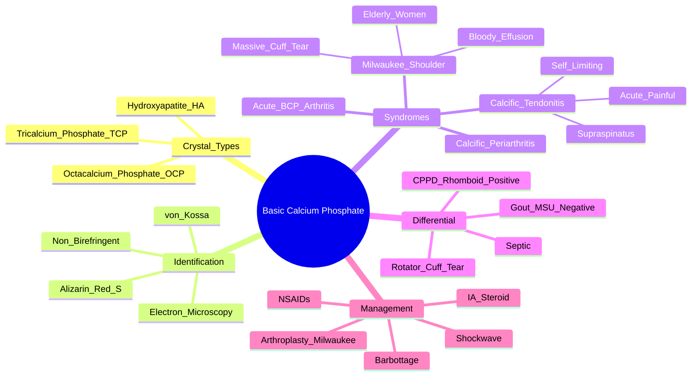

# Basic Calcium Phosphate (BCP) Crystal Deposition

> [!tip] **FCPS/MRCP Priority: HIGH**
> BCP = **hydroxyapatite, octacalcium phosphate, tricalcium phosphate** — **non-birefringent** on polarised light. **Milwaukee shoulder syndrome** (elderly women, massive rotator cuff tear, bloody effusion). **Calcific tendonitis** (shoulder, acute). **Special stains needed** (alizarin red S, von Kossa).

---

## Learning Objectives
By the end of this note you should be able to:
- [ ] Identify **BCP crystal types**: hydroxyapatite (HA), octacalcium phosphate (OCP), tricalcium phosphate (TCP)
- [ ] Recognise **classic syndromes**: **Milwaukee shoulder**, **calcific tendonitis**, acute BCP arthritis
- [ ] Differentiate from **gout (MSU)** and **CPPD** — **BCP = non-birefringent, needs special stains**
- [ ] Interpret imaging: **no chondrocalcinosis** on X-ray; **calcific deposits in tendons**
- [ ] Select management: **calcific tendonitis = NSAIDs, IA steroid, barbotage**; **Milwaukee = symptomatic, arthroplasty if severe**

---

## 1. Definition & Crystal Types

| Crystal Type | Chemical Formula | Clinical Relevance |
|--------------|------------------|-------------------|
| **Hydroxyapatite (HA)** | Ca₁₀(PO₄)₆(OH)₂ | **Most common**; calcific tendonitis, Milwaukee shoulder |
| **Octacalcium Phosphate (OCP)** | Ca₈H₂(PO₄)₆·5H₂O | Precursor to HA; acute periarthritis |
| **Tricalcium Phosphate (TCP)** | Ca₃(PO₄)₂ | Less common; similar to HA |

> [!critical] **BCP Crystals = Non-Birefringent**
> - **Too small** for light microscopy (1-3 µm)
> - **NOT visible on routine polarised microscopy**
> - **Require special stains**: **Alizarin Red S**, **von Kossa**, electron microscopy

---

## 2. Clinical Syndromes

### 1. Calcific Tendonitis (Most Common)
| Feature | Detail |
|---------|--------|
| **Site** | **Shoulder (supraspinatus tendon)** > hip, wrist, elbow |
| **Presentation** | **Acute painful shoulder**, limited ROM, night pain |
| **Demographics** | 30-60 years, F = M |
| **Course** | **Self-limiting** (weeks-months); **resorptive phase = most painful** |
| **Imaging** | **Calcific deposit in tendon** on X-ray/US; **no chondrocalcinosis** |

### 2. Milwaukee Shoulder Syndrome
| Feature | Detail |
|---------|--------|
| **Population** | **Elderly women** (70-80y) |
| **Pathology** | **Massive rotator cuff tear** + **BCP (HA) crystals** in joint |
| **Presentation** | **Painless or mildly painful**, shoulder swelling, **limited active ROM**, **passive preserved** |
| **Effusion** | **Bloody, xanthochromic** (recurrent) |
| **Destruction** | **Rapid humeral head destruction** ("migrating" humeral head) |
| **X-ray** | **Superior migration** of humeral head, **no chondrocalcinosis** |

### 3. Acute BCP (Hydroxyapatite) Arthritis
| Feature | Detail |
|---------|--------|
| **Presentation** | **Acute monoarthritis** (knee > shoulder, wrist) |
| **Demographics** | Elderly, often CKD/dialysis |
| **Joint Fluid** | **Bloody/serosanguineous**, **non-birefringent crystals** |
| **Associations** | OA, dialysis, Ca/P disorders, hypophosphatasia |

### 4. Calcific Periarthritis
| Feature | Detail |
|---------|--------|
| **Presentation** | Acute painful swelling **over joint** (wrist, hip, shoulder) |
| **Course** | Self-limiting (1-4 weeks) |
| **Imaging** | **Calcific deposit** adjacent to joint (not intra-articular) |

---

## 3. Crystal Identification — Key Differentiator

```mermaid
flowchart TD
    A[Synovial Fluid / Tissue] --> B{Polarised Light Microscopy}
    B -->|Negative Birefringence\nNeedle-shaped| C[MSU = **Gout**]
    B -->|Positive Birefringence\nRhomboid| D[CPPD = **Pseudogout**]
    B -->|**No Birefringence**\n(Crystals too small)| E[**BCP = **Hydroxyapatite/OCP/TCP**]
    E --> F[**Special Stains Required**]
    F --> F1[**Alizarin Red S** (gold standard)]
    F2[**von Kossa**]
    F3[**Electron Microscopy**]
```

| Crystal | Shape | Birefringence | Special Stain |
|---------|-------|---------------|---------------|
| **MSU (Gout)** | Needle | **Negative** (Yellow parallel) | None needed |
| **CPPD (Pseudogout)** | Rhomboid/Rectangular | **Positive** (Blue parallel) | None needed |
| **BCP (HA/OCP/TCP)** | Too small (<3µm) | **NON-BIREFRINGENT** | **Alizarin Red S, von Kossa, EM** |

> [!critical] **BCP = Non-Birefringent**
> - **If polarised microscopy negative but clinical suspicion high** → **order Alizarin Red S stain**
> - **No chondrocalcinosis** on X-ray (unlike CPPD)

---

## 4. Differential Diagnosis

| Condition | Distinguishing Features |
|-----------|------------------------|
| **Gout** | MSU needles, **negative birefringence**, 1st MTP, hyperuricaemia |
| **CPPD (Pseudogout)** | CPPD rhomboids, **positive birefringence**, **chondrocalcinosis** on X-ray |
| **Septic Arthritis** | Fever, toxic, WBC >50k, **positive culture** |
| **Rotator Cuff Tear (Milwaukee mimic)** | No crystals, no bloody effusion, US/MRI shows tear |
| **Neuropathic Arthropathy (Charcot)** | Neuropathy, dislocation, preserved pain sensation loss |

---

## 5. Management

### Calcific Tendonitis
| Step | Treatment |
|------|-----------|
| **1. Acute** | **NSAIDs**, rest, ice |
| **2. Persistent** | **IA corticosteroid** (subacromial) |
| **3. Refractory** | **Ultrasound-guided barbotage (lavage + aspiration)** — **gold standard** |
| **4. Chronic** | **Shockwave therapy**, **arthroscopic debridement** |

### Milwaukee Shoulder Syndrome
| Treatment | Detail |
|---------|--------|
| **Symptomatic** | NSAIDs, physiotherapy (passive ROM) |
| **Severe Destruction** | **Hemiarthroplasty / Total shoulder arthroplasty** |
| **No Crystal Dissolution Therapy** | No specific BCP-dissolving drug |

### Acute BCP Arthritis
| Treatment | Detail |
|---------|--------|
| **NSAIDs** | 1st line (avoid if CKD) |
| **IA Steroid** | If monoarticular |
| **Treat Underlying** | CKD/dialysis optimisation |

---

## 6. FCPS/MRCP High-Yield Summary

| Topic | Key Points |
|-------|------------|
| **Crystals** | **HA, OCP, TCP** — **non-birefringent** (too small) |
| **Special Stains** | **Alizarin Red S** (gold standard), **von Kossa**, EM |
| **Milwaukee Shoulder** | Elderly women, **massive rotator cuff tear**, **bloody effusion**, HA crystals, **no chondrocalcinosis** |
| **Calcific Tendonitis** | Shoulder (supraspinatus), acute painful, **self-limiting**, barbotage if refractory |
| **Crystal ID** | **Non-birefringent** → **Alizarin Red S +ve** |
| **vs Gout/CPPD** | Gout = needle/neg; CPPD = rhomboid/pos; BCP = non-birefringent |

---

## 7. Viva Questions (MRCP PACES / FCPS)

| Question | Expected Answer |
|----------|----------------|
| "How do you identify hydroxyapatite crystals in synovial fluid?" | **Polarised microscopy = negative** (non-birefringent). **Special stain required: Alizarin Red S (gold standard) or von Kossa**. |
| "What is Milwaukee shoulder syndrome?" | **Elderly women**, **massive rotator cuff tear**, **bloody xanthochromic effusion**, **HA crystals**, **superior humeral head migration**, **no chondrocalcinosis**. |
| "How does BCP crystal identification differ from gout and CPPD?" | **Gout = MSU needles, negative birefringence; CPPD = rhomboids, positive birefringence; BCP = NON-BIREFRINGENT, needs Alizarin Red S/von Kossa stain**. |
| "What is calcific tendonitis and how is it managed?" | **Hydroxyapatite in supraspinatus tendon** → acute painful shoulder. **NSAIDs → IA steroid → US-guided barbotage → shockwave/arthroscopy if refractory**. |
| "What is the key radiological difference between CPPD and BCP deposition?" | **CPPD = chondrocalcinosis (linear calcification of menisci/TFCC)**. **BCP = NO chondrocalcinosis** (calcific deposits in tendons/soft tissue). |

---

## 8. Confusions & Mnemonics

| Confusion | Clarification |
|-----------|---------------|
| **BCP vs CPPD Crystals** | **CPPD = birefringent (rhomboid, +ve)**. **BCP = NON-birefringent** (too small). |
| **BCP vs Gout** | Gout = **MSU needles, negative birefringence**. BCP = **non-birefringent, Alizarin Red S +ve**. |
| **Milwaukee Shoulder vs Rotator Cuff Tear** | Milwaukee = **HA crystals + bloody effusion + rapid destruction**. Cuff tear = **no crystals, chronic, less destruction**. |
| **BCP in Dialysis** | **β2-microglobulin amyloidosis** also in dialysis — distinct from BCP; both cause carpal tunnel/destructive arthropathy. |
| **Chondrocalcinosis** | **ABSENT in BCP** (present in CPPD). |

**Mnemonic: BCP Crystals = "NO BIREFRINGENCE"**
- **N**on-birefringent
- **O**rder **Alizarin Red S**
- **B**asic **C**alcium **P**hosphate

**Mnemonic: Milwaukee = "OLD WOMEN, BLOODY, MASSIVE TEAR"**
- **OLD** women (70-80)
- **WOMEN** > men
- **BLOODY** xanthochromic effusion
- **MASSIVE** rotator cuff tear
- **HA** crystals

**Mnemonic: Crystal ID = "NEG - POS - NONE"**
- **NEG**ative birefringence = **Gout** (MSU needles)
- **POS**itive birefringence = **CPPD** (rhomboids)
- **NONE** (non-birefringent) = **BCP** (Alizarin Red S)

**Mnemonic: Calcific Tendonitis = "BARBOTAGE"**
- **BAR**botage (ultrasound lavage) = gold standard for refractory

---

## 9. Mind Map



---

## 10. One-Page Revision Card

| Domain | Key Points |
|--------|------------|
| **Crystals** | HA, OCP, TCP — **non-birefringent** (too small) |
| **ID** | **Alizarin Red S** (gold standard), von Kossa, EM |
| **Milwaukee Shoulder** | Elderly women, **massive rotator cuff tear**, **bloody effusion**, HA, **no chondrocalcinosis** |
| **Calcific Tendonitis** | Supraspinatus, acute painful shoulder, self-limiting, barbotage if refractory |
| **Acute BCP Arthritis** | Monoarthritis (knee/shoulder), elderly, CKD/dialysis |
| **vs Gout** | Gout = MSU needles, negative birefringence |
| **vs CPPD** | CPPD = rhomboids, positive birefringence, chondrocalcinosis |
| **Imaging** | **NO chondrocalcinosis** (vs CPPD) |

---

## 11. Spaced Repetition Trackers

| Review Interval | Date Completed | Confidence (1-5) | Notes |
|-----------------|----------------|------------------|-------|
| 24 hours | | | |
| 7 days | | | |
| 15 days | | | |
| 30 days | | | |
| 90 days | | | |

---

## 12. Self-Test Scorecard

| Section | Score /5 | Last Attempt |
|---------|----------|--------------|
| Crystal Identification | | |
| Milwaukee Shoulder | | |
| Calcific Tendonitis Management | | |
| BCP vs Gout vs CPPD | | |
| Viva Questions | | |

---

## Local Navigation
- **Parent Heading**: [[../Crystal Arthropathies|Crystal Arthropathies]]
- **Parent Topic Group**: [[Crystal arthritis]]
- **Chapter Map**: [[../Davidson Chapter 26 - Rheumatology Hierarchy|Rheumatology Hierarchy]]
- **Chapter MOC**: [[../Rheumatology MOC|Rheumatology MOC]]
- **Drug Reference**: [[../../Clinical Approach to Musculoskeletal Disease/Drugs in rheumatology|Drugs in rheumatology]]
- **Related**: [[Gout]] · [[Pseudogout (CPPD deposition disease)]]
---

> Auto-generated study sections for "Crystal Arthropathies" — Ch 25: Rheumatology & Bone Disease.

## Flashcards (45 generated)

- Q: What is the definition of Crystal Arthropathies?
  A: BCP = hydroxyapatite, octacalcium phosphate, tricalcium phosphate — non-birefringent on polarised light.
- Q: What is Site of Crystal Arthropathies?
  A: Shoulder (supraspinatus tendon) > hip, wrist, elbow
- Q: What are the clinical features of Crystal Arthropathies?
  A: Acute painful shoulder, limited ROM, night pain
- Q: What is Demographics of Crystal Arthropathies?
  A: 30-60 years, F = M
- Q: What is Course of Crystal Arthropathies?
  A: Self-limiting (weeks-months); resorptive phase = most painful
- Q: What is Imaging of Crystal Arthropathies?
  A: Calcific deposit in tendon on X-ray/US; no chondrocalcinosis
- Q: What is Population of Crystal Arthropathies?
  A: Elderly women (70-80y)
- Q: What is Pathology of Crystal Arthropathies?
  A: Massive rotator cuff tear + BCP (HA) crystals in joint
- Q: What are the clinical features of Crystal Arthropathies?
  A: Painless or mildly painful, shoulder swelling, limited active ROM, passive preserved
- Q: What is Effusion of Crystal Arthropathies?
  A: Bloody, xanthochromic (recurrent)
- Q: What is Destruction of Crystal Arthropathies?
  A: Rapid humeral head destruction ("migrating" humeral head)
- Q: What is X-ray of Crystal Arthropathies?
  A: Superior migration of humeral head, no chondrocalcinosis
- Q: What are the clinical features of Crystal Arthropathies?
  A: Acute monoarthritis (knee > shoulder, wrist)
- Q: What is Demographics of Crystal Arthropathies?
  A: Elderly, often CKD/dialysis
- Q: What is Joint Fluid of Crystal Arthropathies?
  A: Bloody/serosanguineous, non-birefringent crystals
- Q: What is Associations of Crystal Arthropathies?
  A: OA, dialysis, Ca/P disorders, hypophosphatasia
- Q: What are the clinical features of Crystal Arthropathies?
  A: Acute painful swelling over joint (wrist, hip, shoulder)
- Q: What is Course of Crystal Arthropathies?
  A: Self-limiting (1-4 weeks)
- Q: What is Imaging of Crystal Arthropathies?
  A: Calcific deposit adjacent to joint (not intra-articular)
- Q: What are the clinical features of Crystal Arthropathies?
  A: NSAIDs, physiotherapy (passive ROM)
- Q: What is Severe Destruction of Crystal Arthropathies?
  A: Hemiarthroplasty / Total shoulder arthroplasty
- Q: How is Crystal Arthropathies managed?
  A: No specific BCP-dissolving drug
- Q: What is Site of Crystal Arthropathies?
  A: Shoulder (supraspinatus tendon) > hip, wrist, elbow
- Q: What are the clinical features of Crystal Arthropathies?
  A: Acute painful shoulder, limited ROM, night pain
- Q: What is Demographics of Crystal Arthropathies?
  A: 30-60 years, F = M
- Q: What is Course of Crystal Arthropathies?
  A: Self-limiting (weeks-months); resorptive phase = most painful
- Q: What is Population of Crystal Arthropathies?
  A: Elderly women (70-80y)
- Q: What is Pathology of Crystal Arthropathies?
  A: Massive rotator cuff tear + BCP (HA) crystals in joint
- Q: What are the clinical features of Crystal Arthropathies?
  A: Painless or mildly painful, shoulder swelling, limited active ROM, passive preserved
- Q: What is Effusion of Crystal Arthropathies?
  A: Bloody, xanthochromic (recurrent)
- Q: What is Destruction of Crystal Arthropathies?
  A: Rapid humeral head destruction ("migrating" humeral head)
- Q: What are the clinical features of Crystal Arthropathies?
  A: Acute monoarthritis (knee > shoulder, wrist)
- Q: What is Demographics of Crystal Arthropathies?
  A: Elderly, often CKD/dialysis
- Q: What is Joint Fluid of Crystal Arthropathies?
  A: Bloody/serosanguineous, non-birefringent crystals
- Q: What are the clinical features of Crystal Arthropathies?
  A: Acute painful swelling over joint (wrist, hip, shoulder)
- Q: What is Course of Crystal Arthropathies?
  A: Self-limiting (1-4 weeks)
- Q: What is Imaging of Crystal Arthropathies?
  A: Calcific deposit adjacent to joint (not intra-articular)
- Q: What are the clinical features of Crystal Arthropathies?
  A: NSAIDs, physiotherapy (passive ROM)
- Q: What is Severe Destruction of Crystal Arthropathies?
  A: Hemiarthroplasty / Total shoulder arthroplasty
- Q: What is Crystals of Crystal Arthropathies?
  A: HA, OCP, TCP — non-birefringent (too small)
- Q: What is Special Stains of Crystal Arthropathies?
  A: Alizarin Red S (gold standard), von Kossa, EM
- Q: What is Milwaukee Shoulder of Crystal Arthropathies?
  A: Elderly women, massive rotator cuff tear, bloody effusion, HA crystals, no chondrocalcinosis
- Q: What is Calcific Tendonitis of Crystal Arthropathies?
  A: Shoulder (supraspinatus), acute painful, self-limiting, barbotage if refractory
- Q: What is Crystal ID of Crystal Arthropathies?
  A: Non-birefringent → Alizarin Red S +ve
- Q: What is vs Gout/CPPD of Crystal Arthropathies?
  A: Gout = needle/neg; CPPD = rhomboid/pos; BCP = non-birefringent

## MCQs (1 generated)

1. **Which of the following best describes Crystal Arthropathies?**
   A. **BCP = hydroxyapatite, octacalcium phosphate, tricalcium phosphate — non-birefringent on polarised light.**
   B. An unrelated condition not matching the clinical picture of Crystal Arthropathies
   C. A complication seen late in the disease course of Crystal Arthropathies
   D. A condition that mimics Crystal Arthropathies but has a different underlying cause

## SBA Questions (1 generated)

1. A patient with suspected Crystal Arthropathies presents with: Crystal Type — Chemical Formula; Hydroxyapatite (HA) — Ca₁₀(PO₄)₆(OH)₂; Octacalcium Phosphate (OCP) — Ca₈H₂(PO₄)₆·5H₂O. What is the most likely diagnosis?
   A. **Crystal Arthropathies**
   B. A condition that mimics Crystal Arthropathies but is not the same entity
   C. A complication of Crystal Arthropathies rather than the primary diagnosis
   D. An unrelated condition in the same clinical category as Crystal Arthropathies

## PasTest Scenario SBAs (Clinical Vignettes)

> **Auto-generated PasTest/Mediscope-style scenario SBAs** grounded in the authored source. Each scenario tests a real clinical fact (triad, specific sign, contraindication, trial, first-line Rx) extracted from the topic. *Source: Ch 25: Rheumatology — Basic calcium phosphate crystal deposition*

**Q1.** What is the most appropriate first-line therapy for Basic calcium phosphate crystal deposition?

  - **A.** Treat Underlying
  - **B.** An advanced/surgical therapy reserved for refractory disease
  - **C.** Symptomatic treatment only, no disease-modifying therapy
  - **D.** Empiric broad-spectrum therapy without specific indication

  > **Answer: A** — Treat Underlying
  >
  > *Source:* **Treat Underlying**   CKD/dialysis optimisation  

---

