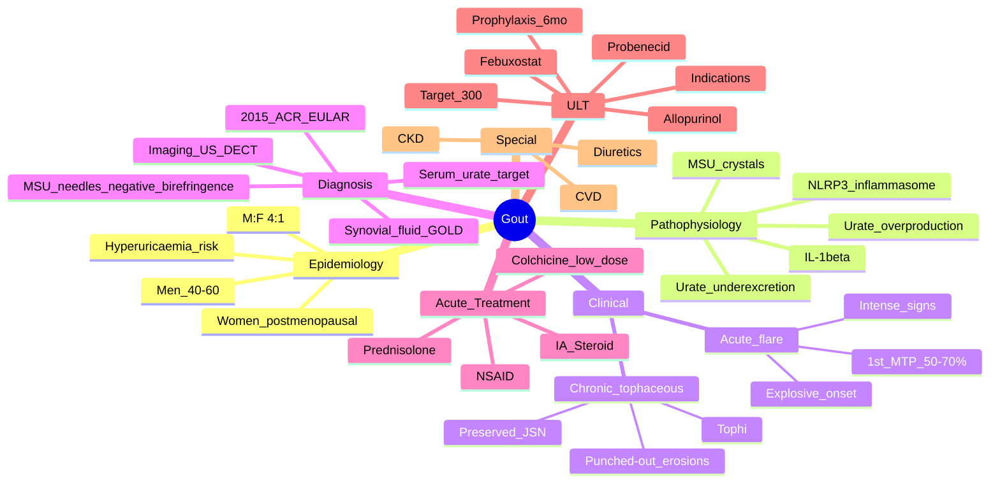

# Gout

> [!tip] **FCPS/MRCP Priority: CRITICAL**
> Gout is the **most common inflammatory arthritis in men** — acute monoarthritis (1st MTP), hyperuricaemia, MSU crystals, treat-to-target urate lowering. Guaranteed SBA/viva/OSCE topic.

---

## Learning Objectives
By the end of this note you should be able to:
- [ ] Apply 2015 ACR/EULAR classification criteria for gout
- [ ] Differentiate acute gout from septic arthritis and CPPD
- [ ] Manage acute flares (colchicine, NSAIDs, steroids) and initiate ULT with treat-to-target
- [ ] Screen for HLA-B*5801 before allopurinol in high-risk populations
- [ ] Manage gout in CKD, heart failure, and with diuretics
- [ ] Recognise chronic tophaceous gout and complications

---

## 1. Definition & Epidemiology

| Feature | Detail |
|---------|--------|
| **Definition** | Crystal deposition disease — **monosodium urate (MSU)** crystals in joints/soft tissues → **acute flares** + **chronic tophaceous gout** if untreated |
| **Prevalence** | 1-4% adults (rising); **most common inflammatory arthritis in men** |
| **Incidence** | Increasing globally (ageing, obesity, metabolic syndrome, diuretics) |
| **Peak Onset** | **Men: 40-60 years**; **Women: postmenopausal (60+)** — oestrogen is uricosuric |
| **Sex Ratio** | **M:F = 4:1** (pre-menopausal); equalises post-menopause |
| **Risk Factors** | **Hyperuricaemia** (>360 µmol/L), **metabolic syndrome** (obesity, HTN, DM, dyslipidaemia), **CKD**, **diuretics** (thiazide, loop), **alcohol** (beer > spirits > wine), **high-purine diet** (red meat, seafood, fructose), **genetics** (SLC2A9, ABCG2, SLC22A12) |

---

## 2. Aetiology & Pathophysiology

```mermaid
flowchart LR
    A[Urate Overproduction\nPurine metabolism, Lesch-Nyhan, tumour lysis] --> C[Hyperuricaemia\n>360 µmol/L (6 mg/dL)]
    B[Urate Underexcretion\nCKD, diuretics, genetic (SLC2A9, ABCG2), lead] --> C
    C --> D[MSU Crystal Formation\nSupersaturation, low temp, low pH, trauma]
    D --> E[Crystal Deposition\nJoints (1st MTP > ankle > knee), tendons, bursae, ears]
    E --> F[Innate Immune Activation\nNLRP3 Inflammasome → IL-1β]
    F --> G[Acute Flare\nNeutrophil influx, intense inflammation]
    G --> H[Chronic Tophaceous Gout\nTophi, erosions, joint destruction]
```

### Key Concepts
| Concept | Detail |
|---------|--------|
| **Solubility threshold** | **~360 µmol/L (6 mg/dL)** at 37°C, pH 7.4 — **lower in cooler joints** (1st MTP, ear) |
| **MSU crystals** | **Negatively birefringent needles** (yellow parallel to compensator) |
| **NLRP3 inflammasome** | MSU → phagocytosis → lysosomal damage → K+ efflux → NLRP3 activation → caspase-1 → **IL-1β maturation** |
| **IL-1β** | Master cytokine of gout flare → neutrophil recruitment, vasodilation, pain |
| **Tophi** | Chronic MSU deposits + foreign body reaction (macrophages, giant cells, fibrosis) |

---

## 3. Clinical Features

### Acute Gout Flare
| Feature | Description |
|---------|-------------|
| **Onset** | **Explosive** — maximal severity **within 6-12 hours** (often wakes at night) |
| **Joint** | **Monoarticular (90%)** — **1st MTP (podagra) 50-70%**, ankle, knee, wrist, elbow, fingers |
| **Signs** | **Intense pain**, **erythema** (shiny, dusky red), **swelling**, **warmth**, **exquisite tenderness** — can mimic cellulitis/sepsis |
| **Systemic** | Low-grade fever, leukocytosis, elevated CRP (inflammatory response) |
| **Duration** | **Self-limiting** — 5-14 days untreated; resolves with "desquamation" of overlying skin |
| **Trigger** | Trauma, surgery, illness, alcohol binge, large purine meal, **start/change ULT**, diuretic initiation |

### Chronic Tophaceous Gout
| Feature | Description |
|---------|-------------|
| **Tophi** | **Chalky white deposits** — helix of ear, olecranon, Achilles, prepatellar, finger pulps, 1st MTP |
| **Chronic arthritis** | Persistent pain, stiffness, joint damage from tophi + erosions |
| **Erosions** | **"Punched-out" with overhanging edges** (rat-bite), **sclerotic margins**, **preserved joint space** until late |
| **Complications** | Joint destruction, nerve compression (carpal tunnel), skin ulceration/infection, renal stones (uric acid), CKD |

### Intercritical Gout
- **Asymptomatic** between flares but **hyperuricaemia persists** → ongoing crystal deposition

---

## 4. Classification — 2015 ACR/EULAR Criteria

**Entry Requirement:** At least **1 episode of swelling, pain, or tenderness in a peripheral joint or bursa**

| Domain | Item | Score |
|--------|------|-------|
| **Clinical** | **MTP1 involvement** (ever) | 2 |
| | **Erythema overlying joint** (ever) | 1 |
| | **Male sex** | 2 |
| | **Peak inflammation <24h** (ever) | 1 |
| **Laboratory** | **Serum urate >360 µmol/L (6 mg/dL)** | 2 |
| | **MSU crystals in synovial fluid/tophus** | **+6** (sufficient alone) |
| | **Imaging: double contour sign (US) / urate deposition (DECT)** | 4 |
| | **Imaging: erosions (X-ray) / bone cysts** | 4 |

**Total Score:**
- **≥8 = Gout** (with entry criterion)
- **4-7 = Indeterminate** — consider further testing
- **<4 = Not gout**

> [!critical] **Sufficient Criteria (Diagnostic without scoring)**
> - **MSU crystals in synovial fluid or tophus** (polarised microscopy)
> - **Tophus with MSU crystals** on histology

---

## 5. Differential Diagnosis

| Condition | Distinguishing Features |
|-----------|------------------------|
| **Septic arthritis** | **Fever, toxic**, single hot joint, **WBC >50,000** (often >100,000), **positive culture** — **EMERGENCY**; can coexist with gout |
| **CPPD (Pseudogout)** | **Positively birefringent rhomboids** (blue parallel), knee > wrist > ankle, chondrocalcinosis on X-ray, older age |
| **Cellulitis** | Spreading erythema, no joint effusion, no crystals, **+ve blood culture/skin swab** |
| **Acute rheumatic fever** | Migratory polyarthritis, post-strep, Jones criteria, **+ve ASO/anti-DNase B** |
| **Reactive arthritis** | Post-GU/GI infection, oligoarthritis, enthesitis, conjunctivitis, HLA-B27 |
| **Palindromic rheumatism** | Recurrent self-limiting attacks (hours-days), complete resolution, no tophi |
| **Sarcoidosis** | Acute ankle arthritis + erythema nodosum + bilateral hilar lymphadenopathy (Löfgren's) |

> [!warning] **Gout + Septic Arthritis CAN Coexist**
> - If **crystals found + clinical suspicion of infection** → **treat as septic until cultures negative**
> - **Never assume crystals exclude sepsis**

---

## 6. Diagnosis — Investigations

### Synovial Fluid Analysis — **Gold Standard**
| Parameter | Gout |
|-----------|------|
| **Appearance** | Turbid, yellow, low viscosity |
| **WBC** | 2,000-100,000 (often 20,000-50,000) |
| **Neutrophils** | >80% |
| **Crystals** | **MSU: Negatively birefringent needles** (yellow parallel to slow axis of compensator) |
| **Culture** | Sterile (unless concomitant sepsis) |
| **Glucose** | Normal or mildly low |

> [!critical] **Polarised Microscopy**
> - **MSU (Gout)**: **Needle-shaped**, **strong negative birefringence** — **YELLOW when parallel** to compensator slow axis
> - **CPPD (Pseudogout)**: **Rhomboid/rectangular**, **weak positive birefringence** — **BLUE when parallel** to compensator slow axis
> - **Mnemonic**: **"Gout = Yellow Needles" (Negative)**; **"Pseudogout = Blue Rhomboids" (Positive)**

### Serum Urate
- **Diagnostic support** (not diagnostic alone)
- **Target for ULT**: **<300 µmol/L (5 mg/dL)**; **<360 µmol/L (6 mg/dL)** if tophi
- **Pitfall**: **Acute flare LOWERS urate** (acute phase response) — check 2-4 weeks after flare resolves

### Imaging
| Modality | Findings |
|----------|----------|
| **X-ray (chronic)** | **"Punched-out" erosions with overhanging edges** (rat-bite), **sclerotic margins**, **preserved JSN** until late, **tophi** (soft tissue masses) |
| **Ultrasound** | **Double contour sign** (urate on cartilage surface — **specific**), tophi, effusion, erosions |
| **DECT** | **Colour-coded urate deposition** — specific, quantitative |
| **CT/MRI** | Not routine; DECT > MRI for urate |

---

## 7. Management

### Acute Flare — **Treat Early (within 24h)**

```mermaid
flowchart TD
    A[Acute Gout Flare] --> B{Contraindications}
    B -->|No contraindications| C[Colchicine 500mcg stat → 500mcg 1h later → 500mcg BD\nMAX 1.5mg day 1, then 500mcg BD ×5-7 days]
    B -->|CKD/elderly/drug interactions| D[Colchicine 500mcg OD/BD (dose adjust) OR NSAID]
    B -->|NSAID contraindicated (GI/CV/CKD)| E[Prednisolone 30-35mg daily ×5-7 days → taper]
    B -->|Monoarticular, accessible| F[IA Methylprednisolone 40-80mg (large joint)]
    C --> G[Review 24-48h: if not improving → escalate/switch]
    D --> G
    E --> G
    F --> G
```

| Drug | Dose | Key Points |
|------|------|------------|
| **Colchicine** | **Low-dose**: 500mcg stat → 500mcg 1h later → 500mcg BD (max 1.5mg day 1) → 500mcg BD ×5-7d | **Avoid old high-dose** (1mg stat → 500mcg q6h = toxicity); **renal adjust** (eGFR <30: 500mcg OD); **avoid with clarithromycin, statins (↑ myopathy)** |
| **NSAID** | Naproxen 500mg BD / Indomethacin 50mg TDS / Diclofenac 50mg TDS | **COX-2 + PPI** if GI risk; **avoid in CKD, HF, IHD**; indomethacin traditional but more SE |
| **Oral Prednisolone** | 30-35mg daily ×5-7d → taper over 10-14d | 1st line if NSAID/colchicine contraindicated; **monitor glucose** |
| **IA Methylprednisolone** | 40-80mg (knee), 20-40mg (ankle), 10-20mg (small) | **Monoarticular**; exclude sepsis first; max 3-4/yr |

### Urate-Lowering Therapy (ULT) — **Treat-to-Target**

> [!important] **When to Start ULT (NICE/British Society for Rheumatology)**
> - ≥2 flares/year
> - **Tophi present**
> - **Radiographic erosions**
> - **CKD (eGFR <60)**
> - **Urolithiasis**
> - **Young onset (<40)**
> - **Patient preference** after discussion

| Drug | Dose & Titration | Monitoring | Key Points |
|------|------------------|------------|------------|
| **Allopurinol** | **Start low (50-100mg daily) → go slow** ↑ 100mg q2-4wk to target urate <300 µmol/L (max 900mg) | Urate q4wk during titration; FBC, LFT, Cr baseline + 3-monthly | **HLA-B*5801 screen** in Han Chinese, Thai, Korean, African American (SCAR risk); **renal dose adjust** (eGFR <30: 50-100mg max); **continue during acute flare** |
| **Febuxostat** | 40mg daily → ↑ 80mg if urate not <300 µmol/L | Urate, LFT, CV monitoring | **Non-purine** (OK in CKD); **CARES trial**: ↑ CV death vs allopurinol — **2nd line**; avoid in established CVD |
| **Probenecid** | 500mg BD → ↑ 1g BD (max 2g BD) | Urate, renal function, urine pH | **Uricosuric** — needs GFR >30, hydration 2-3L, alkalinisation; **contraindicated in urolithiasis** |
| **Pegloticase** | IV 8mg q2wk (refractory) | Urate, infusion reactions, anaphylaxis | **PEGylated uricase** — immunogenicity; specialist only |

> [!critical] **ULT Initiation Rules**
> 1. **Start AFTER acute flare settles** (not during)
> 2. **Prophylaxis**: **Colchicine 500mcg BD** (or NSAID/low-dose pred) **for 6 months** (prevents flare on initiation)
> 3. **Target serum urate <300 µmol/L (5 mg/dL)**; <360 µmol/L if tophi
> 4. **Don't stop ULT during flares** — treat flare separately
> 5. **Lifelong therapy** — stopping → rebound hyperuricaemia + flares

### Chronic Tophaceous Gout
- ULT target **<300 µmol/L** → tophi **dissolve over months-years**
- Large tophi: surgical excision if compressive/ulcerated (after ULT control)

---

## 8. Special Populations

### Chronic Kidney Disease (CKD)
| eGFR | Allopurinol Dose | Febuxostat | Notes |
|------|------------------|------------|-------|
| **≥60** | Standard (titrate to 900mg) | Standard | |
| **30-59** | Max 200-300mg (some guidelines 100mg/10mL/min) | Standard (no renal adjust) | **Allopurinol preferred 1st line** |
| **<30** | **50-100mg daily max** (specialist) | Standard | Febuxostat preferred if allopurinol inadequate |
| **Dialysis** | 50-100mg post-dialysis | Standard | |

### Heart Failure / Diuretics
- **Diuretics ↑ urate** → consider **losartan** (uricosuric ARB) or **SGLT2 inhibitor** (uricosuric) instead of/in addition to thiazide/loop
- **NSAIDs contraindicated** in HF — use colchicine/steroids for flares

### Cardiovascular Disease
- **Febuxostat: CARES trial showed ↑ CV mortality** — avoid if established CVD; use allopurinol
- **Allopurinol: may have CV benefit** (xanthine oxidase inhibition → ↓ oxidative stress)

---

## 9. Complications

| Complication | Detail |
|--------------|--------|
| **Uric acid nephrolithiasis** | 10-25% gout; radiolucent stones; alkalinisation (urine pH >6.5) + hydration |
| **Chronic kidney disease** | Urate crystal deposition in interstitium (urate nephropathy) — controversial contribution |
| **Tophi complications** | Nerve compression (carpal tunnel), skin ulceration, infection, tendon rupture |
| **Joint destruction** | Chronic erosive arthropathy → disability |
| **Cardiovascular disease** | Independent risk factor (inflammation, metabolic syndrome) |

---

## 10. FCPS/MRCP High-Yield Summary

| Topic | Key Points |
|-------|------------|
| **Demographics** | Men 40-60, women postmenopausal, M:F 4:1 |
| **Acute Flare** | Explosive onset (6-12h), **1st MTP (podagra) 50-70%**, intense pain/erythema/warmth |
| **Gold Standard** | **Synovial fluid: MSU negatively birefringent needles (YELLOW parallel)** |
| **Serum Urate** | Target **<300 µmol/L** for ULT; **normal during flare ≠ no gout** (check later) |
| **X-ray (Chronic)** | **Punched-out erosions with overhanging edges (rat-bite), preserved JSN, tophi** |
| **Acute Treatment** | **Colchicine low-dose** (500mcg stat→1h→BD) **OR NSAID** **OR Pred 30-35mg** **OR IA steroid** |
| **ULT Indication** | ≥2 flares/yr, tophi, erosions, CKD, stones, young onset |
| **ULT Target** | **<300 µmol/L (5 mg/dL)**; <360 µmol/L if tophi |
| **Allopurinol** | **Start low (100mg) → go slow** ↑ 100mg q2-4wk; **HLA-B*5801 screen** high-risk; continue during flare |
| **Prophylaxis** | **Colchicine 500mcg BD ×6 months** with ULT initiation |
| **Febuxostat** | 2nd line (CV risk CARES trial); non-purine (OK in CKD) |
| **CPPD vs Gout Crystals** | **Gout = Yellow Needles (Negative)**; **CPPD = Blue Rhomboids (Positive)** |

---

## 11. Viva Questions (MRCP PACES / FCPS)

| Question | Expected Answer |
|----------|----------------|
| "A 50yo man presents with acute painful swelling of 1st MTP, erythema, warmth. Serum urate 420 µmol/L. What is the diagnosis and acute management?" | **Acute gout**. Synovial fluid for MSU crystals (gold standard). Acute: **Colchicine 500mcg stat → 1h → 500mcg BD** (max 1.5mg day 1) then 500mcg BD ×5-7d. Or NSAID (naproxen 500mg BD) or pred 30-35mg daily. |
| "What is the gold standard for diagnosing gout?" | **MSU crystals in synovial fluid** on polarised microscopy: **negatively birefringent needles (yellow parallel)**. |
| "When do you start urate-lowering therapy?" | ≥2 flares/year, **tophi**, radiographic erosions, CKD (eGFR<60), urolithiasis, young onset (<40), patient preference. |
| "What is the target serum urate for ULT?" | **<300 µmol/L (5 mg/dL)**; **<360 µmol/L (6 mg/dL)** if tophi present. |
| "How do you initiate allopurinol?" | **Start low (50-100mg daily) → go slow** ↑ 100mg every 2-4 weeks to target urate. **HLA-B*5801 screen** in high-risk ethnicities. **Prophylaxis colchicine 500mcg BD ×6 months**. |
| "A patient on allopurinol develops a diffuse rash, fever, eosinophilia, facial oedema, hepatitis. What is this?" | **Allopurinol hypersensitivity syndrome (AHS/DRESS/SCAR)** — **STOP allopurinol immediately**, supportive care, steroids, avoid rechallenge. Screen HLA-B*5801 pre-treatment in high-risk. |
| "How do you differentiate gout from pseudogout on synovial fluid?" | **Gout: MSU = negatively birefringent needles (YELLOW parallel)**. **CPPD = positively birefringent rhomboids (BLUE parallel)**. |
| "Why is serum urate often normal during an acute gout flare?" | **Acute phase response lowers urate** (increased renal excretion). Check 2-4 weeks after flare resolves. |

---

## 12. Confusions & Mnemonics

| Confusion | Clarification |
|-----------|---------------|
| **Normal urate in acute gout** | Acute phase response ↑ renal urate excretion → **check 2-4 weeks post-flare** |
| **Allopurinol during flare** | **CONTINUE** — stopping causes urate fluctuation → more flares |
| **Colchicine dosing** | **OLD (toxic): 1mg stat → 500mcg q6h**. **NEW (safe): 500mcg stat → 500mcg 1h later → 500mcg BD** |
| **Febuxostat CV risk** | CARES trial: ↑ CV death vs allopurinol — **avoid in established CVD** |
| **Gout vs CPPD crystals** | **Gout = Needles, Negative, Yellow**. **CPPD = Rhomboids, Positive, Blue** |
| **ULT prophylaxis** | **Essential** — starting ULT without prophylaxis → flare in ~50% |

**Mnemonic: Gout Crystals = "YELLOW NEEDLES"**
- **Y**ellow when parallel
- **N**eedles
- **E**xtremely **N**egative **B**irefringence

**Mnemonic: CPPD Crystals = "BLUE RHOMBOIDS"**
- **B**lue when parallel
- **R**homboids
- **O**r rectangular
- **P**ositive birefringence

**Mnemonic: ULT Initiation = "START LOW, GO SLOW, PROPHYLAXIS"**
- **S**tart **L**ow (100mg allopurinol)
- **G**o **S**low (↑ 100mg q2-4wk)
- **P**rophylaxis (colchicine 500mcg BD ×6mo)

**Mnemonic: Allopurinol HLA Risk = "HAN CHINESE, THAI, KOREAN, AFRICAN AMERICAN"**
- Screen **HLA-B*5801** before starting in these populations

---

## 13. Mind Map



---

## 14. One-Page Revision Card

| Domain | Key Points |
|--------|------------|
| **Demographics** | Men 40-60, women postmenopausal, M:F 4:1; metabolic syndrome, CKD, diuretics |
| **Acute Flare** | Explosive (6-12h), **1st MTP (podagra) 50-70%**, intense pain/erythema/warmth, self-limiting 5-14d |
| **Gold Standard** | **Synovial fluid: MSU negatively birefringent needles (YELLOW parallel)** |
| **Serum Urate** | Target **<300 µmol/L**; normal during flare ≠ no gout (check post-flare) |
| **X-ray Chronic** | **Punched-out erosions with overhanging edges (rat-bite), preserved JSN, tophi** |
| **Acute Rx** | **Colchicine 500mcg stat→1h→BD** (max 1.5mg d1) **OR NSAID** **OR Pred 30-35mg** **OR IA steroid** |
| **ULT Indication** | ≥2 flares/yr, tophi, erosions, CKD, stones, young onset |
| **ULT Target** | **<300 µmol/L**; <360 µmol/L if tophi |
| **Allopurinol** | Start 100mg → ↑100mg q2-4wk; **HLA-B*5801** high-risk; **continue during flare** |
| **Prophylaxis** | **Colchicine 500mcg BD ×6mo** with ULT initiation |
| **Febuxostat** | 2nd line (CV risk); non-purine (OK in CKD) |
| **Crystals** | **Gout = Yellow Needles (Neg)**; **CPPD = Blue Rhomboids (Pos)** |

---

## 15. Spaced Repetition Trackers

| Review Interval | Date Completed | Confidence (1-5) | Notes |
|-----------------|----------------|------------------|-------|
| 24 hours | | | |
| 7 days | | | |
| 15 days | | | |
| 30 days | | | |
| 90 days | | | |

---

## 16. Self-Test Scorecard

| Section | Score /5 | Last Attempt |
|---------|----------|--------------|
| Acute Flare Recognition & Management | | |
| Synovial Fluid Crystal Identification | | |
| ULT Indications & Targets | | |
| Allopurinol Initiation & HLA Screening | | |
| Febuxostat vs Allopurinol | | |
| Acute vs Chronic Gout | | |
| Gout vs CPPD vs Septic | | |
| Special Populations (CKD, CVD) | | |
| Viva Questions | | |

---

## Local Navigation
- **Parent Heading**: [[../Crystal Arthropathies|Crystal Arthropathies]]
- **Parent Topic Group**: [[Crystal arthropathies]]
- **Chapter Map**: [[../Davidson Chapter 26 - Rheumatology Hierarchy|Rheumatology Hierarchy]]
- **Chapter MOC**: [[../Rheumatology MOC|Rheumatology MOC]]
- **Drug Reference**: [[../../Clinical Approach to Musculoskeletal Disease/Drugs in rheumatology|Drugs in rheumatology]]
- **Investigation Reference**: [[../../Clinical Approach to Musculoskeletal Disease/Investigations in rheumatology|Investigations in rheumatology]]
- **Related**: [[Pseudogout (CPPD deposition disease)]] · [[Urate-lowering therapy]]
---

> Auto-generated study sections for "Crystal Arthropathies" — Ch 25: Rheumatology & Bone Disease.

## Flashcards (55 generated)

- Q: What is the definition of Crystal Arthropathies?
  A: Crystal deposition disease — monosodium urate (MSU) crystals in joints/soft tissues → acute flares + chronic tophaceous gout if untreated
- Q: What is the epidemiology of Crystal Arthropathies?
  A: 1-4% adults (rising); most common inflammatory arthritis in men
- Q: What is Peak Onset of Crystal Arthropathies?
  A: Men: 40-60 years; Women: postmenopausal (60+) — oestrogen is uricosuric
- Q: What is Sex Ratio of Crystal Arthropathies?
  A: M:F = 4:1 (pre-menopausal); equalises post-menopause
- Q: What causes Crystal Arthropathies?
  A: Hyperuricaemia (>360 µmol/L), metabolic syndrome (obesity, HTN, DM, dyslipidaemia), CKD, diuretics (thiazide, loop), alcohol (beer > spirits > wine), high-purine diet (red meat, seafood, fructose), genetics (SLC2A9, ABCG2, SLC22A12)
- Q: What is Solubility threshold of Crystal Arthropathies?
  A: ~360 µmol/L (6 mg/dL) at 37°C, pH 7.4 — lower in cooler joints (1st MTP, ear)
- Q: What is MSU crystals of Crystal Arthropathies?
  A: Negatively birefringent needles (yellow parallel to compensator)
- Q: What is NLRP3 inflammasome of Crystal Arthropathies?
  A: MSU → phagocytosis → lysosomal damage → K+ efflux → NLRP3 activation → caspase-1 → IL-1β maturation
- Q: What is IL-1β of Crystal Arthropathies?
  A: Master cytokine of gout flare → neutrophil recruitment, vasodilation, pain
- Q: What is Tophi of Crystal Arthropathies?
  A: Chronic MSU deposits + foreign body reaction (macrophages, giant cells, fibrosis)
- Q: What is Onset of Crystal Arthropathies?
  A: Explosive — maximal severity within 6-12 hours (often wakes at night)
- Q: What is Joint of Crystal Arthropathies?
  A: Monoarticular (90%) — 1st MTP (podagra) 50-70%, ankle, knee, wrist, elbow, fingers
- Q: What is Signs of Crystal Arthropathies?
  A: Intense pain, erythema (shiny, dusky red), swelling, warmth, exquisite tenderness — can mimic cellulitis/sepsis
- Q: What is Systemic of Crystal Arthropathies?
  A: Low-grade fever, leukocytosis, elevated CRP (inflammatory response)
- Q: What is Duration of Crystal Arthropathies?
  A: Self-limiting — 5-14 days untreated; resolves with "desquamation" of overlying skin
- Q: What is Trigger of Crystal Arthropathies?
  A: Trauma, surgery, illness, alcohol binge, large purine meal, start/change ULT, diuretic initiation
- Q: What is Tophi of Crystal Arthropathies?
  A: Chalky white deposits — helix of ear, olecranon, Achilles, prepatellar, finger pulps, 1st MTP
- Q: What is Chronic arthritis of Crystal Arthropathies?
  A: Persistent pain, stiffness, joint damage from tophi + erosions
- Q: What is Erosions of Crystal Arthropathies?
  A: "Punched-out" with overhanging edges (rat-bite), sclerotic margins, preserved joint space until late
- Q: What are the complications of Crystal Arthropathies?
  A: Joint destruction, nerve compression (carpal tunnel), skin ulceration/infection, renal stones (uric acid), CKD
- Q: What is Uric acid nephrolithiasis of Crystal Arthropathies?
  A: 10-25% gout; radiolucent stones; alkalinisation (urine pH >6.5) + hydration
- Q: What is Chronic kidney disease of Crystal Arthropathies?
  A: Urate crystal deposition in interstitium (urate nephropathy) — controversial contribution
- Q: What are the complications of Crystal Arthropathies?
  A: Nerve compression (carpal tunnel), skin ulceration, infection, tendon rupture
- Q: What is Joint destruction of Crystal Arthropathies?
  A: Chronic erosive arthropathy → disability
- Q: What is Cardiovascular disease of Crystal Arthropathies?
  A: Independent risk factor (inflammation, metabolic syndrome)
- Q: What is Solubility threshold of Crystal Arthropathies?
  A: ~360 µmol/L (6 mg/dL) at 37°C, pH 7.4 — lower in cooler joints (1st MTP, ear)
- Q: What is MSU crystals of Crystal Arthropathies?
  A: Negatively birefringent needles (yellow parallel to compensator)
- Q: What is NLRP3 inflammasome of Crystal Arthropathies?
  A: MSU → phagocytosis → lysosomal damage → K+ efflux → NLRP3 activation → caspase-1 → IL-1β maturation
- Q: What is IL-1β of Crystal Arthropathies?
  A: Master cytokine of gout flare → neutrophil recruitment, vasodilation, pain
- Q: What is Tophi of Crystal Arthropathies?
  A: Chronic MSU deposits + foreign body reaction (macrophages, giant cells, fibrosis)
- Q: What is Onset of Crystal Arthropathies?
  A: Explosive — maximal severity within 6-12 hours (often wakes at night)
- Q: What is Joint of Crystal Arthropathies?
  A: Monoarticular (90%) — 1st MTP (podagra) 50-70%, ankle, knee, wrist, elbow, fingers
- Q: What is Signs of Crystal Arthropathies?
  A: Intense pain, erythema (shiny, dusky red), swelling, warmth, exquisite tenderness — can mimic cellulitis/sepsis
- Q: What is Systemic of Crystal Arthropathies?
  A: Low-grade fever, leukocytosis, elevated CRP (inflammatory response)
- Q: What is Duration of Crystal Arthropathies?
  A: Self-limiting — 5-14 days untreated; resolves with "desquamation" of overlying skin
- Q: What is Tophi of Crystal Arthropathies?
  A: Chalky white deposits — helix of ear, olecranon, Achilles, prepatellar, finger pulps, 1st MTP
- Q: What is Chronic arthritis of Crystal Arthropathies?
  A: Persistent pain, stiffness, joint damage from tophi + erosions
- Q: What is Erosions of Crystal Arthropathies?
  A: "Punched-out" with overhanging edges (rat-bite), sclerotic margins, preserved joint space until late
- Q: What is Uric acid nephrolithiasis of Crystal Arthropathies?
  A: 10-25% gout; radiolucent stones; alkalinisation (urine pH >6.5) + hydration
- Q: What is Chronic kidney disease of Crystal Arthropathies?
  A: Urate crystal deposition in interstitium (urate nephropathy) — controversial contribution
- Q: What are the complications of Crystal Arthropathies?
  A: Nerve compression (carpal tunnel), skin ulceration, infection, tendon rupture
- Q: What is Joint destruction of Crystal Arthropathies?
  A: Chronic erosive arthropathy → disability
- Q: What is Cardiovascular disease of Crystal Arthropathies?
  A: Independent risk factor (inflammation, metabolic syndrome)
- Q: What is Demographics of Crystal Arthropathies?
  A: Men 40-60, women postmenopausal, M:F 4:1
- Q: What is Acute Flare of Crystal Arthropathies?
  A: Explosive onset (6-12h), 1st MTP (podagra) 50-70%, intense pain/erythema/warmth
- Q: What is Gold Standard of Crystal Arthropathies?
  A: Synovial fluid: MSU negatively birefringent needles (YELLOW parallel)
- Q: What is Serum Urate of Crystal Arthropathies?
  A: Target <300 µmol/L for ULT; normal during flare ≠ no gout (check later)
- Q: What is X-ray (Chronic) of Crystal Arthropathies?
  A: Punched-out erosions with overhanging edges (rat-bite), preserved JSN, tophi
- Q: How is Crystal Arthropathies managed?
  A: Colchicine low-dose (500mcg stat→1h→BD) OR NSAID OR Pred 30-35mg OR IA steroid
- Q: What is Crystal Arthropathies indicated for?
  A: ≥2 flares/yr, tophi, erosions, CKD, stones, young onset
- Q: What is ULT Target of Crystal Arthropathies?
  A: <300 µmol/L (5 mg/dL); <360 µmol/L if tophi
- Q: What is Allopurinol of Crystal Arthropathies?
  A: Start low (100mg) → go slow ↑ 100mg q2-4wk; HLA-B5801 screen high-risk; continue during flare
- Q: What is Prophylaxis of Crystal Arthropathies?
  A: Colchicine 500mcg BD ×6 months with ULT initiation
- Q: What is Febuxostat of Crystal Arthropathies?
  A: 2nd line (CV risk CARES trial); non-purine (OK in CKD)
- Q: What is CPPD vs Gout Crystals of Crystal Arthropathies?
  A: Gout = Yellow Needles (Negative); CPPD = Blue Rhomboids (Positive)

## MCQs (1 generated)

1. **Which of the following best describes Crystal Arthropathies?**
   A. **Gout is the most common inflammatory arthritis in men — acute monoarthritis (1st MTP), hyperuricaemia, MSU crystals, treat-to-target urate lowering.**
   B. An unrelated condition not matching the clinical picture of Crystal Arthropathies
   C. A complication seen late in the disease course of Crystal Arthropathies
   D. A condition that mimics Crystal Arthropathies but has a different underlying cause

## SBA Questions (1 generated)

1. A patient with suspected Crystal Arthropathies presents with: Definition — Crystal deposition disease — monosodium urate (MSU) crystals in joints/soft tissues → acute flares + chronic tophaceous gout if untreated; Prevalence — 1-4% adults (rising); most common inflammatory arthritis in men; Incidence — Increasing globally (ageing, obesity, metabolic syndrome, diuretics). What is the most likely diagnosis?
   A. **Crystal Arthropathies**
   B. A condition that mimics Crystal Arthropathies but is not the same entity
   C. A complication of Crystal Arthropathies rather than the primary diagnosis
   D. An unrelated condition in the same clinical category as Crystal Arthropathies

## PasTest Scenario SBAs (Clinical Vignettes)

> **Auto-generated PasTest/Mediscope-style scenario SBAs** grounded in the authored source. Each scenario tests a real clinical fact (triad, specific sign, contraindication, trial, first-line Rx) extracted from the topic. *Source: Ch 25: Rheumatology — Gout*

**Q1.** Which of the following features is most specific or characteristic of Gout?

  - **A.** Diagnostic support
  - **B.** A feature common to many acute inflammatory conditions
  - **C.** A non-specific sign that does not localise the diagnosis
  - **D.** An investigation finding rather than a clinical feature

  > **Answer: A** — Diagnostic support
  >
  > *Source:* out = Yellow Needles" (Negative)**; **"Pseudogout = Blue Rhomboids" (Positive)**

### Serum Urate
- **Diagnostic support** (not diagnostic alone)
- **Target for ULT**: **<300 µmol/L (5 mg/dL)**; **<36

**Q2.** Which landmark clinical trial provided evidence relevant to the management of Gout (specifically: CVD |
| **Probenecid** | 500mg BD → ↑ 1g BD (max 2g BD) | Urate, renal function, urine pH | **Uricosuric** — needs GFR >)?

  - **A.** CARES trial
  - **B.** A different but related trial in the same area
  - **C.** A guideline (not a trial) addressing the same question
  - **D.** An observational/cohort study addressing similar outcomes

  > **Answer: A** — CARES trial
  >
  > *Source:* daily → ↑ 80mg if urate not <300 µmol/L | Urate, LFT, CV monitoring | **Non-purine** (OK in CKD); **CARES trial**: ↑ CV death vs allopurinol — **2nd line**; avoid in established CVD |
| **Probenecid**

**Q3.** What is the most appropriate first-line therapy for Gout?

  - **A.** Treat Early
  - **B.** An advanced/surgical therapy reserved for refractory disease
  - **C.** Symptomatic treatment only, no disease-modifying therapy
  - **D.** Empiric broad-spectrum therapy without specific indication

  > **Answer: A** — Treat Early
  >
  > *Source:* ### Acute Flare — **Treat Early (within 24h)**

```mermaid
flowchart TD

