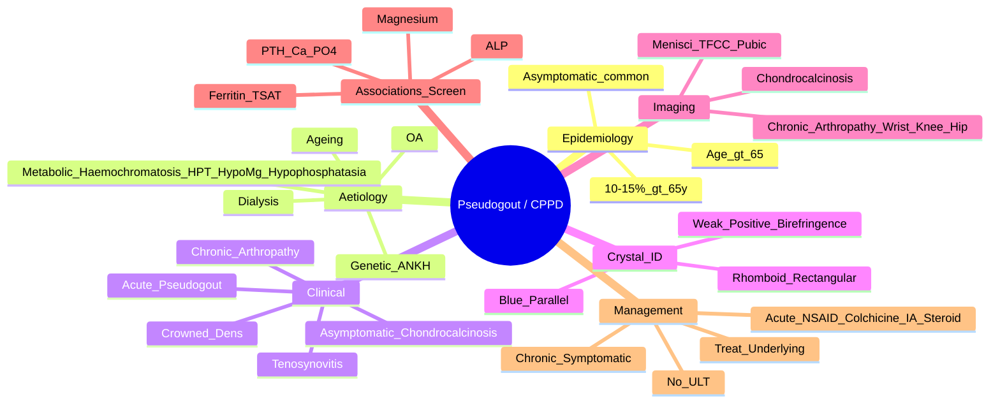

# Pseudogout (CPPD Deposition Disease)

> [!tip] **FCPS/MRCP Priority: HIGH**
> CPPD = **calcium pyrophosphate dihydrate** crystal deposition. Key differentiator from gout: **rhomboid crystals, positive birefringence**. Chondrocalcinosis on X-ray = hallmark. Associations (haemochromatosis, hyperparathyroidism, hypomagnesaemia) are exam favourites.

---

## Learning Objectives
By the end of this note you should be able to:
- [ ] Identify CPPD crystals on polarised microscopy (rhomboid, positive birefringence)
- [ ] Recognise chondrocalcinosis on X-ray (menisci, TFCC, pubic symphysis)
- [ ] Differentiate acute CPPD from gout, septic arthritis, OA flare
- [ ] List metabolic associations requiring screening (haemochromatosis, hyperparathyroidism, hypomagnesaemia, hypophosphatasia)
- [ ] Manage acute attacks and chronic pyrophosphate arthropathy
- [ ] Understand there is no disease-modifying ULT for CPPD

---

## 1. Definition & Epidemiology

| Feature | Detail |
|---------|--------|
| **Definition** | Deposition of **calcium pyrophosphate dihydrate (CPPD)** crystals in articular cartilage, fibrocartilage, and soft tissues → acute inflammation ("pseudogout") or chronic arthropathy |
| **Prevalence** | Increases with age — **10-15% >65y**, **40% >85y** (autopsy); many asymptomatic |
| **Peak Onset** | **>65 years** (rare <50 unless metabolic association) |
| **Sex Ratio** | M = F (slight female predominance in elderly) |
| **Genetics** | **ANKH** mutations (familial CPPD); sporadic more common |

---

## 2. Aetiology & Associations — **High-Yield Screening**

| Association | Mechanism | Screening |
|-------------|-----------|-----------|
| **Ageing** | Decreased pyrophosphatase activity, cartilage changes | — |
| **Osteoarthritis** | Cartilage damage releases PPi, promotes nucleation | — |
| **Haemochromatosis** | Iron inhibits pyrophosphatase | **Ferritin, transferrin saturation, HFE genotyping** |
| **Hyperparathyroidism** | ↑ Calcium × Phosphate product, altered PPi metabolism | **PTH, Calcium, Phosphate** |
| **Hypomagnesaemia** | Mg²⁺ cofactor for pyrophosphatase | **Serum Magnesium** |
| **Hypophosphatasia** | Low ALP → impaired PPi hydrolysis | **ALP (low), pyridoxal phosphate** |
| **Renal Dialysis** | Altered mineral metabolism | — |
| **Familial (ANKH)** | ANKH protein transports PPi out of cells | Genetic testing if early onset/family history |

> [!critical] **Screen in New CPPD Diagnosis (<65y or Unusual Joints)**
> 1. **Ferritin + Transferrin Saturation** (haemochromatosis)
> 2. **PTH + Calcium + Phosphate** (hyperparathyroidism)
> 3. **Magnesium** (hypomagnesaemia)
> 4. **ALP** (hypophosphatasia if low)

---

## 3. Clinical Manifestations

| Form | Description |
|------|-------------|
| **1. Acute CPP Crystal Arthritis ("Pseudogout")** | Acute mono/oligoarthritis, **knee > wrist > ankle/elbow**, mimics gout but **less intense**, self-limiting (days-weeks) |
| **2. Chronic Pyrophosphate Arthropathy** | **OA-like** but with **chondrocalcinosis**, **pyrophosphate arthropathy** (wrists: scapholunate, knees, hips), can mimic RA |
| **3. Asymptomatic Chondrocalcinosis** | Incidental X-ray finding, no clinical symptoms |
| **4. Crowned Dens Syndrome** | CPPD in **atlantoaxial joint** → acute neck pain, fever, elevated CRP, **periodontoid calcification on CT** |
| **5. Tenosynovitis/Bursitis** | CPPD in tendon sheaths/bursae (e.g., wrist, knee) |

### Acute Attack vs Gout
| Feature | **Pseudogout (CPPD)** | **Gout (MSU)** |
|---------|----------------------|----------------|
| **Typical Joint** | **Knee (50%) > Wrist > Ankle** | **1st MTP (50-70%) > Ankle > Knee** |
| **Onset** | Acute, severe, but **less dramatic** than gout | **Explosive**, maximal in 6-12h |
| **Age** | **>65 years** | 40-60 (men), postmenopausal (women) |
| **Systemic** | Fever, elevated CRP common | Fever, elevated CRP common |
| **Duration** | Days to weeks | 5-14 days |

---

## 4. Crystal Identification — **Gold Standard**

```mermaid
flowchart TD
    A[Synovial Fluid\nPolarised Microscopy] --> B{Crystal Shape}
    B -->|Needle-shaped| C[MSU = Gout]
    C --> D{Birefringence}
    D -->|Negative\n(Yellow parallel)| E[**Gout Confirmed**]
    B -->|Rhomboid/Rectangular| F[CPPD = Pseudogout]
    F --> G{Birefringence}
    G -->|Positive\n(Blue parallel)| H[**CPPD Confirmed**]
```

| Property | **MSU (Gout)** | **CPPD (Pseudogout)** |
|----------|----------------|----------------------|
| **Shape** | **Needle-shaped** | **Rhomboid / Rectangular** |
| **Birefringence** | **Negative** (strong) | **Positive** (weak) |
| **Colour (Parallel to Slow Axis)** | **Yellow** | **Blue** |
| **Colour (Perpendicular)** | Blue | Yellow |

> [!critical] **Mnemonic: Crystal ID**
> - **Gout = Yellow Needles (Negative)**
> - **Pseudogout = Blue Rhomboids (Positive)**
> - **"Gout = Yell**ow"; **"Pseudo = Blue"**

---

## 5. Imaging — Chondrocalcinosis

| Site | X-ray Finding | Significance |
|------|---------------|--------------|
| **Knee** | **Linear calcification of menisci** (both medial & lateral) | **Most common** |
| **Wrist** | **Triangular Fibrocartilage Complex (TFCC)** calcification | **Highly specific** |
| **Pubic Symphysis** | Linear calcification | Common |
| **Spine** | Intervertebral disc calcification | Less specific |
| **Hip** | Labrum, acetabular cartilage | Rare |
| **Elbow/Shoulder** | Fibrocartilage | Rare |

> [!important] **Chondrocalcinosis = Linear Calcification of Fibrocartilage**
> - **Distinct from** osteophyte (marginal bony) or hydroxyapatite (soft tissue)
> - **TFCC + menisci** = classic duo for CPPD

### Chronic Pyrophosphate Arthropathy (X-ray)
| Joint | Findings |
|-------|----------|
| **Wrist** | **Scapholunate dissociation**, carpal collapse, **"pyrophosphate arthropathy"** — mimics RA but with chondrocalcinosis |
| **Knee** | OA-like (JSN, osteophytes, sclerosis) **but** with **chondrocalcinosis**, more severe than clinical OA |
| **Hip** | Rapid destructive arthropathy, **superomedial migration** |
| **Spine** | Disc calcification, facet joint OA |

---

## 6. Differential Diagnosis

| Condition | Distinguishing Features |
|-----------|------------------------|
| **Gout** | **MSU crystals (needles, negative birefringence)**, 1st MTP predominant, younger, urate elevation |
| **Septic Arthritis** | **Fever, toxic**, WBC >50,000 (often >100,000), **positive culture** — **emergency**; can **coexist with CPPD** |
| **OA** | Mechanical pain, bony swelling, **no chondrocalcinosis** (unless CPPD coexists), normal inflammatory markers |
| **RA** | Symmetrical polyarthritis, **RF/CCP+**, erosions, no chondrocalcinosis |
| **Basic Calcium Phosphate (BCP)** | **No crystals on polarised light** (too small), Milwaukee shoulder (elderly women, shoulder), hydroxyapatite |

> [!warning] **CPPD + Septic Arthritis Can Coexist**
> - If crystals found + clinical sepsis → **treat as septic until cultures negative**

---

## 7. Management

### Acute Attack (Treat Like Gout)
| Drug | Dose | Notes |
|------|------|-------|
| **NSAIDs** | Naproxen 500mg BD / Diclofenac 50mg TDS / Indomethacin 50mg TDS | **1st line**; COX-2 + PPI if GI risk; avoid in CKD/HF/IHD |
| **Colchicine** | **Low-dose**: 500mcg stat → 500mcg 1h later → 500mcg BD ×5-7d | Renal adjust (eGFR <30: 500mcg OD); avoid clarithromycin/statins |
| **Oral Prednisolone** | 30-35mg daily ×5-7d → taper | If NSAID/colchicine contraindicated |
| **IA Methylprednisolone** | 40-80mg (knee), 20-40mg (wrist/ankle) | Monoarticular; exclude sepsis first |

> [!important] **No Disease-Modifying ULT for CPPD**
> - **No allopurinol equivalent** — cannot dissolve CPPD crystals
> - **Treat underlying metabolic cause** if identified (e.g., phlebotomy for haemochromatosis, parathyroidectomy for hyperparathyroidism, Mg replacement)
> - **Chronic management**: NSAIDs, IA steroids, physiotherapy, joint replacement if severe

### Chronic Pyrophosphate Arthropathy
| Approach | Details |
|----------|---------|
| **Symptomatic** | NSAIDs, IA steroids (max 3-4/yr/joint), physiotherapy |
| **Treat Underlying** | Phlebotomy (haemochromatosis), parathyroidectomy (hyperparathyroidism), Mg replacement (hypomagnesaemia) |
| **Surgery** | Joint replacement (knee, hip, wrist) if end-stage |

---

## 8. FCPS/MRCP High-Yield Summary

| Topic | Key Points |
|-------|------------|
| **Crystal** | **CPPD = Rhomboid/Rectangular, Weak Positive Birefringence (Blue Parallel)** |
| **Mnemonic** | **Pseudogout = Blue Rhomboids (Positive)** vs **Gout = Yellow Needles (Negative)** |
| **Chondrocalcinosis** | **Linear calcification of fibrocartilage**: Menisci (knee), **TFCC (wrist)**, Pubic symphysis |
| **Clinical** | **Knee > Wrist > Ankle**; older (>65); less dramatic than gout |
| **Associations (Screen!)** | **Haemochromatosis** (Ferritin, TSAT), **Hyperparathyroidism** (PTH, Ca), **Hypomagnesaemia** (Mg), **Hypophosphatasia** (low ALP), **ANKH** (familial) |
| **Crowned Dens** | CPPD in atlantoaxial → acute neck pain, fever, periodontoid calcification on CT |
| **Acute Rx** | NSAID / Colchicine low-dose / IA Steroid / Oral Pred (like gout) |
| **No ULT** | **No allopurinol equivalent** — treat underlying cause only |
| **Chronic Arthropathy** | Wrist (scapholunate), knee, hip — OA-like + chondrocalcinosis |

---

## 9. Viva Questions (MRCP PACES / FCPS)

| Question | Expected Answer |
|----------|----------------|
| "How do you differentiate pseudogout from gout on synovial fluid?" | **Pseudogout: CPPD rhomboid/rectangular, weakly positive birefringence (Blue parallel)**. **Gout: MSU needles, strong negative birefringence (Yellow parallel)**. |
| "What is chondrocalcinosis and where do you see it?" | **Linear calcification of fibrocartilage** — **menisci (knee), TFCC (wrist), pubic symphysis** on X-ray. |
| "A 70yo woman presents with acute knee arthritis. Synovial fluid shows rhomboid crystals, positive birefringence. What metabolic screen do you order?" | **Ferritin/TSAT (haemochromatosis), PTH/Ca/PO4 (hyperparathyroidism), Magnesium (hypomagnesaemia), ALP (hypophosphatasia)** — especially if <75y or unusual joints. |
| "What is crowned dens syndrome?" | **CPPD deposition in atlantoaxial joint** → acute neck pain, fever, elevated CRP, **periodontoid calcification on CT**. |
| "Is there urate-lowering therapy for CPPD?" | **No** — no drug dissolves CPPD crystals. **Treat underlying metabolic cause** if identified (phlebotomy, parathyroidectomy, Mg replacement). |
| "A patient on haemodialysis develops acute shoulder arthritis with calcification. Crystal ID?" | **Basic calcium phosphate (BCP) / Hydroxyapatite** — "Milwaukee shoulder" (elderly women, shoulder). **Too small for polarised light**; alizarin red S stain. |
| "How does chronic CPPD arthropathy of the wrist differ from RA?" | **CPPD: scapholunate dissociation + chondrocalcinosis**. RA: symmetric MCP/PIP/wrist erosions, no chondrocalcinosis, +RF/CCP. |

---

## 10. Confusions & Mnemonics

| Confusion | Clarification |
|-----------|---------------|
| **CPPD vs Gout Crystals** | **CPPD = Rhomboid, Positive, Blue**. **MSU = Needle, Negative, Yellow**. |
| **Chondrocalcinosis vs Osteophyte** | Chondrocalcinosis = **linear, fibrocartilage** (menisci, TFCC). Osteophyte = **marginal bony** outgrowth. |
| **BCP (Milwaukee Shoulder)** | **No crystals on polarised light** (hydroxyapatite too small). Alizarin red S stain. Elderly women, shoulder, massive rotator cuff tear. |
| **CPPD + Sepsis** | **Treat as septic until cultures negative** — crystals don't exclude infection. |
| **Screening Age** | **Screen metabolic causes if <65y, atypical joints, or early onset**. |

**Mnemonic: CPPD Crystal = "BLUE RHOMBOIDS"**
- **B**lue (parallel)
- **R**homboid/Rectangular
- **O**r **R**ectangular
- **P**ositive birefringence

**Mnemonic: Chondrocalcinosis Sites = "M-T-P"**
- **M**enisci (Knee)
- **T**FCC (Wrist)
- **P**ubic Symphysis

**Mnemonic: Metabolic Associations = "H-H-H-H"**
- **H**aemochromatosis (Iron)
- **H**yperparathyroidism (Ca/PTH)
- **H**ypomagnesaemia (Mg)
- **H**ypophosphatasia (Low ALP)

**Mnemonic: Crowned Dens = "ATLANTOAXIAL + CPPD = NECK PAIN + FEVER + PERIODONTOID CALCIFICATION"**

---

## 11. Mind Map



---

## 12. One-Page Revision Card

| Domain | Key Points |
|--------|------------|
| **Crystal** | **CPPD = Rhomboid/Rectangular, Weak Positive Birefringence (Blue Parallel)** |
| **Gout Crystal** | **MSU = Needle, Strong Negative Birefringence (Yellow Parallel)** |
| **Chondrocalcinosis** | Linear calcification: **Menisci (knee), TFCC (wrist), Pubic symphysis** |
| **Clinical** | **Knee > Wrist**, >65y, less dramatic than gout |
| **Associations (Screen!)** | **Haemochromatosis** (Ferritin/TSAT), **Hyperparathyroidism** (PTH/Ca), **Hypomagnesaemia** (Mg), **Hypophosphatasia** (Low ALP), ANKH |
| **Crowned Dens** | CPPD in atlantoaxial → neck pain, fever, periodontoid calcification on CT |
| **Acute Rx** | NSAID / Colchicine low-dose / IA Steroid / Oral Pred (same as gout) |
| **No ULT** | **No allopurinol equivalent** — treat underlying metabolic cause |
| **Chronic Arthropathy** | Wrist (scapholunate), Knee, Hip — OA-like + chondrocalcinosis |

---

## 13. Spaced Repetition Trackers

| Review Interval | Date Completed | Confidence (1-5) | Notes |
|-----------------|----------------|------------------|-------|
| 24 hours | | | |
| 7 days | | | |
| 15 days | | | |
| 30 days | | | |
| 90 days | | | |

---

## 14. Self-Test Scorecard

| Section | Score /5 | Last Attempt |
|---------|----------|--------------|
| Crystal Identification (CPPD vs MSU) | | |
| Chondrocalcinosis Sites | | |
| Metabolic Associations & Screening | | |
| Acute vs Gout vs Septic | | |
| Crowned Dens Syndrome | | |
| Management (No ULT) | | |
| Viva Questions | | |

---

## Local Navigation
- **Parent Heading**: [[../Crystal Arthropathies|Crystal Arthropathies]]
- **Parent Topic Group**: [[Crystal arthritis]]
- **Chapter Map**: [[../Davidson Chapter 26 - Rheumatology Hierarchy|Rheumatology Hierarchy]]
- **Chapter MOC**: [[../Rheumatology MOC|Rheumatology MOC]]
- **Drug Reference**: [[../../Clinical Approach to Musculoskeletal Disease/Drugs in rheumatology|Drugs in rheumatology]]
- **Investigation Reference**: [[../../Clinical Approach to Musculoskeletal Disease/Investigations in rheumatology|Investigations in rheumatology]]
- **Related**: [[Gout]] · [[Basic calcium phosphate crystal deposition]]