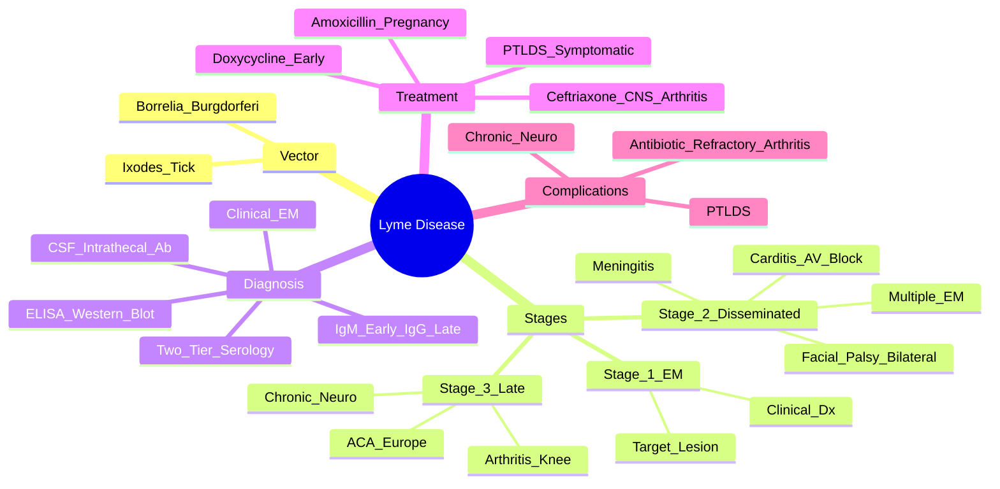

# Lyme Disease (Lyme Borreliosis)

> [!tip] **FCPS/MRCP Priority: HIGH**
> Lyme = **Borrelia burgdorferi, Ixodes tick-borne**. Three stages: **Early localised (EM rash) → Early disseminated (neuro, cardiac) → Late (arthritis)**. **EM rash (target lesion) = clinical diagnosis**. **Two-tier serology (ELISA → Western blot)**. **Doxycycline early / Ceftriaxone IV for CNS/arthritis/carditis**.

---

## Learning Objectives
By the end of this note you should be able to:
- [ ] Recognise **erythema migrans (target lesion)** as clinical diagnosis
- [ ] Stage Lyme disease: **1) Localised (EM) → 2) Disseminated (neuro/cardiac) → 3) Late (arthritis)**
- [ ] Interpret **two-tier serology (ELISA → Western blot)** — IgM early, IgG late
- [ ] Differentiate **Lyme facial palsy (bilateral!)** from Bell's palsy
- [ ] Select treatment: **Doxycycline (early/no CNS)** vs **Ceftriaxone IV (CNS/arthritis/carditis)**
- [ ] Understand **post-treatment Lyme syndrome** vs antibiotic-refractory arthritis

---

## 1. Definition & Epidemiology

| Feature | Detail |
|---------|--------|
| **Definition** | Multi-system tick-borne infection caused by **Borrelia burgdorferi sensu lato** (B. burgdorferi s.s., B. afzelii, B. garinii) transmitted by **Ixodes ticks** |
| **Vector** | **Ixodes scapularis** (NE/Midwest US), **I. pacificus** (West US), **I. ricinus** (Europe), **I. persulcatus** (Asia) |
| **Incidence** | ~30,000 reported/year US (actual ~476,000); Europe ~85,000/year |
| **Peak Season** | **Spring-Summer** (nymphal tick activity May-July) |
| **Endemic Areas** | NE/Mid-Atlantic/North-Central US; Central/Eastern Europe; UK (Scotland, South England) |
| **Risk Factors** | Outdoor activity in endemic areas, gardening, hiking, pet ownership |

---

## 2. Aetiology & Pathophysiology

```mermaid
flowchart LR
    A[Ixodes Tick Bite\nNymph/Adult] --> B[Borrelia Transmission\n≥24-48h attachment]
    B --> C[Local Skin Invasion\nErythema Migrans]
    C --> D[Haematogenous/Lymphatic Spread\nDissemination]
    D --> E[Early Disseminated\nNeuroborreliosis, Carditis, Multiple EM]
    E --> F[Late Persistent\nArthritis, Acrodermatitis, Chronic Neuro]
    F --> G[Immune Evasion\nAntigenic Variation (VlsE),\nImmunosuppression]
```

### Key Pathogenic Features
| Feature | Detail |
|---------|--------|
| **Transmission Time** | **≥24-48 hours** of tick attachment required |
| **Antigenic Variation** | **VlsE system** — immune evasion, persistence |
| **Tissue Tropism** | Skin, joints, nervous system, heart |
| **Immune Response** | IgM (early), IgG (late); cross-reactive antibodies |

---

## 3. Clinical Stages

### Stage 1: Early Localised (Days–Weeks)
| Feature | Description |
|---------|-------------|
| **Erythema Migrans (EM)** | **70-80%** — **expanding annular erythema**, **central clearing → "target/bull's-eye"**, **≥5 cm**, **centrifugal expansion**, **non-pruritic**, **non-painful** |
| **Site** | Often **thigh, groin, axilla, trunk** (tick bite site) |
| **Systemic** | Flu-like: fever, fatigue, headache, myalgia, arthralgia, lymphadenopathy |
| **Timing** | **3-30 days** post-tick bite (median 7 days) |

> [!critical] **EM = Clinical Diagnosis**
> - **Do NOT wait for serology** if classic EM in endemic area
> - **Treat immediately** with doxycycline

### Stage 2: Early Disseminated (Weeks–Months)
| Manifestation | Frequency | Key Features |
|---------------|-----------|--------------|
| **Multiple EM lesions** | 20-50% | Secondary annular lesions distant from bite |
| **Neuroborreliosis** | 10-15% | **Facial nerve palsy (bilateral! = Lyme)**, lymphocytic meningitis, radiculoneuritis, cranial neuritis |
| **Lymphocytic Meningitis** | | Headache, photophobia, neck stiffness (mild); CSF: lymphocytic pleocytosis, ↑ protein, normal glucose |
| **Carditis** | 4-10% | **AV block (1st-3rd degree)** — reversible; myopericarditis; palpitations, syncope |
| **Radiculoneuropathy** | | Pain, sensory loss, weakness in dermatomal distribution |

> [!critical] **Lyme Facial Palsy**
> - **Bilateral in 25-30% of Lyme** (vs <1% in Bell's palsy)
> - **Lymphocytic meningitis** often coexists
> - **Treat with ceftriaxone IV** (penetrates CNS)

### Stage 3: Late Persistent (Months–Years)
| Manifestation | Frequency | Key Features |
|---------------|-----------|--------------|
| **Lyme Arthritis** | 60% untreated | **Mono/oligoarticular large joints (knee > other)**, **intermittent swelling**, **responsive to antibiotics** |
| **Acrodermatitis Chronica Atrophicans (ACA)** | Europe (B. afzelii) | **Progressive skin atrophy**, violaceous discoloration, **distal extremities**, neuropathy |
| **Chronic Neuroborreliosis** | Rare | Encephalomyelitis, spastic paresis, cognitive decline |

> [!important] **Lyme Arthritis**
> - **Large joints, knee > other** (90% knee)
> - **Intermittent attacks** (weeks-months), **may become chronic**
> - **Synovial fluid**: inflammatory (WBC 10,000-25,000), **PCR positive for Borrelia DNA**
> - **Antibiotic-refractory arthritis**: 10-20% — persistent synovitis post-adequate antibiotics (immune-mediated)

---

## 4. Diagnosis — Two-Tier Serology

```mermaid
flowchart TD
    A[Clinical Suspicion] --> B{EM Rash in Endemic Area?}
    B -->|Yes| C[**Clinical Diagnosis**\nTreat Immediately\nNo Serology Needed]
    B -->|No| D[**Two-Tier Serology**]
    D --> E[Tier 1: ELISA/IFA\nTotal IgM/IgG or IgG only]
    E -->|Negative| F[No Lyme (if >4 weeks)\nConsider other Dx]
    E -->|Positive/Equivocal| G[Tier 2: Western Blot\nIgM (early <4w) + IgG (late >4w)]
    G -->|Positive| H[Confirmed Lyme]
    G -->|Negative| F
```

### Two-Tier Testing (CDC/IDSA)
| Tier | Test | Interpretation |
|------|------|----------------|
| **1. Screening** | **ELISA or IFA** (IgM/IgG or IgG) | **Negative** = essentially rules out (if >4 weeks); **Positive/Equivocal** → Tier 2 |
| **2. Confirmatory** | **Western Blot** | **IgM** (≥2/3 specific bands) = **early (<4 weeks)**; **IgG** (≥5/10 specific bands) = **late (>4 weeks)** |

> [!warning] **Serology Pitfalls**
> - **Don't test asymptomatic** (high false positive)
> - **Don't test <2-4 weeks** post-bite (seronegative window)
> - **IgM alone >4 weeks** = likely false positive
> - **Persistence of IgG** = does not indicate active infection
> - **Cross-reactivity**: syphilis, leptospirosis, EBV, viral infections

### CSF Analysis (Neuroborreliosis)
| Finding | Significance |
|---------|--------------|
| **Lymphocytic pleocytosis** | >5 WCC/µL |
| **Elevated protein** | Often >0.5 g/L |
| **Normal glucose** | |
| **Intrathecal antibody production** | **Specific** — Borrelia antibody index (AI) >1.5 |

---

## 5. Treatment

### Early Localised (EM, No CNS)
| Drug | Dose | Duration |
|------|------|----------|
| **Doxycycline** | 100mg BD | **10-21 days** (10d if EM only, 14-21d if disseminated risk) |
| **Amoxicillin** | 500mg TDS | 14-21 days (pregnant/children <8y) |
| **Cefuroxime axetil** | 500mg BD | 14-21 days |

### Early Disseminated / Neuroborreliosis / Carditis / Arthritis
| Drug | Dose | Duration |
|------|------|----------|
| **Ceftriaxone IV** | **2g OD** | **14-28 days** (14d neuro, 28d arthritis) |
| **Cefotaxime IV** | 2g Q6H | Alternative |
| **Penicillin G IV** | 4MU Q4H | Alternative for neuro |

> [!critical] **CNS Involvement = IV Ceftriaxone**
> - **Oral doxycycline does NOT adequately penetrate CSF**
> - **Facial palsy, meningitis, radiculoneuritis** → IV ceftriaxone

### Lyme Arthritis
| Phase | Treatment |
|-------|-----------|
| **First episode** | **Doxycycline 100mg BD ×28 days** OR **Ceftriaxone IV 2g OD ×28 days** |
| **Persistent/Recurrent** | Repeat 28-day course (oral or IV) |
| **Antibiotic-refractory** | Synovectomy, DMARDs (MTX, HCQ), intra-articular steroids — **no further antibiotics** |

---

## 6. Post-Treatment Lyme Disease Syndrome (PTLDS)

| Feature | Detail |
|---------|--------|
| **Definition** | Persistent **fatigue, pain, cognitive difficulties** ≥6 months after adequate antibiotic treatment |
| **Prevalence** | 10-20% of treated Lyme |
| **Pathogenesis** | **Not active infection** — immune dysregulation, central sensitisation |
| **Management** | **Symptomatic** — CBT, graded exercise, pain management; **NO further antibiotics** |

> [!warning] **PTLDS ≠ Antibiotic-Refractory Arthritis**
> - **PTLDS**: systemic symptoms, no objective inflammation
> - **Antibiotic-refractory arthritis**: persistent synovitis, objective joint swelling

---

## 7. FCPS/MRCP High-Yield Summary

| Topic | Key Points |
|-------|------------|
| **Vector** | **Ixodes tick** (nymph = main vector); ≥24-48h attachment |
| **Stage 1** | **EM rash** (target lesion, ≥5cm, centrifugal expansion) — **clinical diagnosis, treat immediately** |
| **Stage 2** | Multiple EM, **facial nerve palsy (bilateral! = Lyme)**, lymphocytic meningitis, **AV block (reversible)** |
| **Stage 3** | **Lyme arthritis** (knee > other, intermittent), ACA (Europe), chronic neuro |
| **Facial Palsy** | **Bilateral in Lyme (25-30%)** vs unilateral Bell's; **CSF lymphocytic pleocytosis** |
| **Carditis** | **AV block (1st-3rd degree)** — **reversible with treatment** |
| **Serology** | **Two-tier**: ELISA → Western blot; IgM early (<4w), IgG late (>4w); **don't screen asymptomatic** |
| **Treatment** | **Doxycycline 100mg BD 10-21d** (early, no CNS); **Ceftriaxone 2g IV OD 14-28d** (CNS/arthritis/carditis) |
| **PTLDS** | Post-treatment fatigue/pain/cognitive — **NOT active infection**, no further antibiotics |
| **Antibiotic-Refractory Arthritis** | Persistent synovitis after adequate abx → DMARDs/synovectomy, **not more abx** |

---

## 8. Viva Questions (MRCP PACES / FCPS)

| Question | Expected Answer |
|----------|----------------|
| "A 30yo hiker presents with a 10cm expanding annular rash on thigh, central clearing, flu-like symptoms. Tick bite 1 week ago. Diagnosis and treatment?" | **Erythema migrans (Stage 1 Lyme)** — **clinical diagnosis**. **Doxycycline 100mg BD ×14 days** (no CNS involvement). No serology needed. |
| "What is the classic facial nerve palsy in Lyme disease?" | **Bilateral facial nerve palsy (25-30%)** — distinguish from Bell's palsy (unilateral). Associated with lymphocytic meningitis. Treat with IV ceftriaxone. |
| "How do you diagnose Lyme disease without an EM rash?" | **Two-tier serology**: **ELISA screening → Western blot confirm**. IgM positive if <4 weeks; IgG if >4 weeks. Need clinical context. |
| "What is the treatment for Lyme neuroborreliosis (meningitis, facial palsy)?" | **Ceftriaxone 2g IV OD ×14-21 days** — oral doxycycline does not penetrate CSF adequately. |
| "A patient has completed 28 days of ceftriaxone for Lyme arthritis but knee remains swollen. Next step?" | **Antibiotic-refractory Lyme arthritis** — **NOT more antibiotics**. Synovectomy, DMARDs (MTX, HCQ), intra-articular steroids. |
| "What is the two-tier serology for Lyme disease?" | **Tier 1**: ELISA/IFA. If positive/equivocal → **Tier 2**: Western blot (IgM ≥2/3 bands early; IgG ≥5/10 bands late). |
| "What is post-treatment Lyme disease syndrome (PTLDS)?" | Persistent fatigue, pain, cognitive symptoms ≥6 months **after adequate treatment** — **NOT active infection**, **no further antibiotics**, symptomatic management. |
| "When is IgM Western blot positive in Lyme disease?" | **Early infection (<4 weeks)** — ≥2 of 3 specific bands (23, 39, 41 kDa). IgG used for >4 weeks. |
| "Can you use doxycycline for Lyme meningitis?" | **No** — **insufficient CSF penetration**. Must use **IV ceftriaxone (or cefotaxime/penicillin G IV)**. |
| "What is the characteristic rash of Lyme disease?" | **Erythema migrans** — **expanding annular erythema**, **central clearing (target/bull's-eye)**, **≥5cm**, **centrifugal spread**, non-pruritic. |

---

## 9. Confusions & Mnemonics

| Confusion | Clarification |
|-----------|---------------|
| **Serology timing** | **IgM peaks 2-4 weeks**, declines by 3-6 months. **IgG rises 4-6 weeks**, persists years. **IgM alone >4 weeks = likely false positive**. |
| **EM vs Other Rashes** | EM: **expands centrifugally**, **central clearing**, **≥5cm**, non-pruritic. Not cellulitis (painful, hot), not spider bite (central puncture). |
| **Facial Palsy: Lyme vs Bell's** | **Lyme = bilateral (25-30%), CSF pleocytosis, endemic area, summer**. Bell's = unilateral, no CSF pleocytosis. |
| **PTLDS vs Refractory Arthritis** | PTLDS = **systemic symptoms, no objective inflammation**; Refractory arthritis = **objective synovitis, swelling** after antibiotics. |
| **Serology in endemic areas** | **High background seropositivity** — always correlate clinically; don't screen asymptomatic. |
| **Antibiotic duration for arthritis** | **28 days** (doxy or ceftriaxone). Longer courses not more effective. |

**Mnemonic: Stages = "1-EM, 2-DISSEMINATED, 3-ARTHRITIS"**
- **1** = Erythema Migrans (localised)
- **2** = Disseminated (neuro, cardiac, multiple EM)
- **3** = Arthritis (late, knee)

**Mnemonic: Treatment = "DOXY EARLY, CEFtriaxone LATE/CNS"**
- **DOXY**cycline = early, no CNS
- **CEFtriaxone** IV = disseminated (neuro, cardiac, arthritis)

**Mnemonic: Two-Tier = "ELISA to WESTERN"**
- **ELISA** first (screen)
- **WESTERN** blot (confirm)

**Mnemonic: Lyme Facial Palsy = "BILATERAL = LYME"**
- **BILATERAL** facial palsy (~25-30%) = Lyme
- Unilateral = Bell's palsy

**Mnemonic: Serology = "IgM EARLY, IgG LATE"**
- **IgM** = early (<4 weeks)
- **IgG** = late (>4 weeks, persists years)

**Mnemonic: PTLDS = "NOT INFECTION"**
- **N**o active infection
- **O**nly symptomatic
- **T**reat symptomatically

---

## 10. Mind Map



---

## 11. One-Page Revision Card

| Domain | Key Points |
|--------|------------|
| **Vector** | Ixodes tick, Borrelia burgdorferi, ≥24-48h attachment |
| **Stage 1** | **Erythema migrans** (target lesion, ≥5cm, expands) — **clinical Dx** |
| **Stage 2** | Multiple EM, **bilateral facial palsy**, meningitis, **AV block** |
| **Stage 3** | **Knee arthritis** (intermittent), ACA (Europe), chronic neuro |
| **Facial Palsy** | **Bilateral (25-30%) = Lyme** vs unilateral Bell's |
| **Carditis** | **AV block (reversible)** |
| **Serology** | **Two-tier: ELISA → Western blot**; IgM <4w, IgG >4w |
| **Treatment** | **Doxycycline 100mg BD 10-21d** (early, no CNS); **Ceftriaxone 2g IV OD 14-28d** (CNS/arthritis/carditis) |
| **PTLDS** | Fatigue/pain/cognitive ≥6mo post-treatment — **NOT active infection**, no more abx |
| **Refractory Arthritis** | Persistent synovitis post-adequate abx → DMARDs/synovectomy, **NO more abx** |

---

## 12. Spaced Repetition Trackers

| Review Interval | Date Completed | Confidence (1-5) | Notes |
|-----------------|----------------|------------------|-------|
| 24 hours | | | |
| 7 days | | | |
| 15 days | | | |
| 30 days | | | |
| 90 days | | | |

---

## 13. Self-Test Scorecard

| Section | Score /5 | Last Attempt |
|---------|----------|--------------|
| Stage Recognition | | |
| Two-Tier Serology | | |
| Treatment Selection | | |
| Facial Palsy Differentiation | | |
| PTLDS vs Refractory Arthritis | | |
| Viva Questions | | |

---

## Local Navigation
- **Parent Heading**: [[../Infectious Arthritis and Bone Infections|Infectious Arthritis and Bone Infections]]
- **Parent Topic Group**: [[Joint and bone infections]]
- **Chapter Map**: [[../Davidson Chapter 26 - Rheumatology Hierarchy|Rheumatology Hierarchy]]
- **Chapter MOC**: [[../Rheumatology MOC|Rheumatology MOC]]
- **Drug Reference**: [[../../Clinical Approach to Musculoskeletal Disease/Drugs in rheumatology|Drugs in rheumatology]]
- **Related**: [[Septic arthritis]] · [[Viral arthritis]]