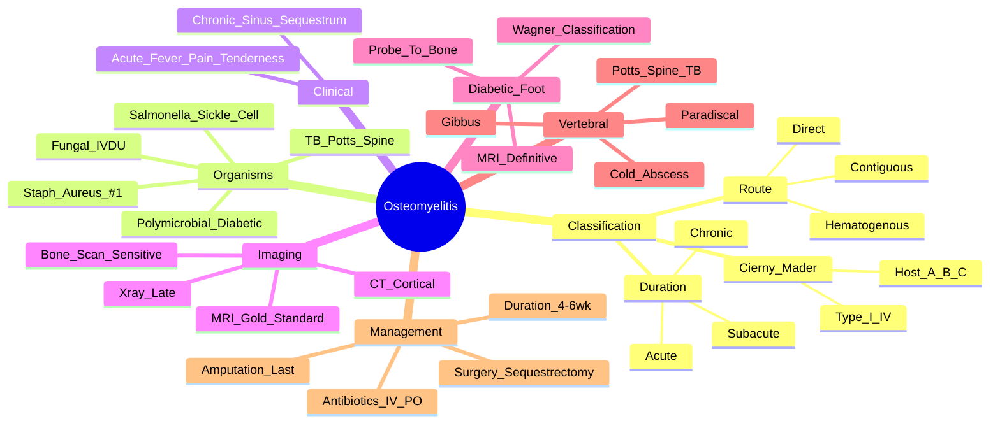

# Osteomyelitis

> [!tip] **FCPS/MRCP Priority: HIGH**
> Bone infection — **acute vs chronic**, **haematogenous vs contiguous**, **diabetic foot** overlap. **MRI = gold standard imaging**. **S. aureus #1**. **Pott's spine (TB)** = thoracic, paradiscal, cold abscess, gibbus. **Cierny-Mader** classification. Guaranteed SBA/viva/OSCE topic.

---

## Learning Objectives
By the end of this note you should be able to:
- [ ] Classify osteomyelitis by route (haematogenous, contiguous, direct inoculation) and chronicity (acute vs chronic)
- [ ] Identify characteristic organisms by context (S. aureus, Salmonella in sickle cell, TB spine, diabetic foot polymicrobial)
- [ ] Select and interpret imaging (X-ray late, **MRI gold standard**, bone scan sensitive not specific)
- [ ] Apply Cierny-Mader classification for surgical planning
- [ ] Diagnose and manage diabetic foot osteomyelitis (probe-to-bone, Wagner classification)
- [ ] Select appropriate antibiotic duration (4-6 weeks IV→PO) and surgical indications

---

## 1. Definition & Classification

| Classification | Types |
|----------------|-------|
| **By Route** | **Haematogenous** (bacteraemia → bone metaphysis), **Contiguous spread** (adjacent infection/trauma/surgery), **Direct inoculation** (trauma, surgery) |
| **By Duration** | **Acute** (<2 weeks), **Subacute** (2-6 weeks), **Chronic** (>6 weeks — sequestrum, involucrum, draining sinus) |
| **By Cierny-Mader** | **Anatomic Type**: Medullary, Superficial, Localised, Diffuse + **Host Class**: A (healthy), B (compromised), C (treatment worse than disease) |

---

## 2. Aetiology — Organisms by Context

| Context | **Most Common Organisms** |
|---------|---------------------------|
| **Acute Haematogenous (Children)** | **S. aureus** (MSSA/MRSA) #1; **S. pyogenes** (Group A Strep); **S. pneumoniae** (rare post-PCV); **Kingella kingae** (6mo-4y) |
| **Acute Haematogenous (Adults)** | **S. aureus**; **Gram-negative** (E. coli, Pseudomonas) — IVDU, UTI source; **Coag-negative Staph** (prosthetic) |
| **Sickle Cell Disease** | **Salmonella** (non-typhoidal) > S. aureus — **classic association** |
| **Diabetic Foot / Contiguous** | **Polymicrobial** — S. aureus, Strep, Enterococci, Gram-negatives (Pseudomonas, Proteus), Anaerobes |
| **Post-Surgical / Trauma** | S. aureus, Coag-negative Staph, Gram-negatives |
| **Vertebral (Pott's Spine)** | **Mycobacterium tuberculosis** (TB) — **classic**; S. aureus, Brucella |
| **Chronic Osteomyelitis** | Polymicrobial, S. aureus, Enterococci, Gram-negatives, Anaerobes |
| **Fungal** | Candida (IVDU, immunocompromised), Madurella (mycetoma) |

> [!critical] **Sickle Cell + Osteomyelitis = Salmonella**
> - **Non-typhoidal Salmonella** (often Group B/D)
> - **S. aureus** still common
> - **MRI** distinguishes from bone infarct (both common in sickle cell)

---

## 3. Clinical Features

### Acute Osteomyelitis
| Feature | Description |
|---------|-------------|
| **Fever** | High, systemic toxicity (children often toxic) |
| **Bone Pain** | Deep, severe, worse with movement |
| **Local Signs** | Tenderness, swelling, warmth, erythema over affected bone |
| **Functional Impairment** | Refusal to move limb (pseudoparalysis in children), antalgic gait |
| **Inflammatory Markers** | **CRP/ESR markedly elevated**; WBC elevated |

### Chronic Osteomyelitis
| Feature | Description |
|---------|-------------|
| **Draining Sinus** | **Pathognomonic** — purulent discharge, may communicate with bone |
| **Sequestrum** | **Dead bone** (devitalised, separated from living bone) |
| **Involucrum** | **New living bone** forming around sequestrum |
| **Low-Grade Symptoms** | Intermittent pain, discharge, low-grade fever, less toxic |
| **Bone Deformity** | Chronic inflammation → fibrosis, shortening, angulation |

---

## 4. Imaging — **MRI = Gold Standard**

```mermaid
flowchart LR
    A[Suspected Osteomyelitis] --> B{X-ray}
    B -->|Normal early (2-3 weeks)| C[**MRI**\n(STIR/T2 marrow oedema\nAbscess\nCortical breach)]
    B -->|Positive late| D[Periosteal reaction\nBone destruction\nSequestrum/Involucrum]
    C --> E[**Gold Standard**\nSensitivity 90-100%\nSpecificity 80-90%]
    D --> F[Surgical Planning\nCierny-Mader]
    A --> G[Bone Scan (Tc-99m)\nSensitive, Not Specific]
    G --> H[Alternative if MRI\ncontraindicated]
```

| Modality | Sensitivity | Specificity | Role |
|----------|-------------|-------------|------|
| **X-ray** | Low early (30-50% at 2wk) | High if positive | **Baseline**; late: periosteal reaction, lytic lesions, sequestrum, involucrum |
| **MRI (STIR/T2)** | **90-100%** | **80-90%** | **Gold standard** — marrow oedema, abscess, cortical breach, soft tissue extent |
| **CT** | 70-80% | 80-90% | Cortical detail, sequestrum, surgical planning, if MRI contraindicated |
| **Bone Scan (Tc-99m)** | **High (90%)** | **Low (40-60%)** | **Sensitive, not specific** — increased uptake in trauma, tumour, OA; **SPECT/CT improves** |
| **PET-CT** | High | Moderate | Chronic/vertebral; distinguishes infection from sterile inflammation |
| **Ultrasound** | Limited | Limited | Soft tissue abscess, subperiosteal collection; guide aspiration |

> [!critical] **X-ray Timeline**
> - **0-2 weeks**: Normal
> - **2-3 weeks**: Periosteal reaction (solid/onion-skin)
> - **3-4 weeks**: Lytic lesions, bone destruction
> - **Chronic**: Sequestrum (dense dead bone), involucrum (new bone shell), cloaca (sinus tract)

---

## 5. Diabetic Foot Osteomyelitis (DFO) — **High-Yield**

### Diagnosis
| Test | Performance |
|-------|-------------|
| **Probe-to-Bone Test** | **High PPV (85-95%)** — sterile probe touches bone through ulcer = **osteomyelitis likely** |
| **ESR >70 mm/hr** | High sensitivity for osteomyelitis |
| **CRP** | Less specific alone |
| **MRI** | Gold standard — marrow oedema, cortical breach |
| **Plain X-ray** | Baseline; look for osteolysis, periosteal reaction |

### Wagner Classification (Diabetic Foot Ulcer)
| Grade | Description | Osteomyelitis Risk |
|-------|-------------|-------------------|
| **0** | Pre-ulcerous (callus, deformity) | Low |
| **1** | Superficial ulcer (no tendon/bone) | Low |
| **2** | Deep ulcer (tendon, capsule) | Moderate |
| **3** | **Deep ulcer + osteomyelitis/abscess** | **High** |
| **4** | Forefoot gangrene | High |
| **5** | Whole foot gangrene | High |

> [!important] **University of Texas Classification** (more detailed: Grade 0-3 × Stage A-D for infection/ischaemia)

---

## 6. Vertebral Osteomyelitis — **Pott's Spine (TB)**

| Feature | Detail |
|---------|--------|
| **Organism** | **Mycobacterium tuberculosis** (classic); S. aureus, Brucella |
| **Site** | **Thoracic > Lumbar** (paradiscal) |
| **Pattern** | **Paradiscal destruction** (two adjacent vertebrae + disc) |
| **Cold Abscess** | Paravertebral, psoas, extended → **no fever** (unlike pyogenic) |
| **Gibbus Deformity** | Kyphotic angulation from vertebral collapse |
| **Neurological** | Cord compression (paraplegia) — **emergency** |
| **Imaging** | MRI: marrow oedema, disc destruction, paravertebral abscess; CT: bony detail |
| **Diagnosis** | **Image-guided biopsy** (AFB, culture, PCR/Xpert MTB/RIF), blood for IGRA |
| **Treatment** | **Standard 4-drug TB regimen** (RHZE ×2mo → RH ×4mo) — **9-12 months total**; surgery if cord compression/deformity |

---

## 7. Cierny-Mader Classification — **Surgical Planning**

### Anatomic Type
| Type | Description |
|------|-------------|
| **Type I: Medullary** | Infection within medullary cavity (haematogenous) |
| **Type II: Superficial** | Infection of cortical bone only (contiguous) |
| **Type III: Localised** | Full-thickness cortical sequestrum, stable |
| **Type IV: Diffuse** | Full-thickness involvement, unstable (segmental defect) |

### Host Class (Physiology)
| Class | Criteria |
|-------|----------|
| **A (Healthy)** | No compromise |
| **B (Compromised)** | **Local** (vascular disease, scarring, radiation) or **Systemic** (diabetes, malnutrition, immunosuppression, smoking, renal failure) — **Bs, Bl, Bsl** |
| **C (Treatment Worse)** | Severe comorbidity — amputation preferred |

> [!tip] **Clinical Use**
> - Guides **surgical approach** (debridement vs resection vs amputation)
> - **Type III/IV B-host** → aggressive resection + reconstruction
> - **Type I A-host** → antibiotics alone may suffice

---

## 8. Microbiology & Diagnosis

| Sample | Yield | Notes |
|--------|-------|-------|
| **Blood Cultures** | 30-50% (haematogenous) | **Always obtain** (2 sets) before antibiotics |
| **Bone Biopsy (Image-guided)** | **Gold standard** for culture | **Best yield** — avoid prior antibiotics; send for aerobic/anaerobic/TB/fungal/PCR |
| **Sinus Swab** | Low reliability | **Contaminated** — correlates poorly with deep infection |
| **Aspirate (Subperiosteal)** | Good if accessible | Send for culture, Gram stain |
| **Serology** | Brucella, Salmonella, TB (IGRA) | Adjunctive |

---

## 9. Management

### Antibiotic Duration
| Scenario | Regimen |
|----------|---------|
| **Acute Haematogenous** | **IV 2 weeks** → **Oral step-down 4-6 weeks total** (culture-directed) |
| **Contiguous / Diabetic Foot** | **IV 2-4 weeks** → **Oral 2-4 weeks** (total 4-6 weeks; longer if residual dead bone) |
| **Chronic Osteomyelitis** | **IV 4-6 weeks** → **Oral 6-12 weeks** + **surgical debridement** |
| **Vertebral (Pyogenic)** | **IV 4-6 weeks** → **Oral 4-6 weeks** (total 8-12 weeks) |
| **TB (Pott's)** | **RHZE ×2mo → RH ×7-10mo** (total 9-12mo) |

### Empiric Antibiotics (Before Culture)
| Scenario | Regimen |
|----------|---------|
| **Acute Haematogenous (Adults)** | **Flucloxacillin 2g IV q6h** + **Gentamicin 3-5mg/kg IV q24h** (or Ceftriaxone 2g q12h if penicillin allergy) |
| **MRSA Risk** | **Vancomycin 15-20mg/kg IV q12h** (trough 15-20) |
| **Diabetic Foot (Polymicrobial)** | **Piperacillin-tazobactam 4.5g IV q6h** OR **Meropenem 1g IV q8h** + **Vancomycin** if MRSA risk |
| **Vertebral (Empiric)** | **Flucloxacillin + Gentamicin** (or Ceftriaxone) — cover Staph + Gram-neg |
| **Sickle Cell** | **Ceftriaxone 2g IV q12h** (covers Salmonella + Staph) |

### Surgical Indications
| Indication | Procedure |
|------------|-----------|
| **Sequestrum** | **Sequestrectomy** (remove dead bone) |
| **Abscess** | **Incision & drainage** |
| **Unstable bone (Type IV)** | **Resection + reconstruction** (Ilizarov, vascularised graft) |
| **Failed medical therapy** | **Debridement** + antibiotics |
| **Spinal cord compression (Pott's)** | **Urgent decompression ± stabilisation** |
| **Limb-threatening ischaemia** | **Amputation** (last resort) |

---

## 10. FCPS/MRCP High-Yield Summary

| Topic | Key Points |
|-------|------------|
| **Routes** | Haematogenous (kids, metaphysis), Contiguous (diabetic foot, post-op), Direct inoculation |
| **S. aureus** | **#1 overall** (acute haematogenous, contiguous, prosthetic) |
| **Sickle Cell** | **Salmonella > S. aureus** — classic association |
| **Pott's Spine (TB)** | Thoracic > lumbar, **paradiscal**, cold abscess, **gibbus**, cord compression |
| **Imaging** | X-ray late (2wk); **MRI gold standard** (marrow oedema, abscess); Bone scan sensitive not specific |
| **Diabetic Foot** | **Probe-to-bone test** (high PPV); Wagner grade 3 = osteomyelitis; MRI definitive |
| **Cierny-Mader** | Type I-IV (anatomic) + Host A/B/C (physiology) — guides surgery |
| **Antibiotic Duration** | Acute: IV 2wk → PO 4-6wk total; Chronic: longer + surgery; TB: 9-12mo |
| **Sequestrum/Involucrum** | Chronic: dead bone (sequestrum) + living shell (involucrum) + cloaca (sinus) |

---

## 11. Viva Questions (MRCP PACES / FCPS)

| Question | Expected Answer |
|----------|----------------|
| "A 40yo IV drug user presents with fever, back pain, thoracic tenderness. MRI shows vertebral body destruction with paravertebral abscess. Blood cultures negative. Next step?" | **Image-guided biopsy** (CT-guided) for AFB, culture, PCR. Suspect **TB (Pott's spine)** or pyogenic. Start empiric anti-TB if high suspicion (RHZE) + cover Staph. |
| "What is the gold standard imaging for osteomyelitis?" | **MRI (STIR/T2)** — sensitivity 90-100%, shows marrow oedema, abscess, cortical breach, soft tissue extent. |
| "A child with sickle cell disease has femoral pain, fever. Blood cultures grow Salmonella. Diagnosis?" | **Osteomyelitis** — **Salmonella is classic in sickle cell** (non-typhoidal). MRI to confirm, distinguish from bone infarct. Ceftriaxone IV. |
| "What is the probe-to-bone test and its significance in diabetic foot?" | Sterile probe advances to bone through ulcer. **Positive = high PPV (85-95%) for osteomyelitis**. Wagner grade 3 ulcer. |
| "Describe the Cierny-Mader classification." | **Anatomic Type**: I (Medullary), II (Superficial), III (Localised), IV (Diffuse). **Host Class**: A (healthy), B (compromised: local/systemic), C (treatment worse than disease). Guides surgical approach. |
| "What is the difference between sequestrum and involucrum?" | **Sequestrum** = dead devitalised bone; **Involucrum** = new living bone formed around sequestrum. **Cloaca** = sinus tract connecting to skin. |
| "What is the antibiotic duration for acute haematogenous osteomyelitis?" | **IV 2 weeks → Oral step-down 4-6 weeks total** (culture-directed). |
| "A patient has chronic draining sinus over tibia, X-ray shows dense bone fragment surrounded by new bone shell. Terminology?" | **Sequestrum** (dead bone) + **Involucrum** (living bone shell) + **Cloaca** (sinus tract) = **Chronic osteomyelitis**. |
| "What is Pott's spine and its classic features?" | **TB of spine**: Thoracic > lumbar, **paradiscal destruction**, **cold abscess**, **gibbus deformity** (kyphosis). Paradiscal = two vertebrae + disc. |

---

## 12. Confusions & Mnemonics

| Confusion | Clarification |
|-----------|---------------|
| **Osteomyelitis vs Septic Arthritis** | Osteomyelitis = **bone infection**; Septic arthritis = **joint infection**. Can coexist (contiguous spread). MRI differentiates. |
| **X-ray Normal in Early Osteomyelitis** | X-ray **negative first 2-3 weeks** — need **MRI** if high suspicion. |
| **Sickle Cell: Osteomyelitis vs Bone Infarct** | Both common. **MRI**: Infarct = T1/T2 low signal (serpiginous), no abscess. Osteomyelitis = marrow oedema + abscess + cortical breach. |
| **Probe-to-Bone Test** | **Positive = osteomyelitis likely** (PPV 85-95%). Negative does not exclude. Wagner grade 3. |
| **Vertebral: TB vs Pyogenic** | TB = **paradiscal, cold abscess, gibbus, thoracic, subacute**. Pyogenic = **single vertebra, acute, fever, disc spared initially**. |
| **Chronic Osteomyelitis Definition** | **>6 weeks** with **sequestrum, involucrum, draining sinus**. Requires **surgery + prolonged antibiotics**. |

**Mnemonic: Organisms by Context = "SICK"**
- **S**taph aureus = #1 overall
- **I**V drug users = Gram-neg, Staph, Candida
- **C**hildren = Staph, Strep, Kingella
- **K** (Sickle cell) = **Salmonella**

**Mnemonic: Pott's Spine = "T-C-G"**
- **T**horacic > Lumbar
- **C**old abscess
- **G**ibbus deformity

**Mnemonic: Diabetic Foot = "WAGNER 3 = OM"**
- **W**agner Grade 3 = Deep ulcer + **Osteomyelitis**
- **P**robe-to-bone = **P**ositive = **OM**

**Mnemonic: Cierny-Mader = "TYPE + HOST"**
- **TYPE**: I-Medullary, II-Superficial, III-Localised, IV-Diffuse
- **HOST**: A-Healthy, B-Compromised, C-Treatment Worse

**Mnemonic: Chronic OM = "S-I-C"**
- **S**equestrum (dead bone)
- **I**nvolucrum (living shell)
- **C**loaca (sinus tract)

---

## 13. Mind Map



---

## 14. One-Page Revision Card

| Domain | Key Points |
|--------|------------|
| **Routes** | Haematogenous (kids, metaphysis), Contiguous (diabetic foot, post-op), Direct inoculation |
| **S. aureus** | **#1 overall** in all contexts |
| **Sickle Cell** | **Salmonella > S. aureus** — classic |
| **Pott's Spine (TB)** | Thoracic > lumbar, **paradiscal**, cold abscess, **gibbus**, cord compression |
| **Imaging** | X-ray late (2wk); **MRI gold standard** (marrow oedema, abscess); Bone scan sensitive not specific |
| **Diabetic Foot** | **Probe-to-bone** (PPV 85-95%); Wagner grade 3 = osteomyelitis |
| **Cierny-Mader** | Type I-IV (anatomic) + Host A/B/C (physiology) — guides surgery |
| **Antibiotics** | Acute: IV 2wk → PO 4-6wk; Chronic: longer + surgery; TB: 9-12mo |
| **Chronic Signs** | **Sequestrum** (dead bone), **Involucrum** (living shell), **Cloaca** (sinus) |
| **Vertebral TB vs Pyogenic** | TB = paradiscal, cold abscess, gibbus, subacute; Pyogenic = single vertebra, acute, disc spared early |

---

## 15. Spaced Repetition Trackers

| Review Interval | Date Completed | Confidence (1-5) | Notes |
|-----------------|----------------|------------------|-------|
| 24 hours | | | |
| 7 days | | | |
| 15 days | | | |
| 30 days | | | |
| 90 days | | | |

---

## 16. Self-Test Scorecard

| Section | Score /5 | Last Attempt |
|---------|----------|--------------|
| Route & Organism Association | | |
| MRI vs X-ray vs Bone Scan | | |
| Diabetic Foot Assessment | | |
| Pott's Spine Features | | |
| Cierny-Mader Application | | |
| Chronic OM Pathology (S/I/C) | | |
| Antibiotic Duration | | |
| Viva Questions | | |

---

## Local Navigation
- **Parent Heading**: [[../Infectious Arthritis and Bone Infections|Infectious Arthritis and Bone Infections]]
- **Parent Topic Group**: [[Joint and bone infections]]
- **Chapter Map**: [[../Davidson Chapter 26 - Rheumatology Hierarchy|Rheumatology Hierarchy]]
- **Chapter MOC**: [[../Rheumatology MOC|Rheumatology MOC]]
- **Drug Reference**: [[../../Clinical Approach to Musculoskeletal Disease/Drugs in rheumatology|Drugs in rheumatology]]
- **Investigation Reference**: [[../../Clinical Approach to Musculoskeletal Disease/Investigations in rheumatology|Investigations in rheumatology]]
- **Related**: [[Septic arthritis]] · [[Tuberculous arthritis]]