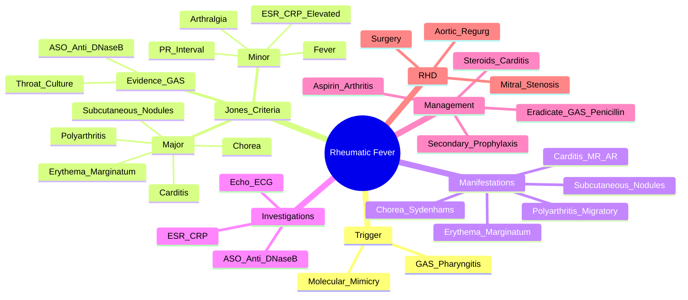

# Rheumatic Fever

> [!tip] **FCPS/MRCP Priority: CRITICAL**
> Rheumatic fever = **post-streptococcal autoimmune sequelae**. **Jones criteria (2015 revision)** = FCPS/MRCP staple. **Carditis = most important major criterion** (predicts RHD). **Secondary prophylaxis** = cornerstone to prevent RHD.

---

## Learning Objectives
By the end of this note you should be able to:
- [ ] Apply Jones criteria (2015 revision): 2 major OR 1 major + 2 minor + evidence of preceding GAS
- [ ] Recognise carditis as the most important major criterion (predicts RHD)
- [ ] Interpret ASO/anti-DNase B titres and their kinetics
- [ ] Initiate acute treatment (penicillin eradication + anti-inflammatory) and secondary prophylaxis
- [ ] Know secondary prophylaxis duration rules (age 21 / 5 years post-attack / 10 years if carditis)
- [ ] Identify long-term RHD complications (mitral stenosis, aortic regurgitation)

---

## 1. Definition & Epidemiology

| Feature | Detail |
|---------|--------|
| **Definition** | **Post-streptococcal autoimmune disease** following **Group A β-haemolytic Streptococcus (GAS) pharyngitis** — molecular mimicry → cross-reactive antibodies attack heart, joints, skin, brain |
| **Incidence** | Declining in developed countries; still high in developing/indigenous populations |
| **Peak Age** | **5-15 years** (rare <3 or >30) |
| **Sex Ratio** | M = F |
| **Trigger** | **GAS pharyngitis** (not skin infection — though anti-DNase B rises with skin) |
| **Latency** | **2-4 weeks** post-pharyngitis |

---

## 2. Aetiology & Pathophysiology

```mermaid
flowchart LR
    A[GAS Pharyngitis\nM-protein, Streptolysin O] --> B[Molecular Mimicry\nHost Antibodies Cross-React]
    B --> C[Autoimmune Attack\nHeart (Valves/Myocardium)\nJoints\nBasal Ganglia\nSkin\nSubcutaneous Tissue]
    C --> D[Clinical Rheumatic Fever\nCarditis, Arthritis, Chorea,\nErythema Marginatum, Nodules]
    D --> E[Rheumatic Heart Disease\nValve Fibrosis/Stenosis/Regurgitation]
```

### Key Pathogenic Features
| Feature | Detail |
|---------|--------|
| **Molecular Mimicry** | Anti-M-protein/Streptolysin O antibodies cross-react with cardiac myosin, laminin, vimentin |
| **Type II Hypersensitivity** | Antibody-mediated damage + complement activation |
| **Genetic Susceptibility** | HLA-DR7, HLA-DR4, TGF-β polymorphisms |
| **Environmental** | Overcrowding, poor sanitation, inadequate antibiotic access |

---

## 3. Clinical Features — **Jones Criteria (2015 Revision)**

### Major Criteria (5)
| Criterion | Description | FCPS/MRCP Pearl |
|-----------|-------------|-----------------|
| **1. Carditis** | **Most important** — mitral regurg (most common), aortic regurg, pericarditis, cardiomegaly, CHF, **prolonged PR interval** | **Predicts RHD** — only major criterion with long-term sequelae |
| **2. Polyarthritis** | **Migratory**, large joints (knees, ankles, elbows, wrists), **highly responsive to aspirin** (dramatic response in 24-48h) | **Migratory** = moves joint to joint; **aspirin response** supports diagnosis |
| **3. Chorea (Sydenham's)** | **Emotional lability**, involuntary choreiform movements, **milkmaid's grip**, spooning of hands, **darting tongue** | Can occur **months after** acute episode; **emotional lability** often first sign |
| **4. Erythema Marginatum** | **Non-pruritic**, **serpiginous/serpentine** pink rings with pale centres, **trunk/proximal limbs**, **evanescent** (comes/goes) | **Evanescent** = fleeting; **heat** makes it more visible |
| **5. Subcutaneous Nodules** | **Firm, non-tender**, over bony prominences/extensor surfaces (elbows, knees, occiput, spine), **rare** (5-10%) | Associated with **severe carditis**; **late sign** (weeks after onset) |

### Minor Criteria (4)
| Criterion | Description |
|-----------|-------------|
| **Fever** | ≥38.5°C |
| **Arthralgia** | Joint pain without swelling (cannot count if polyarthritis is major) |
| **Elevated Acute Phase** | **ESR ≥60 mm/hr** OR **CRP ≥3.0 mg/dL** |
| **Prolonged PR Interval** | **>0.20 sec** (age-adjusted) — **cannot count if carditis is major** |

### Evidence of Preceding GAS Infection (Required)
| Test | Positive Threshold |
|------|-------------------|
| **Positive Throat Culture** | GAS on culture |
| **Rapid Antigen Test** | Positive |
| **Elevated ASO Titre** | **Rising titre** (or single >200-333 Todd units, age-adjusted) |
| **Elevated Anti-DNase B** | **Rising titre** — more sensitive for skin infections |

> [!critical] **Diagnostic Rule**
> **2 Major** OR **1 Major + 2 Minor** **PLUS** **Evidence of preceding GAS infection**

> [!warning] **Exceptions (Diagnosis Without Full Jones)**
> - **Chorea alone** — can diagnose RF if other causes excluded
> - **Insidious-onset carditis** — can diagnose RF if other causes excluded

---

## 4. Detailed Manifestations

### Carditis — **Most Important**
| Feature | Detail |
|---------|--------|
| **Valvular** | **Mitral regurgitation (most common)** → later mitral stenosis; **Aortic regurgitation**; **Tricuspid** rare |
| **Clinical** | New murmurs (MR: apical pansystolic; AR: early diastolic at left sternal edge), **cardiomegaly**, **pericarditis** (friction rub, effusion), **CHF** |
| **ECG** | **Prolonged PR interval** (1st degree AV block) — **minor criterion if carditis not major** |
| **Echo** | **Gold standard** — valve thickening, regurgitation, ventricular dysfunction |

### Polyarthritis
| Feature | Detail |
|---------|--------|
| **Pattern** | **Migratory** (joint to joint over hours-days), **large joints** (knees, ankles, elbows, wrists) |
| **Response to Aspirin** | **Dramatic improvement within 24-48h** — supports diagnosis |
| **Course** | Self-limiting (weeks), **no residual damage** (unlike RA) |

### Sydenham's Chorea
| Feature | Detail |
|---------|--------|
| **Onset** | **Months after** acute RF (1-6 months) |
| **Features** | **Involuntary choreiform movements**, **emotional lability** (crying, laughing), **milkmaid's grip** (inability to maintain squeeze), **spooning of hands**, **darting tongue** |
| **Demographics** | **Females > Males**, **5-15 years** |
| **Course** | Self-limiting (months), but can recur |

### Erythema Marginatum
| Feature | Detail |
|---------|--------|
| **Appearance** | **Non-pruritic**, **serpiginous/annular** pink rings with **pale centres**, **trunk/proximal limbs** |
| **Behaviour** | **Evanescent** (comes and goes), **worse with heat** (bathing) |
| **Significance** | **Specific but not sensitive** (10-25%) |

### Subcutaneous Nodules
| Feature | Detail |
|---------|--------|
| **Location** | Bony prominences, extensor surfaces (elbows, knees, occiput, spine) |
| **Character** | **Firm, non-tender, mobile**, 1-2 cm |
| **Timing** | **Late** (2-3 weeks after onset) |
| **Association** | **Strongly associated with severe carditis** |

---

## 5. Investigations

| Test | Role | Key Findings |
|------|------|--------------|
| **ASO Titre** | **Classic** — peaks **3-6 weeks** post-infection; **rising titre diagnostic** | Single >200-333 Todd units (age-adjusted); **rising > serial** |
| **Anti-DNase B** | **More sensitive** (especially for skin infections); rises later, persists longer | Complementary to ASO; **rising titre diagnostic** |
| **Throat Culture/Rapid Test** | **Evidence of GAS** | Positive = fulfils Jones evidence |
| **ESR/CRP** | **Markedly elevated** (ESR ≥60, CRP ≥3.0) | **Minor criterion** |
| **ECG** | **Prolonged PR interval** (1st degree AV block) | **Minor criterion** (if carditis not major) |
| **Echocardiography** | **Gold standard for carditis** | Valve thickening, regurgitation, ventricular dysfunction |
| **CBC** | Leukocytosis, normocytic anaemia | Non-specific |

> [!important] **Antibody Kinetics**
> - **ASO**: Rises 1-3 weeks, **peaks 3-6 weeks**, declines over months
> - **Anti-DNase B**: Rises later, **persists longer** (6-12 months)
> - **Rising titre** (paired sera 2 weeks apart) = **diagnostic**

---

## 6. Management

```mermaid
flowchart TD
    A[Rheumatic Fever Diagnosis] --> B[1. ERADICATE GAS\nPenicillin V 500mg BD ×10d\nOR Benzathine Penicillin G 1.2MU IM single dose]
    B --> C[2. ANTI-INFLAMMATORY]
    C --> C1[**Arthritis/Fever**: Aspirin 80-100mg/kg/day (4-5g/day adult) **high-dose**\nDivided QID → taper over 2-4 weeks]
    C --> C2[**Severe Carditis/CHF**: Prednisolone 1-2mg/kg/day\nTaper over 2-6 weeks; Diuretics, ACEi for CHF]
    C --> C3[**Chorea**: Haloperidol/Risperidone/Valproate\nSymptomatic; usually self-limiting]
    B --> D[3. SECONDARY PROPHYLAXIS — **CORNERSTONE**]
    D --> D1[**Benzathine Penicillin G 1.2MU IM every 4 weeks**\n(OR Penicillin V 250mg BD daily if IM not feasible)]
    D --> D2[**Duration Rules** — see table]
    D --> D4[Monitor: Echo annually, BP, symptoms]
```

### Secondary Prophylaxis Duration — **CRITICAL FOR MRCP**
| Scenario | Duration |
|----------|----------|
| **No carditis** | **Age 21** OR **5 years** after last attack — **whichever is LONGER** |
| **Carditis without residual valve disease** | **Age 21** OR **10 years** after last attack — **whichever is LONGER** |
| **Carditis with residual valve disease (RHD)** | **Age 40** OR **10 years** after last attack — **whichever is LONGER** (some guidelines: **lifelong**) |

> [!critical] **Penicillin Regimens**
> - **Benzathine Penicillin G 1.2MU IM q4weeks** = **Gold standard** (best adherence)
> - **Penicillin V 250mg BD daily** = Alternative (poor adherence)
> - **Erythromycin** = If penicillin allergy

---

## 7. Rheumatic Heart Disease (RHD) — Long-term Sequelae

| Valve Lesion | Frequency | Late Complication |
|--------------|-----------|-------------------|
| **Mitral Stenosis** | **Most common** (isolated or mixed) | Atrial fibrillation, pulmonary hypertension, systemic embolism |
| **Mitral Regurgitation** | Common (acute) | LV dilatation, heart failure |
| **Aortic Regurgitation** | Common (with MR) | LV dilatation, coronary ischaemia |
| **Mixed Lesions** | Frequent | Complex haemodynamics |

> [!warning] **RHD = Leading Cause of Acquired Heart Disease in Young Adults (Developing World)**
> - **Mitral stenosis** = classic RF sequela (diastolic rumble, opening snap, loud S1)
> - **Surgical intervention** often needed (balloon valvuloplasty, valve replacement)

---

## 8. FCPS/MRCP High-Yield Summary

| Topic | Key Points |
|-------|------------|
| **Jones Criteria (2015)** | **2 Major** OR **1 Major + 2 Minor** + **Evidence of GAS** |
| **Major Criteria** | **Carditis** (most important), **Polyarthritis** (migratory, aspirin-responsive), **Chorea**, **Erythema Marginatum**, **Subcutaneous Nodules** |
| **Minor Criteria** | Fever, Arthralgia, **ESR ≥60 / CRP ≥3.0**, **Prolonged PR** (if carditis not major) |
| **Carditis** | **Most important major** — predicts RHD; MR > AR; prolonged PR = minor if carditis not major |
| **ASO Titre** | Peaks **3-6 weeks**; **rising titre diagnostic**; anti-DNase B more sensitive for skin |
| **Treatment** | 1) **Penicillin** (eradicate GAS) 2) **Aspirin** (arthritis) / **Steroids** (severe carditis) 3) **Secondary prophylaxis** |
| **Secondary Prophylaxis** | **Benzathine Penicillin G 1.2MU IM q4weeks** — **No carditis: age 21 or 5yr post-attack; Carditis: age 21 or 10yr; RHD: age 40 or 10yr (lifelong)** |
| **RHD** | **Mitral stenosis** (most common late); **Aortic regurgitation**; surgical intervention often needed |

---

## 9. Viva Questions (MRCP PACES / FCPS)

| Question | Expected Answer |
|----------|----------------|
| "What are the Jones criteria (2015) for rheumatic fever?" | **2 Major** OR **1 Major + 2 Minor** + **Evidence of preceding GAS infection**. Major: carditis, polyarthritis, chorea, erythema marginatum, subcutaneous nodules. |
| "Which major criterion is most important and why?" | **Carditis** — only one that causes long-term sequelae (RHD); mitral regurgitation most common. |
| "A 10yo child presents with migratory large joint arthritis, fever, and elevated ASO. Echo shows mild MR. Diagnosis?" | **Rheumatic Fever** (1 Major: carditis; 1 Major: polyarthritis; Evidence: ASO). |
| "What is the treatment for acute rheumatic fever arthritis?" | **Aspirin 80-100mg/kg/day** (high-dose) divided QID — **dramatic response in 24-48h**. Taper over 2-4 weeks. |
| "What is the secondary prophylaxis regimen and duration for a child with rheumatic fever without carditis?" | **Benzathine Penicillin G 1.2MU IM every 4 weeks** until **age 21 OR 5 years after last attack (whichever longer)**. |
| "What is the duration of secondary prophylaxis if carditis with residual valve disease (RHD)?" | **Age 40 OR 10 years after last attack (whichever longer)** — some guidelines recommend **lifelong**. |
| "What is the significance of anti-DNase B vs ASO?" | **Anti-DNase B more sensitive for skin infections**; rises later, persists longer (6-12 months). ASO peaks 3-6 weeks. |
| "A 12yo girl presents with involuntary movements, emotional lability, milkmaid's grip. Preceded by sore throat 3 months ago. Diagnosis?" | **Sydenham's Chorea** — **post-rheumatic fever** (can occur months after); self-limiting but can recur. |
| "What are the minor criteria in Jones?" | Fever, Arthralgia, **ESR ≥60 / CRP ≥3.0**, **Prolonged PR interval** (if carditis not major). |
| "What is the long-term sequela of rheumatic fever carditis?" | **Rheumatic Heart Disease** — **Mitral stenosis (most common)**, aortic regurgitation, mixed lesions; may need valve replacement. |

---

## 10. Confusions & Mnemonics

| Confusion | Clarification |
|-----------|---------------|
| **Arthralgia vs Polyarthritis** | **Arthralgia = minor** (pain only); **Polyarthritis = major** (objective swelling). Cannot count both. |
| **Prolonged PR Interval** | **Minor criterion** if carditis NOT major; if carditis IS major, PR prolongation is PART of carditis, not a separate minor. |
| **Chorea Timing** | Can occur **months after** acute RF (1-6 months); emotional lability often first sign. |
| **Erythema Marginatum** | **Non-pruritic**, **serpiginous**, **evanescent** (comes/goes with heat). |
| **Subcutaneous Nodules** | **Late sign** (weeks after onset); associated with **severe carditis**. |
| **Secondary Prophylaxis Duration** | **No carditis**: 21y or 5yr post-attack. **Carditis no RHD**: 21y or 10yr. **RHD**: 40y/10yr/lifelong. |

**Mnemonic: Jones Major = "C-A-R-E-S"**
- **C**arditis (most important)
- **A**rthritis (migratory, aspirin-responsive)
- **R**hythm? No — **R** = **Chorea** (Sydenham's)
- **E**rythema Marginatum
- **S**ubcutaneous Nodules

**Mnemonic: Minor Criteria = "F-E-P"**
- **F**ever
- **E**SR/CRP elevated
- **P**R interval prolonged
- **Arthralgia** (the "forgotten" minor)

**Mnemonic: Jones Requirements = "2M or 1M+2m + GAS"**
- **2 Major** OR
- **1 Major + 2 Minor** PLUS
- **Evidence of GAS**

**Mnemonic: Secondary Prophylaxis = "21/5, 21/10, 40/10"**
- **No carditis**: **21 years** or **5 years** post-attack
- **Carditis no RHD**: **21 years** or **10 years** post-attack
- **RHD**: **40 years** or **10 years** (or lifelong)

**Mnemonic: RHD Valves = "M-A"**
- **M**itral stenosis (most common)
- **A**ortic regurgitation

---

## 11. Mind Map



---

## 12. One-Page Revision Card

| Domain | Key Points |
|--------|------------|
| **Trigger** | GAS pharyngitis → 2-4 weeks latency |
| **Jones Criteria** | 2 Major OR 1 Major + 2 Minor + Evidence of GAS |
| **Major (CARES)** | Carditis***, Polyarthritis, Chorea, Erythema Marginatum, Subcutaneous Nodules |
| **Minor** | Fever, Arthralgia, ESR≥60/CRP≥3, PR prolongation (if no carditis major) |
| **Carditis** | **Most important** → predicts RHD; MR > AR; prolonged PR = minor if carditis not major |
| **ASO** | Peaks 3-6 weeks; **rising titre diagnostic**; anti-DNase B more sensitive for skin |
| **Treatment** | Penicillin (eradicate) + Aspirin (arthritis) + Steroids (severe carditis) + **Secondary Prophylaxis** |
| **Prophylaxis** | Benzathine Pen G 1.2MU IM q4w: No carditis 21y/5yr; Carditis 21y/10yr; RHD 40y/10yr/lifelong |
| **RHD** | Mitral stenosis (most common), Aortic regurgitation, valve surgery |

---

## 13. Spaced Repetition Trackers

| Review Interval | Date Completed | Confidence (1-5) | Notes |
|-----------------|----------------|------------------|-------|
| 24 hours | | | |
| 7 days | | | |
| 15 days | | | |
| 30 days | | | |
| 90 days | | | |

---

## 14. Self-Test Scorecard

| Section | Score /5 | Last Attempt |
|---------|----------|--------------|
| Jones Criteria Application | | |
| Major vs Minor Discrimination | | |
| Carditis Significance | | |
| ASO/Anti-DNase B Interpretation | | |
| Secondary Prophylaxis Duration | | |
| RHD Sequelae | | |
| Viva Questions | | |

---

## Local Navigation
- **Parent Heading**: [[../Infectious Arthritis and Bone Infections|Infectious Arthritis and Bone Infections]]
- **Parent Topic Group**: [[Joint and bone infections]]
- **Chapter Map**: [[../Davidson Chapter 26 - Rheumatology Hierarchy|Rheumatology Hierarchy]]
- **Chapter MOC**: [[../Rheumatology MOC|Rheumatology MOC]]
- **Drug Reference**: [[../../Clinical Approach to Musculoskeletal Disease/Drugs in rheumatology|Drugs in rheumatology]]
- **Related**: [[Septic arthritis]] · [[Post-streptococcal reactive arthritis]]
---

> Auto-generated study sections for "Infectious Arthritis and Bone Infections" — Ch 25: Rheumatology & Bone Disease.

## Flashcards (54 generated)

- Q: What is the definition of Infectious Arthritis and Bone Infections?
  A: Post-streptococcal autoimmune disease following Group A β-haemolytic Streptococcus (GAS) pharyngitis — molecular mimicry → cross-reactive antibodies attack heart, joints, skin, brain
- Q: What is the epidemiology of Infectious Arthritis and Bone Infections?
  A: Declining in developed countries; still high in developing/indigenous populations
- Q: What is Peak Age of Infectious Arthritis and Bone Infections?
  A: 5-15 years (rare <3 or >30)
- Q: What is Sex Ratio of Infectious Arthritis and Bone Infections?
  A: M = F
- Q: What is Trigger of Infectious Arthritis and Bone Infections?
  A: GAS pharyngitis (not skin infection — though anti-DNase B rises with skin)
- Q: What is Latency of Infectious Arthritis and Bone Infections?
  A: 2-4 weeks post-pharyngitis
- Q: What is Molecular Mimicry of Infectious Arthritis and Bone Infections?
  A: Anti-M-protein/Streptolysin O antibodies cross-react with cardiac myosin, laminin, vimentin
- Q: How is Infectious Arthritis and Bone Infections classified?
  A: Antibody-mediated damage + complement activation
- Q: What is Genetic Susceptibility of Infectious Arthritis and Bone Infections?
  A: HLA-DR7, HLA-DR4, TGF-β polymorphisms
- Q: What is Environmental of Infectious Arthritis and Bone Infections?
  A: Overcrowding, poor sanitation, inadequate antibiotic access
- Q: What is Valvular of Infectious Arthritis and Bone Infections?
  A: Mitral regurgitation (most common) → later mitral stenosis; Aortic regurgitation; Tricuspid rare
- Q: What is Clinical of Infectious Arthritis and Bone Infections?
  A: New murmurs (MR: apical pansystolic; AR: early diastolic at left sternal edge), cardiomegaly, pericarditis (friction rub, effusion), CHF
- Q: What is ECG of Infectious Arthritis and Bone Infections?
  A: Prolonged PR interval (1st degree AV block) — minor criterion if carditis not major
- Q: What is Echo of Infectious Arthritis and Bone Infections?
  A: Gold standard — valve thickening, regurgitation, ventricular dysfunction
- Q: What is Pattern of Infectious Arthritis and Bone Infections?
  A: Migratory (joint to joint over hours-days), large joints (knees, ankles, elbows, wrists)
- Q: What is Response to Aspirin of Infectious Arthritis and Bone Infections?
  A: Dramatic improvement within 24-48h — supports diagnosis
- Q: What is Course of Infectious Arthritis and Bone Infections?
  A: Self-limiting (weeks), no residual damage (unlike RA)
- Q: What is Onset of Infectious Arthritis and Bone Infections?
  A: Months after acute RF (1-6 months)
- Q: What are the clinical features of Infectious Arthritis and Bone Infections?
  A: Involuntary choreiform movements, emotional lability (crying, laughing), milkmaid's grip (inability to maintain squeeze), spooning of hands, darting tongue
- Q: What is Demographics of Infectious Arthritis and Bone Infections?
  A: Females > Males, 5-15 years
- Q: What is Course of Infectious Arthritis and Bone Infections?
  A: Self-limiting (months), but can recur
- Q: What is Appearance of Infectious Arthritis and Bone Infections?
  A: Non-pruritic, serpiginous/annular pink rings with pale centres, trunk/proximal limbs
- Q: What is Behaviour of Infectious Arthritis and Bone Infections?
  A: Evanescent (comes and goes), worse with heat (bathing)
- Q: What is Significance of Infectious Arthritis and Bone Infections?
  A: Specific but not sensitive (10-25%)
- Q: What is Location of Infectious Arthritis and Bone Infections?
  A: Bony prominences, extensor surfaces (elbows, knees, occiput, spine)
- Q: What is Character of Infectious Arthritis and Bone Infections?
  A: Firm, non-tender, mobile, 1-2 cm
- Q: What is Timing of Infectious Arthritis and Bone Infections?
  A: Late (2-3 weeks after onset)
- Q: What is Association of Infectious Arthritis and Bone Infections?
  A: Strongly associated with severe carditis
- Q: What is Molecular Mimicry of Infectious Arthritis and Bone Infections?
  A: Anti-M-protein/Streptolysin O antibodies cross-react with cardiac myosin, laminin, vimentin
- Q: How is Infectious Arthritis and Bone Infections classified?
  A: Antibody-mediated damage + complement activation
- Q: What is Genetic Susceptibility of Infectious Arthritis and Bone Infections?
  A: HLA-DR7, HLA-DR4, TGF-β polymorphisms
- Q: What is Environmental of Infectious Arthritis and Bone Infections?
  A: Overcrowding, poor sanitation, inadequate antibiotic access
- Q: What is Valvular of Infectious Arthritis and Bone Infections?
  A: Mitral regurgitation (most common) → later mitral stenosis; Aortic regurgitation; Tricuspid rare
- Q: What is Clinical of Infectious Arthritis and Bone Infections?
  A: New murmurs (MR: apical pansystolic; AR: early diastolic at left sternal edge), cardiomegaly, pericarditis (friction rub, effusion), CHF
- Q: What is ECG of Infectious Arthritis and Bone Infections?
  A: Prolonged PR interval (1st degree AV block) — minor criterion if carditis not major
- Q: What is Pattern of Infectious Arthritis and Bone Infections?
  A: Migratory (joint to joint over hours-days), large joints (knees, ankles, elbows, wrists)
- Q: What is Response to Aspirin of Infectious Arthritis and Bone Infections?
  A: Dramatic improvement within 24-48h — supports diagnosis
- Q: What is Onset of Infectious Arthritis and Bone Infections?
  A: Months after acute RF (1-6 months)
- Q: What are the clinical features of Infectious Arthritis and Bone Infections?
  A: Involuntary choreiform movements, emotional lability (crying, laughing), milkmaid's grip (inability to maintain squeeze), spooning of hands, darting tongue
- Q: What is Demographics of Infectious Arthritis and Bone Infections?
  A: Females > Males, 5-15 years
- Q: What is Appearance of Infectious Arthritis and Bone Infections?
  A: Non-pruritic, serpiginous/annular pink rings with pale centres, trunk/proximal limbs
- Q: What is Behaviour of Infectious Arthritis and Bone Infections?
  A: Evanescent (comes and goes), worse with heat (bathing)
- Q: What is Location of Infectious Arthritis and Bone Infections?
  A: Bony prominences, extensor surfaces (elbows, knees, occiput, spine)
- Q: What is Character of Infectious Arthritis and Bone Infections?
  A: Firm, non-tender, mobile, 1-2 cm
- Q: What is Timing of Infectious Arthritis and Bone Infections?
  A: Late (2-3 weeks after onset)
- Q: What is Association of Infectious Arthritis and Bone Infections?
  A: Strongly associated with severe carditis
- Q: What is Jones Criteria (2015) of Infectious Arthritis and Bone Infections?
  A: 2 Major OR 1 Major + 2 Minor + Evidence of GAS
- Q: What is Major Criteria of Infectious Arthritis and Bone Infections?
  A: Carditis (most important), Polyarthritis (migratory, aspirin-responsive), Chorea, Erythema Marginatum, Subcutaneous Nodules
- Q: What is Minor Criteria of Infectious Arthritis and Bone Infections?
  A: Fever, Arthralgia, ESR ≥60 / CRP ≥3.0, Prolonged PR (if carditis not major)
- Q: What is Carditis of Infectious Arthritis and Bone Infections?
  A: Most important major — predicts RHD; MR > AR; prolonged PR = minor if carditis not major
- Q: What is ASO Titre of Infectious Arthritis and Bone Infections?
  A: Peaks 3-6 weeks; rising titre diagnostic; anti-DNase B more sensitive for skin
- Q: How is Infectious Arthritis and Bone Infections managed?
  A: 1) Penicillin (eradicate GAS) 2) Aspirin (arthritis) / Steroids (severe carditis) 3) Secondary prophylaxis
- Q: What is Secondary Prophylaxis of Infectious Arthritis and Bone Infections?
  A: Benzathine Penicillin G 1.2MU IM q4weeks — No carditis: age 21 or 5yr post-attack; Carditis: age 21 or 10yr; RHD: age 40 or 10yr (lifelong)
- Q: What is RHD of Infectious Arthritis and Bone Infections?
  A: Mitral stenosis (most common late); Aortic regurgitation; surgical intervention often needed

## MCQs (1 generated)

1. **Which of the following best describes Infectious Arthritis and Bone Infections?**
   A. **| Definition | Post-streptococcal autoimmune disease following Group A β-haemolytic Streptococcus (GAS) pharyngitis — molecular mimicry → cross-reactive antibodies attack heart, joints, skin, brain |**
   B. An unrelated condition not matching the clinical picture of Infectious Arthritis and Bone Infections
   C. A complication seen late in the disease course of Infectious Arthritis and Bone Infections
   D. A condition that mimics Infectious Arthritis and Bone Infections but has a different underlying cause

## SBA Questions (1 generated)

1. A patient with suspected Infectious Arthritis and Bone Infections presents with: Definition — Post-streptococcal autoimmune disease following Group A β-haemolytic Streptococcus (GAS) pharyngitis — molecular mimicry → cross-reactive antibodies attack heart, joints, skin, brain; Incidence — Declining in developed countries; still high in developing/indigenous populations; Peak Age — 5-15 years (rare <3 or >30). What is the most likely diagnosis?
   A. **Infectious Arthritis and Bone Infections**
   B. A condition that mimics Infectious Arthritis and Bone Infections but is not the same entity
   C. A complication of Infectious Arthritis and Bone Infections rather than the primary diagnosis
   D. An unrelated condition in the same clinical category as Infectious Arthritis and Bone Infections

## PasTest Scenario SBAs (Clinical Vignettes)

> **Auto-generated PasTest/Mediscope-style scenario SBAs** grounded in the authored source. Each scenario tests a real clinical fact (triad, specific sign, contraindication, trial, first-line Rx) extracted from the topic. *Source: Ch 25: Rheumatology — Rheumatic fever*

**Q1.** Which of the following features is most specific or characteristic of Rheumatic fever?

  - **A.** ASO Titre
  - **B.** A feature common to many acute inflammatory conditions
  - **C.** A non-specific sign that does not localise the diagnosis
  - **D.** An investigation finding rather than a clinical feature

  > **Answer: A** — ASO Titre
  >
  > *Source:* se RF if other causes excluded

---
| Test | Role | Key Findings |
|------|------|--------------|
| **ASO Titre** | **Classic** — peaks **3-6 weeks** post-infection; **rising titre diagnostic** | Sing

**Q2.** What is the most appropriate first-line therapy for Rheumatic fever?

  - **A.** Severe Carditis/CHF
  - **B.** An advanced/surgical therapy reserved for refractory disease
  - **C.** Symptomatic treatment only, no disease-modifying therapy
  - **D.** Empiric broad-spectrum therapy without specific indication

  > **Answer: A** — Severe Carditis/CHF
  >
  > *Source:* C --> C2[**Severe Carditis/CHF**: Prednisolone 1-2mg/kg/day\nTaper over 2-6 weeks; Diuretics, ACEi for CHF]

