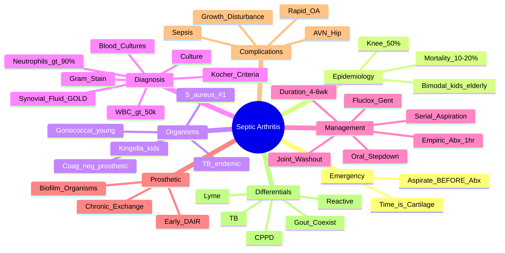

# Septic Arthritis

> [!tip] **FCPS/MRCP Priority: CRITICAL**
> Septic arthritis = **ORTHOPAEDIC/RHEUMATOLOGY EMERGENCY**. Missed diagnosis → rapid joint destruction, sepsis, death. **Aspirate before antibiotics**, know common organisms by age/risk, understand Kocher criteria for paediatrics.

---

## Learning Objectives
By the end of this note you should be able to:
- [ ] Recognise septic arthritis as a **medical emergency** requiring immediate joint aspiration
- [ ] Apply Kocher criteria (children) and clinical suspicion (adults) for diagnosis
- [ ] Interpret synovial fluid (WBC >50,000, >90% neutrophils, Gram stain, culture)
- [ ] Select empiric antibiotics by age, risk factors, and local epidemiology
- [ ] Manage the joint (aspiration, washout, arthrotomy) and systemic sepsis
- [ ] Differentiate from gout, CPPD, reactive arthritis, haemophilia

---

## 1. Definition & Epidemiology

| Feature | Detail |
|---------|--------|
| **Definition** | **Bacterial infection of a synovial joint** — purulent inflammation → rapid cartilage destruction (proteases, cytokines) → irreversible damage within **hours-days** |
| **Incidence** | 4-10/100,000/year (higher in RA, prosthetic joints, immunocompromised) |
| **Peak Age** | **Bimodal**: **Children <5y** (haematogenous) and **Adults >60y** (comorbidities, prostheses) |
| **Sex Ratio** | M = F (children); M > F (adults) |
| **Joint Distribution** | **Knee (50%)** > Hip (20%) > Shoulder, Ankle, Wrist, Elbow — **Hip in children** |
| **Mortality** | **10-20%** (higher in elderly, delayed Dx, prosthetic joints) |
| **Morbidity** | **Rapid joint destruction** → osteoarthritis, avascular necrosis (hip), growth disturbance (children) |

---

## 2. Aetiology — Organisms by Context

```mermaid
flowchart TD
    A[Septic Arthritis] --> B{Native Joint}
    A --> C{Prosthetic Joint}
    B --> D[Children <5y]
    B --> E[Adults]
    B --> F[Special Populations]
    D --> D1[S. aureus (MSSA/MRSA) 50%]
    D --> D2[Kingella kingae 6mo-4y 30%]
    D --> D3[S. pyogenes (Group A Strep)]
    D --> D4[S. pneumoniae (rare post-PCV)]
    D --> D5[H. influenzae type b (rare post-vax)]
    D --> D6[Neisseria gonorrhoeae (adolescents)]
    E --> E1[S. aureus 60-80% (MSSA > MRSA)]
    E --> E2[Streptococci (Group A, B, G) 10-20%]
    E --> E3[Gram-negative (E. coli, Pseudomonas) 10-15%]
    E --> E4[Neisseria gonorrhoeae (young sexually active)]
    F --> F1[RA/Immunosuppressed: S. aureus, Gram-neg, atypical]
    F --> F2[IVDU: S. aureus, Gram-neg, Candida, M. tuberculosis]
    F --> F3[Prosthetic: S. epidermidis (coag-neg staph), S. aureus, Cutibacterium]
    C --> C1[Early <3mo: S. aureus, Gram-neg (intra-op)]
    C --> C2[Delayed 3-24mo: Coag-neg staph, Cutibacterium (biofilm)]
    C --> C3[Late >24mo: Haematogenous (S. aureus, Strep)]
```

### Key Organism Profiles

| Organism | Context | Key Features |
|----------|---------|--------------|
| **Staphylococcus aureus** | **#1 overall** (native + prosthetic) | MSSA vs MRSA; PVL toxin → severe; haematogenous spread |
| **Kingella kingae** | **Children 6mo-4y** (30-50%) | Fastidious, PCR superior to culture; mild presentation |
| **Neisseria gonorrhoeae** | **Young sexually active** (DGIS — disseminated gonococcal infection) | **Polyarticular** (migratory), tenosynovitis, dermatitis, **cervical/urethral discharge** |
| **Streptococci** | Adults, post-procedural | Group A (pyogenes), B (agalactiae), G |
| **Gram-negative bacilli** | Elderly, immunocompromised, IVDU, UTI source | E. coli, Pseudomonas, Klebsiella |
| **Coagulase-negative staph** | **Prosthetic joint** (biofilm) | S. epidermidis, S. lugdunensis |
| **Cutibacterium acnes** | **Prosthetic shoulder** (low virulence, indolent) | Long incubation, positive cultures at 10-14 days |
| **Mycobacterium tuberculosis** | Endemic areas, immunocompromised | Chronic monoarthritis, **Poncet's disease** (reactive polyarthritis) |
| **Candida / Fungi** | IVDU, immunocompromised, prosthetic | Chronic, indolent |

---

## 3. Pathophysiology

| Mechanism | Detail |
|-----------|--------|
| **Haematogenous** | Bacteriaemia → seeding of synovium (highly vascular, no basement membrane) — **most common** |
| **Direct Inoculation** | Trauma, surgery, injection, animal bite |
| **Contiguous Spread** | Adjacent osteomyelitis, cellulitis, bursitis |
| **Host Factors** | RA, diabetes, immunosuppression, prosthetic joint, IVDU, skin ulcers |

### Joint Destruction Cascade
1. **Bacterial adhesion** to synovium → **TLR activation** → cytokine storm (TNF, IL-1, IL-6)
2. **Neutrophil influx** → **proteases (MMPs, elastase)** + **reactive oxygen species**
3. **Chondrocyte apoptosis** + **cartilage matrix degradation** (aggrecan, collagen II)
4. **Increased intra-articular pressure** → **vascular compromise** → **avascular necrosis** (esp. hip)
5. **Fibrosis + ankylosis** if untreated

> [!critical] **Time is Cartilage**
> - **Cartilage damage begins within 8 hours** of infection
> - **Irreversible by 48-72 hours**
> - **Aspirate and antibiotics ASAP**

---

## 4. Clinical Presentation

### Adults
| Feature | Description |
|---------|-------------|
| **Pain** | Severe, constant, worse with **any movement** (active + passive) |
| **Swelling** | Tense effusion, warm, erythematous (can mimic gout/cellulitis) |
| **ROM** | **Markedly reduced** — patient holds joint in **position of comfort** (knee: 15-20° flexion; hip: flexion/abduction/external rotation) |
| **Systemic** | Fever (often low-grade), rigors, tachycardia — **may be absent in elderly/immunocompromised** |
| **Risk Factors** | Recent joint surgery/injection, skin infection, IVDU, RA, diabetes, immunosuppression, prosthetic joint |

### Children (Kocher Criteria — Hip)
| Criterion | Points |
|-----------|--------|
| **Fever >38.5°C** | 1 |
| **Non-weight bearing** | 1 |
| **ESR >40 mm/hr** | 1 |
| **WBC >12 ×10⁹/L** | 1 |

| Score | Probability of Septic Arthritis |
|-------|--------------------------------|
| **0** | <1% |
| **1** | 3% |
| **2** | 40% |
| **3** | 93% |
| **4** | 99.6% |

> [!important] **Kocher Validation**
> - **≥3 criteria** → **emergency aspiration/arthrotomy**
> - **CRP >20 mg/L** often used instead of/in addition to ESR
> - **Ultrasound-guided aspiration** if clinical uncertainty

### Neonates
- Often **afebrile**, irritable, pseudo-paralysis (refuses to move limb)
- **Multiple joints** common (haematogenous spread)
- **Group B Strep, S. aureus, Gram-negatives**

### Gonococcal Arthritis (DGIS)
| Feature | Description |
|---------|-------------|
| **Demographic** | Sexually active adolescents/young adults |
| **Pattern** | **Migratory polyarthralgia/arthritis** (knee, wrist, ankle) + **tenosynovitis** + **dermatitis** (pustular lesions on trunk/extremities) |
| **Joint Fluid** | Often **sterile** (immune complex) — **culture blood, cervix, urethra, rectum, pharynx** |
| **Treatment** | **Ceftriaxone 1g IV/IM daily** + **Azithromycin 1g PO** (chlamydia co-infection) |

---

## 5. Diagnosis — **Aspiration Before Antibiotics**

### Synovial Fluid Analysis — **Gold Standard**

| Parameter | **Septic Arthritis** | Gout / CPPD | RA Flare |
|-----------|---------------------|-------------|----------|
| **WBC (/µL)** | **>50,000** (typically 50,000-200,000) | 2,000-100,000 | 2,000-50,000 |
| **Neutrophils %** | **>90%** | Variable (often high) | 50-70% |
| **Appearance** | Purulent, opaque, low viscosity | Turbid, low viscosity | Turbid, low viscosity |
| **Gram Stain** | **Positive 30-50%** (higher in S. aureus) | Negative | Negative |
| **Culture** | **Positive 70-90%** (if pre-antibiotics) | Sterile | Sterile |
| **Crystals** | **None** (but can coexist!) | **MSU / CPPD** | None |
| **Glucose** | **<40 mg/dL or <50% serum** | Normal/mildly low | Low (10-20 mg/dL diff) |

> [!critical] **Gout/CPPD + Septic CAN Coexist**
> - **Crystals present + clinical sepsis** → **treat as septic until cultures negative**
> - **Never assume crystals exclude sepsis**

### Blood Tests
| Test | Role |
|------|------|
| **Blood cultures** | **2 sets pre-antibiotics** (positive 30-50%) |
| **CRP/ESR** | Markedly elevated (CRP >100 common) — monitor response |
| **FBC** | Leukocytosis with left shift |
| **Coagulation** | Pre-op if surgery planned |
| **U&E, Cr, LFT** | Baseline for antibiotics, renal function |
| **HIV, Hep B/C** | If risk factors |

### Imaging
| Modality | Role |
|----------|------|
| **X-ray** | **Baseline** (chondrocalcinosis, osteomyelitis, gas in joint); **late**: joint space widening (effusion), then narrowing (destruction) |
| **Ultrasound** | **Effusion detection + guided aspiration**; assesses adjacent soft tissue |
| **MRI** | **Early osteomyelitis**, soft tissue abscess, avascular necrosis (hip) |
| **Nuclear (Bone Scan/White Cell Scan)** | Prosthetic joint infection, multifocal osteomyelitis |

---

## 6. Management — **Emergency Pathway**

```mermaid
flowchart TD
    A[Suspected Septic Arthritis] --> B[**IMMEDIATE JOINT ASPIRATION**\nSend: cell count, Gram stain, culture, crystals, glucose\n**DO NOT DELAY FOR ANTIBIOTICS**]
    B --> C[**BLOOD CULTURES ×2**\nPre-antibiotics]
    C --> D[**EMPIRIC IV ANTIBIOTICS**\nWithin 1hr of aspiration\nSee table below]
    D --> E{Joint Access}
    E -->|Accessible (Knee, Ankle, Wrist, Elbow)| F[Serial Aspiration\nDaily until clinical improvement]
    E -->|Hip / Shoulder / Deep| G[**Surgical Washout**\nArthroscopic or Open\nWithin 24h]
    F --> H[Clinical Improvement?]
    G --> H
    H -->|Yes| I[Continue IV Abx 2wk → Oral step-down 2-4wk\nTotal 4-6 weeks]
    H -->|No (48-72h)| J[Re-aspirate / Repeat Washout\nReview Antibiotics\nConsider Atypical / TB / Fungal]
    I --> K[Physiotherapy\nEarly Mobilisation\nMonitor CRP]
```

### Empiric Antibiotic Regimens (Adjust for Local Epidemiology)

| Population | Regimen | Duration |
|------------|---------|----------|
| **Adults (Native Joint)** | **Flucloxacillin 2g IV q6h** (MSSA) **+/- Gentamicin 3-5mg/kg IV q24h** (Gram-neg cover) **OR Ceftriaxone 2g IV q12h** (if penicillin allergy) | **IV 2 weeks** → **Oral step-down 2-4 weeks** (Total 4-6 weeks) |
| **MRSA Risk/Confirmed** | **Vancomycin 15-20mg/kg IV q12h** (trough 15-20) **+/- Rifampin** (biofilm) **OR Daptomycin 6-8mg/kg IV q24h** | Same |
| **Gonococcal (DGIS)** | **Ceftriaxone 1g IV/IM daily** + **Azithromycin 1g PO stat** | IV 24-48h after improvement → Oral 1-2 weeks |
| **Prosthetic Joint (Acute <3wks)** | **Debridement + Retention (DAIR)** + **IV Abx (Vancomycin + Ceftriaxone/Pip-Tazo)** → **Rifampin for staph** | **IV 2-4 weeks** → **Oral Rifampin-based 3-6 months** |
| **Prosthetic Joint (Chronic)** | **2-Stage Exchange** (gold standard) or **1-Stage** + Long-term suppression | Lifelong suppression if not exchanged |
| **Children** | **Cefotaxime/Ceftriaxone** + **Flucloxacillin** (neonates: + Ampicillin/Gentamicin for GBS/Gram-neg) | IV 2 weeks → Oral 2-4 weeks |
| **TB Arthritis** | **Standard 4-drug TB regimen** (RHZE ×2mo → RH ×4mo) | 6-12 months |

> [!warning] **Antibiotic Stewardship**
> - **Narrow based on culture/sensitivity** at 48-72h
> - **Oral step-down** when: afebrile 48h, CRP falling, clinical improvement, organism sensitive
> - **Good oral bioavailability**: Flucloxacillin, Clindamycin, Ciprofloxacin, Co-trimoxazole, Linezolid

### Surgical Management
| Approach | Indication |
|----------|------------|
| **Needle Aspiration (Serial)** | Accessible joints (knee, ankle, wrist, elbow), **early (<5 days)**, small effusion, good clinical response |
| **Arthroscopic Washout** | **Preferred for most** — better visualisation, less morbidity, adequate debridement |
| **Open Arthrotomy** | Hip (mandatory), shoulder, failed arthroscopy, extensive debridement needed, prosthetic joint (DAIR) |
| **DAIR (Debridement, Antibiotics, Implant Retention)** | **Acute prosthetic infection <3 weeks**, stable implant, soft tissue viable, susceptible organism |
| **1-Stage Exchange** | Selected chronic prosthetic infection, good soft tissue, susceptible organism |
| **2-Stage Exchange** | **Gold standard chronic prosthetic infection** — Stage 1: remove implant + spacer + IV abx 6wks → Stage 2: reimplant |

---

## 7. Complications

| Complication | Mechanism | Consequence |
|--------------|-----------|-------------|
| **Rapid Joint Destruction** | Proteases, cytokines, pressure | **Secondary osteoarthritis**, ankylosis |
| **Avascular Necrosis (AVN)** | Increased intra-articular pressure → vascular compromise | **Hip** (capital femoral epiphysis in children, femoral head in adults) |
| **Osteomyelitis** | Contiguous spread | Chronic infection, sequestrum |
| **Sepsis/Septic Shock** | Bacteremia → systemic inflammation | **Mortality 10-20%** |
| **Growth Disturbance (Children)** | Physeal damage | Limb length discrepancy, angular deformity |
| **Recurrent Infection** | Inadequate treatment, biofilm, immunosuppression | Chronic osteomyelitis, prosthetic failure |

---

## 8. Differential Diagnosis

| Condition | Distinguishing Features |
|-----------|------------------------|
| **Gout** | **MSU crystals**, serum urate ↑, **less toxic**, responds to colchicine/NSAIDs; **can coexist** |
| **CPPD (Pseudogout)** | **CPPD crystals**, chondrocalcinosis on X-ray, older age, knee/wrist |
| **Reactive Arthritis** | Post-infectious (GU/GI), **sterile** aspirate, HLA-B27+, oligoarthritis + enthesitis + extra-articular |
| **Rheumatoid Arthritis Flare** | Chronic, symmetrical, **RF/CCP+**, gradual onset, less toxic |
| **Lyme Arthritis** | Endemic area, **Erythema migrans** history, **Borrelia serology/PCR**, large joint (knee) |
| **TB Arthritis** | Chronic, indolent, **Poncet's** (reactive polyarthritis), **TB endemic**, granulomas on biopsy |
| **Haemophilia** | Known diagnosis, **haemarthrosis** (non-inflammatory fluid), factor assay |
| **Viral Arthritis** | Parvovirus, Hep B/C, HIV, Rubella — self-limiting, polyarticular, serology |
| **Pigmented Villonodular Synovitis (PVNS)** | Chronic monoarthritis, **bloody aspiration** (xanthochromia), MRI: hemosiderin (low T1/T2) |

---

## 9. Prosthetic Joint Infection (PJI) — Brief Overview

| Classification (TSG) | Timeframe | Typical Organisms | Management |
|---------------------|-----------|-------------------|------------|
| **Early (Acute Postoperative)** | <3 months | S. aureus, Gram-neg (intra-op) | **DAIR** (if stable implant, viable soft tissue, susceptible organism) |
| **Delayed (Chronic Postoperative)** | 3-24 months | **Coag-neg staph, Cutibacterium** (biofilm) | **2-Stage Exchange** (gold standard) |
| **Late (Acute Haematogenous)** | >24 months | S. aureus, Streptococci | **DAIR** if acute onset <3wks, stable implant; otherwise exchange |

> [!critical] **PJI Diagnosis (MSIS Criteria)**
> - **Major**: Sinus tract, same organism ×2 cultures, purulence at surgery
> - **Minor**: Elevated CRP/ESR, synovial WBC >3000 (acute) / >1100 (chronic), >80% neutrophils, positive histology, single positive culture
> - **Definite PJI**: 1 Major OR 3 Minor (acute: 4 minor; chronic: 5 minor)

---

## 10. FCPS/MRCP High-Yield Summary

| Topic | Key Points |
|-------|------------|
| **Emergency** | **Aspirate BEFORE antibiotics** — time is cartilage |
| **Gold Standard** | **Synovial fluid: WBC >50,000, >90% neutrophils, positive Gram stain/culture** |
| **Kocher Criteria (Child Hip)** | Fever >38.5, non-weight bearing, ESR >40, WBC >12 → **≥3 = 93% probability** |
| **Adult Native Joint** | **S. aureus 60-80%** → Flucloxacillin 2g IV q6h + Gentamicin |
| **MRSA** | Vancomycin 15-20mg/kg IV q12h (trough 15-20) |
| **Gonococcal** | Young, migratory polyarthritis + tenosynovitis + dermatitis → **Ceftriaxone 1g + Azithromycin 1g** |
| **Prosthetic Joint** | Early <3mo: DAIR; Chronic: 2-Stage Exchange; Coag-neg staph/Cutibacterium |
| **TB Arthritis** | Chronic monoarthritis, endemic, standard 4-drug TB regimen |
| **Coexistence** | **Crystals + Sepsis** → treat as septic until cultures negative |
| **Complications** | AVN (hip), rapid OA, growth disturbance (kids), sepsis |

---

## 11. Viva Questions (MRCP PACES / FCPS)

| Question | Expected Answer |
|----------|----------------|
| "A 70yo diabetic woman has a hot, swollen, painful knee. She's febrile. What is the immediate action?" | **Emergency joint aspiration** — send for cell count, Gram stain, culture, crystals, glucose. **Blood cultures ×2**. **Start empiric IV antibiotics** (Flucloxacillin + Gentamicin) **within 1 hour**. |
| "What are the Kocher criteria for septic arthritis of the hip in children?" | 1) Fever >38.5°C, 2) Non-weight bearing, 3) ESR >40 mm/hr, 4) WBC >12 ×10⁹/L. **≥3 criteria = 93% probability** → emergency aspiration/arthrotomy. |
| "Synovial fluid shows WBC 80,000, 95% neutrophils, **but also MSU crystals**. What do you do?" | **Treat as septic arthritis** until cultures negative. Crystals and sepsis can coexist. Start IV antibiotics, serial aspiration. |
| "What is the empiric antibiotic regimen for native joint septic arthritis in adults?" | **Flucloxacillin 2g IV q6h** (covers MSSA) **+ Gentamicin 3-5mg/kg IV q24h** (Gram-neg). If penicillin allergy: **Ceftriaxone 2g IV q12h**. If MRSA risk: **Vancomycin**. |
| "A 25yo man has migratory polyarthritis, tenosynovitis, pustular skin lesions. What is the likely organism and treatment?" | **Neisseria gonorrhoeae** (DGIS). **Ceftriaxone 1g IV/IM daily** + **Azithromycin 1g PO** (chlamydia cover). |
| "When do you do DAIR vs 2-stage exchange for prosthetic joint infection?" | **DAIR**: Acute (<3 weeks), stable implant, viable soft tissue, susceptible organism. **2-Stage Exchange**: Chronic (>3 months), biofilm organisms (coag-neg staph, Cutibacterium), loose implant, failed DAIR. |
| "What is the typical synovial fluid WBC in septic arthritis vs gout?" | **Septic: >50,000 (often >100,000), >90% neutrophils**. Gout: 2,000-100,000, variable neutrophils. **Overlap exists** — culture + crystals decide. |
| "A child with sickle cell disease presents with acute hip pain. What organism is most likely?" | **Salmonella** (osteomyelitis/septic arthritis in sickle cell) > S. aureus. Blood cultures, aspiration, cefotaxime + flucloxacillin. |

---

## 12. Confusions & Mnemonics

| Confusion | Clarification |
|-----------|---------------|
| **Crystals + Sepsis** | **Never assume crystals exclude sepsis** — treat as septic until cultures negative (48-72h) |
| **Gonococcal Arthritis Fluid** | Often **sterile** (immune complex) — culture **blood, genital, rectal, pharyngeal** sites |
| **Prosthetic Joint Aspiration** | **WBC threshold lower**: >3000 (acute), >1100 (chronic) — **not >50,000** |
| **Kocher vs Adult Criteria** | Kocher = **children hip only**. Adults: clinical suspicion + aspiration mandatory. |
| **DAIR Success Factors** | Symptom duration <3 weeks, stable implant, intact soft tissue, susceptible organism, no sinus tract |
| **TB Arthritis** | **Chronic**, indolent, **granulomas**, Poncet's disease = reactive polyarthritis with TB |

**Mnemonic: Septic Arthritis = "ASAP"**
- **A**spirate immediately
- **S**end fluid (cells, Gram, culture, crystals, glucose)
- **A**ntibiotics IV within 1hr
- **P**rosthetic? → Ortho for DAIR/Exchange

**Mnemonic: Kocher = "FEW W"**
- **F**ever >38.5
- **E**SR >40
- **W**BC >12
- **W**eight bearing (non-)

**Mnemonic: Native Joint Abx = "FLU + GENT"**
- **FLU**cloxacillin 2g q6h
- **GENT**amicin 3-5mg/kg q24h

**Mnemonic: Gonococcal = "CEFTRI + AZITH"**
- **CEFTRI**axone 1g daily
- **AZITH**romycin 1g stat

**Mnemonic: Prosthetic = "EARLY DAIR, LATE EXCHANGE"**
- **EARLY** (<3mo) → **DAIR**
- **LATE** (>3mo) → **2-Stage Exchange**

---

## 13. Mind Map



---

## 14. One-Page Revision Card

| Domain | Key Points |
|--------|------------|
| **Emergency** | **Aspirate BEFORE antibiotics** — cartilage damage in hours |
| **Gold Standard** | Synovial fluid: **WBC >50,000, >90% neutrophils, positive Gram/culture** |
| **Kocher (Child Hip)** | Fever >38.5, non-WB, ESR >40, WBC >12 → **≥3 = 93% probability** |
| **Adult Native Joint** | **S. aureus 60-80%** → Flucloxacillin 2g IV q6h + Gentamicin 3-5mg/kg IV |
| **MRSA** | Vancomycin 15-20mg/kg IV q12h (trough 15-20) |
| **Gonococcal** | Young, migratory polyarthritis + tenosynovitis + dermatitis → Ceftriaxone + Azithromycin |
| **Prosthetic Joint** | Early <3mo: DAIR; Chronic: 2-Stage Exchange; Coag-neg staph/Cutibacterium |
| **TB Arthritis** | Chronic monoarthritis, endemic, 4-drug regimen ×6-12mo |
| **Crystals + Sepsis** | **Treat as septic** until cultures negative (coexistence common) |
| **Complications** | AVN (hip), rapid OA, growth disturbance (kids), sepsis (10-20% mortality) |

---

## 15. Spaced Repetition Trackers

| Review Interval | Date Completed | Confidence (1-5) | Notes |
|-----------------|----------------|------------------|-------|
| 24 hours | | | |
| 7 days | | | |
| 15 days | | | |
| 30 days | | | |
| 90 days | | | |

---

## 16. Self-Test Scorecard

| Section | Score /5 | Last Attempt |
|---------|----------|--------------|
| Emergency Recognition & Aspiration | | |
| Synovial Fluid Interpretation | | |
| Kocher Criteria Application | | |
| Empiric Antibiotic Selection | | |
| Gonococcal Arthritis | | |
| Prosthetic Joint Infection | | |
| TB Arthritis | | |
| Complications | | |
| Viva Questions | | |

---

## Local Navigation
- **Parent Heading**: [[../Infectious Arthritis and Bone Infections|Infectious Arthritis and Bone Infections]]
- **Parent Topic Group**: [[Infectious arthritis]]
- **Chapter Map**: [[../Davidson Chapter 26 - Rheumatology Hierarchy|Rheumatology Hierarchy]]
- **Chapter MOC**: [[../Rheumatology MOC|Rheumatology MOC]]
- **Drug Reference**: [[../../Clinical Approach to Musculoskeletal Disease/Drugs in rheumatology|Drugs in rheumatology]]
- **Investigation Reference**: [[../../Clinical Approach to Musculoskeletal Disease/Investigations in rheumatology|Investigations in rheumatology]]
- **Related**: [[Osteomyelitis]] · [[Gout]] · [[Reactive arthritis]]
---

> Auto-generated study sections for "Infectious Arthritis and Bone Infections" — Ch 25: Rheumatology & Bone Disease.

## Flashcards (52 generated)

- Q: What is the definition of Infectious Arthritis and Bone Infections?
  A: Bacterial infection of a synovial joint — purulent inflammation → rapid cartilage destruction (proteases, cytokines) → irreversible damage within hours-days
- Q: What is the epidemiology of Infectious Arthritis and Bone Infections?
  A: 4-10/100,000/year (higher in RA, prosthetic joints, immunocompromised)
- Q: What is Peak Age of Infectious Arthritis and Bone Infections?
  A: Bimodal: Children <5y (haematogenous) and Adults >60y (comorbidities, prostheses)
- Q: What is Sex Ratio of Infectious Arthritis and Bone Infections?
  A: M = F (children); M > F (adults)
- Q: What is Joint Distribution of Infectious Arthritis and Bone Infections?
  A: Knee (50%) > Hip (20%) > Shoulder, Ankle, Wrist, Elbow — Hip in children
- Q: What is Mortality of Infectious Arthritis and Bone Infections?
  A: 10-20% (higher in elderly, delayed Dx, prosthetic joints)
- Q: What is Morbidity of Infectious Arthritis and Bone Infections?
  A: Rapid joint destruction → osteoarthritis, avascular necrosis (hip), growth disturbance (children)
- Q: What is Haematogenous of Infectious Arthritis and Bone Infections?
  A: Bacteriaemia → seeding of synovium (highly vascular, no basement membrane) — most common
- Q: What is Direct Inoculation of Infectious Arthritis and Bone Infections?
  A: Trauma, surgery, injection, animal bite
- Q: What is Contiguous Spread of Infectious Arthritis and Bone Infections?
  A: Adjacent osteomyelitis, cellulitis, bursitis
- Q: What is Host Factors of Infectious Arthritis and Bone Infections?
  A: RA, diabetes, immunosuppression, prosthetic joint, IVDU, skin ulcers
- Q: What is Pain of Infectious Arthritis and Bone Infections?
  A: Severe, constant, worse with any movement (active + passive)
- Q: What is Swelling of Infectious Arthritis and Bone Infections?
  A: Tense effusion, warm, erythematous (can mimic gout/cellulitis)
- Q: What is ROM of Infectious Arthritis and Bone Infections?
  A: Markedly reduced — patient holds joint in position of comfort (knee: 15-20° flexion; hip: flexion/abduction/external rotation)
- Q: What is Systemic of Infectious Arthritis and Bone Infections?
  A: Fever (often low-grade), rigors, tachycardia — may be absent in elderly/immunocompromised
- Q: What causes Infectious Arthritis and Bone Infections?
  A: Recent joint surgery/injection, skin infection, IVDU, RA, diabetes, immunosuppression, prosthetic joint
- Q: What is Demographic of Infectious Arthritis and Bone Infections?
  A: Sexually active adolescents/young adults
- Q: What is Pattern of Infectious Arthritis and Bone Infections?
  A: Migratory polyarthralgia/arthritis (knee, wrist, ankle) + tenosynovitis + dermatitis (pustular lesions on trunk/extremities)
- Q: What is Joint Fluid of Infectious Arthritis and Bone Infections?
  A: Often sterile (immune complex) — culture blood, cervix, urethra, rectum, pharynx
- Q: How is Infectious Arthritis and Bone Infections managed?
  A: Ceftriaxone 1g IV/IM daily + Azithromycin 1g PO (chlamydia co-infection)
- Q: What is Blood cultures of Infectious Arthritis and Bone Infections?
  A: 2 sets pre-antibiotics (positive 30-50%)
- Q: What is CRP/ESR of Infectious Arthritis and Bone Infections?
  A: Markedly elevated (CRP >100 common) — monitor response
- Q: What is FBC of Infectious Arthritis and Bone Infections?
  A: Leukocytosis with left shift
- Q: What is Coagulation of Infectious Arthritis and Bone Infections?
  A: Pre-op if surgery planned
- Q: What is U&E, Cr, LFT of Infectious Arthritis and Bone Infections?
  A: Baseline for antibiotics, renal function
- Q: What is HIV, Hep B/C of Infectious Arthritis and Bone Infections?
  A: If risk factors
- Q: What is Haematogenous of Infectious Arthritis and Bone Infections?
  A: Bacteriaemia → seeding of synovium (highly vascular, no basement membrane) — most common
- Q: What is Direct Inoculation of Infectious Arthritis and Bone Infections?
  A: Trauma, surgery, injection, animal bite
- Q: What is Contiguous Spread of Infectious Arthritis and Bone Infections?
  A: Adjacent osteomyelitis, cellulitis, bursitis
- Q: What is Pain of Infectious Arthritis and Bone Infections?
  A: Severe, constant, worse with any movement (active + passive)
- Q: What is Swelling of Infectious Arthritis and Bone Infections?
  A: Tense effusion, warm, erythematous (can mimic gout/cellulitis)
- Q: What is ROM of Infectious Arthritis and Bone Infections?
  A: Markedly reduced — patient holds joint in position of comfort (knee: 15-20° flexion; hip: flexion/abduction/external rotation)
- Q: What is Systemic of Infectious Arthritis and Bone Infections?
  A: Fever (often low-grade), rigors, tachycardia — may be absent in elderly/immunocompromised
- Q: What is Demographic of Infectious Arthritis and Bone Infections?
  A: Sexually active adolescents/young adults
- Q: What is Pattern of Infectious Arthritis and Bone Infections?
  A: Migratory polyarthralgia/arthritis (knee, wrist, ankle) + tenosynovitis + dermatitis (pustular lesions on trunk/extremities)
- Q: What is Joint Fluid of Infectious Arthritis and Bone Infections?
  A: Often sterile (immune complex) — culture blood, cervix, urethra, rectum, pharynx
- Q: How is Infectious Arthritis and Bone Infections managed?
  A: Ceftriaxone 1g IV/IM daily + Azithromycin 1g PO (chlamydia co-infection)
- Q: What is Blood cultures of Infectious Arthritis and Bone Infections?
  A: 2 sets pre-antibiotics (positive 30-50%)
- Q: What is CRP/ESR of Infectious Arthritis and Bone Infections?
  A: Markedly elevated (CRP >100 common) — monitor response
- Q: What is FBC of Infectious Arthritis and Bone Infections?
  A: Leukocytosis with left shift
- Q: What is Coagulation of Infectious Arthritis and Bone Infections?
  A: Pre-op if surgery planned
- Q: What is U&E, Cr, LFT of Infectious Arthritis and Bone Infections?
  A: Baseline for antibiotics, renal function
- Q: What is Emergency of Infectious Arthritis and Bone Infections?
  A: Aspirate BEFORE antibiotics — time is cartilage
- Q: What is Gold Standard of Infectious Arthritis and Bone Infections?
  A: Synovial fluid: WBC >50,000, >90% neutrophils, positive Gram stain/culture
- Q: What is Kocher Criteria (Child Hip) of Infectious Arthritis and Bone Infections?
  A: Fever >38.5, non-weight bearing, ESR >40, WBC >12 → ≥3 = 93% probability
- Q: What is Adult Native Joint of Infectious Arthritis and Bone Infections?
  A: S. aureus 60-80% → Flucloxacillin 2g IV q6h + Gentamicin
- Q: What is MRSA of Infectious Arthritis and Bone Infections?
  A: Vancomycin 15-20mg/kg IV q12h (trough 15-20)
- Q: What is Gonococcal of Infectious Arthritis and Bone Infections?
  A: Young, migratory polyarthritis + tenosynovitis + dermatitis → Ceftriaxone 1g + Azithromycin 1g
- Q: What is Prosthetic Joint of Infectious Arthritis and Bone Infections?
  A: Early <3mo: DAIR; Chronic: 2-Stage Exchange; Coag-neg staph/Cutibacterium
- Q: What is TB Arthritis of Infectious Arthritis and Bone Infections?
  A: Chronic monoarthritis, endemic, standard 4-drug TB regimen
- Q: What is Coexistence of Infectious Arthritis and Bone Infections?
  A: Crystals + Sepsis → treat as septic until cultures negative
- Q: What are the complications of Infectious Arthritis and Bone Infections?
  A: AVN (hip), rapid OA, growth disturbance (kids), sepsis

## MCQs (1 generated)

1. **Which of the following best describes Infectious Arthritis and Bone Infections?**
   A. **| Definition | Bacterial infection of a synovial joint — purulent inflammation → rapid cartilage destruction (proteases, cytokines) → irreversible damage within hours-days |**
   B. An unrelated condition not matching the clinical picture of Infectious Arthritis and Bone Infections
   C. A complication seen late in the disease course of Infectious Arthritis and Bone Infections
   D. A condition that mimics Infectious Arthritis and Bone Infections but has a different underlying cause

## SBA Questions (1 generated)

1. A patient with suspected Infectious Arthritis and Bone Infections presents with: Definition — Bacterial infection of a synovial joint — purulent inflammation → rapid cartilage destruction (proteases, cytokines) → irreversible damage within hours-days; Incidence — 4-10/100,000/year (higher in RA, prosthetic joints, immunocompromised); Peak Age — Bimodal: Children <5y (haematogenous) and Adults >60y (comorbidities, prostheses). What is the most likely diagnosis?
   A. **Infectious Arthritis and Bone Infections**
   B. A condition that mimics Infectious Arthritis and Bone Infections but is not the same entity
   C. A complication of Infectious Arthritis and Bone Infections rather than the primary diagnosis
   D. An unrelated condition in the same clinical category as Infectious Arthritis and Bone Infections

