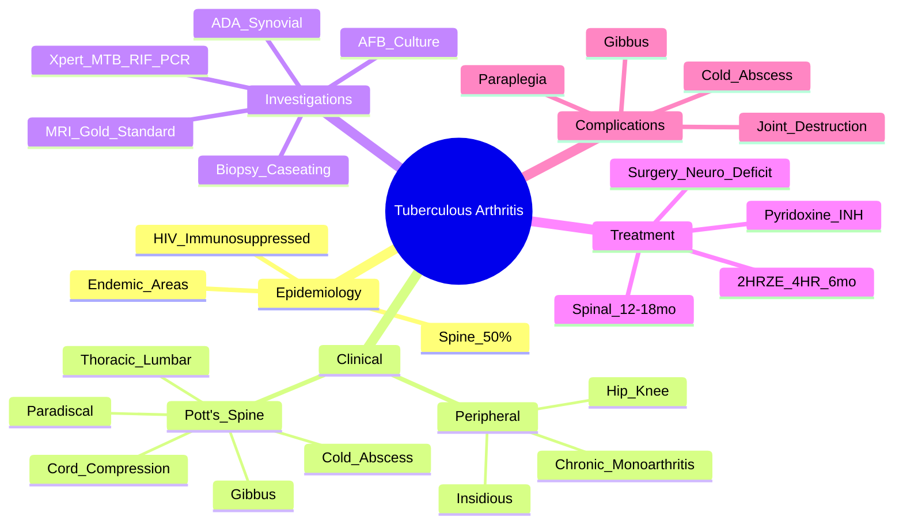

# Tuberculous Arthritis

> [!tip] **FCPS/MRCP Priority: HIGH**
> TB arthritis = **chronic monoarthritis** in endemic areas. **Pott's spine (spinal TB)** = thoracic > lumbar, **paradiscal destruction**, **gibbus deformity**, **cold abscess**. **MRI = gold standard**. **Standard anti-TB (2HRZE/4HR)**, 12-18 months for spinal TB.

---

## Learning Objectives
By the end of this note you should be able to:
- [ ] Recognise **chronic monoarthritis in endemic area = TB until proven otherwise**
- [ ] Describe **Pott's spine**: thoracic > lumbar, **paradiscal destruction**, **preserved disc initially**, **gibbus deformity**, **cold abscess**
- [ ] Select and interpret investigations: **AFB culture (low yield), Xpert MTB/RIF PCR, ADA, MRI, biopsy**
- [ ] Apply **standard anti-TB regimen (2HRZE/4HR)** — **12-18 months for spinal TB**
- [ ] Recognise **cold abscess** (tracks along fascial planes, psoas abscess → groin/thigh)
- [ ] Differentiate from pyogenic septic arthritis, brucellar arthritis, fungal

---

## 1. Definition & Epidemiology

| Feature | Detail |
|---------|--------|
| **Definition** | **Chronic granulomatous infection** of joint/synovium/spine by **Mycobacterium tuberculosis** — haematogenous spread or contiguous from adjacent osteomyelitis |
| **Global Burden** | **10 million new TB/year** (WHO); **1-3% develop skeletal TB**; **50% of skeletal TB = spinal (Pott's)** |
| **Endemic Areas** | **High burden**: India, China, Indonesia, Philippines, Pakistan, Nigeria, South Africa, Bangladesh |
| **Risk Factors** | **Immunocompromised** (HIV, steroids, biologics), **malnutrition**, **alcoholism**, **diabetes**, **endemic residence**, **close contact** |
| **Age** | **All ages** — children/young adults (spinal), adults (peripheral joints) |
| **Joint Distribution** | **Spine (Pott's) 50%**, **Hip > Knee > Ankle > Wrist > Elbow > Shoulder** |

---

## 2. Clinical Features

### Peripheral Joint TB (Chronic Monoarthritis)
| Feature | Description |
|---------|-------------|
| **Onset** | **Insidious**, weeks to months |
| **Joint** | **Monoarticular** (hip > knee > ankle) |
| **Symptoms** | Pain, swelling, stiffness, limited ROM |
| **Systemic** | **Low-grade fever, night sweats, weight loss, malaise** (may be absent in early disease) |
| **Examination** | Large effusion, warmth, **muscle wasting** (quadriceps if knee/hip), **sinus formation** (late) |

### Pott's Spine (Spinal TB) — **50% of Skeletal TB**
| Feature | Description |
|---------|-------------|
| **Site** | **Thoracic > Thoracolumbar > Lumbar** (cervical rare) |
| **Pattern** | **Paradiscal destruction** (two adjacent vertebral bodies + intervening disc) |
| **Key Radiological Signs** | **Disc space preserved early** (unlike pyogenic), **paravertebral abscess**, **vertebral collapse** → **gibbus deformity** (kyphosis) |
| **Cold Abscess** | **Paravertebral/psoas** — **tracks along fascial planes**; **psoas abscess → groin/thigh swelling**, hip flexion deformity |
| **Neurological** | **Cord compression** → paraplegia; **radiculopathy**; **sphincter disturbance** |
| **Systemic** | Fever, night sweats, weight loss, malaise (often prominent) |

> [!critical] **Pott's Spine Key Differentiators from Pyogenic Spondylodiscitis**
> - **Paradiscal** (TB) vs **Intervertebral** (pyogenic)
> - **Disc preserved early** (TB) vs **Disc destroyed early** (pyogenic)
> - **Cold abscess** (TB) tracks along planes vs **localised abscess** (pyogenic)
> - **Slow, insidious** (TB) vs **Acute, febrile** (pyogenic)

---

## 3. Investigations

### Synovial Fluid / Aspirate
| Parameter | TB Arthritis |
|-----------|--------------|
| **Appearance** | Clear to turbid, **rice-water** |
| **WBC** | **Moderate** (5,000-50,000) — **lymphocytic predominance** |
| **Glucose** | **Low** (<40 mg/dL or <50% serum) |
| **Protein** | **High** |
| **AFB Smear** | **Negative in 80-90%** (low yield) |
| **AFB Culture** | **Positive 30-50%** (gold standard but slow: 4-8 weeks) |
| **Xpert MTB/RIF (PCR)** | **Rapid (2h), sensitivity ~80%** — **1st line diagnostic** |
| **ADA (Adenosine Deaminase)** | **>30 U/L suggestive** (synovial fluid); **>40 U/L** in ascites/pleural |

### Imaging
| Modality | Findings |
|----------|----------|
| **X-ray (Peripheral)** | Osteoporosis, joint space narrowing (late), erosions, sequestrum |
| **X-ray (Pott's)** | **Paradiscal destruction**, **disc preserved early**, **vertebral collapse**, **gibbus**, **paravertebral abscess** |
| **MRI** | **Gold standard** — marrow oedema, **abscess**, **cord compression**, **soft tissue extent** |
| **CT** | Bony detail, surgical planning, cold abscess tracking |
| **Bone Scan** | Increased uptake (polyostotic involvement) |

### Diagnostic Algorithm
```mermaid
flowchart TD
    A[Chronic Monoarthritis / Back Pain + Constitutional] --> B[Endemic Area / HIV / Immunosuppressed?]
    B -->|Yes| C[**MRI + Xpert MTB/RIF + AFB Culture + Biopsy**]
    B -->|No| D[Consider Other Causes\n(Brucella, Fungal, Pyogenic)]
    C --> E[Xpert MTB/RIF Positive?]
    E -->|Yes| F[**Start Anti-TB Immediately**]
    E -->|No| G[AFB Culture + Histology\n(Caseating Granuloma)]
    G -->|Positive| F
    G -->|Negative| H[Clinical Judgement\nTherapeutic Trial if High Suspicion]
```

### Diagnostic Yields
| Test | Sensitivity | Turnaround |
|------|-------------|------------|
| **Xpert MTB/RIF** | ~80% (smear+) ~50% (smear-) | **2 hours** |
| **AFB Culture** | 30-50% | **4-8 weeks** |
| **Histology (Caseating Granuloma)** | ~70-80% | Days |
| **ADA (Synovial Fluid >30 U/L)** | ~80% | Hours |
| **IGRA / TST** | Supportive (not diagnostic) | 24-48h |

---

## 4. Management — **Standard Anti-TB Therapy**

### Drug Regimens
| Phase | Drugs | Duration |
|-------|-------|----------|
| **Intensive (2 months)** | **HRZE** (Isoniazid, Rifampicin, Pyrazinamide, Ethambutol) | **2 months** |
| **Continuation (4 months)** | **HR** (Isoniazid, Rifampicin) | **4 months** |
| **Total (Peripheral)** | **2HRZE/4HR** | **6 months** |
| **Total (Spinal/Pott's)** | **2HRZE/4HR** | **12-18 months** (extend if neurological deficit) |

### Drug Dosing (Daily)
| Drug | Dose | Key Monitoring |
|------|------|----------------|
| **Isoniazid (H)** | 5mg/kg (max 300mg) | **Pyridoxine 10mg** (prevent neuropathy); LFT |
| **Rifampicin (R)** | 10mg/kg (max 600mg) | LFT, orange body fluids, **drug interactions** (CYP450 inducer) |
| **Pyrazinamide (Z)** | 25mg/kg (max 2g) | **Hyperuricaemia** (gout flare), LFT |
| **Ethambutol (E)** | 15mg/kg (max 1.2g) | **Visual acuity/colour vision** (optic neuritis); **renal dose adjust** |

> [!critical] **Pyridoxine 10mg daily WITH Isoniazid** — prevents peripheral neuropathy

### Spinal TB Specifics
| Aspect | Detail |
|--------|--------|
| **Duration** | **12-18 months** (extend if neurological deficit) |
| **Surgery Indications** | **Neurological deficit** (cord compression), **spinal instability**, **large abscess** causing compression, **deformity progression** (gibbus) |
| **Decompression** | Anterior (corpectomy + fusion) or posterior; **early decompression = better neurological recovery** |
| **Cold Abscess** | **No routine drainage** — resolves with anti-TB; **aspirate if diagnostic uncertainty** |

---

## 5. Differential Diagnosis

| Feature | **TB Arthritis** | **Pyogenic Septic Arthritis** | **Brucellar Arthritis** |
|---------|------------------|------------------------------|------------------------|
| **Onset** | Insidious (weeks-months) | **Acute (hours-days)** | Subacute |
| **Fever** | Low-grade, night sweats | **High, toxic** | Undulant, night sweats |
| **Joint** | Mono, chronic | Mono, **acute hot** | Sacroiliac > peripheral |
| **Synovial WBC** | Moderate, lymphocytic | **>50,000, neutrophilic** | Moderate, mixed |
| **Culture** | AFB +ve (slow), PCR | **Bacterial +ve (rapid)** | Brucella (slow, CO2) |
| **Imaging** | Paradiscal (spine), late destruction | Rapid destruction | Sacroiliitis, osteomyelitis |

---

## 5. Complications

| Complication | Detail |
|--------------|--------|
| **Joint Destruction** | Late — irreversible osteoarthritis, ankylosis |
| **Spinal Deformity** | **Gibbus (kyphosis)** — cosmetic, respiratory compromise |
| **Paraplegia** | **Cord compression** — emergency decompression |
| **Cold Abscess** | Tracks along fascial planes; **psoas → groin/thigh**; **sinus formation** |
| **Pathological Fracture** | Vertebral collapse |
| **Disseminated TB** | Miliary TB, meningitis |

---

## 6. FCPS/MRCP High-Yield Summary

| Topic | Key Points |
|-------|------------|
| **Epidemiology** | Endemic areas, HIV, immunocompromised; **Spine 50%** of skeletal TB |
| **Pott's Spine** | **Thoracic > Lumbar**; **Paradiscal destruction**, **disc preserved early**, **gibbus**, **cold abscess** |
| **Cold Abscess** | **Sterile**, tracks along fascial planes; **psoas abscess → groin/thigh**, hip flexion |
| **Diagnosis** | **Xpert MTB/RIF (PCR) 1st line** (2h); **AFB culture 30-50%**; MRI gold standard |
| **Peripheral TB** | **Hip > Knee**; chronic monoarthritis, insidious, constitutional symptoms |
| **Synovial Fluid** | Lymphocytic, low glucose, high protein, **AFB smear negative 80%**, culture 30-50% |
| **Treatment** | **2HRZE/4HR = 6 months** (peripheral); **12-18 months** (spinal); **Pyridoxine with INH** |
| **Surgery** | Neurological deficit, instability, large abscess, progressive deformity |
| **Pyridoxine** | **10mg daily with Isoniazid** — prevents neuropathy |

---

## 6. Viva Questions (MRCP PACES / FCPS)

| Question | Expected Answer |
|----------|----------------|
| "A 30yo immigrant from high TB burden country presents with 3 months of hip pain, low-grade fever, weight loss. MRI shows hip joint effusion with synovial enhancement. Synovial fluid: lymphocytic, low glucose. Xpert MTB/RIF positive. Diagnosis and treatment?" | **Tuberculous arthritis of hip**. **Standard anti-TB: 2HRZE/4HR (6 months total)**. Pyridoxine 10mg daily with INH. |
| "What is the classic radiological feature of Pott's spine that distinguishes it from pyogenic spondylodiscitis?" | **Paradiscal destruction with disc space preserved early** (pyogenic = intervertebral, disc destroyed early). |
| "What is a cold abscess in TB spine, and where can it track?" | **Sterile paravertebral/psoas abscess** — tracks along fascial planes; **psoas abscess → groin/thigh**, hip flexion deformity. |
| "What is the standard anti-TB regimen for peripheral joint TB vs spinal TB?" | **Peripheral: 2HRZE/4HR (6 months)**. **Spinal (Pott's): 2HRZE/4HR for 12-18 months** (extend if neuro deficit). |
| "What is the significance of Xpert MTB/RIF in TB joint diagnosis?" | **Rapid molecular test (2h)**, sensitivity ~80% (smear+), ~50% (smear-); **replaces AFB smear as 1st line**; detects rifampicin resistance. |
| "How long do you treat Pott's spine with spinal TB?" | **12-18 months** (standard 6 months extended); extend further if neurological deficit. |
| "What is the role of surgery in Pott's disease?" | **Neurological deficit** (cord compression), **spinal instability**, **large abscess causing compression**, **progressive gibbus deformity**. |
| "Why is pyridoxine given with isoniazid?" | **Prevents peripheral neuropathy** (B6 deficiency). |
| "A patient on anti-TB therapy develops orange discoloration of tears/urine. Which drug?" | **Rifampicin** — harmless, reassure patient. |
| "What is the most common joint affected in peripheral TB arthritis?" | **Hip > Knee > Ankle**. |
| "How does AFB culture yield compare to Xpert MTB/RIF in TB arthritis?" | **AFB culture 30-50%** (4-8 weeks); **Xpert MTB/RIF ~80% smear+, ~50% smear-** (2 hours). |

---

## 7. Confusions & Mnemonics

| Confusion | Clarification |
|-----------|---------------|
| **Pott's vs Pyogenic Spondylodiscitis** | Pott's = **Paradiscal, disc preserved early, cold abscess, slow**. Pyogenic = **Intervertebral, disc destroyed early, hot abscess, acute**. |
| **Cold vs Hot Abscess** | **Cold** = TB, sterile, tracks along planes, **psoas**. **Hot** = pyogenic, purulent, localised, acute. |
| **AFB Smear vs PCR** | Smear = **low sensitivity (10-20%)**, rapid. **PCR (Xpert) = higher sensitivity (80%), 2h**, also detects rifampicin resistance. |
| **Duration: Peripheral vs Spinal** | **Peripheral = 6 months**; **Spinal = 12-18 months** (extend if neuro deficit). |
| **Psoas Abscess = TB until proven otherwise** | In endemic areas, **psoas abscess = TB, brucellosis, Crohn's, lymphoma**. |
| **AFB Culture vs PCR** | Culture = **gold standard but slow (4-8 weeks)**; PCR = **rapid (2h), detects rifampicin resistance**. |

**Mnemonic: Pott's Spine = "P-T-G"**
- **P**aradiscal destruction
- **T**horacic > Lumbar
- **G**ibbus deformity

**Mnemonic: Anti-TB = "2HRZE/4HR"**
- **2** months **HRZE**
- **4** months **HR**
- **Total 6 months** (peripheral) / **12-18 months** (spinal)

**Mnemonic: Cold Abscess = "COLD"**
- **C**old (not hot)
- **O**rganism = TB
- **L**ong-tracking (fascial planes)
- **D**ry/sterile

**Mnemonic: Anti-TB Drugs = "H-R-Z-E"**
- **H** = Isoniazid (+ **Pyridoxine**)
- **R** = Rifampicin (orange fluids, CYP450 inducer)
- **Z** = Pyrazinamide (hyperuricaemia, hepatotoxicity)
- **E** = Ethambutol (optic neuritis, visual monitoring)

**Mnemonic: Pott's vs Pyogenic = "DISC"**
- **D**isc = **Preserved** (Pott's) vs **Destroyed** (Pyogenic)
- **I**nsidious onset (Pott's) vs **Acute** (Pyogenic)
- **S**terile cold abscess (Pott's) vs **Purulent** (Pyogenic)
- **C**ord compression (both)

---

## 8. Mind Map



---

## 9. One-Page Revision Card

| Domain | Key Points |
|--------|------------|
| **Epidemiology** | Endemic areas, HIV, immunocompromised; **Spine 50%** of skeletal TB |
| **Pott's Spine** | **Thoracic > Lumbar**; **Paradiscal destruction**, **disc preserved early**, **gibbus**, **cold abscess (psoas)** |
| **Peripheral TB** | **Hip > Knee**; chronic monoarthritis, insidious, constitutional symptoms |
| **Diagnosis** | **Xpert MTB/RIF PCR** (2h, 80% sens); **AFB culture 30-50%**; **MRI gold standard**; **ADA >30 U/L** |
| **Anti-TB Regimen** | **2HRZE/4HR = 6 months** (peripheral); **12-18 months** (spinal/Pott's) |
| **Key Drug SEs** | **INH → Pyridoxine**; **Rifampicin → orange fluids, CYP450**; **PZA → hyperuricaemia, hepatotoxicity** |
| **Surgery** | Neurological deficit, instability, large abscess, progressive gibbus |
| **Pyridoxine** | **10mg daily with INH** — prevents neuropathy |
| **Cold Abscess** | **Sterile**, tracks along fascial planes (psoas → groin/thigh) |

---

## 13. Spaced Repetition Trackers

| Review Interval | Date Completed | Confidence (1-5) | Notes |
|-----------------|----------------|------------------|-------|
| 24 hours | | | |
| 7 days | | | |
| 15 days | | | |
| 30 days | | | |
| 90 days | | | |

---

## 14. Self-Test Scorecard

| Section | Score /5 | Last Attempt |
|---------|----------|--------------|
| Pott's Spine Radiology | | |
| Synovial Fluid Interpretation | | |
| Anti-TB Regimen Selection | | |
| Drug Side Effects | | |
| Surgical Indications | | |
| Viva Questions | | |

---

## Local Navigation
- **Parent Heading**: [[../Infectious Arthritis and Bone Infections|Infectious Arthritis and Bone Infections]]
- **Parent Topic Group**: [[Joint and bone infections]]
- **Chapter Map**: [[../Davidson Chapter 26 - Rheumatology Hierarchy|Rheumatology Hierarchy]]
- **Chapter MOC**: [[../Rheumatology MOC|Rheumatology MOC]]
- **Drug Reference**: [[../../Clinical Approach to Musculoskeletal Disease/Drugs in rheumatology|Drugs in rheumatology]]
- **Related**: [[Osteomyelitis]] · [[Septic arthritis]] · [[Lyme disease]]